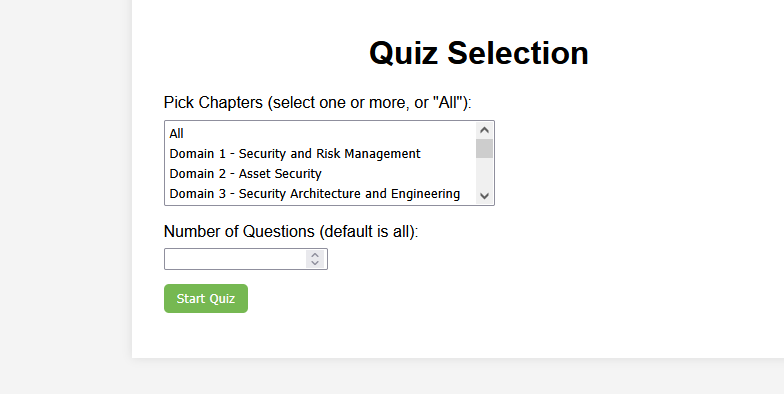

# cissp-study-test
A site made to quiz and test for CISSP self study from book 2025


## Preview of what it looks like:

Select type of questions question:

=======================

Will tell domain and type:

=======================

what if you get it right: 

=======================

What happens if its wrong:

=======================
What happens if you get it wrong or right (it can keep track)


=======================

## Code starts here:

```
<!DOCTYPE html>
<html lang="en">
<head>
	<meta charset="UTF-8">
	<title>Quiz with Selection</title>
	<style>
		body {
			font-family: Arial, sans-serif;
			background-color: #f4f4f4;
			padding: 2em;
		}
		#form-container, #quiz-container {
			background-color: #fff;
			padding: 2em;
			margin: 0 auto;
			width: 50%;
			box-shadow: 0 0 10px rgba(0, 0, 0, 0.1);
		}
		h1, h2, h3 {
			text-align: center;
		}
		label {
			display: block;
			margin: 1em 0 0.5em;
		}
		button {
			display: block;
			margin: 1em 0;
			padding: 0.5em 1em;
			background-color: #76b852;
			color: white;
			border: none;
			border-radius: 5px;
			cursor: pointer;
		}
		button:hover {
			background-color: #5e9b41;
		}
		#progress-bar {
			height: 20px;
			background-color: #eee;
			margin-bottom: 1em;
			border-radius: 10px;
			overflow: hidden;
		}
		#progress {
			height: 100%;
			background-color: #76b852;
			transition: width 0.4s ease-in-out;
		}
		.correct {
			background-color: lightgreen;
		}
		.incorrect {
			background-color: salmon;
		}
		.option {
			margin: 10px 0;
		}
		.explanation {
			padding: 1em;
			margin-top: 1em;
			border-radius: 5px;
		}
		#timer {
			width: 75%;
			text-align: right;
			border-collapse: collapse;
			margin-left: 5em;
		}

		#results-table {
			width: 100%;
			border-collapse: collapse;
			margin-top: 2em;
		}
		#results-table th, #results-table td {
			border: 1px solid #ddd;
			padding: 8px;
		}
		#results-table th {
			background-color: #f2f2f2;
			text-align: left;
		}
	</style>
	<script>
		const QuizStateName = "UdemyCissp3200";
		function encodeBase64(str) {
			return btoa(unescape(encodeURIComponent(str)));
		}

		function decodeBase64(str) {
			return decodeURIComponent(escape(atob(str)));
		}


function escapeHTML(str) {
	const div = document.createElement("div");
	div.innerText = str;
	return div.innerHTML;
}

	let timerInterval;
	let timerStart;
	let totalElapsedTime = 0; // Tracks total time spent across all questions
	let questionCount = 0; // Number of questions attempted

	function startTimer() {
		const timerDisplay = document.getElementById('timer');
		timerStart = Date.now();
		timerInterval = setInterval(() => {
			const elapsed = Math.floor((Date.now() - timerStart) / 1000);
			timerDisplay.textContent = `Time: ${elapsed} seconds`;
		}, 1000);
	}

	function stopTimer() {
		if (timerInterval) {
			clearInterval(timerInterval);
			const elapsed = Math.floor((Date.now() - timerStart) / 1000);
			totalElapsedTime += elapsed; // Add elapsed time for the current question
			questionCount++; // Increment question count
		}
	}

	function resetTimer() {
		stopTimer();
		const timerDisplay = document.getElementById('timer');
		if (timerDisplay) {
			timerDisplay.textContent = 'Time: 0 seconds';
		}
	}

	function calculateAverageTime() {
		return questionCount > 0 ? (totalElapsedTime / questionCount).toFixed(2) : '0.00';
	}
 
		let questions_db = [{"section": "Domain 1 - Security and Risk Management", "chapter": "The Security Objective and CIA Triad", "ch": "", "text": "What is the primary goal of implementing the CIA Triad in information security management?", "options": ["To ensure that information is available only to authorized users", "To balance confidentiality, integrity, and availability to protect information assets", "To prevent all unauthorized access to information and systems", "To maintain data integrity against all external threats"], "answers": ["To balance confidentiality, integrity, and availability to protect information assets"], "is_multiselect": false, "explanation": "availability to protect information assets The CIA Triad is designed to provide a balanced approach to protecting information by ensuring confidentiality, integrity, and availability."}, {"section": "Domain 1 - Security and Risk Management", "chapter": "The Security Objective and CIA Triad", "ch": "", "text": "How does the principle of least privilege support the CIA Triad?", "options": ["By ensuring availability through unrestricted access", "By maintaining confidentiality by restricting user access to only what is necessary", "By focusing solely on integrity through robust authentication measures", "By ensuring that all users can access all resources at any time"], "answers": ["By maintaining confidentiality by restricting user access to only what is necessary"], "is_multiselect": false, "explanation": "user access to only what is necessary The principle of least privilege supports the CIA Triad by limiting user access to data and systems, thereby maintaining confidentiality and integrity."}, {"section": "Domain 1 - Security and Risk Management", "chapter": "The Security Objective and CIA Triad", "ch": "", "text": "Which of the following best describes integrity within the CIA Triad?", "options": ["Ensuring that information is accurate and reliable", "Ensuring that information is accessible to authorized users", "Ensuring that information is kept secret from unauthorized users", "Ensuring that all information is encrypted during transmission"], "answers": ["Ensuring that information is accurate and reliable"], "is_multiselect": false, "explanation": "reliable Integrity in the CIA Triad refers to the accuracy and reliability of information, ensuring that data is not altered improperly."}, {"section": "Domain 1 - Security and Risk Management", "chapter": "The Security Objective and CIA Triad", "ch": "", "text": "What is the role of availability in the CIA Triad?", "options": ["To ensure that information remains confidential", "To ensure that data is unaltered and reliable", "To guarantee that information is accessible whenever needed by authorized users", "To ensure that only authorized changes are made to data"], "answers": ["To guarantee that information is accessible whenever needed by authorized users"], "is_multiselect": false, "explanation": "whenever needed by authorized users Availability in the CIA Triad ensures that information is accessible to authorized users when needed, preventing service disruptions."}, {"section": "Domain 1 - Security and Risk Management", "chapter": "The Security Objective and CIA Triad", "ch": "", "text": "Which method best supports confidentiality in the CIA Triad?", "options": ["Implementing a robust authentication mechanism", "Encrypting sensitive data both at rest and in transit", "Ensuring regular data backups are performed", "Conducting frequent integrity checks on data"], "answers": ["Encrypting sensitive data both at rest and in transit"], "is_multiselect": false, "explanation": "transit Encryption is a key method for maintaining confidentiality by preventing unauthorized access to data, both in storage and during transmission."}, {"section": "Domain 1 - Security and Risk Management", "chapter": "The Security Objective and CIA Triad", "ch": "", "text": "How can redundancy improve the availability aspect of the CIA Triad?", "options": ["By providing multiple layers of encryption for data transmission", "By ensuring that systems remain operational even if one component fails", "By logging all user access to sensitive data", "By implementing strict access controls across all systems"], "answers": ["By ensuring that systems remain operational even if one component fails"], "is_multiselect": false, "explanation": "even if one component fails Redundancy, such as having backup systems, ensures continuous operation and supports the availability of information resources."}, {"section": "Domain 1 - Security and Risk Management", "chapter": "The Security Objective and CIA Triad", "ch": "", "text": "Which of the following is a potential risk to the integrity component of the CIA Triad?", "options": ["Unauthorized data disclosure", "Data corruption due to malware", "Denial-of-service attacks", "Lack of encryption for sensitive data"], "answers": ["Data corruption due to malware"], "is_multiselect": false, "explanation": "Integrity risks involve unauthorized or accidental alteration of data, such as through corruption caused by malware."}, {"section": "Domain 1 - Security and Risk Management", "chapter": "The Security Objective and CIA Triad", "ch": "", "text": "In the context of the CIA Triad, what is the primary purpose of implementing access control mechanisms?", "options": ["To ensure all users have unrestricted access to information", "To verify the identity of users accessing the system", "To restrict access to information based on user roles and permissions", "To ensure all data is encrypted during transmission"], "answers": ["To restrict access to information based on user roles and permissions"], "is_multiselect": false, "explanation": "roles and permissions Access control mechanisms are essential for maintaining confidentiality and integrity by restricting information access based on user roles and permissions."}, {"section": "Domain 1 - Security and Risk Management", "chapter": "The Security Objective and CIA Triad", "ch": "", "text": "What is a common challenge when balancing the CIA Triad components in an organization?", "options": ["Achieving maximum confidentiality without affecting availability", "Ensuring data integrity without any form of encryption", "Maintaining availability by eliminating all security controls", "Enhancing confidentiality by increasing data redundancy"], "answers": ["Achieving maximum confidentiality without affecting availability"], "is_multiselect": false, "explanation": "affecting availability Balancing the CIA Triad often involves trade-offs, such as achieving high confidentiality without adversely impacting availability."}, {"section": "Domain 1 - Security and Risk Management", "chapter": "The Security Objective and CIA Triad", "ch": "", "text": "How does network segmentation support the CIA Triad?", "options": ["By ensuring that all parts of the network are equally accessible", "By isolating sensitive data to reduce exposure risks", "By guaranteeing that data remains unaltered across the network", "By providing a single point of access for all network resources"], "answers": ["By isolating sensitive data to reduce exposure risks"], "is_multiselect": false, "explanation": "risks Network segmentation enhances confidentiality and integrity by isolating sensitive data and reducing potential exposure to unauthorized access."}, {"section": "Domain 1 - Security and Risk Management", "chapter": "The Security Objective and CIA Triad", "ch": "", "text": "What is a primary benefit of integrating the CIA Triad into an organization's risk management strategy?", "options": ["It simplifies decision-making by focusing solely on confidentiality", "It provides a holistic approach to protect information assets comprehensively", "It ensures data availability even in the event of a breach", "It eliminates the need for other security frameworks and controls"], "answers": ["It provides a holistic approach to protect information assets comprehensively"], "is_multiselect": false, "explanation": "information assets comprehensively Integrating the CIA Triad into risk management provides a comprehensive framework for protecting information assets, balancing confidentiality, integrity, and availability."}, {"section": "Domain 1 - Security and Risk Management", "chapter": "Cyber Security, Information Security and Information Assurance", "ch": "", "text": "Which of the following best describes the relationship between Information Security and Information Assurance in the context of risk management?", "options": ["Information Security is a subset of Information Assurance that focuses on protecting information and information systems.", "Information Assurance is a subset of Information Security that focuses on protecting information systems from unauthorized access.", "Information Security and Information Assurance are interchangeable terms with no distinct differences.", "Information Assurance focuses solely on compliance and auditing, while Information Security focuses on technical safeguards."], "answers": ["Information Security is a subset of Information Assurance that focuses on protecting information and information systems."], "is_multiselect": false, "explanation": "Assurance that focuses on protecting information and information systems. Information Security is a component of Information Assurance, which is the overarching discipline that includes protection, detection, and response capabilities to manage risk."}, {"section": "Domain 1 - Security and Risk Management", "chapter": "Cyber Security, Information Security and Information Assurance", "ch": "", "text": "In the context of cyber security, which of the following is the primary objective of implementing a risk management strategy?", "options": ["To eliminate all risks associated with information systems.", "To understand and accept all risks associated with information systems.", "To balance risk against cost and effort associated with protection measures.", "To transfer all risks through insurance and outsourcing."], "answers": ["To balance risk against cost and effort associated with protection measures."], "is_multiselect": false, "explanation": "associated with protection measures. The primary objective is to balance risk against the cost and effort of implementing protection measures, ensuring resources are used efficiently to protect information assets."}, {"section": "Domain 1 - Security and Risk Management", "chapter": "Cyber Security, Information Security and Information Assurance", "ch": "", "text": "Which of the following best defines the term \"cybersecurity resilience\"?", "options": ["The ability to prevent all cyber attacks through robust security measures.", "The capacity to withstand, respond to, and recover from cyber incidents.", "The implementation of redundant systems to ensure 100% uptime.", "The process of identifying vulnerabilities and threats to reduce risk."], "answers": ["The capacity to withstand, respond to, and recover from cyber incidents."], "is_multiselect": false, "explanation": "recover from cyber incidents. Cybersecurity resilience is about the ability to withstand, respond to, and recover from cyber incidents, maintaining operations despite disruptions."}, {"section": "Domain 1 - Security and Risk Management", "chapter": "Cyber Security, Information Security and Information Assurance", "ch": "", "text": "What is the primary role of an Information Security Governance framework?", "options": ["To ensure that all security incidents are reported and analyzed.", "To align security initiatives with business objectives and regulatory requirements.", "To provide technical solutions to mitigate identified security risks.", "To enforce strict compliance with security policies across the organization."], "answers": ["To align security initiatives with business objectives and regulatory requirements."], "is_multiselect": false, "explanation": "objectives and regulatory requirements. The primary role of an Information Security Governance framework is to align security activities with business objectives and regulatory requirements, ensuring strategic oversight and accountability."}, {"section": "Domain 1 - Security and Risk Management", "chapter": "Cyber Security, Information Security and Information Assurance", "ch": "", "text": "How does Information Assurance differ from traditional Information Security practices?", "options": ["Information Assurance focuses exclusively on legal and regulatory compliance.", "Information Assurance includes managing risks related to availability, integrity, and confidentiality.", "Information Assurance is only concerned with protecting data in transit.", "Information Assurance is primarily about monitoring and detecting security breaches."], "answers": ["Information Assurance includes managing risks related to availability, integrity, and confidentiality."], "is_multiselect": false, "explanation": "related to availability, integrity, and confidentiality. Information Assurance takes a holistic approach to managing risks related to the availability, integrity, and confidentiality of information, beyond just protection."}, {"section": "Domain 1 - Security and Risk Management", "chapter": "Cyber Security, Information Security and Information Assurance", "ch": "", "text": "In risk management, which of the following is a key benefit of conducting a Business Impact Analysis (BIA)?", "options": ["Identifying all potential threats to an organization.", "Prioritizing recovery strategies based on their impact on business operations.", "Determining the cost of implementing all necessary security controls.", "Establishing a complete asset inventory for security purposes."], "answers": ["Prioritizing recovery strategies based on their impact on business operations."], "is_multiselect": false, "explanation": "impact on business operations. Conducting a Business Impact Analysis (BIA) allows an organization to prioritize recovery strategies by understanding the impact of disruptions on business operations."}, {"section": "Domain 1 - Security and Risk Management", "chapter": "Cyber Security, Information Security and Information Assurance", "ch": "", "text": "Which of the following statements is true about the risk assessment process in cybersecurity?", "options": ["It aims to eliminate all risks associated with business operations.", "It identifies, evaluates, and prioritizes risks to inform decision- making.", "It is a one-time activity conducted at the start of a project.", "It focuses solely on external threats to the organization."], "answers": ["It identifies, evaluates, and prioritizes risks to inform decision- making."], "is_multiselect": false, "explanation": "inform decision-making. The risk assessment process involves identifying, evaluating, and prioritizing risks to inform decision-making in cybersecurity management."}, {"section": "Domain 1 - Security and Risk Management", "chapter": "Cyber Security, Information Security and Information Assurance", "ch": "", "text": "What is the significance of the principle of \"least privilege\" in the context of Information Security?", "options": ["It ensures that users have access to all the resources they might need in the future.", "It reduces the risk of unauthorized access by limiting user permissions to the minimum required.", "It is primarily used for physical security of an organization's premises.", "It involves regular audits of all user activities to detect anomalies."], "answers": ["It reduces the risk of unauthorized access by limiting user permissions to the minimum required."], "is_multiselect": false, "explanation": "limiting user permissions to the minimum required. The principle of \"least privilege\" is significant because it reduces the risk of unauthorized access by limiting user permissions to the minimum required for their job functions."}, {"section": "Domain 1 - Security and Risk Management", "chapter": "Cyber Security, Information Security and Information Assurance", "ch": "", "text": "In the context of information security, what is the primary purpose of implementing a data classification scheme?", "options": ["To ensure that all data is encrypted and secure.", "To organize data into categories based on sensitivity and impact to the organization.", "To reduce the amount of data stored by an organization.", "To facilitate data backup and recovery processes."], "answers": ["To organize data into categories based on sensitivity and impact to the organization."], "is_multiselect": false, "explanation": "sensitivity and impact to the organization. The primary purpose of a data classification scheme is to organize data into categories based on sensitivity and impact, which guides the implementation of appropriate security measures."}, {"section": "Domain 1 - Security and Risk Management", "chapter": "Cyber Security, Information Security and Information Assurance", "ch": "", "text": "Which of the following best exemplifies the concept of \"defense in depth\" in cybersecurity?", "options": ["Relying on a single, robust firewall to protect the network.", "Implementing multiple layers of security controls across the organization.", "Regularly updating antivirus software on all devices.", "Conducting annual security awareness training for all employees."], "answers": ["Implementing multiple layers of security controls across the organization."], "is_multiselect": false, "explanation": "controls across the organization. \"Defense in depth\" is a cybersecurity strategy that involves implementing multiple layers of security controls throughout an organization to protect against threats."}, {"section": "Domain 1 - Security and Risk Management", "chapter": "Cyber Security, Information Security and Information Assurance", "ch": "", "text": "What is the primary benefit of integrating security risk management into the overall enterprise risk management (ERM) framework?", "options": ["It allows for complete elimination of all security risks.", "It ensures that security risks are considered within the context of overall business risks.", "It focuses solely on technical risks associated with information systems.", "It requires the establishment of a separate security department within the organization."], "answers": ["It ensures that security risks are considered within the context of overall business risks."], "is_multiselect": false, "explanation": "the context of overall business risks. Integrating security risk management into the overall ERM framework ensures that security risks are considered within the broader context of business risks, leading to a more cohesive and comprehensive risk management approach."}, {"section": "Domain 1 - Security and Risk Management", "chapter": "ISC2 Code of Ethics", "ch": "", "text": "Which principle of the ISC2 Code of Ethics primarily emphasizes the need to protect society's infrastructure?", "options": ["Protect infrastructure as a priority", "Act honorably, honestly, justly, responsibly, and legally", "Advance and protect the profession", "Protect society, the commonwealth, and the infrastructure"], "answers": ["Protect society, the commonwealth, and the infrastructure"], "is_multiselect": false, "explanation": "infrastructure The ISC2 Code of Ethics specifically lists the protection of society and infrastructure as an ethical responsibility."}, {"section": "Domain 1 - Security and Risk Management", "chapter": "ISC2 Code of Ethics", "ch": "", "text": "What action should a CISSP take when confronted with a conflict of interest according to the ISC2 Code of Ethics?", "options": ["Ignore the conflict and prioritize company goals", "Disclose the conflict and seek guidance", "Resolve it independently without disclosure", "Avoid the situation entirely"], "answers": ["Disclose the conflict and seek guidance"], "is_multiselect": false, "explanation": "Disclosing conflicts of interest is crucial to maintaining trust and integrity in decision-making processes."}, {"section": "Domain 1 - Security and Risk Management", "chapter": "ISC2 Code of Ethics", "ch": "", "text": "How does the ISC2 Code of Ethics suggest handling sensitive information?", "options": ["Share with colleagues to ensure transparency", "Encrypt and share only with authorized personnel", "Hide it to prevent any form of access", "Destroy it as soon as it's received"], "answers": ["Encrypt and share only with authorized personnel"], "is_multiselect": false, "explanation": "personnel The ethical approach is to protect sensitive information by limiting access and ensuring it is only shared with authorized individuals."}, {"section": "Domain 1 - Security and Risk Management", "chapter": "ISC2 Code of Ethics", "ch": "", "text": "Which of the following best describes the ISC2 Code of Ethics' stance on legal compliance?", "options": ["Follow laws only when convenient", "Ensure compliance with both local and international laws", "Prioritize company policy over legal requirements", "Ignore laws that do not apply directly to security"], "answers": ["Ensure compliance with both local and international laws"], "is_multiselect": false, "explanation": "international laws The ISC2 Code of Ethics requires adherence to both local and international laws to uphold integrity and legality."}, {"section": "Domain 1 - Security and Risk Management", "chapter": "ISC2 Code of Ethics", "ch": "", "text": "According to the ISC2 Code of Ethics, how should a CISSP approach professional development?", "options": ["Focus solely on technical skills", "Pursue continuous education and skill enhancement", "Only seek certifications for career advancement", "Rely on experience over formal education"], "answers": ["Pursue continuous education and skill enhancement"], "is_multiselect": false, "explanation": "enhancement Continuous education and skill enhancement are vital for staying current and maintaining professional standards."}, {"section": "Domain 1 - Security and Risk Management", "chapter": "ISC2 Code of Ethics", "ch": "", "text": "What is the most ethical way to deal with a colleague who is violating the ISC2 Code of Ethics?", "options": ["Report them to the authorities immediately", "Discuss the issue directly with the colleague", "Ignore the issue to maintain workplace harmony", "Document and wait for more evidence"], "answers": ["Discuss the issue directly with the colleague"], "is_multiselect": false, "explanation": "Addressing the colleague directly allows for resolution while maintaining professional relationships and integrity."}, {"section": "Domain 1 - Security and Risk Management", "chapter": "ISC2 Code of Ethics", "ch": "", "text": "In the ISC2 Code of Ethics, what is the primary reason for advancing and protecting the profession?", "options": ["To increase personal earning potential", "To ensure the integrity and trust in the profession", "To replace outdated practices with new ones", "To compete with other professions"], "answers": ["To ensure the integrity and trust in the profession"], "is_multiselect": false, "explanation": "profession The main goal is to maintain and elevate the integrity and trust in the information security profession."}, {"section": "Domain 1 - Security and Risk Management", "chapter": "ISC2 Code of Ethics", "ch": "", "text": "How should a CISSP handle proprietary information of a former employer, according to the ISC2 Code of Ethics?", "options": ["Share it with current employer for competitive advantage", "Keep it confidential and separate from current work", "Use it as a benchmark for current projects", "Disregard it as no longer relevant"], "answers": ["Keep it confidential and separate from current work"], "is_multiselect": false, "explanation": "work Maintaining confidentiality of a former employer's information is crucial to uphold ethical and legal standards."}, {"section": "Domain 1 - Security and Risk Management", "chapter": "ISC2 Code of Ethics", "ch": "", "text": "What role does fairness play in the ISC2 Code of Ethics?", "options": ["It's secondary to company rules", "It is a core component of ethical conduct", "It should be considered only when convenient", "It is only applicable in legal contexts"], "answers": ["It is a core component of ethical conduct"], "is_multiselect": false, "explanation": "Fairness is a fundamental part of ethical conduct, ensuring impartiality and justice in professional actions."}, {"section": "Domain 1 - Security and Risk Management", "chapter": "ISC2 Code of Ethics", "ch": "", "text": "How should a CISSP address a potential security threat that contradicts current organizational policy?", "options": ["Ignore it to avoid conflict with policy", "Report it and recommend policy review", "Implement fixes without informing management", "Wait for policy change before taking action"], "answers": ["Report it and recommend policy review"], "is_multiselect": false, "explanation": "Reporting the threat and recommending policy review ensures that security concerns are addressed responsibly."}, {"section": "Domain 1 - Security and Risk Management", "chapter": "ISC2 Code of Ethics", "ch": "", "text": "According to the ISC2 Code of Ethics, what is the fundamental responsibility of a CISSP towards society?", "options": ["Maximize company profits", "Protect society, the commonwealth, and the infrastructure", "Focus solely on personal career development", "Innovate security solutions for industry recognition"], "answers": ["Protect society, the commonwealth, and the infrastructure"], "is_multiselect": false, "explanation": "infrastructure The ethical duty extends beyond the organization to include the protection of society and its infrastructure."}, {"section": "Domain 1 - Security and Risk Management", "chapter": "Basic Security Terminologies - Security Foundations", "ch": "", "text": "What is the primary purpose of implementing a security governance framework within an organization?", "options": ["To ensure compliance with legal and regulatory requirements", "To align security initiatives with business objectives", "To reduce operational costs", "To enforce strict security policies"], "answers": ["To align security initiatives with business objectives"], "is_multiselect": false, "explanation": "objectives Security governance aligns security strategies with business goals, ensuring resources are used effectively."}, {"section": "Domain 1 - Security and Risk Management", "chapter": "Basic Security Terminologies - Security Foundations", "ch": "", "text": "In risk management, what does the term \"residual risk\" refer to?", "options": ["The risk that remains after all controls are implemented", "The risk that is transferred to a third party", "The risk that is completely eliminated", "The risk that occurs as a result of human error"], "answers": ["The risk that remains after all controls are implemented"], "is_multiselect": false, "explanation": "implemented Residual risk is the remaining risk after all mitigation efforts have been implemented."}, {"section": "Domain 1 - Security and Risk Management", "chapter": "Basic Security Terminologies - Security Foundations", "ch": "", "text": "Which of the following best describes the concept of 'due care'?", "options": ["Taking actions that are legally required to protect an organization’s assets", "Implementing proactive measures to protect an organization’s assets", "Selecting the least costly option to address security risks", "Deliberately ignoring potential security threats"], "answers": ["Implementing proactive measures to protect an organization’s assets"], "is_multiselect": false, "explanation": "organization’s assets Due care involves acting responsibly and maintaining a standard of care to protect organizational assets."}, {"section": "Domain 1 - Security and Risk Management", "chapter": "Basic Security Terminologies - Security Foundations", "ch": "", "text": "What is the primary focus of the 'availability' component in the CIA triad?", "options": ["Ensuring that information is protected from unauthorized access", "Ensuring that authorized users have access to information and resources when needed", "Ensuring the accuracy and reliability of information", "Ensuring the encryption of sensitive data"], "answers": ["Ensuring that authorized users have access to information and resources when needed"], "is_multiselect": false, "explanation": "information and resources when needed Availability ensures that information and resources are accessible to authorized users when needed."}, {"section": "Domain 1 - Security and Risk Management", "chapter": "Basic Security Terminologies - Security Foundations", "ch": "", "text": "Which of the following is an example of a deterrent control?", "options": ["Security policy", "Firewalls", "Security cameras", "Antivirus software"], "answers": ["Security cameras"], "is_multiselect": false, "explanation": "Deterrent controls, like security cameras, discourage potential violators by increasing the likelihood of detection."}, {"section": "Domain 1 - Security and Risk Management", "chapter": "Basic Security Terminologies - Security Foundations", "ch": "", "text": "What is the primary goal of risk transference?", "options": ["To eliminate all risks", "To shift the impact of risk to a third party", "To accept the potential losses from a risk", "To identify all possible risks in an environment"], "answers": ["To shift the impact of risk to a third party"], "is_multiselect": false, "explanation": "Risk transference involves shifting the potential impact of a risk to another party, usually through insurance or outsourcing."}, {"section": "Domain 1 - Security and Risk Management", "chapter": "Basic Security Terminologies - Security Foundations", "ch": "", "text": "What is the main objective of conducting a Business Impact Analysis (BIA)?", "options": ["To identify potential security threats", "To determine the impact of interruptions on business operations", "To outline technical solutions for disaster recovery", "To create a comprehensive list of all organizational assets"], "answers": ["To determine the impact of interruptions on business operations"], "is_multiselect": false, "explanation": "business operations A BIA determines the impact of operational interruptions to help prioritize recovery strategies and resources."}, {"section": "Domain 1 - Security and Risk Management", "chapter": "Basic Security Terminologies - Security Foundations", "ch": "", "text": "What is the primary role of an Information Security Policy?", "options": ["To outline procedures for daily operations", "To provide a framework for setting security standards and guidelines", "To ensure compliance with international security standards", "To list technical specifications for security systems"], "answers": ["To provide a framework for setting security standards and guidelines"], "is_multiselect": false, "explanation": "standards and guidelines Information Security Policies establish a framework for setting and maintaining security standards across an organization."}, {"section": "Domain 1 - Security and Risk Management", "chapter": "Basic Security Terminologies - Security Foundations", "ch": "", "text": "Which of the following is a characteristic of symmetric encryption?", "options": ["It uses different keys for encryption and decryption", "It is generally slower than asymmetric encryption", "It uses the same key for both encryption and decryption", "It cannot be used for large data encryption"], "answers": ["It uses the same key for both encryption and decryption"], "is_multiselect": false, "explanation": "decryption Symmetric encryption uses the same key for both encryption and decryption, making it fast and efficient for large data."}, {"section": "Domain 1 - Security and Risk Management", "chapter": "Basic Security Terminologies - Security Foundations", "ch": "", "text": "In the context of information security, what does the principle of least privilege mean?", "options": ["Granting users access to all resources they might need in the future", "Ensuring users have access to all levels of data for collaboration", "Granting users the minimum access necessary to perform their job functions", "Ensuring users have no access to sensitive data"], "answers": ["Granting users the minimum access necessary to perform their job functions"], "is_multiselect": false, "explanation": "to perform their job functions The principle of least privilege ensures users have only the access necessary for their roles, reducing risk exposure."}, {"section": "Domain 1 - Security and Risk Management", "chapter": "Basic Security Terminologies - Security Foundations", "ch": "", "text": "What is the significance of 'separation of duties' in risk management?", "options": ["It ensures one person has complete control over all aspects of a process", "It reduces the risk of fraud and error by dividing tasks among multiple people", "It allows for faster decision-making by consolidating responsibilities", "It simplifies processes by reducing the number of people involved"], "answers": ["It reduces the risk of fraud and error by dividing tasks among multiple people"], "is_multiselect": false, "explanation": "tasks among multiple people Separation of duties reduces the risk of fraud and errors by dividing tasks among multiple individuals, ensuring checks and balances."}, {"section": "Domain 1 - Security and Risk Management", "chapter": "Abstraction of Cyber Attacks", "ch": "", "text": "Which abstraction layer is primarily responsible for separating external and internal network traffic in a security architecture model?", "options": ["Application Layer", "Data Link Layer", "Network Layer", "Perimeter Layer"], "answers": ["Perimeter Layer"], "is_multiselect": false, "explanation": "The perimeter layer is tasked with delineating internal from external traffic, crucial for network security."}, {"section": "Domain 1 - Security and Risk Management", "chapter": "Abstraction of Cyber Attacks", "ch": "", "text": "What is the primary goal of abstracting cyber threats in a layered security approach?", "options": ["Simplification of security protocols", "Enhanced threat detection", "Cost reduction in security measures", "Isolation of attack vectors"], "answers": ["Isolation of attack vectors"], "is_multiselect": false, "explanation": "By abstracting cyber threats, the focus is on isolating attack vectors to protect internal systems effectively."}, {"section": "Domain 1 - Security and Risk Management", "chapter": "Abstraction of Cyber Attacks", "ch": "", "text": "In the context of cyber attack abstraction, which model emphasizes the concept of 'defense in depth'?", "options": ["OSI Model", "TCP/IP Model", "Zero Trust Model", "Castle-and-Moat Model"], "answers": ["Castle-and-Moat Model"], "is_multiselect": false, "explanation": "The Castle-and-Moat model, synonymous with 'defense in depth,' uses multiple layers to protect assets."}, {"section": "Domain 1 - Security and Risk Management", "chapter": "Abstraction of Cyber Attacks", "ch": "", "text": "Which abstraction tactic involves creating a virtual environment to deceive attackers?", "options": ["Sandboxing", "Honeypot", "Tokenization", "Encryption"], "answers": ["Honeypot"], "is_multiselect": false, "explanation": "Honeypots are used to attract and analyze attackers in a controlled setting, abstracting real systems."}, {"section": "Domain 1 - Security and Risk Management", "chapter": "Abstraction of Cyber Attacks", "ch": "", "text": "How does abstraction aid in reducing the attack surface of a system?", "options": ["By simplifying user interfaces", "By masking complex system details", "By segmenting networks", "By encrypting all data"], "answers": ["By segmenting networks"], "is_multiselect": false, "explanation": "Network segmentation abstracts and isolates parts of the network, limiting potential vulnerabilities."}, {"section": "Domain 1 - Security and Risk Management", "chapter": "Abstraction of Cyber Attacks", "ch": "", "text": "What role does abstraction play in the risk management process?", "options": ["Enables risk transference", "Facilitates risk identification", "Supports risk mitigation", "Enhances risk acceptance"], "answers": ["Facilitates risk identification"], "is_multiselect": false, "explanation": "Abstraction helps in identifying risks by revealing patterns and simplifying complex data."}, {"section": "Domain 1 - Security and Risk Management", "chapter": "Abstraction of Cyber Attacks", "ch": "", "text": "Within the context of security models, how does abstraction help in managing data breaches?", "options": ["By obscuring data", "By minimizing access points", "By enhancing encryption", "By simplifying compliance"], "answers": ["By minimizing access points"], "is_multiselect": false, "explanation": "Minimizing access points through abstraction helps in controlling and managing potential data breaches."}, {"section": "Domain 1 - Security and Risk Management", "chapter": "Abstraction of Cyber Attacks", "ch": "", "text": "In what way can abstraction be used to enhance security policy development?", "options": ["By standardizing procedures", "By clarifying roles and responsibilities", "By generalizing threat models", "By specifying control mechanisms"], "answers": ["By generalizing threat models"], "is_multiselect": false, "explanation": "Abstraction allows for the generalization of threat models, aiding in creating comprehensive security policies."}, {"section": "Domain 1 - Security and Risk Management", "chapter": "Abstraction of Cyber Attacks", "ch": "", "text": "How does the abstraction of cyber attacks improve incident response strategies?", "options": ["By automating responses", "By prioritizing threats", "By simplifying threat landscapes", "By increasing alert thresholds"], "answers": ["By simplifying threat landscapes"], "is_multiselect": false, "explanation": "Simplifying the threat landscape helps teams quickly understand and respond to incidents effectively."}, {"section": "Domain 1 - Security and Risk Management", "chapter": "Abstraction of Cyber Attacks", "ch": "", "text": "Which abstraction method involves using fake endpoints to mislead attackers?", "options": ["IP Spoofing", "Deception Networks", "Phishing", "Firewall Rules"], "answers": ["Deception Networks"], "is_multiselect": false, "explanation": "Deception networks create false endpoints to mislead attackers, abstracting real network structures."}, {"section": "Domain 1 - Security and Risk Management", "chapter": "Abstraction of Cyber Attacks", "ch": "", "text": "What is a potential downside of excessive abstraction in cybersecurity?", "options": ["Increased complexity", "Reduced visibility", "Higher costs", "Greater risk exposure"], "answers": ["Reduced visibility"], "is_multiselect": false, "explanation": "Excessive abstraction can lead to a loss of visibility, potentially obscuring important security details."}, {"section": "Domain 1 - Security and Risk Management", "chapter": "Security Vulnerabilities", "ch": "", "text": "What is the primary risk associated with using outdated cryptographic algorithms in secure communications?", "options": ["Reduced data integrity", "Increased vulnerability to attacks", "Higher operational costs", "Regulatory non-compliance"], "answers": ["Increased vulnerability to attacks"], "is_multiselect": false, "explanation": "Using outdated cryptographic algorithms increases the risk of attacks as they may have known vulnerabilities."}, {"section": "Domain 1 - Security and Risk Management", "chapter": "Security Vulnerabilities", "ch": "", "text": "Which approach is most effective for managing zero-day vulnerabilities?", "options": ["Immediate patching", "Threat intelligence", "Increased user training", "Network isolation"], "answers": ["Threat intelligence"], "is_multiselect": false, "explanation": "Utilizing threat intelligence allows organizations to anticipate and mitigate zero-day vulnerabilities proactively."}, {"section": "Domain 1 - Security and Risk Management", "chapter": "Security Vulnerabilities", "ch": "", "text": "What is a major disadvantage of signature-based intrusion detection systems?", "options": ["High false-positive rate", "Ineffective against new threats", "Complex configuration", "Resource-intensive"], "answers": ["Ineffective against new threats"], "is_multiselect": false, "explanation": "Signature-based systems are ineffective against new threats because they rely on pre-existing attack signatures."}, {"section": "Domain 1 - Security and Risk Management", "chapter": "Security Vulnerabilities", "ch": "", "text": "How does risk transference alter the risk exposure of an organization?", "options": ["It eliminates the risk entirely", "It reduces the likelihood of risk occurrence", "It shifts the impact of risk to a third party", "It increases the organization's risk exposure"], "answers": ["It shifts the impact of risk to a third party"], "is_multiselect": false, "explanation": "Risk transference shifts the financial impact of a risk to a third party, often through mechanisms like insurance."}, {"section": "Domain 1 - Security and Risk Management", "chapter": "Security Vulnerabilities", "ch": "", "text": "In a risk assessment, what is the primary purpose of identifying asset vulnerabilities?", "options": ["To eliminate all vulnerabilities", "To prioritize risk management efforts", "To ensure regulatory compliance", "To reduce operational costs"], "answers": ["To prioritize risk management efforts"], "is_multiselect": false, "explanation": "Identifying asset vulnerabilities enables organizations to prioritize their risk management efforts effectively."}, {"section": "Domain 1 - Security and Risk Management", "chapter": "Security Vulnerabilities", "ch": "", "text": "What is a common vulnerability associated with application-layer protocols?", "options": ["Lack of encryption", "Buffer overflows", "Weak authentication", "Denial of service"], "answers": ["Lack of encryption"], "is_multiselect": false, "explanation": "Many application-layer protocols, such as HTTP, transmit data without encryption, leading to potential data interception."}, {"section": "Domain 1 - Security and Risk Management", "chapter": "Security Vulnerabilities", "ch": "", "text": "How does a buffer overflow vulnerability typically allow an attacker to compromise a system?", "options": ["By altering network traffic", "By executing arbitrary code", "By escalating privileges", "By bypassing authentication"], "answers": ["By executing arbitrary code"], "is_multiselect": false, "explanation": "Buffer overflow vulnerabilities allow attackers to execute arbitrary code by overwriting memory beyond the buffer's capacity."}, {"section": "Domain 1 - Security and Risk Management", "chapter": "Security Vulnerabilities", "ch": "", "text": "What is the primary concern with using third-party cloud services for data storage?", "options": ["Increased latency", "Data breaches", "Lack of scalability", "High costs"], "answers": ["Data breaches"], "is_multiselect": false, "explanation": "The primary security concern with third-party cloud services is the risk of data breaches due to shared infrastructure and external management."}, {"section": "Domain 1 - Security and Risk Management", "chapter": "Security Vulnerabilities", "ch": "", "text": "Which of the following best describes a zero-day vulnerability?", "options": ["A vulnerability that has been publicly disclosed but not yet patched", "A vulnerability that is actively being exploited and has no available patch", "A vulnerability with a patch that is not widely deployed", "A vulnerability that only affects legacy systems"], "answers": ["A vulnerability that is actively being exploited and has no available patch"], "is_multiselect": false, "explanation": "and has no available patch A zero-day vulnerability is one that is actively exploited in the wild without an available patch from the vendor."}, {"section": "Domain 1 - Security and Risk Management", "chapter": "Security Vulnerabilities", "ch": "", "text": "What is the primary purpose of a risk register in risk management?", "options": ["To document all vulnerabilities", "To assign risk ownership", "To eliminate identified risks", "To ensure compliance with standards"], "answers": ["To assign risk ownership"], "is_multiselect": false, "explanation": "A risk register serves to document risks and assign ownership, facilitating the tracking and management of risk mitigation efforts."}, {"section": "Domain 1 - Security and Risk Management", "chapter": "Security Vulnerabilities", "ch": "", "text": "Which vulnerability is most commonly associated with SQL injection attacks?", "options": ["Unpatched software", "Poor input validation", "Weak encryption", "Inadequate network segmentation"], "answers": ["Poor input validation"], "is_multiselect": false, "explanation": "SQL injection vulnerabilities typically arise from poor input validation, allowing attackers to manipulate database queries."}, {"section": "Domain 1 - Security and Risk Management", "chapter": "Vulnerability Management Program", "ch": "", "text": "What is the primary objective of a vulnerability management program?", "options": ["To eliminate all vulnerabilities", "To reduce the risk associated with vulnerabilities to an acceptable level", "To identify all possible threats", "To comply with legal and regulatory requirements"], "answers": ["To reduce the risk associated with vulnerabilities to an acceptable level"], "is_multiselect": false, "explanation": "vulnerabilities to an acceptable level The primary objective is to manage vulnerabilities in a way that reduces associated risks to an acceptable level."}, {"section": "Domain 1 - Security and Risk Management", "chapter": "Vulnerability Management Program", "ch": "", "text": "Which of the following best describes the role of CVSS in vulnerability management?", "options": ["It is used to patch vulnerabilities.", "It provides a standardized way to quantify vulnerabilities.", "It identifies new vulnerabilities in the system.", "It ensures compliance with ISO standards."], "answers": ["It provides a standardized way to quantify vulnerabilities."], "is_multiselect": false, "explanation": "vulnerabilities. CVSS, or Common Vulnerability Scoring System, quantifies vulnerabilities to help prioritize them based on severity."}, {"section": "Domain 1 - Security and Risk Management", "chapter": "Vulnerability Management Program", "ch": "", "text": "What is the best method for ensuring the effectiveness of a vulnerability management program?", "options": ["Conducting regular penetration tests", "Implementing automated scanning tools", "Regularly reviewing and updating the program", "Hiring third-party security auditors"], "answers": ["Regularly reviewing and updating the program"], "is_multiselect": false, "explanation": "Regular reviews and updates ensure that the vulnerability management program remains aligned with current threats and business objectives."}, {"section": "Domain 1 - Security and Risk Management", "chapter": "Vulnerability Management Program", "ch": "", "text": "When prioritizing vulnerabilities, which factor is least important?", "options": ["Potential impact on business operations", "The age of the vulnerability", "Exploitability of the vulnerability", "Likelihood of occurrence"], "answers": ["The age of the vulnerability"], "is_multiselect": false, "explanation": "While the age of a vulnerability can be informative, it is less significant than factors directly affecting risk like impact and exploitability."}, {"section": "Domain 1 - Security and Risk Management", "chapter": "Vulnerability Management Program", "ch": "", "text": "Which of the following is a key challenge in vulnerability management?", "options": ["Excessive patching", "Accurate inventory of assets", "Over-reliance on manual processes", "Lack of skilled personnel"], "answers": ["Accurate inventory of assets"], "is_multiselect": false, "explanation": "Keeping an accurate and up-to-date inventory of assets is crucial and challenging, as it forms the basis for effective vulnerability management."}, {"section": "Domain 1 - Security and Risk Management", "chapter": "Vulnerability Management Program", "ch": "", "text": "How does threat intelligence influence vulnerability management?", "options": ["It provides information on system architecture.", "It offers insights into potential vulnerabilities.", "It ensures compliance with security policies.", "It automates vulnerability scanning."], "answers": ["It offers insights into potential vulnerabilities."], "is_multiselect": false, "explanation": "Threat intelligence offers insights into potential vulnerabilities by providing data on emerging threats, helping prioritize vulnerabilities."}, {"section": "Domain 1 - Security and Risk Management", "chapter": "Vulnerability Management Program", "ch": "", "text": "What is the main reason for integrating vulnerability management with incident response?", "options": ["To automate incident reporting", "To quickly mitigate vulnerabilities during an incident", "To reduce the need for vulnerability assessments", "To enhance compliance with security standards"], "answers": ["To quickly mitigate vulnerabilities during an incident"], "is_multiselect": false, "explanation": "incident Integrating vulnerability management with incident response ensures that vulnerabilities uncovered during incidents can be quickly addressed, mitigating risk."}, {"section": "Domain 1 - Security and Risk Management", "chapter": "Vulnerability Management Program", "ch": "", "text": "Which phase of vulnerability management involves verifying the remediation of vulnerabilities?", "options": ["Detection", "Prioritization", "Remediation", "Validation"], "answers": ["Validation"], "is_multiselect": false, "explanation": "Validation is the phase where the effectiveness of remediation efforts is verified, ensuring vulnerabilities are adequately addressed."}, {"section": "Domain 1 - Security and Risk Management", "chapter": "Vulnerability Management Program", "ch": "", "text": "What is a common pitfall in vulnerability management that can lead to inadequate risk management?", "options": ["Over-prioritizing low-risk vulnerabilities", "Focusing solely on external threats", "Neglecting to update vulnerability databases", "Over-reliance on historical data"], "answers": ["Over-reliance on historical data"], "is_multiselect": false, "explanation": "Over-reliance on historical data can lead to inadequate risk management as it may not account for new or emerging threats."}, {"section": "Domain 1 - Security and Risk Management", "chapter": "Vulnerability Management Program", "ch": "", "text": "In vulnerability management, why is it important to have a risk- based approach?", "options": ["To ensure all vulnerabilities are patched immediately", "To effectively allocate resources to high-risk areas", "To reduce the number of false positives", "To comply with all industry regulations"], "answers": ["To effectively allocate resources to high-risk areas"], "is_multiselect": false, "explanation": "areas A risk-based approach allows organizations to allocate limited resources efficiently by focusing on high-risk vulnerabilities, enhancing overall security posture."}, {"section": "Domain 1 - Security and Risk Management", "chapter": "Vulnerability Management Program", "ch": "", "text": "What is a critical component of a vulnerability management program that ensures continuous improvement?", "options": ["Adopting the latest security technologies", "Regular training for security personnel", "Conducting post-incident reviews", "Increasing budget allocation for security"], "answers": ["Conducting post-incident reviews"], "is_multiselect": false, "explanation": "Post-incident reviews provide valuable insights into what worked and what didn't, enabling continuous improvement of the vulnerability management program."}, {"section": "Domain 1 - Security and Risk Management", "chapter": "Bug Bounty Programs", "ch": "", "text": "What is the primary objective of a bug bounty program in an organization?", "options": ["Mitigate financial risks", "Identify security vulnerabilities", "Enhance public relations", "Increase software development speed"], "answers": ["Identify security vulnerabilities"], "is_multiselect": false, "explanation": "Bug bounty programs are designed to identify and fix vulnerabilities to improve security posture."}, {"section": "Domain 1 - Security and Risk Management", "chapter": "Bug Bounty Programs", "ch": "", "text": "Which of the following is a potential risk of implementing a bug bounty program?", "options": ["Increased security breaches", "Disclosure of sensitive information", "Reduced software development costs", "Improved software quality"], "answers": ["Disclosure of sensitive information"], "is_multiselect": false, "explanation": "Disclosing sensitive information is a risk if bounty hunters access confidential data unintentionally."}, {"section": "Domain 1 - Security and Risk Management", "chapter": "Bug Bounty Programs", "ch": "", "text": "How should vulnerabilities discovered through a bug bounty program be prioritized?", "options": ["Based on the size of the bounty awarded", "By the potential impact on business operations", "In the order they are reported", "By the number of reports received"], "answers": ["By the potential impact on business operations"], "is_multiselect": false, "explanation": "Prioritizing vulnerabilities by their potential impact ensures critical issues are addressed first."}, {"section": "Domain 1 - Security and Risk Management", "chapter": "Bug Bounty Programs", "ch": "", "text": "Which key factor contributes to the success of a bug bounty program?", "options": ["High monetary rewards", "Clear scope and rules", "Short program duration", "Limited participant access"], "answers": ["Clear scope and rules"], "is_multiselect": false, "explanation": "Clear scope and rules ensure that participants understand what is expected and permissible."}, {"section": "Domain 1 - Security and Risk Management", "chapter": "Bug Bounty Programs", "ch": "", "text": "What is a critical consideration when choosing between a public and private bug bounty program?", "options": ["Size of the company", "Sensitivity of the assets tested", "Number of vulnerabilities expected", "Duration of the program"], "answers": ["Sensitivity of the assets tested"], "is_multiselect": false, "explanation": "Sensitive assets require controlled environments, making private programs more suitable."}, {"section": "Domain 1 - Security and Risk Management", "chapter": "Bug Bounty Programs", "ch": "", "text": "In a bug bounty program, what is the primary role of a triage team?", "options": ["To assign rewards to participants", "To evaluate and validate reported vulnerabilities", "To expand the scope of the program", "To develop patches for vulnerabilities"], "answers": ["To evaluate and validate reported vulnerabilities"], "is_multiselect": false, "explanation": "vulnerabilities Triage teams are essential for validating and prioritizing vulnerabilities for remediation."}, {"section": "Domain 1 - Security and Risk Management", "chapter": "Bug Bounty Programs", "ch": "", "text": "Why might an organization choose to work with a bug bounty platform?", "options": ["To reduce the cost of rewards", "To access a wider pool of security researchers", "To limit the program duration", "To increase the speed of vulnerability disclosure"], "answers": ["To access a wider pool of security researchers"], "is_multiselect": false, "explanation": "Bug bounty platforms connect companies with a large, diverse group of skilled security researchers."}, {"section": "Domain 1 - Security and Risk Management", "chapter": "Bug Bounty Programs", "ch": "", "text": "What is the main advantage of running a continuous bug bounty program?", "options": ["It minimizes the need for internal security teams", "It ensures up-to-date compliance with regulations", "It provides ongoing identification of new vulnerabilities", "It eliminates the need for traditional security assessments"], "answers": ["It provides ongoing identification of new vulnerabilities"], "is_multiselect": false, "explanation": "vulnerabilities Continuous programs help consistently identify and address new vulnerabilities over time."}, {"section": "Domain 1 - Security and Risk Management", "chapter": "Bug Bounty Programs", "ch": "", "text": "Which of the following is a critical success metric for a bug bounty program?", "options": ["Number of vulnerabilities reported", "Quality and impact of vulnerabilities resolved", "Amount spent on rewards", "Time taken to resolve vulnerabilities"], "answers": ["Quality and impact of vulnerabilities resolved"], "is_multiselect": false, "explanation": "The quality and impact of resolved vulnerabilities are key indicators of a program's success."}, {"section": "Domain 1 - Security and Risk Management", "chapter": "Bug Bounty Programs", "ch": "", "text": "What is a primary ethical concern surrounding bug bounty programs?", "options": ["Unfair competition among researchers", "Potential for researchers to sell vulnerabilities elsewhere", "Low rewards leading to dissatisfaction", "Lack of transparency in bounty programs"], "answers": ["Potential for researchers to sell vulnerabilities elsewhere"], "is_multiselect": false, "explanation": "elsewhere The risk of researchers selling vulnerabilities to malicious parties is a significant ethical concern."}, {"section": "Domain 1 - Security and Risk Management", "chapter": "Bug Bounty Programs", "ch": "", "text": "How can organizations manage the risk of duplicate vulnerability submissions in bug bounty programs?", "options": ["By rewarding only the first valid submission", "By ignoring all duplicate reports", "By penalizing researchers who submit duplicates", "By increasing the scope to include more assets"], "answers": ["By rewarding only the first valid submission"], "is_multiselect": false, "explanation": "Rewarding the first valid submission incentivizes timely and unique reporting."}, {"section": "Domain 1 - Security and Risk Management", "chapter": "Adversaries and Threat Actors", "ch": "", "text": "Which characteristic is most likely to indicate a nation-state threat actor?", "options": ["Motivated by political or economic objectives", "Seeks financial gain through ransomware", "Focuses on hacktivism", "Targets are often critical infrastructure"], "answers": ["Targets are often critical infrastructure"], "is_multiselect": false, "explanation": "Nation-state threat actors often target critical infrastructure to achieve strategic objectives, distinguishing them from other types of threat actors."}, {"section": "Domain 1 - Security and Risk Management", "chapter": "Adversaries and Threat Actors", "ch": "", "text": "What is a primary motivator for cybercriminals in contrast to insider threats?", "options": ["Espionage", "Political influence", "Financial gain", "Ideological commitment"], "answers": ["Financial gain"], "is_multiselect": false, "explanation": "Financial gain is the primary motivator for cybercriminals, whereas insider threats may arise from different motivations such as personal grievances."}, {"section": "Domain 1 - Security and Risk Management", "chapter": "Adversaries and Threat Actors", "ch": "", "text": "How does a hacktivist group generally differ from a script kiddie?", "options": ["Uses sophisticated tools", "Has political or social objectives", "Works alone", "Primarily motivated by financial gain"], "answers": ["Has political or social objectives"], "is_multiselect": false, "explanation": "Hacktivist groups are generally politically or socially motivated, whereas script kiddies lack such motivations and often seek to learn or cause mischief."}, {"section": "Domain 1 - Security and Risk Management", "chapter": "Adversaries and Threat Actors", "ch": "", "text": "What advantage does an Advanced Persistent Threat (APT) have over traditional cybercriminal activities?", "options": ["Uses zero-day vulnerabilities exclusively", "Short-term engagement", "Stealth and persistence", "Targets small businesses only"], "answers": ["Stealth and persistence"], "is_multiselect": false, "explanation": "APTs are distinct from typical cybercriminals due to their focus on long-term, stealthy operations within a target network."}, {"section": "Domain 1 - Security and Risk Management", "chapter": "Adversaries and Threat Actors", "ch": "", "text": "Which tactic would likely be employed by an insider threat?", "options": ["Phishing campaigns", "Physical sabotage", "Distributed Denial of Service (DDoS) attack", "SQL injection"], "answers": ["Physical sabotage"], "is_multiselect": false, "explanation": "Insiders, having legitimate access, are well-positioned to engage in physical sabotage, unlike external attackers who rely on remote tactics."}, {"section": "Domain 1 - Security and Risk Management", "chapter": "Adversaries and Threat Actors", "ch": "", "text": "What is a common trait of organized cybercriminal groups?", "options": ["Operate independently from any coordination", "Regularly cooperate with government agencies", "Have a hierarchical structure", "Focus on hacktivism"], "answers": ["Have a hierarchical structure"], "is_multiselect": false, "explanation": "Organized cybercriminal groups typically have a hierarchical structure to manage and execute complex operations efficiently."}, {"section": "Domain 1 - Security and Risk Management", "chapter": "Adversaries and Threat Actors", "ch": "", "text": "How do ransomware threat actors primarily monetize their attacks?", "options": ["Selling stolen data on the dark web", "Demanding ransom payments in cryptocurrency", "Conducting corporate espionage", "Launching DDoS attacks for hire"], "answers": ["Demanding ransom payments in cryptocurrency"], "is_multiselect": false, "explanation": "cryptocurrency Ransomware threat actors primarily seek to monetize their attacks by demanding ransom payments, often in cryptocurrency, which is hard to trace."}, {"section": "Domain 1 - Security and Risk Management", "chapter": "Adversaries and Threat Actors", "ch": "", "text": "What differentiates a cyberterrorist from other types of threat actors?", "options": ["Motivated by financial gain", "Long-term infiltration of networks", "Intent to cause fear and disruption", "Focus on corporate espionage"], "answers": ["Intent to cause fear and disruption"], "is_multiselect": false, "explanation": "Cyberterrorists are unique in their focus on causing fear and disruption to achieve their ideological objectives, differentiating them from financially or politically motivated actors."}, {"section": "Domain 1 - Security and Risk Management", "chapter": "Adversaries and Threat Actors", "ch": "", "text": "Why are script kiddies considered a low-level threat compared to other adversaries?", "options": ["They have government backing", "They use pre-existing tools without understanding", "They execute sophisticated attacks", "They employ social engineering tactics"], "answers": ["They use pre-existing tools without understanding"], "is_multiselect": false, "explanation": "understanding Script kiddies are considered low-level threats because they rely on pre-existing tools and lack the skills to create or understand sophisticated attacks."}, {"section": "Domain 1 - Security and Risk Management", "chapter": "Adversaries and Threat Actors", "ch": "", "text": "Which of the following best describes a characteristic of a sophisticated cyber espionage group?", "options": ["Immediate and short-term financial gain", "Use of phishing as the primary attack vector", "Long-term strategic objectives", "Reliance on open-source tools"], "answers": ["Long-term strategic objectives"], "is_multiselect": false, "explanation": "Sophisticated cyber espionage groups are characterized by their long-term strategic objectives, often aiming to gather intelligence over extended periods."}, {"section": "Domain 1 - Security and Risk Management", "chapter": "Adversaries and Threat Actors", "ch": "", "text": "How do hacktivists typically ensure their message reaches a wide audience?", "options": ["Stealthy operations over long periods", "Exploiting zero-day vulnerabilities", "Public defacement of websites", "Targeting critical infrastructure"], "answers": ["Public defacement of websites"], "is_multiselect": false, "explanation": "Hacktivists often engage in public website defacement to attract attention and spread their message widely, contrasting with stealth- based operations."}, {"section": "Domain 1 - Security and Risk Management", "chapter": "APTs & TTPs", "ch": "", "text": "What is the primary goal of an Advanced Persistent Threat (APT)?", "options": ["To disrupt business operations", "To exfiltrate sensitive data over an extended period", "To deploy ransomware quickly for financial gain", "To conduct a Distributed Denial of Service (DDoS) attack"], "answers": ["To exfiltrate sensitive data over an extended period"], "is_multiselect": false, "explanation": "period The primary goal of APTs is to maintain a covert presence in a target network to exfiltrate sensitive data over time."}, {"section": "Domain 1 - Security and Risk Management", "chapter": "APTs & TTPs", "ch": "", "text": "Which of the following is a common characteristic of APTs?", "options": ["Quick and opportunistic attacks", "Use of sophisticated and tailored malware", "Focus on financial institutions only", "Reliance on social engineering exclusively"], "answers": ["Use of sophisticated and tailored malware"], "is_multiselect": false, "explanation": "APTs often employ sophisticated, custom malware that can evade detection mechanisms."}, {"section": "Domain 1 - Security and Risk Management", "chapter": "APTs & TTPs", "ch": "", "text": "What is the primary method used by APTs to maintain access to compromised systems?", "options": ["Regular password updates", "Custom backdoors and rootkits", "Frequent phishing attacks", "Continuous DDoS activities"], "answers": ["Custom backdoors and rootkits"], "is_multiselect": false, "explanation": "APTs often use custom backdoors and rootkits to ensure prolonged and stealthy access to systems."}, {"section": "Domain 1 - Security and Risk Management", "chapter": "APTs & TTPs", "ch": "", "text": "Which tactic is least likely to be associated with APT activities?", "options": ["Spear phishing", "Watering hole attacks", "Zero-day exploits", "Smash and grab operations"], "answers": ["Smash and grab operations"], "is_multiselect": false, "explanation": "APTs focus on long-term, covert operations, whereas smash and grab techniques are immediate and visible."}, {"section": "Domain 1 - Security and Risk Management", "chapter": "APTs & TTPs", "ch": "", "text": "How do APTs typically evade detection over extended periods?", "options": ["By frequently changing IP addresses", "Using encrypted communication channels", "Conducting regular system reboots", "Avoiding any network activity"], "answers": ["Using encrypted communication channels"], "is_multiselect": false, "explanation": "APTs use encrypted communication to conceal their actions and evade detection from security monitoring tools."}, {"section": "Domain 1 - Security and Risk Management", "chapter": "APTs & TTPs", "ch": "", "text": "Which of the following is a key indicator of APT presence in a network?", "options": ["Regular user account lockouts", "Unexplained data exfiltration", "Frequent software updates", "High volume of spam emails"], "answers": ["Unexplained data exfiltration"], "is_multiselect": false, "explanation": "Unexplained data exfiltration over time is a strong indicator of APT presence in a network."}, {"section": "Domain 1 - Security and Risk Management", "chapter": "APTs & TTPs", "ch": "", "text": "What is the most effective way to defend against APTs?", "options": ["Rely solely on firewalls", "Implement a multi-layered security approach", "Use antivirus software exclusively", "Conduct quarterly security audits"], "answers": ["Implement a multi-layered security approach"], "is_multiselect": false, "explanation": "A multi-layered security strategy is crucial to protect against the diverse techniques used by APTs."}, {"section": "Domain 1 - Security and Risk Management", "chapter": "APTs & TTPs", "ch": "", "text": "What is a common TTP (Tactic, Technique, or Procedure) used by APTs during the lateral movement phase?", "options": ["DNS tunneling", "Exploiting internal network vulnerabilities", "Spear phishing", "Crypto mining"], "answers": ["Exploiting internal network vulnerabilities"], "is_multiselect": false, "explanation": "During lateral movement, APTs exploit network vulnerabilities to access additional systems."}, {"section": "Domain 1 - Security and Risk Management", "chapter": "APTs & TTPs", "ch": "", "text": "Which is a strategic goal of APT attackers beyond immediate data theft?", "options": ["Immediate financial gain", "Long-term cyber espionage", "Rapid system disruption", "Publicity and media attention"], "answers": ["Long-term cyber espionage"], "is_multiselect": false, "explanation": "APTs are often involved in long-term espionage to collect strategic intelligence."}, {"section": "Domain 1 - Security and Risk Management", "chapter": "APTs & TTPs", "ch": "", "text": "How do APTs leverage TTPs to remain undetected?", "options": ["By using well-known malware signatures", "By continuously updating their techniques", "By frequent system reboots", "By disabling all security software"], "answers": ["By continuously updating their techniques"], "is_multiselect": false, "explanation": "Continuously updating TTPs allows APTs to bypass evolving security measures and remain undetected."}, {"section": "Domain 1 - Security and Risk Management", "chapter": "APTs & TTPs", "ch": "", "text": "What differentiates APTs from other cyber threats in terms of TTPs?", "options": ["Focus on immediate financial gain", "Use of unsophisticated attack vectors", "Long-term presence and stealth", "High volume of attacks"], "answers": ["Long-term presence and stealth"], "is_multiselect": false, "explanation": "The ability to maintain a long-term, stealthy presence is what differentiates APTs from other threats."}, {"section": "Domain 1 - Security and Risk Management", "chapter": "Threat Intel. and CERT", "ch": "", "text": "What is the primary purpose of establishing a Computer Emergency Response Team (CERT) within an organization?", "options": ["To ensure compliance with industry regulations", "To develop and manage enterprise security architectures", "To improve threat intelligence sharing with external parties", "To coordinate the response to security incidents and improve organizational resilience"], "answers": ["To coordinate the response to security incidents and improve organizational resilience"], "is_multiselect": false, "explanation": "incidents and improve organizational resilience A CERT is established to coordinate responses to incidents and improve resilience."}, {"section": "Domain 1 - Security and Risk Management", "chapter": "Threat Intel. and CERT", "ch": "", "text": "Which of the following best describes the concept of threat intelligence in information security?", "options": ["Data collected regarding potential threats from internal sources only", "Processed information that provides actionable insights into threats and vulnerabilities", "Logs and alerts generated from intrusion detection systems", "A database of past incidents and breaches within the organization"], "answers": ["Processed information that provides actionable insights into threats and vulnerabilities"], "is_multiselect": false, "explanation": "insights into threats and vulnerabilities Threat intelligence involves processing data into actionable insights for security posture enhancement."}, {"section": "Domain 1 - Security and Risk Management", "chapter": "Threat Intel. and CERT", "ch": "", "text": "In the context of threat intelligence, what is the significance of the \"Diamond Model\"?", "options": ["It focuses solely on technical indicators of compromise (IOCs).", "It emphasizes the relationship between adversary, capability, infrastructure, and victim.", "It provides a framework for compliance with security standards.", "It outlines procedures for post-incident forensic analysis."], "answers": ["It emphasizes the relationship between adversary, capability, infrastructure, and victim."], "is_multiselect": false, "explanation": "adversary, capability, infrastructure, and victim. The Diamond Model is a framework for analyzing the relationship between adversary, capability, infrastructure, and victim."}, {"section": "Domain 1 - Security and Risk Management", "chapter": "Threat Intel. and CERT", "ch": "", "text": "How does a CERT improve an organization's threat intelligence capabilities?", "options": ["By focusing exclusively on reactive measures to security breaches", "By fostering partnerships with external threat intelligence providers", "By automating all aspects of incident response to reduce human error", "By documenting only successful attack scenarios for future reference"], "answers": ["By fostering partnerships with external threat intelligence providers"], "is_multiselect": false, "explanation": "intelligence providers CERTs enhance threat intelligence by collaborating with external partners, expanding their intel scope."}, {"section": "Domain 1 - Security and Risk Management", "chapter": "Threat Intel. and CERT", "ch": "", "text": "What is an essential characteristic of effective threat intelligence?", "options": ["It is collected from open-source platforms only.", "It is timely, relevant, and provides actionable insights.", "It focuses exclusively on historical data analysis.", "It is shared internally without external dissemination."], "answers": ["It is timely, relevant, and provides actionable insights."], "is_multiselect": false, "explanation": "insights. Effective threat intelligence must be timely, relevant, and actionable to be useful."}, {"section": "Domain 1 - Security and Risk Management", "chapter": "Threat Intel. and CERT", "ch": "", "text": "What is the role of a CERT in enhancing organizational resilience against cyber threats?", "options": ["To ensure all cybersecurity policies are strictly adhered to", "To conduct regular security audits and vulnerability assessments", "To provide timely and effective responses to security incidents", "To manage the organization's overall cybersecurity strategy"], "answers": ["To provide timely and effective responses to security incidents"], "is_multiselect": false, "explanation": "security incidents CERTs enhance resilience by providing timely and effective responses to incidents and preparing for future threats."}, {"section": "Domain 1 - Security and Risk Management", "chapter": "Threat Intel. and CERT", "ch": "", "text": "What is one of the primary challenges in integrating threat intelligence within an organization's security framework?", "options": ["Lack of advanced threat detection technologies", "Inability to process large volumes of data into actionable insights", "Over-reliance on a single source of threat intelligence", "Excessive sharing of intelligence with external entities"], "answers": ["Inability to process large volumes of data into actionable insights"], "is_multiselect": false, "explanation": "actionable insights The challenge is transforming large data volumes into actionable insights for effective threat management."}, {"section": "Domain 1 - Security and Risk Management", "chapter": "Threat Intel. and CERT", "ch": "", "text": "Which factor is critical for the successful establishment of a CERT within an organization?", "options": ["Establishing strict access controls for all team members", "Securing executive sponsorship and buy-in", "Implementing advanced AI-based threat detection tools", "Training all employees in basic cybersecurity awareness"], "answers": ["Securing executive sponsorship and buy-in"], "is_multiselect": false, "explanation": "Executive sponsorship ensures the CERT has the necessary resources and authority to operate effectively."}, {"section": "Domain 1 - Security and Risk Management", "chapter": "Threat Intel. and CERT", "ch": "", "text": "Why is collaboration between CERT and external entities important for threat intelligence?", "options": ["It helps in reducing the cost of threat intelligence operations.", "It enhances the depth and breadth of threat intelligence data.", "It ensures compliance with international cybersecurity standards.", "It allows for immediate response to global cyber threats."], "answers": ["It enhances the depth and breadth of threat intelligence data."], "is_multiselect": false, "explanation": "intelligence data. Collaboration enhances the quality and scope of threat intelligence by sharing diverse perspectives and data."}, {"section": "Domain 1 - Security and Risk Management", "chapter": "Threat Intel. and CERT", "ch": "", "text": "In threat intelligence sharing, what is the purpose of using a standard like STIX (Structured Threat Information Expression)?", "options": ["To ensure all shared data is encrypted and secure", "To provide a common language for describing threat information", "To automate the detection and response to all types of cyber threats", "To mandate compliance with specific cybersecurity regulations"], "answers": ["To provide a common language for describing threat information"], "is_multiselect": false, "explanation": "threat information STIX provides a standardized language for describing threat information, facilitating easier sharing and understanding."}, {"section": "Domain 1 - Security and Risk Management", "chapter": "Threat Intel. and CERT", "ch": "", "text": "What is a major benefit of integrating threat intelligence into an organization's incident response process?", "options": ["It eliminates the need for manual analysis of security incidents.", "It provides predictive insights to prevent future incidents.", "It reduces the overall cost of security operations.", "It guarantees compliance with cybersecurity standards."], "answers": ["It provides predictive insights to prevent future incidents."], "is_multiselect": false, "explanation": "incidents. Integrating threat intel offers predictive insights, enabling organizations to proactively prevent and mitigate incidents."}, {"section": "Domain 1 - Security and Risk Management", "chapter": "Digital Risk Protection and Dark Web Monitoring", "ch": "", "text": "What is the primary goal of digital risk protection in cybersecurity?", "options": ["To identify potential threats before they occur", "To ensure compliance with data protection regulations", "To monitor employee activity to prevent insider threats", "To reduce the cost of cybersecurity measures"], "answers": ["To identify potential threats before they occur"], "is_multiselect": false, "explanation": "Digital risk protection aims to identify and mitigate potential threats proactively to prevent them from impacting the organization."}, {"section": "Domain 1 - Security and Risk Management", "chapter": "Digital Risk Protection and Dark Web Monitoring", "ch": "", "text": "Which of the following is a key component of dark web monitoring?", "options": ["Tracking of social media platforms", "Monitoring of illegal trading sites", "Continuous vulnerability assessments", "Routine employee background checks"], "answers": ["Monitoring of illegal trading sites"], "is_multiselect": false, "explanation": "Dark web monitoring specifically aims to track illegal activities often found on the dark web."}, {"section": "Domain 1 - Security and Risk Management", "chapter": "Digital Risk Protection and Dark Web Monitoring", "ch": "", "text": "How does digital risk protection enhance an organization's security posture?", "options": ["By eliminating all potential threats", "By reacting to threats after they occur", "By providing real-time alerts and threat intelligence", "By focusing solely on internal security measures"], "answers": ["By providing real-time alerts and threat intelligence"], "is_multiselect": false, "explanation": "intelligence Digital risk protection enhances security by offering real-time alerts and intelligence, enabling proactive threat management."}, {"section": "Domain 1 - Security and Risk Management", "chapter": "Digital Risk Protection and Dark Web Monitoring", "ch": "", "text": "Which strategy is most effective in identifying threats on the dark web?", "options": ["Relying on traditional search engines", "Engaging with cybersecurity experts who specialize in dark web activities", "Conducting periodic security audits", "Implementing strong password policies"], "answers": ["Engaging with cybersecurity experts who specialize in dark web activities"], "is_multiselect": false, "explanation": "specialize in dark web activities Cybersecurity experts are equipped to identify threats on the dark web due to their specialized knowledge and tools."}, {"section": "Domain 1 - Security and Risk Management", "chapter": "Digital Risk Protection and Dark Web Monitoring", "ch": "", "text": "What is the role of threat intelligence in digital risk protection?", "options": ["To develop software to block threats", "To provide insights into potential threats and vulnerabilities", "To enforce cybersecurity policies", "To train employees on cybersecurity best practices"], "answers": ["To provide insights into potential threats and vulnerabilities"], "is_multiselect": false, "explanation": "vulnerabilities Threat intelligence provides valuable insights into potential threats, aiding in proactive risk management."}, {"section": "Domain 1 - Security and Risk Management", "chapter": "Digital Risk Protection and Dark Web Monitoring", "ch": "", "text": "What is the main challenge associated with dark web monitoring for organizations?", "options": ["High costs of monitoring tools", "Difficulty in navigating the hidden nature of the dark web", "Lack of interest from stakeholders", "Excessive data generation"], "answers": ["Difficulty in navigating the hidden nature of the dark web"], "is_multiselect": false, "explanation": "dark web The dark web's anonymity and encryption make it difficult for organizations to effectively monitor and identify threats."}, {"section": "Domain 1 - Security and Risk Management", "chapter": "Digital Risk Protection and Dark Web Monitoring", "ch": "", "text": "Why is it important for organizations to monitor the dark web?", "options": ["To increase the visibility of their brand", "To detect and mitigate data breaches and threats", "To comply with international trade laws", "To simplify incident response processes"], "answers": ["To detect and mitigate data breaches and threats"], "is_multiselect": false, "explanation": "threats Monitoring the dark web is crucial for detecting breaches and potential threats, enabling timely mitigation."}, {"section": "Domain 1 - Security and Risk Management", "chapter": "Digital Risk Protection and Dark Web Monitoring", "ch": "", "text": "How can digital risk protection help in safeguarding intellectual property?", "options": ["By registering patents and trademarks", "By monitoring unauthorized use and distribution online", "By encrypting all organizational data", "By preventing all external communications"], "answers": ["By monitoring unauthorized use and distribution online"], "is_multiselect": false, "explanation": "distribution online Digital risk protection monitors unauthorized use and distribution, helping protect intellectual property online."}, {"section": "Domain 1 - Security and Risk Management", "chapter": "Digital Risk Protection and Dark Web Monitoring", "ch": "", "text": "In the context of digital risk protection, what does 'surface web' refer to?", "options": ["Websites indexed by traditional search engines", "Encrypted parts of the internet", "Social media platforms", "Government databases"], "answers": ["Websites indexed by traditional search engines"], "is_multiselect": false, "explanation": "The surface web includes websites that are indexed and accessible through traditional search engines."}, {"section": "Domain 1 - Security and Risk Management", "chapter": "Digital Risk Protection and Dark Web Monitoring", "ch": "", "text": "Which of the following best describes a proactive approach to digital risk protection?", "options": ["Implementing firewalls to block threats", "Conducting regular penetration testing", "Actively monitoring online assets and threats", "Relying on antivirus software"], "answers": ["Actively monitoring online assets and threats"], "is_multiselect": false, "explanation": "A proactive approach involves continuous monitoring of online assets to anticipate and mitigate potential threats."}, {"section": "Domain 1 - Security and Risk Management", "chapter": "Digital Risk Protection and Dark Web Monitoring", "ch": "", "text": "What is a common misconception about dark web monitoring?", "options": ["It's essential for effective cybersecurity", "It can completely eliminate cybersecurity threats", "Only large organizations need to monitor the dark web", "It provides instant threat resolution"], "answers": ["It can completely eliminate cybersecurity threats"], "is_multiselect": false, "explanation": "threats A misconception is that dark web monitoring can completely eliminate threats, but it primarily helps in early detection."}, {"section": "Domain 1 - Security and Risk Management", "chapter": "Malware - Worm, Virus, Trojan", "ch": "", "text": "Which of the following statements best describes the primary difference between a virus and a worm?", "options": ["A virus requires user intervention to execute, while a worm can self-replicate without user action.", "A worm requires user intervention to execute, while a virus can self-replicate without user action.", "Both viruses and worms require user intervention to execute.", "Both viruses and worms can self-replicate without user action."], "answers": ["A virus requires user intervention to execute, while a worm can self-replicate without user action."], "is_multiselect": false, "explanation": "while a worm can self-replicate without user action. Understanding the differences between viruses and worms is crucial for implementing appropriate security measures."}, {"section": "Domain 1 - Security and Risk Management", "chapter": "Malware - Worm, Virus, Trojan", "ch": "", "text": "What is a Trojan horse in the context of computer security?", "options": ["A standalone malicious program that replicates itself to spread.", "A malicious program disguised as legitimate software.", "A program that infects other files by attaching itself to them.", "A legitimate program that has been altered to include a backdoor."], "answers": ["A malicious program disguised as legitimate software."], "is_multiselect": false, "explanation": "software. Trojans are deceptive programs that trick users into executing them, leading to potential security breaches."}, {"section": "Domain 1 - Security and Risk Management", "chapter": "Malware - Worm, Virus, Trojan", "ch": "", "text": "How does a worm primarily differ in its propagation method compared to a virus?", "options": ["A worm attaches itself to files to spread via user actions.", "A worm spreads through network connections without user action.", "A worm requires a host file to spread.", "A worm spreads by infecting boot sectors."], "answers": ["A worm spreads through network connections without user action."], "is_multiselect": false, "explanation": "without user action. Worms utilize network connections and can propagate without any user interaction, making them particularly dangerous."}, {"section": "Domain 1 - Security and Risk Management", "chapter": "Malware - Worm, Virus, Trojan", "ch": "", "text": "What is a common characteristic of a Trojan that differentiates it from other types of malware?", "options": ["It can self-replicate and spread independently.", "It disguises itself as a legitimate application.", "It infects and modifies system boot sectors.", "It uses encryption to evade detection."], "answers": ["It disguises itself as a legitimate application."], "is_multiselect": false, "explanation": "Trojans rely on disguise to trick users into running them, which differentiates them from self-replicating malware."}, {"section": "Domain 1 - Security and Risk Management", "chapter": "Malware - Worm, Virus, Trojan", "ch": "", "text": "Which security measure is most effective in preventing worm infections?", "options": ["Regularly updating antivirus definitions.", "Implementing network segmentation and access controls.", "Disabling macros in document processing software.", "Using strong passwords for user accounts."], "answers": ["Implementing network segmentation and access controls."], "is_multiselect": false, "explanation": "access controls. Network segmentation and access controls can significantly restrict the spread of worms within an organization."}, {"section": "Domain 1 - Security and Risk Management", "chapter": "Malware - Worm, Virus, Trojan", "ch": "", "text": "How does a rootkit typically function within an infected system?", "options": ["It self-replicates and spreads to other computers.", "It disguises itself as a legitimate file to deceive users.", "It grants unauthorized access by hiding its presence from security tools.", "It encrypts files and demands a ransom for decryption."], "answers": ["It grants unauthorized access by hiding its presence from security tools."], "is_multiselect": false, "explanation": "presence from security tools. Rootkits are designed to hide deep within a system, making them difficult to detect and remove."}, {"section": "Domain 1 - Security and Risk Management", "chapter": "Malware - Worm, Virus, Trojan", "ch": "", "text": "What is the primary goal of a Trojan in a targeted attack?", "options": ["To encrypt user files and demand a ransom.", "To gather sensitive information by masquerading as legitimate software.", "To spread across networks without user intervention.", "To modify system files and corrupt data."], "answers": ["To gather sensitive information by masquerading as legitimate software."], "is_multiselect": false, "explanation": "masquerading as legitimate software. Trojans often serve as a vector for targeted attacks to collect sensitive information from users."}, {"section": "Domain 1 - Security and Risk Management", "chapter": "Malware - Worm, Virus, Trojan", "ch": "", "text": "Which of the following best describes a blended threat?", "options": ["A threat that combines multiple types of malware into a single attack.", "A threat that relies solely on viruses to execute an attack.", "A threat that uses social engineering to deceive users.", "A threat that spreads exclusively through email attachments."], "answers": ["A threat that combines multiple types of malware into a single attack."], "is_multiselect": false, "explanation": "malware into a single attack. Blended threats are sophisticated attacks that combine different types of malware to exploit multiple vulnerabilities."}, {"section": "Domain 1 - Security and Risk Management", "chapter": "Malware - Worm, Virus, Trojan", "ch": "", "text": "What is the primary purpose of a polymorphic virus?", "options": ["To spread across a network without user intervention.", "To disguise itself as a legitimate software application.", "To alter its code to evade detection by antivirus software.", "To corrupt system files and cause data loss."], "answers": ["To alter its code to evade detection by antivirus software."], "is_multiselect": false, "explanation": "software. Polymorphic viruses are designed to modify their code, making them difficult for static signature-based antivirus solutions to detect."}, {"section": "Domain 1 - Security and Risk Management", "chapter": "Malware - Worm, Virus, Trojan", "ch": "", "text": "Which of the following best describes the propagation method of a logic bomb?", "options": ["It replicates itself across networks without user intervention.", "It activates under specific conditions within a program.", "It spreads by attaching itself to executable files.", "It tricks users into installing it by disguising as legitimate software."], "answers": ["It activates under specific conditions within a program."], "is_multiselect": false, "explanation": "program. Logic bombs remain dormant until triggered by a specific condition, such as a date or event."}, {"section": "Domain 1 - Security and Risk Management", "chapter": "Malware - Worm, Virus, Trojan", "ch": "", "text": "How can a Trojan be used to facilitate a man-in-the-middle attack?", "options": ["By self-replicating across networks to intercept communications.", "By disguising itself as a legitimate software to intercept and relay communications.", "By infecting boot sectors to alter communication paths.", "By encrypting communications to prevent interception."], "answers": ["By disguising itself as a legitimate software to intercept and relay communications."], "is_multiselect": false, "explanation": "intercept and relay communications. Trojans can install themselves as trusted software, allowing them to intercept and manipulate communications."}, {"section": "Domain 1 - Security and Risk Management", "chapter": "Cyber Attacks - DOS & DDOS", "ch": "", "text": "Which of the following best describes a SYN flood attack?", "options": ["A TCP connection is made and immediately closed.", "The attacker sends multiple SYN packets without completing the handshake.", "The attacker sends an excessive number of ICMP requests.", "The attacker exploits a vulnerability in the TCP/IP stack."], "answers": ["The attacker sends multiple SYN packets without completing the handshake."], "is_multiselect": false, "explanation": "without completing the handshake. A SYN flood attack involves sending a series of SYN requests to a target's server without completing the handshake, leading to resource exhaustion."}, {"section": "Domain 1 - Security and Risk Management", "chapter": "Cyber Attacks - DOS & DDOS", "ch": "", "text": "In a DDoS attack, what is the role of a botnet?", "options": ["To provide an early warning system for attacks.", "To offer increased bandwidth to mitigate attacks.", "To coordinate multiple compromised systems to launch a large- scale attack.", "To encrypt data to protect against attacks."], "answers": ["To coordinate multiple compromised systems to launch a large- scale attack."], "is_multiselect": false, "explanation": "to launch a large-scale attack. Botnets are networks of compromised systems used to launch large- scale attacks by overwhelming targets with traffic."}, {"section": "Domain 1 - Security and Risk Management", "chapter": "Cyber Attacks - DOS & DDOS", "ch": "", "text": "What is the primary goal of a DNS amplification attack?", "options": ["To crash the DNS server.", "To redirect users to malicious sites.", "To exhaust the target's bandwidth using amplified responses.", "To steal DNS records."], "answers": ["To exhaust the target's bandwidth using amplified responses."], "is_multiselect": false, "explanation": "amplified responses. DNS amplification attacks exploit open DNS servers to send large responses to a victim, consuming bandwidth and resources."}, {"section": "Domain 1 - Security and Risk Management", "chapter": "Cyber Attacks - DOS & DDOS", "ch": "", "text": "Which technique is commonly used to reduce the impact of a DDoS attack?", "options": ["Using a single high-capacity server.", "Traffic scrubbing centers.", "Isolating the network from the internet.", "Using unpatched software."], "answers": ["Traffic scrubbing centers."], "is_multiselect": false, "explanation": "Traffic scrubbing centers analyze incoming traffic and filter out malicious packets, mitigating DDoS attacks."}, {"section": "Domain 1 - Security and Risk Management", "chapter": "Cyber Attacks - DOS & DDOS", "ch": "", "text": "How does a \"slowloris\" attack function?", "options": ["By sending large volumes of data to the server.", "By opening multiple connections and keeping them alive as long as possible.", "By exploiting server misconfigurations.", "By injecting SQL into server queries."], "answers": ["By opening multiple connections and keeping them alive as long as possible."], "is_multiselect": false, "explanation": "them alive as long as possible. Slowloris attacks keep many connections open to a server, using minimal bandwidth to exhaust server resources."}, {"section": "Domain 1 - Security and Risk Management", "chapter": "Cyber Attacks - DOS & DDOS", "ch": "", "text": "What is a common characteristic of volumetric DDoS attacks?", "options": ["They target specific application vulnerabilities.", "They aim to exhaust network bandwidth.", "They focus on disrupting DNS operations.", "They use malformed packets to crash servers."], "answers": ["They aim to exhaust network bandwidth."], "is_multiselect": false, "explanation": "Volumetric DDoS attacks consume internet bandwidth by sending massive amounts of data to a target."}, {"section": "Domain 1 - Security and Risk Management", "chapter": "Cyber Attacks - DOS & DDOS", "ch": "", "text": "Why are reflection and amplification techniques used in DDoS attacks?", "options": ["To hide the attacker's identity.", "To increase the traffic volume sent to the victim.", "To ensure attacks are stealthy and undetected.", "To directly engage with the target's defenses."], "answers": ["To increase the traffic volume sent to the victim."], "is_multiselect": false, "explanation": "victim. Reflection and amplification techniques increase the amount of traffic sent to the target, intensifying the DDoS attack."}, {"section": "Domain 1 - Security and Risk Management", "chapter": "Cyber Attacks - DOS & DDOS", "ch": "", "text": "What is the primary difference between a DoS and a DDoS attack?", "options": ["DoS attacks are always easier to mitigate.", "DoS attacks come from a single source, while DDoS attacks come from multiple sources.", "DDoS attacks only target web servers.", "DoS attacks are more complex than DDoS attacks."], "answers": ["DoS attacks come from a single source, while DDoS attacks come from multiple sources."], "is_multiselect": false, "explanation": "DDoS attacks come from multiple sources. DoS originates from one source, whereas DDoS involves numerous systems, increasing attack complexity and scale."}, {"section": "Domain 1 - Security and Risk Management", "chapter": "Cyber Attacks - DOS & DDOS", "ch": "", "text": "How can an \"HTTP flood\" attack be effectively mitigated?", "options": ["By increasing DNS server capacity.", "By using rate limiting on HTTP requests.", "By blocking all incoming traffic.", "By switching to a different web server software."], "answers": ["By using rate limiting on HTTP requests."], "is_multiselect": false, "explanation": "Rate limiting controls the number of requests a server processes, helping to mitigate the effects of an HTTP flood attack."}, {"section": "Domain 1 - Security and Risk Management", "chapter": "Cyber Attacks - DOS & DDOS", "ch": "", "text": "What role does a CDN play in protecting against DDoS attacks?", "options": ["It eliminates the need for web servers.", "It absorbs and distributes attack traffic across a network of servers.", "It blocks all suspicious traffic automatically.", "It encrypts all data to prevent attacks."], "answers": ["It absorbs and distributes attack traffic across a network of servers."], "is_multiselect": false, "explanation": "network of servers. CDNs help protect against DDoS attacks by distributing traffic across several servers, reducing the impact on any single target."}, {"section": "Domain 1 - Security and Risk Management", "chapter": "Cyber Attacks - DOS & DDOS", "ch": "", "text": "Which of the following best explains a \"teardrop\" attack?", "options": ["It involves sending fragmented packets that overlap when reassembled.", "It uses legitimate IP addresses to avoid detection.", "It sends large ICMP packets to a target.", "It exploits weaknesses in DNS configurations."], "answers": ["It involves sending fragmented packets that overlap when reassembled."], "is_multiselect": false, "explanation": "overlap when reassembled. Teardrop attacks exploit vulnerabilities in how systems reassemble fragmented packets, causing crashes or reboots."}, {"section": "Domain 1 - Security and Risk Management", "chapter": "DDOS Protection", "ch": "", "text": "Which of the following is a primary benefit of using a CDN for DDoS protection?", "options": ["Reduces latency by caching content closer to users", "Distributes traffic and absorbs large-scale attacks", "Provides end-to-end encryption", "Enhances website analytics"], "answers": ["Distributes traffic and absorbs large-scale attacks"], "is_multiselect": false, "explanation": "attacks CDNs are effective in distributing the load and mitigating DDoS attacks by leveraging their global network of servers."}, {"section": "Domain 1 - Security and Risk Management", "chapter": "DDOS Protection", "ch": "", "text": "What is the role of a Web Application Firewall (WAF) in protecting against DDoS attacks?", "options": ["Blocks malicious traffic based on IP reputation", "Filters out suspicious HTTP requests", "Establishes secure VPN connections", "Encrypts data in transit"], "answers": ["Filters out suspicious HTTP requests"], "is_multiselect": false, "explanation": "A WAF inspects HTTP requests and can filter out malicious traffic, providing a layer of protection against application-layer DDoS attacks."}, {"section": "Domain 1 - Security and Risk Management", "chapter": "DDOS Protection", "ch": "", "text": "How can rate limiting be used to mitigate DDoS attacks?", "options": ["It reduces the bandwidth available to attackers.", "It limits the number of requests a client can make in a given time.", "It encrypts incoming traffic to prevent unauthorized access.", "It diverts traffic to decoy servers."], "answers": ["It limits the number of requests a client can make in a given time."], "is_multiselect": false, "explanation": "make in a given time. Rate limiting helps in controlling the number of requests from clients, effectively mitigating potential DDoS attacks by preventing overwhelming traffic."}, {"section": "Domain 1 - Security and Risk Management", "chapter": "DDOS Protection", "ch": "", "text": "In the context of DDoS protection, what is the purpose of a honeypot?", "options": ["To trap legitimate users and study their behavior", "To divert malicious traffic away from critical systems", "To encrypt data and secure communications", "To authenticate user credentials securely"], "answers": ["To divert malicious traffic away from critical systems"], "is_multiselect": false, "explanation": "systems Honeypots are strategically deployed to attract and analyze malicious traffic, helping to mitigate the impact on critical systems."}, {"section": "Domain 1 - Security and Risk Management", "chapter": "DDOS Protection", "ch": "", "text": "What is the significance of anomaly detection in DDoS protection?", "options": ["It identifies known attack signatures.", "It detects deviations from normal traffic patterns.", "It encrypts all incoming and outgoing traffic.", "It provides comprehensive logging and auditing."], "answers": ["It detects deviations from normal traffic patterns."], "is_multiselect": false, "explanation": "patterns. Anomaly detection systems identify deviations from normal behavior, allowing for early detection and mitigation of DDoS attacks."}, {"section": "Domain 1 - Security and Risk Management", "chapter": "DDOS Protection", "ch": "", "text": "Which of the following describes a SYN flood attack?", "options": ["It involves sending a large number of SYN-ACK packets.", "It exploits the TCP handshake process to consume server resources.", "It targets DNS servers with malformed requests.", "It uses amplification to increase attack traffic."], "answers": ["It exploits the TCP handshake process to consume server resources."], "is_multiselect": false, "explanation": "consume server resources. A SYN flood attack overwhelms a target by sending numerous SYN requests, exploiting the TCP handshake process and exhausting resources."}, {"section": "Domain 1 - Security and Risk Management", "chapter": "DDOS Protection", "ch": "", "text": "How does IP spoofing facilitate DDoS attacks?", "options": ["It conceals the source of the attack, making it harder to trace.", "It increases the speed of the attack traffic.", "It encrypts the attack traffic to prevent detection.", "It allows attackers to bypass firewalls."], "answers": ["It conceals the source of the attack, making it harder to trace."], "is_multiselect": false, "explanation": "harder to trace. IP spoofing masks the origin of attack traffic, complicating efforts to identify and block the source of a DDoS attack."}, {"section": "Domain 1 - Security and Risk Management", "chapter": "DDOS Protection", "ch": "", "text": "What is the advantage of using a scrubbing center for DDoS defense?", "options": ["It encrypts incoming traffic for secure processing.", "It filters out malicious traffic before it reaches the target network.", "It improves server response times by caching content.", "It diverts all traffic to a backup server."], "answers": ["It filters out malicious traffic before it reaches the target network."], "is_multiselect": false, "explanation": "the target network. Scrubbing centers filter and remove malicious traffic, ensuring that only clean traffic reaches the intended destination, thus mitigating DDoS attacks."}, {"section": "Domain 1 - Security and Risk Management", "chapter": "DDOS Protection", "ch": "", "text": "What role does DNS amplification play in DDoS attacks?", "options": ["It sends a large number of small requests to DNS servers.", "It uses DNS servers to send large responses to a victim, overwhelming them.", "It encrypts DNS requests to prevent detection.", "It redirects DNS queries to a decoy server."], "answers": ["It uses DNS servers to send large responses to a victim, overwhelming them."], "is_multiselect": false, "explanation": "victim, overwhelming them. DNS amplification attacks exploit the DNS system to convert small queries into large responses directed at the victim, overwhelming their resources."}, {"section": "Domain 1 - Security and Risk Management", "chapter": "DDOS Protection", "ch": "", "text": "How does geo-blocking help in mitigating DDoS attacks?", "options": ["It prioritizes traffic based on geographic location.", "It blocks traffic from specific geographic regions known for attacks.", "It encrypts data from certain geographic areas.", "It redirects traffic to the nearest server for processing."], "answers": ["It blocks traffic from specific geographic regions known for attacks."], "is_multiselect": false, "explanation": "known for attacks. Geo-blocking can mitigate DDoS attacks by preventing access from locations that are identified as high-risk for launching such attacks."}, {"section": "Domain 1 - Security and Risk Management", "chapter": "DDOS Protection", "ch": "", "text": "What is the function of a load balancer in DDoS protection?", "options": ["It blocks all traffic from reaching the server.", "It distributes incoming traffic across multiple servers to prevent overload.", "It encrypts all data passing through it.", "It creates a backup of server data to prevent data loss."], "answers": ["It distributes incoming traffic across multiple servers to prevent overload."], "is_multiselect": false, "explanation": "servers to prevent overload. Load balancers mitigate DDoS attacks by evenly distributing incoming traffic across multiple servers, preventing any single server from becoming overwhelmed."}, {"section": "Domain 1 - Security and Risk Management", "chapter": "Cyber Attacks - MiTM - Man In The Middle (On-Path Attack)", "ch": "", "text": "What is a primary indicator of a Man-in-the-Middle (MiTM) attack?", "options": ["Unexpected SSL/TLS certificate warnings", "Slow network performance", "Frequent disconnections", "Increased CPU usage"], "answers": ["Unexpected SSL/TLS certificate warnings"], "is_multiselect": false, "explanation": "SSL/TLS warnings suggest interception attempts, a hallmark of MiTM attacks."}, {"section": "Domain 1 - Security and Risk Management", "chapter": "Cyber Attacks - MiTM - Man In The Middle (On-Path Attack)", "ch": "", "text": "Which tool is commonly used for performing MiTM attacks?", "options": ["Wireshark", "ARP spoofing tools", "Netcat", "Nmap"], "answers": ["ARP spoofing tools"], "is_multiselect": false, "explanation": "ARP spoofing tools reroute traffic to the attacker, a common MiTM technique."}, {"section": "Domain 1 - Security and Risk Management", "chapter": "Cyber Attacks - MiTM - Man In The Middle (On-Path Attack)", "ch": "", "text": "In a MiTM attack, which protocol is most vulnerable to interception?", "options": ["HTTPS", "HTTP", "SSH", "SFTP"], "answers": ["HTTP"], "is_multiselect": false, "explanation": "HTTP's lack of encryption makes it susceptible to MiTM attacks."}, {"section": "Domain 1 - Security and Risk Management", "chapter": "Cyber Attacks - MiTM - Man In The Middle (On-Path Attack)", "ch": "", "text": "What is the role of a rogue access point in a MiTM attack?", "options": ["Encrypts communications", "Provides a secure connection", "Acts as an intermediary to capture data", "Prevents unauthorized access"], "answers": ["Acts as an intermediary to capture data"], "is_multiselect": false, "explanation": "Rogue access points intercept and potentially alter communication, facilitating MiTM attacks."}, {"section": "Domain 1 - Security and Risk Management", "chapter": "Cyber Attacks - MiTM - Man In The Middle (On-Path Attack)", "ch": "", "text": "Which of the following can help detect a MiTM attack on a network?", "options": ["Regular password changes", "Use of VPN", "Network traffic analysis", "Strong firewall rules"], "answers": ["Network traffic analysis"], "is_multiselect": false, "explanation": "Network traffic analysis can identify patterns and anomalies indicating MiTM activities."}, {"section": "Domain 1 - Security and Risk Management", "chapter": "Cyber Attacks - MiTM - Man In The Middle (On-Path Attack)", "ch": "", "text": "How does DNS spoofing facilitate MiTM attacks?", "options": ["By encrypting DNS queries", "By redirecting users to malicious sites", "By blocking DNS requests", "By increasing DNS resolution speed"], "answers": ["By redirecting users to malicious sites"], "is_multiselect": false, "explanation": "DNS spoofing redirects users to malicious destinations, aiding MiTM attacks."}, {"section": "Domain 1 - Security and Risk Management", "chapter": "Cyber Attacks - MiTM - Man In The Middle (On-Path Attack)", "ch": "", "text": "What is a common countermeasure against MiTM attacks?", "options": ["Static IP addressing", "Regular software updates", "Public key infrastructure (PKI)", "Network segmentation"], "answers": ["Public key infrastructure (PKI)"], "is_multiselect": false, "explanation": "PKI provides identity verification, reducing the risk of successful MiTM attacks."}, {"section": "Domain 1 - Security and Risk Management", "chapter": "Cyber Attacks - MiTM - Man In The Middle (On-Path Attack)", "ch": "", "text": "What type of MiTM attack exploits SMS messages?", "options": ["HTTP hijacking", "DNS spoofing", "Smishing", "Evil twin"], "answers": ["Smishing"], "is_multiselect": false, "explanation": "Smishing manipulates SMS messages to deceive users into providing sensitive information."}, {"section": "Domain 1 - Security and Risk Management", "chapter": "Cyber Attacks - MiTM - Man In The Middle (On-Path Attack)", "ch": "", "text": "Which cryptographic technique can mitigate MiTM attacks?", "options": ["Symmetric encryption", "Digital signatures", "Hashing", "Diffie-Hellman key exchange"], "answers": ["Digital signatures"], "is_multiselect": false, "explanation": "Digital signatures ensure authenticity and integrity, mitigating MiTM risks."}, {"section": "Domain 1 - Security and Risk Management", "chapter": "Cyber Attacks - MiTM - Man In The Middle (On-Path Attack)", "ch": "", "text": "How can two-factor authentication (2FA) reduce MiTM attack risks?", "options": ["By encrypting data", "By validating user identity through multiple factors", "By blocking network traffic", "By speeding up login processes"], "answers": ["By validating user identity through multiple factors"], "is_multiselect": false, "explanation": "factors 2FA ensures that intercepted credentials alone are insufficient for access, reducing MiTM success."}, {"section": "Domain 1 - Security and Risk Management", "chapter": "Cyber Attacks - MiTM - Man In The Middle (On-Path Attack)", "ch": "", "text": "What is the primary purpose of certificate pinning in preventing MiTM attacks?", "options": ["To speed up HTTPS connections", "To reduce server workload", "To ensure connecting to legitimate servers", "To encrypt data"], "answers": ["To ensure connecting to legitimate servers"], "is_multiselect": false, "explanation": "Certificate pinning binds hosts to specific certificates, preventing connection to attacker-forged sites."}, {"section": "Domain 1 - Security and Risk Management", "chapter": "Web Application Attacks - OWASP Top 10", "ch": "", "text": "What is the primary goal of an attacker exploiting an SQL Injection vulnerability in a web application?", "options": ["To steal data from the database", "To deface the website", "To bypass authentication", "To execute a DoS attack"], "answers": ["To steal data from the database"], "is_multiselect": false, "explanation": "SQL Injection vulnerabilities are often exploited to extract sensitive data from databases, making data theft the primary goal."}, {"section": "Domain 1 - Security and Risk Management", "chapter": "Web Application Attacks - OWASP Top 10", "ch": "", "text": "Which OWASP Top 10 category is most concerned with broken access controls?", "options": ["A1: Injection", "A2: Broken Authentication", "A5: Broken Access Control", "A8: Insecure Deserialization"], "answers": ["A5: Broken Access Control"], "is_multiselect": false, "explanation": "Broken Access Control refers to improper enforcement of restrictions on authenticated users, leading to unauthorized actions."}, {"section": "Domain 1 - Security and Risk Management", "chapter": "Web Application Attacks - OWASP Top 10", "ch": "", "text": "How does the use of parameterized queries help mitigate SQL Injection attacks?", "options": ["By encrypting SQL queries", "By ensuring SQL queries are syntactically correct", "By separating SQL queries from user input", "By validating user input"], "answers": ["By separating SQL queries from user input"], "is_multiselect": false, "explanation": "Parameterized queries prevent SQL Injection by treating user input as data, not executable code, thus separating the two."}, {"section": "Domain 1 - Security and Risk Management", "chapter": "Web Application Attacks - OWASP Top 10", "ch": "", "text": "What risk does the use of insufficient logging and monitoring pose according to OWASP?", "options": ["It increases the risk of a successful attack", "It prevents detection of ongoing attacks", "It results in data loss", "It increases application complexity"], "answers": ["It prevents detection of ongoing attacks"], "is_multiselect": false, "explanation": "Insufficient logging and monitoring can allow undetected attacks to persist, leading to greater damage."}, {"section": "Domain 1 - Security and Risk Management", "chapter": "Web Application Attacks - OWASP Top 10", "ch": "", "text": "Which OWASP Top 10 vulnerability is most directly addressed by implementing strong session management practices?", "options": ["A2: Broken Authentication", "A4: Insecure Design", "A7: Identification and Authentication Failures", "A9: Security Logging and Monitoring Failures"], "answers": ["A2: Broken Authentication"], "is_multiselect": false, "explanation": "Strong session management practices directly strengthen the authentication mechanisms, preventing session-related vulnerabilities."}, {"section": "Domain 1 - Security and Risk Management", "chapter": "Web Application Attacks - OWASP Top 10", "ch": "", "text": "Which of the following best describes why Cross-Site Scripting (XSS) is a significant threat?", "options": ["It allows attackers to execute scripts on the server", "It enables attackers to steal session cookies", "It corrupts database entries", "It denies service to legitimate users"], "answers": ["It enables attackers to steal session cookies"], "is_multiselect": false, "explanation": "XSS vulnerabilities allow attackers to manipulate client-side scripts, potentially stealing session cookies and impersonating users."}, {"section": "Domain 1 - Security and Risk Management", "chapter": "Web Application Attacks - OWASP Top 10", "ch": "", "text": "What is a primary defense mechanism against Cross-Site Request Forgery (CSRF) attacks?", "options": ["Use of CAPTCHA", "Implementation of a SameSite cookie attribute", "Input validation", "Use of HTTPS"], "answers": ["Implementation of a SameSite cookie attribute"], "is_multiselect": false, "explanation": "The SameSite attribute prevents browsers from sending cookies along with cross-site requests, mitigating CSRF risks."}, {"section": "Domain 1 - Security and Risk Management", "chapter": "Web Application Attacks - OWASP Top 10", "ch": "", "text": "How does an attacker typically exploit an insecure deserialization vulnerability?", "options": ["By injecting malicious SQL queries", "By tampering with serialized objects", "By forcing buffer overflows", "By exploiting user input validation flaws"], "answers": ["By tampering with serialized objects"], "is_multiselect": false, "explanation": "Insecure deserialization occurs when untrusted data is used to abuse the logic of a program, typically by tampering with serialized objects."}, {"section": "Domain 1 - Security and Risk Management", "chapter": "Web Application Attacks - OWASP Top 10", "ch": "", "text": "Why is security misconfiguration one of the most common vulnerabilities in web applications?", "options": ["Because it requires complex cryptographic algorithms", "Due to the lack of security patches", "Because applications often have default settings enabled", "Due to improper input sanitization"], "answers": ["Because applications often have default settings enabled"], "is_multiselect": false, "explanation": "settings enabled Security misconfigurations occur when applications are left with default settings, which can be insecure, or are improperly configured."}, {"section": "Domain 1 - Security and Risk Management", "chapter": "Web Application Attacks - OWASP Top 10", "ch": "", "text": "What is the key difference between sensitive data exposure and broken authentication vulnerabilities?", "options": ["Sensitive data exposure involves encryption failures", "Broken authentication involves session management issues", "Sensitive data exposure focuses on data protection, while broken authentication focuses on identity verification", "Broken authentication involves insecure direct object references"], "answers": ["Sensitive data exposure focuses on data protection, while broken authentication focuses on identity verification"], "is_multiselect": false, "explanation": "protection, while broken authentication focuses on identity verification Sensitive data exposure concerns protecting data at rest and in transit, while broken authentication relates to verifying user identities and managing sessions securely."}, {"section": "Domain 1 - Security and Risk Management", "chapter": "Web Application Attacks - OWASP Top 10", "ch": "", "text": "What is the primary focus of the OWASP Top 10 risk 'Using Components with Known Vulnerabilities'?", "options": ["To ensure components are licensed properly", "To patch vulnerabilities in components", "To upgrade all components to the latest version", "To develop custom components from scratch"], "answers": ["To patch vulnerabilities in components"], "is_multiselect": false, "explanation": "This risk addresses the need to monitor, patch, and manage the use of third-party components that may contain known vulnerabilities."}, {"section": "Domain 1 - Security and Risk Management", "chapter": "CWE (Common Weak Enumeration)", "ch": "", "text": "What is the primary purpose of CWE in the context of security risk management?", "options": ["To provide a standardized list of software weaknesses", "To replace CVE with a new vulnerability database", "To offer a framework for developing secure software", "To provide guidelines for incident response"], "answers": ["To provide a standardized list of software weaknesses"], "is_multiselect": false, "explanation": "weaknesses CWE helps organizations understand and categorize software weaknesses, playing a crucial role in risk management by aiding the identification and mitigation of potential security risks."}, {"section": "Domain 1 - Security and Risk Management", "chapter": "CWE (Common Weak Enumeration)", "ch": "", "text": "How does CWE assist in prioritizing security efforts in an organization?", "options": ["By providing a risk score for each weakness", "By listing vulnerabilities in order of frequency", "By integrating directly with security tools", "By offering automated fixes for common weaknesses"], "answers": ["By providing a risk score for each weakness"], "is_multiselect": false, "explanation": "CWE's CWSS scores allow organizations to prioritize security efforts by understanding the risk associated with each identified weakness."}, {"section": "Domain 1 - Security and Risk Management", "chapter": "CWE (Common Weak Enumeration)", "ch": "", "text": "Which of the following is a key benefit of using CWE for threat modeling?", "options": ["It helps identify potential attack vectors by categorizing weaknesses", "It provides a list of threat actors targeting specific software", "It offers detailed remediation strategies for each weakness", "It integrates with SIEM systems to automate threat detection"], "answers": ["It helps identify potential attack vectors by categorizing weaknesses"], "is_multiselect": false, "explanation": "categorizing weaknesses CWE aids in threat modeling by categorizing weaknesses, which can be mapped to potential threats and attack vectors."}, {"section": "Domain 1 - Security and Risk Management", "chapter": "CWE (Common Weak Enumeration)", "ch": "", "text": "What is the difference between CWE and CVE in the context of cybersecurity?", "options": ["CWE focuses on software vulnerabilities, while CVE focuses on weaknesses", "CWE is a database of known exploits, while CVE is for vulnerabilities", "CWE describes software weaknesses, whereas CVE lists specific software vulnerabilities", "CWE is used for patch management, while CVE is used for software development"], "answers": ["CWE describes software weaknesses, whereas CVE lists specific software vulnerabilities"], "is_multiselect": false, "explanation": "CVE lists specific software vulnerabilities CWE provides a framework to understand and categorize software weaknesses, while CVE catalogs specific vulnerabilities, helping organizations address security issues."}, {"section": "Domain 1 - Security and Risk Management", "chapter": "CWE (Common Weak Enumeration)", "ch": "", "text": "In the context of CWE, what is a 'Path Traversal' attack?", "options": ["An attack that exploits directory navigation to access unauthorized files", "An attack that sends excessive requests to crash a server", "An attack that involves injecting malicious scripts into webpages", "An attack that intercepts communications between two parties"], "answers": ["An attack that exploits directory navigation to access unauthorized files"], "is_multiselect": false, "explanation": "access unauthorized files Path Traversal attacks exploit weaknesses that allow unauthorized access to files and directories by manipulating file path input."}, {"section": "Domain 1 - Security and Risk Management", "chapter": "CWE (Common Weak Enumeration)", "ch": "", "text": "Why is CWE important for compliance with security standards and frameworks?", "options": ["It provides a checklist for achieving compliance", "It directly maps to all security standards", "It helps identify weaknesses that could lead to non-compliance", "It is a requirement for ISO 27001 certification"], "answers": ["It helps identify weaknesses that could lead to non-compliance"], "is_multiselect": false, "explanation": "non-compliance Understanding and addressing CWE-listed weaknesses is crucial for maintaining security postures that meet various compliance requirements."}, {"section": "Domain 1 - Security and Risk Management", "chapter": "CWE (Common Weak Enumeration)", "ch": "", "text": "Which CWE category is primarily concerned with improper input validation?", "options": ["CWE-20", "CWE-89", "CWE-79", "CWE-200"], "answers": ["CWE-20"], "is_multiselect": false, "explanation": "CWE-20 addresses the need for proper input validation to prevent various types of attacks and vulnerabilities."}, {"section": "Domain 1 - Security and Risk Management", "chapter": "CWE (Common Weak Enumeration)", "ch": "", "text": "How can CWE be utilized in a secure software development lifecycle (SDLC)?", "options": ["By integrating CWE categories into the design phase to mitigate risks early", "By using CWE as a patch management tool during deployment", "By applying CWE in the testing phase only", "By relying solely on CWE to ensure software security"], "answers": ["By integrating CWE categories into the design phase to mitigate risks early"], "is_multiselect": false, "explanation": "phase to mitigate risks early CWE can be integrated into various SDLC phases, particularly the design phase, to proactively address potential software weaknesses."}, {"section": "Domain 1 - Security and Risk Management", "chapter": "CWE (Common Weak Enumeration)", "ch": "", "text": "What role does CWE play in understanding the impact of a security breach?", "options": ["It helps identify weaknesses that may have been exploited", "It provides metrics for breach impact assessment", "It details the financial cost of security breaches", "It predicts future security breach trends"], "answers": ["It helps identify weaknesses that may have been exploited"], "is_multiselect": false, "explanation": "been exploited By understanding the weaknesses categorized by CWE, organizations can better analyze how a breach occurred and its potential impact."}, {"section": "Domain 1 - Security and Risk Management", "chapter": "CWE (Common Weak Enumeration)", "ch": "", "text": "How does CWE facilitate collaboration among security professionals?", "options": ["It provides a common language for discussing software weaknesses", "It integrates with all cybersecurity tools for seamless collaboration", "It automates the sharing of vulnerability data among teams", "It offers a platform for real-time discussions on software security"], "answers": ["It provides a common language for discussing software weaknesses"], "is_multiselect": false, "explanation": "software weaknesses CWE's standardized language allows security professionals to discuss and address software weaknesses more effectively, fostering collaboration."}, {"section": "Domain 1 - Security and Risk Management", "chapter": "CWE (Common Weak Enumeration)", "ch": "", "text": "What is the significance of CWE in developing a risk-based approach to security management?", "options": ["It helps prioritize security efforts based on weakness severity and likelihood", "It offers real-time alerts for emerging threats", "It guarantees the elimination of all software vulnerabilities", "It provides a comprehensive compliance framework"], "answers": ["It helps prioritize security efforts based on weakness severity and likelihood"], "is_multiselect": false, "explanation": "weakness severity and likelihood CWE supports a risk-based approach by helping security professionals prioritize and address weaknesses according to their severity and potential impact."}, {"section": "Domain 1 - Security and Risk Management", "chapter": "Security vs Privacy and Privacy Regulations", "ch": "", "text": "What is the primary distinction between security and privacy in the context of information systems?", "options": ["Security focuses on protecting data from unauthorized access.", "Privacy is about the appropriate use of personal data.", "Security and privacy are interchangeable terms in information systems.", "Security concerns the confidentiality, integrity, and availability of data, while privacy concerns the rights of individuals to control their personal information."], "answers": ["Security concerns the confidentiality, integrity, and availability of data, while privacy concerns the rights of individuals to control their personal information."], "is_multiselect": false, "explanation": "and availability of data, while privacy concerns the rights of individuals to control their personal information. The distinction lies in the objectives: security is about safeguarding data, while privacy is about respecting individuals' rights over their personal information."}, {"section": "Domain 1 - Security and Risk Management", "chapter": "Security vs Privacy and Privacy Regulations", "ch": "", "text": "Which of the following is a key component of privacy regulations?", "options": ["Ensuring data integrity and availability.", "Providing individuals with rights over their personal data.", "Establishing firewall and encryption protocols.", "Implementing multi-factor authentication systems."], "answers": ["Providing individuals with rights over their personal data."], "is_multiselect": false, "explanation": "personal data. Privacy regulations focus on granting individuals control over their personal data and ensuring compliance with data protection laws."}, {"section": "Domain 1 - Security and Risk Management", "chapter": "Security vs Privacy and Privacy Regulations", "ch": "", "text": "How do privacy impact assessments (PIAs) differ from security risk assessments (SRAs)?", "options": ["PIAs evaluate risks to personal data, while SRAs evaluate risks to the organization’s IT systems.", "PIAs are concerned with physical security, while SRAs are about digital security.", "PIAs require technical security measures, while SRAs focus on user behavior.", "There is no difference; both are identical processes."], "answers": ["PIAs evaluate risks to personal data, while SRAs evaluate risks to the organization’s IT systems."], "is_multiselect": false, "explanation": "evaluate risks to the organization’s IT systems. PIAs specifically address privacy risks and potential impacts on individuals' data, whereas SRAs are broader, focusing on organizational IT risks."}, {"section": "Domain 1 - Security and Risk Management", "chapter": "Security vs Privacy and Privacy Regulations", "ch": "", "text": "Under the General Data Protection Regulation (GDPR), what is the primary role of a Data Protection Officer (DPO)?", "options": ["To ensure the organization's financial compliance.", "To monitor compliance with data protection laws and policies.", "To manage the organization's IT infrastructure.", "To develop and enforce user access policies."], "answers": ["To monitor compliance with data protection laws and policies."], "is_multiselect": false, "explanation": "laws and policies. The DPO is responsible for overseeing data protection strategies and ensuring that the organization complies with GDPR and other privacy laws."}, {"section": "Domain 1 - Security and Risk Management", "chapter": "Security vs Privacy and Privacy Regulations", "ch": "", "text": "Which of the following best describes the concept of 'privacy by design'?", "options": ["Integrating security measures into the IT infrastructure from the outset.", "Considering privacy implications during the entire system development lifecycle.", "Implementing privacy policies only after a data breach has occurred.", "Assigning a dedicated team to handle privacy complaints."], "answers": ["Considering privacy implications during the entire system development lifecycle."], "is_multiselect": false, "explanation": "entire system development lifecycle. Privacy by design is an approach where privacy is taken into account during the entire lifecycle of a system or process, ensuring proactive privacy protection."}, {"section": "Domain 1 - Security and Risk Management", "chapter": "Security vs Privacy and Privacy Regulations", "ch": "", "text": "What is a significant challenge in balancing security and privacy within organizations?", "options": ["Ensuring all employees have unrestricted access to all data.", "Implementing security measures that do not infringe on individual privacy rights.", "Enforcing strict data retention policies at all costs.", "Prioritizing security over everything else."], "answers": ["Implementing security measures that do not infringe on individual privacy rights."], "is_multiselect": false, "explanation": "infringe on individual privacy rights. The challenge lies in implementing security controls that effectively protect data while respecting and preserving individual privacy rights."}, {"section": "Domain 1 - Security and Risk Management", "chapter": "Security vs Privacy and Privacy Regulations", "ch": "", "text": "How does the concept of 'data minimization' relate to privacy?", "options": ["It focuses on enhancing data storage capacity.", "It restricts data collection to what is strictly necessary for specific purposes.", "It ensures maximum data retention for future analysis.", "It involves encrypting all personal data collected."], "answers": ["It restricts data collection to what is strictly necessary for specific purposes."], "is_multiselect": false, "explanation": "necessary for specific purposes. Data minimization is a privacy principle that advocates for collecting only the data necessary for a specific purpose, reducing privacy risks."}, {"section": "Domain 1 - Security and Risk Management", "chapter": "Security vs Privacy and Privacy Regulations", "ch": "", "text": "Which privacy regulation mandates the concept of 'right to be forgotten'?", "options": ["Health Insurance Portability and Accountability Act (HIPAA)", "General Data Protection Regulation (GDPR)", "Federal Information Security Management Act (FISMA)", "Sarbanes-Oxley Act (SOX)"], "answers": ["General Data Protection Regulation (GDPR)"], "is_multiselect": false, "explanation": "The GDPR grants individuals the right to request the deletion of their personal data, known as the 'right to be forgotten'."}, {"section": "Domain 1 - Security and Risk Management", "chapter": "Security vs Privacy and Privacy Regulations", "ch": "", "text": "What is a potential risk of not complying with privacy regulations?", "options": ["Increased employee productivity.", "Legal penalties and fines.", "Improved customer trust.", "Enhanced data security."], "answers": ["Legal penalties and fines."], "is_multiselect": false, "explanation": "Non-compliance with privacy regulations can result in significant legal and financial repercussions for organizations, as well as damage to reputation."}, {"section": "Domain 1 - Security and Risk Management", "chapter": "Security vs Privacy and Privacy Regulations", "ch": "", "text": "How does the concept of 'consent' play a role in privacy management?", "options": ["It allows organizations to bypass security measures.", "It provides a legal basis for processing personal data.", "It mandates encryption of all personal data.", "It ensures data is protected against unauthorized access."], "answers": ["It provides a legal basis for processing personal data."], "is_multiselect": false, "explanation": "data. Consent is a fundamental aspect of privacy laws, ensuring that individuals have control over if and how their personal data is processed."}, {"section": "Domain 1 - Security and Risk Management", "chapter": "Security vs Privacy and Privacy Regulations", "ch": "", "text": "What is the main purpose of the Privacy Shield Framework?", "options": ["To facilitate the sharing of health data between countries.", "To enable compliant data transfers between the EU and the US.", "To establish a common encryption standard.", "To provide guidelines for employee privacy rights."], "answers": ["To enable compliant data transfers between the EU and the US."], "is_multiselect": false, "explanation": "the EU and the US. Privacy Shield aimed to provide a mechanism for personal data transfers from the EU to the US, ensuring compliance with EU privacy standards."}, {"section": "Domain 1 - Security and Risk Management", "chapter": "Laws and Legal Regulations", "ch": "", "text": "Which of the following laws primarily governs the protection of health information in the United States?", "options": ["HIPAA", "SOX", "GLBA", "FERPA"], "answers": ["HIPAA"], "is_multiselect": false, "explanation": "HIPAA is designed to protect sensitive patient health information from being disclosed without the patient's consent or knowledge."}, {"section": "Domain 1 - Security and Risk Management", "chapter": "Laws and Legal Regulations", "ch": "", "text": "Which international standard focuses on information security management systems (ISMS)?", "options": ["ISO/IEC 17799", "ISO/IEC 20000", "ISO/IEC 27001", "ISO/IEC 14000"], "answers": ["ISO/IEC 27001"], "is_multiselect": false, "explanation": "ISO/IEC 27001 is the international standard that provides a framework for ISMS."}, {"section": "Domain 1 - Security and Risk Management", "chapter": "Laws and Legal Regulations", "ch": "", "text": "What is the primary objective of the EU’s General Data Protection Regulation (GDPR)?", "options": ["To protect the financial information of EU citizens", "To enhance the security of communications within the EU", "To ensure the free movement of personal data within the EU", "To protect the privacy and personal data of EU citizens"], "answers": ["To protect the privacy and personal data of EU citizens"], "is_multiselect": false, "explanation": "citizens GDPR provides data protection and privacy for individuals within the EU, focusing on data subject rights."}, {"section": "Domain 1 - Security and Risk Management", "chapter": "Laws and Legal Regulations", "ch": "", "text": "Which of the following is an example of administrative law?", "options": ["A federal court ruling", "A regulation issued by a government agency", "A law passed by Congress", "A constitutional amendment"], "answers": ["A regulation issued by a government agency"], "is_multiselect": false, "explanation": "Administrative law consists of rules and regulations made by administrative bodies."}, {"section": "Domain 1 - Security and Risk Management", "chapter": "Laws and Legal Regulations", "ch": "", "text": "Which legal concept ensures that evidence obtained illegally cannot be used in court?", "options": ["Double jeopardy", "Habeas corpus", "Exclusionary rule", "Statute of limitations"], "answers": ["Exclusionary rule"], "is_multiselect": false, "explanation": "The exclusionary rule serves to deter law enforcement from conducting unlawful searches and seizures."}, {"section": "Domain 1 - Security and Risk Management", "chapter": "Laws and Legal Regulations", "ch": "", "text": "What is the primary purpose of intellectual property law?", "options": ["To protect consumers from defective products", "To regulate trade between countries", "To protect creations of the mind and grant exclusive rights to creators", "To control the use of firearms"], "answers": ["To protect creations of the mind and grant exclusive rights to creators"], "is_multiselect": false, "explanation": "exclusive rights to creators Intellectual property law aims to protect the rights of creators and inventors by granting them exclusive rights to their works."}, {"section": "Domain 1 - Security and Risk Management", "chapter": "Laws and Legal Regulations", "ch": "", "text": "Which of the following is a key principle of the OECD Privacy Guidelines?", "options": ["Data localization", "Purpose specification", "Data encryption", "Data minimization"], "answers": ["Purpose specification"], "is_multiselect": false, "explanation": "The OECD Privacy Guidelines emphasize transparency and accountability in data processing, including specifying purposes for data use."}, {"section": "Domain 1 - Security and Risk Management", "chapter": "Laws and Legal Regulations", "ch": "", "text": "Under which doctrine can an organization be held liable for the actions of its employees?", "options": ["Caveat emptor", "Res ipsa loquitur", "Vicarious liability", "Stare decisis"], "answers": ["Vicarious liability"], "is_multiselect": false, "explanation": "Vicarious liability is a legal principle where an employer can be held responsible for the actions of its employees."}, {"section": "Domain 1 - Security and Risk Management", "chapter": "Laws and Legal Regulations", "ch": "", "text": "Which act aims to protect personal data processed by federal agencies in the United States?", "options": ["Privacy Act of 1974", "Freedom of Information Act", "Electronic Communications Privacy Act", "Federal Information Security Management Act"], "answers": ["Privacy Act of 1974"], "is_multiselect": false, "explanation": "The Privacy Act of 1974 establishes guidelines to ensure privacy rights concerning federal data processing."}, {"section": "Domain 1 - Security and Risk Management", "chapter": "Laws and Legal Regulations", "ch": "", "text": "Which legal framework requires organizations to notify authorities of certain types of data breaches in the EU?", "options": ["ePrivacy Directive", "NIS Directive", "GDPR", "PSD2"], "answers": ["GDPR"], "is_multiselect": false, "explanation": "GDPR mandates prompt notification of data breaches to protect individuals' rights and freedoms."}, {"section": "Domain 1 - Security and Risk Management", "chapter": "Laws and Legal Regulations", "ch": "", "text": "What is the primary purpose of the Sarbanes-Oxley Act (SOX)?", "options": ["To regulate corporate tax rates", "To protect investors by improving the accuracy and reliability of corporate disclosures", "To enforce antitrust laws", "To manage environmental risks related to corporate activities"], "answers": ["To protect investors by improving the accuracy and reliability of corporate disclosures"], "is_multiselect": false, "explanation": "and reliability of corporate disclosures SOX was enacted to restore public trust in financial reporting by enforcing transparency and accountability in corporate governance."}, {"section": "Domain 1 - Security and Risk Management", "chapter": "Federal Laws - 1", "ch": "", "text": "Which federal law requires federal agencies to develop, document, and implement an information security and protection program?", "options": ["Federal Information Security Management Act (FISMA)", "Health Insurance Portability and Accountability Act (HIPAA)", "Sarbanes-Oxley Act (SOX)", "Gramm-Leach-Bliley Act (GLBA)"], "answers": ["Federal Information Security Management Act (FISMA)"], "is_multiselect": false, "explanation": "(FISMA) FISMA is specifically designed to protect federal information systems."}, {"section": "Domain 1 - Security and Risk Management", "chapter": "Federal Laws - 1", "ch": "", "text": "What is the primary purpose of the Computer Fraud and Abuse Act (CFAA)?", "options": ["To protect financial data", "To criminalize unauthorized access to computers", "To regulate cybersecurity professionals", "To enforce data breach notification laws"], "answers": ["To criminalize unauthorized access to computers"], "is_multiselect": false, "explanation": "computers The CFAA is aimed at preventing unauthorized access to computer systems and data."}, {"section": "Domain 1 - Security and Risk Management", "chapter": "Federal Laws - 1", "ch": "", "text": "How does the Sarbanes-Oxley Act (SOX) impact IT departments in publicly traded companies?", "options": ["Requires encryption of all data", "Mandates regular security audits and control assessments", "Imposes penalties for breach of personal data", "Enforces strict access controls for HR data"], "answers": ["Mandates regular security audits and control assessments"], "is_multiselect": false, "explanation": "assessments SOX mandates that IT departments support financial data accuracy through regular audits and controls."}, {"section": "Domain 1 - Security and Risk Management", "chapter": "Federal Laws - 1", "ch": "", "text": "The Gramm-Leach-Bliley Act (GLBA) primarily affects which type of organizations?", "options": ["Healthcare providers", "Federal agencies", "Financial institutions", "Educational institutions"], "answers": ["Financial institutions"], "is_multiselect": false, "explanation": "The GLBA is designed to protect consumers' financial data held by financial institutions."}, {"section": "Domain 1 - Security and Risk Management", "chapter": "Federal Laws - 1", "ch": "", "text": "Which law focuses on the protection of educational records?", "options": ["Family Educational Rights and Privacy Act (FERPA)", "Children's Online Privacy Protection Act (COPPA)", "Electronic Communications Privacy Act (ECPA)", "Federal Information Security Management Act (FISMA)"], "answers": ["Family Educational Rights and Privacy Act (FERPA)"], "is_multiselect": false, "explanation": "(FERPA) FERPA is designed to protect the privacy of educational records."}, {"section": "Domain 1 - Security and Risk Management", "chapter": "Federal Laws - 1", "ch": "", "text": "What is a primary goal of the Health Insurance Portability and Accountability Act (HIPAA)?", "options": ["To promote healthcare research", "To ensure health insurance coverage", "To protect patient health information", "To regulate pharmaceutical practices"], "answers": ["To protect patient health information"], "is_multiselect": false, "explanation": "HIPAA is primarily aimed at protecting the privacy and security of health information."}, {"section": "Domain 1 - Security and Risk Management", "chapter": "Federal Laws - 1", "ch": "", "text": "The Electronic Communications Privacy Act (ECPA) was enacted to address which main concern?", "options": ["Unauthorized access to financial records", "Privacy of electronic communications", "Protection of trade secrets", "Security of critical infrastructure"], "answers": ["Privacy of electronic communications"], "is_multiselect": false, "explanation": "ECPA was enacted to protect the privacy of electronic communications and prevent unauthorized access."}, {"section": "Domain 1 - Security and Risk Management", "chapter": "Federal Laws - 1", "ch": "", "text": "Which act requires the reporting of electronic funds transactions to combat money laundering?", "options": ["Gramm-Leach-Bliley Act (GLBA)", "USA PATRIOT Act", "Sarbanes-Oxley Act (SOX)", "Health Insurance Portability and Accountability Act (HIPAA)"], "answers": ["USA PATRIOT Act"], "is_multiselect": false, "explanation": "The USA PATRIOT Act has provisions to help detect and prevent money laundering through financial transaction reporting."}, {"section": "Domain 1 - Security and Risk Management", "chapter": "Federal Laws - 1", "ch": "", "text": "Under the Federal Information Security Management Act (FISMA), who is responsible for ensuring compliance within an agency?", "options": ["Chief Financial Officer (CFO)", "Chief Information Officer (CIO)", "Human Resources Director", "Chief Executive Officer (CEO)"], "answers": ["Chief Information Officer (CIO)"], "is_multiselect": false, "explanation": "The CIO is responsible for overseeing and ensuring compliance with FISMA requirements."}, {"section": "Domain 1 - Security and Risk Management", "chapter": "Federal Laws - 1", "ch": "", "text": "What is a key requirement of the Children's Online Privacy Protection Act (COPPA)?", "options": ["Mandatory breach notification to parents", "Obtaining verifiable parental consent before collecting data from children under 13", "Encrypting all children's data", "Annual privacy audits by independent agencies"], "answers": ["Obtaining verifiable parental consent before collecting data from children under 13"], "is_multiselect": false, "explanation": "collecting data from children under 13 COPPA is designed to protect children's privacy online by requiring parental consent before data collection."}, {"section": "Domain 1 - Security and Risk Management", "chapter": "Federal Laws - 1", "ch": "", "text": "Which federal law provides the basis for electronic surveillance by law enforcement agencies?", "options": ["Gramm-Leach-Bliley Act (GLBA)", "Electronic Communications Privacy Act (ECPA)", "Sarbanes-Oxley Act (SOX)", "Family Educational Rights and Privacy Act (FERPA)"], "answers": ["Electronic Communications Privacy Act (ECPA)"], "is_multiselect": false, "explanation": "ECPA provides the legal framework for lawful electronic surveillance by law enforcement agencies."}, {"section": "Domain 1 - Security and Risk Management", "chapter": "Federal Laws - 2", "ch": "", "text": "Which federal law regulates the collection and use of personal information by federal agencies?", "options": ["Privacy Act of 1974", "Computer Security Act of 1987", "E-Government Act of 2002", "Federal Information Security Management Act (FISMA)"], "answers": ["Privacy Act of 1974"], "is_multiselect": false, "explanation": "The Privacy Act of 1974 is specifically aimed at regulating the collection and use of personal information by federal agencies."}, {"section": "Domain 1 - Security and Risk Management", "chapter": "Federal Laws - 2", "ch": "", "text": "What is the primary purpose of the Federal Information Security Management Act (FISMA)?", "options": ["To protect personal privacy in federal records", "To secure federal information systems", "To manage federal information resources", "To ensure electronic government services are efficient"], "answers": ["To secure federal information systems"], "is_multiselect": false, "explanation": "FISMA's main purpose is to ensure federal information systems are secure and protected from unauthorized access."}, {"section": "Domain 1 - Security and Risk Management", "chapter": "Federal Laws - 2", "ch": "", "text": "Which act requires federal agencies to conduct privacy impact assessments for systems collecting personal data?", "options": ["E-Government Act of 2002", "Privacy Act of 1974", "Computer Security Act of 1987", "Electronic Communications Privacy Act (ECPA)"], "answers": ["E-Government Act of 2002"], "is_multiselect": false, "explanation": "The E-Government Act of 2002 mandates privacy impact assessments for systems that collect personal data."}, {"section": "Domain 1 - Security and Risk Management", "chapter": "Federal Laws - 2", "ch": "", "text": "Which law was enacted to improve the management and promotion of electronic government services?", "options": ["Computer Security Act of 1987", "E-Government Act of 2002", "Privacy Act of 1974", "Federal Information Security Management Act (FISMA)"], "answers": ["E-Government Act of 2002"], "is_multiselect": false, "explanation": "The E-Government Act of 2002 was enacted to promote better management and implementation of electronic government services."}, {"section": "Domain 1 - Security and Risk Management", "chapter": "Federal Laws - 2", "ch": "", "text": "What is a significant provision of the Gramm-Leach-Bliley Act (GLBA) concerning information security?", "options": ["Requires financial institutions to develop a written information security plan", "Mandates encryption for all financial data", "Imposes penalties for credit reporting violations", "Requires disclosure of data breaches to affected individuals"], "answers": ["Requires financial institutions to develop a written information security plan"], "is_multiselect": false, "explanation": "written information security plan The GLBA requires financial institutions to have a written plan that describes how they are prepared for and plan to continue protecting clients' nonpublic personal information."}, {"section": "Domain 1 - Security and Risk Management", "chapter": "Federal Laws - 2", "ch": "", "text": "Which federal law governs the protection of health information in the United States?", "options": ["Health Insurance Portability and Accountability Act (HIPAA)", "Privacy Act of 1974", "Sarbanes-Oxley Act (SOX)", "Gramm-Leach-Bliley Act (GLBA)"], "answers": ["Health Insurance Portability and Accountability Act (HIPAA)"], "is_multiselect": false, "explanation": "Act (HIPAA) HIPAA is the primary federal law that governs the protection of health information in the U.S."}, {"section": "Domain 1 - Security and Risk Management", "chapter": "Federal Laws - 2", "ch": "", "text": "Which act primarily addresses the confidentiality, integrity, and availability of electronic health information?", "options": ["HIPAA Security Rule", "HIPAA Privacy Rule", "Gramm-Leach-Bliley Act", "Federal Information Security Management Act (FISMA)"], "answers": ["HIPAA Security Rule"], "is_multiselect": false, "explanation": "The HIPAA Security Rule specifically targets the protection of electronic health information."}, {"section": "Domain 1 - Security and Risk Management", "chapter": "Federal Laws - 2", "ch": "", "text": "What is the primary focus of the Sarbanes-Oxley Act (SOX)?", "options": ["Protecting investor interests by improving the accuracy and reliability of corporate disclosures", "Ensuring the security of federal information systems", "Regulating the privacy of financial information", "Managing electronic government services"], "answers": ["Protecting investor interests by improving the accuracy and reliability of corporate disclosures"], "is_multiselect": false, "explanation": "accuracy and reliability of corporate disclosures The Sarbanes-Oxley Act aims to protect investors by enhancing the accuracy and reliability of corporate disclosures and financial reporting."}, {"section": "Domain 1 - Security and Risk Management", "chapter": "Federal Laws - 2", "ch": "", "text": "Which federal law mandates periodic risk assessments of information systems in federal agencies?", "options": ["Federal Information Security Management Act (FISMA)", "E-Government Act of 2002", "Privacy Act of 1974", "Sarbanes-Oxley Act (SOX)"], "answers": ["Federal Information Security Management Act (FISMA)"], "is_multiselect": false, "explanation": "(FISMA) FISMA mandates that federal agencies perform regular risk assessments to manage and mitigate risks to information systems."}, {"section": "Domain 1 - Security and Risk Management", "chapter": "Federal Laws - 2", "ch": "", "text": "Which regulation requires companies to establish safeguards to protect consumer financial information?", "options": ["Gramm-Leach-Bliley Act (GLBA)", "Sarbanes-Oxley Act (SOX)", "Health Insurance Portability and Accountability Act (HIPAA)", "E-Government Act of 2002"], "answers": ["Gramm-Leach-Bliley Act (GLBA)"], "is_multiselect": false, "explanation": "The GLBA mandates that financial institutions implement safeguards to protect consumer financial information."}, {"section": "Domain 1 - Security and Risk Management", "chapter": "Federal Laws - 2", "ch": "", "text": "Under which law are financial institutions required to explain their information-sharing practices to customers?", "options": ["Gramm-Leach-Bliley Act (GLBA)", "Sarbanes-Oxley Act (SOX)", "Health Insurance Portability and Accountability Act (HIPAA)", "Privacy Act of 1974"], "answers": ["Gramm-Leach-Bliley Act (GLBA)"], "is_multiselect": false, "explanation": "The Gramm-Leach-Bliley Act requires financial institutions to disclose their information-sharing practices to customers."}, {"section": "Domain 1 - Security and Risk Management", "chapter": "Intellectual Properties", "ch": "", "text": "What is the primary difference between a patent and a trade secret?", "options": ["A patent is a public disclosure of an invention, while a trade secret is confidential.", "A trade secret is a public disclosure of an invention, while a patent is confidential.", "A patent protects the expression of ideas, while a trade secret protects the idea itself.", "A patent can be renewed indefinitely, while a trade secret has a fixed term."], "answers": ["A patent is a public disclosure of an invention, while a trade secret is confidential."], "is_multiselect": false, "explanation": "while a trade secret is confidential. Patents require public disclosure to protect inventions, while trade secrets rely on confidentiality and do not require disclosure."}, {"section": "Domain 1 - Security and Risk Management", "chapter": "Intellectual Properties", "ch": "", "text": "Which of the following is an example of a trademark?", "options": ["The chemical formula for a new drug.", "The Nike swoosh logo.", "A proprietary algorithm used in search engines.", "The design of a new car engine."], "answers": ["The Nike swoosh logo."], "is_multiselect": false, "explanation": "Trademarks protect symbols, names, and slogans used to identify goods or services, such as logos."}, {"section": "Domain 1 - Security and Risk Management", "chapter": "Intellectual Properties", "ch": "", "text": "How long is the protection period for a design patent in the United States?", "options": ["10 years from the filing date.", "14 years from the filing date.", "15 years from the grant date.", "20 years from the filing date."], "answers": ["15 years from the grant date."], "is_multiselect": false, "explanation": "Design patents in the U.S. now last 15 years from the date of grant, offering protection for new, original, and ornamental designs."}, {"section": "Domain 1 - Security and Risk Management", "chapter": "Intellectual Properties", "ch": "", "text": "What is the main objective of the Digital Millennium Copyright Act (DMCA)?", "options": ["To regulate patents related to digital inventions.", "To criminalize the circumvention of digital rights management.", "To establish international copyright agreements.", "To create a new form of intellectual property protection for software."], "answers": ["To criminalize the circumvention of digital rights management."], "is_multiselect": false, "explanation": "rights management. The DMCA primarily aims to prevent unauthorized access to and copying of copyrighted digital media by prohibiting circumvention of DRM."}, {"section": "Domain 1 - Security and Risk Management", "chapter": "Intellectual Properties", "ch": "", "text": "Which type of intellectual property protection would most likely apply to a new business process?", "options": ["Copyright", "Trademark", "Patent", "Trade secret"], "answers": ["Patent"], "is_multiselect": false, "explanation": "Business processes can be patented if they meet the criteria of novelty, utility, and non-obviousness, offering legal protection."}, {"section": "Domain 1 - Security and Risk Management", "chapter": "Intellectual Properties", "ch": "", "text": "In the context of international intellectual property law, what is the purpose of the Agreement on Trade-Related Aspects of Intellectual Property Rights (TRIPS)?", "options": ["To establish a global patent system.", "To harmonize IP laws across member countries of the WTO.", "To replace national IP laws with international laws.", "To create a uniform IP protection system for developing countries."], "answers": ["To harmonize IP laws across member countries of the WTO."], "is_multiselect": false, "explanation": "of the WTO. TRIPS aims to harmonize intellectual property rules among WTO member countries by setting baseline standards and ensuring nondiscrimination."}, {"section": "Domain 1 - Security and Risk Management", "chapter": "Intellectual Properties", "ch": "", "text": "Which of the following is a requirement for a work to be protected under copyright law?", "options": ["The work must be published.", "The work must be fixed in a tangible medium of expression.", "The work must be registered with the copyright office.", "The work must be original and non-obvious."], "answers": ["The work must be fixed in a tangible medium of expression."], "is_multiselect": false, "explanation": "expression. For copyright protection, a work must be original and fixed in a tangible medium of expression, such as being written or recorded."}, {"section": "Domain 1 - Security and Risk Management", "chapter": "Intellectual Properties", "ch": "", "text": "Which of the following statements is true about trade secret protection?", "options": ["Trade secrets are protected indefinitely as long as confidentiality is maintained.", "Trade secrets require registration with a government body to be protected.", "Trade secrets protect ideas in a manner similar to patents.", "Trade secrets are automatically protected by international treaties."], "answers": ["Trade secrets are protected indefinitely as long as confidentiality is maintained."], "is_multiselect": false, "explanation": "as confidentiality is maintained. Trade secrets can remain protected indefinitely, but they must remain confidential and are not registered like patents or trademarks."}, {"section": "Domain 1 - Security and Risk Management", "chapter": "Intellectual Properties", "ch": "", "text": "What type of intellectual property protection should a company seek for a new software algorithm?", "options": ["Copyright", "Trademark", "Patent", "Trade secret"], "answers": ["Patent"], "is_multiselect": false, "explanation": "While copyrights protect the expression of software, patents can protect the functionality of a new software algorithm if it meets patent criteria."}, {"section": "Domain 1 - Security and Risk Management", "chapter": "Intellectual Properties", "ch": "", "text": "Under what condition can a trademark become generic and lose its protection?", "options": ["When the trademark is not used for over 10 years.", "When the trademark is used as a noun or verb by the public.", "When a trademark is used in multiple countries.", "When the trademark is combined with other trademarks."], "answers": ["When the trademark is used as a noun or verb by the public."], "is_multiselect": false, "explanation": "by the public. A trademark can become generic if it is used as a common term for a product or service, such as \"escalator\" or \"aspirin.\""}, {"section": "Domain 1 - Security and Risk Management", "chapter": "Intellectual Properties", "ch": "", "text": "Which international agreement primarily addresses the protection of geographical indications?", "options": ["The Hague Agreement", "The Berne Convention", "The Madrid Protocol", "The TRIPS Agreement"], "answers": ["The TRIPS Agreement"], "is_multiselect": false, "explanation": "The TRIPS Agreement includes provisions for the protection of geographical indications, like \"Champagne\" or \"Roquefort,\" which identify a good as originating from a specific place."}, {"section": "Domain 1 - Security and Risk Management", "chapter": "Security Standards and Frameworks", "ch": "", "text": "Which of the following is NOT a primary focus of the ISO/IEC 27001 standard?", "options": ["Establishing an Information Security Management System (ISMS)", "Risk Assessment and Treatment", "Continuous Improvement", "Incident Response Procedures"], "answers": ["Incident Response Procedures"], "is_multiselect": false, "explanation": "ISO/IEC 27001 primarily focuses on establishing and maintaining an ISMS, risk management, and continuous improvement, not specifically on detailed incident response procedures."}, {"section": "Domain 1 - Security and Risk Management", "chapter": "Security Standards and Frameworks", "ch": "", "text": "Which framework is primarily used for IT governance and management, focusing on aligning business goals with IT processes?", "options": ["NIST CSF", "ITIL", "COBIT", "ISO 31000"], "answers": ["COBIT"], "is_multiselect": false, "explanation": "COBIT is widely recognized for providing a comprehensive framework for IT governance and aligning IT processes with business objectives."}, {"section": "Domain 1 - Security and Risk Management", "chapter": "Security Standards and Frameworks", "ch": "", "text": "Which ISO standard specifically addresses the requirements for a Privacy Information Management System (PIMS)?", "options": ["ISO/IEC 27001", "ISO/IEC 27701", "ISO/IEC 27018", "ISO/IEC 22301"], "answers": ["ISO/IEC 27701"], "is_multiselect": false, "explanation": "ISO/IEC 27701 is an extension of ISO/IEC 27001, providing guidelines for privacy information management."}, {"section": "Domain 1 - Security and Risk Management", "chapter": "Security Standards and Frameworks", "ch": "", "text": "Which security framework is known for its five functions: Identify, Protect, Detect, Respond, and Recover?", "options": ["COBIT", "ISO/IEC 27001", "NIST Cybersecurity Framework", "ITIL"], "answers": ["NIST Cybersecurity Framework"], "is_multiselect": false, "explanation": "The NIST Cybersecurity Framework is known for its five core functions: Identify, Protect, Detect, Respond, and Recover, which provide a strategic view of an organization’s management of cybersecurity risk."}, {"section": "Domain 1 - Security and Risk Management", "chapter": "Security Standards and Frameworks", "ch": "", "text": "What is the primary goal of the ISO 31000 standard?", "options": ["To establish an Information Security Management System", "To enhance IT service management", "To provide guidelines for risk management", "To define a privacy management system"], "answers": ["To provide guidelines for risk management"], "is_multiselect": false, "explanation": "ISO 31000 is designed to provide guidelines for risk management applicable to any organization, regardless of size or industry."}, {"section": "Domain 1 - Security and Risk Management", "chapter": "Security Standards and Frameworks", "ch": "", "text": "Which framework is primarily used for managing IT services and aligns closely with the service lifecycle?", "options": ["COBIT", "ISO/IEC 27001", "ITIL", "NIST CSF"], "answers": ["ITIL"], "is_multiselect": false, "explanation": "ITIL is widely used for managing IT services and focuses on the service lifecycle, providing a detailed process-based framework."}, {"section": "Domain 1 - Security and Risk Management", "chapter": "Security Standards and Frameworks", "ch": "", "text": "What is the main purpose of the NIST SP 800-53 framework?", "options": ["To provide guidelines for cloud security", "To provide a catalog of security and privacy controls for federal information systems", "To establish a cybersecurity framework for critical infrastructure", "To define business continuity processes"], "answers": ["To provide a catalog of security and privacy controls for federal information systems"], "is_multiselect": false, "explanation": "controls for federal information systems NIST SP 800-53 provides a catalog of security and privacy controls for all U.S. federal information systems except those related to national security."}, {"section": "Domain 1 - Security and Risk Management", "chapter": "Security Standards and Frameworks", "ch": "", "text": "Which of the following is a key characteristic of COBIT 2019?", "options": ["Focus on IT service delivery", "Emphasis on privacy management", "Integration with other frameworks", "Exclusive focus on risk management"], "answers": ["Integration with other frameworks"], "is_multiselect": false, "explanation": "COBIT 2019 is designed to integrate seamlessly with other frameworks and standards, making it adaptable to various governance needs."}, {"section": "Domain 1 - Security and Risk Management", "chapter": "Security Standards and Frameworks", "ch": "", "text": "Which standard is specifically focused on providing guidelines for cloud privacy?", "options": ["ISO/IEC 27001", "ISO/IEC 27701", "ISO/IEC 27017", "ISO/IEC 27018"], "answers": ["ISO/IEC 27018"], "is_multiselect": false, "explanation": "ISO/IEC 27018 is specifically designed to address the privacy of personal data handled by cloud service providers."}, {"section": "Domain 1 - Security and Risk Management", "chapter": "Security Standards and Frameworks", "ch": "", "text": "What is a primary advantage of implementing the NIST Cybersecurity Framework?", "options": ["Mandatory for all organizations", "Provides a prescriptive set of controls", "Aligns cybersecurity activities with business requirements", "Exclusively focused on federal agencies"], "answers": ["Aligns cybersecurity activities with business requirements"], "is_multiselect": false, "explanation": "requirements The NIST Cybersecurity Framework is designed to be flexible and helps organizations align their cybersecurity strategies with business requirements."}, {"section": "Domain 1 - Security and Risk Management", "chapter": "Security Standards and Frameworks", "ch": "", "text": "Which component of the ISO/IEC 27002 standard is primarily focused on human resource security?", "options": ["Asset Management", "Physical and Environmental Security", "Human Resource Security", "Access Control"], "answers": ["Human Resource Security"], "is_multiselect": false, "explanation": "ISO/IEC 27002's Human Resource Security section ensures that employees and contractors are aware of their security responsibilities before, during, and after employment."}, {"section": "Domain 1 - Security and Risk Management", "chapter": "Maturity Assessment Process", "ch": "", "text": "What is the primary goal of conducting a maturity assessment in an organization's security framework?", "options": ["To evaluate the current security policies", "To identify gaps and develop a roadmap for improvement", "To measure compliance with industry standards", "To assess the financial impact of security breaches"], "answers": ["To identify gaps and develop a roadmap for improvement"], "is_multiselect": false, "explanation": "improvement The primary goal of a maturity assessment is to identify security gaps and provide a roadmap for improvement."}, {"section": "Domain 1 - Security and Risk Management", "chapter": "Maturity Assessment Process", "ch": "", "text": "Which framework is commonly used for assessing the maturity of an organization's cybersecurity capabilities?", "options": ["COBIT", "NIST Cybersecurity Framework", "ISO/IEC 27001", "ITIL"], "answers": ["NIST Cybersecurity Framework"], "is_multiselect": false, "explanation": "The NIST Cybersecurity Framework is widely used for assessing cybersecurity maturity."}, {"section": "Domain 1 - Security and Risk Management", "chapter": "Maturity Assessment Process", "ch": "", "text": "During a maturity assessment, which aspect is critical to evaluate in the risk management process?", "options": ["Risk identification methods", "Risk response plans", "Risk communication strategies", "Risk monitoring tools"], "answers": ["Risk response plans"], "is_multiselect": false, "explanation": "Evaluating the effectiveness of risk response plans is critical in the maturity assessment of risk management."}, {"section": "Domain 1 - Security and Risk Management", "chapter": "Maturity Assessment Process", "ch": "", "text": "In a maturity model, what does the term \"optimized\" typically refer to?", "options": ["Processes are ad hoc and reactive", "Processes are defined and documented", "Processes are quantitatively managed", "Processes are continuously improved through feedback"], "answers": ["Processes are continuously improved through feedback"], "is_multiselect": false, "explanation": "feedback The \"optimized\" level in a maturity model indicates processes are continuously improved based on feedback."}, {"section": "Domain 1 - Security and Risk Management", "chapter": "Maturity Assessment Process", "ch": "", "text": "Which phase in the maturity assessment process involves benchmarking against industry standards?", "options": ["Planning phase", "Execution phase", "Analysis phase", "Reporting phase"], "answers": ["Analysis phase"], "is_multiselect": false, "explanation": "Benchmarking against industry standards occurs during the analysis phase."}, {"section": "Domain 1 - Security and Risk Management", "chapter": "Maturity Assessment Process", "ch": "", "text": "Why is stakeholder engagement critical during the maturity assessment process?", "options": ["It ensures compliance with regulations", "It provides necessary resources for assessment", "It helps in identifying the scope of assessment", "It ensures buy-in and support for the assessment outcomes"], "answers": ["It ensures buy-in and support for the assessment outcomes"], "is_multiselect": false, "explanation": "assessment outcomes Engaging stakeholders is crucial to ensure there is buy-in and support for the maturity assessment findings and recommendations."}, {"section": "Domain 1 - Security and Risk Management", "chapter": "Maturity Assessment Process", "ch": "", "text": "What is a common pitfall to avoid when conducting a maturity assessment?", "options": ["Involving too many stakeholders", "Using a standardized maturity model", "Focusing only on technical controls", "Setting ambitious improvement goals"], "answers": ["Focusing only on technical controls"], "is_multiselect": false, "explanation": "Focusing solely on technical controls can lead to an incomplete maturity assessment, as it ignores other critical areas like processes and policies."}, {"section": "Domain 1 - Security and Risk Management", "chapter": "Maturity Assessment Process", "ch": "", "text": "How does a maturity assessment contribute to an organization's risk management strategy?", "options": ["By providing detailed financial reports", "By identifying all potential threats", "By defining risk thresholds", "By highlighting weaknesses and areas for improvement"], "answers": ["By highlighting weaknesses and areas for improvement"], "is_multiselect": false, "explanation": "improvement Maturity assessments help identify weaknesses and areas for improvement, which are crucial for refining an organization's risk management strategy."}, {"section": "Domain 1 - Security and Risk Management", "chapter": "Maturity Assessment Process", "ch": "", "text": "Which of the following is a benefit of using a maturity model for assessing security processes?", "options": ["It guarantees compliance with all regulations", "It provides a baseline for continuous improvement", "It eliminates the need for external audits", "It ensures all security policies are up-to-date"], "answers": ["It provides a baseline for continuous improvement"], "is_multiselect": false, "explanation": "improvement A maturity model offers a baseline for continuous improvement, allowing organizations to track and enhance their security processes."}, {"section": "Domain 1 - Security and Risk Management", "chapter": "Maturity Assessment Process", "ch": "", "text": "What is crucial for ensuring the success of a maturity assessment in a large organization?", "options": ["A large budget for the assessment", "Executive support and commitment", "A comprehensive IT infrastructure", "Detailed technical documentation"], "answers": ["Executive support and commitment"], "is_multiselect": false, "explanation": "Executive support and commitment are crucial for the success of a maturity assessment, as they ensure that the process is prioritized and resourced adequately."}, {"section": "Domain 1 - Security and Risk Management", "chapter": "Maturity Assessment Process", "ch": "", "text": "What role does communication play in the maturity assessment process?", "options": ["It is used to inform only the IT department", "It helps in setting the scope of the assessment", "It facilitates stakeholder understanding and buy-in", "It is used to distribute final reports only"], "answers": ["It facilitates stakeholder understanding and buy-in"], "is_multiselect": false, "explanation": "buy-in Communication is key in ensuring stakeholders understand and support the maturity assessment, facilitating a successful process and outcome."}, {"section": "Domain 1 - Security and Risk Management", "chapter": "PDCA Summary", "ch": "", "text": "What is the primary objective of the 'Plan' phase in the PDCA cycle for security management?", "options": ["Define security policies", "Implement security controls", "Monitor security effectiveness", "Review and improve security measures"], "answers": ["Define security policies"], "is_multiselect": false, "explanation": "The 'Plan' phase is about setting the framework and objectives for security management."}, {"section": "Domain 1 - Security and Risk Management", "chapter": "PDCA Summary", "ch": "", "text": "During the 'Do' phase of the PDCA cycle, which activity is most critical?", "options": ["Risk assessment", "Security awareness training", "Auditing compliance", "Revising policies"], "answers": ["Security awareness training"], "is_multiselect": false, "explanation": "The 'Do' phase focuses on implementing the planned measures, where training is essential."}, {"section": "Domain 1 - Security and Risk Management", "chapter": "PDCA Summary", "ch": "", "text": "How does the 'Check' phase contribute to the PDCA cycle in security management?", "options": ["It implements controls.", "It tests security measures against standards.", "It revises security policies.", "It defines security objectives."], "answers": ["It tests security measures against standards."], "is_multiselect": false, "explanation": "The 'Check' phase involves evaluating the effectiveness of the security measures implemented."}, {"section": "Domain 1 - Security and Risk Management", "chapter": "PDCA Summary", "ch": "", "text": "What is an essential outcome of the 'Act' phase in the PDCA cycle?", "options": ["Implementation of new controls", "Analysis of risk impact", "Continuous improvement of processes", "Establishment of security objectives"], "answers": ["Continuous improvement of processes"], "is_multiselect": false, "explanation": "The 'Act' phase aims to refine and improve the processes based on the 'Check' phase findings."}, {"section": "Domain 1 - Security and Risk Management", "chapter": "PDCA Summary", "ch": "", "text": "In terms of risk management, what does the PDCA cycle primarily facilitate?", "options": ["Risk elimination", "Risk avoidance", "Risk management and continuous improvement", "Risk acceptance"], "answers": ["Risk management and continuous improvement"], "is_multiselect": false, "explanation": "improvement The PDCA cycle is designed to manage and improve risk management practices systematically."}, {"section": "Domain 1 - Security and Risk Management", "chapter": "PDCA Summary", "ch": "", "text": "Which PDCA phase directly involves stakeholder feedback to improve security policies?", "options": ["Plan", "Do", "Check", "Act"], "answers": ["Act"], "is_multiselect": false, "explanation": "The 'Act' phase incorporates feedback to enhance security policies and procedures."}, {"section": "Domain 1 - Security and Risk Management", "chapter": "PDCA Summary", "ch": "", "text": "What is the role of metrics in the 'Check' phase of the PDCA cycle?", "options": ["Establish metrics for security objectives", "Implement metrics to assess compliance", "Evaluate effectiveness of controls through metrics", "Revise metrics for future assessments"], "answers": ["Evaluate effectiveness of controls through metrics"], "is_multiselect": false, "explanation": "metrics Metrics in the 'Check' phase help determine if security controls are effective."}, {"section": "Domain 1 - Security and Risk Management", "chapter": "PDCA Summary", "ch": "", "text": "Which activity should be prioritized during the 'Plan' phase of the PDCA cycle?", "options": ["Conducting security training", "Setting security objectives and criteria", "Reviewing past incidents", "Implementing new technologies"], "answers": ["Setting security objectives and criteria"], "is_multiselect": false, "explanation": "Establishing security objectives is a fundamental task of the 'Plan' phase."}, {"section": "Domain 1 - Security and Risk Management", "chapter": "PDCA Summary", "ch": "", "text": "How does the PDCA cycle enhance compliance with security regulations?", "options": ["By eliminating all security breaches", "By ensuring continuous monitoring and improvement", "By focusing solely on technological solutions", "By enforcing strict punitive measures"], "answers": ["By ensuring continuous monitoring and improvement"], "is_multiselect": false, "explanation": "improvement Continuous monitoring and improvement help organizations adapt to regulatory changes and enhance compliance."}, {"section": "Domain 1 - Security and Risk Management", "chapter": "PDCA Summary", "ch": "", "text": "In a security context, what is a key benefit of the iterative nature of the PDCA cycle?", "options": ["Rapid elimination of threats", "Constant adaptation to emerging threats", "Immediate compliance with all standards", "Static security measures"], "answers": ["Constant adaptation to emerging threats"], "is_multiselect": false, "explanation": "The iterative nature allows security measures to evolve in response to new threats."}, {"section": "Domain 1 - Security and Risk Management", "chapter": "PDCA Summary", "ch": "", "text": "Which factor is least likely to be reconsidered during the 'Act' phase of the PDCA cycle?", "options": ["Security policy effectiveness", "Resource allocation for security measures", "Organizational security culture", "Compliance with new regulations"], "answers": ["Organizational security culture"], "is_multiselect": false, "explanation": "Organizational culture changes are long-term and less frequently adjusted in the 'Act' phase."}, {"section": "Domain 1 - Security and Risk Management", "chapter": "Security Controls", "ch": "", "text": "Which of the following is a preventive control?", "options": ["Security awareness training", "Firewall", "Incident response plan", "Audit logs"], "answers": ["Firewall"], "is_multiselect": false, "explanation": "Preventive controls are designed to prevent security incidents from occurring, such as firewalls, which block unauthorized access."}, {"section": "Domain 1 - Security and Risk Management", "chapter": "Security Controls", "ch": "", "text": "How does a detective control function in risk management?", "options": ["It prevents potential threats from occurring.", "It detects and alerts about security breaches.", "It restores systems after an incident.", "It deters malicious actors from attempting attacks."], "answers": ["It detects and alerts about security breaches."], "is_multiselect": false, "explanation": "Detective controls are integral in identifying security breaches after they occur, providing alerts for further action."}, {"section": "Domain 1 - Security and Risk Management", "chapter": "Security Controls", "ch": "", "text": "What is the role of an information security policy within the security control framework?", "options": ["It provides detailed technical specifications for security.", "It outlines the organization's security objectives and principles.", "It lists all security controls in place.", "It describes the incident response process."], "answers": ["It outlines the organization's security objectives and principles."], "is_multiselect": false, "explanation": "and principles. An information security policy outlines the overarching objectives and principles, serving as a foundation for the security program."}, {"section": "Domain 1 - Security and Risk Management", "chapter": "Security Controls", "ch": "", "text": "Which type of security control is a security guard considered?", "options": ["Preventive control", "Detective control", "Deterrent control", "Corrective control"], "answers": ["Deterrent control"], "is_multiselect": false, "explanation": "Security guards are considered a deterrent control, as their presence can discourage unauthorized access or actions."}, {"section": "Domain 1 - Security and Risk Management", "chapter": "Security Controls", "ch": "", "text": "What is the difference between a risk assessment and a vulnerability assessment?", "options": ["Risk assessment identifies potential threats; vulnerability assessment identifies potential impacts.", "Risk assessment evaluates potential impacts and likelihood; vulnerability assessment identifies weaknesses.", "Both assess the likelihood of threats occurring.", "Both assess the effectiveness of controls."], "answers": ["Risk assessment evaluates potential impacts and likelihood; vulnerability assessment identifies weaknesses."], "is_multiselect": false, "explanation": "and likelihood; vulnerability assessment identifies weaknesses. A risk assessment evaluates the potential impacts and likelihood of risks, while a vulnerability assessment identifies specific weaknesses in systems."}, {"section": "Domain 1 - Security and Risk Management", "chapter": "Security Controls", "ch": "", "text": "How does a corrective control differ from a preventive control?", "options": ["Corrective controls eliminate the root cause of incidents; preventive controls only detect threats.", "Corrective controls restore systems after incidents; preventive controls stop incidents before they occur.", "Both controls are designed to detect and stop threats.", "Both controls are part of the incident response process."], "answers": ["Corrective controls restore systems after incidents; preventive controls stop incidents before they occur."], "is_multiselect": false, "explanation": "incidents; preventive controls stop incidents before they occur. Corrective controls restore systems and mitigate damage post- incident, whereas preventive controls aim to stop incidents from happening."}, {"section": "Domain 1 - Security and Risk Management", "chapter": "Security Controls", "ch": "", "text": "What is an example of an administrative control?", "options": ["Encryption", "Security policy", "Intrusion detection system", "Security fence"], "answers": ["Security policy"], "is_multiselect": false, "explanation": "Administrative controls are management-oriented controls, such as policies, procedures, and guidelines that dictate how security is managed."}, {"section": "Domain 1 - Security and Risk Management", "chapter": "Security Controls", "ch": "", "text": "What is the main goal of risk mitigation strategies?", "options": ["To eliminate all risks completely", "To reduce risks to an acceptable level", "To transfer risks to another party", "To ignore low-level risks"], "answers": ["To reduce risks to an acceptable level"], "is_multiselect": false, "explanation": "The main goal of risk mitigation is to reduce risks to an acceptable level, balancing the costs of controls with the benefits of risk reduction."}, {"section": "Domain 1 - Security and Risk Management", "chapter": "Security Controls", "ch": "", "text": "In the context of security controls, what does the term \"defense in depth\" refer to?", "options": ["Implementing multiple layers of security to protect assets", "Using a single, strong security measure", "Outsourcing security to specialized firms", "Focusing on physical security only"], "answers": ["Implementing multiple layers of security to protect assets"], "is_multiselect": false, "explanation": "protect assets Defense in depth is a comprehensive strategy that employs multiple layers of security controls to protect assets from various threats."}, {"section": "Domain 1 - Security and Risk Management", "chapter": "Security Controls", "ch": "", "text": "Which of the following best describes the concept of residual risk?", "options": ["Risk that remains after implementing all security controls", "Risk that is transferred to a third party", "Risk that is completely eliminated through controls", "Risk that is accepted without implementing controls"], "answers": ["Risk that remains after implementing all security controls"], "is_multiselect": false, "explanation": "security controls Residual risk is the risk that remains even after all security measures and controls have been applied, highlighting the reality that risk can never be entirely eliminated."}, {"section": "Domain 1 - Security and Risk Management", "chapter": "Security Controls Examples - ITGCs & Strong Control Concept", "ch": "", "text": "Which type of control is primarily designed to prevent unauthorized access to systems?", "options": ["Physical controls", "Technical controls", "Administrative controls", "Detective controls"], "answers": ["Technical controls"], "is_multiselect": false, "explanation": "Technical controls are specifically designed to prevent unauthorized system access by implementing technological safeguards."}, {"section": "Domain 1 - Security and Risk Management", "chapter": "Security Controls Examples - ITGCs & Strong Control Concept", "ch": "", "text": "Which control strategy involves implementing redundant systems to ensure availability?", "options": ["Preventive controls", "Corrective controls", "Compensating controls", "Recovery controls"], "answers": ["Recovery controls"], "is_multiselect": false, "explanation": "Recovery controls focus on maintaining availability through redundancy and backup systems."}, {"section": "Domain 1 - Security and Risk Management", "chapter": "Security Controls Examples - ITGCs & Strong Control Concept", "ch": "", "text": "What is the primary purpose of IT General Controls (ITGCs)?", "options": ["To provide user training", "To ensure the integrity of financial data", "To improve network speed", "To enhance customer satisfaction"], "answers": ["To ensure the integrity of financial data"], "is_multiselect": false, "explanation": "ITGCs are designed to ensure the integrity, reliability, and security of data and financial information within IT systems."}, {"section": "Domain 1 - Security and Risk Management", "chapter": "Security Controls Examples - ITGCs & Strong Control Concept", "ch": "", "text": "Which of the following is an example of a strong control concept?", "options": ["Using a single firewall", "Regular password changes", "Open access policy", "Periodic audits only when issues are suspected"], "answers": ["Regular password changes"], "is_multiselect": false, "explanation": "Regular password changes are a key part of maintaining strong security controls by reducing the risk of compromised credentials."}, {"section": "Domain 1 - Security and Risk Management", "chapter": "Security Controls Examples - ITGCs & Strong Control Concept", "ch": "", "text": "What is the role of detective controls in an organization's security strategy?", "options": ["To prevent security breaches", "To identify and alert on security events", "To recover from security incidents", "To provide user access"], "answers": ["To identify and alert on security events"], "is_multiselect": false, "explanation": "Detective controls play a crucial role in identifying security breaches or events after they occur, allowing for appropriate response."}, {"section": "Domain 1 - Security and Risk Management", "chapter": "Security Controls Examples - ITGCs & Strong Control Concept", "ch": "", "text": "In the context of ITGCs, what is the importance of change management controls?", "options": ["To enhance system performance", "To control and document changes to systems", "To monitor user activities", "To ensure compliance with legal requirements"], "answers": ["To control and document changes to systems"], "is_multiselect": false, "explanation": "Change management controls are essential for maintaining system integrity by managing and documenting all changes to IT systems."}, {"section": "Domain 1 - Security and Risk Management", "chapter": "Security Controls Examples - ITGCs & Strong Control Concept", "ch": "", "text": "How do compensating controls function within a security framework?", "options": ["By eliminating the need for primary controls", "By providing an equivalent level of security", "By automating security processes", "By improving user experience"], "answers": ["By providing an equivalent level of security"], "is_multiselect": false, "explanation": "Compensating controls provide an alternative means to achieve security objectives when primary controls are not possible."}, {"section": "Domain 1 - Security and Risk Management", "chapter": "Security Controls Examples - ITGCs & Strong Control Concept", "ch": "", "text": "Which control type is best suited to limit the damage during a security incident?", "options": ["Preventive controls", "Detective controls", "Corrective controls", "Deterrent controls"], "answers": ["Corrective controls"], "is_multiselect": false, "explanation": "Corrective controls are specifically designed to limit damage and facilitate recovery during and after a security incident."}, {"section": "Domain 1 - Security and Risk Management", "chapter": "Security Controls Examples - ITGCs & Strong Control Concept", "ch": "", "text": "What is a primary characteristic of administrative controls?", "options": ["They are automated", "They require human intervention", "They are hardware-based", "They are the same as physical controls"], "answers": ["They require human intervention"], "is_multiselect": false, "explanation": "Administrative controls are characterized by their reliance on policies and procedures, often requiring human intervention."}, {"section": "Domain 1 - Security and Risk Management", "chapter": "Security Controls Examples - ITGCs & Strong Control Concept", "ch": "", "text": "What is the main advantage of implementing strong ITGCs in an organization?", "options": ["Reduced costs", "Enhanced data integrity", "Faster system development", "Increased market share"], "answers": ["Enhanced data integrity"], "is_multiselect": false, "explanation": "The main advantage of strong ITGCs is enhanced data integrity, ensuring reliable and secure IT systems and processes."}, {"section": "Domain 1 - Security and Risk Management", "chapter": "Security Controls Examples - ITGCs & Strong Control Concept", "ch": "", "text": "How do technical controls contribute to a strong security posture?", "options": ["By providing policy guidelines", "By controlling access through technology", "By requiring user training", "By monitoring physical access"], "answers": ["By controlling access through technology"], "is_multiselect": false, "explanation": "Technical controls strengthen security by using technology to enforce access restrictions and protect systems and data."}, {"section": "Domain 1 - Security and Risk Management", "chapter": "Control Objective and Compensating Controls", "ch": "", "text": "What is the primary purpose of a control objective in information security?", "options": ["To define the desired outcome of security controls", "To outline the technical specifications of security mechanisms", "To ensure compliance with legal requirements", "To document the implementation process of security controls"], "answers": ["To define the desired outcome of security controls"], "is_multiselect": false, "explanation": "controls Control objectives define the desired outcomes of security measures, providing a target for what the controls should achieve."}, {"section": "Domain 1 - Security and Risk Management", "chapter": "Control Objective and Compensating Controls", "ch": "", "text": "When might compensating controls be used in an information security framework?", "options": ["When existing controls are too expensive to implement", "When existing controls do not meet the control objective", "When regulatory compliance is not a concern", "When additional security layers are unnecessary"], "answers": ["When existing controls are too expensive to implement"], "is_multiselect": false, "explanation": "implement Compensating controls are alternatives that achieve the same security objective when primary controls are not practical due to cost or other constraints."}, {"section": "Domain 1 - Security and Risk Management", "chapter": "Control Objective and Compensating Controls", "ch": "", "text": "Which of the following best describes a compensating control?", "options": ["A control implemented to address a specific vulnerability", "A temporary measure while primary controls are being implemented", "A redundant control that enhances existing security measures", "A control used to meet audit requirements for a specific gap"], "answers": ["A temporary measure while primary controls are being implemented"], "is_multiselect": false, "explanation": "are being implemented Compensating controls temporarily or permanently fulfill control objectives when primary controls are impractical."}, {"section": "Domain 1 - Security and Risk Management", "chapter": "Control Objective and Compensating Controls", "ch": "", "text": "Which of these is NOT a characteristic of an effective compensating control?", "options": ["Meets the intent of the original control objective", "Provides the same level of assurance as the original control", "Is cost-effective compared to the original control", "Is acceptable by auditors and regulators"], "answers": ["Provides the same level of assurance as the original control"], "is_multiselect": false, "explanation": "original control Compensating controls aim to fulfill the control objectives but might not always provide the same level of assurance."}, {"section": "Domain 1 - Security and Risk Management", "chapter": "Control Objective and Compensating Controls", "ch": "", "text": "How do compensating controls differ from primary controls?", "options": ["They are implemented in addition to primary controls", "They are used when primary controls fail", "They provide an equivalent level of security", "They are designed to meet control objectives when primary controls are impractical"], "answers": ["They are designed to meet control objectives when primary controls are impractical"], "is_multiselect": false, "explanation": "when primary controls are impractical Compensating controls are alternatives that meet control objectives when primary controls cannot be implemented."}, {"section": "Domain 1 - Security and Risk Management", "chapter": "Control Objective and Compensating Controls", "ch": "", "text": "What is a key consideration when implementing a compensating control?", "options": ["It must be more cost-effective than the primary control", "It must ensure compliance with all applicable regulations", "It must be temporary", "It must be approved by the organization's legal team"], "answers": ["It must ensure compliance with all applicable regulations"], "is_multiselect": false, "explanation": "regulations Compensating controls must ensure compliance with regulations and achieve the intended control objectives when primary controls are not feasible."}, {"section": "Domain 1 - Security and Risk Management", "chapter": "Control Objective and Compensating Controls", "ch": "", "text": "Which factor is least important when evaluating the effectiveness of a compensating control?", "options": ["Cost savings compared to the primary control", "Fulfillment of the original control objective", "Acceptance by auditors and regulators", "Implementation speed compared to primary controls"], "answers": ["Implementation speed compared to primary controls"], "is_multiselect": false, "explanation": "controls The effectiveness of compensating controls is primarily judged by their ability to meet control objectives and compliance, not implementation speed."}, {"section": "Domain 1 - Security and Risk Management", "chapter": "Control Objective and Compensating Controls", "ch": "", "text": "In what scenario is a compensating control most likely to be ineffective?", "options": ["When it fulfills the control objective but is not cost-effective", "When it is not recognized by regulatory bodies", "When it provides a higher level of security than required", "When it is more complex to implement than primary controls"], "answers": ["When it is not recognized by regulatory bodies"], "is_multiselect": false, "explanation": "Compensating controls must be recognized by regulatory bodies to be considered effective in fulfilling their purpose."}, {"section": "Domain 1 - Security and Risk Management", "chapter": "Control Objective and Compensating Controls", "ch": "", "text": "How should an organization document the use of compensating controls?", "options": ["In a separate document from the main security policy", "As part of the risk management and compliance documentation", "Only in the audit report", "Verbally communicated to auditors"], "answers": ["As part of the risk management and compliance documentation"], "is_multiselect": false, "explanation": "compliance documentation Compensating controls should be documented within risk management and compliance frameworks to ensure comprehensive and traceable security practices."}, {"section": "Domain 1 - Security and Risk Management", "chapter": "Control Objective and Compensating Controls", "ch": "", "text": "What is a potential downside of relying heavily on compensating controls?", "options": ["Increased security", "Decreased agility in responding to threats", "Compliance challenges with evolving regulations", "Excessive documentation requirements"], "answers": ["Compliance challenges with evolving regulations"], "is_multiselect": false, "explanation": "regulations Relying heavily on compensating controls can lead to compliance challenges as regulations and requirements evolve."}, {"section": "Domain 1 - Security and Risk Management", "chapter": "Control Objective and Compensating Controls", "ch": "", "text": "What is the relationship between compensating controls and residual risk?", "options": ["Compensating controls eliminate residual risk entirely", "They reduce residual risk to an acceptable level", "They increase residual risk by being less effective", "They have no impact on residual risk"], "answers": ["They reduce residual risk to an acceptable level"], "is_multiselect": false, "explanation": "Compensating controls are designed to reduce residual risk to levels that are acceptable within the organization's risk management framework."}, {"section": "Domain 1 - Security and Risk Management", "chapter": "Defense in Depth - Layered Defenses Strategy", "ch": "", "text": "What is the primary benefit of implementing a layered defense strategy in information security?", "options": ["Increased complexity for attackers", "Simplifies security management", "Reduces the need for monitoring", "Eliminates insider threats"], "answers": ["Increased complexity for attackers"], "is_multiselect": false, "explanation": "A layered defense strategy increases the complexity and effort required for attackers to compromise a system, thereby enhancing security."}, {"section": "Domain 1 - Security and Risk Management", "chapter": "Defense in Depth - Layered Defenses Strategy", "ch": "", "text": "Which of the following is a key characteristic of defense in depth?", "options": ["Use of a single security product", "Redundancy and variety in security controls", "Focusing on perimeter defense only", "Exclusive use of encryption"], "answers": ["Redundancy and variety in security controls"], "is_multiselect": false, "explanation": "Defense in depth involves redundancy and a variety of controls to create multiple layers that protect against different types of threats."}, {"section": "Domain 1 - Security and Risk Management", "chapter": "Defense in Depth - Layered Defenses Strategy", "ch": "", "text": "In a layered defense strategy, at which layer is encryption most effectively utilized?", "options": ["Physical layer", "Data layer", "Application layer", "Network layer"], "answers": ["Data layer"], "is_multiselect": false, "explanation": "Encryption is particularly effective at the data layer, providing robust protection for data both in storage and during transmission."}, {"section": "Domain 1 - Security and Risk Management", "chapter": "Defense in Depth - Layered Defenses Strategy", "ch": "", "text": "How does defense in depth contribute to risk management?", "options": ["Eliminates all risks", "Reduces the impact of a security breach", "Increases detection time", "Guarantees compliance with regulations"], "answers": ["Reduces the impact of a security breach"], "is_multiselect": false, "explanation": "Defense in depth reduces the impact of a breach by ensuring that even if one layer is compromised, other layers continue to provide protection."}, {"section": "Domain 1 - Security and Risk Management", "chapter": "Defense in Depth - Layered Defenses Strategy", "ch": "", "text": "What is a potential downside of a layered defense strategy?", "options": ["Increased complexity and cost", "Reduced operational efficiency", "Single point of failure", "Decreased security effectiveness"], "answers": ["Increased complexity and cost"], "is_multiselect": false, "explanation": "While effective, implementing a layered defense strategy can introduce complexity and incur higher costs due to the need to manage multiple security solutions."}, {"section": "Domain 1 - Security and Risk Management", "chapter": "Defense in Depth - Layered Defenses Strategy", "ch": "", "text": "Which concept best illustrates the principle of defense in depth?", "options": ["A single firewall protecting all assets", "Multiple overlapping security controls", "Reliance on user education", "Outsourcing security to a single vendor"], "answers": ["Multiple overlapping security controls"], "is_multiselect": false, "explanation": "Defense in depth is best illustrated by implementing multiple, overlapping security controls that provide comprehensive protection."}, {"section": "Domain 1 - Security and Risk Management", "chapter": "Defense in Depth - Layered Defenses Strategy", "ch": "", "text": "In the context of defense in depth, which security control is primarily aimed at deterring attackers?", "options": ["Logging and monitoring", "Access control mechanisms", "Security awareness training", "Intrusion detection systems"], "answers": ["Security awareness training"], "is_multiselect": false, "explanation": "Security awareness training serves as a deterrent by educating users about threats, making them less likely to fall victim to attacks like phishing."}, {"section": "Domain 1 - Security and Risk Management", "chapter": "Defense in Depth - Layered Defenses Strategy", "ch": "", "text": "How does segmentation contribute to a layered defense strategy?", "options": ["By simplifying network management", "By isolating network segments to contain breaches", "By reducing the number of required security tools", "By eliminating the need for intrusion detection"], "answers": ["By isolating network segments to contain breaches"], "is_multiselect": false, "explanation": "breaches Network segmentation is a key component of defense in depth, helping to contain breaches and limit their impact by isolating different network areas."}, {"section": "Domain 1 - Security and Risk Management", "chapter": "Defense in Depth - Layered Defenses Strategy", "ch": "", "text": "What is the role of redundancy in a layered defense strategy?", "options": ["To ensure availability in case of a failure", "To simplify security architecture", "To enhance user experience", "To reduce security costs"], "answers": ["To ensure availability in case of a failure"], "is_multiselect": false, "explanation": "Redundancy plays a crucial role in defense in depth by ensuring that if one security measure fails, others are in place to maintain protection and availability."}, {"section": "Domain 1 - Security and Risk Management", "chapter": "Defense in Depth - Layered Defenses Strategy", "ch": "", "text": "Which of the following is a common misconception about defense in depth?", "options": ["It requires multiple layers of security", "It is a substitute for user training", "It can completely eliminate breaches", "It simplifies compliance requirements"], "answers": ["It can completely eliminate breaches"], "is_multiselect": false, "explanation": "A common misconception is that defense in depth can completely eliminate breaches, whereas in reality, it is designed to minimize their impact."}, {"section": "Domain 1 - Security and Risk Management", "chapter": "Defense in Depth - Layered Defenses Strategy", "ch": "", "text": "How does defense in depth align with the principle of least privilege?", "options": ["By restricting access to sensitive data", "By allowing exceptions for trusted users", "By requiring all users to have the same access level", "By prioritizing perimeter security over internal controls"], "answers": ["By restricting access to sensitive data"], "is_multiselect": false, "explanation": "Defense in depth aligns with the principle of least privilege by ensuring that access to sensitive data is restricted, which reduces the risk of internal and external breaches."}, {"section": "Domain 1 - Security and Risk Management", "chapter": "Abstraction and Security through Obscurity", "ch": "", "text": "Which of the following best describes the concept of abstraction in security?", "options": ["Separating data from its context to protect sensitive information", "Simplifying complex systems to improve security management", "Using complex algorithms to hide data patterns", "Hiding system details to prevent unauthorized access"], "answers": ["Separating data from its context to protect sensitive information"], "is_multiselect": false, "explanation": "sensitive information Abstraction in security involves separating data from its context to protect sensitive information by reducing complexity and potential misuse."}, {"section": "Domain 1 - Security and Risk Management", "chapter": "Abstraction and Security through Obscurity", "ch": "", "text": "How does security through obscurity compromise long-term security?", "options": ["It creates a false sense of security", "It strengthens cryptographic algorithms", "It increases system complexity", "It enables better access control"], "answers": ["It creates a false sense of security"], "is_multiselect": false, "explanation": "Security through obscurity can lead to a false sense of security, causing organizations to overlook more effective, transparent security measures."}, {"section": "Domain 1 - Security and Risk Management", "chapter": "Abstraction and Security through Obscurity", "ch": "", "text": "In what scenario might abstraction be counterproductive when applied to security systems?", "options": ["When it reduces system complexity too much", "When it is used to obscure sensitive data", "When it is applied alongside encryption", "When it is used as the sole security measure"], "answers": ["When it is used as the sole security measure"], "is_multiselect": false, "explanation": "While abstraction can be beneficial, relying on it as the sole security measure is risky, as it doesn't provide comprehensive protection."}, {"section": "Domain 1 - Security and Risk Management", "chapter": "Abstraction and Security through Obscurity", "ch": "", "text": "Which principle best aligns with the idea that security through obscurity should not be the sole defense mechanism?", "options": ["Defense in depth", "Principle of least privilege", "Separation of duties", "Single point of failure"], "answers": ["Defense in depth"], "is_multiselect": false, "explanation": "Defense in depth supports the idea that relying on multiple, diverse security measures is more effective than solely relying on obscurity."}, {"section": "Domain 1 - Security and Risk Management", "chapter": "Abstraction and Security through Obscurity", "ch": "", "text": "Which of the following is a disadvantage of using abstraction in security systems?", "options": ["It may oversimplify user interfaces", "It can increase data redundancy", "It can lead to loss of detailed information", "It enhances system security at the expense of performance"], "answers": ["It can lead to loss of detailed information"], "is_multiselect": false, "explanation": "Abstraction can sometimes lead to loss of important detailed information, which might be necessary for specific security analyses."}, {"section": "Domain 1 - Security and Risk Management", "chapter": "Abstraction and Security through Obscurity", "ch": "", "text": "Why is relying solely on security through obscurity considered inadequate?", "options": ["It is not a proactive security measure", "It increases system complexity unnecessarily", "It is incompatible with encryption", "It prevents accurate risk assessment"], "answers": ["It prevents accurate risk assessment"], "is_multiselect": false, "explanation": "Sole reliance on security through obscurity can prevent accurate risk assessment due to lack of transparency and awareness of potential vulnerabilities."}, {"section": "Domain 1 - Security and Risk Management", "chapter": "Abstraction and Security through Obscurity", "ch": "", "text": "How does abstraction contribute to effective risk management?", "options": ["By allowing for targeted threat identification", "By reducing data complexity to focus on critical components", "By increasing the complexity of data analysis", "By providing a comprehensive view of all system components"], "answers": ["By reducing data complexity to focus on critical components"], "is_multiselect": false, "explanation": "components Abstraction aids in effective risk management by simplifying data structures, allowing focus on the most critical components while reducing unnecessary complexity."}, {"section": "Domain 1 - Security and Risk Management", "chapter": "Abstraction and Security through Obscurity", "ch": "", "text": "What is the main goal of applying abstraction in the context of security through obscurity?", "options": ["To completely encrypt all data types", "To hide system vulnerabilities from attackers", "To enhance user experience by simplifying processes", "To minimize exposure of sensitive information"], "answers": ["To minimize exposure of sensitive information"], "is_multiselect": false, "explanation": "The main goal of applying abstraction in security is to minimize the exposure of sensitive information by reducing complexity and separating data from its context."}, {"section": "Domain 1 - Security and Risk Management", "chapter": "Abstraction and Security through Obscurity", "ch": "", "text": "Which of the following practices can undermine the effectiveness of abstraction in security?", "options": ["Regular security audits", "Reliance on outdated technology", "Implementing additional encryption measures", "Increasing data granularity"], "answers": ["Increasing data granularity"], "is_multiselect": false, "explanation": "Increasing data granularity can undermine abstraction by adding complexity, which abstraction seeks to minimize for better security management."}, {"section": "Domain 1 - Security and Risk Management", "chapter": "Abstraction and Security through Obscurity", "ch": "", "text": "How does abstraction differ from encryption in terms of security objectives?", "options": ["Abstraction aims to simplify data, while encryption aims to provide data confidentiality", "Abstraction encrypts data, while encryption simplifies data", "Both aim to hide data but through different methods", "Both involve transforming data into unreadable formats"], "answers": ["Abstraction aims to simplify data, while encryption aims to provide data confidentiality"], "is_multiselect": false, "explanation": "encryption aims to provide data confidentiality Abstraction and encryption have distinct objectives: abstraction simplifies data to reduce complexity, whereas encryption ensures data confidentiality."}, {"section": "Domain 1 - Security and Risk Management", "chapter": "Security Manager Roles", "ch": "", "text": "What is the primary role of a security manager in aligning security functions with business objectives?", "options": ["Develop security policies", "Conduct a risk assessment", "Ensure compliance with regulations", "Integrate security into strategic planning"], "answers": ["Integrate security into strategic planning"], "is_multiselect": false, "explanation": "A security manager must integrate security considerations into the organization's strategic planning to ensure alignment with business objectives."}, {"section": "Domain 1 - Security and Risk Management", "chapter": "Security Manager Roles", "ch": "", "text": "Which of the following best describes the responsibility of a security manager in terms of risk management?", "options": ["Implementing security technologies", "Identifying critical assets and assessing risks", "Monitoring network traffic", "Training employees on security awareness"], "answers": ["Identifying critical assets and assessing risks"], "is_multiselect": false, "explanation": "A security manager must identify critical assets and assess risks to protect the organization effectively."}, {"section": "Domain 1 - Security and Risk Management", "chapter": "Security Manager Roles", "ch": "", "text": "How should a security manager prioritize risk treatment options?", "options": ["Based on cost alone", "Based on the likelihood of threats", "Based on business impact and likelihood", "Based on regulatory requirements alone"], "answers": ["Based on business impact and likelihood"], "is_multiselect": false, "explanation": "Risk treatment should prioritize options based on both business impact and the likelihood of occurrence to ensure effective risk management."}, {"section": "Domain 1 - Security and Risk Management", "chapter": "Security Manager Roles", "ch": "", "text": "In the context of security governance, what is the role of a security manager in policy development?", "options": ["Solely responsible for creating policies", "Collaborating with stakeholders to develop policies", "Enforcing existing policies", "Reviewing policies annually"], "answers": ["Collaborating with stakeholders to develop policies"], "is_multiselect": false, "explanation": "policies Security managers should collaborate with stakeholders to ensure that policies address diverse needs and risks."}, {"section": "Domain 1 - Security and Risk Management", "chapter": "Security Manager Roles", "ch": "", "text": "What is a critical task for a security manager when communicating risks to senior management?", "options": ["Using technical jargon to explain risks", "Quantifying risks in financial terms", "Detailing all possible threats", "Providing solutions without context"], "answers": ["Quantifying risks in financial terms"], "is_multiselect": false, "explanation": "By quantifying risks in financial terms, security managers can effectively communicate the potential impact and gain buy-in from senior management."}, {"section": "Domain 1 - Security and Risk Management", "chapter": "Security Manager Roles", "ch": "", "text": "Which of the following best describes the security manager's role in incident management?", "options": ["Directly handling all incidents", "Developing the incident response plan", "Only communicating incidents to stakeholders", "Ensuring all incidents are reported to law enforcement"], "answers": ["Developing the incident response plan"], "is_multiselect": false, "explanation": "Developing a robust incident response plan is crucial for effective incident management and ensures preparedness."}, {"section": "Domain 1 - Security and Risk Management", "chapter": "Security Manager Roles", "ch": "", "text": "How can a security manager ensure continuous improvement in the security program?", "options": ["Conducting annual reviews only", "Implementing new technologies as they emerge", "Regularly reviewing and updating security policies", "Training employees once a year"], "answers": ["Regularly reviewing and updating security policies"], "is_multiselect": false, "explanation": "policies Regularly reviewing and updating security policies ensures the program remains relevant and effective in a changing environment."}, {"section": "Domain 1 - Security and Risk Management", "chapter": "Security Manager Roles", "ch": "", "text": "In the context of security awareness, what is the security manager's responsibility?", "options": ["Creating awareness materials single-handedly", "Ensuring the program aligns with organizational goals", "Focusing solely on phishing threats", "Conducting awareness sessions quarterly"], "answers": ["Ensuring the program aligns with organizational goals"], "is_multiselect": false, "explanation": "goals The security awareness program must align with organizational goals to reinforce security culture and relevance."}, {"section": "Domain 1 - Security and Risk Management", "chapter": "Security Manager Roles", "ch": "", "text": "What should a security manager focus on when establishing a security governance framework?", "options": ["Adopting a popular framework without customization", "Integrating security with business processes", "Implementing technical controls first", "Following industry standards strictly"], "answers": ["Integrating security with business processes"], "is_multiselect": false, "explanation": "Integrating security with business processes in a governance framework ensures that security measures are aligned with organizational goals."}, {"section": "Domain 1 - Security and Risk Management", "chapter": "Security Manager Roles", "ch": "", "text": "Which of the following should a security manager do to ensure effective risk communication?", "options": ["Use detailed technical reports", "Tailor communication to the audience", "Focus on worst-case scenarios", "Communicate risks infrequently"], "answers": ["Tailor communication to the audience"], "is_multiselect": false, "explanation": "Tailoring communication to the audience ensures that the information is understood and actionable, facilitating effective risk management."}, {"section": "Domain 1 - Security and Risk Management", "chapter": "Organizational Structure", "ch": "", "text": "Which organizational structure is most likely to face challenges in aligning IT security with business objectives due to its hierarchical nature?", "options": ["Functional", "Matrix", "Divisional", "Flat"], "answers": ["Functional"], "is_multiselect": false, "explanation": "Functional structures often create silos, making it challenging to align IT security with dynamic business objectives."}, {"section": "Domain 1 - Security and Risk Management", "chapter": "Organizational Structure", "ch": "", "text": "What is the primary risk of having a decentralized IT security function within an organization?", "options": ["Lack of standardization", "Improved local response", "Increased innovation", "Faster decision-making"], "answers": ["Lack of standardization"], "is_multiselect": false, "explanation": "Decentralized IT security functions can result in inconsistent security measures, undermining overall security."}, {"section": "Domain 1 - Security and Risk Management", "chapter": "Organizational Structure", "ch": "", "text": "In which organizational structure does the CISO have direct access to the board, thereby enhancing strategic alignment?", "options": ["Flat", "Matrix", "Functional", "Divisional"], "answers": ["Flat"], "is_multiselect": false, "explanation": "Flat structures reduce barriers between roles, allowing the CISO direct access to the board for strategic discussions."}, {"section": "Domain 1 - Security and Risk Management", "chapter": "Organizational Structure", "ch": "", "text": "What is a key disadvantage of a matrix organizational structure in terms of IT security?", "options": ["Conflicting priorities", "Enhanced collaboration", "Specialized expertise", "Centralized decision-making"], "answers": ["Conflicting priorities"], "is_multiselect": false, "explanation": "A matrix structure's dual-reporting lines can lead to conflicting priorities, complicating IT security governance."}, {"section": "Domain 1 - Security and Risk Management", "chapter": "Organizational Structure", "ch": "", "text": "In a highly regulated industry, which organizational structure might struggle with compliance due to its flexibility?", "options": ["Flat", "Functional", "Divisional", "Matrix"], "answers": ["Flat"], "is_multiselect": false, "explanation": "Flat structures, while flexible, may lack the rigor needed for strict compliance in regulated industries."}, {"section": "Domain 1 - Security and Risk Management", "chapter": "Organizational Structure", "ch": "", "text": "Which role is critical in ensuring that IT security policies align with business objectives across all units in a matrix organization?", "options": ["CISO", "CIO", "CTO", "COO"], "answers": ["CISO"], "is_multiselect": false, "explanation": "The CISO plays a pivotal role in aligning IT security policies with business objectives across diverse units."}, {"section": "Domain 1 - Security and Risk Management", "chapter": "Organizational Structure", "ch": "", "text": "What is the potential downside of having a centralized IT security team in a large multinational corporation?", "options": ["Delayed response times", "Improved compliance", "Consistent policy enforcement", "Increased efficiency"], "answers": ["Delayed response times"], "is_multiselect": false, "explanation": "Centralized IT security may struggle with timely responses across multiple regions due to distance and bureaucracy."}, {"section": "Domain 1 - Security and Risk Management", "chapter": "Organizational Structure", "ch": "", "text": "In terms of risk management, which organizational structure allows for the most rapid adaptation to changes in the threat landscape?", "options": ["Flat", "Functional", "Divisional", "Matrix"], "answers": ["Flat"], "is_multiselect": false, "explanation": "Flat organizational structures enable rapid adaptation due to fewer layers of management and quicker decision-making processes."}, {"section": "Domain 1 - Security and Risk Management", "chapter": "Organizational Structure", "ch": "", "text": "Which structure might face difficulties in maintaining a unified security strategy due to its division-centric approach?", "options": ["Divisional", "Functional", "Flat", "Matrix"], "answers": ["Divisional"], "is_multiselect": false, "explanation": "Divisional structures can lead to fragmented security strategies as divisions focus on their specific objectives."}, {"section": "Domain 1 - Security and Risk Management", "chapter": "Organizational Structure", "ch": "", "text": "How does a matrix organizational structure impact the reporting lines for IT security teams?", "options": ["Dual reporting lines", "Single reporting line", "No reporting lines", "Flat reporting lines"], "answers": ["Dual reporting lines"], "is_multiselect": false, "explanation": "Matrix structures involve dual reporting lines, which can complicate communication and decision-making for IT security teams."}, {"section": "Domain 1 - Security and Risk Management", "chapter": "Security Program and Strategy", "ch": "", "text": "What is the primary purpose of aligning the security program with the organization's business objectives?", "options": ["To ensure compliance with regulations", "To enhance the organization's security posture", "To support the organization in achieving its goals", "To reduce the cost of security implementations"], "answers": ["To support the organization in achieving its goals"], "is_multiselect": false, "explanation": "goals Aligning the security program with business objectives ensures that security strategies support the organization's goals, rather than acting as a separate, isolated function."}, {"section": "Domain 1 - Security and Risk Management", "chapter": "Security Program and Strategy", "ch": "", "text": "Which of the following is a key component in developing a strategic security plan?", "options": ["Risk assessment", "Executive buy-in", "Incident response planning", "Technical controls implementation"], "answers": ["Executive buy-in"], "is_multiselect": false, "explanation": "Executive buy-in is essential for developing a strategic security plan as it ensures alignment with organizational goals and resource allocation."}, {"section": "Domain 1 - Security and Risk Management", "chapter": "Security Program and Strategy", "ch": "", "text": "How does a security governance framework benefit an organization?", "options": ["By dictating specific security technologies to use", "By establishing a clear security hierarchy and responsibilities", "By eliminating all security risks", "By ensuring 100% compliance with security policies"], "answers": ["By establishing a clear security hierarchy and responsibilities"], "is_multiselect": false, "explanation": "responsibilities A security governance framework establishes clear roles, responsibilities, and processes, enhancing accountability and alignment with business objectives."}, {"section": "Domain 1 - Security and Risk Management", "chapter": "Security Program and Strategy", "ch": "", "text": "What is the role of a Chief Information Security Officer (CISO) in strategic security planning?", "options": ["To manage day-to-day security operations", "To oversee the implementation of security technologies", "To align security initiatives with business strategy", "To audit compliance with security policies"], "answers": ["To align security initiatives with business strategy"], "is_multiselect": false, "explanation": "strategy The CISO plays a critical role in aligning the security strategy with the organization's business objectives, ensuring that security initiatives support overall goals."}, {"section": "Domain 1 - Security and Risk Management", "chapter": "Security Program and Strategy", "ch": "", "text": "Which approach is best for integrating security into the organization's culture?", "options": ["Mandatory annual security training", "Security awareness campaigns", "Continuous engagement and leadership support", "Implementing strict security policies"], "answers": ["Continuous engagement and leadership support"], "is_multiselect": false, "explanation": "support Continuous engagement and visible support from leadership help embed security as a fundamental part of the organizational culture."}, {"section": "Domain 1 - Security and Risk Management", "chapter": "Security Program and Strategy", "ch": "", "text": "What is the most significant risk of not aligning security strategy with business objectives?", "options": ["Increased costs of security measures", "Lack of regulatory compliance", "Security efforts may hinder business operations", "Reduced effectiveness of security controls"], "answers": ["Security efforts may hinder business operations"], "is_multiselect": false, "explanation": "If security strategies do not align with business objectives, they may inadvertently impede business operations and processes, leading to inefficiencies and potential conflicts."}, {"section": "Domain 1 - Security and Risk Management", "chapter": "Security Program and Strategy", "ch": "", "text": "In strategic security planning, why is it critical to consider the organization's risk appetite?", "options": ["To ensure all risks are mitigated", "To determine the budget for security initiatives", "To prioritize security measures that align with acceptable risk levels", "To comply with industry standards"], "answers": ["To prioritize security measures that align with acceptable risk levels"], "is_multiselect": false, "explanation": "acceptable risk levels Understanding the organization's risk appetite ensures that security measures are prioritized and implemented in a way that aligns with the level of risk the organization is willing to accept."}, {"section": "Domain 1 - Security and Risk Management", "chapter": "Security Program and Strategy", "ch": "", "text": "How can an organization ensure that its security strategy remains relevant over time?", "options": ["By conducting annual security audits", "By regularly reviewing and updating the strategy", "By implementing the latest security technologies", "By hiring skilled security professionals"], "answers": ["By regularly reviewing and updating the strategy"], "is_multiselect": false, "explanation": "strategy Regular reviews and updates to the security strategy ensure it remains aligned with both current business objectives and the evolving threat landscape."}, {"section": "Domain 1 - Security and Risk Management", "chapter": "Security Program and Strategy", "ch": "", "text": "What is a potential consequence of failing to involve key stakeholders in the security strategy development process?", "options": ["Increased operational costs", "Lack of alignment with business objectives", "Over-reliance on technical controls", "Excessive focus on compliance"], "answers": ["Lack of alignment with business objectives"], "is_multiselect": false, "explanation": "Failing to involve key stakeholders can result in a security strategy that does not align with the organization's business objectives, leading to ineffective security measures."}, {"section": "Domain 1 - Security and Risk Management", "chapter": "Security Program and Strategy", "ch": "", "text": "Which of the following is a critical factor in achieving a successful security strategy?", "options": ["Implementing advanced threat detection technologies", "Ensuring strict adherence to security policies", "Gaining support from top management", "Conducting thorough technical assessments"], "answers": ["Gaining support from top management"], "is_multiselect": false, "explanation": "Gaining support from top management is critical as it ensures the necessary resources, authority, and alignment with business objectives, leading to a successful security strategy."}, {"section": "Domain 1 - Security and Risk Management", "chapter": "Governance and Management", "ch": "", "text": "What is the primary purpose of implementing governance frameworks in information security?", "options": ["To ensure compliance with legal and regulatory requirements", "To align IT with business objectives", "To reduce the cost of IT operations", "To enhance the technical capabilities of the IT team"], "answers": ["To align IT with business objectives"], "is_multiselect": false, "explanation": "Governance frameworks ensure that IT strategies support and align with the overall business objectives and corporate governance."}, {"section": "Domain 1 - Security and Risk Management", "chapter": "Governance and Management", "ch": "", "text": "Which of the following is a critical component of an effective risk management program?", "options": ["Asset valuation", "Risk avoidance", "Threat identification", "Continuous monitoring"], "answers": ["Continuous monitoring"], "is_multiselect": false, "explanation": "Continuous monitoring is crucial for maintaining the effectiveness and relevance of the risk management program by identifying new threats and vulnerabilities."}, {"section": "Domain 1 - Security and Risk Management", "chapter": "Governance and Management", "ch": "", "text": "In the context of information security governance, what is the role of a steering committee?", "options": ["To implement security controls", "To provide strategic direction and oversight", "To audit security policies", "To develop security policies"], "answers": ["To provide strategic direction and oversight"], "is_multiselect": false, "explanation": "A steering committee is responsible for providing strategic direction and oversight to ensure that security initiatives are aligned with business objectives."}, {"section": "Domain 1 - Security and Risk Management", "chapter": "Governance and Management", "ch": "", "text": "Which of the following is an example of a preventive control in information security governance?", "options": ["Security logging", "Security awareness training", "Incident response planning", "Access reviews"], "answers": ["Security awareness training"], "is_multiselect": false, "explanation": "Security awareness training is designed to prevent security incidents by educating employees on best practices and potential threats."}, {"section": "Domain 1 - Security and Risk Management", "chapter": "Governance and Management", "ch": "", "text": "How does an organization determine its risk appetite?", "options": ["By performing a qualitative risk assessment", "By aligning with industry standards", "By assessing organizational goals and stakeholder expectations", "By implementing technical controls"], "answers": ["By assessing organizational goals and stakeholder expectations"], "is_multiselect": false, "explanation": "stakeholder expectations An organization's risk appetite is determined by understanding its goals, stakeholder expectations, and the level of risk it is willing to accept."}, {"section": "Domain 1 - Security and Risk Management", "chapter": "Governance and Management", "ch": "", "text": "What is the purpose of a business impact analysis (BIA)?", "options": ["To identify critical business processes and their dependencies", "To develop recovery strategies", "To assess compliance with regulations", "To implement security controls"], "answers": ["To identify critical business processes and their dependencies"], "is_multiselect": false, "explanation": "dependencies A BIA identifies critical business processes and assesses the impact of disruptions, guiding recovery strategy development."}, {"section": "Domain 1 - Security and Risk Management", "chapter": "Governance and Management", "ch": "", "text": "What is the most critical step in the risk assessment process?", "options": ["Identifying assets", "Evaluating the impact of threats", "Identifying threats and vulnerabilities", "Implementing controls"], "answers": ["Identifying threats and vulnerabilities"], "is_multiselect": false, "explanation": "Identifying threats and vulnerabilities is critical as it forms the basis for evaluating risks and deciding on controls."}, {"section": "Domain 1 - Security and Risk Management", "chapter": "Governance and Management", "ch": "", "text": "Why is it important to align information security governance with corporate governance?", "options": ["To ensure IT investments are minimized", "To ensure regulatory compliance", "To support the organization's strategic objectives and ensure accountability", "To enhance technical capabilities"], "answers": ["To support the organization's strategic objectives and ensure accountability"], "is_multiselect": false, "explanation": "objectives and ensure accountability Aligning information security governance with corporate governance ensures that security strategies support the organization's overall strategic objectives and accountability."}, {"section": "Domain 1 - Security and Risk Management", "chapter": "Governance and Management", "ch": "", "text": "What is the primary goal of security governance?", "options": ["To ensure technical controls are in place", "To establish accountability and policy framework", "To achieve regulatory compliance", "To maximize IT efficiency"], "answers": ["To establish accountability and policy framework"], "is_multiselect": false, "explanation": "framework Security governance establishes accountability and a policy framework to guide and control security efforts across the organization."}, {"section": "Domain 1 - Security and Risk Management", "chapter": "Governance and Management", "ch": "", "text": "Which of the following best describes a risk-aware culture within an organization?", "options": ["Employees frequently report security incidents", "Employees understand the importance of security and incorporate it into their daily activities", "Employees rely on IT to handle security", "Employees avoid using technology to prevent risks"], "answers": ["Employees understand the importance of security and incorporate it into their daily activities"], "is_multiselect": false, "explanation": "security and incorporate it into their daily activities A risk-aware culture exists when employees understand security's importance and integrate it into their daily work processes, making security a shared responsibility."}, {"section": "Domain 1 - Security and Risk Management", "chapter": "Information Security Governance", "ch": "", "text": "Which of the following best describes the primary purpose of an information security governance framework?", "options": ["To establish an information security policy", "To ensure that information security strategies are aligned with business objectives", "To define roles and responsibilities within the security team", "To outline technical security controls"], "answers": ["To ensure that information security strategies are aligned with business objectives"], "is_multiselect": false, "explanation": "are aligned with business objectives Information security governance frameworks ensure that security strategies support business goals, mitigating risks effectively."}, {"section": "Domain 1 - Security and Risk Management", "chapter": "Information Security Governance", "ch": "", "text": "In the context of information security governance, what is the primary role of a Chief Information Security Officer (CISO)?", "options": ["To implement technical security controls", "To align security initiatives with business objectives", "To conduct vulnerability assessments", "To manage the IT department's daily operations"], "answers": ["To align security initiatives with business objectives"], "is_multiselect": false, "explanation": "objectives The CISO's main responsibility is to ensure that security measures support the organization's business objectives."}, {"section": "Domain 1 - Security and Risk Management", "chapter": "Information Security Governance", "ch": "", "text": "What is the most critical element to include when developing an information security governance framework?", "options": ["Detailed technical security controls", "Business alignment and risk management strategies", "Comprehensive security policies and procedures", "A robust incident response plan"], "answers": ["Business alignment and risk management strategies"], "is_multiselect": false, "explanation": "strategies Governance frameworks must align with business needs and effectively manage risks to be successful."}, {"section": "Domain 1 - Security and Risk Management", "chapter": "Information Security Governance", "ch": "", "text": "How does effective information security governance contribute to an organization's competitive advantage?", "options": ["By reducing the need for compliance audits", "By enabling faster technological innovation", "By ensuring efficient resource allocation aligned with risk management", "By focusing solely on cost reduction in security initiatives"], "answers": ["By ensuring efficient resource allocation aligned with risk management"], "is_multiselect": false, "explanation": "aligned with risk management Effective governance ensures resources are used strategically to manage risks, supporting business and competitive objectives."}, {"section": "Domain 1 - Security and Risk Management", "chapter": "Information Security Governance", "ch": "", "text": "Which of the following is a fundamental objective of information security governance?", "options": ["To enforce strict data access controls", "To align security practices with organizational culture and risk tolerance", "To conduct regular penetration testing", "To achieve the lowest possible security cost"], "answers": ["To align security practices with organizational culture and risk tolerance"], "is_multiselect": false, "explanation": "culture and risk tolerance Governance seeks to harmonize security practices with the organization's values and risk tolerance."}, {"section": "Domain 1 - Security and Risk Management", "chapter": "Information Security Governance", "ch": "", "text": "What role does senior management play in effective information security governance?", "options": ["Developing technical security solutions", "Ensuring compliance with all security policies", "Providing strategic direction and support for security initiatives", "Conducting detailed security audits"], "answers": ["Providing strategic direction and support for security initiatives"], "is_multiselect": false, "explanation": "security initiatives Senior management provides the necessary strategic oversight and resources for effective governance."}, {"section": "Domain 1 - Security and Risk Management", "chapter": "Information Security Governance", "ch": "", "text": "Why is it important for information security governance frameworks to be flexible?", "options": ["To adapt to technological changes without updating policies", "To ensure they can be easily replaced", "To allow for adjustments as business objectives and risks evolve", "To reduce the frequency of security training sessions"], "answers": ["To allow for adjustments as business objectives and risks evolve"], "is_multiselect": false, "explanation": "and risks evolve Flexibility in governance frameworks ensures they remain effective and relevant as organizational goals and risks change."}, {"section": "Domain 1 - Security and Risk Management", "chapter": "Information Security Governance", "ch": "", "text": "What is a key benefit of integrating information security governance into the enterprise risk management (ERM) framework?", "options": ["It eliminates the need for separate risk assessments", "It aligns security risk management with overall business risk management", "It simplifies the implementation of security controls", "It reduces the number of security incidents"], "answers": ["It aligns security risk management with overall business risk management"], "is_multiselect": false, "explanation": "business risk management Integrating security governance with ERM ensures that risk management is comprehensive and aligned across the organization."}, {"section": "Domain 1 - Security and Risk Management", "chapter": "Information Security Governance", "ch": "", "text": "Which metric is most indicative of the success of an information security governance program?", "options": ["Number of security incidents reported", "Percentage of security projects completed on time", "Alignment of security initiatives with business objectives", "Reduction in security-related expenditures"], "answers": ["Alignment of security initiatives with business objectives"], "is_multiselect": false, "explanation": "objectives Aligning security initiatives with business goals demonstrates that governance is effectively supporting the organization's strategic direction."}, {"section": "Domain 1 - Security and Risk Management", "chapter": "Information Security Governance", "ch": "", "text": "How should an organization measure the effectiveness of its information security governance framework?", "options": ["By counting the number of policies and procedures implemented", "By auditing compliance with security standards", "By assessing the alignment of security strategies with business objectives", "By evaluating the technical sophistication of security tools used"], "answers": ["By assessing the alignment of security strategies with business objectives"], "is_multiselect": false, "explanation": "strategies with business objectives The effectiveness of governance is best measured by how well security strategies support and align with business objectives."}, {"section": "Domain 1 - Security and Risk Management", "chapter": "Policies", "ch": "", "text": "What is the primary purpose of an information security policy in an organization?", "options": ["To define technical security controls", "To establish a framework for information security management", "To ensure compliance with legal and regulatory requirements", "To protect against data breaches"], "answers": ["To establish a framework for information security management"], "is_multiselect": false, "explanation": "security management An information security policy serves as the foundation for implementing security measures and practices, guiding the organization toward achieving its security objectives."}, {"section": "Domain 1 - Security and Risk Management", "chapter": "Policies", "ch": "", "text": "Which element is essential for the effective enforcement of security policies?", "options": ["A well-written policy document", "Executive buy-in and support", "Frequent security audits", "Employee training programs"], "answers": ["Executive buy-in and support"], "is_multiselect": false, "explanation": "Executive buy-in ensures that policies are prioritized and properly enforced across the organization, aligning resources and attention to adhere to them."}, {"section": "Domain 1 - Security and Risk Management", "chapter": "Policies", "ch": "", "text": "How should an organization handle exceptions to established security policies?", "options": ["Allow department heads to create their own rules", "Create a formal exception process", "Ignore exceptions to maintain policy integrity", "Conduct a risk assessment for each exception"], "answers": ["Create a formal exception process"], "is_multiselect": false, "explanation": "A formal exception process allows organizations to account for unique situations while maintaining overall policy integrity and security posture."}, {"section": "Domain 1 - Security and Risk Management", "chapter": "Policies", "ch": "", "text": "What is a common challenge when implementing security policies across an organization?", "options": ["Designing the policies", "Achieving employee acceptance", "Aligning policies with business goals", "Obtaining regulatory approval"], "answers": ["Achieving employee acceptance"], "is_multiselect": false, "explanation": "Employee acceptance is often challenging due to resistance to change, requiring effective communication and training to achieve compliance."}, {"section": "Domain 1 - Security and Risk Management", "chapter": "Policies", "ch": "", "text": "Why is it important to review and update security policies regularly?", "options": ["To ensure compliance with outdated standards", "To address new threats and vulnerabilities", "To demonstrate to auditors that policies exist", "To reduce the need for employee training"], "answers": ["To address new threats and vulnerabilities"], "is_multiselect": false, "explanation": "Regularly reviewing and updating policies ensures they remain effective against emerging threats and align with current best practices and regulations."}, {"section": "Domain 1 - Security and Risk Management", "chapter": "Policies", "ch": "", "text": "What role does risk assessment play in the development of security policies?", "options": ["It determines the financial resources needed for security measures", "It identifies and prioritizes risks to be addressed in policies", "It ensures policies comply with legal requirements", "It defines the technical framework for policy implementation"], "answers": ["It identifies and prioritizes risks to be addressed in policies"], "is_multiselect": false, "explanation": "in policies Risk assessment is crucial in identifying vulnerabilities and threats, allowing policies to be designed to mitigate these risks effectively."}, {"section": "Domain 1 - Security and Risk Management", "chapter": "Policies", "ch": "", "text": "Which of the following is a critical component of a security policy lifecycle?", "options": ["Incident response handling", "Policy drafting and approval", "Employee performance reviews", "Vendor risk assessments"], "answers": ["Policy drafting and approval"], "is_multiselect": false, "explanation": "Drafting and approval are key steps in ensuring that security policies are properly developed, vetted, and aligned with organizational goals."}, {"section": "Domain 1 - Security and Risk Management", "chapter": "Policies", "ch": "", "text": "How can organizations ensure security policies are effectively communicated to employees?", "options": ["By publishing policies on the company intranet", "Through mandatory training sessions", "By including policies in employment contracts", "By sending email notifications"], "answers": ["Through mandatory training sessions"], "is_multiselect": false, "explanation": "Mandatory training ensures that employees understand the policies, their importance, and how they apply to their roles, improving compliance."}, {"section": "Domain 1 - Security and Risk Management", "chapter": "Policies", "ch": "", "text": "What is the role of metrics in managing security policies?", "options": ["To punish non-compliance with policies", "To measure the effectiveness and compliance of policies", "To identify policy owners within the organization", "To determine budget allocations for security initiatives"], "answers": ["To measure the effectiveness and compliance of policies"], "is_multiselect": false, "explanation": "of policies Metrics help organizations evaluate the effectiveness of their security policies and identify areas for improvement, ensuring continuous enhancement of security posture."}, {"section": "Domain 1 - Security and Risk Management", "chapter": "Policies", "ch": "", "text": "Why is it necessary for security policies to align with organizational objectives?", "options": ["To ensure employees follow them without question", "To support the overall mission and strategic goals", "To simplify the policy approval process", "To reduce the need for external audits"], "answers": ["To support the overall mission and strategic goals"], "is_multiselect": false, "explanation": "goals Aligning security policies with organizational objectives ensures that security measures support and enhance the achievement of the organization’s broader goals and mission."}, {"section": "Domain 1 - Security and Risk Management", "chapter": "Standards", "ch": "", "text": "Which standard is primarily focused on establishing a risk management framework for information security?", "options": ["ISO/IEC 27001", "NIST SP 800-37", "ISO/IEC 31000", "COBIT 5"], "answers": ["ISO/IEC 31000"], "is_multiselect": false, "explanation": "ISO/IEC 31000 focuses specifically on risk management frameworks across various domains, not limited to information security."}, {"section": "Domain 1 - Security and Risk Management", "chapter": "Standards", "ch": "", "text": "Which standard is utilized for assessing and improving the maturity of an organization's information security processes?", "options": ["CMMI", "ISO/IEC 21827", "ITIL", "NIST SP 800-53"], "answers": ["ISO/IEC 21827"], "is_multiselect": false, "explanation": "ISO/IEC 21827 (SSE-CMM) provides a framework for assessing and improving the maturity of information security processes."}, {"section": "Domain 1 - Security and Risk Management", "chapter": "Standards", "ch": "", "text": "What is the main focus of ISO/IEC 27005?", "options": ["Information security risk management", "Business continuity management", "IT service management", "Personal data protection"], "answers": ["Information security risk management"], "is_multiselect": false, "explanation": "ISO/IEC 27005 complements ISO/IEC 27001 by focusing specifically on the risk management aspect of information security."}, {"section": "Domain 1 - Security and Risk Management", "chapter": "Standards", "ch": "", "text": "Which standard provides a framework for managing security incidents?", "options": ["ISO/IEC 27035", "ISO/IEC 27002", "ISO/IEC 22301", "NIST SP 800-61"], "answers": ["ISO/IEC 27035"], "is_multiselect": false, "explanation": "ISO/IEC 27035 offers comprehensive guidance for establishing an incident management process."}, {"section": "Domain 1 - Security and Risk Management", "chapter": "Standards", "ch": "", "text": "Which standard is best suited for defining an information security management system (ISMS)?", "options": ["ISO/IEC 27001", "ISO/IEC 27002", "ISO/IEC 27005", "NIST SP 800-53"], "answers": ["ISO/IEC 27001"], "is_multiselect": false, "explanation": "ISO/IEC 27001 outlines the requirements for establishing, implementing, maintaining, and continually improving an ISMS."}, {"section": "Domain 1 - Security and Risk Management", "chapter": "Standards", "ch": "", "text": "What is the purpose of ISO/IEC 29100?", "options": ["Privacy framework", "Risk management", "Cryptographic techniques", "Business continuity"], "answers": ["Privacy framework"], "is_multiselect": false, "explanation": "ISO/IEC 29100 provides a high-level framework for privacy, offering guidance on protecting PII."}, {"section": "Domain 1 - Security and Risk Management", "chapter": "Standards", "ch": "", "text": "Which standard is aimed at evaluating the effectiveness of security controls?", "options": ["ISO/IEC 27004", "ISO/IEC 27001", "COBIT 5", "NIST SP 800-53A"], "answers": ["ISO/IEC 27004"], "is_multiselect": false, "explanation": "ISO/IEC 27004 is intended to support the requirements of ISO/IEC 27001 by providing guidelines for performance evaluation."}, {"section": "Domain 1 - Security and Risk Management", "chapter": "Standards", "ch": "", "text": "Which standard provides guidelines for the protection of personal data in cloud computing environments?", "options": ["ISO/IEC 27018", "ISO/IEC 27017", "ISO/IEC 27001", "ISO/IEC 27701"], "answers": ["ISO/IEC 27018"], "is_multiselect": false, "explanation": "ISO/IEC 27018 builds on ISO/IEC 27002, focusing on cloud computing service providers acting as PII processors."}, {"section": "Domain 1 - Security and Risk Management", "chapter": "Standards", "ch": "", "text": "What is the primary focus of ISO/IEC 15408, also known as the Common Criteria?", "options": ["Evaluation of IT security", "Business continuity", "Risk assessment", "Data privacy"], "answers": ["Evaluation of IT security"], "is_multiselect": false, "explanation": "The Common Criteria provide a standardized methodology for evaluating the security attributes of IT products and systems."}, {"section": "Domain 1 - Security and Risk Management", "chapter": "Standards", "ch": "", "text": "Which ISO standard is specifically designed to address the security of supply chain processes?", "options": ["ISO/IEC 28000", "ISO/IEC 27001", "ISO/IEC 22301", "ISO/IEC 31000"], "answers": ["ISO/IEC 28000"], "is_multiselect": false, "explanation": "ISO/IEC 28000 provides a framework for organizations to establish, implement, maintain, and improve a supply chain security management system."}, {"section": "Domain 1 - Security and Risk Management", "chapter": "Procedures and Guidelines", "ch": "", "text": "Which of the following best describes the role of security procedures in an organization's security framework?", "options": ["They define the overall security goals of the organization.", "They provide detailed step-by-step instructions for implementing security controls.", "They outline the high-level management directives regarding security.", "They are used to assess the effectiveness of security controls."], "answers": ["They provide detailed step-by-step instructions for implementing security controls."], "is_multiselect": false, "explanation": "for implementing security controls. Security procedures provide detailed instructions to implement security controls, ensuring that the policies and guidelines are effectively put into practice."}, {"section": "Domain 1 - Security and Risk Management", "chapter": "Procedures and Guidelines", "ch": "", "text": "What is the primary purpose of guidelines in the context of information security management?", "options": ["To provide mandatory requirements for compliance.", "To offer flexible recommendations to support the implementation of policies.", "To establish the baseline for security configurations.", "To measure adherence to security policies."], "answers": ["To offer flexible recommendations to support the implementation of policies."], "is_multiselect": false, "explanation": "the implementation of policies. Guidelines serve as recommended practices that help organizations implement their security policies effectively while allowing flexibility."}, {"section": "Domain 1 - Security and Risk Management", "chapter": "Procedures and Guidelines", "ch": "", "text": "In the development of security procedures, which of the following factors is most critical to ensure their effectiveness?", "options": ["The length and detail of the procedure document.", "Alignment with organizational culture and operational practices.", "The number of controls addressed by the procedure.", "The use of technical jargon to ensure precision."], "answers": ["Alignment with organizational culture and operational practices."], "is_multiselect": false, "explanation": "operational practices. Effective security procedures must align with the organization's culture and operational practices to ensure they are practical and can be consistently followed."}, {"section": "Domain 1 - Security and Risk Management", "chapter": "Procedures and Guidelines", "ch": "", "text": "Which of the following is a key distinction between procedures and standards in security documentation?", "options": ["Procedures are advisory while standards are mandatory.", "Standards apply to specific technologies, while procedures are technology-neutral.", "Procedures provide detailed action steps, while standards specify uniform criteria.", "Procedures are reviewed annually, while standards are reviewed biennially."], "answers": ["Procedures provide detailed action steps, while standards specify uniform criteria."], "is_multiselect": false, "explanation": "standards specify uniform criteria. Procedures give detailed actions to achieve desired results, whereas standards set uniform criteria that must be met to ensure consistency and quality."}, {"section": "Domain 1 - Security and Risk Management", "chapter": "Procedures and Guidelines", "ch": "", "text": "Which of the following best characterizes the relationship between policies, standards, and procedures?", "options": ["Policies are the most detailed, followed by standards, then procedures.", "Policies provide the framework, standards provide specific requirements, and procedures provide detailed steps.", "Standards are the most flexible, followed by policies, then procedures.", "Procedures are optional, while policies and standards are mandatory."], "answers": ["Policies provide the framework, standards provide specific requirements, and procedures provide detailed steps."], "is_multiselect": false, "explanation": "provide specific requirements, and procedures provide detailed steps. Policies establish the framework, standards define specific requirements, and procedures detail the steps necessary to meet these requirements, forming a hierarchy of documentation."}, {"section": "Domain 1 - Security and Risk Management", "chapter": "Procedures and Guidelines", "ch": "", "text": "How do guidelines differ from policies in the context of information security?", "options": ["Guidelines are more rigid and enforceable than policies.", "Guidelines are detailed instructions, whereas policies are high- level requirements.", "Guidelines are flexible and provide suggestions, whereas policies are mandatory and provide a formal framework.", "Guidelines establish the scope of security activities, while policies define the specific actions to be taken."], "answers": ["Guidelines are flexible and provide suggestions, whereas policies are mandatory and provide a formal framework."], "is_multiselect": false, "explanation": "whereas policies are mandatory and provide a formal framework. Guidelines offer non-mandatory advice to support policies, which are mandatory statements that provide a formal framework for security activities."}, {"section": "Domain 1 - Security and Risk Management", "chapter": "Procedures and Guidelines", "ch": "", "text": "When creating security procedures, which element is crucial to ensure clarity and effectiveness?", "options": ["Use of technical jargon to maintain precision.", "Involvement of stakeholders from all relevant departments.", "Limiting the content to a single page for simplicity.", "Using complex language to convey security importance."], "answers": ["Involvement of stakeholders from all relevant departments."], "is_multiselect": false, "explanation": "departments. Involving stakeholders from relevant departments ensures that the procedures are comprehensive, practical, and account for various operational requirements."}, {"section": "Domain 1 - Security and Risk Management", "chapter": "Procedures and Guidelines", "ch": "", "text": "What is the role of standards in an organization's security framework?", "options": ["To provide a high-level overview of security goals.", "To offer detailed step-by-step security instructions.", "To establish uniform criteria and benchmarks for security implementations.", "To measure the effectiveness of security controls through metrics."], "answers": ["To establish uniform criteria and benchmarks for security implementations."], "is_multiselect": false, "explanation": "for security implementations. Standards establish uniform criteria and benchmarks that must be adhered to, ensuring consistency and quality in security implementations."}, {"section": "Domain 1 - Security and Risk Management", "chapter": "Procedures and Guidelines", "ch": "", "text": "In the hierarchy of security documentation, which component is typically the most detailed?", "options": ["Policies", "Standards", "Procedures", "Guidelines"], "answers": ["Procedures"], "is_multiselect": false, "explanation": "Procedures are the most detailed component of security documentation, providing specific instructions on how to implement and maintain security controls."}, {"section": "Domain 1 - Security and Risk Management", "chapter": "Procedures and Guidelines", "ch": "", "text": "Which factor is most important when updating security procedures to maintain their relevance and effectiveness?", "options": ["Incorporating only new regulatory requirements.", "Ensuring alignment with the latest organizational policies and standards.", "Reducing the length to improve readability.", "Adding more technical details to ensure precision."], "answers": ["Ensuring alignment with the latest organizational policies and standards."], "is_multiselect": false, "explanation": "organizational policies and standards. Ensuring that security procedures align with the latest organizational policies and standards is crucial for maintaining their relevance and effectiveness as the organization evolves."}, {"section": "Domain 1 - Security and Risk Management", "chapter": "Policies Development and Review", "ch": "", "text": "What is the primary purpose of establishing an information security policy in an organization?", "options": ["To ensure compliance with legal and regulatory requirements", "To define security roles and responsibilities", "To provide a framework for implementing security controls", "To outline the organization's incident response procedures"], "answers": ["To provide a framework for implementing security controls"], "is_multiselect": false, "explanation": "security controls The primary purpose of an information security policy is to provide a framework for implementing security controls that protect information assets."}, {"section": "Domain 1 - Security and Risk Management", "chapter": "Policies Development and Review", "ch": "", "text": "Which of the following is a key component of a successful policy review process?", "options": ["Conducting reviews annually", "Including all stakeholders in the review process", "Using external auditors for objectivity", "Automating the review process with software tools"], "answers": ["Including all stakeholders in the review process"], "is_multiselect": false, "explanation": "A successful policy review process requires input from all relevant stakeholders to ensure the policy remains effective and applicable."}, {"section": "Domain 1 - Security and Risk Management", "chapter": "Policies Development and Review", "ch": "", "text": "When developing a security policy, which approach should be prioritized to ensure its effectiveness?", "options": ["Top-down approach", "Bottom-up approach", "Lateral approach", "Outsourced approach"], "answers": ["Top-down approach"], "is_multiselect": false, "explanation": "A top-down approach ensures that security policies have the support of senior management and align with organizational goals."}, {"section": "Domain 1 - Security and Risk Management", "chapter": "Policies Development and Review", "ch": "", "text": "What is a critical factor to consider when categorizing information within a security policy?", "options": ["The geographic location of data storage", "The sensitivity and value of the information", "The type of encryption used", "The number of users accessing the information"], "answers": ["The sensitivity and value of the information"], "is_multiselect": false, "explanation": "Sensitivity and value of information are critical factors in determining how information should be categorized within a security policy."}, {"section": "Domain 1 - Security and Risk Management", "chapter": "Policies Development and Review", "ch": "", "text": "Which principle should guide the development of an information security policy?", "options": ["Complexity", "Flexibility", "Rigidity", "Exclusivity"], "answers": ["Flexibility"], "is_multiselect": false, "explanation": "Flexibility is crucial in policy development to allow for adjustments as new threats emerge and business needs evolve."}, {"section": "Domain 1 - Security and Risk Management", "chapter": "Policies Development and Review", "ch": "", "text": "What is the role of an information security policy in risk management?", "options": ["Eliminating all risks", "Identifying all potential threats", "Establishing a risk tolerance level", "Documenting all security incidents"], "answers": ["Establishing a risk tolerance level"], "is_multiselect": false, "explanation": "Information security policies help define and establish the organization's risk tolerance, guiding decision-making and control implementation."}, {"section": "Domain 1 - Security and Risk Management", "chapter": "Policies Development and Review", "ch": "", "text": "How can an organization ensure its security policy is enforceable?", "options": ["By making it comprehensive and covering all aspects of security", "By aligning it with existing laws and regulations", "By clearly defining consequences for non-compliance", "By updating it frequently"], "answers": ["By clearly defining consequences for non-compliance"], "is_multiselect": false, "explanation": "compliance Clearly defining consequences for non-compliance ensures that security policies are enforceable by establishing accountability for violations."}, {"section": "Domain 1 - Security and Risk Management", "chapter": "Policies Development and Review", "ch": "", "text": "Which document is typically derived from an organization's information security policy and outlines specific technical measures?", "options": ["Code of Conduct", "Security Standards", "Business Continuity Plan", "Incident Response Plan"], "answers": ["Security Standards"], "is_multiselect": false, "explanation": "Security standards derive from the information security policy and detail specific technical measures and requirements."}, {"section": "Domain 1 - Security and Risk Management", "chapter": "Policies Development and Review", "ch": "", "text": "What is the most effective method for communicating a new information security policy to employees?", "options": ["Sending an email announcement", "Holding a mandatory training session", "Posting on the company intranet", "Including it in the employee handbook"], "answers": ["Holding a mandatory training session"], "is_multiselect": false, "explanation": "Holding a mandatory training session is the most effective method as it ensures understanding and provides a forum for questions, leading to better compliance."}, {"section": "Domain 1 - Security and Risk Management", "chapter": "Policies Development and Review", "ch": "", "text": "Why should an organization periodically review its security policies?", "options": ["To ensure adherence to current auditing practices", "To adapt to evolving threats and business objectives", "To maintain a competitive advantage", "To align with industry trends"], "answers": ["To adapt to evolving threats and business objectives"], "is_multiselect": false, "explanation": "objectives Periodic reviews of security policies are essential to adapt to evolving threats and business objectives, ensuring continued effectiveness and relevance."}, {"section": "Domain 1 - Security and Risk Management", "chapter": "Risk Management Overview", "ch": "", "text": "What is the primary purpose of conducting a risk assessment in an organization?", "options": ["To eliminate all risks", "To identify and prioritize risks", "To ensure compliance with regulations", "To improve employee productivity"], "answers": ["To identify and prioritize risks"], "is_multiselect": false, "explanation": "The primary purpose of a risk assessment is to identify and prioritize risks to allocate resources effectively."}, {"section": "Domain 1 - Security and Risk Management", "chapter": "Risk Management Overview", "ch": "", "text": "Which risk treatment strategy involves ceasing the activity that generates risk?", "options": ["Risk mitigation", "Risk avoidance", "Risk transference", "Risk acceptance"], "answers": ["Risk avoidance"], "is_multiselect": false, "explanation": "Risk avoidance involves ceasing the activity that generates risk, eliminating the risk altogether."}, {"section": "Domain 1 - Security and Risk Management", "chapter": "Risk Management Overview", "ch": "", "text": "What is the significance of risk appetite in the risk management process?", "options": ["It determines the acceptable level of risk exposure.", "It ensures that all risks are mitigated.", "It provides a method to prioritize risks.", "It eliminates the need for a risk management framework."], "answers": ["It determines the acceptable level of risk exposure."], "is_multiselect": false, "explanation": "exposure. Risk appetite determines the level of risk an organization is willing to accept in pursuit of its objectives."}, {"section": "Domain 1 - Security and Risk Management", "chapter": "Risk Management Overview", "ch": "", "text": "In the context of risk management, what is the main difference between quantitative and qualitative risk assessment?", "options": ["Quantitative is subjective, qualitative is objective", "Quantitative uses numerical values, qualitative uses descriptive terms", "Qualitative is more accurate than quantitative", "Qualitative uses numerical values, quantitative uses descriptive terms"], "answers": ["Quantitative uses numerical values, qualitative uses descriptive terms"], "is_multiselect": false, "explanation": "uses descriptive terms Quantitative risk assessment uses numerical data, while qualitative uses descriptive terms to assess risks."}, {"section": "Domain 1 - Security and Risk Management", "chapter": "Risk Management Overview", "ch": "", "text": "How does implementing a risk management framework benefit an organization?", "options": ["It guarantees risk elimination", "It ensures regulatory compliance", "It provides a structured approach to managing risk", "It increases organizational profits"], "answers": ["It provides a structured approach to managing risk"], "is_multiselect": false, "explanation": "risk Implementing a risk management framework provides a structured approach to managing risk, aiding in consistent and effective risk management processes."}, {"section": "Domain 1 - Security and Risk Management", "chapter": "Risk Management Overview", "ch": "", "text": "Which of the following best describes risk transference?", "options": ["Sharing risk across departments", "Shifting risk to a third party", "Reducing the likelihood of risk", "Accepting the risk as is"], "answers": ["Shifting risk to a third party"], "is_multiselect": false, "explanation": "Risk transference involves shifting the risk to a third party, such as through purchasing insurance."}, {"section": "Domain 1 - Security and Risk Management", "chapter": "Risk Management Overview", "ch": "", "text": "What role does senior management play in risk management?", "options": ["They are responsible for day-to-day risk management activities", "They set the risk management policy and risk appetite", "They identify all potential risks", "They implement security controls"], "answers": ["They set the risk management policy and risk appetite"], "is_multiselect": false, "explanation": "appetite Senior management is responsible for setting the risk management policy and defining the organization’s risk appetite."}, {"section": "Domain 1 - Security and Risk Management", "chapter": "Risk Management Overview", "ch": "", "text": "What is the first step in developing a risk management plan?", "options": ["Identifying potential risks", "Establishing the context", "Evaluating risk impact", "Implementing risk controls"], "answers": ["Establishing the context"], "is_multiselect": false, "explanation": "Establishing the context is the first step, defining the environment in which the risk management process will operate."}, {"section": "Domain 1 - Security and Risk Management", "chapter": "Risk Management Overview", "ch": "", "text": "Why is it important to continuously monitor risks?", "options": ["To eliminate the risk entirely", "To ensure risk levels remain acceptable", "To reduce the cost of risk management", "To guarantee compliance with standards"], "answers": ["To ensure risk levels remain acceptable"], "is_multiselect": false, "explanation": "Continuous monitoring ensures that risks remain within acceptable levels and that the risk management plan is effective."}, {"section": "Domain 1 - Security and Risk Management", "chapter": "Risk Management Overview", "ch": "", "text": "In risk management, what is the purpose of a risk register?", "options": ["To document all identified risks and their management plans", "To eliminate identified risks", "To prioritize risks based on severity", "To ensure compliance with legal requirements"], "answers": ["To document all identified risks and their management plans"], "is_multiselect": false, "explanation": "management plans A risk register serves as a comprehensive document that includes all identified risks, their assessments, and the management plans associated with them."}, {"section": "Domain 1 - Security and Risk Management", "chapter": "Types of Risk and Risk Levels", "ch": "", "text": "What is the primary characteristic that distinguishes inherent risk from residual risk in the context of information security?", "options": ["Inherent risk occurs after controls are applied.", "Inherent risk is the potential risk without any mitigating actions.", "Residual risk is the risk remaining after controls are applied.", "Residual risk and inherent risk are the same."], "answers": ["Inherent risk is the potential risk without any mitigating actions."], "is_multiselect": false, "explanation": "mitigating actions. Inherent risk is the risk that exists in the absence of any controls, while residual risk is what's left after controls are applied."}, {"section": "Domain 1 - Security and Risk Management", "chapter": "Types of Risk and Risk Levels", "ch": "", "text": "Which approach is most effective for quantifying risk levels in financial terms for an organization?", "options": ["Qualitative risk assessment using high, medium, and low categories.", "Quantitative risk assessment using statistical models.", "Hybrid risk assessment using both qualitative and quantitative data.", "Using historical data for similar incidents without adjustment."], "answers": ["Quantitative risk assessment using statistical models."], "is_multiselect": false, "explanation": "models. Quantitative risk assessments aim to express risk in financial terms, providing a clearer picture of potential impacts."}, {"section": "Domain 1 - Security and Risk Management", "chapter": "Types of Risk and Risk Levels", "ch": "", "text": "Which method helps in understanding the potential loss from uncertain future events by simulating various scenarios?", "options": ["Delphi method.", "Monte Carlo simulation.", "SWOT analysis.", "Benchmark testing."], "answers": ["Monte Carlo simulation."], "is_multiselect": false, "explanation": "Monte Carlo simulation is a technique that allows for the modelling of the probability of different outcomes in a process."}, {"section": "Domain 1 - Security and Risk Management", "chapter": "Types of Risk and Risk Levels", "ch": "", "text": "What is the primary purpose of risk transference in a risk management strategy?", "options": ["To eliminate risk entirely from the organization.", "To reduce the likelihood of risk occurring.", "To shift the impact of risk to another party.", "To accept the risk and prepare a response plan."], "answers": ["To shift the impact of risk to another party."], "is_multiselect": false, "explanation": "Risk transference involves using methods like insurance to manage risk by shifting the potential impact to another party."}, {"section": "Domain 1 - Security and Risk Management", "chapter": "Types of Risk and Risk Levels", "ch": "", "text": "How does quantitative risk assessment differ from qualitative risk assessment in evaluating organizational risks?", "options": ["Quantitative assessment uses subjective measures like opinions.", "Quantitative assessment provides numerical values and probabilities.", "Qualitative assessment provides exact financial figures.", "Both are identical in providing detailed numerical analysis."], "answers": ["Quantitative assessment provides numerical values and probabilities."], "is_multiselect": false, "explanation": "values and probabilities. Quantitative risk assessment utilizes numerical data to evaluate risks, while qualitative assessment relies on subjective categorization."}, {"section": "Domain 1 - Security and Risk Management", "chapter": "Types of Risk and Risk Levels", "ch": "", "text": "What is the main disadvantage of using a qualitative risk assessment approach?", "options": ["It is too rigid and lacks flexibility in risk analysis.", "It doesn't provide detailed numerical risk analysis.", "It requires complex statistical models and data.", "It cannot identify risks in non-technical areas."], "answers": ["It doesn't provide detailed numerical risk analysis."], "is_multiselect": false, "explanation": "analysis. Qualitative assessments are useful for identifying risk levels but do not provide the financial detail that quantitative assessments do."}, {"section": "Domain 1 - Security and Risk Management", "chapter": "Types of Risk and Risk Levels", "ch": "", "text": "What is a key benefit of implementing a risk management framework in an organization?", "options": ["It ensures complete elimination of all risks.", "It prioritizes risks and aligns them with business objectives.", "It increases the likelihood of risk occurrence.", "It focuses solely on regulatory compliance."], "answers": ["It prioritizes risks and aligns them with business objectives."], "is_multiselect": false, "explanation": "objectives. A risk management framework helps prioritize risks and align risk management strategies with the organization's business objectives."}, {"section": "Domain 1 - Security and Risk Management", "chapter": "Types of Risk and Risk Levels", "ch": "", "text": "Which risk response strategy involves choosing to not engage in an activity to avoid risk?", "options": ["Risk avoidance.", "Risk reduction.", "Risk transference.", "Risk acceptance."], "answers": ["Risk avoidance."], "is_multiselect": false, "explanation": "Risk avoidance is a strategy where an organization chooses not to engage in activities that could lead to risk exposure."}, {"section": "Domain 1 - Security and Risk Management", "chapter": "Types of Risk and Risk Levels", "ch": "", "text": "When assessing risks, what is the primary outcome of a Business Impact Analysis (BIA)?", "options": ["Identification of potential security threats.", "Prioritization of business processes based on criticality.", "Development of security policies and procedures.", "Establishing a risk management framework."], "answers": ["Prioritization of business processes based on criticality."], "is_multiselect": false, "explanation": "criticality. A Business Impact Analysis identifies critical business functions and helps prioritize them based on their impact on the organization."}, {"section": "Domain 1 - Security and Risk Management", "chapter": "Types of Risk and Risk Levels", "ch": "", "text": "What is the main purpose of a risk management process in information security?", "options": ["To completely eradicate all security threats.", "To identify, assess, and prioritize risks for treatment.", "To ensure compliance with all security standards.", "To transfer all risks to third-party vendors."], "answers": ["To identify, assess, and prioritize risks for treatment."], "is_multiselect": false, "explanation": "treatment. The risk management process is designed to identify, assess, and prioritize risks so that they can be effectively managed according to the organization's risk appetite."}, {"section": "Domain 1 - Security and Risk Management", "chapter": "Risk Management Frameworks", "ch": "", "text": "In the context of risk management frameworks, which of the following best describes the primary purpose of the Categorize step in the NIST RMF?", "options": ["To evaluate the effectiveness of security controls", "To determine the security impact of a system", "To identify and document the security requirements of a system", "To implement security controls"], "answers": ["To determine the security impact of a system"], "is_multiselect": false, "explanation": "The Categorize step in the NIST RMF involves determining the security impact of a system to guide subsequent steps in the framework."}, {"section": "Domain 1 - Security and Risk Management", "chapter": "Risk Management Frameworks", "ch": "", "text": "Which of the following risk management frameworks is specifically designed to align IT security with business objectives?", "options": ["ISO/IEC 27001", "COBIT", "NIST RMF", "ITIL"], "answers": ["COBIT"], "is_multiselect": false, "explanation": "COBIT provides a comprehensive framework that helps organizations achieve their business objectives for the governance and management of enterprise IT."}, {"section": "Domain 1 - Security and Risk Management", "chapter": "Risk Management Frameworks", "ch": "", "text": "What is the primary focus of the FAIR (Factor Analysis of Information Risk) framework?", "options": ["Managing IT service delivery", "Quantifying information risk in financial terms", "Developing a security policy", "Implementing security controls"], "answers": ["Quantifying information risk in financial terms"], "is_multiselect": false, "explanation": "FAIR is a methodology for understanding, analyzing, and quantifying information risk in financial terms."}, {"section": "Domain 1 - Security and Risk Management", "chapter": "Risk Management Frameworks", "ch": "", "text": "Which step in the NIST RMF involves selecting appropriate security controls for a system?", "options": ["Categorize", "Select", "Implement", "Assess"], "answers": ["Select"], "is_multiselect": false, "explanation": "The Select step in the NIST RMF is where appropriate security controls are chosen based on the system's categorization."}, {"section": "Domain 1 - Security and Risk Management", "chapter": "Risk Management Frameworks", "ch": "", "text": "In the context of risk management, which of the following best defines the term \"risk appetite\"?", "options": ["The total amount of risk an organization can assume", "The level of risk an organization is willing to accept", "The potential for loss or damage when a threat exploits a vulnerability", "The likelihood that a threat will exploit a vulnerability"], "answers": ["The level of risk an organization is willing to accept"], "is_multiselect": false, "explanation": "accept Risk appetite is the level and type of risk an organization is willing to take in order to meet its strategic objectives."}, {"section": "Domain 1 - Security and Risk Management", "chapter": "Risk Management Frameworks", "ch": "", "text": "Which of the following best describes the purpose of the Risk Assessment step in the NIST RMF?", "options": ["To select security controls", "To determine the level of risk for an information system", "To monitor security controls", "To authorize information systems"], "answers": ["To determine the level of risk for an information system"], "is_multiselect": false, "explanation": "information system The Risk Assessment step in the NIST RMF is used to determine the risk level by evaluating threats, vulnerabilities, and impacts."}, {"section": "Domain 1 - Security and Risk Management", "chapter": "Risk Management Frameworks", "ch": "", "text": "Which framework is primarily focused on integrating risk management into the fabric of an organization’s processes?", "options": ["ISO 31000", "NIST SP 800-53", "ITIL", "OCTAVE"], "answers": ["ISO 31000"], "is_multiselect": false, "explanation": "ISO 31000 provides principles and guidelines for risk management that are designed to be integrated into organizational processes."}, {"section": "Domain 1 - Security and Risk Management", "chapter": "Risk Management Frameworks", "ch": "", "text": "How does the COSO ERM framework assist organizations in risk management?", "options": ["By providing specific security control recommendations", "By integrating risk management into strategic decision-making", "By defining detailed technical implementation guidelines", "By offering IT-specific risk management processes"], "answers": ["By integrating risk management into strategic decision-making"], "is_multiselect": false, "explanation": "decision-making COSO ERM framework aids organizations by integrating risk management into their strategic decision-making processes."}, {"section": "Domain 1 - Security and Risk Management", "chapter": "Risk Management Frameworks", "ch": "", "text": "What is the main advantage of using a quantitative risk analysis over a qualitative one?", "options": ["It provides a more detailed description of risks", "It is easier and faster to conduct", "It allows for the calculation of potential financial loss", "It is better suited for non-technical audiences"], "answers": ["It allows for the calculation of potential financial loss"], "is_multiselect": false, "explanation": "financial loss Quantitative risk analysis provides numerical data, such as potential financial loss, for more precise decision-making."}, {"section": "Domain 1 - Security and Risk Management", "chapter": "Risk Management Frameworks", "ch": "", "text": "Which of the following is a key characteristic of the OCTAVE method for risk management?", "options": ["Focus on technical security controls", "Emphasis on asset protection", "Detailed financial risk quantification", "Prescriptive control implementation"], "answers": ["Emphasis on asset protection"], "is_multiselect": false, "explanation": "OCTAVE is designed to help organizations understand and manage risks to their critical assets."}, {"section": "Domain 1 - Security and Risk Management", "chapter": "Risk Analysis", "ch": "", "text": "What is the primary purpose of quantitative risk analysis in the context of information security?", "options": ["To eliminate all risks", "To control costs associated with risk management", "To assign a monetary value to potential risks", "To prioritize risks based on severity"], "answers": ["To assign a monetary value to potential risks"], "is_multiselect": false, "explanation": "Quantitative risk analysis focuses on assigning monetary values to potential risks to help organizations make informed decisions about risk management strategies."}, {"section": "Domain 1 - Security and Risk Management", "chapter": "Risk Analysis", "ch": "", "text": "Which of the following factors is NOT considered in quantitative risk assessment?", "options": ["Asset value", "Threat frequency", "Risk appetite", "Impact analysis"], "answers": ["Risk appetite"], "is_multiselect": false, "explanation": "Quantitative risk assessment typically involves factors like asset value, threat frequency, and impact analysis but not risk appetite, which is qualitative."}, {"section": "Domain 1 - Security and Risk Management", "chapter": "Risk Analysis", "ch": "", "text": "In risk management, what does the term \"Single Loss Expectancy\" (SLE) refer to?", "options": ["The total cost of all security incidents in a year", "The expected monetary loss every time a risk occurs", "The cost of implementing a security control", "The probability of a threat occurring"], "answers": ["The expected monetary loss every time a risk occurs"], "is_multiselect": false, "explanation": "occurs Single Loss Expectancy (SLE) is a metric in risk management that estimates the financial loss expected from a single risk event."}, {"section": "Domain 1 - Security and Risk Management", "chapter": "Risk Analysis", "ch": "", "text": "Which formula correctly represents the calculation of Annual Loss Expectancy (ALE)?", "options": ["ALE = SLE + ARO", "ALE = SLE * ARO", "ALE = ARO / SLE", "ALE = (SLE * ARO) / 2"], "answers": ["ALE = SLE * ARO"], "is_multiselect": false, "explanation": "The correct calculation of Annual Loss Expectancy (ALE) is done by multiplying the Single Loss Expectancy (SLE) by the Annual Rate of Occurrence (ARO)."}, {"section": "Domain 1 - Security and Risk Management", "chapter": "Risk Analysis", "ch": "", "text": "In risk analysis, which of the following best describes \"Residual Risk\"?", "options": ["The amount of risk that remains after all security measures have been applied", "The initial risk before any controls are applied", "The risk that is transferred to a third party", "The risk that is completely eliminated"], "answers": ["The amount of risk that remains after all security measures have been applied"], "is_multiselect": false, "explanation": "security measures have been applied Residual risk is the level of risk that remains after all mitigation efforts have been put in place."}, {"section": "Domain 1 - Security and Risk Management", "chapter": "Risk Analysis", "ch": "", "text": "What is a common pitfall when performing a qualitative risk assessment?", "options": ["Overemphasizing numerical data", "Relying too heavily on subjective judgment", "Ignoring the likelihood of threats", "Failing to identify all assets"], "answers": ["Relying too heavily on subjective judgment"], "is_multiselect": false, "explanation": "A common pitfall in qualitative risk assessment is over-reliance on subjective judgment, which can introduce biases."}, {"section": "Domain 1 - Security and Risk Management", "chapter": "Risk Analysis", "ch": "", "text": "When conducting a risk analysis, which of the following techniques is used to determine the probability of a risk occurring?", "options": ["Delphi method", "Monte Carlo simulation", "SWOT analysis", "Cost-benefit analysis"], "answers": ["Monte Carlo simulation"], "is_multiselect": false, "explanation": "Monte Carlo simulation is a technique that uses statistical sampling to estimate the probability of different outcomes in risk analysis."}, {"section": "Domain 1 - Security and Risk Management", "chapter": "Risk Analysis", "ch": "", "text": "Which term describes the risk that is accepted without any actions taken to mitigate it?", "options": ["Transferred risk", "Avoided risk", "Accepted risk", "Mitigated risk"], "answers": ["Accepted risk"], "is_multiselect": false, "explanation": "Accepted risk is a risk management strategy where the risk is acknowledged and no steps are taken to mitigate it, accepting the potential impact."}, {"section": "Domain 1 - Security and Risk Management", "chapter": "Risk Analysis", "ch": "", "text": "How does risk transference work in the realm of information security?", "options": ["By eliminating the risk through security controls", "By reducing the risk to an acceptable level", "By sharing the risk with another entity, such as through insurance", "By ignoring the risk and accepting the consequences"], "answers": ["By sharing the risk with another entity, such as through insurance"], "is_multiselect": false, "explanation": "through insurance Risk transference in information security involves shifting the potential impact of a risk to another party, such as through purchasing insurance."}, {"section": "Domain 1 - Security and Risk Management", "chapter": "Risk Analysis", "ch": "", "text": "Why is it important to consider both qualitative and quantitative risk assessments in a comprehensive risk management strategy?", "options": ["To ensure all risks are eliminated", "To balance subjective insights with data-driven analysis", "To comply with regulatory requirements", "To reduce the cost of risk management"], "answers": ["To balance subjective insights with data-driven analysis"], "is_multiselect": false, "explanation": "analysis A comprehensive risk management strategy benefits from both qualitative and quantitative assessments, providing a balance of subjective insights and objective data."}, {"section": "Domain 1 - Security and Risk Management", "chapter": "Risk Evaluation and Response", "ch": "", "text": "What is the primary objective of implementing a risk management framework in an organization?", "options": ["To eliminate all risks", "To identify and prioritize risks", "To manage risks within an acceptable threshold", "To ensure compliance with standards"], "answers": ["To manage risks within an acceptable threshold"], "is_multiselect": false, "explanation": "The primary goal of a risk management framework is to manage risks within an organization's risk appetite, ensuring that potential threats are mitigated to an acceptable level while enabling business objectives."}, {"section": "Domain 1 - Security and Risk Management", "chapter": "Risk Evaluation and Response", "ch": "", "text": "Which risk treatment option is typically chosen when an organization decides to purchase insurance for potential data breaches?", "options": ["Risk acceptance", "Risk avoidance", "Risk transference", "Risk mitigation"], "answers": ["Risk transference"], "is_multiselect": false, "explanation": "Purchasing insurance is a classic example of risk transference, where the financial impact of a risk is shifted to another entity, such as an insurance company."}, {"section": "Domain 1 - Security and Risk Management", "chapter": "Risk Evaluation and Response", "ch": "", "text": "In the context of risk management, what is residual risk?", "options": ["The risk that remains after risk avoidance", "The risk that remains after risk treatment", "The risk that is transferred to another party", "The risk that is inherent in the organization"], "answers": ["The risk that remains after risk treatment"], "is_multiselect": false, "explanation": "Residual risk is the remaining risk after all risk treatment efforts have been applied. It's critical to assess whether residual risk is within the organization's risk tolerance."}, {"section": "Domain 1 - Security and Risk Management", "chapter": "Risk Evaluation and Response", "ch": "", "text": "Which of the following is a qualitative risk assessment method?", "options": ["Single Loss Expectancy (SLE)", "Annualized Loss Expectancy (ALE)", "Risk Matrix", "Expected Monetary Value (EMV)"], "answers": ["Risk Matrix"], "is_multiselect": false, "explanation": "A Risk Matrix is a qualitative approach that helps organizations evaluate risks by categorizing them based on their probability and impact, facilitating prioritization."}, {"section": "Domain 1 - Security and Risk Management", "chapter": "Risk Evaluation and Response", "ch": "", "text": "What is the most significant challenge when conducting a qualitative risk assessment?", "options": ["Data collection", "Subjectivity in assessment", "Complexity of calculations", "Lack of tools"], "answers": ["Subjectivity in assessment"], "is_multiselect": false, "explanation": "Qualitative risk assessments are inherently subjective, as they rely on the judgment and experience of those conducting the assessment, which can lead to variability in results."}, {"section": "Domain 1 - Security and Risk Management", "chapter": "Risk Evaluation and Response", "ch": "", "text": "Why might an organization choose risk acceptance as a risk treatment option?", "options": ["The cost of mitigation exceeds the risk impact", "The risk is critical to business operations", "The risk can be easily transferred", "The risk can be avoided with minimal effort"], "answers": ["The cost of mitigation exceeds the risk impact"], "is_multiselect": false, "explanation": "An organization may choose to accept a risk when the cost of mitigating it is higher than the potential impact, making acceptance a more economical choice."}, {"section": "Domain 1 - Security and Risk Management", "chapter": "Risk Evaluation and Response", "ch": "", "text": "How does business impact analysis (BIA) contribute to risk management?", "options": ["By identifying legal requirements", "By prioritizing business functions", "By eliminating potential threats", "By ensuring stakeholder engagement"], "answers": ["By prioritizing business functions"], "is_multiselect": false, "explanation": "A BIA is essential for prioritizing business functions based on their criticality and the impact of their disruption, guiding risk management efforts."}, {"section": "Domain 1 - Security and Risk Management", "chapter": "Risk Evaluation and Response", "ch": "", "text": "When integrating risk management with strategic planning, what is a key consideration?", "options": ["Ensuring all risks are eliminated", "Aligning risk appetite with strategic objectives", "Focusing solely on external threats", "Relying exclusively on quantitative assessments"], "answers": ["Aligning risk appetite with strategic objectives"], "is_multiselect": false, "explanation": "Integrating risk management with strategic planning requires aligning the organization's risk appetite with its strategic objectives, ensuring that risks are managed in a way that supports overall goals."}, {"section": "Domain 1 - Security and Risk Management", "chapter": "Risk Evaluation and Response", "ch": "", "text": "Which of the following is a critical factor in determining an organization's risk appetite?", "options": ["The organization's market share", "The organization's legal obligations", "The organization's strategic goals", "The organization's size"], "answers": ["The organization's strategic goals"], "is_multiselect": false, "explanation": "An organization's strategic goals are crucial in determining its risk appetite, as they define what is acceptable in pursuit of those goals, balancing risk and opportunity."}, {"section": "Domain 1 - Security and Risk Management", "chapter": "Risk Evaluation and Response", "ch": "", "text": "What role do key risk indicators (KRIs) play in risk management?", "options": ["They provide solutions to mitigate risks", "They act as early warning signs of emerging risks", "They ensure compliance with regulations", "They eliminate the need for qualitative assessments"], "answers": ["They act as early warning signs of emerging risks"], "is_multiselect": false, "explanation": "risks Key Risk Indicators (KRIs) serve as early warning signals, allowing organizations to proactively address potential risks before they escalate into significant issues."}, {"section": "Domain 1 - Security and Risk Management", "chapter": "Risk Reporting and Monitoring", "ch": "", "text": "Which metric is crucial for effective risk monitoring?", "options": ["Return on Investment (ROI)", "Key Risk Indicators (KRIs)", "Key Performance Indicators (KPIs)", "Risk Appetite"], "answers": ["Key Risk Indicators (KRIs)"], "is_multiselect": false, "explanation": "Key Risk Indicators (KRIs) are essential for effective risk monitoring as they help assess potential risks before they become critical."}, {"section": "Domain 1 - Security and Risk Management", "chapter": "Risk Reporting and Monitoring", "ch": "", "text": "How can an organization ensure that its risk reporting is effective?", "options": ["By increasing the frequency of reports", "By aligning reports with strategic objectives", "By using complex metrics and models", "By delegating to external consultants"], "answers": ["By aligning reports with strategic objectives"], "is_multiselect": false, "explanation": "Aligning risk reports with strategic objectives ensures that the reporting supports organizational goals and aids in decision-making."}, {"section": "Domain 1 - Security and Risk Management", "chapter": "Risk Reporting and Monitoring", "ch": "", "text": "What is a potential pitfall of overly detailed risk reporting?", "options": ["Enhanced understanding and clarity", "Information overload for stakeholders", "Increased compliance with standards", "Improved stakeholder confidence"], "answers": ["Information overload for stakeholders"], "is_multiselect": false, "explanation": "Excessive detail in risk reporting can lead to information overload, making it difficult for stakeholders to focus on critical risk information."}, {"section": "Domain 1 - Security and Risk Management", "chapter": "Risk Reporting and Monitoring", "ch": "", "text": "Which of the following techniques enhances the accuracy of risk monitoring?", "options": ["Sole reliance on automated tools", "Regular audits and assessments", "Focusing only on past incidents", "Disregarding qualitative data"], "answers": ["Regular audits and assessments"], "is_multiselect": false, "explanation": "Regular audits and assessments enhance the accuracy of risk monitoring by providing comprehensive insights and validating automated results."}, {"section": "Domain 1 - Security and Risk Management", "chapter": "Risk Reporting and Monitoring", "ch": "", "text": "In risk reporting, what is the significance of using a consistent framework?", "options": ["It ensures external audit compliance", "It provides a structured approach for comparing risks over time", "It minimizes the need for stakeholder engagement", "It simplifies the risk assessment process"], "answers": ["It provides a structured approach for comparing risks over time"], "is_multiselect": false, "explanation": "comparing risks over time Using a consistent framework in risk reporting provides a structured approach to compare risks over time, aiding in trend analysis and decision-making."}, {"section": "Domain 1 - Security and Risk Management", "chapter": "Risk Reporting and Monitoring", "ch": "", "text": "What role does risk appetite play in risk reporting?", "options": ["It dictates the format of risk reports", "It helps prioritize risks in reports", "It is irrelevant to risk reporting", "It replaces the need for risk assessment"], "answers": ["It helps prioritize risks in reports"], "is_multiselect": false, "explanation": "Risk appetite plays a vital role in risk reporting by helping prioritize risks according to the organization's tolerance for those risks."}, {"section": "Domain 1 - Security and Risk Management", "chapter": "Risk Reporting and Monitoring", "ch": "", "text": "Why is stakeholder engagement important in the risk reporting process?", "options": ["It reduces the workload on the security team", "It ensures that reports align with business objectives", "It eliminates the need for regular updates", "It guarantees compliance with regulations"], "answers": ["It ensures that reports align with business objectives"], "is_multiselect": false, "explanation": "objectives Stakeholder engagement ensures that risk reports are relevant and aligned with the business objectives, enhancing their effectiveness."}, {"section": "Domain 1 - Security and Risk Management", "chapter": "Risk Reporting and Monitoring", "ch": "", "text": "How can an organization improve the transparency of its risk reporting?", "options": ["By using technical jargon extensively", "By providing clear and concise summaries", "By limiting access to reports", "By focusing solely on quantitative data"], "answers": ["By providing clear and concise summaries"], "is_multiselect": false, "explanation": "Providing clear and concise summaries in risk reports enhances transparency by making them more understandable to all stakeholders."}, {"section": "Domain 1 - Security and Risk Management", "chapter": "Risk Reporting and Monitoring", "ch": "", "text": "What is a critical component of effective risk communication in risk reporting?", "options": ["Emphasizing only positive outcomes", "Balancing both threats and opportunities", "Ignoring stakeholder feedback", "Using complex statistical models"], "answers": ["Balancing both threats and opportunities"], "is_multiselect": false, "explanation": "Balancing threats and opportunities in risk communication ensures a comprehensive and realistic view of the risk landscape, aiding decision-making."}, {"section": "Domain 2 - Asset Security", "chapter": "Data Lifecycle", "ch": "", "text": "During which phase of the data lifecycle is encryption most crucial to ensure data confidentiality?", "options": ["Creation", "Storage", "Use", "Disposal"], "answers": ["Storage"], "is_multiselect": false, "explanation": "Encrypting data during storage helps protect it from breaches and unauthorized access."}, {"section": "Domain 2 - Asset Security", "chapter": "Data Lifecycle", "ch": "", "text": "Which data lifecycle phase involves ensuring data authenticity and integrity, especially when data is transferred or shared?", "options": ["Classification", "Transfer", "Archival", "Disposal"], "answers": ["Transfer"], "is_multiselect": false, "explanation": "Ensuring data integrity during transfer prevents unauthorized modifications or interceptions."}, {"section": "Domain 2 - Asset Security", "chapter": "Data Lifecycle", "ch": "", "text": "What is the primary goal of the archival phase in the data lifecycle?", "options": ["Immediate Access", "Data Deletion", "Long-term Retention", "Data Classification"], "answers": ["Long-term Retention"], "is_multiselect": false, "explanation": "Archiving is meant to preserve data for future use, especially for compliance and historical reference."}, {"section": "Domain 2 - Asset Security", "chapter": "Data Lifecycle", "ch": "", "text": "In the data lifecycle, which phase requires ensuring that all copies of data are securely deleted to prevent unauthorized recovery?", "options": ["Classification", "Use", "Disposal", "Archival"], "answers": ["Disposal"], "is_multiselect": false, "explanation": "Secure disposal involves removing all copies of data to ensure it cannot be recovered unauthorizedly."}, {"section": "Domain 2 - Asset Security", "chapter": "Data Lifecycle", "ch": "", "text": "Which phase of the data lifecycle is critical for ensuring that data is available and accessible when needed?", "options": ["Disposal", "Use", "Classification", "Transfer"], "answers": ["Use"], "is_multiselect": false, "explanation": "During the use phase, data must be readily accessible to authorized users, ensuring business continuity."}, {"section": "Domain 2 - Asset Security", "chapter": "Data Lifecycle", "ch": "", "text": "At which stage in the data lifecycle is it essential to implement data masking to protect sensitive information from exposure?", "options": ["Creation", "Use", "Archival", "Disposal"], "answers": ["Use"], "is_multiselect": false, "explanation": "Data masking during use prevents unauthorized exposure while allowing data to be used for testing or analysis."}, {"section": "Domain 2 - Asset Security", "chapter": "Data Lifecycle", "ch": "", "text": "During the data lifecycle, which phase involves reviewing and updating access controls to ensure they align with the current data classification?", "options": ["Disposal", "Storage", "Use", "Classification"], "answers": ["Classification"], "is_multiselect": false, "explanation": "Classification requires aligning access controls with data sensitivity to maintain security."}, {"section": "Domain 2 - Asset Security", "chapter": "Data Lifecycle", "ch": "", "text": "Which phase in the data lifecycle focuses on maintaining data accuracy and reliability to ensure its usefulness and trustworthiness?", "options": ["Disposal", "Classification", "Maintenance", "Archival"], "answers": ["Maintenance"], "is_multiselect": false, "explanation": "Data maintenance involves regular updates and checks to ensure data remains accurate and reliable."}, {"section": "Domain 2 - Asset Security", "chapter": "Data Classification Levels", "ch": "", "text": "What is the primary goal of implementing data classification levels within an organization?", "options": ["To ensure data confidentiality", "To optimize storage costs", "To enhance data retrieval speed", "To align data protection efforts with business needs"], "answers": ["To align data protection efforts with business needs"], "is_multiselect": false, "explanation": "needs Data classification helps prioritize resources in protecting information based on its value and sensitivity, aligning with business objectives."}, {"section": "Domain 2 - Asset Security", "chapter": "Data Classification Levels", "ch": "", "text": "Which of the following is NOT a typical data classification level?", "options": ["Public", "Confidential", "Proprietary", "Secure"], "answers": ["Secure"], "is_multiselect": false, "explanation": "Data classification levels typically include Public, Internal, Confidential, and Proprietary, but not Secure."}, {"section": "Domain 2 - Asset Security", "chapter": "Data Classification Levels", "ch": "", "text": "Which role is primarily responsible for defining data classification levels in an organization?", "options": ["Data Owner", "Data Custodian", "Data User", "Security Administrator"], "answers": ["Data Owner"], "is_multiselect": false, "explanation": "Data owners have the authority and responsibility to classify data appropriately based on its value and sensitivity."}, {"section": "Domain 2 - Asset Security", "chapter": "Data Classification Levels", "ch": "", "text": "How does data classification improve regulatory compliance?", "options": ["By ensuring data encryption", "By providing a framework for data handling practices", "By reducing data storage requirements", "By automating data backups"], "answers": ["By providing a framework for data handling practices"], "is_multiselect": false, "explanation": "practices Data classification establishes clear guidelines for handling data, ensuring compliance with relevant regulations."}, {"section": "Domain 2 - Asset Security", "chapter": "Data Classification Levels", "ch": "", "text": "When should data classification levels be reviewed and potentially updated?", "options": ["Only during security audits", "When there is a data breach", "Regularly and when business needs change", "Only when new data is created"], "answers": ["Regularly and when business needs change"], "is_multiselect": false, "explanation": "Regular reviews and updates based on changing business requirements ensure the classification scheme remains relevant and effective."}, {"section": "Domain 2 - Asset Security", "chapter": "Data Classification Levels", "ch": "", "text": "What is the key benefit of aligning data classification with an organization’s risk management strategy?", "options": ["It reduces overall risk exposure.", "It increases data availability.", "It simplifies IT infrastructure.", "It accelerates incident response."], "answers": ["It reduces overall risk exposure."], "is_multiselect": false, "explanation": "Aligning data classification with risk management ensures that resources are allocated effectively to protect critical data, reducing risk exposure."}, {"section": "Domain 2 - Asset Security", "chapter": "Data Classification Levels", "ch": "", "text": "Which of the following best describes the 'least privilege' principle in the context of data classification?", "options": ["All users can access all data", "Users have access only to data necessary for their role", "Data is classified at the highest level by default", "Data access is based on user preference"], "answers": ["Users have access only to data necessary for their role"], "is_multiselect": false, "explanation": "their role The principle of least privilege ensures users have access only to the data necessary for their role, enhancing security."}, {"section": "Domain 2 - Asset Security", "chapter": "Data Classification Levels", "ch": "", "text": "What is a potential consequence of failing to properly classify data?", "options": ["Increased IT costs", "Data breaches and leakage", "Enhanced data sharing capabilities", "Improved operational efficiency"], "answers": ["Data breaches and leakage"], "is_multiselect": false, "explanation": "Inadequate data classification can lead to insufficient protection of sensitive information, increasing the risk of breaches and data leakage."}, {"section": "Domain 2 - Asset Security", "chapter": "Data Classification Levels", "ch": "", "text": "How can data classification influence incident response efforts?", "options": ["By standardizing incident reporting formats", "By identifying critical data that requires priority protection", "By reducing the frequency of incidents", "By determining the root cause of incidents"], "answers": ["By identifying critical data that requires priority protection"], "is_multiselect": false, "explanation": "protection Data classification helps prioritize critical data during incidents, ensuring that the most sensitive information receives prompt attention."}, {"section": "Domain 2 - Asset Security", "chapter": "Data Disposal and Destruction", "ch": "", "text": "What is the most secure method to ensure data is irrecoverable from a decommissioned hard drive?", "options": ["Degaussing", "Overwriting", "Physical Destruction", "Reformatting"], "answers": ["Physical Destruction"], "is_multiselect": false, "explanation": "Physical destruction ensures that data on a hard drive cannot be recovered by any means, making it the most secure method of data disposal."}, {"section": "Domain 2 - Asset Security", "chapter": "Data Disposal and Destruction", "ch": "", "text": "Which of the following is a potential risk when using third-party vendors for data destruction?", "options": ["Data Breach", "Cost Overruns", "Incomplete Destruction", "Legal Compliance"], "answers": ["Incomplete Destruction"], "is_multiselect": false, "explanation": "Incomplete destruction by third-party vendors is a risk, as it may leave sensitive data vulnerable to exposure."}, {"section": "Domain 2 - Asset Security", "chapter": "Data Disposal and Destruction", "ch": "", "text": "Which data destruction method is most suitable for SSDs to ensure data cannot be recovered?", "options": ["Degaussing", "Cryptographic Erase", "Physical Destruction", "Overwriting"], "answers": ["Cryptographic Erase"], "is_multiselect": false, "explanation": "Cryptographic erase is suitable for SSDs as it makes data unreadable by removing encryption keys."}, {"section": "Domain 2 - Asset Security", "chapter": "Data Disposal and Destruction", "ch": "", "text": "Why is reformatting an insufficient method for secure data disposal?", "options": ["It is time-consuming", "It does not remove data", "It requires special equipment", "It is expensive"], "answers": ["It does not remove data"], "is_multiselect": false, "explanation": "Reformatting is insufficient for secure data disposal because it only removes the file system structure, leaving data recoverable."}, {"section": "Domain 2 - Asset Security", "chapter": "Data Disposal and Destruction", "ch": "", "text": "What is the primary challenge with using software-based data wiping methods on modern storage devices?", "options": ["High Cost", "Complexity", "Incomplete Erasure", "Time-Consuming"], "answers": ["Incomplete Erasure"], "is_multiselect": false, "explanation": "The primary challenge with software-based wiping is that it may not completely erase data on modern storage devices like SSDs due to wear leveling."}, {"section": "Domain 2 - Asset Security", "chapter": "Data Disposal and Destruction", "ch": "", "text": "Which method is recommended for securely disposing of optical media such as CDs and DVDs?", "options": ["Shredding", "Overwriting", "Degaussing", "Reformatting"], "answers": ["Shredding"], "is_multiselect": false, "explanation": "Shredding is recommended for optical media as it physically destroys the media and prevents any possibility of data recovery."}, {"section": "Domain 2 - Asset Security", "chapter": "Data Disposal and Destruction", "ch": "", "text": "In the context of data destruction, what is the primary purpose of a Certificate of Destruction?", "options": ["To provide a cost estimate", "To verify compliance with data protection laws", "To guarantee data recovery", "To ensure environmental safety"], "answers": ["To verify compliance with data protection laws"], "is_multiselect": false, "explanation": "A Certificate of Destruction verifies that data destruction was carried out in accordance with applicable data protection laws and regulations."}, {"section": "Domain 2 - Asset Security", "chapter": "Data Disposal and Destruction", "ch": "", "text": "What is a disadvantage of using third-party vendors for data destruction?", "options": ["Increased Security", "Lack of Expertise", "Loss of Control", "Quick Implementation"], "answers": ["Loss of Control"], "is_multiselect": false, "explanation": "Using third-party vendors can result in a loss of control over the data destruction process, which may introduce security risks."}, {"section": "Domain 2 - Asset Security", "chapter": "Data Disposal and Destruction", "ch": "", "text": "How can organizations ensure the effectiveness of their data destruction policy?", "options": ["Avoid Documentation", "Regular Audits", "Limit Training", "Rely on Reformatting"], "answers": ["Regular Audits"], "is_multiselect": false, "explanation": "Regular audits are crucial for ensuring that data destruction policies are effectively implemented and compliant with security standards."}, {"section": "Domain 2 - Asset Security", "chapter": "DLP", "ch": "", "text": "Which of the following is the most crucial step in implementing a DLP solution?", "options": ["Identifying sensitive data", "Selecting the right technology", "Training employees", "Monitoring network traffic"], "answers": ["Identifying sensitive data"], "is_multiselect": false, "explanation": "Identifying sensitive data ensures that the DLP solution focuses on the right information to protect."}, {"section": "Domain 2 - Asset Security", "chapter": "DLP", "ch": "", "text": "What is the primary purpose of implementing DLP in an organization?", "options": ["Enhance network speed", "Prevent data breaches", "Reduce employee turnover", "Increase storage capacity"], "answers": ["Prevent data breaches"], "is_multiselect": false, "explanation": "DLP solutions are primarily implemented to prevent sensitive data from being lost or accessed by unauthorized users."}, {"section": "Domain 2 - Asset Security", "chapter": "DLP", "ch": "", "text": "How does a content-aware DLP system differ from a context-aware DLP system?", "options": ["It analyzes metadata only", "It relies on user roles", "It inspects actual data content", "It uses heuristic algorithms"], "answers": ["It inspects actual data content"], "is_multiselect": false, "explanation": "Content-aware DLP systems inspect the actual data content to identify and protect sensitive information."}, {"section": "Domain 2 - Asset Security", "chapter": "DLP", "ch": "", "text": "Which of the following is a key characteristic of endpoint DLP solutions?", "options": ["They operate at the network perimeter", "They focus on data at rest only", "They monitor data at rest, in use, and in motion", "They require no user interaction"], "answers": ["They monitor data at rest, in use, and in motion"], "is_multiselect": false, "explanation": "Endpoint DLP solutions are designed to protect data regardless of its state (at rest, in use, and in motion) on endpoints."}, {"section": "Domain 2 - Asset Security", "chapter": "DLP", "ch": "", "text": "What is the advantage of using a cloud-based DLP solution?", "options": ["Complete control over data", "Scalability and flexibility", "Simplified compliance management", "No need for a policy framework"], "answers": ["Scalability and flexibility"], "is_multiselect": false, "explanation": "Cloud-based DLP solutions provide scalability and flexibility, allowing organizations to adapt quickly to changing requirements."}, {"section": "Domain 2 - Asset Security", "chapter": "DLP", "ch": "", "text": "In which stage of data lifecycle does DLP implementation play a critical role?", "options": ["Data destruction", "Data storage", "Data creation", "Data archiving"], "answers": ["Data storage"], "is_multiselect": false, "explanation": "DLP solutions are crucial during the data storage phase to ensure that sensitive information is protected from unauthorized access."}, {"section": "Domain 2 - Asset Security", "chapter": "DLP", "ch": "", "text": "What is a potential risk of implementing an overly strict DLP policy?", "options": ["Enhanced data security", "Increased employee productivity", "False positives leading to business disruption", "Simplified data management"], "answers": ["False positives leading to business disruption"], "is_multiselect": false, "explanation": "Overly strict DLP policies can lead to false positives, which can disrupt normal business operations and cause frustration."}, {"section": "Domain 2 - Asset Security", "chapter": "DLP", "ch": "", "text": "What role does encryption play in a DLP strategy?", "options": ["It replaces the need for DLP", "It prevents unauthorized data access", "It simplifies DLP policy management", "It ensures data integrity"], "answers": ["It prevents unauthorized data access"], "is_multiselect": false, "explanation": "Encryption is vital in a DLP strategy as it prevents unauthorized access by rendering data unreadable to those without the correct decryption keys."}, {"section": "Domain 2 - Asset Security", "chapter": "DLP", "ch": "", "text": "Which challenge is commonly associated with implementing a DLP solution?", "options": ["High initial cost", "Limited vendor options", "Difficulty in policy definition and enforcement", "Lack of stakeholder support"], "answers": ["Difficulty in policy definition and enforcement"], "is_multiselect": false, "explanation": "One common challenge of implementing a DLP solution is the difficulty in defining and enforcing comprehensive policies that align with business objectives."}, {"section": "Domain 2 - Asset Security", "chapter": "Digital Rights Management", "ch": "", "text": "What is the primary function of Digital Rights Management (DRM) in asset security?", "options": ["To prevent unauthorized copying of digital assets", "To enhance digital asset performance", "To increase sales of digital content", "To improve the quality of digital media"], "answers": ["To prevent unauthorized copying of digital assets"], "is_multiselect": false, "explanation": "assets Digital Rights Management's main goal is to protect digital assets from unauthorized use and duplication."}, {"section": "Domain 2 - Asset Security", "chapter": "Digital Rights Management", "ch": "", "text": "Which of the following best describes a challenge associated with implementing DRM systems?", "options": ["Ensuring consistent user experience across platforms", "Reducing the cost of digital content production", "Guaranteeing faster distribution of digital content", "Increasing the availability of content online"], "answers": ["Ensuring consistent user experience across platforms"], "is_multiselect": false, "explanation": "platforms DRM systems often create user experience challenges due to platform restrictions and compatibility issues."}, {"section": "Domain 2 - Asset Security", "chapter": "Digital Rights Management", "ch": "", "text": "How does DRM protect intellectual property within digital content?", "options": ["By encrypting the content and controlling access based on licenses", "By removing all restrictions on content usage", "By increasing the size of digital content files", "By converting content into proprietary formats"], "answers": ["By encrypting the content and controlling access based on licenses"], "is_multiselect": false, "explanation": "access based on licenses DRM protects intellectual property by enforcing access controls and managing licenses through encryption."}, {"section": "Domain 2 - Asset Security", "chapter": "Digital Rights Management", "ch": "", "text": "What is a potential downside of DRM for legitimate users of digital content?", "options": ["Limited access to content on multiple devices", "Increased content availability", "Enhanced content quality", "Greater user control over content usage"], "answers": ["Limited access to content on multiple devices"], "is_multiselect": false, "explanation": "Legitimate users may face restrictions such as device limitations or access controls due to DRM implementations."}, {"section": "Domain 2 - Asset Security", "chapter": "Digital Rights Management", "ch": "", "text": "Which method is commonly used in DRM to ensure that digital content is not accessible to unauthorized users?", "options": ["License key verification", "Content watermarking", "Content scaling", "Open-source licensing"], "answers": ["License key verification"], "is_multiselect": false, "explanation": "DRM commonly uses license key verification to control access and ensure only authorized users can utilize digital content."}, {"section": "Domain 2 - Asset Security", "chapter": "Digital Rights Management", "ch": "", "text": "In the context of DRM, what is the role of a digital certificate?", "options": ["To authenticate the identity of users accessing the content", "To increase the encryption strength of the content", "To convert content into a secure format", "To provide unlimited access to content"], "answers": ["To authenticate the identity of users accessing the content"], "is_multiselect": false, "explanation": "the content Digital certificates are crucial in DRM for authenticating user identities, preventing unauthorized access to content."}, {"section": "Domain 2 - Asset Security", "chapter": "Digital Rights Management", "ch": "", "text": "What is a significant criticism of DRM from the perspective of consumer rights?", "options": ["It restricts fair use rights such as copying for personal use", "It reduces the creation of digital content", "It always provides free access to content", "It improves consumer access to high-quality content"], "answers": ["It restricts fair use rights such as copying for personal use"], "is_multiselect": false, "explanation": "personal use DRM often faces criticism for restricting fair use, which can limit consumer rights and typical personal use scenarios."}, {"section": "Domain 2 - Asset Security", "chapter": "Digital Rights Management", "ch": "", "text": "How can DRM impact the preservation of digital content for long- term access?", "options": ["It can complicate archival processes due to access restrictions", "It ensures all content is archived in open formats", "It simplifies the archiving process by standardizing formats", "It guarantees perpetual access to digital content"], "answers": ["It can complicate archival processes due to access restrictions"], "is_multiselect": false, "explanation": "access restrictions DRM can complicate digital preservation by imposing restrictions that challenge archival access and future usability."}, {"section": "Domain 2 - Asset Security", "chapter": "Digital Rights Management", "ch": "", "text": "Which of the following is an advantage of DRM for content creators?", "options": ["Enhanced control over how digital content is distributed and used", "Reduced costs for content distribution", "Unlimited public access to their content", "Improved content quality due to DRM implementation"], "answers": ["Enhanced control over how digital content is distributed and used"], "is_multiselect": false, "explanation": "distributed and used DRM benefits content creators by offering control over distribution and usage, protecting their intellectual property."}, {"section": "Domain 2 - Asset Security", "chapter": "Data Security Controls", "ch": "", "text": "What is the primary purpose of data classification in asset security?", "options": ["To ensure data integrity", "To enforce access controls", "To organize data for efficient retrieval", "To identify and protect sensitive data"], "answers": ["To identify and protect sensitive data"], "is_multiselect": false, "explanation": "Data classification is essential for identifying and protecting sensitive data by categorizing it according to its level of sensitivity, which informs the security controls needed."}, {"section": "Domain 2 - Asset Security", "chapter": "Data Security Controls", "ch": "", "text": "Which of the following best describes the concept of data masking?", "options": ["Encrypting data at rest", "Replacing sensitive data with obfuscated data", "Limiting access to sensitive data", "Backing up data for recovery"], "answers": ["Replacing sensitive data with obfuscated data"], "is_multiselect": false, "explanation": "Data masking is the process of hiding original data with modified content (characters or other data) to protect sensitive information."}, {"section": "Domain 2 - Asset Security", "chapter": "Data Security Controls", "ch": "", "text": "Which of the following is NOT a key principle of data lifecycle management?", "options": ["Data minimization", "Data retention", "Data encryption", "Data disposal"], "answers": ["Data encryption"], "is_multiselect": false, "explanation": "Data lifecycle management focuses on the management of data from creation to deletion, including principles such as retention and disposal, but not specifically encryption."}, {"section": "Domain 2 - Asset Security", "chapter": "Data Security Controls", "ch": "", "text": "In the context of data security, what is the primary goal of implementing a data loss prevention (DLP) solution?", "options": ["To prevent unauthorized physical access to data centers", "To detect and prevent data breaches", "To ensure data integrity and availability", "To facilitate efficient data retrieval"], "answers": ["To detect and prevent data breaches"], "is_multiselect": false, "explanation": "Data Loss Prevention (DLP) solutions aim to protect sensitive data from unauthorized access and transfer, thus preventing potential data breaches."}, {"section": "Domain 2 - Asset Security", "chapter": "Data Security Controls", "ch": "", "text": "What is a critical consideration when implementing data encryption in an organization?", "options": ["Ensuring encryption keys are stored within the same system as the data", "Using the most complex algorithm available", "Regularly updating encryption keys", "Encrypting only data in transit"], "answers": ["Regularly updating encryption keys"], "is_multiselect": false, "explanation": "Regularly updating encryption keys is essential to maintaining the security and effectiveness of encrypted data, preventing unauthorized decryption."}, {"section": "Domain 2 - Asset Security", "chapter": "Data Security Controls", "ch": "", "text": "Which of the following statements about data ownership is false?", "options": ["Data owners are responsible for establishing data protection requirements.", "Data owners are responsible for implementing technical security controls.", "Data owners must classify data according to its sensitivity.", "Data owners must ensure compliance with relevant laws and regulations."], "answers": ["Data owners are responsible for implementing technical security controls."], "is_multiselect": false, "explanation": "technical security controls. Data owners are responsible for setting protection policies and ensuring compliance, but they typically do not implement technical security controls, which is the role of data custodians."}, {"section": "Domain 2 - Asset Security", "chapter": "Data Security Controls", "ch": "", "text": "What is the main objective of data integrity controls in an information system?", "options": ["To prevent unauthorized access to data", "To ensure only authorized modifications to data", "To protect data from being destroyed", "To encrypt data during transmission"], "answers": ["To ensure only authorized modifications to data"], "is_multiselect": false, "explanation": "Data integrity controls are designed to ensure that data remains accurate and consistent throughout its lifecycle, only allowing authorized modifications."}, {"section": "Domain 2 - Asset Security", "chapter": "Data Security Controls", "ch": "", "text": "Which approach is most effective for ensuring data availability in a cloud environment?", "options": ["Implementing robust data encryption protocols", "Utilizing a multi-cloud strategy", "Regularly conducting vulnerability assessments", "Limiting user access rights"], "answers": ["Utilizing a multi-cloud strategy"], "is_multiselect": false, "explanation": "Utilizing a multi-cloud strategy ensures data availability by mitigating the risk of a single point of failure and providing redundancy."}, {"section": "Domain 2 - Asset Security", "chapter": "Data Security Controls", "ch": "", "text": "In terms of data protection, which of the following best defines the role of a data processor under data protection regulations like GDPR?", "options": ["The entity that determines the purposes and means of processing personal data", "The entity that processes personal data on behalf of a data controller", "The entity that owns the personal data being processed", "The entity responsible for ensuring data accuracy and integrity"], "answers": ["The entity that processes personal data on behalf of a data controller"], "is_multiselect": false, "explanation": "behalf of a data controller Under data protection regulations like GDPR, a data processor is an entity that processes personal data on behalf of a data controller, adhering to their instructions."}, {"section": "Domain 2 - Asset Security", "chapter": "Shadow IT", "ch": "", "text": "What is the primary risk associated with Shadow IT within an organization?", "options": ["Data breaches", "Increased operational costs", "Improved innovation", "Enhanced productivity"], "answers": ["Data breaches"], "is_multiselect": false, "explanation": "Shadow IT poses significant risks to data security due to lack of governance and oversight."}, {"section": "Domain 2 - Asset Security", "chapter": "Shadow IT", "ch": "", "text": "Which of the following is a common characteristic of Shadow IT?", "options": ["Fully integrated with IT governance", "Limited visibility to IT departments", "High compliance with security policies", "Strong alignment with organizational strategy"], "answers": ["Limited visibility to IT departments"], "is_multiselect": false, "explanation": "Shadow IT is often characterized by limited visibility, creating potential security vulnerabilities."}, {"section": "Domain 2 - Asset Security", "chapter": "Shadow IT", "ch": "", "text": "How can an organization effectively manage the risks posed by Shadow IT?", "options": ["Enforce strict bans on all non-approved software", "Implement robust monitoring systems", "Ignore Shadow IT and focus on core systems", "Only allow cloud-based solutions"], "answers": ["Implement robust monitoring systems"], "is_multiselect": false, "explanation": "Implementing monitoring systems helps to identify and mitigate risks associated with Shadow IT."}, {"section": "Domain 2 - Asset Security", "chapter": "Shadow IT", "ch": "", "text": "Which of the following best describes the impact of Shadow IT on data governance?", "options": ["Enhances data traceability", "Compromises data integrity", "Increases data redundancy", "Promotes better data analytics"], "answers": ["Compromises data integrity"], "is_multiselect": false, "explanation": "Shadow IT can compromise data integrity as it often operates without formal data governance practices."}, {"section": "Domain 2 - Asset Security", "chapter": "Shadow IT", "ch": "", "text": "What is a strategic approach to mitigate Shadow IT risks in a large enterprise?", "options": ["Mandate the use of only open-source software", "Develop a clear and flexible IT policy", "Outsource all IT operations", "Limit internet access to all employees"], "answers": ["Develop a clear and flexible IT policy"], "is_multiselect": false, "explanation": "A clear IT policy helps define acceptable use and integrates Shadow IT into the organization's risk management framework."}, {"section": "Domain 2 - Asset Security", "chapter": "Shadow IT", "ch": "", "text": "In the context of Shadow IT, what is the primary challenge in maintaining asset inventories?", "options": ["Over-reliance on third-party vendors", "Inaccurate asset tagging", "Excessive asset documentation", "High asset depreciation rates"], "answers": ["Inaccurate asset tagging"], "is_multiselect": false, "explanation": "Shadow IT can lead to inaccuracies in asset inventories as resources are often used without official tracking."}, {"section": "Domain 2 - Asset Security", "chapter": "Shadow IT", "ch": "", "text": "Which method is least effective in identifying Shadow IT within an organization?", "options": ["Conducting regular employee surveys", "Network traffic analysis", "Endpoint detection and response tools", "Security Information and Event Management (SIEM)"], "answers": ["Conducting regular employee surveys"], "is_multiselect": false, "explanation": "While surveys can provide insights, they are less reliable than technical measures in identifying Shadow IT."}, {"section": "Domain 2 - Asset Security", "chapter": "Shadow IT", "ch": "", "text": "How does Shadow IT complicate compliance with data protection regulations like GDPR?", "options": ["It strengthens data encryption practices", "It creates unauthorized data flows", "It standardizes data access controls", "It improves data retention policies"], "answers": ["It creates unauthorized data flows"], "is_multiselect": false, "explanation": "Shadow IT creates unauthorized data flows, complicating compliance with data protection regulations."}, {"section": "Domain 2 - Asset Security", "chapter": "Shadow IT", "ch": "", "text": "What is a proactive measure to reduce the emergence of Shadow IT in an organization?", "options": ["Implement a strict IT approval process", "Foster a culture of open communication between IT and business units", "Limit access to external websites", "Provide unrestricted software access to employees"], "answers": ["Foster a culture of open communication between IT and business units"], "is_multiselect": false, "explanation": "between IT and business units Encouraging communication between IT and business units can align needs and reduce reliance on Shadow IT."}, {"section": "Domain 2 - Asset Security", "chapter": "Acquiring new Control", "ch": "", "text": "When acquiring a new control, which factor is most critical in ensuring its effective integration into an existing asset security framework?", "options": ["Compatibility with existing systems", "Cost-effectiveness", "Vendor reputation", "User training requirements"], "answers": ["Compatibility with existing systems"], "is_multiselect": false, "explanation": "Compatibility with existing systems is paramount to ensure the control can be effectively integrated without causing disruptions."}, {"section": "Domain 2 - Asset Security", "chapter": "Acquiring new Control", "ch": "", "text": "What is the primary purpose of conducting a risk assessment when integrating a new security control?", "options": ["To identify the control’s cost implications", "To determine the control’s effectiveness in threat mitigation", "To evaluate the vendor’s reliability", "To assess the potential downtime during deployment"], "answers": ["To determine the control’s effectiveness in threat mitigation"], "is_multiselect": false, "explanation": "threat mitigation The primary purpose is to determine how effectively the control mitigates specific threats to the asset."}, {"section": "Domain 2 - Asset Security", "chapter": "Acquiring new Control", "ch": "", "text": "Which method is most effective in assessing the long-term viability of a newly acquired security control?", "options": ["Conducting a cost-benefit analysis", "Performing regular security audits", "Reviewing vendor updates and patches", "Analyzing user feedback"], "answers": ["Performing regular security audits"], "is_multiselect": false, "explanation": "Regular security audits provide ongoing evaluation of the control's effectiveness and adaptability to new threats."}, {"section": "Domain 2 - Asset Security", "chapter": "Acquiring new Control", "ch": "", "text": "In the context of acquiring new controls, what is the most significant advantage of an open-source security solution?", "options": ["Lower initial costs compared to proprietary solutions", "Flexibility and customization", "Extensive vendor support", "Faster deployment times"], "answers": ["Flexibility and customization"], "is_multiselect": false, "explanation": "Open-source solutions offer high flexibility and customization, which are significant advantages in tailoring security controls."}, {"section": "Domain 2 - Asset Security", "chapter": "Acquiring new Control", "ch": "", "text": "When evaluating new security controls, what is a critical consideration concerning data privacy laws?", "options": ["Compatibility with legacy systems", "Compliance with regional and international data protection regulations", "User interface complexity", "Scalability to future needs"], "answers": ["Compliance with regional and international data protection regulations"], "is_multiselect": false, "explanation": "data protection regulations Compliance with data protection regulations is critical to ensure the control adheres to legal standards."}, {"section": "Domain 2 - Asset Security", "chapter": "Acquiring new Control", "ch": "", "text": "Which process is essential to ensure a new control does not introduce vulnerabilities into an organization’s asset security framework?", "options": ["Stress testing under peak loads", "Code review and penetration testing", "Vendor certification verification", "User acceptance testing"], "answers": ["Code review and penetration testing"], "is_multiselect": false, "explanation": "Code review and penetration testing are essential to identify and mitigate vulnerabilities introduced by new controls."}, {"section": "Domain 2 - Asset Security", "chapter": "Acquiring new Control", "ch": "", "text": "What is the primary benefit of integrating automated security controls in an asset security framework?", "options": ["Reduced personnel costs", "Enhanced threat detection and response times", "Greater control over user access permissions", "Improved compliance reporting"], "answers": ["Enhanced threat detection and response times"], "is_multiselect": false, "explanation": "Automation enhances the speed and effectiveness of threat detection and response processes."}, {"section": "Domain 2 - Asset Security", "chapter": "Acquiring new Control", "ch": "", "text": "How can an organization ensure the scalability of a newly acquired security control?", "options": ["By selecting a control with a modular architecture", "By negotiating favorable vendor terms", "By thorough user training", "By ensuring compatibility with cloud platforms"], "answers": ["By selecting a control with a modular architecture"], "is_multiselect": false, "explanation": "architecture A modular architecture enables the control to be scaled according to future needs without complete replacement."}, {"section": "Domain 2 - Asset Security", "chapter": "Acquiring new Control", "ch": "", "text": "What is the most important consideration when choosing between cloud-based and on-premises security controls for asset security?", "options": ["The initial cost of implementation", "The regulatory compliance requirements", "The level of technical support available", "The ease of deployment"], "answers": ["The regulatory compliance requirements"], "is_multiselect": false, "explanation": "Regulatory compliance is crucial in deciding between cloud-based and on-premises solutions to ensure legal obligations are met."}, {"section": "Domain 2 - Asset Security", "chapter": "IT Asset Management", "ch": "", "text": "Which of the following is the most effective strategy for ensuring data integrity in an asset management system?", "options": ["Implementing regular backups", "Using checksums and hashes", "Conducting regular audits", "Implementing access controls"], "answers": ["Using checksums and hashes"], "is_multiselect": false, "explanation": "Using checksums and hashes is the most effective strategy for detecting unauthorized changes to data, thus ensuring data integrity."}, {"section": "Domain 2 - Asset Security", "chapter": "IT Asset Management", "ch": "", "text": "What is a key consideration when classifying IT assets in a global organization?", "options": ["Local data protection laws", "Asset depreciation rates", "Hardware specifications", "Network bandwidth"], "answers": ["Local data protection laws"], "is_multiselect": false, "explanation": "Local data protection laws are crucial as they dictate how data must be handled and protected in different jurisdictions."}, {"section": "Domain 2 - Asset Security", "chapter": "IT Asset Management", "ch": "", "text": "Which of the following best describes the purpose of an asset inventory in IT asset management?", "options": ["To track the financial value of assets", "To ensure compliance with software licenses", "To maintain a comprehensive record of assets", "To monitor network traffic"], "answers": ["To maintain a comprehensive record of assets"], "is_multiselect": false, "explanation": "Maintaining a comprehensive asset inventory is essential for effective management, security, and compliance."}, {"section": "Domain 2 - Asset Security", "chapter": "IT Asset Management", "ch": "", "text": "What is the primary challenge in managing digital assets across multiple cloud service providers?", "options": ["Data redundancy", "Cost management", "Consistency in access controls", "Vendor lock-in"], "answers": ["Consistency in access controls"], "is_multiselect": false, "explanation": "Consistency in access controls is crucial as differing policies across providers can lead to security gaps."}, {"section": "Domain 2 - Asset Security", "chapter": "IT Asset Management", "ch": "", "text": "In asset lifecycle management, which phase is most critical for ensuring long-term security of an IT asset?", "options": ["Procurement", "Deployment", "Maintenance", "Disposal"], "answers": ["Maintenance"], "is_multiselect": false, "explanation": "The maintenance phase is critical for applying security updates, patches, and addressing vulnerabilities over the asset's life."}, {"section": "Domain 2 - Asset Security", "chapter": "IT Asset Management", "ch": "", "text": "How does asset tagging contribute to effective IT asset management?", "options": ["It aids in physical security", "It simplifies inventory tracking", "It reduces costs", "It ensures data integrity"], "answers": ["It simplifies inventory tracking"], "is_multiselect": false, "explanation": "Asset tagging simplifies inventory tracking by providing a unique identifier for each asset, facilitating easier management and accountability."}, {"section": "Domain 2 - Asset Security", "chapter": "IT Asset Management", "ch": "", "text": "Which of the following is a significant risk associated with poor asset management practices?", "options": ["Increased operational efficiency", "Data breaches", "Improved compliance", "Enhanced system performance"], "answers": ["Data breaches"], "is_multiselect": false, "explanation": "Poor asset management can result in data breaches due to untracked or improperly secured assets."}, {"section": "Domain 2 - Asset Security", "chapter": "IT Asset Management", "ch": "", "text": "Why is it important to classify data during the asset management process?", "options": ["To determine storage requirements", "To prioritize security measures", "To assess financial impact", "To improve network performance"], "answers": ["To prioritize security measures"], "is_multiselect": false, "explanation": "Data classification is crucial for implementing appropriate security measures based on the data's sensitivity and criticality."}, {"section": "Domain 2 - Asset Security", "chapter": "IT Asset Management", "ch": "", "text": "Which asset management tool feature is most beneficial for enhancing security?", "options": ["Automated reporting", "Real-time asset tracking", "Cost analysis", "User-friendly interface"], "answers": ["Real-time asset tracking"], "is_multiselect": false, "explanation": "Real-time asset tracking is beneficial for security as it helps in quickly identifying and responding to unauthorized changes or movements."}, {"section": "Domain 2 - Asset Security", "chapter": "Roles in Data and Assets Protection", "ch": "", "text": "In the context of data protection, what is the primary responsibility of a data owner?", "options": ["Ensure appropriate security controls are implemented", "Assign access permissions based on user roles", "Perform regular audits of data access and usage", "Develop data protection policies"], "answers": ["Ensure appropriate security controls are implemented"], "is_multiselect": false, "explanation": "implemented The data owner is primarily responsible for classifying data and ensuring appropriate security controls are implemented to protect it."}, {"section": "Domain 2 - Asset Security", "chapter": "Roles in Data and Assets Protection", "ch": "", "text": "Who is typically responsible for the day-to-day management of data security controls?", "options": ["Data Custodian", "Data Owner", "Security Auditor", "Data User"], "answers": ["Data Custodian"], "is_multiselect": false, "explanation": "Data custodians handle the implementation and management of security controls on a day-to-day basis."}, {"section": "Domain 2 - Asset Security", "chapter": "Roles in Data and Assets Protection", "ch": "", "text": "In asset protection, which role is responsible for defining the data classification schema?", "options": ["Data Owner", "Data Custodian", "Security Administrator", "Data User"], "answers": ["Data Owner"], "is_multiselect": false, "explanation": "The data owner is tasked with defining the classification schema to ensure data is properly categorized and protected."}, {"section": "Domain 2 - Asset Security", "chapter": "Roles in Data and Assets Protection", "ch": "", "text": "What is a key responsibility of a system owner in asset protection?", "options": ["Ensure system updates and patches are applied", "Classify data within the system", "Conduct security awareness training for users", "Develop the organization's incident response plan"], "answers": ["Ensure system updates and patches are applied"], "is_multiselect": false, "explanation": "System owners must ensure their systems are up-to-date and secure, which involves regular application of updates and patches."}, {"section": "Domain 2 - Asset Security", "chapter": "Roles in Data and Assets Protection", "ch": "", "text": "Which role is responsible for ensuring that data use complies with relevant laws and regulations?", "options": ["Compliance Officer", "Data Custodian", "IT Security Manager", "Data User"], "answers": ["Compliance Officer"], "is_multiselect": false, "explanation": "Compliance officers play a crucial role in ensuring that data practices adhere to legal and regulatory requirements."}, {"section": "Domain 2 - Asset Security", "chapter": "Roles in Data and Assets Protection", "ch": "", "text": "What is the primary focus of a data steward?", "options": ["Data quality and integrity", "Data security and access control", "Data storage and backup", "Data classification and labeling"], "answers": ["Data quality and integrity"], "is_multiselect": false, "explanation": "Data stewards focus on maintaining the quality and integrity of data to ensure it can be effectively used by the organization."}, {"section": "Domain 2 - Asset Security", "chapter": "Roles in Data and Assets Protection", "ch": "", "text": "Which role is responsible for implementing and maintaining the technical environment for data protection?", "options": ["Data Custodian", "Data Owner", "Security Auditor", "Data User"], "answers": ["Data Custodian"], "is_multiselect": false, "explanation": "Data custodians ensure that the technical aspects of data protection, such as encryption and access controls, are properly implemented and maintained."}, {"section": "Domain 2 - Asset Security", "chapter": "Roles in Data and Assets Protection", "ch": "", "text": "Who is primarily responsible for defining access controls to data assets?", "options": ["Data Owner", "IT Security Manager", "Data Custodian", "System Administrator"], "answers": ["Data Owner"], "is_multiselect": false, "explanation": "Data owners are tasked with defining access controls to ensure that only authorized users can access sensitive data."}, {"section": "Domain 2 - Asset Security", "chapter": "Roles in Data and Assets Protection", "ch": "", "text": "In an organization, which role is typically tasked with ensuring that data protection policies are enforced?", "options": ["IT Security Manager", "Data Owner", "Data User", "Compliance Officer"], "answers": ["IT Security Manager"], "is_multiselect": false, "explanation": "IT Security Managers play a pivotal role in enforcing data protection policies across the organization, ensuring adherence to security standards."}, {"section": "Domain 2 - Asset Security", "chapter": "RACI Matrix", "ch": "", "text": "What is the primary purpose of a RACI matrix in asset security management?", "options": ["To define data classification levels", "To allocate roles and responsibilities", "To measure security performance", "To enforce compliance standards"], "answers": ["To allocate roles and responsibilities"], "is_multiselect": false, "explanation": "A RACI matrix aims to clarify roles and responsibilities to ensure accountability and proper task management in asset security."}, {"section": "Domain 2 - Asset Security", "chapter": "RACI Matrix", "ch": "", "text": "In a RACI matrix, what does the \"R\" stand for, and what is its significance?", "options": ["Responsible; the person who completes the task", "Accountable; the person who approves the work", "Consulted; the person whose opinions are sought", "Informed; the person kept updated on progress"], "answers": ["Responsible; the person who completes the task"], "is_multiselect": false, "explanation": "task \"Responsible\" individuals are those who execute the task, crucial for successful asset security management."}, {"section": "Domain 2 - Asset Security", "chapter": "RACI Matrix", "ch": "", "text": "How does a RACI matrix help in resolving conflicts in asset security roles?", "options": ["By eliminating the need for communication", "By clearly defining roles and responsibilities", "By providing detailed security policies", "By assigning all roles to a single person"], "answers": ["By clearly defining roles and responsibilities"], "is_multiselect": false, "explanation": "The RACI matrix prevents conflicts by explicitly defining who is responsible, accountable, consulted, and informed for each task."}, {"section": "Domain 2 - Asset Security", "chapter": "RACI Matrix", "ch": "", "text": "When constructing a RACI matrix, which role is ultimately answerable for the completion of a task?", "options": ["Responsible", "Accountable", "Consulted", "Informed"], "answers": ["Accountable"], "is_multiselect": false, "explanation": "The \"Accountable\" role holds the ultimate responsibility for task completion, ensuring effective management of asset security."}, {"section": "Domain 2 - Asset Security", "chapter": "RACI Matrix", "ch": "", "text": "What challenge might arise if a task in a RACI matrix lacks a designated \"Accountable\" person?", "options": ["Task efficiency will increase", "Task might not be completed on time", "Task will have too many responsible persons", "Task may be completed under budget"], "answers": ["Task might not be completed on time"], "is_multiselect": false, "explanation": "Having no designated \"Accountable\" person may lead to delays or incomplete tasks due to a lack of clear ownership."}, {"section": "Domain 2 - Asset Security", "chapter": "RACI Matrix", "ch": "", "text": "In terms of asset security, why is it important to include \"Consulted\" roles in the RACI matrix?", "options": ["To ensure everyone is responsible for all tasks", "To gather input from knowledgeable stakeholder", "To limit the number of people involved", "To ensure everyone is informed of progress"], "answers": ["To gather input from knowledgeable stakeholder"], "is_multiselect": false, "explanation": "stakeholder Including \"Consulted\" roles ensures that decisions are informed by relevant expertise, enhancing asset security."}, {"section": "Domain 2 - Asset Security", "chapter": "RACI Matrix", "ch": "", "text": "What is a potential risk if the \"Informed\" role is not adequately filled in a RACI matrix?", "options": ["Increased task completion speed", "Lack of awareness among stakeholders", "Over-reliance on \"Responsible\" role", "Too many people involved in decision-making"], "answers": ["Lack of awareness among stakeholders"], "is_multiselect": false, "explanation": "Not properly informing stakeholders can lead to gaps in awareness, affecting decision-making and alignment."}, {"section": "Domain 2 - Asset Security", "chapter": "RACI Matrix", "ch": "", "text": "How does the RACI matrix aid in enhancing accountability in asset security management?", "options": ["By removing roles to simplify processes", "By clearly defining who is accountable for each task", "By assigning all responsibilities to one person", "By reducing the need for reporting"], "answers": ["By clearly defining who is accountable for each task"], "is_multiselect": false, "explanation": "task The RACI matrix enhances accountability by explicitly defining who is accountable for each task, ensuring clear ownership."}, {"section": "Domain 2 - Asset Security", "chapter": "RACI Matrix", "ch": "", "text": "What role does the \"Responsible\" person play in the context of the RACI matrix concerning asset security?", "options": ["Provides necessary approvals", "Executes the task or activity", "Is kept informed of decisions", "Offers expert advice"], "answers": ["Executes the task or activity"], "is_multiselect": false, "explanation": "The \"Responsible\" person executes tasks, a critical aspect of implementing asset security processes effectively."}, {"section": "Domain 2 - Asset Security", "chapter": "Social Engineering", "ch": "", "text": "Which social engineering technique involves attackers posing as tech support to gain access to sensitive information?", "options": ["Phishing", "Pretexting", "Quid Pro Quo", "Impersonating"], "answers": ["Impersonating"], "is_multiselect": false, "explanation": "Impersonating is the correct answer as it involves attackers pretending to be tech support to gain access to sensitive information."}, {"section": "Domain 2 - Asset Security", "chapter": "Social Engineering", "ch": "", "text": "What is the primary goal of social engineering attacks in the context of asset security?", "options": ["Data theft", "Unauthorized access", "Financial gain", "System disruption"], "answers": ["Unauthorized access"], "is_multiselect": false, "explanation": "The primary goal of social engineering is to gain unauthorized access to systems and information, which can then be exploited in various ways."}, {"section": "Domain 2 - Asset Security", "chapter": "Social Engineering", "ch": "", "text": "How can organizations effectively reduce the risk of social engineering attacks?", "options": ["Implement strong firewalls", "Conduct regular employee training", "Use complex passwords", "Regular software updates"], "answers": ["Conduct regular employee training"], "is_multiselect": false, "explanation": "Conducting regular training helps employees recognize and respond appropriately to social engineering tactics."}, {"section": "Domain 2 - Asset Security", "chapter": "Social Engineering", "ch": "", "text": "What is tailgating in the context of social engineering?", "options": ["Following someone into a restricted area", "Sending malicious emails", "Pretending to be a colleague on a phone call", "Offering false credentials"], "answers": ["Following someone into a restricted area"], "is_multiselect": false, "explanation": "Tailgating involves unauthorized access by following someone into a secure area without proper clearance."}, {"section": "Domain 2 - Asset Security", "chapter": "Social Engineering", "ch": "", "text": "Which method is least likely to be effective against social engineering attacks?", "options": ["Multifactor authentication", "Security awareness programs", "Strong encryption protocols", "Regular penetration testing"], "answers": ["Strong encryption protocols"], "is_multiselect": false, "explanation": "Strong encryption protocols protect data integrity but do not address the human element targeted by social engineering."}, {"section": "Domain 2 - Asset Security", "chapter": "Social Engineering", "ch": "", "text": "Why is pretexting considered a sophisticated form of social engineering?", "options": ["It requires technical skills", "It involves creating a believable scenario", "It uses advanced technology", "It targets high-level executives"], "answers": ["It involves creating a believable scenario"], "is_multiselect": false, "explanation": "The sophistication of pretexting lies in crafting believable stories to manipulate the target into divulging information."}, {"section": "Domain 2 - Asset Security", "chapter": "Social Engineering", "ch": "", "text": "What role does psychological manipulation play in social engineering?", "options": ["It is used to exploit technical vulnerabilities", "It helps bypass physical security measures", "It tricks users into divulging sensitive information", "It is used to enhance cybersecurity protocols"], "answers": ["It tricks users into divulging sensitive information"], "is_multiselect": false, "explanation": "information Psychological manipulation is central to social engineering, as it involves deceiving individuals into providing sensitive information."}, {"section": "Domain 2 - Asset Security", "chapter": "Social Engineering", "ch": "", "text": "How can social engineering affect asset security in an organization?", "options": ["By damaging physical assets", "By corrupting software systems", "By leading to data breaches", "By improving employee productivity"], "answers": ["By leading to data breaches"], "is_multiselect": false, "explanation": "Social engineering often results in data breaches as attackers manipulate individuals to gain unauthorized access to data."}, {"section": "Domain 2 - Asset Security", "chapter": "Social Engineering", "ch": "", "text": "Which of the following best describes \"baiting\" in social engineering?", "options": ["Offering something enticing to lure victims into a trap", "Intimidating individuals to gain compliance", "Creating urgency to prompt immediate action", "Disguising as an authority figure"], "answers": ["Offering something enticing to lure victims into a trap"], "is_multiselect": false, "explanation": "a trap Baiting exploits human curiosity or greed by offering something desirable to lure individuals into revealing sensitive information."}, {"section": "Domain 2 - Asset Security", "chapter": "Security Awareness Program", "ch": "", "text": "What is the primary objective of a security awareness program in an organization?", "options": ["To comply with regulatory requirements", "To reduce the human risk factor", "To ensure all employees are trained annually", "To increase the budget for security tools"], "answers": ["To reduce the human risk factor"], "is_multiselect": false, "explanation": "The primary objective is to reduce the human risk factor by improving employee awareness and behavior towards security practices."}, {"section": "Domain 2 - Asset Security", "chapter": "Security Awareness Program", "ch": "", "text": "Which of the following is a critical component of an effective security awareness program?", "options": ["Use of complex technical jargon", "Engaging and relevant content", "Focus solely on compliance requirements", "One-time training session"], "answers": ["Engaging and relevant content"], "is_multiselect": false, "explanation": "Engaging and relevant content ensures that the security message is effectively communicated and remembered by employees."}, {"section": "Domain 2 - Asset Security", "chapter": "Security Awareness Program", "ch": "", "text": "How can organizations measure the effectiveness of their security awareness programs?", "options": ["By counting the number of training sessions conducted", "By tracking the reduction in security incidents", "By assessing employee satisfaction with the training", "By comparing the budget before and after program implementation"], "answers": ["By tracking the reduction in security incidents"], "is_multiselect": false, "explanation": "Tracking the reduction in security incidents can demonstrate the direct impact of the awareness program on employee behavior and security posture."}, {"section": "Domain 2 - Asset Security", "chapter": "Security Awareness Program", "ch": "", "text": "Which strategy is most effective for maintaining ongoing employee engagement in a security awareness program?", "options": ["Mandatory monthly quizzes", "Gamification and rewards", "Annual security conferences", "Detailed technical manuals"], "answers": ["Gamification and rewards"], "is_multiselect": false, "explanation": "Gamification and rewards create an interactive and enjoyable learning environment, encouraging ongoing participation."}, {"section": "Domain 2 - Asset Security", "chapter": "Security Awareness Program", "ch": "", "text": "What role does senior management play in a successful security awareness program?", "options": ["Providing technical training to staff", "Endorsing and supporting the program", "Creating the content for training sessions", "Ensuring only IT staff are trained"], "answers": ["Endorsing and supporting the program"], "is_multiselect": false, "explanation": "Endorsement and support from senior management are vital for securing resources and emphasizing the program's importance."}, {"section": "Domain 2 - Asset Security", "chapter": "Security Awareness Program", "ch": "", "text": "When developing a security awareness program, which factor is least important?", "options": ["Alignment with organizational culture", "Frequency of training sessions", "Variety of training methods", "The color scheme of training materials"], "answers": ["The color scheme of training materials"], "is_multiselect": false, "explanation": "While presentation matters, the color scheme is the least critical factor compared to content relevance and delivery methods."}, {"section": "Domain 2 - Asset Security", "chapter": "Security Awareness Program", "ch": "", "text": "What is a common pitfall in implementing a security awareness program?", "options": ["Focusing on the latest security threats", "Including real-life scenarios", "Using a one-size-fits-all approach", "Regularly updating content"], "answers": ["Using a one-size-fits-all approach"], "is_multiselect": false, "explanation": "A one-size-fits-all approach fails to address the unique needs of different employee roles and learning preferences, reducing the program's effectiveness."}, {"section": "Domain 2 - Asset Security", "chapter": "Security Awareness Program", "ch": "", "text": "How should organizations handle the feedback from security awareness training sessions?", "options": ["Disregard negative feedback to maintain morale", "Use feedback to improve the program", "Only consider positive feedback", "Share feedback only with top management"], "answers": ["Use feedback to improve the program"], "is_multiselect": false, "explanation": "Using feedback to refine and enhance the program ensures it remains relevant and effective for all employees."}, {"section": "Domain 2 - Asset Security", "chapter": "Security Awareness Program", "ch": "", "text": "Why is it important to tailor security awareness training to different departments within an organization?", "options": ["To complicate the training process", "Different departments face unique threats", "To ensure all employees receive the same information", "To reduce training costs"], "answers": ["Different departments face unique threats"], "is_multiselect": false, "explanation": "Different departments encounter distinct security challenges; tailoring training ensures relevance and effectiveness."}, {"section": "Domain 2 - Asset Security", "chapter": "Personnel Security Measures", "ch": "", "text": "What is the primary purpose of implementing personnel security measures in an organization?", "options": ["To mitigate insider threats", "To comply with legal regulations", "To enhance public relations", "To improve employee morale"], "answers": ["To mitigate insider threats"], "is_multiselect": false, "explanation": "Personnel security measures are implemented to mitigate insider threats by ensuring that employees and contractors are trustworthy and operate within the security policies of the organization."}, {"section": "Domain 2 - Asset Security", "chapter": "Personnel Security Measures", "ch": "", "text": "Which of the following personnel security measure is most effective during the offboarding process?", "options": ["Exit interview", "Revoking access rights immediately", "Providing severance package", "Conducting an employee morale survey"], "answers": ["Revoking access rights immediately"], "is_multiselect": false, "explanation": "Revoking access rights immediately is crucial during the offboarding process to prevent any unauthorized data access or manipulation after the employee's departure."}, {"section": "Domain 2 - Asset Security", "chapter": "Personnel Security Measures", "ch": "", "text": "What is the most critical factor in the successful implementation of personnel security measures?", "options": ["Comprehensive background checks", "Regular security training", "Management support and commitment", "Strict employee monitoring"], "answers": ["Management support and commitment"], "is_multiselect": false, "explanation": "Management support and commitment are crucial because they ensure that personnel security measures are adequately funded, prioritized, and enforced throughout the organization."}, {"section": "Domain 2 - Asset Security", "chapter": "Personnel Security Measures", "ch": "", "text": "How can a company best ensure that its personnel security policies are being followed?", "options": ["Conducting regular audits", "Implementing strict surveillance", "Incentivizing compliance through bonuses", "Providing extensive security training"], "answers": ["Conducting regular audits"], "is_multiselect": false, "explanation": "Regular audits are essential for ensuring that personnel security policies are followed, as they provide a structured method for checking compliance and identifying areas for improvement."}, {"section": "Domain 2 - Asset Security", "chapter": "Personnel Security Measures", "ch": "", "text": "In the context of personnel security, which of the following is a key component of maintaining secure access controls?", "options": ["Password complexity requirements", "Employee awareness programs", "Multi-factor authentication", "Regular system backups"], "answers": ["Employee awareness programs"], "is_multiselect": false, "explanation": "Employee awareness programs are key in personnel security as they ensure that employees understand the importance of access controls and adhere to policies, reducing the risk of breaches."}, {"section": "Domain 2 - Asset Security", "chapter": "Personnel Security Measures", "ch": "", "text": "Which personnel security measure is most effective in preventing data leaks by employees?", "options": ["Data encryption", "Behavioral monitoring", "Physical security controls", "Regular security policy updates"], "answers": ["Behavioral monitoring"], "is_multiselect": false, "explanation": "Behavioral monitoring is effective in preventing data leaks by detecting suspicious activities or deviations from normal employee behavior, allowing for preventive actions."}, {"section": "Domain 2 - Asset Security", "chapter": "Personnel Security Measures", "ch": "", "text": "What is the primary challenge in implementing personnel security measures in a multinational organization?", "options": ["Cultural differences", "High costs of implementation", "Legal compliance in multiple jurisdictions", "Language barriers"], "answers": ["Cultural differences"], "is_multiselect": false, "explanation": "Cultural differences pose a primary challenge as they can affect how security measures are perceived, accepted, and implemented across different regions."}, {"section": "Domain 2 - Asset Security", "chapter": "Personnel Security Measures", "ch": "", "text": "Which strategy is most effective for identifying potential insider threats during the hiring process?", "options": ["Conducting a polygraph test", "Implementing a probationary period", "Performing thorough background checks", "Requiring detailed personal references"], "answers": ["Performing thorough background checks"], "is_multiselect": false, "explanation": "Thorough background checks are the most effective strategy for identifying potential insider threats during the hiring process, as they provide comprehensive information about an applicant's past behavior and potential risk factors."}, {"section": "Domain 2 - Asset Security", "chapter": "Personnel Security Measures", "ch": "", "text": "In terms of personnel security, what is the most significant risk of not having a formal offboarding process?", "options": ["Loss of intellectual property", "Decreased employee morale", "Increased turnover rates", "Higher training costs"], "answers": ["Loss of intellectual property"], "is_multiselect": false, "explanation": "The most significant risk of not having a formal offboarding process is the potential loss of intellectual property, as outgoing employees might take sensitive data with them, either intentionally or accidentally."}, {"section": "Domain 2 - Asset Security", "chapter": "Due Care vs Due Diligence", "ch": "", "text": "What is the main difference between due care and due diligence in information security management?", "options": ["Due care is about implementing security measures, while due diligence is about researching them.", "Due care ensures compliance with laws, while due diligence ensures compliance with policies.", "Due care is a proactive approach, while due diligence is reactive.", "Due care is a reactive response to incidents, while due diligence involves preemptive measures."], "answers": ["Due care is about implementing security measures, while due diligence is about researching them."], "is_multiselect": false, "explanation": "measures, while due diligence is about researching them. Understanding the distinction between due care and due diligence is crucial for correctly implementing security measures and ensuring accountability."}, {"section": "Domain 2 - Asset Security", "chapter": "Due Care vs Due Diligence", "ch": "", "text": "How does due diligence contribute to asset security in an organization?", "options": ["It mitigates all potential threats.", "It identifies and analyzes risks to make informed decisions.", "It ensures that all security policies are followed.", "It provides legal protection against all security incidents."], "answers": ["It identifies and analyzes risks to make informed decisions."], "is_multiselect": false, "explanation": "informed decisions. Due diligence involves assessing and understanding risks, which aids in making informed decisions about asset protection and security investments."}, {"section": "Domain 2 - Asset Security", "chapter": "Due Care vs Due Diligence", "ch": "", "text": "Which of the following best exemplifies due care in an organization's security practices?", "options": ["Conducting regular security audits to identify potential vulnerabilities.", "Implementing encryption for sensitive data to prevent unauthorized access.", "Documenting security policies and procedures.", "Monitoring network traffic for suspicious activities."], "answers": ["Implementing encryption for sensitive data to prevent unauthorized access."], "is_multiselect": false, "explanation": "prevent unauthorized access. Due care is the act of applying security measures to protect assets, such as implementing encryption to safeguard data."}, {"section": "Domain 2 - Asset Security", "chapter": "Due Care vs Due Diligence", "ch": "", "text": "What role does due care play in legal defense for an organization post-security breach?", "options": ["It guarantees no legal action will be taken against the organization.", "It demonstrates that reasonable steps were taken to protect assets, potentially reducing liability.", "It shifts all responsibility to third-party vendors.", "It allows the organization to claim ignorance of security threats."], "answers": ["It demonstrates that reasonable steps were taken to protect assets, potentially reducing liability."], "is_multiselect": false, "explanation": "taken to protect assets, potentially reducing liability. Demonstrating due care can show that an organization acted reasonably to protect assets, which can mitigate legal repercussions after a breach."}, {"section": "Domain 2 - Asset Security", "chapter": "Due Care vs Due Diligence", "ch": "", "text": "What is a key element of due diligence that distinguishes it from other security activities?", "options": ["Immediate action plans for security incidents.", "Thorough investigation and understanding of potential risks.", "Adherence to industry best practices.", "Continuous monitoring of systems and networks."], "answers": ["Thorough investigation and understanding of potential risks."], "is_multiselect": false, "explanation": "potential risks. Due diligence is characterized by the in-depth analysis and understanding of risks before taking action, setting it apart from other proactive measures."}, {"section": "Domain 2 - Asset Security", "chapter": "Due Care vs Due Diligence", "ch": "", "text": "Which activity is a clear example of demonstrating due diligence in managing information security?", "options": ["Immediate response to a detected security breach.", "Conducting a risk assessment to evaluate potential vulnerabilities.", "Enforcing password policies for all employees.", "Updating antivirus software regularly."], "answers": ["Conducting a risk assessment to evaluate potential vulnerabilities."], "is_multiselect": false, "explanation": "potential vulnerabilities. Conducting risk assessments exemplifies due diligence, as it involves understanding and evaluating potential security threats."}, {"section": "Domain 2 - Asset Security", "chapter": "Due Care vs Due Diligence", "ch": "", "text": "Why is it important for an organization to demonstrate both due care and due diligence in its security practices?", "options": ["It ensures that the organization meets all regulatory requirements.", "It provides a balanced approach to both planning and implementing security measures.", "It eliminates the need for security audits.", "It shifts accountability to individual employees."], "answers": ["It provides a balanced approach to both planning and implementing security measures."], "is_multiselect": false, "explanation": "planning and implementing security measures. Demonstrating both due care and due diligence ensures that an organization effectively plans for and implements security measures, thereby providing comprehensive protection."}, {"section": "Domain 2 - Asset Security", "chapter": "Due Care vs Due Diligence", "ch": "", "text": "How can due diligence impact an organization's risk management strategy?", "options": ["Ensures that no new risks will arise.", "Provides a detailed understanding of potential threats and vulnerabilities.", "Reduces the need for implementing security controls.", "Guarantees compliance with all security standards."], "answers": ["Provides a detailed understanding of potential threats and vulnerabilities."], "is_multiselect": false, "explanation": "threats and vulnerabilities. Due diligence involves identifying and analyzing potential risks, which is crucial for developing an effective risk management strategy."}, {"section": "Domain 2 - Asset Security", "chapter": "Outsourcing", "ch": "", "text": "What is the most critical factor to consider when deciding to outsource data storage services?", "options": ["Cost savings", "Data sensitivity", "Vendor reputation", "Geographic location"], "answers": ["Data sensitivity"], "is_multiselect": false, "explanation": "Data sensitivity is crucial because it dictates the security measures and controls needed to protect information assets."}, {"section": "Domain 2 - Asset Security", "chapter": "Outsourcing", "ch": "", "text": "Which of the following is the best practice when managing third- party access to your organization's sensitive data?", "options": ["Provide blanket access to all data", "Implement strict access controls and monitoring", "Rely solely on third-party security policies", "Allow unrestricted access during business hours"], "answers": ["Implement strict access controls and monitoring"], "is_multiselect": false, "explanation": "monitoring Implementing strict access controls and monitoring aligns with the principle of least privilege and helps safeguard sensitive data."}, {"section": "Domain 2 - Asset Security", "chapter": "Outsourcing", "ch": "", "text": "What should be included in a service level agreement (SLA) with an outsourcing vendor to ensure data protection?", "options": ["A clause for unlimited liability", "Clear data protection requirements", "A clause that allows vendor self-assessment", "An indemnification clause for data breaches"], "answers": ["Clear data protection requirements"], "is_multiselect": false, "explanation": "Clear data protection requirements in an SLA help define the security measures expected from the vendor, ensuring compliance and protection."}, {"section": "Domain 2 - Asset Security", "chapter": "Outsourcing", "ch": "", "text": "Which approach is most effective in assessing a vendor's security posture before outsourcing IT services?", "options": ["Reviewing vendor marketing material", "Conducting a third-party security audit", "Relying on vendor-provided penetration testing reports", "Checking online reviews and ratings"], "answers": ["Conducting a third-party security audit"], "is_multiselect": false, "explanation": "Conducting a third-party security audit allows for an unbiased evaluation of the vendor's security controls and practices."}, {"section": "Domain 2 - Asset Security", "chapter": "Outsourcing", "ch": "", "text": "What is a potential risk of outsourcing IT services to a foreign vendor?", "options": ["Reduced operational costs", "Increased complexity in data governance", "Access to advanced technology", "Improved service quality"], "answers": ["Increased complexity in data governance"], "is_multiselect": false, "explanation": "Outsourcing to a foreign vendor can lead to increased complexity in data governance due to differing international data protection regulations."}, {"section": "Domain 2 - Asset Security", "chapter": "Outsourcing", "ch": "", "text": "How can an organization ensure continuous security compliance when outsourcing data processing?", "options": ["Scheduling annual reviews", "Establishing a real-time monitoring system", "Depending on vendor's compliance reports", "Conducting surprise audits twice a year"], "answers": ["Establishing a real-time monitoring system"], "is_multiselect": false, "explanation": "Real-time monitoring provides ongoing visibility into compliance and security status, enabling timely responses to any issues."}, {"section": "Domain 2 - Asset Security", "chapter": "Outsourcing", "ch": "", "text": "When outsourcing cloud services, which contractual clause is essential for ensuring data availability?", "options": ["Data encryption standards", "Service uptime guarantees", "Data residency requirements", "Incident response procedures"], "answers": ["Service uptime guarantees"], "is_multiselect": false, "explanation": "Service uptime guarantees in the contract ensure that the service provider commits to a specified level of availability."}, {"section": "Domain 2 - Asset Security", "chapter": "Outsourcing", "ch": "", "text": "Which security measure is most effective in protecting outsourced data against unauthorized access?", "options": ["Strong vendor NDAs", "Encryption of data in transit and at rest", "Regular vendor security assessments", "Multi-factor authentication for vendor access"], "answers": ["Encryption of data in transit and at rest"], "is_multiselect": false, "explanation": "Encryption of data in transit and at rest protects against unauthorized access by ensuring data is not easily readable or usable by attackers."}, {"section": "Domain 2 - Asset Security", "chapter": "Securing Supply chain Risk Management", "ch": "", "text": "What is the primary goal of supply chain risk management in asset security?", "options": ["To ensure timely delivery of products", "To identify and mitigate risks from third-party vendors", "To increase supply chain efficiency", "To reduce operational costs"], "answers": ["To identify and mitigate risks from third-party vendors"], "is_multiselect": false, "explanation": "vendors Effective supply chain risk management identifies and mitigates risks associated with third-party vendors and suppliers."}, {"section": "Domain 2 - Asset Security", "chapter": "Securing Supply chain Risk Management", "ch": "", "text": "Which of the following best describes the concept of \"upstream dependency\" in supply chain management?", "options": ["Reliance on suppliers for raw materials", "Dependence on technology providers", "The reliance on third-party logistics", "Dependence on all components and services provided by external entities"], "answers": ["Dependence on all components and services provided by external entities"], "is_multiselect": false, "explanation": "provided by external entities Upstream dependency refers to the reliance on all components and services provided by external entities in the supply chain."}, {"section": "Domain 2 - Asset Security", "chapter": "Securing Supply chain Risk Management", "ch": "", "text": "How can blockchain technology enhance supply chain security?", "options": ["By providing anonymity to suppliers", "By increasing transaction costs", "By creating immutable transaction records", "By reducing the speed of transactions"], "answers": ["By creating immutable transaction records"], "is_multiselect": false, "explanation": "Blockchain technology enhances supply chain security by creating immutable records that ensure data integrity and transparency."}, {"section": "Domain 2 - Asset Security", "chapter": "Securing Supply chain Risk Management", "ch": "", "text": "Why is it critical to conduct regular audits of third-party vendors in supply chain management?", "options": ["To ensure compliance with data protection laws", "To verify the financial stability of vendors", "To assess the security posture and identify potential risks", "To negotiate better contract terms"], "answers": ["To assess the security posture and identify potential risks"], "is_multiselect": false, "explanation": "potential risks Regular audits help assess the security posture of vendors, identifying and mitigating potential risks in the supply chain."}, {"section": "Domain 2 - Asset Security", "chapter": "Securing Supply chain Risk Management", "ch": "", "text": "What is a common challenge when implementing supply chain risk management processes?", "options": ["Lack of senior management support", "Difficulty in assessing vendor risk accurately", "High costs associated with technology implementation", "Limited availability of skilled personnel"], "answers": ["Difficulty in assessing vendor risk accurately"], "is_multiselect": false, "explanation": "Accurately assessing vendor risk is often complex due to the lack of transparency and variable security practices across vendors."}, {"section": "Domain 2 - Asset Security", "chapter": "Securing Supply chain Risk Management", "ch": "", "text": "How does vendor lock-in pose a risk to supply chain security?", "options": ["It enables better negotiation with the vendor", "It restricts the ability to switch vendors easily", "It leads to standardization of processes", "It ensures long-term partnerships with fewer vendors"], "answers": ["It restricts the ability to switch vendors easily"], "is_multiselect": false, "explanation": "Vendor lock-in restricts the ability to switch vendors, increasing dependency and reducing flexibility, thus posing a security risk."}, {"section": "Domain 2 - Asset Security", "chapter": "Securing Supply chain Risk Management", "ch": "", "text": "Which framework is specifically designed to manage supply chain risk?", "options": ["ISO 27001", "NIST Cybersecurity Framework", "ISO 28000", "COBIT 5"], "answers": ["ISO 28000"], "is_multiselect": false, "explanation": "ISO 28000 is a framework specifically designed for security management in supply chains."}, {"section": "Domain 2 - Asset Security", "chapter": "Securing Supply chain Risk Management", "ch": "", "text": "What role does due diligence play in the onboarding process of new suppliers in supply chain security?", "options": ["It ensures the lowest costs are secured", "It assesses the supplier's security practices and risk profile", "It speeds up the supplier integration process", "It guarantees compliance with all legal requirements"], "answers": ["It assesses the supplier's security practices and risk profile"], "is_multiselect": false, "explanation": "risk profile Due diligence in onboarding assesses a supplier's security practices and risk profile to ensure alignment with the organization's security requirements."}, {"section": "Domain 3 - Security Architecture and Engineering", "chapter": "Cryptography overview", "ch": "", "text": "Which cryptographic algorithm is most suitable for ensuring data confidentiality in a cloud environment?", "options": ["AES", "RSA", "SHA-256", "ECC"], "answers": ["AES"], "is_multiselect": false, "explanation": "AES is considered secure and efficient for encrypting data in a cloud environment, making it the best choice for confidentiality."}, {"section": "Domain 3 - Security Architecture and Engineering", "chapter": "Cryptography overview", "ch": "", "text": "What is the primary advantage of using Elliptic Curve Cryptography (ECC) over RSA?", "options": ["Higher security with shorter keys", "Easier to implement", "Better compatibility with older systems", "More resistant to side-channel attacks"], "answers": ["Higher security with shorter keys"], "is_multiselect": false, "explanation": "ECC offers higher security with shorter key lengths compared to RSA, which is beneficial for performance and resource-constrained environments."}, {"section": "Domain 3 - Security Architecture and Engineering", "chapter": "Cryptography overview", "ch": "", "text": "In the context of cryptographic hash functions, what does \"collision resistance\" mean?", "options": ["No two inputs produce the same output", "Hash output is always unique", "The same input always produces the same output", "It is impossible to reverse-engineer the input from the output"], "answers": ["No two inputs produce the same output"], "is_multiselect": false, "explanation": "Collision resistance is a crucial property of cryptographic hash functions, ensuring that it is very difficult to find two different inputs with the same hash value."}, {"section": "Domain 3 - Security Architecture and Engineering", "chapter": "Cryptography overview", "ch": "", "text": "Which of the following is an example of a stream cipher?", "options": ["RC4", "AES", "DES", "Blowfish"], "answers": ["RC4"], "is_multiselect": false, "explanation": "RC4 is a stream cipher that encrypts data on a bit-by-bit basis, unlike block ciphers that process chunks of data."}, {"section": "Domain 3 - Security Architecture and Engineering", "chapter": "Cryptography overview", "ch": "", "text": "What is the primary purpose of a digital signature?", "options": ["Verify the integrity and authenticity of a message", "Encrypt the message content", "Protect against replay attacks", "Ensure confidentiality"], "answers": ["Verify the integrity and authenticity of a message"], "is_multiselect": false, "explanation": "message Digital signatures are used to confirm the origin and integrity of a message, ensuring it is genuine and untampered."}, {"section": "Domain 3 - Security Architecture and Engineering", "chapter": "Cryptography overview", "ch": "", "text": "What is a major benefit of using a hybrid cryptosystem?", "options": ["Combines the strengths of both symmetric and asymmetric cryptography", "Reduces computational overhead", "Eliminates the need for key management", "Simplifies the encryption process"], "answers": ["Combines the strengths of both symmetric and asymmetric cryptography"], "is_multiselect": false, "explanation": "asymmetric cryptography Hybrid cryptosystems leverage the advantages of symmetric and asymmetric encryption, providing both security and efficiency."}, {"section": "Domain 3 - Security Architecture and Engineering", "chapter": "Cryptography overview", "ch": "", "text": "Which of the following best describes the purpose of the Diffie- Hellman key exchange?", "options": ["Securely exchange cryptographic keys over an insecure channel", "Encrypt messages end-to-end", "Generate digital signatures", "Provide one-way hash functions"], "answers": ["Securely exchange cryptographic keys over an insecure channel"], "is_multiselect": false, "explanation": "insecure channel The Diffie-Hellman key exchange protocol enables two parties to securely share cryptographic keys over a potentially insecure channel."}, {"section": "Domain 3 - Security Architecture and Engineering", "chapter": "Cryptography overview", "ch": "", "text": "What is a side-channel attack?", "options": ["An attack exploiting physical implementation characteristics", "An attack on the algorithm's mathematical foundation", "An attack that compromises data integrity", "An attack using social engineering techniques"], "answers": ["An attack exploiting physical implementation characteristics"], "is_multiselect": false, "explanation": "characteristics Side-channel attacks are sophisticated attacks that use information from the physical implementation of a cryptosystem to gain unauthorized access."}, {"section": "Domain 3 - Security Architecture and Engineering", "chapter": "Cryptography overview", "ch": "", "text": "What is the primary role of a Certificate Authority (CA) in a Public Key Infrastructure (PKI)?", "options": ["Issue and manage digital certificates", "Encrypt data in transit", "Store cryptographic keys securely", "Provide secure communication channels"], "answers": ["Issue and manage digital certificates"], "is_multiselect": false, "explanation": "Certificate Authorities are trusted entities that issue and manage digital certificates, a crucial part of PKI for verifying identities."}, {"section": "Domain 3 - Security Architecture and Engineering", "chapter": "Cryptography overview", "ch": "", "text": "Why is Perfect Forward Secrecy (PFS) important in cryptographic communications?", "options": ["It ensures session keys cannot be compromised if long-term keys are", "It simplifies key management", "It increases encryption speed", "It prevents all forms of cryptographic attacks"], "answers": ["It ensures session keys cannot be compromised if long-term keys are"], "is_multiselect": false, "explanation": "if long-term keys are Perfect Forward Secrecy is crucial because it protects past sessions from being compromised even if long-term keys are exposed, ensuring better security."}, {"section": "Domain 3 - Security Architecture and Engineering", "chapter": "Cryptography Key Concepts", "ch": "", "text": "What is the primary purpose of using a key derivation function (KDF) in cryptographic systems?", "options": ["To generate secure random numbers", "To derive one or more secret keys from a secret value", "To increase the speed of encryption algorithms", "To manage public keys in a PKI"], "answers": ["To derive one or more secret keys from a secret value"], "is_multiselect": false, "explanation": "value Key derivation functions are essential for securely deriving multiple keys from a single secret, ensuring each key is cryptographically strong."}, {"section": "Domain 3 - Security Architecture and Engineering", "chapter": "Cryptography Key Concepts", "ch": "", "text": "Which of the following is a characteristic of Elliptic Curve Cryptography (ECC) that makes it desirable?", "options": ["It uses large key sizes to achieve security", "It is based on the difficulty of integer factorization", "It requires less computational power and achieves security with smaller keys", "It is less secure than symmetric key algorithms"], "answers": ["It requires less computational power and achieves security with smaller keys"], "is_multiselect": false, "explanation": "achieves security with smaller keys ECC is desirable because it provides strong security with smaller key sizes, requiring less computational power than other asymmetric algorithms like RSA."}, {"section": "Domain 3 - Security Architecture and Engineering", "chapter": "Cryptography Key Concepts", "ch": "", "text": "In a cryptographic system, what would be the main risk of using a weak hash function for password storage?", "options": ["Increased computational cost", "Vulnerability to brute force attacks", "Increased key management complexity", "Greater risk of hash collision"], "answers": ["Greater risk of hash collision"], "is_multiselect": false, "explanation": "Using a weak hash function risks hash collisions, which can lead to security vulnerabilities, especially in password storage."}, {"section": "Domain 3 - Security Architecture and Engineering", "chapter": "Cryptography Key Concepts", "ch": "", "text": "Which of the following is a potential weakness of symmetric key cryptography?", "options": ["It requires two different keys for encryption and decryption", "It is slower than asymmetric key cryptography", "It requires secure key exchange mechanisms", "It is unsuitable for large-scale systems"], "answers": ["It requires secure key exchange mechanisms"], "is_multiselect": false, "explanation": "Symmetric key cryptography requires secure methods for key exchange, which can be a significant challenge and potential point of failure."}, {"section": "Domain 3 - Security Architecture and Engineering", "chapter": "Cryptography Key Concepts", "ch": "", "text": "What makes a cryptographic algorithm considered 'quantum- resistant'?", "options": ["It relies on short key lengths", "It is based on problems that quantum computers can easily solve", "It employs techniques that remain secure against quantum computing capabilities", "It uses symmetric keys for encryption and decryption"], "answers": ["It employs techniques that remain secure against quantum computing capabilities"], "is_multiselect": false, "explanation": "against quantum computing capabilities Quantum-resistant algorithms are developed to withstand the potential computational power of quantum computers, using complex mathematical problems."}, {"section": "Domain 3 - Security Architecture and Engineering", "chapter": "Cryptography Key Concepts", "ch": "", "text": "Which of the following protocols is used to ensure confidentiality and integrity in email transmission?", "options": ["SSL/TLS", "S/MIME", "SSH", "IPsec"], "answers": ["S/MIME"], "is_multiselect": false, "explanation": "S/MIME is a protocol used for securing email communications by providing encryption and digital signatures, ensuring the confidentiality and integrity of emails."}, {"section": "Domain 3 - Security Architecture and Engineering", "chapter": "Cryptography Key Concepts", "ch": "", "text": "What is the primary challenge associated with Public Key Infrastructure (PKI)?", "options": ["Ensuring symmetric key distribution", "Managing and verifying digital certificates", "Implementing slow encryption algorithms", "Generating secure random numbers"], "answers": ["Managing and verifying digital certificates"], "is_multiselect": false, "explanation": "PKI involves complex processes for managing and verifying digital certificates, which is a major challenge for its implementation and maintenance."}, {"section": "Domain 3 - Security Architecture and Engineering", "chapter": "Cryptography Key Concepts", "ch": "", "text": "Which of the following ensures the authenticity of a message in digital communications?", "options": ["Encryption", "Digital Signature", "Hashing", "Steganography"], "answers": ["Digital Signature"], "is_multiselect": false, "explanation": "Digital signatures provide a means to verify the sender's identity and ensure the message has not been tampered with, ensuring authenticity."}, {"section": "Domain 3 - Security Architecture and Engineering", "chapter": "Cryptography Key Concepts", "ch": "", "text": "Why is perfect forward secrecy (PFS) important in modern cryptographic protocols?", "options": ["It ensures data integrity", "It prevents decryption of past sessions if long-term keys are compromised", "It increases encryption speed", "It simplifies key management"], "answers": ["It prevents decryption of past sessions if long-term keys are compromised"], "is_multiselect": false, "explanation": "term keys are compromised Perfect forward secrecy is crucial as it ensures that even if a long- term key is compromised, past session keys remain secure, protecting past communications."}, {"section": "Domain 3 - Security Architecture and Engineering", "chapter": "Cryptography Key Concepts", "ch": "", "text": "Which characteristic of block ciphers differentiates them from stream ciphers?", "options": ["They encrypt data one bit at a time", "They require a secure initialization vector (IV)", "They encrypt fixed-size blocks of data", "They are inherently more secure than stream ciphers"], "answers": ["They encrypt fixed-size blocks of data"], "is_multiselect": false, "explanation": "Block ciphers process data in fixed-size blocks, which contrasts with stream ciphers that encrypt data bit by bit or byte by byte."}, {"section": "Domain 3 - Security Architecture and Engineering", "chapter": "Symmetric Encryption Overview", "ch": "", "text": "What is the primary weakness of symmetric encryption that affects its scalability?", "options": ["Key distribution", "Speed of encryption", "Complexity of algorithms", "Lack of integrity"], "answers": ["Key distribution"], "is_multiselect": false, "explanation": "The main challenge with symmetric encryption is distributing and managing keys securely and efficiently."}, {"section": "Domain 3 - Security Architecture and Engineering", "chapter": "Symmetric Encryption Overview", "ch": "", "text": "Which of the following is a commonly used block cipher in symmetric encryption?", "options": ["RSA", "AES", "Diffie-Hellman", "DSA"], "answers": ["AES"], "is_multiselect": false, "explanation": "AES (Advanced Encryption Standard) is a popular block cipher used in symmetric encryption."}, {"section": "Domain 3 - Security Architecture and Engineering", "chapter": "Symmetric Encryption Overview", "ch": "", "text": "In symmetric encryption, what is the function of an Initialization Vector (IV)?", "options": ["To encrypt the key", "To ensure uniqueness and randomness in encryption", "To provide a checksum", "To authenticate users"], "answers": ["To ensure uniqueness and randomness in encryption"], "is_multiselect": false, "explanation": "encryption An Initialization Vector (IV) ensures that the same plaintext encrypts differently each time, adding a layer of randomness."}, {"section": "Domain 3 - Security Architecture and Engineering", "chapter": "Symmetric Encryption Overview", "ch": "", "text": "Which symmetric encryption mode uses feedback to enhance security?", "options": ["ECB", "CBC", "OFB", "RSA"], "answers": ["CBC"], "is_multiselect": false, "explanation": "Cipher Block Chaining (CBC) mode uses feedback from previous block encryptions to enhance security."}, {"section": "Domain 3 - Security Architecture and Engineering", "chapter": "Symmetric Encryption Overview", "ch": "", "text": "Which attribute is NOT typically associated with symmetric encryption?", "options": ["Confidentiality", "Speed", "Scalability", "Non-repudiation"], "answers": ["Non-repudiation"], "is_multiselect": false, "explanation": "Symmetric encryption does not inherently provide non-repudiation, as it uses shared keys."}, {"section": "Domain 3 - Security Architecture and Engineering", "chapter": "Symmetric Encryption Overview", "ch": "", "text": "In symmetric encryption, what is the significance of key length?", "options": ["It determines encryption speed", "It dictates the type of encryption algorithm", "It impacts the level of security", "It ensures non-repudiation"], "answers": ["It impacts the level of security"], "is_multiselect": false, "explanation": "The length of the key directly influences the security strength of the encryption; longer keys are harder to break."}, {"section": "Domain 3 - Security Architecture and Engineering", "chapter": "Symmetric Encryption Overview", "ch": "", "text": "How does symmetric encryption ensure data confidentiality?", "options": ["By using a public key", "By using a single shared secret key", "By employing a digital signature", "By using a hash function"], "answers": ["By using a single shared secret key"], "is_multiselect": false, "explanation": "Symmetric encryption ensures data confidentiality by using a single, shared secret key for both encryption and decryption."}, {"section": "Domain 3 - Security Architecture and Engineering", "chapter": "Symmetric Encryption Overview", "ch": "", "text": "What differentiates a stream cipher from a block cipher in symmetric encryption?", "options": ["Stream ciphers encrypt data in fixed-size blocks", "Stream ciphers encrypt data bit by bit", "Block ciphers are less secure than stream ciphers", "Stream ciphers are slower than block ciphers"], "answers": ["Stream ciphers encrypt data bit by bit"], "is_multiselect": false, "explanation": "Stream ciphers encrypt data one bit or byte at a time, while block ciphers encrypt data in fixed-size blocks."}, {"section": "Domain 3 - Security Architecture and Engineering", "chapter": "Symmetric Encryption Overview", "ch": "", "text": "What is a common use case for symmetric encryption?", "options": ["Encrypting large amounts of data quickly", "Secure key exchange", "Digital signatures", "Non-repudiation"], "answers": ["Encrypting large amounts of data quickly"], "is_multiselect": false, "explanation": "Symmetric encryption is often used for encrypting large amounts of data efficiently due to its speed."}, {"section": "Domain 3 - Security Architecture and Engineering", "chapter": "Symmetric Encryption Overview", "ch": "", "text": "In which scenario is symmetric encryption less effective?", "options": ["When both speed and security are crucial", "When encrypting data for multiple recipients", "When data integrity is the main concern", "When encrypting small amounts of data"], "answers": ["When encrypting data for multiple recipients"], "is_multiselect": false, "explanation": "Symmetric encryption becomes less effective when data needs to be securely shared with multiple recipients due to key management challenges."}, {"section": "Domain 3 - Security Architecture and Engineering", "chapter": "Asymmetric Encryption in Action", "ch": "", "text": "Which of the following statements about public key infrastructure (PKI) is true?", "options": ["PKI requires a trusted third party to validate public keys.", "PKI eliminates the need for digital signatures.", "PKI only uses symmetric encryption algorithms.", "PKI is primarily used for bulk data encryption."], "answers": ["PKI requires a trusted third party to validate public keys."], "is_multiselect": false, "explanation": "public keys. PKI is a framework that employs digital certificates, signed by Certificate Authorities, to validate the authenticity of public keys in asymmetric encryption."}, {"section": "Domain 3 - Security Architecture and Engineering", "chapter": "Asymmetric Encryption in Action", "ch": "", "text": "What is a potential vulnerability of using RSA encryption?", "options": ["Key length affects security but not performance.", "RSA is vulnerable to brute-force attacks with short keys.", "RSA is secure against all types of attacks when using large keys.", "RSA does not require secure key management."], "answers": ["RSA is vulnerable to brute-force attacks with short keys."], "is_multiselect": false, "explanation": "short keys. RSA's security is significantly influenced by key length; shorter keys are vulnerable to brute-force attacks."}, {"section": "Domain 3 - Security Architecture and Engineering", "chapter": "Asymmetric Encryption in Action", "ch": "", "text": "Which algorithm is primarily used for digital signatures in asymmetric cryptography?", "options": ["AES", "RSA", "DSA", "Diffie-Hellman"], "answers": ["DSA"], "is_multiselect": false, "explanation": "DSA (Digital Signature Algorithm) is specifically designed for creating digital signatures in asymmetric cryptography."}, {"section": "Domain 3 - Security Architecture and Engineering", "chapter": "Asymmetric Encryption in Action", "ch": "", "text": "In asymmetric encryption, what is the primary purpose of a private key?", "options": ["To encrypt messages for confidentiality.", "To decrypt messages and provide digital signatures.", "To distribute symmetric keys securely.", "To verify digital signatures."], "answers": ["To decrypt messages and provide digital signatures."], "is_multiselect": false, "explanation": "signatures. The private key is essential in asymmetric encryption for decrypting messages and creating digital signatures."}, {"section": "Domain 3 - Security Architecture and Engineering", "chapter": "Asymmetric Encryption in Action", "ch": "", "text": "How does the use of elliptic curve cryptography (ECC) benefit asymmetric encryption?", "options": ["ECC requires longer keys for equivalent security.", "ECC is less efficient than RSA.", "ECC is only suitable for symmetric encryption.", "ECC eliminates the need for key exchange."], "answers": ["ECC is less efficient than RSA."], "is_multiselect": false, "explanation": "ECC offers strong security with shorter key lengths, leading to faster computations and reduced resource usage."}, {"section": "Domain 3 - Security Architecture and Engineering", "chapter": "Asymmetric Encryption in Action", "ch": "", "text": "What is a characteristic of hybrid encryption systems?", "options": ["They use only asymmetric encryption for all data.", "They are less secure than using asymmetric encryption alone.", "They do not require a public key infrastructure.", "They eliminate the need for symmetric keys."], "answers": ["They use only asymmetric encryption for all data."], "is_multiselect": false, "explanation": "data. Hybrid encryption systems leverage the strengths of both asymmetric and symmetric encryption to achieve efficient and secure communication."}, {"section": "Domain 3 - Security Architecture and Engineering", "chapter": "Asymmetric Encryption in Action", "ch": "", "text": "Why is key management a critical aspect of asymmetric encryption?", "options": ["It is only important for symmetric encryption.", "Incorrect key management can lead to secure systems.", "Private keys require less protection than public keys.", "Key management ensures the integrity and availability of keys."], "answers": ["Key management ensures the integrity and availability of keys."], "is_multiselect": false, "explanation": "availability of keys. Key management is vital for maintaining the security and integrity of cryptographic systems in asymmetric encryption."}, {"section": "Domain 3 - Security Architecture and Engineering", "chapter": "Asymmetric Encryption in Action", "ch": "", "text": "Which of the following best describes the role of a Certificate Authority (CA) in a PKI?", "options": ["A CA encrypts data between parties.", "A CA provides symmetric key distribution.", "A CA stores private keys for users.", "A CA manages network access control."], "answers": ["A CA provides symmetric key distribution."], "is_multiselect": false, "explanation": "A Certificate Authority is responsible for issuing and managing digital certificates, ensuring the authenticity of public keys in a PKI."}, {"section": "Domain 3 - Security Architecture and Engineering", "chapter": "Asymmetric Encryption in Action", "ch": "", "text": "What is a common use case for asymmetric encryption?", "options": ["Bulk data encryption for large files.", "Secure exchange of symmetric keys.", "Hashing data for integrity.", "Generating random numbers."], "answers": ["Secure exchange of symmetric keys."], "is_multiselect": false, "explanation": "Asymmetric encryption is commonly used to securely exchange symmetric keys, which are then used for efficient bulk data encryption."}, {"section": "Domain 3 - Security Architecture and Engineering", "chapter": "Asymmetric Encryption in Action", "ch": "", "text": "How does asymmetric encryption provide non-repudiation?", "options": ["By using symmetric keys known only to the sender.", "By encrypting data with the recipient's public key.", "By using hashing algorithms.", "By using digital signatures that can be verified by anyone with the public key."], "answers": ["By using digital signatures that can be verified by anyone with the public key."], "is_multiselect": false, "explanation": "by anyone with the public key. Asymmetric encryption ensures non-repudiation through digital signatures, which are verifiable with the sender's public key, proving authorship and integrity."}, {"section": "Domain 3 - Security Architecture and Engineering", "chapter": "Integrity and Hashing and Salting", "ch": "", "text": "How does hashing differ from encryption in terms of reversibility?", "options": ["Hashing is reversible while encryption is not", "Both are reversible processes", "Hashing is irreversible, encryption is reversible", "Both are irreversible processes"], "answers": ["Hashing is irreversible, encryption is reversible"], "is_multiselect": false, "explanation": "Hashing is a one-way function that produces a fixed-size output and cannot be reversed. Encryption, on the other hand, is designed to be reversible with the correct key."}, {"section": "Domain 3 - Security Architecture and Engineering", "chapter": "Integrity and Hashing and Salting", "ch": "", "text": "In what way does a cryptographic hash function provide integrity?", "options": ["By encrypting the data", "By generating a unique hash value for the data", "By compressing the data", "By adding redundancy to the data"], "answers": ["By generating a unique hash value for the data"], "is_multiselect": false, "explanation": "Cryptographic hash functions provide data integrity by producing a unique hash value for a given input, allowing one to detect changes in data by comparing hash values."}, {"section": "Domain 3 - Security Architecture and Engineering", "chapter": "Integrity and Hashing and Salting", "ch": "", "text": "Why is it important to use a salt that is unique for each user password?", "options": ["To make the password stronger", "To prevent the use of rainbow tables", "To enhance the speed of hashing", "To simplify hash comparison"], "answers": ["To prevent the use of rainbow tables"], "is_multiselect": false, "explanation": "Using a unique salt for each password ensures that each hash is unique, even for identical passwords, thus preventing the effective use of rainbow tables for attacks."}, {"section": "Domain 3 - Security Architecture and Engineering", "chapter": "Integrity and Hashing and Salting", "ch": "", "text": "Which of the following properties is NOT a requirement for a cryptographic hash function?", "options": ["Pre-image resistance", "Collision resistance", "Deterministic output", "Reversibility"], "answers": ["Reversibility"], "is_multiselect": false, "explanation": "A cryptographic hash function must be pre-image resistant, collision- resistant, and deterministic. Reversibility is not a required property, as hash functions are inherently irreversible."}, {"section": "Domain 3 - Security Architecture and Engineering", "chapter": "Integrity and Hashing and Salting", "ch": "", "text": "What is a potential security risk of using a weak hash function for storing passwords?", "options": ["Increased password length", "Susceptibility to brute-force attacks", "Enhanced data confidentiality", "Easier password recovery for users"], "answers": ["Susceptibility to brute-force attacks"], "is_multiselect": false, "explanation": "Weak hash functions are computationally easy to reverse, making systems more susceptible to brute-force attacks where attackers try multiple inputs to find a match."}, {"section": "Domain 3 - Security Architecture and Engineering", "chapter": "Integrity and Hashing and Salting", "ch": "", "text": "What is the main advantage of using a key stretching algorithm like PBKDF2 over a simple hash function for password storage?", "options": ["Reduced computational cost", "Increased password storage space", "Enhanced resistance to brute-force attacks", "Simplified implementation"], "answers": ["Enhanced resistance to brute-force attacks"], "is_multiselect": false, "explanation": "Key stretching algorithms like PBKDF2 increase the computational effort required to hash passwords, thus significantly delaying brute- force attacks by making each attempt more time-consuming."}, {"section": "Domain 3 - Security Architecture and Engineering", "chapter": "Integrity and Hashing and Salting", "ch": "", "text": "How does salting specifically mitigate the risk of dictionary attacks?", "options": ["By making the password longer", "By ensuring each password has a unique hash", "By encrypting the password", "By storing passwords in plaintext"], "answers": ["By ensuring each password has a unique hash"], "is_multiselect": false, "explanation": "Salting ensures that each password, even if identical, has a unique hash output, preventing attackers from using precomputed dictionary attack tables effectively."}, {"section": "Domain 3 - Security Architecture and Engineering", "chapter": "Integrity and Hashing and Salting", "ch": "", "text": "When a hash function is described as having \"second pre-image resistance,\" what does this mean?", "options": ["It is impossible to find any input", "It is difficult to find another input that produces the same hash", "Any input will produce a unique hash", "It can reverse the hash to find the input"], "answers": ["It is difficult to find another input that produces the same hash"], "is_multiselect": false, "explanation": "the same hash Second pre-image resistance means that for a given input and its hash, it should be computationally infeasible to find another distinct input that produces the same hash value."}, {"section": "Domain 3 - Security Architecture and Engineering", "chapter": "Integrity and Hashing and Salting", "ch": "", "text": "Why is it important for hash functions used in security applications to be deterministic?", "options": ["To ensure the same input always produces a different hash", "To allow easy reversal of the hash", "To ensure the same input always produces the same hash", "To enhance encryption strength"], "answers": ["To ensure the same input always produces the same hash"], "is_multiselect": false, "explanation": "same hash Determinism in hash functions ensures that the same input will always generate the same hash output, which is critical for verifying data integrity and consistency in security applications."}, {"section": "Domain 3 - Security Architecture and Engineering", "chapter": "Digital Signature", "ch": "", "text": "Which of the following best describes the primary purpose of a digital signature in secure communications?", "options": ["Data encryption", "Hashing", "Authentication", "Non-repudiation"], "answers": ["Non-repudiation"], "is_multiselect": false, "explanation": "The primary purpose of a digital signature is to provide non- repudiation, ensuring that a sender cannot deny sending a message or that the message was altered."}, {"section": "Domain 3 - Security Architecture and Engineering", "chapter": "Digital Signature", "ch": "", "text": "In the context of digital signatures, which cryptographic process is used to ensure data integrity and authenticity?", "options": ["Symmetric encryption", "Asymmetric encryption", "Steganography", "Hash functions"], "answers": ["Asymmetric encryption"], "is_multiselect": false, "explanation": "Asymmetric encryption is crucial for digital signatures, ensuring that a message is signed by the sender using a private key, thus authenticating the sender and ensuring integrity."}, {"section": "Domain 3 - Security Architecture and Engineering", "chapter": "Digital Signature", "ch": "", "text": "What role does a hash function play in the creation of a digital signature?", "options": ["Encrypts the message", "Provides non-repudiation", "Ensures data integrity", "Verifies identity"], "answers": ["Ensures data integrity"], "is_multiselect": false, "explanation": "Hash functions generate a fixed-size hash value that serves as a fingerprint for the data, ensuring its integrity by allowing verification that data has not been altered."}, {"section": "Domain 3 - Security Architecture and Engineering", "chapter": "Digital Signature", "ch": "", "text": "Which key is used to verify a digital signature?", "options": ["Private key of the signer", "Public key of the signer", "Symmetric key", "Public key of the recipient"], "answers": ["Public key of the signer"], "is_multiselect": false, "explanation": "The public key of the signer is used to verify a digital signature, allowing anyone with access to the public key to confirm the authenticity and integrity of the message."}, {"section": "Domain 3 - Security Architecture and Engineering", "chapter": "Digital Signature", "ch": "", "text": "When a message is digitally signed, what is the primary purpose of the sender's private key?", "options": ["Encrypting the message", "Decrypting the message", "Signing the message", "Verifying the signature"], "answers": ["Signing the message"], "is_multiselect": false, "explanation": "The sender's private key is used to create the digital signature, ensuring that the message's authenticity and integrity are verifiable by others using the sender's public key."}, {"section": "Domain 3 - Security Architecture and Engineering", "chapter": "Digital Signature", "ch": "", "text": "Which of the following technologies is integral to establishing non- repudiation in digital communications?", "options": ["VPN", "Firewalls", "Digital signatures", "Antivirus software"], "answers": ["Digital signatures"], "is_multiselect": false, "explanation": "Digital signatures are essential for non-repudiation, as they ensure that a message was sent by a specific entity and has not been altered."}, {"section": "Domain 3 - Security Architecture and Engineering", "chapter": "Digital Signature", "ch": "", "text": "How does a digital signature ensure message integrity?", "options": ["By encrypting the message", "By using a hash of the message", "By signing with a private key", "By using symmetric keys"], "answers": ["By using a hash of the message"], "is_multiselect": false, "explanation": "A digital signature uses a hash function to generate a unique hash of the message, ensuring that any modification to the message will result in a different hash, thus indicating a loss of integrity."}, {"section": "Domain 3 - Security Architecture and Engineering", "chapter": "Digital Signature", "ch": "", "text": "Which of the following elements is not part of the digital signature process?", "options": ["Hashing the message", "Encrypting the hash with a private key", "Decrypting the hash with a public key", "Using a Certificate Authority"], "answers": ["Decrypting the hash with a public key"], "is_multiselect": false, "explanation": "The digital signature process involves creating a hash of the message and encrypting it with the sender's private key. The Certificate Authority's role is external, issuing certificates to bind public keys to identities."}, {"section": "Domain 3 - Security Architecture and Engineering", "chapter": "Digital Signature", "ch": "", "text": "What is the key difference between a digital signature and a digital certificate?", "options": ["A digital signature encrypts data, a digital certificate does not", "A digital signature is issued by a CA, a digital certificate is not", "A digital signature ensures integrity, a digital certificate ensures authenticity", "A digital signature binds a public key to an identity, a digital certificate does not"], "answers": ["A digital signature is issued by a CA, a digital certificate is not"], "is_multiselect": false, "explanation": "certificate is not Digital certificates are issued by Certificate Authorities (CAs) and bind a public key to an identity, while digital signatures are used to verify the integrity and authenticity of data."}, {"section": "Domain 3 - Security Architecture and Engineering", "chapter": "Digital Signature", "ch": "", "text": "Why is it important to use a Certificate Authority (CA) in the digital signature process?", "options": ["To encrypt the message", "To verify the identity of the recipient", "To bind a public key to an identity", "To hash the message"], "answers": ["To bind a public key to an identity"], "is_multiselect": false, "explanation": "Certificate Authorities are crucial for establishing trust in the digital signature process by issuing certificates that bind public keys to verified identities, ensuring the authenticity of the parties involved."}, {"section": "Domain 3 - Security Architecture and Engineering", "chapter": "Digital Certificate", "ch": "", "text": "What is the primary purpose of a digital certificate in a security architecture?", "options": ["To encrypt data", "To authenticate identities", "To authorize user access", "To manage encryption keys"], "answers": ["To authenticate identities"], "is_multiselect": false, "explanation": "Digital certificates authenticate identities by binding a public key to an entity, ensuring communication security."}, {"section": "Domain 3 - Security Architecture and Engineering", "chapter": "Digital Certificate", "ch": "", "text": "Which component of a digital certificate ensures the integrity of the certificate's contents?", "options": ["Public key", "Issuer's signature", "Certificate Authority (CA)", "Subject's identity"], "answers": ["Issuer's signature"], "is_multiselect": false, "explanation": "The certificate's integrity is maintained by the issuer's digital signature, ensuring the certificate has not been altered."}, {"section": "Domain 3 - Security Architecture and Engineering", "chapter": "Digital Certificate", "ch": "", "text": "How does a Certificate Revocation List (CRL) enhance digital certificate security?", "options": ["By listing expired certificates", "By listing valid certificates", "By listing revoked certificates", "By listing all certificates"], "answers": ["By listing revoked certificates"], "is_multiselect": false, "explanation": "A CRL contains certificates that have been revoked before their expiration, thus enhancing security by preventing their misuse."}, {"section": "Domain 3 - Security Architecture and Engineering", "chapter": "Digital Certificate", "ch": "", "text": "What is the role of a Certificate Authority (CA) in the context of digital certificates?", "options": ["To encrypt data for confidentiality", "To issue digital certificates", "To revoke digital certificates", "To authenticate users directly"], "answers": ["To issue digital certificates"], "is_multiselect": false, "explanation": "A CA is a trusted entity that issues digital certificates, verifying the identity of the certificate holder."}, {"section": "Domain 3 - Security Architecture and Engineering", "chapter": "Digital Certificate", "ch": "", "text": "Which protocol is primarily used for the real-time validation of digital certificates?", "options": ["HTTPS", "SSL/TLS", "OCSP (Online Certificate Status Protocol)", "FTP"], "answers": ["OCSP (Online Certificate Status Protocol)"], "is_multiselect": false, "explanation": "OCSP allows real-time validation of certificate status, providing an alternative to CRLs for checking revocations."}, {"section": "Domain 3 - Security Architecture and Engineering", "chapter": "Digital Certificate", "ch": "", "text": "What is the main advantage of using a digital certificate over a password-based authentication system?", "options": ["Easier to remember", "Higher security through encryption", "Simpler user management", "Lower cost"], "answers": ["Higher security through encryption"], "is_multiselect": false, "explanation": "Digital certificates provide a higher level of security by ensuring identity verification and encryption, reducing risks associated with password compromise."}, {"section": "Domain 3 - Security Architecture and Engineering", "chapter": "Digital Certificate", "ch": "", "text": "In Public Key Infrastructure (PKI), what is the purpose of the Certificate Policy (CP)?", "options": ["To define encryption algorithms", "To establish certificate issuance procedures", "To manage key lifecycles", "To verify user identities directly"], "answers": ["To establish certificate issuance procedures"], "is_multiselect": false, "explanation": "A Certificate Policy outlines the rules and procedures for certificate issuance and management, ensuring trust in the PKI system."}, {"section": "Domain 3 - Security Architecture and Engineering", "chapter": "Digital Certificate", "ch": "", "text": "What distinguishes X.509 from other types of digital certificates?", "options": ["It uses symmetric encryption", "It defines a standard structure for digital certificates", "It is used for email encryption", "It provides multi-factor authentication"], "answers": ["It defines a standard structure for digital certificates"], "is_multiselect": false, "explanation": "certificates X.509 defines the format for public key certificates, forming the basis for secure communications and identity verification."}, {"section": "Domain 3 - Security Architecture and Engineering", "chapter": "Digital Certificate", "ch": "", "text": "How does a digital certificate facilitate secure communication in a network?", "options": ["By encrypting the data directly", "By verifying the identity of the communicating parties", "By managing session keys", "By creating a secure channel for data transmission"], "answers": ["By verifying the identity of the communicating parties"], "is_multiselect": false, "explanation": "parties Digital certificates authenticate the identities of entities in a network, facilitating secure communications by ensuring that the parties are who they claim to be."}, {"section": "Domain 3 - Security Architecture and Engineering", "chapter": "Digital Certificate", "ch": "", "text": "What is a primary challenge when implementing a Public Key Infrastructure (PKI)?", "options": ["Ensuring backward compatibility", "Managing the Certificate Revocation List (CRL)", "Selecting encryption algorithms", "Ensuring low latency in communications"], "answers": ["Managing the Certificate Revocation List (CRL)"], "is_multiselect": false, "explanation": "Managing CRLs poses challenges due to the need for timely updates and distribution of revocation information to maintain security integrity."}, {"section": "Domain 3 - Security Architecture and Engineering", "chapter": "PKI - Public Key Infrastructure", "ch": "", "text": "What is the primary purpose of a Certificate Authority (CA) in a PKI system?", "options": ["To issue digital certificates", "To encrypt data", "To authenticate users directly", "To store public keys securely"], "answers": ["To issue digital certificates"], "is_multiselect": false, "explanation": "The CA's main role is to issue and manage certificates, providing a trusted third party for identity verification."}, {"section": "Domain 3 - Security Architecture and Engineering", "chapter": "PKI - Public Key Infrastructure", "ch": "", "text": "Which of the following best describes a Certification Practice Statement (CPS)?", "options": ["A document that outlines how a CA issues certificates", "A list of revoked certificates", "A policy for user authentication", "A repository of all issued certificates"], "answers": ["A document that outlines how a CA issues certificates"], "is_multiselect": false, "explanation": "certificates A CPS outlines the operational practices of a CA in issuing and managing digital certificates."}, {"section": "Domain 3 - Security Architecture and Engineering", "chapter": "PKI - Public Key Infrastructure", "ch": "", "text": "In PKI, which component is responsible for ensuring the validity of public keys?", "options": ["Registration Authority (RA)", "Certificate Revocation List (CRL)", "Certificate Authority (CA)", "Public Key Repository"], "answers": ["Certificate Authority (CA)"], "is_multiselect": false, "explanation": "The CA ensures the validity by signing and issuing certificates that bind public keys to identities."}, {"section": "Domain 3 - Security Architecture and Engineering", "chapter": "PKI - Public Key Infrastructure", "ch": "", "text": "What is a primary disadvantage of using OCSP over CRLs in PKI?", "options": ["Lower availability", "Increased latency", "Higher bandwidth usage", "Reduced security"], "answers": ["Higher bandwidth usage"], "is_multiselect": false, "explanation": "OCSP involves real-time communication, potentially increasing bandwidth usage compared to downloading a CRL."}, {"section": "Domain 3 - Security Architecture and Engineering", "chapter": "PKI - Public Key Infrastructure", "ch": "", "text": "Which PKI component can be used to provide proof of data integrity and origin?", "options": ["Digital Signature", "Hash Function", "Symmetric Key", "Certificate Revocation List (CRL)"], "answers": ["Digital Signature"], "is_multiselect": false, "explanation": "Digital signatures use cryptographic methods to ensure the integrity and origin of data."}, {"section": "Domain 3 - Security Architecture and Engineering", "chapter": "PKI - Public Key Infrastructure", "ch": "", "text": "What role does an Online Certificate Status Protocol (OCSP) responder play in a PKI?", "options": ["Issuing new certificates", "Validating certificate status in real-time", "Revoking certificates", "Storing public certificate repositories"], "answers": ["Validating certificate status in real-time"], "is_multiselect": false, "explanation": "OCSP responders provide real-time information about the revocation status of a certificate, improving security over CRLs."}, {"section": "Domain 3 - Security Architecture and Engineering", "chapter": "PKI - Public Key Infrastructure", "ch": "", "text": "What is a primary function of a Registration Authority (RA) in PKI?", "options": ["Signing digital certificates", "Validating users' identities before issuing certificates", "Storing private keys securely", "Maintaining the certificate revocation list"], "answers": ["Validating users' identities before issuing certificates"], "is_multiselect": false, "explanation": "certificates The RA plays a crucial role in verifying identities to ensure that only legitimate users receive certificates."}, {"section": "Domain 3 - Security Architecture and Engineering", "chapter": "PKI - Public Key Infrastructure", "ch": "", "text": "Which of the following is NOT a characteristic of a digital certificate?", "options": ["Contains a public key", "Issued by a trusted CA", "Provides non-repudiation by itself", "Binds a public key to an identity"], "answers": ["Provides non-repudiation by itself"], "is_multiselect": false, "explanation": "Digital certificates facilitate non-repudiation only when used in conjunction with digital signatures."}, {"section": "Domain 3 - Security Architecture and Engineering", "chapter": "PKI - Public Key Infrastructure", "ch": "", "text": "How does a PKI enhance secure communication over an untrusted network?", "options": ["By encrypting all data automatically", "By facilitating secure key exchange and identity verification", "By preventing all forms of cyber attacks", "By managing and storing user passwords securely"], "answers": ["By facilitating secure key exchange and identity verification"], "is_multiselect": false, "explanation": "verification PKI enables secure communication by ensuring that parties involved are who they claim to be and can securely exchange keys."}, {"section": "Domain 3 - Security Architecture and Engineering", "chapter": "PKI - Public Key Infrastructure", "ch": "", "text": "Which method is used by PKI to revoke a compromised certificate?", "options": ["Certificate Revocation List (CRL)", "Public Key Infrastructure Library (PKIL)", "Secure Socket Layer (SSL)", "Digital Signature"], "answers": ["Certificate Revocation List (CRL)"], "is_multiselect": false, "explanation": "CRLs are used to list certificates that have been revoked before their expiration date, informing users of their invalidity."}, {"section": "Domain 3 - Security Architecture and Engineering", "chapter": "SSL Pinning / Certificate Pinning", "ch": "", "text": "What is the primary security benefit of implementing certificate pinning in mobile applications?", "options": ["It improves network speed by caching certificates.", "It prevents man-in-the-middle attacks by ensuring the validity of the server certificate.", "It reduces the need for certificate authorities.", "It allows for self-signed certificates to be used securely."], "answers": ["It prevents man-in-the-middle attacks by ensuring the validity of the server certificate."], "is_multiselect": false, "explanation": "ensuring the validity of the server certificate. Certificate pinning ensures that an application only accepts a specific, known certificate, preventing attackers from using fraudulent certificates."}, {"section": "Domain 3 - Security Architecture and Engineering", "chapter": "SSL Pinning / Certificate Pinning", "ch": "", "text": "What is a potential drawback of using hard-coded certificate pinning in applications?", "options": ["Increased risk of man-in-the-middle attacks.", "Complicated certificate renewal process.", "Reduced application performance.", "Increased reliance on DNS security."], "answers": ["Complicated certificate renewal process."], "is_multiselect": false, "explanation": "Hard-coded certificate pinning requires updating the application when certificates expire or are renewed, complicating maintenance."}, {"section": "Domain 3 - Security Architecture and Engineering", "chapter": "SSL Pinning / Certificate Pinning", "ch": "", "text": "How does certificate pinning enhance security in public Wi-Fi environments?", "options": ["By encrypting all data at the application layer.", "By ensuring the application only connects to trusted servers.", "By utilizing multi-factor authentication.", "By implementing strict firewall rules."], "answers": ["By ensuring the application only connects to trusted servers."], "is_multiselect": false, "explanation": "trusted servers. Certificate pinning ensures that even in compromised public Wi-Fi environments, the application will not connect to untrusted servers."}, {"section": "Domain 3 - Security Architecture and Engineering", "chapter": "SSL Pinning / Certificate Pinning", "ch": "", "text": "Which of the following is a limitation of certificate pinning?", "options": ["It requires updating the pin when certificates change.", "It increases the risk of certificate revocation.", "It mandates the use of wildcard certificates.", "It limits the use of asymmetric cryptography."], "answers": ["It requires updating the pin when certificates change."], "is_multiselect": false, "explanation": "change. The need to update the pin when certificates change is a significant limitation of certificate pinning, impacting app maintenance."}, {"section": "Domain 3 - Security Architecture and Engineering", "chapter": "SSL Pinning / Certificate Pinning", "ch": "", "text": "What is a common method for implementing SSL pinning in mobile applications?", "options": ["Using DNS-based pinning.", "Embedding hash of the public key in the app.", "Utilizing a third-party certificate authority.", "Implementing mutual TLS authentication."], "answers": ["Embedding hash of the public key in the app."], "is_multiselect": false, "explanation": "Embedding a hash of the public key into the app allows for direct comparison during SSL handshake, validating the server’s certificate."}, {"section": "Domain 3 - Security Architecture and Engineering", "chapter": "SSL Pinning / Certificate Pinning", "ch": "", "text": "What type of SSL pinning involves checking the public key against a stored hash?", "options": ["Certificate pinning.", "Public key pinning.", "CA pinning.", "Hash-based pinning."], "answers": ["Public key pinning."], "is_multiselect": false, "explanation": "Public key pinning stores a hash of the server’s public key and verifies it during the SSL handshake."}, {"section": "Domain 3 - Security Architecture and Engineering", "chapter": "SSL Pinning / Certificate Pinning", "ch": "", "text": "What is a key challenge in implementing public key pinning?", "options": ["Frequent CA changes.", "Managing pinning policies across multiple domains.", "Generating secure public-private key pairs.", "Maintaining secure DNS records."], "answers": ["Managing pinning policies across multiple domains."], "is_multiselect": false, "explanation": "domains. Public key pinning requires consistent management of pinning policies across different domains, complicating large-scale deployments."}, {"section": "Domain 3 - Security Architecture and Engineering", "chapter": "SSL Pinning / Certificate Pinning", "ch": "", "text": "Why might an organization choose not to implement certificate pinning?", "options": ["It increases the likelihood of certificate misissuance.", "It complicates the process of certificate updates and renewals.", "It reduces trust in certificate authorities.", "It enhances the risk of data breaches."], "answers": ["It complicates the process of certificate updates and renewals."], "is_multiselect": false, "explanation": "and renewals. Certificate pinning can deter organizations due to the complexity of updating applications each time a certificate changes."}, {"section": "Domain 3 - Security Architecture and Engineering", "chapter": "SSL Pinning / Certificate Pinning", "ch": "", "text": "In what scenario is certificate pinning least effective?", "options": ["When the application communicates over HTTP.", "When certificates are frequently renewed.", "When the application uses self-signed certificates.", "When operating in a secure corporate environment."], "answers": ["When the application communicates over HTTP."], "is_multiselect": false, "explanation": "HTTP. Certificate pinning is least effective over HTTP because the communication is unencrypted, making SSL irrelevant."}, {"section": "Domain 3 - Security Architecture and Engineering", "chapter": "SSL Pinning / Certificate Pinning", "ch": "", "text": "Which of the following is a benefit of using public key pinning over certificate pinning?", "options": ["It requires less frequent updates.", "It offers stronger encryption.", "It eliminates the need for certificate authorities.", "It simplifies the implementation process."], "answers": ["It requires less frequent updates."], "is_multiselect": false, "explanation": "Public key pinning is beneficial because public keys remain the same even when certificates are renewed, requiring less frequent updates."}, {"section": "Domain 3 - Security Architecture and Engineering", "chapter": "SSL & MTLS", "ch": "", "text": "Which of the following best describes the primary goal of Mutual TLS (MTLS)?", "options": ["To encrypt the data in transit", "To authenticate both the client and the server", "To provide anonymity to users", "To improve the speed of the connection"], "answers": ["To authenticate both the client and the server"], "is_multiselect": false, "explanation": "MTLS is designed to provide mutual authentication, ensuring both client and server verify each other's identities."}, {"section": "Domain 3 - Security Architecture and Engineering", "chapter": "SSL & MTLS", "ch": "", "text": "In the context of SSL/TLS, what role does the Certificate Authority (CA) play?", "options": ["It encrypts the data between client and server", "It generates public-private key pairs for the connection", "It verifies the identity of the entities involved in the communication", "It monitors the SSL/TLS connection for anomalies"], "answers": ["It verifies the identity of the entities involved in the communication"], "is_multiselect": false, "explanation": "the communication Certificate Authorities are trusted third parties that issue certificates to verify the identities of entities in a SSL/TLS connection."}, {"section": "Domain 3 - Security Architecture and Engineering", "chapter": "SSL & MTLS", "ch": "", "text": "What is a critical limitation of using SSL/TLS for securing web communications?", "options": ["It cannot prevent man-in-the-middle attacks", "It is vulnerable to SQL injection", "It does not protect against malware", "It increases the risk of DDoS attacks"], "answers": ["It does not protect against malware"], "is_multiselect": false, "explanation": "SSL/TLS is effective in securing data in transit but does not protect against threats like malware which occur at the application layer."}, {"section": "Domain 3 - Security Architecture and Engineering", "chapter": "SSL & MTLS", "ch": "", "text": "Which of the following protocols can be used to support the implementation of MTLS?", "options": ["HTTP", "HTTPS", "FTP", "SMTP"], "answers": ["HTTPS"], "is_multiselect": false, "explanation": "HTTPS, which utilizes SSL/TLS, is capable of implementing MTLS to ensure secure, authenticated communications."}, {"section": "Domain 3 - Security Architecture and Engineering", "chapter": "SSL & MTLS", "ch": "", "text": "How does Perfect Forward Secrecy (PFS) enhance the security of SSL/TLS communications?", "options": ["By using longer encryption keys", "By requiring more frequent certificate renewals", "By ensuring session keys are not compromised even if server private keys are", "By providing additional layers of encryption"], "answers": ["By ensuring session keys are not compromised even if server private keys are"], "is_multiselect": false, "explanation": "even if server private keys are Perfect Forward Secrecy ensures that even if a server's private key is compromised, past session data remains secure, as ephemeral keys are used."}, {"section": "Domain 3 - Security Architecture and Engineering", "chapter": "SSL & MTLS", "ch": "", "text": "What is the main difference between TLS 1.3 and its predecessors like TLS 1.2?", "options": ["TLS 1.3 uses symmetric encryption only", "TLS 1.3 requires client certificates for all connections", "TLS 1.3 reduces handshake latency and removes outdated cryptographic algorithms", "TLS 1.3 supports IPv6 exclusively"], "answers": ["TLS 1.3 reduces handshake latency and removes outdated cryptographic algorithms"], "is_multiselect": false, "explanation": "removes outdated cryptographic algorithms TLS 1.3 offers enhanced security and performance by simplifying the handshake process and eliminating weak cryptographic algorithms."}, {"section": "Domain 3 - Security Architecture and Engineering", "chapter": "SSL & MTLS", "ch": "", "text": "In a typical MTLS setup, what is the role of the client certificate?", "options": ["To encrypt the data being sent", "To authenticate the server to the client", "To authenticate the client to the server", "To negotiate encryption algorithms"], "answers": ["To authenticate the client to the server"], "is_multiselect": false, "explanation": "In MTLS, the client certificate is used to authenticate the client to the server, ensuring mutual trust."}, {"section": "Domain 3 - Security Architecture and Engineering", "chapter": "SSL & MTLS", "ch": "", "text": "Which of these is a potential risk when using SSL/TLS without proper configuration?", "options": ["Increased vulnerability to social engineering", "Exposure to padding oracle attacks", "Automatic expiration of certificates", "Incompatibility with IPv4 networks"], "answers": ["Exposure to padding oracle attacks"], "is_multiselect": false, "explanation": "Improper configuration of SSL/TLS can expose systems to vulnerabilities like padding oracle attacks, which exploit cryptographic flaws."}, {"section": "Domain 3 - Security Architecture and Engineering", "chapter": "SSL & MTLS", "ch": "", "text": "What is the purpose of the Server Name Indication (SNI) in SSL/TLS?", "options": ["To provide encryption keys to the server", "To allow multiple certificates on a single IP address", "To enhance the speed of the SSL/TLS handshake", "To authenticate the server to the client"], "answers": ["To allow multiple certificates on a single IP address"], "is_multiselect": false, "explanation": "address Server Name Indication enables hosting multiple SSL/TLS certificates on a single IP address by indicating the hostname at the start of the handshake."}, {"section": "Domain 3 - Security Architecture and Engineering", "chapter": "SSL & MTLS", "ch": "", "text": "Why is it important to disable SSL and only use TLS for secure communications?", "options": ["SSL is faster than TLS, making it less secure", "SSL lacks support for modern encryption algorithms", "SSL requires more computational resources", "SSL is incompatible with mobile devices"], "answers": ["SSL lacks support for modern encryption algorithms"], "is_multiselect": false, "explanation": "algorithms SSL has been deprecated due to known vulnerabilities and its inability to support newer, more secure cryptographic algorithms, making TLS the preferred choice for secure communications."}, {"section": "Domain 3 - Security Architecture and Engineering", "chapter": "Applications of Encryption", "ch": "", "text": "Which encryption method is most suitable for securing communication in a high-latency network?", "options": ["Symmetric encryption", "Asymmetric encryption", "Hashing", "Stream cipher"], "answers": ["Asymmetric encryption"], "is_multiselect": false, "explanation": "Asymmetric encryption is suitable for high-latency networks as it can handle key exchanges without the need for both parties to be online simultaneously."}, {"section": "Domain 3 - Security Architecture and Engineering", "chapter": "Applications of Encryption", "ch": "", "text": "What is the primary advantage of using Elliptic Curve Cryptography (ECC) over RSA?", "options": ["ECC requires longer keys for similar security", "ECC is computationally less intensive", "ECC is more widely adopted", "ECC is more flexible"], "answers": ["ECC is computationally less intensive"], "is_multiselect": false, "explanation": "ECC provides the same level of security as RSA but with smaller key sizes, leading to faster computations and reduced resource usage."}, {"section": "Domain 3 - Security Architecture and Engineering", "chapter": "Applications of Encryption", "ch": "", "text": "In what scenario is Perfect Forward Secrecy (PFS) particularly beneficial?", "options": ["When using static keys", "During short-lived sessions", "In long-term data storage", "In long-lived communication sessions"], "answers": ["In long-lived communication sessions"], "is_multiselect": false, "explanation": "PFS is beneficial in long-lived communication sessions to prevent past session keys from being compromised if the private key is exposed."}, {"section": "Domain 3 - Security Architecture and Engineering", "chapter": "Applications of Encryption", "ch": "", "text": "Which of the following best describes a block cipher mode of operation that provides both confidentiality and integrity?", "options": ["ECB", "CBC", "GCM", "OFB"], "answers": ["GCM"], "is_multiselect": false, "explanation": "Galois/Counter Mode (GCM) is a block cipher mode that provides authenticated encryption, ensuring both confidentiality and integrity."}, {"section": "Domain 3 - Security Architecture and Engineering", "chapter": "Applications of Encryption", "ch": "", "text": "What is the main weakness of using a symmetric cipher for data encryption in a large organization?", "options": ["Complexity of the algorithm", "Key distribution and management", "Slow encryption and decryption", "Insufficient security"], "answers": ["Key distribution and management"], "is_multiselect": false, "explanation": "The main weakness of symmetric encryption in large organizations is the complexity of key distribution and management due to the need for secure key exchange."}, {"section": "Domain 3 - Security Architecture and Engineering", "chapter": "Applications of Encryption", "ch": "", "text": "Which of the following encryption techniques is most vulnerable to a brute force attack?", "options": ["AES", "DES", "RSA", "ECC"], "answers": ["DES"], "is_multiselect": false, "explanation": "DES is vulnerable to brute force attacks due to its 56-bit key length, which can be cracked with modern computing power."}, {"section": "Domain 3 - Security Architecture and Engineering", "chapter": "Applications of Encryption", "ch": "", "text": "How does the use of a nonce in encryption enhance security?", "options": ["It increases key length", "It provides a unique input for each encryption operation", "It simplifies key management", "It improves encryption speed"], "answers": ["It provides a unique input for each encryption operation"], "is_multiselect": false, "explanation": "operation A nonce is a random or pseudo-random number used only once, ensuring that even if the same plaintext is encrypted multiple times, the ciphertext will be different each time."}, {"section": "Domain 3 - Security Architecture and Engineering", "chapter": "Applications of Encryption", "ch": "", "text": "Which of the following is a disadvantage of using hardware encryption over software encryption?", "options": ["Lower speed", "Higher cost", "Less secure", "Less flexible"], "answers": ["Higher cost"], "is_multiselect": false, "explanation": "Hardware encryption often incurs higher costs due to the need for specialized devices or components, making it more expensive than software solutions."}, {"section": "Domain 3 - Security Architecture and Engineering", "chapter": "Applications of Encryption", "ch": "", "text": "What role does key stretching play in encryption?", "options": ["It reduces key size", "It strengthens weak keys against brute force attacks", "It speeds up encryption processes", "It provides backward compatibility"], "answers": ["It strengthens weak keys against brute force attacks"], "is_multiselect": false, "explanation": "attacks Key stretching strengthens weak keys by increasing their length and complexity, making them more resistant to brute force attacks."}, {"section": "Domain 3 - Security Architecture and Engineering", "chapter": "Applications of Encryption", "ch": "", "text": "What is the primary benefit of using a hybrid encryption system?", "options": ["It simplifies the encryption process", "It combines the speed of symmetric encryption with the security of asymmetric encryption", "It eliminates key management issues", "It is universally compatible with all encryption protocols"], "answers": ["It combines the speed of symmetric encryption with the security of asymmetric encryption"], "is_multiselect": false, "explanation": "with the security of asymmetric encryption Hybrid encryption systems leverage the speed of symmetric encryption for data transmission and the security of asymmetric encryption for key exchange."}, {"section": "Domain 3 - Security Architecture and Engineering", "chapter": "Emerging Cryptographic Technologies", "ch": "", "text": "What is the primary advantage of homomorphic encryption in the context of cloud computing?", "options": ["Enhances data transmission speed", "Enables computation on encrypted data without decryption", "Simplifies key management", "Reduces storage requirements"], "answers": ["Enables computation on encrypted data without decryption"], "is_multiselect": false, "explanation": "without decryption Homomorphic encryption allows operations on encrypted datasets without the need to decrypt, thus ensuring data privacy in cloud environments."}, {"section": "Domain 3 - Security Architecture and Engineering", "chapter": "Emerging Cryptographic Technologies", "ch": "", "text": "Which cryptographic technique is most suitable for ensuring privacy in a blockchain system?", "options": ["Symmetric encryption", "Zero-knowledge proofs", "Hash functions", "Digital signatures"], "answers": ["Zero-knowledge proofs"], "is_multiselect": false, "explanation": "Zero-knowledge proofs allow participants to prove their knowledge of a value without disclosing the value itself, maintaining privacy in blockchain."}, {"section": "Domain 3 - Security Architecture and Engineering", "chapter": "Emerging Cryptographic Technologies", "ch": "", "text": "In quantum cryptography, what is the significance of the no-cloning theorem?", "options": ["It allows for perfect copying of quantum states", "It prevents the creation of identical copies of an unknown quantum state", "It simplifies quantum key distribution", "It increases quantum entanglement"], "answers": ["It prevents the creation of identical copies of an unknown quantum state"], "is_multiselect": false, "explanation": "unknown quantum state The no-cloning theorem ensures that an unknown quantum state cannot be perfectly duplicated, a fundamental principle in quantum cryptography for secure communication."}, {"section": "Domain 3 - Security Architecture and Engineering", "chapter": "Emerging Cryptographic Technologies", "ch": "", "text": "Which protocol is a direct application of lattice-based cryptography?", "options": ["TLS", "NTRUEncrypt", "RSA", "AES"], "answers": ["NTRUEncrypt"], "is_multiselect": false, "explanation": "NTRUEncrypt is a public-key cryptosystem based on lattice problems and offers security against quantum computers."}, {"section": "Domain 3 - Security Architecture and Engineering", "chapter": "Emerging Cryptographic Technologies", "ch": "", "text": "What is a key challenge in implementing post-quantum cryptography?", "options": ["Lack of computational power", "Large key sizes", "Inadequate encryption strength", "High cost of algorithms"], "answers": ["Large key sizes"], "is_multiselect": false, "explanation": "Post-quantum cryptographic algorithms often require larger key sizes, which can impact performance and storage, making implementation challenging."}, {"section": "Domain 3 - Security Architecture and Engineering", "chapter": "Emerging Cryptographic Technologies", "ch": "", "text": "How does differential privacy enhance data security?", "options": ["By encrypting data at rest", "By introducing noise to datasets to prevent identification", "By restricting access through role-based controls", "By using multi-factor authentication"], "answers": ["By introducing noise to datasets to prevent identification"], "is_multiselect": false, "explanation": "identification Differential privacy involves adding statistical noise to datasets, which helps prevent the identification of individuals while maintaining data utility."}, {"section": "Domain 3 - Security Architecture and Engineering", "chapter": "Emerging Cryptographic Technologies", "ch": "", "text": "Which of the following is a potential risk of using quantum key distribution (QKD)?", "options": ["Increased susceptibility to classical attacks", "Dependency on physical security measures", "Reduced encryption strength", "Simpler implementation compared to classical cryptography"], "answers": ["Dependency on physical security measures"], "is_multiselect": false, "explanation": "Quantum key distribution requires robust physical security measures, as the integrity of quantum channels is critical for secure key exchange."}, {"section": "Domain 3 - Security Architecture and Engineering", "chapter": "Emerging Cryptographic Technologies", "ch": "", "text": "What is the primary focus of secure multi-party computation (SMPC)?", "options": ["Ensuring data integrity during transmission", "Allowing parties to jointly compute a function without revealing their inputs", "Reducing computational complexity of cryptographic operations", "Enhancing the speed of data processing"], "answers": ["Allowing parties to jointly compute a function without revealing their inputs"], "is_multiselect": false, "explanation": "without revealing their inputs Secure multi-party computation enables parties to collaboratively compute a function while keeping their inputs private, ensuring data privacy and security."}, {"section": "Domain 3 - Security Architecture and Engineering", "chapter": "Emerging Cryptographic Technologies", "ch": "", "text": "What is a significant advantage of elliptic curve cryptography (ECC) over RSA?", "options": ["Greater resistance to side-channel attacks", "Smaller key sizes for equivalent security levels", "Compatibility with existing systems", "Easier implementation"], "answers": ["Smaller key sizes for equivalent security levels"], "is_multiselect": false, "explanation": "Elliptic curve cryptography offers comparable security to RSA but with significantly smaller key sizes, which enhances performance and reduces computational load."}, {"section": "Domain 3 - Security Architecture and Engineering", "chapter": "Emerging Cryptographic Technologies", "ch": "", "text": "Which cryptographic challenge is addressed by the use of hash- based signatures in post-quantum cryptography?", "options": ["Slow encryption and decryption processes", "Vulnerability to quantum attacks", "Large ciphertext expansion", "Complexity of key exchange protocols"], "answers": ["Vulnerability to quantum attacks"], "is_multiselect": false, "explanation": "Hash-based signatures are a form of post-quantum cryptography that provide security against quantum computer attacks by using hash functions to create secure digital signatures."}, {"section": "Domain 3 - Security Architecture and Engineering", "chapter": "Secure Design Principles", "ch": "", "text": "Which secure design principle involves minimizing the amount of code that executes with high-level privileges?", "options": ["Least Privilege", "Economy of Mechanism", "Complete Mediation", "Open Design"], "answers": ["Least Privilege"], "is_multiselect": false, "explanation": "The principle of least privilege is fundamental in reducing the attack surface and limiting potential damage from attacks."}, {"section": "Domain 3 - Security Architecture and Engineering", "chapter": "Secure Design Principles", "ch": "", "text": "What principle best ensures that a system continues to function securely under attack or failure?", "options": ["Fail-Secure", "Defense in Depth", "Separation of Duties", "Least Common Mechanism"], "answers": ["Fail-Secure"], "is_multiselect": false, "explanation": "Fail-secure design ensures that in the event of a failure, the system defaults to a secure state."}, {"section": "Domain 3 - Security Architecture and Engineering", "chapter": "Secure Design Principles", "ch": "", "text": "Which principle suggests that security mechanisms should not rely on secrecy of design or implementation?", "options": ["Least Privilege", "Open Design", "Separation of Duties", "Economy of Mechanism"], "answers": ["Open Design"], "is_multiselect": false, "explanation": "Open design advocates that a system's security should not depend on the obscurity of its design details."}, {"section": "Domain 3 - Security Architecture and Engineering", "chapter": "Secure Design Principles", "ch": "", "text": "Which principle is primarily concerned with the complexity of a system's security mechanisms?", "options": ["Economy of Mechanism", "Fail-Secure", "Open Design", "Complete Mediation"], "answers": ["Economy of Mechanism"], "is_multiselect": false, "explanation": "Economy of Mechanism is about keeping security mechanisms as simple as possible to avoid vulnerabilities."}, {"section": "Domain 3 - Security Architecture and Engineering", "chapter": "Secure Design Principles", "ch": "", "text": "What principle ensures users are unable to abuse the system by using shared resources?", "options": ["Least Privilege", "Separation of Duties", "Least Common Mechanism", "Open Design"], "answers": ["Least Common Mechanism"], "is_multiselect": false, "explanation": "Least Common Mechanism reduces the risk of interference between processes by minimizing sharing."}, {"section": "Domain 3 - Security Architecture and Engineering", "chapter": "Secure Design Principles", "ch": "", "text": "How does the principle of complete mediation enhance security?", "options": ["By ensuring every access is checked for authorization", "By minimizing the amount of shared mechanisms", "By simplifying security mechanisms", "By limiting privileges to only necessary ones"], "answers": ["By ensuring every access is checked for authorization"], "is_multiselect": false, "explanation": "authorization Complete Mediation ensures that every access to resources is authorized, preventing security breaches."}, {"section": "Domain 3 - Security Architecture and Engineering", "chapter": "Secure Design Principles", "ch": "", "text": "Which principle is most closely associated with minimizing the impact of a single point of failure?", "options": ["Defense in Depth", "Separation of Privilege", "Fail-Secure", "Economy of Mechanism"], "answers": ["Fail-Secure"], "is_multiselect": false, "explanation": "Fail-secure ensures that when a failure occurs, the system remains in a secure state, addressing single points of failure."}, {"section": "Domain 3 - Security Architecture and Engineering", "chapter": "Secure Design Principles", "ch": "", "text": "Which secure design principle encourages using multiple independent security measures?", "options": ["Defense in Depth", "Economy of Mechanism", "Least Privilege", "Complete Mediation"], "answers": ["Defense in Depth"], "is_multiselect": false, "explanation": "Defense in Depth is about employing multiple layers of security controls to protect information assets."}, {"section": "Domain 3 - Security Architecture and Engineering", "chapter": "Secure Design Principles", "ch": "", "text": "What is the primary purpose of the principle of separation of duties?", "options": ["To ensure no single point of failure", "To prevent fraud and errors by dividing tasks", "To simplify security mechanisms", "To minimize shared mechanisms"], "answers": ["To prevent fraud and errors by dividing tasks"], "is_multiselect": false, "explanation": "Separation of Duties reduces the risk of fraud and errors by ensuring no single individual has control over all critical aspects of a process."}, {"section": "Domain 3 - Security Architecture and Engineering", "chapter": "Secure Design Principles", "ch": "", "text": "How does the principle of least privilege contribute to security?", "options": ["By ensuring every access is checked", "By limiting access to only necessary resources", "By using multiple independent security measures", "By simplifying security mechanisms"], "answers": ["By limiting access to only necessary resources"], "is_multiselect": false, "explanation": "The principle of least privilege limits the permissions granted to users and programs to the minimum necessary, reducing the potential damage from security breaches."}, {"section": "Domain 3 - Security Architecture and Engineering", "chapter": "Zero Trust - Trust but Verify", "ch": "", "text": "Which principle is foundational to the Zero Trust model?", "options": ["Trust but verify", "Least privilege", "Network segmentation", "Perimeter security"], "answers": ["Least privilege"], "is_multiselect": false, "explanation": "Zero Trust relies on the principle of least privilege, ensuring users have only the access necessary for their role."}, {"section": "Domain 3 - Security Architecture and Engineering", "chapter": "Zero Trust - Trust but Verify", "ch": "", "text": "In a Zero Trust architecture, what is the primary focus for verifying access?", "options": ["User credentials", "Device compliance", "Identity and context", "Network location"], "answers": ["Identity and context"], "is_multiselect": false, "explanation": "Zero Trust emphasizes verifying identity and context to ensure secure access."}, {"section": "Domain 3 - Security Architecture and Engineering", "chapter": "Zero Trust - Trust but Verify", "ch": "", "text": "How does Zero Trust architecture handle data encryption?", "options": ["Encrypt data at rest only", "Encrypt data in transit only", "Encrypt both data at rest and in transit", "Encryption is optional"], "answers": ["Encrypt both data at rest and in transit"], "is_multiselect": false, "explanation": "Zero Trust mandates encryption both at rest and in transit to protect data effectively."}, {"section": "Domain 3 - Security Architecture and Engineering", "chapter": "Zero Trust - Trust but Verify", "ch": "", "text": "What is a primary challenge when implementing Zero Trust?", "options": ["Increased network visibility", "User resistance to change", "Reduced security budget", "Simplified network management"], "answers": ["User resistance to change"], "is_multiselect": false, "explanation": "Implementing Zero Trust can face resistance as it alters how users and systems interact."}, {"section": "Domain 3 - Security Architecture and Engineering", "chapter": "Zero Trust - Trust but Verify", "ch": "", "text": "What role do microservices play in a Zero Trust architecture?", "options": ["They eliminate the need for access controls", "They complicate Zero Trust implementation", "They enable fine-grained access controls", "They replace traditional security measures"], "answers": ["They enable fine-grained access controls"], "is_multiselect": false, "explanation": "Microservices allow for precise access control, which is crucial in Zero Trust frameworks."}, {"section": "Domain 3 - Security Architecture and Engineering", "chapter": "Zero Trust - Trust but Verify", "ch": "", "text": "Which technology is critical for a Zero Trust implementation?", "options": ["Virtual Private Networks (VPNs)", "Multi-Factor Authentication (MFA)", "Firewall", "Intrusion Detection Systems (IDS)"], "answers": ["Multi-Factor Authentication (MFA)"], "is_multiselect": false, "explanation": "MFA is vital in Zero Trust, ensuring user identities are verified more securely."}, {"section": "Domain 3 - Security Architecture and Engineering", "chapter": "Zero Trust - Trust but Verify", "ch": "", "text": "How does Zero Trust address lateral movement within a network?", "options": ["Through traditional firewalls", "By implementing strict access controls", "By monitoring external threats only", "By relying on endpoint protection"], "answers": ["By implementing strict access controls"], "is_multiselect": false, "explanation": "Zero Trust reduces lateral movement by enforcing strict internal access controls."}, {"section": "Domain 3 - Security Architecture and Engineering", "chapter": "Zero Trust - Trust but Verify", "ch": "", "text": "In Zero Trust, what is the significance of continuous monitoring?", "options": ["It is unnecessary with strong initial authentication", "It adds unnecessary complexity", "It replaces the need for firewalls", "It ensures ongoing verification of users and devices"], "answers": ["It ensures ongoing verification of users and devices"], "is_multiselect": false, "explanation": "devices Continuous monitoring is key in Zero Trust to ensure users and devices remain secure over time."}, {"section": "Domain 3 - Security Architecture and Engineering", "chapter": "Zero Trust - Trust but Verify", "ch": "", "text": "What distinguishes Zero Trust from traditional security models?", "options": ["Perimeter-based defense", "Implicit trust of internal users", "Verification of every access request", "Focus on physical security"], "answers": ["Verification of every access request"], "is_multiselect": false, "explanation": "Zero Trust verifies each access request, unlike traditional models that often trust internal users by default."}, {"section": "Domain 3 - Security Architecture and Engineering", "chapter": "Zero Trust - Trust but Verify", "ch": "", "text": "Which is a benefit of adopting a Zero Trust model?", "options": ["Increased network complexity", "Elimination of insider threats", "Enhanced data protection", "Reduced need for security personnel"], "answers": ["Enhanced data protection"], "is_multiselect": false, "explanation": "Zero Trust enhances data protection by enforcing rigorous access controls and monitoring."}, {"section": "Domain 3 - Security Architecture and Engineering", "chapter": "Trusted Computing Base", "ch": "", "text": "What component of the Trusted Computing Base (TCB) is responsible for enforcing access control policies?", "options": ["Security Kernel", "Reference Monitor", "Trusted Path", "Audit Log"], "answers": ["Security Kernel"], "is_multiselect": false, "explanation": "The security kernel is the core of TCB that enforces security policies."}, {"section": "Domain 3 - Security Architecture and Engineering", "chapter": "Trusted Computing Base", "ch": "", "text": "Which of the following best describes the role of the reference monitor in the TCB?", "options": ["It filters network traffic.", "It ensures complete mediation.", "It maintains system uptime.", "It logs system events."], "answers": ["It ensures complete mediation."], "is_multiselect": false, "explanation": "The reference monitor ensures that access control policy is enforced consistently."}, {"section": "Domain 3 - Security Architecture and Engineering", "chapter": "Trusted Computing Base", "ch": "", "text": "Which of the following principles ensures that the Trusted Computing Base (TCB) is protected from unauthorized access?", "options": ["Complete Mediation", "Least Privilege", "Isolation", "Fail-Safe Defaults"], "answers": ["Isolation"], "is_multiselect": false, "explanation": "Isolation protects the TCB by preventing unauthorized access to its components."}, {"section": "Domain 3 - Security Architecture and Engineering", "chapter": "Trusted Computing Base", "ch": "", "text": "What is the primary function of the Trusted Computing Base (TCB) in a computing system?", "options": ["To manage network resources", "To enforce security policies", "To enhance performance", "To handle user authentication"], "answers": ["To enforce security policies"], "is_multiselect": false, "explanation": "The TCB is integral in enforcing security policies to protect system integrity and confidentiality."}, {"section": "Domain 3 - Security Architecture and Engineering", "chapter": "Trusted Computing Base", "ch": "", "text": "Which security model explicitly requires a Trusted Computing Base for its implementation?", "options": ["Bell-LaPadula", "Biba", "Clark-Wilson", "Brewer-Nash"], "answers": ["Bell-LaPadula"], "is_multiselect": false, "explanation": "Bell-LaPadula model's reliance on TCB ensures data confidentiality through mandatory access controls."}, {"section": "Domain 3 - Security Architecture and Engineering", "chapter": "Trusted Computing Base", "ch": "", "text": "In the context of TCB, what does the term \"security perimeter\" refer to?", "options": ["The boundary separating secure from unsecure systems.", "The network firewall boundary.", "The limits of user access rights.", "The endpoint of a secure communication channel."], "answers": ["The boundary separating secure from unsecure systems."], "is_multiselect": false, "explanation": "systems. The security perimeter defines the boundary that separates TCB components from non-TCB components."}, {"section": "Domain 3 - Security Architecture and Engineering", "chapter": "Trusted Computing Base", "ch": "", "text": "What mechanism does the TCB use to ensure secure communication between the user and the system?", "options": ["Encryption", "Trusted Path", "Authentication", "Access Control List"], "answers": ["Trusted Path"], "is_multiselect": false, "explanation": "Trusted Path within TCB ensures that communication between the user and the system is secure and reliable."}, {"section": "Domain 3 - Security Architecture and Engineering", "chapter": "Trusted Computing Base", "ch": "", "text": "What is the role of a security kernel within the TCB?", "options": ["To monitor network activity", "To enforce security policies", "To manage hardware resources", "To provide user interface components"], "answers": ["To enforce security policies"], "is_multiselect": false, "explanation": "The security kernel is central to the TCB and is responsible for enforcing security policies within a system."}, {"section": "Domain 3 - Security Architecture and Engineering", "chapter": "Trusted Computing Base", "ch": "", "text": "Which of the following is NOT a characteristic of a Trusted Computing Base (TCB)?", "options": ["Completeness", "Isolation", "Modularity", "Verifiability"], "answers": ["Modularity"], "is_multiselect": false, "explanation": "Modularity is not an essential characteristic of TCB, though it can aid in system design and maintenance."}, {"section": "Domain 3 - Security Architecture and Engineering", "chapter": "Trusted Computing Base", "ch": "", "text": "How does the concept of \"least privilege\" enhance the security of the Trusted Computing Base?", "options": ["By denying all access by default", "By granting minimal necessary access", "By encrypting all data", "By enforcing strict authentication"], "answers": ["By granting minimal necessary access"], "is_multiselect": false, "explanation": "Least privilege enhances TCB security by ensuring users and processes have only the access necessary for their roles."}, {"section": "Domain 3 - Security Architecture and Engineering", "chapter": "Side Channel Attack", "ch": "", "text": "What is the primary reason side channel attacks are difficult to detect?", "options": ["They use standard network protocols", "They exploit variations in execution time, power consumption, or electromagnetic leaks", "They use encryption to hide their presence", "They occur exclusively in physical environments"], "answers": ["They exploit variations in execution time, power consumption, or electromagnetic leaks"], "is_multiselect": false, "explanation": "power consumption, or electromagnetic leaks Side channel attacks are challenging to detect because they exploit indirect information leakage like timing, power, or electromagnetic emissions."}, {"section": "Domain 3 - Security Architecture and Engineering", "chapter": "Side Channel Attack", "ch": "", "text": "Which of the following countermeasures is most effective against side channel attacks?", "options": ["Implementing strong encryption algorithms", "Constant-time algorithms", "Increasing network security measures", "Regular software updates"], "answers": ["Constant-time algorithms"], "is_multiselect": false, "explanation": "Constant-time algorithms are designed to prevent timing attacks, a form of side channel attack."}, {"section": "Domain 3 - Security Architecture and Engineering", "chapter": "Side Channel Attack", "ch": "", "text": "How do differential power analysis attacks typically gather information?", "options": ["By analyzing the code structure of an application", "By monitoring network traffic", "By measuring variations in power consumption during cryptographic operations", "By intercepting electromagnetic signals"], "answers": ["By measuring variations in power consumption during cryptographic operations"], "is_multiselect": false, "explanation": "during cryptographic operations Differential power analysis attacks use power consumption variations to extract cryptographic information."}, {"section": "Domain 3 - Security Architecture and Engineering", "chapter": "Side Channel Attack", "ch": "", "text": "What type of side channel attack uses the electromagnetic field generated by a device to extract information?", "options": ["Differential power analysis", "Electromagnetic interference", "Electromagnetic analysis", "Timing analysis"], "answers": ["Electromagnetic analysis"], "is_multiselect": false, "explanation": "Electromagnetic analysis attacks exploit the electromagnetic emissions from devices to extract sensitive data."}, {"section": "Domain 3 - Security Architecture and Engineering", "chapter": "Side Channel Attack", "ch": "", "text": "Which characteristic of cryptographic operations is often targeted by timing attacks?", "options": ["The size of the encrypted data", "The time taken to complete operations", "The encryption algorithm used", "The frequency of encryption operations"], "answers": ["The time taken to complete operations"], "is_multiselect": false, "explanation": "Timing attacks analyze the time taken by cryptographic operations to infer sensitive data."}, {"section": "Domain 3 - Security Architecture and Engineering", "chapter": "Side Channel Attack", "ch": "", "text": "Why are hardware security modules (HSMs) considered effective against side channel attacks?", "options": ["They prevent all forms of data interception", "They are immune to physical tampering", "They use specialized hardware to minimize information leakage", "They encrypt data at rest and in transit"], "answers": ["They use specialized hardware to minimize information leakage"], "is_multiselect": false, "explanation": "information leakage HSMs use specialized hardware to reduce the risk of side channel information leakage, providing robust protection."}, {"section": "Domain 3 - Security Architecture and Engineering", "chapter": "Side Channel Attack", "ch": "", "text": "In what way do cache attacks differ from other side channel attacks?", "options": ["They exploit network protocols", "They analyze the physical characteristics of devices", "They utilize variations in cache access times", "They require physical access to the device"], "answers": ["They utilize variations in cache access times"], "is_multiselect": false, "explanation": "Cache attacks exploit variations in cache access times to infer sensitive data, differentiating them from other side channel attacks."}, {"section": "Domain 3 - Security Architecture and Engineering", "chapter": "Side Channel Attack", "ch": "", "text": "Which of the following is NOT a common target of side channel attacks?", "options": ["Cryptographic keys", "User passwords", "Network bandwidth", "Biometric data"], "answers": ["Network bandwidth"], "is_multiselect": false, "explanation": "Side channel attacks generally focus on cryptographic keys or similar sensitive data rather than network bandwidth."}, {"section": "Domain 3 - Security Architecture and Engineering", "chapter": "Side Channel Attack", "ch": "", "text": "What is a key limitation of using noise injection as a countermeasure against side channel attacks?", "options": ["It completely negates side channel attacks", "It increases system latency significantly", "It can also obscure legitimate operations", "It only works for electromagnetic attacks"], "answers": ["It can also obscure legitimate operations"], "is_multiselect": false, "explanation": "Noise injection can make it difficult to differentiate between legitimate operations and attacks, potentially impacting system performance."}, {"section": "Domain 3 - Security Architecture and Engineering", "chapter": "Side Channel Attack", "ch": "", "text": "How can fault injection attacks be classified within the realm of side channel attacks?", "options": ["They focus on exploiting power consumption patterns", "They aim to introduce errors to exploit information leakage", "They rely on timing discrepancies to gather information", "They primarily target cache access times"], "answers": ["They aim to introduce errors to exploit information leakage"], "is_multiselect": false, "explanation": "information leakage Fault injection attacks introduce errors into a system to analyze the resulting behavior and extract sensitive data."}, {"section": "Domain 3 - Security Architecture and Engineering", "chapter": "Information System Modelling tools", "ch": "", "text": "In the context of information system modeling tools, what is the primary purpose of using a data flow diagram (DFD)?", "options": ["To represent the physical layout of network components", "To illustrate how data moves through a system", "To provide a detailed database schema", "To list security controls within an architecture"], "answers": ["To illustrate how data moves through a system"], "is_multiselect": false, "explanation": "Data Flow Diagrams (DFDs) are primarily used to visualize how data moves through a system, providing an overview of processes and data interactions."}, {"section": "Domain 3 - Security Architecture and Engineering", "chapter": "Information System Modelling tools", "ch": "", "text": "What is the primary advantage of using the Unified Modeling Language (UML) in security architecture?", "options": ["It enforces strict security protocols during design.", "It provides a standardized way to visualize system design.", "It automatically generates secure code.", "It replaces the need for security policies."], "answers": ["It provides a standardized way to visualize system design."], "is_multiselect": false, "explanation": "system design. UML is primarily used for providing a standardized way to visualize the design of systems, which is crucial for understanding and implementing security architectures."}, {"section": "Domain 3 - Security Architecture and Engineering", "chapter": "Information System Modelling tools", "ch": "", "text": "Which of the following is a key feature of the Zachman Framework in information system modeling?", "options": ["It includes specific security algorithms.", "It provides detailed software development lifecycle processes.", "It offers a comprehensive taxonomy for enterprise architecture.", "It mandates the use of certain hardware configurations."], "answers": ["It offers a comprehensive taxonomy for enterprise architecture."], "is_multiselect": false, "explanation": "enterprise architecture. The Zachman Framework is a structured approach to organizing and classifying the artifacts of enterprise architecture, facilitating better communication and understanding."}, {"section": "Domain 3 - Security Architecture and Engineering", "chapter": "Information System Modelling tools", "ch": "", "text": "In threat modeling, which of the following methodologies focuses on identifying potential attack vectors and mitigating them?", "options": ["OCTAVE", "STRIDE", "TOGAF", "SABSA"], "answers": ["STRIDE"], "is_multiselect": false, "explanation": "STRIDE is a threat modeling methodology that helps identify potential threats in a system by categorizing them into six distinct types."}, {"section": "Domain 3 - Security Architecture and Engineering", "chapter": "Information System Modelling tools", "ch": "", "text": "The Sabsa Framework is primarily used for which purpose in security architecture?", "options": ["Developing physical network designs", "Implementing software development methodologies", "Establishing a business-driven security architecture", "Automating security testing processes"], "answers": ["Establishing a business-driven security architecture"], "is_multiselect": false, "explanation": "architecture SABSA is a framework for developing a security architecture that supports business goals, ensuring that security strategies align with business needs."}, {"section": "Domain 3 - Security Architecture and Engineering", "chapter": "Information System Modelling tools", "ch": "", "text": "Which modeling tool is specifically designed to model and analyze business processes within an organization?", "options": ["Data Flow Diagrams (DFD)", "Business Process Model and Notation (BPMN)", "Entity-Relationship Diagrams (ERD)", "Use Case Diagrams"], "answers": ["Business Process Model and Notation (BPMN)"], "is_multiselect": false, "explanation": "Business Process Model and Notation (BPMN) is a graphical representation for specifying business processes in a business process model."}, {"section": "Domain 3 - Security Architecture and Engineering", "chapter": "Information System Modelling tools", "ch": "", "text": "What is a primary function of an Entity-Relationship Diagram (ERD) in system modeling?", "options": ["To model the flow of data through a system", "To depict the relationships between data elements", "To represent user interactions with the system", "To define the network architecture of a system"], "answers": ["To depict the relationships between data elements"], "is_multiselect": false, "explanation": "elements An Entity-Relationship Diagram (ERD) is used to visualize the relationships between different data entities within a database, aiding in database design."}, {"section": "Domain 3 - Security Architecture and Engineering", "chapter": "Information System Modelling tools", "ch": "", "text": "When using the TOGAF framework, which component is essential for ensuring that architecture decisions align with business objectives?", "options": ["Architecture Governance", "Data Architecture", "Technical Reference Model", "Business Process Analysis"], "answers": ["Architecture Governance"], "is_multiselect": false, "explanation": "Architecture Governance in TOGAF ensures that the development and implementation of architectures are aligned with an organization's business goals."}, {"section": "Domain 3 - Security Architecture and Engineering", "chapter": "Information System Modelling tools", "ch": "", "text": "What role do Use Case Diagrams play in modeling security requirements?", "options": ["They specify the exact security configurations needed", "They help identify potential security vulnerabilities in interactions", "They provide detailed flowcharts of security protocols", "They list all potential threats to the system"], "answers": ["They help identify potential security vulnerabilities in interactions"], "is_multiselect": false, "explanation": "vulnerabilities in interactions Use Case Diagrams illustrate how users interact with a system, which can help identify areas where security measures are needed to protect those interactions."}, {"section": "Domain 3 - Security Architecture and Engineering", "chapter": "Information System Modelling tools", "ch": "", "text": "Which of the following is a significant benefit of using the TOGAF Architecture Development Method (ADM) in security architecture?", "options": ["It provides a fixed set of security controls for all systems", "It ensures compliance with all regulatory standards automatically", "It offers a structured approach to developing architectures tailored to specific business needs", "It mandates a single technology solution for all architectural problems"], "answers": ["It offers a structured approach to developing architectures tailored to specific business needs"], "is_multiselect": false, "explanation": "architectures tailored to specific business needs The TOGAF Architecture Development Method (ADM) offers a step- by-step approach to developing enterprise architectures, allowing for customization to meet specific business and security needs."}, {"section": "Domain 3 - Security Architecture and Engineering", "chapter": "Security Models, BLP & BIBA", "ch": "", "text": "Which principle is NOT a component of the Bell-LaPadula model?", "options": ["Simple Security Property", "*-Property (Star Property)", "Strong Tranquility Property", "Simple Integrity Property"], "answers": ["Simple Integrity Property"], "is_multiselect": false, "explanation": "The Simple Integrity Property is associated with the Biba model, focusing on preventing inappropriate modification, not Bell- LaPadula, which is about confidentiality."}, {"section": "Domain 3 - Security Architecture and Engineering", "chapter": "Security Models, BLP & BIBA", "ch": "", "text": "In the Biba model, which property ensures that subjects cannot write to objects at a higher integrity level?", "options": ["Simple Integrity Axiom", "*-Integrity Axiom", "Simple Security Property", "Invocation Property"], "answers": ["*-Integrity Axiom"], "is_multiselect": false, "explanation": "The *-Integrity Axiom in Biba prevents subjects from writing to higher integrity levels to maintain data integrity."}, {"section": "Domain 3 - Security Architecture and Engineering", "chapter": "Security Models, BLP & BIBA", "ch": "", "text": "Which of the following is a key difference between the Bell- LaPadula and Biba models?", "options": ["Bell-LaPadula focuses on integrity, while Biba focuses on confidentiality.", "Bell-LaPadula is concerned with confidentiality, and Biba is concerned with integrity.", "Biba model uses labels, Bell-LaPadula does not.", "Both models prevent unauthorized data modification."], "answers": ["Bell-LaPadula is concerned with confidentiality, and Biba is concerned with integrity."], "is_multiselect": false, "explanation": "and Biba is concerned with integrity. Bell-LaPadula is designed to ensure confidentiality, while Biba is designed to ensure integrity. This is the primary distinction between these two security models."}, {"section": "Domain 3 - Security Architecture and Engineering", "chapter": "Security Models, BLP & BIBA", "ch": "", "text": "What is a limitation of the Bell-LaPadula model?", "options": ["It does not address data confidentiality.", "It does not prevent data integrity violations.", "It enforces discretionary access control.", "It allows for dynamic security levels."], "answers": ["It does not prevent data integrity violations."], "is_multiselect": false, "explanation": "The Bell-LaPadula model does not address data integrity, focusing solely on maintaining confidentiality."}, {"section": "Domain 3 - Security Architecture and Engineering", "chapter": "Security Models, BLP & BIBA", "ch": "", "text": "In the context of security models, what is the primary focus of the Biba model?", "options": ["Availability", "Confidentiality", "Integrity", "Authentication"], "answers": ["Integrity"], "is_multiselect": false, "explanation": "The Biba model is specifically designed to prevent data integrity issues by ensuring that information does not get corrupted or improperly modified."}, {"section": "Domain 3 - Security Architecture and Engineering", "chapter": "Security Models, BLP & BIBA", "ch": "", "text": "Which security model is best suited to protect against the unauthorized modification of data?", "options": ["Bell-LaPadula", "Clark-Wilson", "Brewer-Nash (Chinese Wall)", "Graham-Denning"], "answers": ["Clark-Wilson"], "is_multiselect": false, "explanation": "The Clark-Wilson model is particularly effective in ensuring the integrity of data by using well-formed transactions and separation of duties."}, {"section": "Domain 3 - Security Architecture and Engineering", "chapter": "Security Models, BLP & BIBA", "ch": "", "text": "How does the Biba model differ from the Clark-Wilson model?", "options": ["Biba enforces confidentiality, Clark-Wilson enforces integrity.", "Biba uses MAC, Clark-Wilson uses DAC.", "Biba uses a lattice model, Clark-Wilson uses transaction rules.", "Biba is static, Clark-Wilson is dynamic."], "answers": ["Biba uses a lattice model, Clark-Wilson uses transaction rules."], "is_multiselect": false, "explanation": "transaction rules. Biba uses a strict lattice-based approach to maintain integrity levels, whereas Clark-Wilson employs well-formed transactions to ensure data integrity."}, {"section": "Domain 3 - Security Architecture and Engineering", "chapter": "Security Models, BLP & BIBA", "ch": "", "text": "Which security principle is NOT addressed by the Biba model?", "options": ["Integrity", "Confidentiality", "Authenticity", "Non-repudiation"], "answers": ["Confidentiality"], "is_multiselect": false, "explanation": "The Biba model is specifically focused on maintaining the integrity of data, not on ensuring confidentiality."}, {"section": "Domain 3 - Security Architecture and Engineering", "chapter": "Security Models, BLP & BIBA", "ch": "", "text": "Which security model uses the concept of 'no write down' to protect data integrity?", "options": ["Bell-LaPadula", "Biba", "Clark-Wilson", "Brewer-Nash"], "answers": ["Biba"], "is_multiselect": false, "explanation": "The Biba model uses the 'no write down' rule to ensure that data cannot be modified by subjects at lower integrity levels, thus protecting data integrity."}, {"section": "Domain 3 - Security Architecture and Engineering", "chapter": "Security Models, BLP & BIBA", "ch": "", "text": "In the Bell-LaPadula model, what does the *-property (star property) enforce?", "options": ["No read up", "No write up", "No read down", "No write down"], "answers": ["No write down"], "is_multiselect": false, "explanation": "The *-property (star property) in the Bell-LaPadula model enforces the rule that subjects cannot write to objects at a lower security level to maintain confidentiality."}, {"section": "Domain 3 - Security Architecture and Engineering", "chapter": "Clark Wilson, Brewer Nash and HRU Security Models", "ch": "", "text": "In the context of the Clark-Wilson model, which of the following components is responsible for enforcing well-formed transactions?", "options": ["Constrained Data Item (CDI)", "Transformation Procedures (TP)", "Unconstrained Data Item (UDI)", "Certification Rules (CR)"], "answers": ["Transformation Procedures (TP)"], "is_multiselect": false, "explanation": "Transformation Procedures are used to enforce well-formed transactions in the Clark-Wilson model by ensuring that operations are carried out correctly."}, {"section": "Domain 3 - Security Architecture and Engineering", "chapter": "Clark Wilson, Brewer Nash and HRU Security Models", "ch": "", "text": "In the Brewer-Nash model, also known as the Chinese Wall model, what is the primary goal of the security policy?", "options": ["Prevent unauthorized data access", "Ensure data confidentiality", "Prevent conflicts of interest", "Maintain data integrity"], "answers": ["Prevent conflicts of interest"], "is_multiselect": false, "explanation": "The Brewer-Nash model aims to prevent conflicts of interest by ensuring that users do not access sensitive information that could lead to an ethical conflict."}, {"section": "Domain 3 - Security Architecture and Engineering", "chapter": "Clark Wilson, Brewer Nash and HRU Security Models", "ch": "", "text": "Within the HRU (Harrison-Ruzzo-Ullman) access control model, which of the following is the main focus?", "options": ["Enforcing separation of duties", "Defining access control lists for objects", "Expressing and modifying access rights", "Implementing dynamic security policies"], "answers": ["Expressing and modifying access rights"], "is_multiselect": false, "explanation": "The HRU model is concerned with the formal expression and modification of access rights, using a set of operations to manipulate access control matrices."}, {"section": "Domain 3 - Security Architecture and Engineering", "chapter": "Clark Wilson, Brewer Nash and HRU Security Models", "ch": "", "text": "Which security model uses the concept of \"conflict of interest classes\" to segregate information?", "options": ["Bell-LaPadula Model", "Clark-Wilson Model", "Brewer-Nash Model", "Biba Model"], "answers": ["Brewer-Nash Model"], "is_multiselect": false, "explanation": "The Brewer-Nash model uses conflict of interest classes to prevent users from accessing data that could lead to a conflict of interest, ensuring ethical behavior."}, {"section": "Domain 3 - Security Architecture and Engineering", "chapter": "Clark Wilson, Brewer Nash and HRU Security Models", "ch": "", "text": "In the Clark-Wilson model, what is the purpose of Integrity Verification Procedures (IVPs)?", "options": ["To control user access to data", "To verify the internal consistency of data", "To log user access and actions", "To encrypt sensitive data"], "answers": ["To verify the internal consistency of data"], "is_multiselect": false, "explanation": "IVPs in the Clark-Wilson model are used to ensure the internal consistency of data by verifying its integrity at certain points."}, {"section": "Domain 3 - Security Architecture and Engineering", "chapter": "Clark Wilson, Brewer Nash and HRU Security Models", "ch": "", "text": "What is the primary objective of the Harrison-Ruzzo-Ullman model in security architecture?", "options": ["To ensure data confidentiality", "To define user roles and permissions", "To provide a formal foundation for access rights modification", "To establish security clearance levels"], "answers": ["To provide a formal foundation for access rights modification"], "is_multiselect": false, "explanation": "modification The HRU model's primary objective is to provide a formal approach to expressing and modifying access rights, using an access control matrix as the basis."}, {"section": "Domain 3 - Security Architecture and Engineering", "chapter": "Clark Wilson, Brewer Nash and HRU Security Models", "ch": "", "text": "How does the Brewer-Nash model ensure that users do not violate conflict of interest policies?", "options": ["By assigning security labels to data", "By dynamically changing user access based on previous actions", "By implementing strict role-based access control", "By enforcing strict access control lists"], "answers": ["By dynamically changing user access based on previous actions"], "is_multiselect": false, "explanation": "previous actions The Brewer-Nash model dynamically adjusts user access based on their previous actions to prevent conflicts of interest, ensuring ethical information handling."}, {"section": "Domain 3 - Security Architecture and Engineering", "chapter": "Clark Wilson, Brewer Nash and HRU Security Models", "ch": "", "text": "In the context of the Clark-Wilson model, what role do \"well- formed transactions\" play?", "options": ["They prevent unauthorized data modification", "They ensure all data is encrypted", "They define user roles and privileges", "They maintain audit logs of data access"], "answers": ["They prevent unauthorized data modification"], "is_multiselect": false, "explanation": "Well-formed transactions in the Clark-Wilson model ensure that data is modified only through authorized procedures, maintaining data integrity and preventing unauthorized changes."}, {"section": "Domain 3 - Security Architecture and Engineering", "chapter": "Clark Wilson, Brewer Nash and HRU Security Models", "ch": "", "text": "Which mechanism is used by the HRU model to alter access rights?", "options": ["Access control lists", "Access control matrices", "Role-based access control", "Security tokens"], "answers": ["Access control matrices"], "is_multiselect": false, "explanation": "The HRU model uses access control matrices to formally express and modify access rights, allowing for detailed and flexible control over permissions."}, {"section": "Domain 3 - Security Architecture and Engineering", "chapter": "Clark Wilson, Brewer Nash and HRU Security Models", "ch": "", "text": "What distinguishes the Clark-Wilson model from other security models like Bell-LaPadula or Biba?", "options": ["Focus on confidentiality", "Emphasis on data integrity through well-formed transactions", "Use of security levels", "Implementation of multilevel security"], "answers": ["Emphasis on data integrity through well-formed transactions"], "is_multiselect": false, "explanation": "formed transactions The Clark-Wilson model distinguishes itself by emphasizing data integrity and enforcing it through well-formed transactions and separation of duties, unlike models primarily focused on confidentiality or integrity levels."}, {"section": "Domain 3 - Security Architecture and Engineering", "chapter": "TCSEC, ITSEC and Common Criteria", "ch": "", "text": "Which evaluation criteria provides a comprehensive framework for evaluating the security of information systems?", "options": ["TCSEC", "ITSEC", "Common Criteria", "ISO/IEC 27001"], "answers": ["Common Criteria"], "is_multiselect": false, "explanation": "Common Criteria offers a broad and detailed methodology for assessing security across various aspects and is recognized internationally."}, {"section": "Domain 3 - Security Architecture and Engineering", "chapter": "TCSEC, ITSEC and Common Criteria", "ch": "", "text": "What is the primary focus of the TCSEC criteria?", "options": ["Integrity", "Availability", "Confidentiality", "Authentication"], "answers": ["Confidentiality"], "is_multiselect": false, "explanation": "TCSEC, developed by the United States Department of Defense, is primarily concerned with maintaining the confidentiality of information."}, {"section": "Domain 3 - Security Architecture and Engineering", "chapter": "TCSEC, ITSEC and Common Criteria", "ch": "", "text": "Which of the following is NOT a component of the Common Criteria?", "options": ["Protection Profiles", "Target of Evaluation", "Evaluation Assurance Levels", "Security Technical Implementation Guide"], "answers": ["Security Technical Implementation Guide"], "is_multiselect": false, "explanation": "Security Technical Implementation Guide is not part of the Common Criteria framework; it's a separate guideline."}, {"section": "Domain 3 - Security Architecture and Engineering", "chapter": "TCSEC, ITSEC and Common Criteria", "ch": "", "text": "Which evaluation assurance level in Common Criteria is considered the highest level of assurance?", "options": ["EAL 4", "EAL 5", "EAL 6", "EAL 7"], "answers": ["EAL 7"], "is_multiselect": false, "explanation": "EAL 7 provides the highest level of assurance in Common Criteria, involving thorough testing and verification processes."}, {"section": "Domain 3 - Security Architecture and Engineering", "chapter": "TCSEC, ITSEC and Common Criteria", "ch": "", "text": "In ITSEC, which term describes the assessment of the strength of security mechanisms?", "options": ["Assurance", "Functionality", "Effectiveness", "Strength of Mechanism"], "answers": ["Strength of Mechanism"], "is_multiselect": false, "explanation": "Strength of Mechanism in ITSEC assesses the robustness and resilience of security measures."}, {"section": "Domain 3 - Security Architecture and Engineering", "chapter": "TCSEC, ITSEC and Common Criteria", "ch": "", "text": "Which of the following standards is considered the predecessor to the Common Criteria?", "options": ["ITSEC", "TCSEC", "ISO/IEC 27001", "NIST SP 800-53"], "answers": ["ITSEC"], "is_multiselect": false, "explanation": "ITSEC served as a foundational framework that influenced the development of the Common Criteria."}, {"section": "Domain 3 - Security Architecture and Engineering", "chapter": "TCSEC, ITSEC and Common Criteria", "ch": "", "text": "What is a key difference between TCSEC and ITSEC?", "options": ["TCSEC includes availability as a key factor.", "ITSEC separates functionality and assurance evaluations.", "TCSEC uses a single evaluation level.", "ITSEC does not consider integrity."], "answers": ["ITSEC separates functionality and assurance evaluations."], "is_multiselect": false, "explanation": "evaluations. ITSEC distinguishes itself from TCSEC by evaluating functionality and assurance as separate components."}, {"section": "Domain 3 - Security Architecture and Engineering", "chapter": "TCSEC, ITSEC and Common Criteria", "ch": "", "text": "How does Common Criteria improve upon TCSEC and ITSEC?", "options": ["It focuses solely on confidentiality.", "It provides a universal standard for all security evaluations.", "It allows for customized security requirements through Protection Profiles.", "It mandates uniform security controls across all environments."], "answers": ["It allows for customized security requirements through Protection Profiles."], "is_multiselect": false, "explanation": "through Protection Profiles. Common Criteria's introduction of Protection Profiles allows tailoring security requirements to specific needs, an improvement over TCSEC and ITSEC."}, {"section": "Domain 3 - Security Architecture and Engineering", "chapter": "TCSEC, ITSEC and Common Criteria", "ch": "", "text": "Which of the following is a characteristic of a Protection Profile in Common Criteria?", "options": ["It is developed after the evaluation process.", "It describes the specific implementation of a security product.", "It is used to measure the effectiveness of security controls.", "It defines security requirements for a category of products."], "answers": ["It defines security requirements for a category of products."], "is_multiselect": false, "explanation": "of products. Protection Profiles in Common Criteria define security requirements for categories of products or systems, serving as a benchmark for evaluations."}, {"section": "Domain 3 - Security Architecture and Engineering", "chapter": "TCSEC, ITSEC and Common Criteria", "ch": "", "text": "In the context of Common Criteria, what is the role of a Security Target?", "options": ["It outlines general security policies.", "It defines evaluation methods.", "It describes the organizational security posture.", "It specifies security requirements and objectives for a specific product."], "answers": ["It specifies security requirements and objectives for a specific product."], "is_multiselect": false, "explanation": "objectives for a specific product. A Security Target in Common Criteria provides detailed and product- specific security requirements and objectives, guiding the evaluation process."}, {"section": "Domain 3 - Security Architecture and Engineering", "chapter": "Security Facility Design", "ch": "", "text": "Which of the following principles is most critical in ensuring the physical security of a data center?", "options": ["Layered access controls", "Single point of entry", "Adequate lighting", "Surveillance systems"], "answers": ["Layered access controls"], "is_multiselect": false, "explanation": "Layered access controls ensure that multiple layers of defense are in place, making it difficult for threats to penetrate the security perimeter."}, {"section": "Domain 3 - Security Architecture and Engineering", "chapter": "Security Facility Design", "ch": "", "text": "What is the primary benefit of implementing a mantrap in a secure facility?", "options": ["Prevent tailgating", "Enhance surveillance", "Increase comfort", "Reduce cost"], "answers": ["Prevent tailgating"], "is_multiselect": false, "explanation": "Mantraps are designed to prevent tailgating by allowing only one person to enter at a time, thereby enhancing physical security."}, {"section": "Domain 3 - Security Architecture and Engineering", "chapter": "Security Facility Design", "ch": "", "text": "In facility design, which environmental control is essential for ensuring data integrity in a server room?", "options": ["Humidity control", "Acoustic shielding", "Automated lighting", "Video surveillance"], "answers": ["Humidity control"], "is_multiselect": false, "explanation": "Proper humidity control is critical to prevent equipment damage that could lead to data integrity issues."}, {"section": "Domain 3 - Security Architecture and Engineering", "chapter": "Security Facility Design", "ch": "", "text": "To protect against electromagnetic interference (EMI) in a secure facility, which material is typically used for shielding?", "options": ["Copper", "Aluminum", "Fiber optic", "Glass"], "answers": ["Copper"], "is_multiselect": false, "explanation": "Copper is highly effective for EMI shielding, thus protecting sensitive equipment from interference."}, {"section": "Domain 3 - Security Architecture and Engineering", "chapter": "Security Facility Design", "ch": "", "text": "Which of the following is the most effective method to control physical access to a high-security facility?", "options": ["Biometric access control", "Keypad entry", "RFID badges", "Security guards"], "answers": ["Biometric access control"], "is_multiselect": false, "explanation": "Biometric access control systems provide the highest level of security by using unique physical characteristics."}, {"section": "Domain 3 - Security Architecture and Engineering", "chapter": "Security Facility Design", "ch": "", "text": "What is the primary purpose of implementing fire suppression systems in data centers?", "options": ["Protect human life", "Ensure data availability", "Reduce insurance costs", "Comply with regulations"], "answers": ["Ensure data availability"], "is_multiselect": false, "explanation": "Fire suppression systems in data centers are primarily to protect equipment and ensure data availability by preventing fire damage."}, {"section": "Domain 3 - Security Architecture and Engineering", "chapter": "Security Facility Design", "ch": "", "text": "Which type of security control involves the strategic placement of bollards around a facility?", "options": ["Physical", "Logical", "Administrative", "Technical"], "answers": ["Physical"], "is_multiselect": false, "explanation": "Bollards are physical controls used to prevent unauthorized vehicle access to a facility."}, {"section": "Domain 3 - Security Architecture and Engineering", "chapter": "Security Facility Design", "ch": "", "text": "In the context of secure facility design, what is the primary function of a Faraday cage?", "options": ["Block electromagnetic fields", "Enhance wireless communication", "Improve network speed", "Reduce noise pollution"], "answers": ["Block electromagnetic fields"], "is_multiselect": false, "explanation": "A Faraday cage is used to block electromagnetic fields, ensuring sensitive data and equipment are protected from interference."}, {"section": "Domain 3 - Security Architecture and Engineering", "chapter": "Security Facility Design", "ch": "", "text": "What is the key consideration when designing emergency exits in a secure facility?", "options": ["Ease of access", "Aesthetic design", "Cost efficiency", "Proximity to main entrance"], "answers": ["Ease of access"], "is_multiselect": false, "explanation": "Emergency exits must be designed for ease of access to facilitate rapid evacuation during emergencies."}, {"section": "Domain 3 - Security Architecture and Engineering", "chapter": "Security Facility Design", "ch": "", "text": "Which of the following is a critical aspect of securing HVAC systems in a data center?", "options": ["Segmentation from general building systems", "Increased airflow", "Automated temperature control", "Decorative design"], "answers": ["Segmentation from general building systems"], "is_multiselect": false, "explanation": "Segregating HVAC systems from general building systems helps protect critical infrastructure from unauthorized access and potential contamination."}, {"section": "Domain 3 - Security Architecture and Engineering", "chapter": "Physical Security Control", "ch": "", "text": "Which of the following is the most critical factor when designing a secure data center?", "options": ["Location", "Redundancy", "Access Control", "Environmental Controls"], "answers": ["Access Control"], "is_multiselect": false, "explanation": "Access control ensures that only authorized personnel can enter, protecting sensitive equipment and information."}, {"section": "Domain 3 - Security Architecture and Engineering", "chapter": "Physical Security Control", "ch": "", "text": "How does the concept of CPTED (Crime Prevention Through Environmental Design) apply to physical security?", "options": ["It focuses on using natural surveillance to deter crime.", "It emphasizes the use of physical barriers to prevent unauthorized access.", "It involves the implementation of advanced surveillance technology.", "It prioritizes emergency response planning over deterrence."], "answers": ["It focuses on using natural surveillance to deter crime."], "is_multiselect": false, "explanation": "crime. CPTED uses environmental design to naturally deter criminal behavior through visibility and access management."}, {"section": "Domain 3 - Security Architecture and Engineering", "chapter": "Physical Security Control", "ch": "", "text": "Which control is most effective in preventing tailgating in a secure facility?", "options": ["Security guards", "Mantraps", "Surveillance cameras", "Turnstiles"], "answers": ["Mantraps"], "is_multiselect": false, "explanation": "Mantraps are designed to physically prevent tailgating by controlling access to one person at a time."}, {"section": "Domain 3 - Security Architecture and Engineering", "chapter": "Physical Security Control", "ch": "", "text": "What is the primary benefit of using biometric access controls in high-security environments?", "options": ["Cost-effectiveness", "Convenience for users", "High accuracy in authentication", "Ease of integration with existing systems"], "answers": ["High accuracy in authentication"], "is_multiselect": false, "explanation": "Biometric systems are highly accurate, providing reliable identification essential for high-security areas."}, {"section": "Domain 3 - Security Architecture and Engineering", "chapter": "Physical Security Control", "ch": "", "text": "When considering electromagnetic interference (EMI), which of the following is the best mitigation strategy?", "options": ["Use of Faraday cages", "Installation of additional grounding rods", "Use of surge protectors", "Implementation of redundant power sources"], "answers": ["Use of Faraday cages"], "is_multiselect": false, "explanation": "Faraday cages shield electronic devices from electromagnetic interference by blocking external static and non-static electric fields."}, {"section": "Domain 3 - Security Architecture and Engineering", "chapter": "Physical Security Control", "ch": "", "text": "What is the purpose of a ballistic barrier in physical security design?", "options": ["To provide thermal insulation", "To enhance visual surveillance capabilities", "To protect against projectile impacts", "To improve access control efficiency"], "answers": ["To protect against projectile impacts"], "is_multiselect": false, "explanation": "Ballistic barriers protect personnel and sensitive areas from projectile impacts, enhancing safety in high-risk environments."}, {"section": "Domain 3 - Security Architecture and Engineering", "chapter": "Physical Security Control", "ch": "", "text": "Which is the most effective method to ensure the integrity of a secured perimeter?", "options": ["Regular patrolling by security personnel", "Installation of high fences with barbed wire", "Integration of motion sensors and surveillance systems", "Use of warning signs and lighting"], "answers": ["Integration of motion sensors and surveillance systems"], "is_multiselect": false, "explanation": "systems Combining motion sensors with surveillance ensures breaches are detected and verified in real-time, maintaining perimeter integrity."}, {"section": "Domain 3 - Security Architecture and Engineering", "chapter": "Physical Security Control", "ch": "", "text": "How does environmental design contribute to physical security in a corporate campus?", "options": ["By reducing the need for human security personnel", "By enhancing natural surveillance and territorial reinforcement", "By eliminating environmental hazards", "By simplifying emergency response procedures"], "answers": ["By enhancing natural surveillance and territorial reinforcement"], "is_multiselect": false, "explanation": "territorial reinforcement Environmental design enhances security by improving visibility and defining property boundaries, deterring unauthorized access."}, {"section": "Domain 3 - Security Architecture and Engineering", "chapter": "Physical Security Control", "ch": "", "text": "Which of the following best describes a Tier 4 data center in terms of security and reliability?", "options": ["It has minimal redundancy and limited access controls.", "It offers partial redundancy and moderate physical security measures.", "It provides the highest level of redundancy and robust physical security.", "It focuses only on physical security without redundancy."], "answers": ["It provides the highest level of redundancy and robust physical security."], "is_multiselect": false, "explanation": "robust physical security. Tier 4 data centers offer the highest level of redundancy and physical security, ensuring maximum uptime and protection."}, {"section": "Domain 3 - Security Architecture and Engineering", "chapter": "Physical Security Control", "ch": "", "text": "What role does lighting play in physical security controls?", "options": ["It serves as a deterrent by reducing hiding spots.", "It is used primarily for aesthetic purposes.", "It replaces the need for security personnel.", "It solely highlights architectural features for visual appeal."], "answers": ["It serves as a deterrent by reducing hiding spots."], "is_multiselect": false, "explanation": "spots. Lighting acts as a deterrent by illuminating areas, reducing opportunities for unauthorized individuals to hide or go unnoticed."}, {"section": "Domain 3 - Security Architecture and Engineering", "chapter": "Environmental Security", "ch": "", "text": "Which environmental factor is most critical in preventing equipment overheating in data centers?", "options": ["Humidity control", "Airflow management", "Fire suppression systems", "Physical security"], "answers": ["Airflow management"], "is_multiselect": false, "explanation": "Airflow management is essential as it directly influences the cooling efficiency and temperature stability of data centers."}, {"section": "Domain 3 - Security Architecture and Engineering", "chapter": "Environmental Security", "ch": "", "text": "What is the primary purpose of implementing a redundant power supply system in a data center?", "options": ["To reduce energy costs", "To ensure operational continuity during power failures", "To enhance data processing speed", "To streamline power consumption"], "answers": ["To ensure operational continuity during power failures"], "is_multiselect": false, "explanation": "failures Redundant power supply systems are critical for maintaining uptime and operational continuity during disruptions."}, {"section": "Domain 3 - Security Architecture and Engineering", "chapter": "Environmental Security", "ch": "", "text": "How does implementing raised floors in a data center contribute to environmental security?", "options": ["By providing a barrier against unauthorized access", "By improving fire detection efficiency", "By facilitating better cable management and cooling", "By increasing structural stability"], "answers": ["By facilitating better cable management and cooling"], "is_multiselect": false, "explanation": "cooling Raised floors help manage cables and improve cooling efficiency by allowing cool air to circulate beneath equipment."}, {"section": "Domain 3 - Security Architecture and Engineering", "chapter": "Environmental Security", "ch": "", "text": "What is the key advantage of using LED lighting in data centers concerning environmental security?", "options": ["LED lighting reduces electromagnetic interference", "LED lighting improves fire safety", "LED lighting provides higher illumination levels", "LED lighting enhances physical security"], "answers": ["LED lighting improves fire safety"], "is_multiselect": false, "explanation": "LED lighting generates less heat, reducing the potential for overheating and fire hazards, crucial in a data center environment."}, {"section": "Domain 3 - Security Architecture and Engineering", "chapter": "Environmental Security", "ch": "", "text": "Which method is most effective for mitigating the risk of static electricity in sensitive environments?", "options": ["Using ionization smoke detectors", "Implementing anti-static flooring", "Increasing room humidity", "Installing surge protectors"], "answers": ["Implementing anti-static flooring"], "is_multiselect": false, "explanation": "Anti-static flooring prevents the buildup and discharge of static electricity, crucial in environments with sensitive electronics."}, {"section": "Domain 3 - Security Architecture and Engineering", "chapter": "Environmental Security", "ch": "", "text": "In terms of environmental security, why is it essential to regularly maintain HVAC systems in data centers?", "options": ["To increase data processing speeds", "To ensure efficient cooling and prevent equipment failure", "To reduce physical security risks", "To lower operational costs"], "answers": ["To ensure efficient cooling and prevent equipment failure"], "is_multiselect": false, "explanation": "equipment failure Regular HVAC maintenance is critical for ensuring efficient operation and preventing overheating, a key aspect of environmental security."}, {"section": "Domain 3 - Security Architecture and Engineering", "chapter": "Environmental Security", "ch": "", "text": "What role does water detection play in the environmental security of a data center?", "options": ["It monitors air quality", "It prevents unauthorized access", "It alerts to potential water leaks, preventing equipment damage", "It enhances fire suppression systems"], "answers": ["It alerts to potential water leaks, preventing equipment damage"], "is_multiselect": false, "explanation": "equipment damage Water detection is vital for identifying leaks that could damage equipment, preventing costly outages and data loss."}, {"section": "Domain 3 - Security Architecture and Engineering", "chapter": "Environmental Security", "ch": "", "text": "Why is it crucial to integrate environmental monitoring systems in a data center?", "options": ["To streamline network traffic", "To ensure optimal environmental conditions and prevent failures", "To reduce staffing needs", "To enhance cybersecurity measures"], "answers": ["To ensure optimal environmental conditions and prevent failures"], "is_multiselect": false, "explanation": "and prevent failures Environmental monitoring systems provide real-time data on conditions, allowing for prompt action to prevent equipment failure."}, {"section": "Domain 3 - Security Architecture and Engineering", "chapter": "Environmental Security", "ch": "", "text": "How does using biometric access controls contribute to data center environmental security?", "options": ["By monitoring environmental conditions", "By providing secure access, reducing insider threats", "By improving HVAC efficiency", "By detecting hazardous materials"], "answers": ["By providing secure access, reducing insider threats"], "is_multiselect": false, "explanation": "threats Biometric access controls enhance security by limiting access to authorized personnel, protecting environmental security systems from tampering."}, {"section": "Domain 3 - Security Architecture and Engineering", "chapter": "Environmental Security", "ch": "", "text": "Which of the following is a potential downside of over-relying on automated environmental controls in a data center?", "options": ["Increased power consumption", "Reduced need for manual intervention", "Vulnerability to system failures", "Enhanced environmental efficiency"], "answers": ["Vulnerability to system failures"], "is_multiselect": false, "explanation": "While automation improves efficiency, over-reliance can be risky if systems fail, leading to critical environmental management lapses."}, {"section": "Domain 3 - Security Architecture and Engineering", "chapter": "Secure Area Policies", "ch": "", "text": "What is the primary purpose of implementing a security perimeter in a secure area policy?", "options": ["To prevent unauthorized physical access", "To reduce costs of security personnel", "To enhance network security", "To ensure compliance with environmental regulations"], "answers": ["To prevent unauthorized physical access"], "is_multiselect": false, "explanation": "A security perimeter serves as the first line of defense in physical security, preventing unauthorized access to sensitive areas."}, {"section": "Domain 3 - Security Architecture and Engineering", "chapter": "Secure Area Policies", "ch": "", "text": "Which of the following best describes the concept of \"defense in depth\" in secure area policies?", "options": ["Implementing multiple layers of security controls", "Using the latest security technologies", "Hiring additional security personnel", "Building thicker walls"], "answers": ["Implementing multiple layers of security controls"], "is_multiselect": false, "explanation": "controls Defense in depth involves using multiple layers of security controls to protect resources, ensuring that if one layer fails, others still provide protection."}, {"section": "Domain 3 - Security Architecture and Engineering", "chapter": "Secure Area Policies", "ch": "", "text": "How can security zones within a secure area policy enhance overall security?", "options": ["By isolating sensitive operations", "By increasing the need for security staff", "By reducing the number of access points", "By simplifying emergency evacuations"], "answers": ["By isolating sensitive operations"], "is_multiselect": false, "explanation": "Security zones isolate sensitive operations, limiting access to authorized individuals and thus enhancing security."}, {"section": "Domain 3 - Security Architecture and Engineering", "chapter": "Secure Area Policies", "ch": "", "text": "Which of the following is NOT a component of a secure area policy?", "options": ["Lighting controls", "HVAC systems", "Access control systems", "Surveillance cameras"], "answers": ["HVAC systems"], "is_multiselect": false, "explanation": "HVAC systems are more about environmental comfort than security policy, although they may be considered for specific security needs like airflow control in sensitive areas."}, {"section": "Domain 3 - Security Architecture and Engineering", "chapter": "Secure Area Policies", "ch": "", "text": "What is the primary role of surveillance in a secure area policy?", "options": ["To deter unauthorized access and activity", "To create a record for marketing purposes", "To reduce the workload of security personnel", "To enhance the aesthetic appeal of a facility"], "answers": ["To deter unauthorized access and activity"], "is_multiselect": false, "explanation": "Surveillance systems are primarily used to deter unauthorized access and activities by providing a visible and recorded monitoring presence."}, {"section": "Domain 3 - Security Architecture and Engineering", "chapter": "Secure Area Policies", "ch": "", "text": "Why is it important to have a well-defined access control policy within secure areas?", "options": ["To ensure only authorized personnel can access sensitive areas", "To minimize the use of physical barriers", "To reduce the costs of security infrastructure", "To increase the speed of emergency evacuations"], "answers": ["To ensure only authorized personnel can access sensitive areas"], "is_multiselect": false, "explanation": "sensitive areas Well-defined access control policies ensure that only authorized personnel can access sensitive areas, preventing unauthorized access and potential security breaches."}, {"section": "Domain 3 - Security Architecture and Engineering", "chapter": "Secure Area Policies", "ch": "", "text": "What is the significance of security awareness training in the context of secure area policies?", "options": ["It helps personnel understand their role in maintaining security", "It replaces the need for physical security measures", "It reduces the need for access control systems", "It increases the complexity of security management"], "answers": ["It helps personnel understand their role in maintaining security"], "is_multiselect": false, "explanation": "maintaining security Security awareness training is significant because it helps personnel understand their role in maintaining security, ensuring compliance with policies."}, {"section": "Domain 3 - Security Architecture and Engineering", "chapter": "Secure Area Policies", "ch": "", "text": "What should be the primary consideration when designing a secure area?", "options": ["The value and sensitivity of the assets being protected", "The aesthetic appeal of the security features", "The potential for future expansion of the area", "The cost-effectiveness of the security measures"], "answers": ["The value and sensitivity of the assets being protected"], "is_multiselect": false, "explanation": "protected When designing a secure area, the primary consideration should be the value and sensitivity of the assets being protected, ensuring appropriate security measures are in place."}, {"section": "Domain 3 - Security Architecture and Engineering", "chapter": "Secure Area Policies", "ch": "", "text": "In a secure area policy, how does layered security contribute to overall protection?", "options": ["By increasing the complexity of security breaches", "By minimizing the need for security protocols", "By reducing the number of security personnel required", "By simplifying security management"], "answers": ["By increasing the complexity of security breaches"], "is_multiselect": false, "explanation": "breaches Layered security contributes to overall protection by increasing the complexity of potential security breaches, making unauthorized access more difficult."}, {"section": "Domain 3 - Security Architecture and Engineering", "chapter": "Secure Area Policies", "ch": "", "text": "Which of the following is a key benefit of integrating biometric access controls into secure area policies?", "options": ["Enhanced accuracy in verifying identities", "Reduced need for physical security measures", "Simplified emergency protocols", "Decreased cost of security maintenance"], "answers": ["Enhanced accuracy in verifying identities"], "is_multiselect": false, "explanation": "Integrating biometric access controls into secure area policies enhances accuracy in verifying identities, providing a high level of security for sensitive areas."}, {"section": "Domain 4 - Communication and Network Security", "chapter": "Introduction to IT Networks and Networking Basic Concepts", "ch": "", "text": "What is the primary function of a demilitarized zone (DMZ) in network security?", "options": ["To isolate public-facing services from internal networks", "To encrypt internal network traffic", "To monitor internal employee activity", "To act as a backup for the main firewall"], "answers": ["To isolate public-facing services from internal networks"], "is_multiselect": false, "explanation": "networks DMZs are used to expose services to untrusted networks while protecting internal networks."}, {"section": "Domain 4 - Communication and Network Security", "chapter": "Introduction to IT Networks and Networking Basic Concepts", "ch": "", "text": "How does a Virtual Private Network (VPN) enhance security in communications?", "options": ["By encrypting data between endpoints", "By isolating the network from the internet", "By providing unlimited bandwidth", "By replacing firewalls"], "answers": ["By encrypting data between endpoints"], "is_multiselect": false, "explanation": "VPNs secure private network connections with encryption, ensuring data confidentiality."}, {"section": "Domain 4 - Communication and Network Security", "chapter": "Introduction to IT Networks and Networking Basic Concepts", "ch": "", "text": "Which of the following is a characteristic of the OSI model's transport layer?", "options": ["It provides reliable data transfer services.", "It routes data between networks.", "It defines the electrical specifications of devices.", "It manages user interfaces."], "answers": ["It provides reliable data transfer services."], "is_multiselect": false, "explanation": "The transport layer is responsible for end-to-end communication and error correction."}, {"section": "Domain 4 - Communication and Network Security", "chapter": "Introduction to IT Networks and Networking Basic Concepts", "ch": "", "text": "What is the main advantage of using IPv6 over IPv4?", "options": ["A larger address space", "Reduced latency", "Simplified network configuration", "Improved encryption"], "answers": ["A larger address space"], "is_multiselect": false, "explanation": "The primary benefit of IPv6 is its vast address space, supporting more devices."}, {"section": "Domain 4 - Communication and Network Security", "chapter": "Introduction to IT Networks and Networking Basic Concepts", "ch": "", "text": "In a wireless network, what does WPA2 use to secure communications?", "options": ["AES encryption", "DES encryption", "Public key cryptography", "MD5 hashing"], "answers": ["AES encryption"], "is_multiselect": false, "explanation": "WPA2 employs AES encryption to protect wireless data transmissions."}, {"section": "Domain 4 - Communication and Network Security", "chapter": "Introduction to IT Networks and Networking Basic Concepts", "ch": "", "text": "What is a distinguishing feature of a packet filtering firewall?", "options": ["It operates at the network layer.", "It inspects application-level data.", "It uses deep packet inspection.", "It encrypts data packets."], "answers": ["It operates at the network layer."], "is_multiselect": false, "explanation": "Packet filtering firewalls filter packets based on IP addresses and ports at the network layer."}, {"section": "Domain 4 - Communication and Network Security", "chapter": "Introduction to IT Networks and Networking Basic Concepts", "ch": "", "text": "Which protocol is used to securely manage network devices over an IP network?", "options": ["SSH", "Telnet", "FTP", "SMTP"], "answers": ["SSH"], "is_multiselect": false, "explanation": "SSH encrypts sessions for secure remote management of network devices."}, {"section": "Domain 4 - Communication and Network Security", "chapter": "Introduction to IT Networks and Networking Basic Concepts", "ch": "", "text": "What is the purpose of Network Address Translation (NAT)?", "options": ["To map private IP addresses to public IP addresses", "To encrypt data in transit", "To improve network speed", "To provide redundancy"], "answers": ["To map private IP addresses to public IP addresses"], "is_multiselect": false, "explanation": "addresses NAT allows multiple devices on a local network to share a single public IP address."}, {"section": "Domain 4 - Communication and Network Security", "chapter": "Introduction to IT Networks and Networking Basic Concepts", "ch": "", "text": "Which of the following is a benefit of using a proxy server?", "options": ["It can cache web content to improve access times.", "It encrypts all network traffic.", "It authenticates users to the network.", "It replaces the need for a firewall."], "answers": ["It can cache web content to improve access times."], "is_multiselect": false, "explanation": "times. Proxy servers cache content to reduce latency and bandwidth usage."}, {"section": "Domain 4 - Communication and Network Security", "chapter": "Introduction to IT Networks and Networking Basic Concepts", "ch": "", "text": "What distinguishes a mesh network from other network topologies?", "options": ["Each node relays data for the network.", "It provides a single point of failure.", "It requires less cabling than star topology.", "It centralizes network management."], "answers": ["Each node relays data for the network."], "is_multiselect": false, "explanation": "Mesh networks are robust due to their decentralized data relay through multiple nodes."}, {"section": "Domain 4 - Communication and Network Security", "chapter": "Introduction to IT Networks and Networking Basic Concepts", "ch": "", "text": "How does a stateful firewall differ from a stateless firewall?", "options": ["It tracks the state of active connections.", "It inspects only the first packet.", "It operates at the physical layer.", "It requires less processing power."], "answers": ["It tracks the state of active connections."], "is_multiselect": false, "explanation": "Stateful firewalls track active connections, enhancing security by understanding the context."}, {"section": "Domain 4 - Communication and Network Security", "chapter": "Introduction to IT Networks and Networking Basic Concepts", "ch": "", "text": "What is the primary purpose of Intrusion Detection Systems (IDS)?", "options": ["To monitor network traffic for suspicious activity", "To prevent unauthorized access", "To replace firewalls", "To encrypt data"], "answers": ["To monitor network traffic for suspicious activity"], "is_multiselect": false, "explanation": "activity IDSs analyze network traffic to identify and alert on potential malicious activities."}, {"section": "Domain 4 - Communication and Network Security", "chapter": "Introduction to IT Networks and Networking Basic Concepts", "ch": "", "text": "How does a VLAN enhance network security?", "options": ["By segmenting network traffic", "By increasing bandwidth", "By encrypting data packets", "By reducing latency"], "answers": ["By segmenting network traffic"], "is_multiselect": false, "explanation": "VLANs divide a network into isolated segments, preventing unauthorized cross-segment access."}, {"section": "Domain 4 - Communication and Network Security", "chapter": "OSI and TCP/IP Models overview", "ch": "", "text": "Which layer of the OSI model is responsible for error detection and correction?", "options": ["Data Link Layer", "Network Layer", "Transport Layer", "Physical Layer"], "answers": ["Data Link Layer"], "is_multiselect": false, "explanation": "The Data Link Layer ensures reliable node-to-node data transfer by providing error detection and correction mechanisms."}, {"section": "Domain 4 - Communication and Network Security", "chapter": "OSI and TCP/IP Models overview", "ch": "", "text": "In the TCP/IP model, what equivalent OSI layer functionality does the Internet Layer provide?", "options": ["Application", "Transport", "Network", "Data Link"], "answers": ["Network"], "is_multiselect": false, "explanation": "The Internet Layer in the TCP/IP model is equivalent to the OSI model's Network Layer, primarily handling packet routing and forwarding."}, {"section": "Domain 4 - Communication and Network Security", "chapter": "OSI and TCP/IP Models overview", "ch": "", "text": "Which layer in the OSI model is responsible for translating, encrypting, and compressing data?", "options": ["Network Layer", "Presentation Layer", "Transport Layer", "Session Layer"], "answers": ["Presentation Layer"], "is_multiselect": false, "explanation": "The Presentation Layer is critical for ensuring data is presented in the appropriate format through translation, encryption, and compression."}, {"section": "Domain 4 - Communication and Network Security", "chapter": "OSI and TCP/IP Models overview", "ch": "", "text": "In the TCP/IP model, which layer is responsible for end-to-end communication and error checking?", "options": ["Application Layer", "Transport Layer", "Internet Layer", "Link Layer"], "answers": ["Transport Layer"], "is_multiselect": false, "explanation": "The Transport Layer in TCP/IP is responsible for ensuring complete data transfer and error checking between end devices."}, {"section": "Domain 4 - Communication and Network Security", "chapter": "OSI and TCP/IP Models overview", "ch": "", "text": "Which protocol operates at the Network Layer of the OSI model?", "options": ["TCP", "IP", "HTTP", "UDP"], "answers": ["IP"], "is_multiselect": false, "explanation": "The Internet Protocol (IP) is a fundamental protocol that operates at the Network Layer, responsible for addressing and routing data packets."}, {"section": "Domain 4 - Communication and Network Security", "chapter": "OSI and TCP/IP Models overview", "ch": "", "text": "Which OSI layer is responsible for providing independence from data representation by translating between different data formats?", "options": ["Application Layer", "Presentation Layer", "Transport Layer", "Network Layer"], "answers": ["Presentation Layer"], "is_multiselect": false, "explanation": "The Presentation Layer plays a crucial role in translating data formats, ensuring that data from the sending device is understandable to the receiving device."}, {"section": "Domain 4 - Communication and Network Security", "chapter": "OSI and TCP/IP Models overview", "ch": "", "text": "What is the primary role of the Transport Layer in the OSI model?", "options": ["To provide user interface", "To ensure reliable data transfer", "To compress data", "To route data packets"], "answers": ["To ensure reliable data transfer"], "is_multiselect": false, "explanation": "The Transport Layer is essential for ensuring that data is transferred reliably and accurately between hosts, managing error detection and flow control."}, {"section": "Domain 4 - Communication and Network Security", "chapter": "OSI and TCP/IP Models overview", "ch": "", "text": "Which OSI model layer is responsible for establishing, maintaining, and synchronizing interaction between communicating systems?", "options": ["Physical Layer", "Data Link Layer", "Session Layer", "Network Layer"], "answers": ["Session Layer"], "is_multiselect": false, "explanation": "The Session Layer establishes, maintains, and synchronizes interactions, playing a key role in managing communication sessions."}, {"section": "Domain 4 - Communication and Network Security", "chapter": "OSI and TCP/IP Models overview", "ch": "", "text": "In the TCP/IP model, which layer is equivalent to the OSI model's Application, Presentation, and Session layers combined?", "options": ["Transport Layer", "Application Layer", "Internet Layer", "Link Layer"], "answers": ["Application Layer"], "is_multiselect": false, "explanation": "The Application Layer in the TCP/IP model is comprehensive, combining the functions of three OSI layers to manage application services and data representation."}, {"section": "Domain 4 - Communication and Network Security", "chapter": "OSI and TCP/IP Models overview", "ch": "", "text": "What function does the Data Link Layer of the OSI model perform in terms of network communication?", "options": ["Provides user services and interfaces", "Manages logical addressing", "Ensures error-free transmission between adjacent nodes", "Routes packets across networks"], "answers": ["Ensures error-free transmission between adjacent nodes"], "is_multiselect": false, "explanation": "adjacent nodes The Data Link Layer is fundamental in ensuring that data transferred between adjacent network nodes is error-free, implementing error detection and correction."}, {"section": "Domain 4 - Communication and Network Security", "chapter": "OSI and TCP/IP Models overview", "ch": "", "text": "Which TCP/IP layer is responsible for interfacing with the network hardware and managing the physical transmission of data?", "options": ["Application Layer", "Transport Layer", "Internet Layer", "Link Layer"], "answers": ["Link Layer"], "is_multiselect": false, "explanation": "The Link Layer in the TCP/IP model is crucial for interfacing with network hardware, ensuring that data is properly formatted for physical network transmission."}, {"section": "Domain 4 - Communication and Network Security", "chapter": "OSI and TCP/IP Models overview", "ch": "", "text": "Which layer of the OSI model is concerned with the syntax and semantics of the information transmitted?", "options": ["Application Layer", "Presentation Layer", "Transport Layer", "Session Layer"], "answers": ["Presentation Layer"], "is_multiselect": false, "explanation": "The Presentation Layer is responsible for the syntax and semantics of the information transmitted, ensuring data is readable and usable."}, {"section": "Domain 4 - Communication and Network Security", "chapter": "Explaining OSI Lower Layers - Physical Layer", "ch": "", "text": "What is the primary function of the physical layer in the OSI model?", "options": ["Signal transmission", "Logical addressing", "Data encryption", "Session management"], "answers": ["Signal transmission"], "is_multiselect": false, "explanation": "The physical layer focuses on the transmission of raw data through physical media."}, {"section": "Domain 4 - Communication and Network Security", "chapter": "Explaining OSI Lower Layers - Physical Layer", "ch": "", "text": "Which of the following is a characteristic of the physical layer?", "options": ["Error detection", "Modulation of signals", "Routing", "End-to-end data delivery"], "answers": ["Modulation of signals"], "is_multiselect": false, "explanation": "The physical layer manages the modulation of signals to enable data transmission."}, {"section": "Domain 4 - Communication and Network Security", "chapter": "Explaining OSI Lower Layers - Physical Layer", "ch": "", "text": "During a network setup, what type of cable would you choose to connect devices at the physical layer?", "options": ["Fiber optic cable", "IPsec tunnel", "SSL/TLS protocol", "HTTP/HTTPS"], "answers": ["Fiber optic cable"], "is_multiselect": false, "explanation": "Physical layer cabling like fiber optics is crucial for high-speed, reliable connections."}, {"section": "Domain 4 - Communication and Network Security", "chapter": "Explaining OSI Lower Layers - Physical Layer", "ch": "", "text": "What type of signal is NOT associated with the physical layer?", "options": ["Analog signal", "Digital signal", "Encrypted signal", "Optical signal"], "answers": ["Encrypted signal"], "is_multiselect": false, "explanation": "Encrypted signals are processed at higher layers, not the physical layer."}, {"section": "Domain 4 - Communication and Network Security", "chapter": "Explaining OSI Lower Layers - Physical Layer", "ch": "", "text": "Which medium is commonly used in the physical layer to transmit data at high speeds over long distances?", "options": ["Coaxial cable", "Twisted pair cable", "Wireless radio waves", "Fiber optic cable"], "answers": ["Fiber optic cable"], "is_multiselect": false, "explanation": "Fiber optics are preferred for high-speed, long-distance communication due to their low attenuation and interference."}, {"section": "Domain 4 - Communication and Network Security", "chapter": "Explaining OSI Lower Layers - Physical Layer", "ch": "", "text": "How does the physical layer of the OSI model handle data transmission?", "options": ["Error correction", "Packet sequencing", "Bit-level transmission", "Logical path determination"], "answers": ["Bit-level transmission"], "is_multiselect": false, "explanation": "The physical layer transmits raw bits over a physical medium, ensuring hardware connections."}, {"section": "Domain 4 - Communication and Network Security", "chapter": "Explaining OSI Lower Layers - Physical Layer", "ch": "", "text": "In the context of the physical layer, what does modulation refer to?", "options": ["The conversion of digital signals to analog", "The conversion of analog signals to digital", "The encryption of data", "The correction of errors in data transmission"], "answers": ["The conversion of digital signals to analog"], "is_multiselect": false, "explanation": "Modulation is essential for converting signals to a form suitable for transmission over physical media."}, {"section": "Domain 4 - Communication and Network Security", "chapter": "Explaining OSI Lower Layers - Physical Layer", "ch": "", "text": "What is the main purpose of using a coaxial cable in network communication?", "options": ["To support high-frequency and high-speed data transmission", "To provide wireless connectivity", "To encrypt data", "To manage network traffic"], "answers": ["To support high-frequency and high-speed data transmission"], "is_multiselect": false, "explanation": "transmission Coaxial cables are used for specific applications requiring shielding from interference."}, {"section": "Domain 4 - Communication and Network Security", "chapter": "Explaining OSI Lower Layers - Physical Layer", "ch": "", "text": "Which of the following is an example of a technology used at the physical layer?", "options": ["Ethernet over twisted pair", "IP addressing", "SSL encryption", "SMTP protocol"], "answers": ["Ethernet over twisted pair"], "is_multiselect": false, "explanation": "Ethernet technologies are directly associated with the physical layer, especially concerning hardware mediums."}, {"section": "Domain 4 - Communication and Network Security", "chapter": "Explaining OSI Lower Layers - Physical Layer", "ch": "", "text": "What component is essential for connecting a computer to a network at the physical layer?", "options": ["Network Interface Card (NIC)", "Router", "Firewall", "DNS server"], "answers": ["Network Interface Card (NIC)"], "is_multiselect": false, "explanation": "NICs are crucial hardware components that facilitate network connectivity at the physical layer."}, {"section": "Domain 4 - Communication and Network Security", "chapter": "Explaining OSI Lower Layers - Physical Layer", "ch": "", "text": "Which device operates primarily at the physical layer of the OSI model?", "options": ["Hub", "Switch", "Router", "Firewall"], "answers": ["Hub"], "is_multiselect": false, "explanation": "Hubs are basic devices that function solely to repeat signals, characteristic of the physical layer."}, {"section": "Domain 4 - Communication and Network Security", "chapter": "Explaining OSI Lower Layers - Physical Layer", "ch": "", "text": "What is the role of signal attenuation in the physical layer?", "options": ["To amplify signals over long distances", "To reduce interference in wireless communications", "To degrade signal strength over distance", "To ensure error-free transmission"], "answers": ["To degrade signal strength over distance"], "is_multiselect": false, "explanation": "Understanding signal attenuation is vital for designing networks that maintain signal quality over distances."}, {"section": "Domain 4 - Communication and Network Security", "chapter": "Explaining OSI Lower Layers - Physical Layer", "ch": "", "text": "In fiber optic communication, what does the term \"modal dispersion\" refer to?", "options": ["The spreading of light pulses over time due to different path lengths in the fiber", "The conversion of light signals to electrical signals", "The increase of signal strength over distance", "The interruption of signal due to physical obstructions"], "answers": ["The spreading of light pulses over time due to different path lengths in the fiber"], "is_multiselect": false, "explanation": "different path lengths in the fiber Modal dispersion can limit the bandwidth and distance of fiber optic communications, affecting overall performance."}, {"section": "Domain 4 - Communication and Network Security", "chapter": "Explaining OSI Lower Layers - Data Link Layer", "ch": "", "text": "What is the primary function of the Data Link Layer in the OSI model?", "options": ["Error detection and correction", "Logical addressing", "Data encryption", "Application-specific data handling"], "answers": ["Error detection and correction"], "is_multiselect": false, "explanation": "The Data Link Layer is responsible for node-to-node data transfer and error detection and correction."}, {"section": "Domain 4 - Communication and Network Security", "chapter": "Explaining OSI Lower Layers - Data Link Layer", "ch": "", "text": "Which sublayer of the Data Link Layer is responsible for managing access to the physical transmission medium?", "options": ["Logical Link Control (LLC)", "Media Access Control (MAC)", "Network Interface Card (NIC)", "Transport Control Protocol (TCP)"], "answers": ["Media Access Control (MAC)"], "is_multiselect": false, "explanation": "The MAC sublayer controls how devices on a network gain access to the medium and permission to transmit data."}, {"section": "Domain 4 - Communication and Network Security", "chapter": "Explaining OSI Lower Layers - Data Link Layer", "ch": "", "text": "Which of the following is a method used at the Data Link Layer to control access to the physical medium?", "options": ["Circuit switching", "SSID broadcasting", "Carrier Sense Multiple Access with Collision Detection (CSMA/CD)", "IP addressing"], "answers": ["Carrier Sense Multiple Access with Collision Detection (CSMA/CD)"], "is_multiselect": false, "explanation": "Detection (CSMA/CD) CSMA/CD is a protocol that helps manage data packet collisions in a shared network environment."}, {"section": "Domain 4 - Communication and Network Security", "chapter": "Explaining OSI Lower Layers - Data Link Layer", "ch": "", "text": "What type of network device operates primarily at the Data Link Layer?", "options": ["Router", "Switch", "Gateway", "Firewall"], "answers": ["Switch"], "is_multiselect": false, "explanation": "Switches are key devices in managing local data link paths and forwarding data frames."}, {"section": "Domain 4 - Communication and Network Security", "chapter": "Explaining OSI Lower Layers - Data Link Layer", "ch": "", "text": "How does the Data Link Layer handle error checking?", "options": ["Through packet reassembly", "Via sequence numbers", "Using Frame Check Sequence (FCS)", "With Digital Signatures"], "answers": ["Using Frame Check Sequence (FCS)"], "is_multiselect": false, "explanation": "The Frame Check Sequence (FCS) uses a checksum to verify the integrity of incoming frames."}, {"section": "Domain 4 - Communication and Network Security", "chapter": "Explaining OSI Lower Layers - Data Link Layer", "ch": "", "text": "Which of these protocols operates at the Data Link Layer?", "options": ["HTTP", "IP", "Ethernet", "TLS"], "answers": ["Ethernet"], "is_multiselect": false, "explanation": "Ethernet is a fundamental technology for network communication at the Data Link Layer."}, {"section": "Domain 4 - Communication and Network Security", "chapter": "Explaining OSI Lower Layers - Data Link Layer", "ch": "", "text": "In which scenario is a Data Link Layer protocol most critical?", "options": ["Establishing a VPN connection", "Browsing a website", "Transferring data between two devices on the same local network", "Sending an email"], "answers": ["Transferring data between two devices on the same local network"], "is_multiselect": false, "explanation": "same local network The Data Link Layer provides the means to transfer data frames between devices on the same network."}, {"section": "Domain 4 - Communication and Network Security", "chapter": "Explaining OSI Lower Layers - Data Link Layer", "ch": "", "text": "What does the Logical Link Control (LLC) sublayer provide in data communication?", "options": ["Physical addressing", "Error correction and flow control", "Routing and forwarding", "Encryption and decryption"], "answers": ["Error correction and flow control"], "is_multiselect": false, "explanation": "The LLC sublayer is responsible for managing error correction and flow control."}, {"section": "Domain 4 - Communication and Network Security", "chapter": "Explaining OSI Lower Layers - Data Link Layer", "ch": "", "text": "Which addressing method is used at the Data Link Layer?", "options": ["IP addressing", "MAC addressing", "Port addressing", "Domain Name System (DNS) addressing"], "answers": ["MAC addressing"], "is_multiselect": false, "explanation": "MAC addresses are unique identifiers assigned to network interfaces for communication at the Data Link Layer."}, {"section": "Domain 4 - Communication and Network Security", "chapter": "Explaining OSI Lower Layers - Data Link Layer", "ch": "", "text": "How does the Data Link Layer interact with the Physical Layer?", "options": ["By directly managing IP packet transmission", "By defining physical network topology", "Through framing and physical addressing", "By encrypting data for secure transmission"], "answers": ["Through framing and physical addressing"], "is_multiselect": false, "explanation": "The Data Link Layer ensures frames are properly addressed and formatted for transmission over the physical medium."}, {"section": "Domain 4 - Communication and Network Security", "chapter": "Explaining OSI Lower Layers - Data Link Layer", "ch": "", "text": "Which of the following is a characteristic of the Data Link Layer in the OSI model?", "options": ["Provides end-to-end communication", "Ensures data is in a readable format", "Performs error detection and notification", "Manages session establishment and termination"], "answers": ["Performs error detection and notification"], "is_multiselect": false, "explanation": "The Data Link Layer ensures reliable communication by detecting and notifying upper layers of errors."}, {"section": "Domain 4 - Communication and Network Security", "chapter": "Explaining OSI Lower Layers - Data Link Layer", "ch": "", "text": "What is the primary purpose of the MAC sublayer in Ethernet networks?", "options": ["To encrypt data packets", "To provide logical addressing", "To control data frame access to the network medium", "To establish virtual circuits"], "answers": ["To control data frame access to the network medium"], "is_multiselect": false, "explanation": "medium The MAC sublayer is responsible for controlling access to the network medium, ensuring proper data frame transmission and reception."}, {"section": "Domain 4 - Communication and Network Security", "chapter": "Explaining OSI Lower Layers - Data Link Layer", "ch": "", "text": "What mechanism does the Data Link Layer use to ensure reliable data transfer?", "options": ["TCP acknowledgments", "Frame retransmission", "IP checksum", "SSL/TLS handshake"], "answers": ["Frame retransmission"], "is_multiselect": false, "explanation": "The Data Link Layer can retransmit frames to ensure reliability in data transmission on a local network."}, {"section": "Domain 4 - Communication and Network Security", "chapter": "Network Addresses and ARP Protocol", "ch": "", "text": "Which of the following statements best describes the function of ARP in a network?", "options": ["ARP resolves IP addresses to MAC addresses.", "ARP resolves MAC addresses to IP addresses.", "ARP resolves domain names to IP addresses.", "ARP resolves IP addresses to domain names."], "answers": ["ARP resolves IP addresses to MAC addresses."], "is_multiselect": false, "explanation": "ARP (Address Resolution Protocol) is used to find the MAC address of a host from its IP address on the local network."}, {"section": "Domain 4 - Communication and Network Security", "chapter": "Network Addresses and ARP Protocol", "ch": "", "text": "What is the primary security risk associated with ARP?", "options": ["ARP spoofing, allowing attackers to impersonate devices.", "ARP replay, allowing attackers to repeat ARP requests.", "ARP flooding, overwhelming network devices with too many ARP requests.", "ARP injection, inserting unauthorized ARP entries into caches."], "answers": ["ARP spoofing, allowing attackers to impersonate devices."], "is_multiselect": false, "explanation": "impersonate devices. ARP spoofing can lead to man-in-the-middle attacks where attackers can intercept and alter data."}, {"section": "Domain 4 - Communication and Network Security", "chapter": "Network Addresses and ARP Protocol", "ch": "", "text": "How does ARP caching improve network performance?", "options": ["Reduces the need for repeated ARP requests.", "Increases the frequency of ARP requests.", "Prevents all ARP spoofing attacks.", "Converts IP addresses to domain names faster."], "answers": ["Reduces the need for repeated ARP requests."], "is_multiselect": false, "explanation": "ARP caching stores recent IP-to-MAC address mappings, reducing unnecessary network traffic."}, {"section": "Domain 4 - Communication and Network Security", "chapter": "Network Addresses and ARP Protocol", "ch": "", "text": "What mechanism can be used to mitigate ARP spoofing attacks?", "options": ["Dynamic ARP Inspection (DAI)", "ARP Flood Resilience", "MAC Address Randomization", "DNSSEC"], "answers": ["Dynamic ARP Inspection (DAI)"], "is_multiselect": false, "explanation": "Dynamic ARP Inspection (DAI) helps ensure that only valid ARP requests and responses are processed."}, {"section": "Domain 4 - Communication and Network Security", "chapter": "Network Addresses and ARP Protocol", "ch": "", "text": "In an IPv6 network, what protocol replaces ARP?", "options": ["Neighbor Discovery Protocol (NDP)", "Stateless Address Autoconfiguration (SLAAC)", "DHCPv6", "ICMPv6"], "answers": ["Neighbor Discovery Protocol (NDP)"], "is_multiselect": false, "explanation": "The Neighbor Discovery Protocol (NDP) handles the resolution of IP addresses to MAC addresses in IPv6."}, {"section": "Domain 4 - Communication and Network Security", "chapter": "Network Addresses and ARP Protocol", "ch": "", "text": "What is a gratuitous ARP?", "options": ["An ARP message sent to update all hosts in a network of a device's IP-MAC mapping.", "An ARP request sent with no specific target IP address.", "An ARP response sent without a preceding request.", "An ARP message used to test connectivity."], "answers": ["An ARP message sent to update all hosts in a network of a device's IP-MAC mapping."], "is_multiselect": false, "explanation": "network of a device's IP-MAC mapping. Gratuitous ARP is used to announce a device's IP-MAC mapping to the entire network."}, {"section": "Domain 4 - Communication and Network Security", "chapter": "Network Addresses and ARP Protocol", "ch": "", "text": "Why might an attacker use a gratuitous ARP?", "options": ["To update target machines' ARP tables with false information.", "To initiate a denial-of-service attack by sending excessive ARP packets.", "To verify network connectivity without a ping.", "To configure network devices remotely."], "answers": ["To update target machines' ARP tables with false information."], "is_multiselect": false, "explanation": "false information. By sending false gratuitous ARP messages, attackers can manipulate network traffic flows."}, {"section": "Domain 4 - Communication and Network Security", "chapter": "Network Addresses and ARP Protocol", "ch": "", "text": "What is the primary limitation of ARP regarding security?", "options": ["Lack of authentication for ARP messages.", "Dependency on DNS for address resolution.", "Limited to IPv4 networks only.", "Inability to handle IPv6 addresses."], "answers": ["Lack of authentication for ARP messages."], "is_multiselect": false, "explanation": "ARP has no built-in mechanism to authenticate the validity of ARP messages, allowing for vulnerabilities like spoofing."}, {"section": "Domain 4 - Communication and Network Security", "chapter": "Network Addresses and ARP Protocol", "ch": "", "text": "How can ARP tables be secured to prevent unauthorized changes?", "options": ["By using static ARP entries.", "By encrypting all ARP messages.", "By using DNSSEC to verify ARP entries.", "By frequently clearing ARP caches."], "answers": ["By using static ARP entries."], "is_multiselect": false, "explanation": "Static ARP entries lock the mapping of IP and MAC addresses, preventing spoofing."}, {"section": "Domain 4 - Communication and Network Security", "chapter": "Network Addresses and ARP Protocol", "ch": "", "text": "What is the ARP timeout and its significance?", "options": ["The duration an ARP entry remains in cache.", "The maximum time ARP requests can be sent.", "The time before an ARP request is considered failed.", "The time an ARP response can be cached by DNS."], "answers": ["The duration an ARP entry remains in cache."], "is_multiselect": false, "explanation": "ARP timeout is crucial for ensuring that outdated mappings are purged, which maintains correct network communication."}, {"section": "Domain 4 - Communication and Network Security", "chapter": "Network Addresses and ARP Protocol", "ch": "", "text": "Why are ARP poisoning attacks effective in many networks?", "options": ["Because ARP lacks authentication and validation mechanisms.", "Because ARP messages are often encrypted.", "Because ARP operates at the MAC layer, bypassing IP security.", "Because ARP is designed to work with DNS for security."], "answers": ["Because ARP lacks authentication and validation mechanisms."], "is_multiselect": false, "explanation": "validation mechanisms. The absence of authentication in ARP allows attackers to inject false information easily."}, {"section": "Domain 4 - Communication and Network Security", "chapter": "Network Addresses and ARP Protocol", "ch": "", "text": "In what scenario could ARP not be used effectively?", "options": ["In a network using only IPv6 addresses.", "In a network employing VPN tunnels.", "In a network with high-security devices using IPsec.", "In a network using static IP addresses."], "answers": ["In a network using only IPv6 addresses."], "is_multiselect": false, "explanation": "ARP is not used in purely IPv6 networks; NDP handles address resolution instead."}, {"section": "Domain 4 - Communication and Network Security", "chapter": "Network Addresses and ARP Protocol", "ch": "", "text": "What is a potential consequence of an ARP cache overflow attack?", "options": ["Network devices become unresponsive due to resource exhaustion.", "Network devices switch to using DNS for MAC address resolution.", "Network devices will only accept static ARP entries.", "Network devices will automatically clear their ARP caches."], "answers": ["Network devices become unresponsive due to resource exhaustion."], "is_multiselect": false, "explanation": "resource exhaustion. An ARP cache overflow attack can lead to denial of service by exhausting the resources of network devices."}, {"section": "Domain 4 - Communication and Network Security", "chapter": "Explaining OSI Lower Layers - Network Layer", "ch": "", "text": "How does the network layer in the OSI model ensure that data packets are delivered to their correct destination across interconnected networks?", "options": ["Logical Addressing", "Physical Addressing", "Port Addressing", "Session Management"], "answers": ["Logical Addressing"], "is_multiselect": false, "explanation": "Logical addressing at the network layer involves using IP addresses to ensure that data packets reach their intended destination."}, {"section": "Domain 4 - Communication and Network Security", "chapter": "Explaining OSI Lower Layers - Network Layer", "ch": "", "text": "Which of the following network layer protocols provides error reporting and diagnostic capability?", "options": ["ICMP", "IP", "OSPF", "TCP"], "answers": ["ICMP"], "is_multiselect": false, "explanation": "ICMP operates at the network layer, providing crucial error reporting and diagnostic functions."}, {"section": "Domain 4 - Communication and Network Security", "chapter": "Explaining OSI Lower Layers - Network Layer", "ch": "", "text": "What function does the network layer perform in terms of packet forwarding?", "options": ["Routing", "Encapsulation", "Encryption", "Flow Control"], "answers": ["Routing"], "is_multiselect": false, "explanation": "Routing is a primary function of the network layer, involving determining optimal paths for data transmission."}, {"section": "Domain 4 - Communication and Network Security", "chapter": "Explaining OSI Lower Layers - Network Layer", "ch": "", "text": "Which technique does the network layer use to avoid packet delivery duplication?", "options": ["TTL", "Sequence Numbers", "Checksums", "NAT"], "answers": ["TTL"], "is_multiselect": false, "explanation": "TTL is a field in the IP header that limits the lifespan of a packet, helping prevent duplication by ensuring packets do not loop indefinitely."}, {"section": "Domain 4 - Communication and Network Security", "chapter": "Explaining OSI Lower Layers - Network Layer", "ch": "", "text": "In IPv6, which feature assists in the simplification of the header and improved routing efficiency?", "options": ["Flow Labeling", "Simplified Header Format", "Fragmentation", "NAT"], "answers": ["Simplified Header Format"], "is_multiselect": false, "explanation": "IPv6 has a streamlined header that reduces processing overhead and enhances routing efficiency."}, {"section": "Domain 4 - Communication and Network Security", "chapter": "Explaining OSI Lower Layers - Network Layer", "ch": "", "text": "What is the primary purpose of the Address Resolution Protocol (ARP)?", "options": ["Resolving IP Addresses to MAC Addresses", "Resolving MAC Addresses to IP Addresses", "Assigning IP Addresses", "Routing Decisions"], "answers": ["Resolving IP Addresses to MAC Addresses"], "is_multiselect": false, "explanation": "ARP's main role is to resolve IP addresses to MAC addresses, enabling communication within a LAN."}, {"section": "Domain 4 - Communication and Network Security", "chapter": "Explaining OSI Lower Layers - Network Layer", "ch": "", "text": "Which network layer protocol manages the fragmentation and reassembly of packets?", "options": ["IP", "TCP", "Ethernet", "ARP"], "answers": ["IP"], "is_multiselect": false, "explanation": "Fragmentation and reassembly are handled by IP to ensure packets are transmitted over networks with varying MTUs."}, {"section": "Domain 4 - Communication and Network Security", "chapter": "Explaining OSI Lower Layers - Network Layer", "ch": "", "text": "What is the role of a router in the context of the network layer?", "options": ["Forwarding Packets", "Establishing Connections", "Data Encryption", "Domain Name Resolution"], "answers": ["Forwarding Packets"], "is_multiselect": false, "explanation": "Routers operate at the network layer to forward packets between networks using logical addresses."}, {"section": "Domain 4 - Communication and Network Security", "chapter": "Explaining OSI Lower Layers - Network Layer", "ch": "", "text": "Which technology can be used to ensure that data sent over a network is not eavesdropped or tampered with?", "options": ["IPsec", "ARP", "RIP", "DHCP"], "answers": ["IPsec"], "is_multiselect": false, "explanation": "IPsec secures IP communications by providing confidentiality, integrity, and authentication."}, {"section": "Domain 4 - Communication and Network Security", "chapter": "Explaining OSI Lower Layers - Network Layer", "ch": "", "text": "In the context of IPv4, what is the function of the \"Time To Live\" (TTL) field in a packet header?", "options": ["Preventing Packet Looping", "Ensuring Packet Delivery", "Establishing Connections", "Indicating Packet Priority"], "answers": ["Preventing Packet Looping"], "is_multiselect": false, "explanation": "The TTL field is crucial for preventing packets from circulating indefinitely in the network."}, {"section": "Domain 4 - Communication and Network Security", "chapter": "Explaining OSI Lower Layers - Network Layer", "ch": "", "text": "Which routing protocol is classified as a link-state protocol and operates within an autonomous system?", "options": ["OSPF", "BGP", "RIP", "EIGRP"], "answers": ["OSPF"], "is_multiselect": false, "explanation": "OSPF is a link-state protocol, providing efficient and fast convergence within an autonomous system."}, {"section": "Domain 4 - Communication and Network Security", "chapter": "Explaining OSI Lower Layers - Network Layer", "ch": "", "text": "Which IPv6 feature allows for efficient routing by using hierarchical addressing?", "options": ["Aggregatable Global Unicast Addresses", "Anycast Addressing", "Multicast Addressing", "Local-Link Addresses"], "answers": ["Aggregatable Global Unicast Addresses"], "is_multiselect": false, "explanation": "Aggregatable global unicast addresses in IPv6 enable hierarchical addressing, improving routing efficiency."}, {"section": "Domain 4 - Communication and Network Security", "chapter": "Explaining OSI Higher Layers - Transport to Application", "ch": "", "text": "Which OSI layer is responsible for ensuring that data is sent without errors and in the correct sequence?", "options": ["Transport Layer", "Session Layer", "Network Layer", "Presentation Layer"], "answers": ["Transport Layer"], "is_multiselect": false, "explanation": "The Transport Layer (Layer 4) is responsible for ensuring that data is transferred without errors and in the correct sequence."}, {"section": "Domain 4 - Communication and Network Security", "chapter": "Explaining OSI Higher Layers - Transport to Application", "ch": "", "text": "What protocol operates at the Transport Layer and provides connection-oriented communication?", "options": ["UDP", "TCP", "IP", "HTTP"], "answers": ["TCP"], "is_multiselect": false, "explanation": "TCP (Transmission Control Protocol) operates at the Transport Layer and ensures reliable, connection-oriented communication."}, {"section": "Domain 4 - Communication and Network Security", "chapter": "Explaining OSI Higher Layers - Transport to Application", "ch": "", "text": "Which layer of the OSI model handles the syntax and semantics of the information transmitted?", "options": ["Application Layer", "Presentation Layer", "Transport Layer", "Session Layer"], "answers": ["Presentation Layer"], "is_multiselect": false, "explanation": "The Presentation Layer (Layer 6) is responsible for translating data between the application layer and the network format."}, {"section": "Domain 4 - Communication and Network Security", "chapter": "Explaining OSI Higher Layers - Transport to Application", "ch": "", "text": "At which OSI layer does SSL/TLS operate to secure network communications?", "options": ["Application Layer", "Presentation Layer", "Network Layer", "Data Link Layer"], "answers": ["Presentation Layer"], "is_multiselect": false, "explanation": "SSL/TLS operates at the Presentation Layer to provide secure encryption and decryption of data."}, {"section": "Domain 4 - Communication and Network Security", "chapter": "Explaining OSI Higher Layers - Transport to Application", "ch": "", "text": "Which OSI layer is responsible for establishing, managing, and terminating connections between applications?", "options": ["Application Layer", "Presentation Layer", "Session Layer", "Transport Layer"], "answers": ["Session Layer"], "is_multiselect": false, "explanation": "The Session Layer (Layer 5) is responsible for establishing, managing, and terminating connections between applications."}, {"section": "Domain 4 - Communication and Network Security", "chapter": "Explaining OSI Higher Layers - Transport to Application", "ch": "", "text": "What is the primary function of the Transport Layer in the OSI model?", "options": ["Routing data packets", "Ensuring reliable data transfer", "Data representation", "Managing sessions"], "answers": ["Ensuring reliable data transfer"], "is_multiselect": false, "explanation": "The Transport Layer (Layer 4) is primarily responsible for ensuring reliable data transfer, error detection, and correction."}, {"section": "Domain 4 - Communication and Network Security", "chapter": "Explaining OSI Higher Layers - Transport to Application", "ch": "", "text": "Which OSI layer is responsible for data format translation and encryption?", "options": ["Transport Layer", "Presentation Layer", "Network Layer", "Session Layer"], "answers": ["Presentation Layer"], "is_multiselect": false, "explanation": "The Presentation Layer (Layer 6) is responsible for translating data formats and encrypting data."}, {"section": "Domain 4 - Communication and Network Security", "chapter": "Explaining OSI Higher Layers - Transport to Application", "ch": "", "text": "Which protocol is used at the Application Layer for email transmission?", "options": ["FTP", "SMTP", "TCP", "IP"], "answers": ["SMTP"], "is_multiselect": false, "explanation": "SMTP (Simple Mail Transfer Protocol) operates at the Application Layer to transmit emails."}, {"section": "Domain 4 - Communication and Network Security", "chapter": "Explaining OSI Higher Layers - Transport to Application", "ch": "", "text": "In which OSI layer would you find the protocols responsible for data compression and decompression?", "options": ["Application Layer", "Presentation Layer", "Transport Layer", "Network Layer"], "answers": ["Presentation Layer"], "is_multiselect": false, "explanation": "The Presentation Layer (Layer 6) is responsible for data compression and decompression."}, {"section": "Domain 4 - Communication and Network Security", "chapter": "Explaining OSI Higher Layers - Transport to Application", "ch": "", "text": "Which OSI layer is tasked with opening, maintaining, and closing communication sessions?", "options": ["Session Layer", "Presentation Layer", "Transport Layer", "Application Layer"], "answers": ["Session Layer"], "is_multiselect": false, "explanation": "The Session Layer (Layer 5) is tasked with opening, maintaining, and closing communication sessions."}, {"section": "Domain 4 - Communication and Network Security", "chapter": "Explaining OSI Higher Layers - Transport to Application", "ch": "", "text": "What is the key responsibility of the Application Layer in the OSI model?", "options": ["Establishing network connections", "Data format translation", "Providing network services to applications", "Ensuring reliable packet delivery"], "answers": ["Providing network services to applications"], "is_multiselect": false, "explanation": "The Application Layer (Layer 7) is responsible for providing network services directly to end-user applications."}, {"section": "Domain 4 - Communication and Network Security", "chapter": "Explaining OSI Higher Layers - Transport to Application", "ch": "", "text": "Which OSI layer is responsible for determining the path data should take through the network?", "options": ["Network Layer", "Data Link Layer", "Transport Layer", "Application Layer"], "answers": ["Network Layer"], "is_multiselect": false, "explanation": "The Network Layer (Layer 3) determines the best path for data to take through the network."}, {"section": "Domain 4 - Communication and Network Security", "chapter": "Explaining OSI Higher Layers - Transport to Application", "ch": "", "text": "At which OSI layer does the HTTP protocol operate?", "options": ["Transport Layer", "Network Layer", "Application Layer", "Data Link Layer"], "answers": ["Application Layer"], "is_multiselect": false, "explanation": "HTTP operates at the Application Layer (Layer 7), facilitating web communications and interactions."}, {"section": "Domain 4 - Communication and Network Security", "chapter": "Communication types - Unicast, Multicast, Broadcast", "ch": "", "text": "In which communication type is data sent from one sender to multiple specific receivers simultaneously?", "options": ["Unicast", "Multicast", "Broadcast", "Anycast"], "answers": ["Multicast"], "is_multiselect": false, "explanation": "Multicast communication allows a single sender to transmit data to multiple specific receivers at the same time."}, {"section": "Domain 4 - Communication and Network Security", "chapter": "Communication types - Unicast, Multicast, Broadcast", "ch": "", "text": "What is a primary advantage of multicast over unicast communication?", "options": ["Reduces network bandwidth usage", "Increases security through encryption", "Provides dedicated bandwidth to each receiver", "Allows direct communication with a single device"], "answers": ["Reduces network bandwidth usage"], "is_multiselect": false, "explanation": "Multicast is more efficient than unicast when sending the same data to multiple receivers, as it reduces the overall network bandwidth usage."}, {"section": "Domain 4 - Communication and Network Security", "chapter": "Communication types - Unicast, Multicast, Broadcast", "ch": "", "text": "Which communication type is most suitable for distributing live video streams to a specific audience?", "options": ["Unicast", "Multicast", "Broadcast", "Anycast"], "answers": ["Multicast"], "is_multiselect": false, "explanation": "Multicast is ideal for live video streaming to a specific audience because it optimally uses bandwidth by sending a single stream to multiple viewers."}, {"section": "Domain 4 - Communication and Network Security", "chapter": "Communication types - Unicast, Multicast, Broadcast", "ch": "", "text": "In a network using broadcast communication, what is a potential security concern?", "options": ["Eavesdropping by unintended recipients", "Lack of bandwidth efficiency", "Difficulty in routing the data", "Complexity of configuration"], "answers": ["Eavesdropping by unintended recipients"], "is_multiselect": false, "explanation": "Broadcast communication sends data to all devices on a network segment, which can lead to eavesdropping if the data is not properly secured."}, {"section": "Domain 4 - Communication and Network Security", "chapter": "Communication types - Unicast, Multicast, Broadcast", "ch": "", "text": "What protocol is often used to manage multicast group memberships in IPv4 networks?", "options": ["IGMP", "BGP", "OSPF", "ARP"], "answers": ["IGMP"], "is_multiselect": false, "explanation": "IGMP is specifically designed to manage the membership of hosts and routers in multicast groups."}, {"section": "Domain 4 - Communication and Network Security", "chapter": "Communication types - Unicast, Multicast, Broadcast", "ch": "", "text": "Which of the following is not a characteristic of anycast communication?", "options": ["Multiple receivers receive the same data", "Provides low latency path to a receiver", "Often used for DNS services", "Requires routing protocol support"], "answers": ["Multiple receivers receive the same data"], "is_multiselect": false, "explanation": "Anycast communication involves sending data to the nearest receiver rather than multiple receivers, which distinguishes it from multicast."}, {"section": "Domain 4 - Communication and Network Security", "chapter": "Communication types - Unicast, Multicast, Broadcast", "ch": "", "text": "How does the use of multicast affect Quality of Service (QoS) in a network?", "options": ["Improves QoS by reducing traffic loads", "Degrades QoS due to increased complexity", "Has no impact on QoS", "Requires manual QoS adjustments"], "answers": ["Improves QoS by reducing traffic loads"], "is_multiselect": false, "explanation": "Multicast improves QoS by reducing the number of redundant data streams, thereby decreasing overall traffic loads and enhancing performance."}, {"section": "Domain 4 - Communication and Network Security", "chapter": "Communication types - Unicast, Multicast, Broadcast", "ch": "", "text": "What is a key distinction between broadcast and multicast communication?", "options": ["Broadcast is limited to a specific group", "Multicast addresses all devices in a network", "Broadcast is more efficient than multicast", "Multicast requires group management protocols"], "answers": ["Multicast requires group management protocols"], "is_multiselect": false, "explanation": "protocols Multicast requires specific protocols to manage group memberships, unlike broadcast which indiscriminately sends data to all devices."}, {"section": "Domain 4 - Communication and Network Security", "chapter": "Communication types - Unicast, Multicast, Broadcast", "ch": "", "text": "In the context of IPv6, which protocol is used to manage multicast group memberships?", "options": ["MLD", "RIP", "ICMPv6", "DHCPv6"], "answers": ["MLD"], "is_multiselect": false, "explanation": "MLD is the protocol responsible for managing multicast group memberships in IPv6 networks."}, {"section": "Domain 4 - Communication and Network Security", "chapter": "Communication types - Unicast, Multicast, Broadcast", "ch": "", "text": "Which network type has the highest risk of data being received by unintended recipients?", "options": ["Broadcast", "Unicast", "Multicast", "Anycast"], "answers": ["Broadcast"], "is_multiselect": false, "explanation": "Broadcast communication indiscriminately sends data to all devices on a network segment, increasing the risk of data interception by unintended recipients."}, {"section": "Domain 4 - Communication and Network Security", "chapter": "Communication types - Unicast, Multicast, Broadcast", "ch": "", "text": "Which of the following is a challenge of multicast communication in large networks?", "options": ["Scalability issues", "High bandwidth usage", "Lack of support for dynamic membership", "Complexity of routing"], "answers": ["Scalability issues"], "is_multiselect": false, "explanation": "As multicast groups grow, scalability can become a challenge due to the increased demand on network resources and management protocols."}, {"section": "Domain 4 - Communication and Network Security", "chapter": "Communication types - Unicast, Multicast, Broadcast", "ch": "", "text": "What distinguishes anycast from unicast communication?", "options": ["Anycast directs data to the nearest receiver", "Unicast sends data to multiple receivers", "Anycast requires a unique IP address for each receiver", "Unicast is more efficient for load balancing"], "answers": ["Anycast directs data to the nearest receiver"], "is_multiselect": false, "explanation": "Anycast directs data to the nearest receiver, unlike unicast which delivers to one specific receiver, offering benefits like load balancing and redundancy."}, {"section": "Domain 4 - Communication and Network Security", "chapter": "Communication types - Unicast, Multicast, Broadcast", "ch": "", "text": "Which type of communication is most efficient for delivering identical data to a large number of receivers?", "options": ["Multicast", "Unicast", "Broadcast", "Anycast"], "answers": ["Multicast"], "is_multiselect": false, "explanation": "Multicast is designed to send the same data to multiple receivers simultaneously, making it the most efficient method for this purpose."}, {"section": "Domain 4 - Communication and Network Security", "chapter": "Wireless and Radio Frequency Based Communication", "ch": "", "text": "What is the primary vulnerability of WEP that makes it insecure in modern networks?", "options": ["Weak encryption keys", "Lack of mutual authentication", "Static encryption keys", "No encryption"], "answers": ["Static encryption keys"], "is_multiselect": false, "explanation": "WEP's static key design is its most critical flaw, making it vulnerable to attacks like FMS."}, {"section": "Domain 4 - Communication and Network Security", "chapter": "Wireless and Radio Frequency Based Communication", "ch": "", "text": "Which protocol is most commonly used to secure Wi-Fi networks today?", "options": ["WEP", "WPA", "WPA2", "WEP2"], "answers": ["WPA2"], "is_multiselect": false, "explanation": "WPA2 is the standard for securing Wi-Fi networks, using AES for encryption."}, {"section": "Domain 4 - Communication and Network Security", "chapter": "Wireless and Radio Frequency Based Communication", "ch": "", "text": "How does an Evil Twin attack compromise wireless network security?", "options": ["By using a fake Wi-Fi network", "By capturing MAC addresses", "By exploiting weak passwords", "By performing a DoS attack"], "answers": ["By using a fake Wi-Fi network"], "is_multiselect": false, "explanation": "Evil Twin attacks create a fake Wi-Fi network to trick users into connecting, allowing interception of data."}, {"section": "Domain 4 - Communication and Network Security", "chapter": "Wireless and Radio Frequency Based Communication", "ch": "", "text": "Which wireless authentication method uses certificates for mutual authentication?", "options": ["WPA2-PSK", "Open System", "EAP-TLS", "WEP"], "answers": ["EAP-TLS"], "is_multiselect": false, "explanation": "EAP-TLS is a secure wireless authentication method utilizing certificates for mutual authentication."}, {"section": "Domain 4 - Communication and Network Security", "chapter": "Wireless and Radio Frequency Based Communication", "ch": "", "text": "What is the main advantage of using 5 GHz frequency band over 2.4 GHz for Wi-Fi?", "options": ["Longer range", "Less interference", "Higher penetration through walls", "Lower power consumption"], "answers": ["Less interference"], "is_multiselect": false, "explanation": "5 GHz offers less interference and more channels, ideal for dense environments."}, {"section": "Domain 4 - Communication and Network Security", "chapter": "Wireless and Radio Frequency Based Communication", "ch": "", "text": "How does MIMO technology enhance wireless communication?", "options": ["By increasing the number of users", "By reducing power consumption", "By using multiple antennas to send/receive signals", "By simplifying network topology"], "answers": ["By using multiple antennas to send/receive signals"], "is_multiselect": false, "explanation": "signals MIMO uses multiple antennas to increase data rates and signal quality."}, {"section": "Domain 4 - Communication and Network Security", "chapter": "Wireless and Radio Frequency Based Communication", "ch": "", "text": "What is the purpose of a wireless intrusion detection system (WIDS)?", "options": ["To prevent unauthorized access", "To detect rogue access points and unauthorized devices", "To encrypt wireless traffic", "To manage bandwidth allocation"], "answers": ["To detect rogue access points and unauthorized devices"], "is_multiselect": false, "explanation": "devices WIDS is designed to detect and alert on unauthorized devices and access points."}, {"section": "Domain 4 - Communication and Network Security", "chapter": "Wireless and Radio Frequency Based Communication", "ch": "", "text": "Which type of attack involves intercepting and altering communication between two parties without their knowledge?", "options": ["Man-in-the-Middle (MitM)", "Denial of Service (DoS)", "Phishing", "Replay"], "answers": ["Man-in-the-Middle (MitM)"], "is_multiselect": false, "explanation": "MitM attacks compromise communication integrity by intercepting and potentially altering messages."}, {"section": "Domain 4 - Communication and Network Security", "chapter": "Wireless and Radio Frequency Based Communication", "ch": "", "text": "What is the main security risk associated with using public Wi-Fi networks?", "options": ["Low bandwidth", "Data interception", "Network congestion", "Limited accessibility"], "answers": ["Data interception"], "is_multiselect": false, "explanation": "Data interception is a significant risk on public Wi-Fi, as attackers can capture unencrypted data."}, {"section": "Domain 4 - Communication and Network Security", "chapter": "Wireless and Radio Frequency Based Communication", "ch": "", "text": "How can a VPN enhance security on a wireless network?", "options": ["By encrypting all network traffic", "By increasing bandwidth", "By reducing latency", "By providing free access"], "answers": ["By encrypting all network traffic"], "is_multiselect": false, "explanation": "A VPN encrypts data, ensuring secure communication over wireless networks."}, {"section": "Domain 4 - Communication and Network Security", "chapter": "Wireless and Radio Frequency Based Communication", "ch": "", "text": "Which wireless security protocol uses Counter Mode with Cipher Block Chaining Message Authentication Code Protocol (CCMP)?", "options": ["WEP", "WPA", "WPA2", "WPA3"], "answers": ["WPA2"], "is_multiselect": false, "explanation": "WPA2 utilizes CCMP for enhanced encryption and data integrity."}, {"section": "Domain 4 - Communication and Network Security", "chapter": "Wireless and Radio Frequency Based Communication", "ch": "", "text": "In wireless networking, what is the role of a RADIUS server?", "options": ["To assign IP addresses", "To handle authentication, authorization, and accounting (AAA)", "To perform load balancing", "To encrypt data"], "answers": ["To handle authentication, authorization, and accounting (AAA)"], "is_multiselect": false, "explanation": "accounting (AAA) A RADIUS server manages authentication, authorization, and accounting for network access."}, {"section": "Domain 4 - Communication and Network Security", "chapter": "Wireless and Radio Frequency Based Communication", "ch": "", "text": "What is a key benefit of using 802.1X for wireless security?", "options": ["It provides data encryption", "It simplifies network management", "It supports port-based network access control", "It increases network speed"], "answers": ["It supports port-based network access control"], "is_multiselect": false, "explanation": "802.1X enhances security by ensuring only authorized devices can access the network."}, {"section": "Domain 4 - Communication and Network Security", "chapter": "DNS & DNSSEC & DNS Threats and Mitigation", "ch": "", "text": "What is the primary security enhancement that DNSSEC provides to DNS?", "options": ["Data confidentiality", "Data integrity", "Authentication of DNS servers", "Availability"], "answers": ["Data integrity"], "is_multiselect": false, "explanation": "DNSSEC is designed to provide data integrity and authenticity by using digital signatures to verify that the DNS data has not been tampered with."}, {"section": "Domain 4 - Communication and Network Security", "chapter": "DNS & DNSSEC & DNS Threats and Mitigation", "ch": "", "text": "Which type of DNS attack can be mitigated by implementing DNSSEC?", "options": ["DDoS Attack", "Cache Poisoning", "Man-in-the-Middle Attack", "DNS Tunneling"], "answers": ["Cache Poisoning"], "is_multiselect": false, "explanation": "DNSSEC helps prevent cache poisoning attacks by signing DNS data, ensuring that only data from the authoritative source is accepted."}, {"section": "Domain 4 - Communication and Network Security", "chapter": "DNS & DNSSEC & DNS Threats and Mitigation", "ch": "", "text": "Which of the following best describes a DNS reflection attack?", "options": ["An attack that floods a DNS server with queries", "An attack where DNS responses are spoofed to redirect traffic", "An attack that amplifies traffic by sending DNS requests with spoofed IPs", "An attack that corrupts DNS cache entries"], "answers": ["An attack that amplifies traffic by sending DNS requests with spoofed IPs"], "is_multiselect": false, "explanation": "requests with spoofed IPs DNS reflection attacks exploit the DNS protocol by sending requests from a spoofed IP address, causing large responses to flood the target."}, {"section": "Domain 4 - Communication and Network Security", "chapter": "DNS & DNSSEC & DNS Threats and Mitigation", "ch": "", "text": "How does DNSSEC ensure the authenticity of DNS responses?", "options": ["By encrypting DNS queries and responses", "By signing DNS records with digital signatures", "By using symmetric encryption keys", "By ensuring DNS servers are within a trusted network"], "answers": ["By signing DNS records with digital signatures"], "is_multiselect": false, "explanation": "DNSSEC uses digital signatures to validate the authenticity of DNS responses, ensuring they originate from the intended source."}, {"section": "Domain 4 - Communication and Network Security", "chapter": "DNS & DNSSEC & DNS Threats and Mitigation", "ch": "", "text": "What is the role of the DNSKEY record in DNSSEC?", "options": ["It holds the IP address of the authoritative DNS server", "It provides the cryptographic key for validating DNSSEC signatures", "It redirects DNS queries to secure servers", "It identifies the DNS server's physical location"], "answers": ["It provides the cryptographic key for validating DNSSEC signatures"], "is_multiselect": false, "explanation": "DNSSEC signatures The DNSKEY record in DNSSEC stores the public key that is used to validate the digital signatures on DNS records."}, {"section": "Domain 4 - Communication and Network Security", "chapter": "DNS & DNSSEC & DNS Threats and Mitigation", "ch": "", "text": "Why is the DS (Delegation Signer) record important in DNSSEC?", "options": ["It contains the public key for signing DNS records", "It links a child zone's DNSKEY record to the parent zone", "It provides the next hop IP address for DNS queries", "It encrypts DNS queries for secure transmission"], "answers": ["It links a child zone's DNSKEY record to the parent zone"], "is_multiselect": false, "explanation": "parent zone The DS record in DNSSEC is crucial for creating a chain of trust between DNS zones by linking a child zone's DNSKEY with its parent zone."}, {"section": "Domain 4 - Communication and Network Security", "chapter": "DNS & DNSSEC & DNS Threats and Mitigation", "ch": "", "text": "What is the main limitation of DNSSEC?", "options": ["It increases DNS query latency", "It does not encrypt DNS queries and responses", "It prevents all types of DNS attacks", "It requires frequent key changes"], "answers": ["It does not encrypt DNS queries and responses"], "is_multiselect": false, "explanation": "DNSSEC's main limitation is that it does not encrypt DNS data, only ensuring its authenticity and integrity."}, {"section": "Domain 4 - Communication and Network Security", "chapter": "DNS & DNSSEC & DNS Threats and Mitigation", "ch": "", "text": "Which key management challenge is associated with DNSSEC?", "options": ["Public key distribution", "Key rollover and maintaining the chain of trust", "Symmetric key exchange", "Session key negotiation"], "answers": ["Key rollover and maintaining the chain of trust"], "is_multiselect": false, "explanation": "DNSSEC requires meticulous key management, particularly during key rollovers, to maintain the chain of trust and avoid service disruption."}, {"section": "Domain 4 - Communication and Network Security", "chapter": "DNS & DNSSEC & DNS Threats and Mitigation", "ch": "", "text": "How can a DNS amplification attack be mitigated?", "options": ["By implementing DNSSEC", "By rate limiting DNS queries from clients", "By encrypting all DNS traffic", "By using DNS over HTTPS (DoH)"], "answers": ["By rate limiting DNS queries from clients"], "is_multiselect": false, "explanation": "Rate limiting can help mitigate DNS amplification attacks by controlling the amount of traffic a server processes, preventing overloading."}, {"section": "Domain 4 - Communication and Network Security", "chapter": "DNS & DNSSEC & DNS Threats and Mitigation", "ch": "", "text": "What is the purpose of the NSEC record in DNSSEC?", "options": ["To provide encryption for DNS queries", "To prove the non-existence of a DNS name", "To redirect DNS queries to a secure server", "To sign DNS records for integrity"], "answers": ["To prove the non-existence of a DNS name"], "is_multiselect": false, "explanation": "The NSEC record in DNSSEC is used to prove the non-existence of DNS records, preventing certain types of attacks."}, {"section": "Domain 4 - Communication and Network Security", "chapter": "DNS & DNSSEC & DNS Threats and Mitigation", "ch": "", "text": "Which DNSSEC record type is used to provide authenticated denial of existence?", "options": ["RRSIG", "NSEC", "DS", "DNSKEY"], "answers": ["NSEC"], "is_multiselect": false, "explanation": "The NSEC record is used in DNSSEC to provide authenticated denial of existence, showing what records do not exist in a zone."}, {"section": "Domain 4 - Communication and Network Security", "chapter": "DNS & DNSSEC & DNS Threats and Mitigation", "ch": "", "text": "In a DNSSEC implementation, what is the function of the RRSIG record?", "options": ["It identifies authoritative DNS servers", "It contains digital signatures for DNS records", "It holds the public key for DNS record verification", "It lists the DNS records that do not exist"], "answers": ["It contains digital signatures for DNS records"], "is_multiselect": false, "explanation": "The RRSIG record in DNSSEC contains the digital signature necessary for validating the authenticity of DNS records."}, {"section": "Domain 4 - Communication and Network Security", "chapter": "DNS & DNSSEC & DNS Threats and Mitigation", "ch": "", "text": "What is a significant security risk associated with the NSEC record in DNSSEC?", "options": ["It can lead to cache poisoning attacks", "It can reveal the structure of a DNS zone", "It can be used to redirect DNS traffic", "It can be intercepted for man-in-the-middle attacks"], "answers": ["It can reveal the structure of a DNS zone"], "is_multiselect": false, "explanation": "The NSEC record can reveal the structure of a DNS zone, potentially allowing attackers to enumerate all names in a zone, thus posing a security risk."}, {"section": "Domain 4 - Communication and Network Security", "chapter": "Converged Networks and VoIP, PoE and QoS", "ch": "", "text": "What is one primary security concern with Voice over IP (VoIP) systems that is not typically present in traditional telephony?", "options": ["Eavesdropping", "Signal Degradation", "Outages", "Closed Systems"], "answers": ["Eavesdropping"], "is_multiselect": false, "explanation": "Eavesdropping on VoIP can occur if the data packets are not properly encrypted, unlike traditional telephony which uses circuit-switched networks."}, {"section": "Domain 4 - Communication and Network Security", "chapter": "Converged Networks and VoIP, PoE and QoS", "ch": "", "text": "How does Quality of Service (QoS) enhance VoIP communication?", "options": ["By prioritizing voice packets over other types of data", "By encrypting voice packets", "By increasing bandwidth", "By balancing load across network devices"], "answers": ["By prioritizing voice packets over other types of data"], "is_multiselect": false, "explanation": "data QoS prioritizes VoIP data packets over others to ensure minimal latency and jitter, which are crucial for maintaining high-quality voice communication."}, {"section": "Domain 4 - Communication and Network Security", "chapter": "Converged Networks and VoIP, PoE and QoS", "ch": "", "text": "What is the main purpose of Power over Ethernet (PoE) in network design?", "options": ["To provide electrical power and data connectivity over the same cable", "To increase bandwidth capacity", "To enhance wireless network range", "To secure data transmissions"], "answers": ["To provide electrical power and data connectivity over the same cable"], "is_multiselect": false, "explanation": "connectivity over the same cable PoE facilitates the deployment of network devices by allowing power to be delivered along with data through standard Ethernet cables."}, {"section": "Domain 4 - Communication and Network Security", "chapter": "Converged Networks and VoIP, PoE and QoS", "ch": "", "text": "Which protocol is primarily responsible for providing QoS in IP networks?", "options": ["Differentiated Services (DiffServ)", "Simple Network Management Protocol (SNMP)", "Border Gateway Protocol (BGP)", "Hypertext Transfer Protocol (HTTP)"], "answers": ["Differentiated Services (DiffServ)"], "is_multiselect": false, "explanation": "DiffServ is used to classify and manage network traffic and provide QoS by marking packets for different levels of priority."}, {"section": "Domain 4 - Communication and Network Security", "chapter": "Converged Networks and VoIP, PoE and QoS", "ch": "", "text": "Which layer of the OSI model is mainly responsible for ensuring QoS in a converged network?", "options": ["Network Layer", "Transport Layer", "Data Link Layer", "Application Layer"], "answers": ["Network Layer"], "is_multiselect": false, "explanation": "The Network Layer is responsible for routing and forwarding packets, which directly affects QoS by determining packet priority and handling congestion."}, {"section": "Domain 4 - Communication and Network Security", "chapter": "Converged Networks and VoIP, PoE and QoS", "ch": "", "text": "In the context of VoIP, what is the main advantage of using Session Initiation Protocol (SIP)?", "options": ["Flexibility and interoperability", "Guaranteed delivery of packets", "Strong encryption features", "High bandwidth efficiency"], "answers": ["Flexibility and interoperability"], "is_multiselect": false, "explanation": "SIP is known for its flexibility and ability to work across various platforms and systems, making it a preferred protocol for initiating VoIP calls."}, {"section": "Domain 4 - Communication and Network Security", "chapter": "Converged Networks and VoIP, PoE and QoS", "ch": "", "text": "What type of attack is specifically challenging for VoIP systems due to their reliance on IP networks?", "options": ["Denial of Service (DoS)", "Man-in-the-Middle (MitM)", "SQL Injection", "Phishing"], "answers": ["Denial of Service (DoS)"], "is_multiselect": false, "explanation": "Denial of Service (DoS) attacks are particularly troublesome for VoIP systems as they can overwhelm the IP network, leading to dropped calls and service outages."}, {"section": "Domain 4 - Communication and Network Security", "chapter": "Converged Networks and VoIP, PoE and QoS", "ch": "", "text": "How does PoE contribute to network security?", "options": ["By reducing the need for additional power outlets", "By encrypting data packets", "By enhancing firewall capabilities", "By segregating network traffic"], "answers": ["By reducing the need for additional power outlets"], "is_multiselect": false, "explanation": "outlets PoE reduces the need for additional power sources, which can decrease physical security risks and simplify the deployment of network devices."}, {"section": "Domain 4 - Communication and Network Security", "chapter": "Converged Networks and VoIP, PoE and QoS", "ch": "", "text": "What is the role of Real-time Transport Protocol (RTP) in VoIP communication?", "options": ["To provide sequencing and timing for VoIP data", "To encrypt VoIP calls", "To establish VoIP connections", "To manage network congestion"], "answers": ["To provide sequencing and timing for VoIP data"], "is_multiselect": false, "explanation": "RTP ensures that voice packets are delivered in the correct sequence and with proper timing, which is crucial for maintaining call quality in VoIP communications."}, {"section": "Domain 4 - Communication and Network Security", "chapter": "Converged Networks and VoIP, PoE and QoS", "ch": "", "text": "Which is a significant benefit of using converged networks?", "options": ["Reduced infrastructure cost", "Increased complexity", "Decreased network reliability", "Limited scalability"], "answers": ["Reduced infrastructure cost"], "is_multiselect": false, "explanation": "Converged networks reduce the need for separate infrastructures for different services, leading to cost savings and easier management."}, {"section": "Domain 4 - Communication and Network Security", "chapter": "Converged Networks and VoIP, PoE and QoS", "ch": "", "text": "Which mechanism is often implemented to ensure QoS in wireless networks?", "options": ["Traffic Shaping", "Network Address Translation (NAT)", "Link Aggregation", "Dynamic Host Configuration Protocol (DHCP)"], "answers": ["Traffic Shaping"], "is_multiselect": false, "explanation": "Traffic shaping is used to control the flow and volume of data, helping maintain QoS by prioritizing certain types of traffic in wireless networks."}, {"section": "Domain 4 - Communication and Network Security", "chapter": "Converged Networks and VoIP, PoE and QoS", "ch": "", "text": "Which protocol is typically used alongside RTP to provide feedback on VoIP communication quality?", "options": ["Real-time Transport Control Protocol (RTCP)", "Transmission Control Protocol (TCP)", "User Datagram Protocol (UDP)", "Internet Control Message Protocol (ICMP)"], "answers": ["Real-time Transport Control Protocol (RTCP)"], "is_multiselect": false, "explanation": "RTCP works alongside RTP to monitor data delivery and provide feedback on the quality of service, enabling adjustments for better communication quality."}, {"section": "Domain 4 - Communication and Network Security", "chapter": "Converged Networks and VoIP, PoE and QoS", "ch": "", "text": "In VoIP systems, what is the main purpose of using Secure RTP (SRTP)?", "options": ["To encrypt and authenticate voice data", "To provide high availability", "To compress voice data", "To increase bandwidth"], "answers": ["To encrypt and authenticate voice data"], "is_multiselect": false, "explanation": "Secure RTP (SRTP) is used to encrypt and authenticate RTP streams, ensuring that voice data is protected from eavesdropping and tampering during transmission."}, {"section": "Domain 4 - Communication and Network Security", "chapter": "Homing and Network Redundancy", "ch": "", "text": "Which of the following techniques provides the highest level of network redundancy?", "options": ["Dual-homing", "Multihoming", "Load Balancing", "Cold Standby"], "answers": ["Multihoming"], "is_multiselect": false, "explanation": "Multihoming involves connecting to multiple ISPs or networks, offering the most comprehensive redundancy by ensuring that even if one path fails, others remain operational."}, {"section": "Domain 4 - Communication and Network Security", "chapter": "Homing and Network Redundancy", "ch": "", "text": "In a high-availability network, what is the primary purpose of implementing BGP (Border Gateway Protocol)?", "options": ["To establish a secure connection between endpoints", "To enable dynamic routing between different autonomous systems", "To provide redundancy for DNS services", "To balance load across servers globally"], "answers": ["To enable dynamic routing between different autonomous systems"], "is_multiselect": false, "explanation": "autonomous systems BGP is used to manage the routing of data between different networks on the internet, providing redundancy and optimal paths for data travel."}, {"section": "Domain 4 - Communication and Network Security", "chapter": "Homing and Network Redundancy", "ch": "", "text": "What is the main advantage of using active-active over active- passive configurations in network redundancy?", "options": ["Improved fault tolerance", "Enhanced resource utilization", "Simplified management", "Reduced network latency"], "answers": ["Enhanced resource utilization"], "is_multiselect": false, "explanation": "Active-active configurations allow all nodes to handle traffic simultaneously, improving resource utilization and reducing the risk of any single point of failure becoming overloaded."}, {"section": "Domain 4 - Communication and Network Security", "chapter": "Homing and Network Redundancy", "ch": "", "text": "How does link aggregation contribute to network redundancy?", "options": ["By providing multiple paths for traffic across different networks", "By reducing the risk of network loops", "By ensuring that all network traffic is encrypted", "By simplifying network architecture"], "answers": ["By providing multiple paths for traffic across different networks"], "is_multiselect": false, "explanation": "different networks Link aggregation increases redundancy by combining multiple physical connections into one logical link, providing failover in case one connection fails."}, {"section": "Domain 4 - Communication and Network Security", "chapter": "Homing and Network Redundancy", "ch": "", "text": "When considering network redundancy, why is geographic diversity important?", "options": ["To enhance security against unauthorized access", "To prevent data loss due to localized disasters", "To improve network speed", "To simplify network management"], "answers": ["To prevent data loss due to localized disasters"], "is_multiselect": false, "explanation": "Geographic diversity reduces the risk of network outages due to localized disasters, ensuring that operations can continue from unaffected locations."}, {"section": "Domain 4 - Communication and Network Security", "chapter": "Homing and Network Redundancy", "ch": "", "text": "In terms of redundancy, what role does a failover mechanism play in network design?", "options": ["Ensures constant monitoring of network performance", "Automatically switches traffic to a backup system upon failure", "Provides an additional layer of encryption", "Balances traffic load across multiple servers"], "answers": ["Automatically switches traffic to a backup system upon failure"], "is_multiselect": false, "explanation": "system upon failure A failover mechanism ensures high availability by automatically transferring operations to a backup system upon the failure of the primary system, maintaining service continuity."}, {"section": "Domain 4 - Communication and Network Security", "chapter": "Homing and Network Redundancy", "ch": "", "text": "What is the primary disadvantage of using a single-homing connection?", "options": ["Increased complexity in network configuration", "Higher costs associated with redundant connections", "Vulnerability to a single point of failure", "Decreased control over routing policies"], "answers": ["Vulnerability to a single point of failure"], "is_multiselect": false, "explanation": "Single-homing presents a single point of failure, as all traffic relies on one connection path, unlike multi-homing, which uses multiple paths for redundancy."}, {"section": "Domain 4 - Communication and Network Security", "chapter": "Homing and Network Redundancy", "ch": "", "text": "How can Network Address Translation (NAT) impact network redundancy?", "options": ["By providing multiple IP addresses for the same device", "By allowing seamless failover between ISPs", "By ensuring consistent routing policies", "By isolating internal networks from external failures"], "answers": ["By allowing seamless failover between ISPs"], "is_multiselect": false, "explanation": "NAT can complicate failover processes due to its translation of IP addresses, which may not seamlessly switch between multiple ISPs."}, {"section": "Domain 4 - Communication and Network Security", "chapter": "Homing and Network Redundancy", "ch": "", "text": "What is the main benefit of utilizing virtual LANs (VLANs) in network redundancy strategies?", "options": ["VLANs simplify network topology and reduce complexity", "They allow for logical segmentation of networks, enhancing fault isolation", "VLANs inherently provide additional bandwidth", "VLANs ensure data encryption across segments"], "answers": ["They allow for logical segmentation of networks, enhancing fault isolation"], "is_multiselect": false, "explanation": "networks, enhancing fault isolation VLANs help in isolating network issues to specific segments, minimizing the impact of a failure on the overall network and aiding in redundancy by controlling the spread of failures."}, {"section": "Domain 4 - Communication and Network Security", "chapter": "Homing and Network Redundancy", "ch": "", "text": "Which protocol is most commonly used to prevent routing loops in network redundancy setups?", "options": ["OSPF (Open Shortest Path First)", "STP (Spanning Tree Protocol)", "RIP (Routing Information Protocol)", "BGP (Border Gateway Protocol)"], "answers": ["STP (Spanning Tree Protocol)"], "is_multiselect": false, "explanation": "STP is specifically designed to prevent loops in Ethernet networks by creating a spanning tree that ensures a loop-free topology."}, {"section": "Domain 4 - Communication and Network Security", "chapter": "Homing and Network Redundancy", "ch": "", "text": "What role does DNS load balancing play in network redundancy?", "options": ["It encrypts DNS queries to ensure privacy", "It distributes client requests across multiple servers", "It provides a backup DNS server in case of failure", "It optimizes the routing path for data packets"], "answers": ["It distributes client requests across multiple servers"], "is_multiselect": false, "explanation": "servers DNS load balancing distributes incoming requests across multiple servers, ensuring that no single server is overwhelmed, thus enhancing availability and redundancy."}, {"section": "Domain 4 - Communication and Network Security", "chapter": "Homing and Network Redundancy", "ch": "", "text": "How does the use of a content delivery network (CDN) enhance network redundancy?", "options": ["By storing copies of data in multiple locations", "By prioritizing traffic based on source IP", "By encrypting all transmitted content", "By reducing the need for traditional data centers"], "answers": ["By storing copies of data in multiple locations"], "is_multiselect": false, "explanation": "CDNs enhance redundancy by caching content in multiple geographically diverse locations, ensuring data availability even if one or more points of presence fail."}, {"section": "Domain 4 - Communication and Network Security", "chapter": "Homing and Network Redundancy", "ch": "", "text": "Why is it important to regularly test network failover mechanisms?", "options": ["To ensure compliance with network policies", "To verify that failover processes work correctly under real-world conditions", "To improve network speed and performance", "To reduce overall network costs"], "answers": ["To verify that failover processes work correctly under real-world conditions"], "is_multiselect": false, "explanation": "under real-world conditions Regularly testing failover mechanisms ensures that they function correctly during actual network failures, maintaining service continuity and reliability."}, {"section": "Domain 4 - Communication and Network Security", "chapter": "Air gap, In Band, and Out of Band (OOB) Concepts", "ch": "", "text": "What is the primary purpose of implementing an air-gapped network?", "options": ["To provide network redundancy", "To enhance data transfer speeds", "To ensure maximum network security by physical isolation", "To improve network performance by reducing traffic"], "answers": ["To ensure maximum network security by physical isolation"], "is_multiselect": false, "explanation": "physical isolation An air-gapped network is physically isolated from unsecured networks to prevent unauthorized data access."}, {"section": "Domain 4 - Communication and Network Security", "chapter": "Air gap, In Band, and Out of Band (OOB) Concepts", "ch": "", "text": "Which of the following best describes an Out of Band (OOB) management network?", "options": ["A network that uses the same channel for management and data", "A dedicated network used only for management tasks, separate from data traffic", "A network that improves data transfer speeds by using multiple channels", "A network that prioritizes data packets based on their type"], "answers": ["A dedicated network used only for management tasks, separate from data traffic"], "is_multiselect": false, "explanation": "management tasks, separate from data traffic OOB management uses a separate, dedicated network for management to enhance security and reliability."}, {"section": "Domain 4 - Communication and Network Security", "chapter": "Air gap, In Band, and Out of Band (OOB) Concepts", "ch": "", "text": "When is an in-band management approach most appropriate?", "options": ["When a dedicated network is available for management", "When there is a need for high availability and redundancy", "When security requirements are minimal, and cost is a concern", "When network traffic is low and does not interfere with management"], "answers": ["When security requirements are minimal, and cost is a concern"], "is_multiselect": false, "explanation": "cost is a concern In-band management is cost-effective but may not satisfy stringent security needs due to shared resources."}, {"section": "Domain 4 - Communication and Network Security", "chapter": "Air gap, In Band, and Out of Band (OOB) Concepts", "ch": "", "text": "Which scenario best illustrates the use of an air-gapped network?", "options": ["A corporate office network connected to the internet with a firewall", "A military network used for classified information, physically isolated from public networks", "A university network with VLAN segmentation for security", "A data center using VPNs for secure remote access"], "answers": ["A military network used for classified information, physically isolated from public networks"], "is_multiselect": false, "explanation": "information, physically isolated from public networks Air-gapped networks are often used in environments requiring high security, such as military networks."}, {"section": "Domain 4 - Communication and Network Security", "chapter": "Air gap, In Band, and Out of Band (OOB) Concepts", "ch": "", "text": "What is a significant limitation of using air-gapped networks?", "options": ["Increased vulnerability to remote attacks", "Difficulty in data sharing and communication", "Reduced network latency", "Easier malware detection"], "answers": ["Difficulty in data sharing and communication"], "is_multiselect": false, "explanation": "Air-gapped networks face challenges in data sharing due to their physical isolation."}, {"section": "Domain 4 - Communication and Network Security", "chapter": "Air gap, In Band, and Out of Band (OOB) Concepts", "ch": "", "text": "How does an Out of Band (OOB) management approach enhance security?", "options": ["By using encryption for data transmission", "By providing a separate network for management activities", "By prioritizing management traffic over regular traffic", "By increasing the bandwidth available for management tasks"], "answers": ["By providing a separate network for management activities"], "is_multiselect": false, "explanation": "management activities OOB enhances security by isolating management traffic from regular network traffic, reducing exposure to attacks."}, {"section": "Domain 4 - Communication and Network Security", "chapter": "Air gap, In Band, and Out of Band (OOB) Concepts", "ch": "", "text": "Which of the following is a potential drawback of in-band management?", "options": ["Increased cost due to additional hardware requirements", "Increased risk of exposure due to shared communication channels", "Difficulty in integrating with existing network infrastructure", "Reduced network performance due to dedicated management paths"], "answers": ["Increased risk of exposure due to shared communication channels"], "is_multiselect": false, "explanation": "communication channels In-band management's shared channels can expose management traffic to potential threats."}, {"section": "Domain 4 - Communication and Network Security", "chapter": "Air gap, In Band, and Out of Band (OOB) Concepts", "ch": "", "text": "What is a key advantage of Out of Band (OOB) management over in-band management?", "options": ["Reduced need for security measures", "Ability to manage devices even during network outages", "Lower implementation costs", "Better integration with existing data channels"], "answers": ["Ability to manage devices even during network outages"], "is_multiselect": false, "explanation": "outages OOB management can operate independently of the main network, allowing management access even during outages."}, {"section": "Domain 4 - Communication and Network Security", "chapter": "Air gap, In Band, and Out of Band (OOB) Concepts", "ch": "", "text": "In which situation is an air-gapped network most vulnerable?", "options": ["During routine maintenance when devices are physically connected to other networks", "When using encrypted communications", "During high-traffic periods", "When implementing network segmentation"], "answers": ["During routine maintenance when devices are physically connected to other networks"], "is_multiselect": false, "explanation": "physically connected to other networks Air-gapped networks are most vulnerable when physical connections are made during maintenance, potentially breaching isolation."}, {"section": "Domain 4 - Communication and Network Security", "chapter": "Air gap, In Band, and Out of Band (OOB) Concepts", "ch": "", "text": "Why might an organization choose in-band management over Out of Band (OOB)?", "options": ["To enhance security by isolating management traffic", "To reduce costs by utilizing existing network infrastructure", "To improve management reliability in case of network failure", "To simplify network architecture by adding dedicated management paths"], "answers": ["To reduce costs by utilizing existing network infrastructure"], "is_multiselect": false, "explanation": "infrastructure Organizations may choose in-band management to leverage existing network infrastructure and reduce costs."}, {"section": "Domain 4 - Communication and Network Security", "chapter": "Air gap, In Band, and Out of Band (OOB) Concepts", "ch": "", "text": "What is a common characteristic of both air-gapped and Out of Band (OOB) management networks?", "options": ["Both are highly integrated with main data networks", "Both rely on encryption to secure data transmissions", "Both are designed to minimize unauthorized access by separating critical operations", "Both require complex configurations to implement effectively"], "answers": ["Both are designed to minimize unauthorized access by separating critical operations"], "is_multiselect": false, "explanation": "access by separating critical operations Both air-gapped and OOB management networks aim to minimize unauthorized access by separating critical operations from regular data traffic."}, {"section": "Domain 4 - Communication and Network Security", "chapter": "Air gap, In Band, and Out of Band (OOB) Concepts", "ch": "", "text": "Which of the following is NOT a benefit of air-gapped networks?", "options": ["Enhanced security through physical isolation", "Simplified data sharing with external networks", "Reduced risk of remote cyber attacks", "Increased control over data flow within the network"], "answers": ["Simplified data sharing with external networks"], "is_multiselect": false, "explanation": "Air-gapped networks hinder easy data sharing with external networks due to their isolated nature."}, {"section": "Domain 4 - Communication and Network Security", "chapter": "Air gap, In Band, and Out of Band (OOB) Concepts", "ch": "", "text": "Which feature is crucial for Out of Band (OOB) management to function during primary network failures?", "options": ["Integration with main data channels", "Use of a separate, dedicated communication path", "Dependence on encryption algorithms", "Sharing resources with in-band management"], "answers": ["Use of a separate, dedicated communication path"], "is_multiselect": false, "explanation": "path OOB management's use of a separate, dedicated communication path allows it to function independently during primary network failures."}, {"section": "Domain 4 - Communication and Network Security", "chapter": "SDN - Software Defined Network Overview", "ch": "", "text": "How does SDN primarily differ from traditional network architecture in terms of control plane management?", "options": ["The control plane is centralized in SDN", "The control plane is distributed across devices in SDN", "SDN uses a hybrid control structure", "SDN eliminates the need for a control plane"], "answers": ["The control plane is centralized in SDN"], "is_multiselect": false, "explanation": "SDN centralizes the control plane, contrasting with traditional distributed methods, simplifying management and policy application."}, {"section": "Domain 4 - Communication and Network Security", "chapter": "SDN - Software Defined Network Overview", "ch": "", "text": "Which component of SDN is responsible for communicating with network devices to enforce policies?", "options": ["Application Layer", "Control Layer", "Data Plane", "Middleware"], "answers": ["Control Layer"], "is_multiselect": false, "explanation": "The Control Layer in SDN is tasked with managing traffic and implementing policies via communication with network devices."}, {"section": "Domain 4 - Communication and Network Security", "chapter": "SDN - Software Defined Network Overview", "ch": "", "text": "What is the role of the Southbound API in an SDN architecture?", "options": ["It interfaces with applications to provide network services.", "It allows network devices to communicate directly with applications.", "It enables communication between the SDN controller and network devices.", "It provides storage solutions for network logs and data."], "answers": ["It enables communication between the SDN controller and network devices."], "is_multiselect": false, "explanation": "controller and network devices. The Southbound API is critical in SDN, enabling the controller to manage and communicate with network devices."}, {"section": "Domain 4 - Communication and Network Security", "chapter": "SDN - Software Defined Network Overview", "ch": "", "text": "Which protocol is commonly used for Southbound interface communication in SDN?", "options": ["HTTP/HTTPS", "OpenFlow", "SNMP", "BGP"], "answers": ["OpenFlow"], "is_multiselect": false, "explanation": "OpenFlow is a predominant protocol facilitating communication between the SDN controller and networking devices."}, {"section": "Domain 4 - Communication and Network Security", "chapter": "SDN - Software Defined Network Overview", "ch": "", "text": "In SDN, which of the following is a key benefit of separating the control and data planes?", "options": ["Increased network latency", "Simplified network device management", "Decreased scalability of network operations", "Reduced network security"], "answers": ["Simplified network device management"], "is_multiselect": false, "explanation": "SDN's separation of control and data planes simplifies management, allowing for centralized policy control and increased adaptability."}, {"section": "Domain 4 - Communication and Network Security", "chapter": "SDN - Software Defined Network Overview", "ch": "", "text": "How does the Northbound interface in SDN architecture typically interact?", "options": ["It interfaces with network hardware to manage traffic flows.", "It communicates with applications to provide programmatic control over the network.", "It manages inter-controller communication in a multi-controller environment.", "It processes data packets directly from the network."], "answers": ["It communicates with applications to provide programmatic control over the network."], "is_multiselect": false, "explanation": "programmatic control over the network. The Northbound interface provides a platform for applications to exert control over network resources through the SDN controller."}, {"section": "Domain 4 - Communication and Network Security", "chapter": "SDN - Software Defined Network Overview", "ch": "", "text": "What is a potential security challenge of implementing SDN?", "options": ["Increased hardware costs due to centralized management", "A single point of failure in the SDN controller", "Difficulty in implementing network segmentation", "Limited scalability due to centralized architecture"], "answers": ["A single point of failure in the SDN controller"], "is_multiselect": false, "explanation": "The centralization of control in SDN can lead to a single point of failure, which poses a significant security risk if not properly managed."}, {"section": "Domain 4 - Communication and Network Security", "chapter": "SDN - Software Defined Network Overview", "ch": "", "text": "Which of the following best describes the role of an SDN controller?", "options": ["A physical device responsible for packet forwarding", "A software platform that manages the data plane using policy- based directives", "A protocol used for routing decisions in the network", "A service that encrypts data traffic across the network"], "answers": ["A software platform that manages the data plane using policy- based directives"], "is_multiselect": false, "explanation": "plane using policy-based directives The SDN controller acts as the central management platform, directing network traffic and enforcing policies through software."}, {"section": "Domain 4 - Communication and Network Security", "chapter": "SDN - Software Defined Network Overview", "ch": "", "text": "What is a primary advantage of using SDN for network management compared to traditional networking?", "options": ["Increased complexity in network configuration", "Enhanced ability to dynamically adjust network policies", "Greater reliance on proprietary hardware", "Reduced flexibility in network design"], "answers": ["Enhanced ability to dynamically adjust network policies"], "is_multiselect": false, "explanation": "policies SDN provides the flexibility to dynamically and efficiently manage network resources through centralized control, which is a significant advantage over traditional networking."}, {"section": "Domain 4 - Communication and Network Security", "chapter": "SDN - Software Defined Network Overview", "ch": "", "text": "In SDN, what is the function of the East-West interface?", "options": ["It facilitates communication between the SDN controller and applications.", "It enables interaction between different SDN controllers.", "It connects network devices to the SDN controller.", "It provides user access to network management tools."], "answers": ["It enables interaction between different SDN controllers."], "is_multiselect": false, "explanation": "controllers. The East-West interface in SDN architecture is crucial for facilitating communication and coordination between multiple SDN controllers."}, {"section": "Domain 4 - Communication and Network Security", "chapter": "SDN - Software Defined Network Overview", "ch": "", "text": "What characteristic of SDN allows for improved network-wide security policy enforcement?", "options": ["Decentralized control plane architecture", "Centralized control plane architecture", "Lack of programmability in network devices", "Static network configurations"], "answers": ["Centralized control plane architecture"], "is_multiselect": false, "explanation": "Centralization of the control plane in SDN ensures that security policies can be uniformly and consistently applied across the entire network."}, {"section": "Domain 4 - Communication and Network Security", "chapter": "SDN - Software Defined Network Overview", "ch": "", "text": "What is a significant challenge when designing a robust SDN deployment?", "options": ["Ensuring backward compatibility with legacy systems", "Managing increased hardware costs", "Implementing redundant data planes", "Reducing network automation capabilities"], "answers": ["Ensuring backward compatibility with legacy systems"], "is_multiselect": false, "explanation": "systems One of the main challenges in SDN deployment is the integration and compatibility with existing legacy systems and infrastructure."}, {"section": "Domain 4 - Communication and Network Security", "chapter": "SDN - Software Defined Network Overview", "ch": "", "text": "How does SDN enhance the capability to manage network traffic compared to traditional networks?", "options": ["By eliminating the need for network protocols", "By providing centralized, software-based control of traffic flows", "By requiring manual configuration of each network device", "By increasing the complexity of network configurations"], "answers": ["By providing centralized, software-based control of traffic flows"], "is_multiselect": false, "explanation": "control of traffic flows SDN's centralized, software-based control allows for more efficient and dynamic management of network traffic, enhancing overall network performance and adaptability."}, {"section": "Domain 4 - Communication and Network Security", "chapter": "Practical SDN Applications (ACI, NSX, 5G Slicing)", "ch": "", "text": "What is the primary role of the control plane in an SDN architecture?", "options": ["To forward packets between devices", "To define routing paths dynamically", "To encrypt data in transit", "To provide an interface for physical network devices"], "answers": ["To define routing paths dynamically"], "is_multiselect": false, "explanation": "The control plane in SDN is responsible for determining routing paths and managing traffic flow, separating it from the data plane."}, {"section": "Domain 4 - Communication and Network Security", "chapter": "Practical SDN Applications (ACI, NSX, 5G Slicing)", "ch": "", "text": "How does ACI differ from traditional network architectures?", "options": ["ACI uses centralized policy management", "ACI relies on hardware-based routing", "ACI cannot support virtual machines", "ACI requires no configuration"], "answers": ["ACI uses centralized policy management"], "is_multiselect": false, "explanation": "ACI centralizes control and policy management, allowing for more agile and flexible network management compared to traditional architectures."}, {"section": "Domain 4 - Communication and Network Security", "chapter": "Practical SDN Applications (ACI, NSX, 5G Slicing)", "ch": "", "text": "What is a key benefit of using NSX for network virtualization?", "options": ["It eliminates the need for physical network devices", "It provides micro-segmentation for enhanced security", "It increases physical network bandwidth", "It automates the deployment of physical firewalls"], "answers": ["It provides micro-segmentation for enhanced security"], "is_multiselect": false, "explanation": "security NSX's micro-segmentation capability allows for detailed security policies at the workload level, enhancing security posture."}, {"section": "Domain 4 - Communication and Network Security", "chapter": "Practical SDN Applications (ACI, NSX, 5G Slicing)", "ch": "", "text": "In the context of 5G network slicing, what is a 'slice'?", "options": ["A dedicated hardware path for data", "An isolated virtual network tailored for specific services", "A section of the spectrum allocated to a network operator", "A type of encryption used in 5G"], "answers": ["An isolated virtual network tailored for specific services"], "is_multiselect": false, "explanation": "services 5G network slicing allows operators to create multiple virtual networks, each optimized for specific types of services or customers."}, {"section": "Domain 4 - Communication and Network Security", "chapter": "Practical SDN Applications (ACI, NSX, 5G Slicing)", "ch": "", "text": "What protocol is most commonly used for communication between the SDN controller and network devices?", "options": ["BGP", "SNMP", "OpenFlow", "OSPF"], "answers": ["OpenFlow"], "is_multiselect": false, "explanation": "OpenFlow is a protocol that allows the SDN controller to interact with the forwarding plane and make dynamic changes to the network."}, {"section": "Domain 4 - Communication and Network Security", "chapter": "Practical SDN Applications (ACI, NSX, 5G Slicing)", "ch": "", "text": "How does SDN enhance network security compared to traditional networks?", "options": ["By decentralizing control of network policies", "By providing a single point of failure", "By enabling dynamic policy enforcement", "By eliminating the need for firewalls"], "answers": ["By enabling dynamic policy enforcement"], "is_multiselect": false, "explanation": "SDN's centralized control plane enables dynamic and automated policy changes, enhancing network security through rapid adaptation to threats."}, {"section": "Domain 4 - Communication and Network Security", "chapter": "Practical SDN Applications (ACI, NSX, 5G Slicing)", "ch": "", "text": "What is the function of the data plane in SDN?", "options": ["To manage network policies", "To enforce security policies", "To forward packets based on decisions from the control plane", "To dynamically adjust routing paths"], "answers": ["To forward packets based on decisions from the control plane"], "is_multiselect": false, "explanation": "control plane The data plane is responsible for executing the instructions given by the control plane, primarily forwarding packets."}, {"section": "Domain 4 - Communication and Network Security", "chapter": "Practical SDN Applications (ACI, NSX, 5G Slicing)", "ch": "", "text": "Which component of ACI is responsible for policy enforcement?", "options": ["Application Policy Infrastructure Controller (APIC)", "End Point Group (EPG)", "Spine Switch", "Leaf Switch"], "answers": ["Application Policy Infrastructure Controller (APIC)"], "is_multiselect": false, "explanation": "(APIC) APIC manages and enforces policies across the ACI environment, ensuring consistent application of rules."}, {"section": "Domain 4 - Communication and Network Security", "chapter": "Practical SDN Applications (ACI, NSX, 5G Slicing)", "ch": "", "text": "What is the primary advantage of using SDN in a 5G network?", "options": ["Increased bandwidth", "Enhanced network slicing capabilities", "Reduced latency", "Simplified hardware requirements"], "answers": ["Enhanced network slicing capabilities"], "is_multiselect": false, "explanation": "SDN facilitates the creation and management of network slices in 5G, allowing for tailored services and efficient resource use."}, {"section": "Domain 4 - Communication and Network Security", "chapter": "Practical SDN Applications (ACI, NSX, 5G Slicing)", "ch": "", "text": "How does network slicing in 5G contribute to network efficiency?", "options": ["By dedicating network resources to specific users", "By creating a uniform network experience", "By enabling multiple logical networks on a shared infrastructure", "By reducing the number of required network nodes"], "answers": ["By enabling multiple logical networks on a shared infrastructure"], "is_multiselect": false, "explanation": "shared infrastructure Network slicing allows operators to create distinct virtual networks on shared physical infrastructure, optimizing resource allocation for different services."}, {"section": "Domain 4 - Communication and Network Security", "chapter": "Practical SDN Applications (ACI, NSX, 5G Slicing)", "ch": "", "text": "In NSX, what is the purpose of a distributed firewall?", "options": ["To replace all physical firewalls", "To provide centralized threat management", "To offer micro-segmentation at the hypervisor level", "To enforce security policies at the edge routers"], "answers": ["To offer micro-segmentation at the hypervisor level"], "is_multiselect": false, "explanation": "level NSX's distributed firewall provides security policies at the hypervisor level, allowing for micro-segmentation and granular security controls."}, {"section": "Domain 4 - Communication and Network Security", "chapter": "Practical SDN Applications (ACI, NSX, 5G Slicing)", "ch": "", "text": "What characteristic of SDN makes it ideal for cloud environments?", "options": ["Its ability to replace cloud infrastructure", "Its centralized control and automation", "Its reliance on physical network components", "Its limitation to virtual environments"], "answers": ["Its centralized control and automation"], "is_multiselect": false, "explanation": "SDN's centralized control and automation capabilities allow for rapid adaptation to changes, making it suitable for scalable and dynamic cloud environments."}, {"section": "Domain 4 - Communication and Network Security", "chapter": "Practical SDN Applications (ACI, NSX, 5G Slicing)", "ch": "", "text": "Which aspect of SDN can improve network fault tolerance?", "options": ["Centralized control plane", "Decoupled data and control planes", "Use of proprietary hardware", "Static routing policies"], "answers": ["Decoupled data and control planes"], "is_multiselect": false, "explanation": "By decoupling the control and data planes, SDN allows for more adaptive and resilient network configurations, improving fault tolerance."}, {"section": "Domain 4 - Communication and Network Security", "chapter": "Network Load Balancer", "ch": "", "text": "What is the primary function of a Network Load Balancer in a high- traffic environment?", "options": ["Distribute traffic across multiple servers", "Encrypt data to ensure secure communication", "Provide redundancy in case of server failure", "Monitor server performance and adjust traffic accordingly"], "answers": ["Distribute traffic across multiple servers"], "is_multiselect": false, "explanation": "Network Load Balancers primarily distribute incoming network traffic across multiple servers to ensure no single server becomes a bottleneck."}, {"section": "Domain 4 - Communication and Network Security", "chapter": "Network Load Balancer", "ch": "", "text": "Which algorithm does a Network Load Balancer typically use to distribute load?", "options": ["Round Robin", "Least Connections", "IP Hash", "Random Assignment"], "answers": ["Least Connections"], "is_multiselect": false, "explanation": "The Least Connections algorithm is often used as it efficiently manages traffic by sending requests to the server with the least current connections."}, {"section": "Domain 4 - Communication and Network Security", "chapter": "Network Load Balancer", "ch": "", "text": "How does a Network Load Balancer handle SSL/TLS termination?", "options": ["Offloads decryption to a dedicated SSL/TLS terminator", "Requires each backend server to handle its own SSL/TLS decryption", "Does not support SSL/TLS termination", "Uses a separate firewall for SSL/TLS decryption"], "answers": ["Offloads decryption to a dedicated SSL/TLS terminator"], "is_multiselect": false, "explanation": "terminator Network Load Balancers often offload SSL/TLS termination to reduce the load on backend servers, improving overall efficiency."}, {"section": "Domain 4 - Communication and Network Security", "chapter": "Network Load Balancer", "ch": "", "text": "What is a key advantage of using a Network Load Balancer with session persistence?", "options": ["Ensures all requests from a client are sent to the same server", "Reduces latency by caching data locally", "Enhances security by encrypting data in transit", "Increases bandwidth by aggregating connections"], "answers": ["Ensures all requests from a client are sent to the same server"], "is_multiselect": false, "explanation": "the same server Session persistence, or sticky sessions, ensures that all requests from a client during a session are directed to the same server, which is crucial for applications that require consistent back-end interactions."}, {"section": "Domain 4 - Communication and Network Security", "chapter": "Network Load Balancer", "ch": "", "text": "Which type of load balancer operates at Layer 7 of the OSI model?", "options": ["Network Load Balancer", "Application Load Balancer", "Transport Load Balancer", "Data Link Load Balancer"], "answers": ["Application Load Balancer"], "is_multiselect": false, "explanation": "Application Load Balancers operate at the application layer (Layer 7) and can make routing decisions based on HTTP/HTTPS attributes."}, {"section": "Domain 4 - Communication and Network Security", "chapter": "Network Load Balancer", "ch": "", "text": "In a multi-tier architecture, how does a Network Load Balancer contribute to fault tolerance?", "options": ["By ensuring even distribution of requests among available servers", "By mirroring data across multiple data centers", "By automatically redirecting traffic away from failed servers", "By encrypting all data in transit"], "answers": ["By automatically redirecting traffic away from failed servers"], "is_multiselect": false, "explanation": "failed servers Network Load Balancers contribute to fault tolerance by detecting server failures and automatically redirecting traffic to healthy servers, ensuring service continuity."}, {"section": "Domain 4 - Communication and Network Security", "chapter": "Network Load Balancer", "ch": "", "text": "What is the role of health checks in Network Load Balancing?", "options": ["Monitor server health and route traffic to healthy servers", "Encrypt data between the client and server", "Balance the load by equally distributing requests", "Log all server interactions for auditing purposes"], "answers": ["Monitor server health and route traffic to healthy servers"], "is_multiselect": false, "explanation": "healthy servers Health checks are used to monitor the status of backend servers, ensuring that traffic is only directed to servers that are operational and healthy."}, {"section": "Domain 4 - Communication and Network Security", "chapter": "Network Load Balancer", "ch": "", "text": "How can a Network Load Balancer improve application performance?", "options": ["By caching static content closer to users", "By optimizing server resource allocation", "By distributing traffic based on server load and capacity", "By compressing all data before transmission"], "answers": ["By distributing traffic based on server load and capacity"], "is_multiselect": false, "explanation": "capacity Network Load Balancers improve application performance by distributing traffic based on server load and capacity, ensuring efficient use of resources."}, {"section": "Domain 4 - Communication and Network Security", "chapter": "Network Load Balancer", "ch": "", "text": "What protocol is commonly used by Network Load Balancers for health checks?", "options": ["HTTP/HTTPS", "SMTP", "SNMP", "FTP"], "answers": ["HTTP/HTTPS"], "is_multiselect": false, "explanation": "HTTP/HTTPS protocols are commonly used by load balancers to perform health checks, verifying the availability and responsiveness of backend servers."}, {"section": "Domain 4 - Communication and Network Security", "chapter": "Network Load Balancer", "ch": "", "text": "Which feature of Network Load Balancers allows them to handle sudden spikes in traffic?", "options": ["Auto-scaling", "Sticky sessions", "Priority queuing", "Dynamic load distribution"], "answers": ["Dynamic load distribution"], "is_multiselect": false, "explanation": "Dynamic load distribution allows Network Load Balancers to adapt to sudden changes in traffic, distributing requests efficiently to maintain performance."}, {"section": "Domain 4 - Communication and Network Security", "chapter": "Network Load Balancer", "ch": "", "text": "How does a Network Load Balancer differ from a traditional router?", "options": ["Routes traffic based on server load and health", "Operates solely at the network layer", "Provides direct routing based on IP addresses", "Encrypts data to ensure secure transmission"], "answers": ["Routes traffic based on server load and health"], "is_multiselect": false, "explanation": "Unlike traditional routers, Network Load Balancers route traffic based on server load and health, ensuring optimal distribution and performance."}, {"section": "Domain 4 - Communication and Network Security", "chapter": "Network Load Balancer", "ch": "", "text": "In what scenario is a Network Load Balancer preferred over an Application Load Balancer?", "options": ["High-throughput, low-latency environments", "Complex routing based on HTTP headers", "Environments needing detailed layer 7 decisions", "Applications requiring SSL termination"], "answers": ["High-throughput, low-latency environments"], "is_multiselect": false, "explanation": "Network Load Balancers are preferred in scenarios requiring high throughput and low latency, as they operate at the transport layer (Layer 4) and are optimized for speed."}, {"section": "Domain 4 - Communication and Network Security", "chapter": "Network Load Balancer", "ch": "", "text": "What is one limitation of using a Network Load Balancer?", "options": ["Limited to TCP/UDP traffic handling", "Cannot perform health checks on backend servers", "Does not support SSL/TLS termination", "Cannot balance traffic across multiple data centers"], "answers": ["Limited to TCP/UDP traffic handling"], "is_multiselect": false, "explanation": "A limitation of Network Load Balancers is that they primarily handle TCP/UDP traffic, as they operate at the transport layer (Layer 4) and do not have the detailed inspection capabilities of Layer 7 balancers."}, {"section": "Domain 4 - Communication and Network Security", "chapter": "Network Segmentation", "ch": "", "text": "What is the primary advantage of using VLANs for network segmentation in a corporate environment?", "options": ["Improved network performance", "Enhanced physical security", "Simplified network management", "Dynamic IP addressing"], "answers": ["Improved network performance"], "is_multiselect": false, "explanation": "VLANs (Virtual Local Area Networks) are used to segment network traffic logically, reducing broadcast traffic and improving overall network performance."}, {"section": "Domain 4 - Communication and Network Security", "chapter": "Network Segmentation", "ch": "", "text": "In a segmented network, which method provides the most secure means of communication between segments?", "options": ["Using a router with ACLs", "Hub with port mirroring", "Direct physical connections", "Switching with VLANs"], "answers": ["Using a router with ACLs"], "is_multiselect": false, "explanation": "Routers with Access Control Lists (ACLs) provide robust security by allowing or denying traffic based on defined rules, ensuring secure communication between network segments."}, {"section": "Domain 4 - Communication and Network Security", "chapter": "Network Segmentation", "ch": "", "text": "What is a potential drawback of implementing network segmentation through firewalls?", "options": ["Increased latency", "Simplified administration", "Reduced fault tolerance", "Unrestricted access"], "answers": ["Increased latency"], "is_multiselect": false, "explanation": "Firewalls inspect and filter traffic, which can lead to increased latency due to the processing time required for these checks."}, {"section": "Domain 4 - Communication and Network Security", "chapter": "Network Segmentation", "ch": "", "text": "Which technology allows the segmentation of a wireless network into multiple broadcast domains?", "options": ["VLANs", "WPA2", "SSID broadcasting", "Virtual LANs (VLANs) on Wireless Controllers"], "answers": ["Virtual LANs (VLANs) on Wireless Controllers"], "is_multiselect": false, "explanation": "Wireless controllers often utilize VLAN configurations to divide a wireless network into multiple, distinct broadcast domains, enhancing security and performance."}, {"section": "Domain 4 - Communication and Network Security", "chapter": "Network Segmentation", "ch": "", "text": "When using network segmentation, what is the primary purpose of an intrusion detection system (IDS)?", "options": ["To block unauthorized access", "To monitor and alert on suspicious activity", "To enforce security policies", "To enhance network redundancy"], "answers": ["To monitor and alert on suspicious activity"], "is_multiselect": false, "explanation": "An IDS (Intrusion Detection System) is deployed to monitor network traffic and alert administrators to potentially malicious activities, enhancing the security posture of segmented networks."}, {"section": "Domain 4 - Communication and Network Security", "chapter": "Network Segmentation", "ch": "", "text": "Which protocol is most commonly used to manage and control network segmentation on routers and switches?", "options": ["SNMP", "OSPF", "VLAN Trunking Protocol (VTP)", "BGP"], "answers": ["VLAN Trunking Protocol (VTP)"], "is_multiselect": false, "explanation": "VLAN Trunking Protocol (VTP) is widely used to manage VLAN configurations across multiple switches, facilitating efficient network segmentation."}, {"section": "Domain 4 - Communication and Network Security", "chapter": "Network Segmentation", "ch": "", "text": "What is the primary security concern associated with the use of VLANs for network segmentation?", "options": ["Lack of encryption", "VLAN hopping attacks", "Complex configuration", "Increased cost"], "answers": ["VLAN hopping attacks"], "is_multiselect": false, "explanation": "VLAN hopping is a significant security concern, where an attacker can send packets to a different VLAN, potentially accessing unauthorized data."}, {"section": "Domain 4 - Communication and Network Security", "chapter": "Network Segmentation", "ch": "", "text": "How can network segmentation help in achieving compliance with data protection regulations?", "options": ["By reducing the cost of compliance audits", "By isolating sensitive data environments", "By simplifying encryption requirements", "By completely eliminating data breaches"], "answers": ["By isolating sensitive data environments"], "is_multiselect": false, "explanation": "Network segmentation helps in isolating sensitive data, thereby simplifying the enforcement of access controls and monitoring requirements as stipulated by data protection regulations."}, {"section": "Domain 4 - Communication and Network Security", "chapter": "Network Segmentation", "ch": "", "text": "What role does a Network Access Control (NAC) play in network segmentation?", "options": ["Provides direct network connections", "Enforces policy compliance before granting access", "Monitors network traffic for anomalies", "Assigns IP addresses to devices"], "answers": ["Enforces policy compliance before granting access"], "is_multiselect": false, "explanation": "access Network Access Control (NAC) systems enforce security policy compliance, ensuring that only authorized and compliant devices can access different segments of a network."}, {"section": "Domain 4 - Communication and Network Security", "chapter": "Network Segmentation", "ch": "", "text": "In a segmented network, which technology is most effective in preventing lateral movement by attackers?", "options": ["Firewalls with strict ACLs", "Network hubs", "Plain switches", "Load balancers"], "answers": ["Firewalls with strict ACLs"], "is_multiselect": false, "explanation": "Firewalls configured with strict Access Control Lists (ACLs) can effectively prevent lateral movement by attackers by blocking unauthorized traffic between network segments."}, {"section": "Domain 4 - Communication and Network Security", "chapter": "Network Segmentation", "ch": "", "text": "Which of the following is a key benefit of micro-segmentation in a data center environment?", "options": ["Reduced hardware cost", "Enhanced east-west traffic security", "Simplified network design", "Reduced network latency"], "answers": ["Enhanced east-west traffic security"], "is_multiselect": false, "explanation": "Micro-segmentation enhances security by allowing for detailed policy control over east-west traffic, which is the communication between devices within the same data center."}, {"section": "Domain 4 - Communication and Network Security", "chapter": "Network Segmentation", "ch": "", "text": "What is the primary challenge associated with implementing network segmentation in a large enterprise?", "options": ["Lack of available technology", "Increased cybersecurity risks", "Complexity in management and configuration", "Reduced network resilience"], "answers": ["Complexity in management and configuration"], "is_multiselect": false, "explanation": "Implementing network segmentation in a large enterprise involves complex planning, configuration, and management, often requiring significant resources and expertise."}, {"section": "Domain 4 - Communication and Network Security", "chapter": "Network Segmentation", "ch": "", "text": "In the context of network segmentation, what is the purpose of a demilitarized zone (DMZ)?", "options": ["To provide unlimited access to external users", "To isolate internal networks from external threats", "To enhance encryption of data in transit", "To simplify network topology"], "answers": ["To isolate internal networks from external threats"], "is_multiselect": false, "explanation": "threats A demilitarized zone (DMZ) is used to isolate internal networks from external threats by placing publicly accessible services between the internal network and the internet, thereby reducing exposure to attacks."}, {"section": "Domain 4 - Communication and Network Security", "chapter": "Layer 2 Attacks - Wired Network Attacks and Countermeasures", "ch": "", "text": "What is a common characteristic of a MAC flooding attack?", "options": ["It uses ARP requests to overload a switch", "It involves sending multiple ICMP echo requests to a target", "It overwhelms a switch’s MAC address table with bogus addresses", "It manipulates VLAN configurations to intercept traffic"], "answers": ["It overwhelms a switch’s MAC address table with bogus addresses"], "is_multiselect": false, "explanation": "with bogus addresses MAC flooding attacks aim to exhaust the memory of a switch by sending a flood of packets with different source MAC addresses."}, {"section": "Domain 4 - Communication and Network Security", "chapter": "Layer 2 Attacks - Wired Network Attacks and Countermeasures", "ch": "", "text": "How can switches be configured to mitigate MAC flooding attacks?", "options": ["Enable port security with a maximum number of MAC addresses per port", "Use VLAN tagging to separate network traffic", "Implement DHCP snooping to protect against unauthorized devices", "Disable unused ports to minimize attack vectors"], "answers": ["Enable port security with a maximum number of MAC addresses per port"], "is_multiselect": false, "explanation": "of MAC addresses per port Port security helps prevent MAC flooding by limiting the number of MAC addresses that can be learned on a port."}, {"section": "Domain 4 - Communication and Network Security", "chapter": "Layer 2 Attacks - Wired Network Attacks and Countermeasures", "ch": "", "text": "Which protocol is most susceptible to a VLAN hopping attack?", "options": ["SNMP", "HTTP", "802.1Q", "DNS"], "answers": ["802.1Q"], "is_multiselect": false, "explanation": "VLAN hopping exploits the 802.1Q tagging protocol by injecting packets into different VLANs."}, {"section": "Domain 4 - Communication and Network Security", "chapter": "Layer 2 Attacks - Wired Network Attacks and Countermeasures", "ch": "", "text": "What is the primary purpose of Dynamic ARP Inspection (DAI)?", "options": ["To prevent ARP poisoning by validating ARP requests", "To secure DNS queries from cache poisoning attacks", "To filter ICMP echo requests from unauthorized devices", "To restrict the number of MAC addresses learned on a port"], "answers": ["To prevent ARP poisoning by validating ARP requests"], "is_multiselect": false, "explanation": "requests DAI inspects ARP packets and ensures they are valid to protect against ARP spoofing."}, {"section": "Domain 4 - Communication and Network Security", "chapter": "Layer 2 Attacks - Wired Network Attacks and Countermeasures", "ch": "", "text": "Which attack can be mitigated by configuring private VLANs?", "options": ["MAC flooding", "ARP spoofing", "VLAN hopping", "TCP SYN flooding"], "answers": ["VLAN hopping"], "is_multiselect": false, "explanation": "Private VLANs segment network traffic, which helps prevent VLAN hopping by isolating different VLANs."}, {"section": "Domain 4 - Communication and Network Security", "chapter": "Layer 2 Attacks - Wired Network Attacks and Countermeasures", "ch": "", "text": "Which security feature can prevent unauthorized devices from connecting to a network via a switch port?", "options": ["DHCP snooping", "Port security", "VLAN pruning", "MAC filtering"], "answers": ["Port security"], "is_multiselect": false, "explanation": "Port security limits the devices that can connect to a port by setting MAC address limits."}, {"section": "Domain 4 - Communication and Network Security", "chapter": "Layer 2 Attacks - Wired Network Attacks and Countermeasures", "ch": "", "text": "What is the key vulnerability exploited in a DHCP starvation attack?", "options": ["The use of a single DHCP server", "The limited number of available IP addresses in the pool", "The use of Dynamic ARP Inspection", "The reliance on broadcast traffic for DHCP requests"], "answers": ["The limited number of available IP addresses in the pool"], "is_multiselect": false, "explanation": "the pool DHCP starvation exhausts the DHCP server's IP pool by requesting many IP addresses, leaving none for legitimate users."}, {"section": "Domain 4 - Communication and Network Security", "chapter": "Layer 2 Attacks - Wired Network Attacks and Countermeasures", "ch": "", "text": "How can DHCP snooping help secure a network?", "options": ["By encrypting DHCP messages between servers and clients", "By preventing unauthorized DHCP servers from responding to client requests", "By assigning static IP addresses to network devices", "By blocking all DHCP traffic from untrusted ports"], "answers": ["By preventing unauthorized DHCP servers from responding to client requests"], "is_multiselect": false, "explanation": "responding to client requests DHCP snooping filters DHCP messages on untrusted ports to prevent rogue servers from distributing IP addresses."}, {"section": "Domain 4 - Communication and Network Security", "chapter": "Layer 2 Attacks - Wired Network Attacks and Countermeasures", "ch": "", "text": "Which tool or method can be used to detect a rogue DHCP server on a network?", "options": ["MAC address table inspection", "DHCP snooping", "VLAN hopping detection", "ARP inspection"], "answers": ["DHCP snooping"], "is_multiselect": false, "explanation": "DHCP snooping maintains a binding table of legitimate DHCP servers and can detect unauthorized servers."}, {"section": "Domain 4 - Communication and Network Security", "chapter": "Layer 2 Attacks - Wired Network Attacks and Countermeasures", "ch": "", "text": "What is the primary function of the Spanning Tree Protocol (STP) in network security?", "options": ["To prevent loops in network topology", "To authenticate devices before allowing network access", "To encrypt data transmitted over the network", "To inspect and filter ARP packets"], "answers": ["To prevent loops in network topology"], "is_multiselect": false, "explanation": "STP is used to prevent switching loops, which can cause broadcast storms and network failures."}, {"section": "Domain 4 - Communication and Network Security", "chapter": "Layer 2 Attacks - Wired Network Attacks and Countermeasures", "ch": "", "text": "Which technique is effective in mitigating the risk of switch port mirroring being used for unauthorized traffic capture?", "options": ["Implementing port security to limit MAC addresses", "Using 802.1X authentication for network access control", "Configuring VLANs to isolate traffic", "Enabling DHCP snooping to monitor IP assignment"], "answers": ["Using 802.1X authentication for network access control"], "is_multiselect": false, "explanation": "control 802.1X provides port-based network access control, ensuring only authorized devices can connect and potentially mirror traffic."}, {"section": "Domain 4 - Communication and Network Security", "chapter": "Layer 2 Attacks - Wired Network Attacks and Countermeasures", "ch": "", "text": "How does BPDU Guard enhance the security of a network?", "options": ["By preventing unauthorized devices from participating in STP", "By encrypting all BPDU messages to prevent interception", "By allowing only trusted VLANs to transmit BPDUs", "By filtering unauthorized DHCP requests"], "answers": ["By preventing unauthorized devices from participating in STP"], "is_multiselect": false, "explanation": "participating in STP BPDU Guard protects the network by disabling ports that should not receive BPDUs, preventing STP manipulation."}, {"section": "Domain 4 - Communication and Network Security", "chapter": "Layer 2 Attacks - Wired Network Attacks and Countermeasures", "ch": "", "text": "Which of the following is a fundamental component of a Man-in- the-Middle (MitM) attack at Layer 2?", "options": ["Exploiting vulnerabilities in HTTPS protocols", "Manipulating ARP tables to intercept traffic", "Injecting malicious scripts into network traffic", "Flooding a switch with multicast traffic"], "answers": ["Manipulating ARP tables to intercept traffic"], "is_multiselect": false, "explanation": "Layer 2 MitM attacks often involve ARP spoofing, where the attacker tricks devices into sending traffic through the attacker's machine."}, {"section": "Domain 4 - Communication and Network Security", "chapter": "Layer 2 Attacks - Wired Network Attacks and Countermeasures", "ch": "", "text": "What is the main purpose of implementing a Layer 2 Access Control List (ACL)?", "options": ["To encrypt data at the MAC layer", "To prevent unauthorized devices from connecting to the network", "To prioritize certain types of traffic over others", "To prevent IP address conflicts on the network"], "answers": ["To prevent unauthorized devices from connecting to the network"], "is_multiselect": false, "explanation": "connecting to the network Layer 2 ACLs filter traffic based on MAC addresses and can prevent unauthorized devices from communicating on the network."}, {"section": "Domain 4 - Communication and Network Security", "chapter": "Firewalls Overview", "ch": "", "text": "Which of the following firewall types operates at the highest OSI model layer?", "options": ["Application layer firewall", "Stateful firewall", "Packet-filtering firewall", "Circuit-level gateway"], "answers": ["Application layer firewall"], "is_multiselect": false, "explanation": "Application layer firewalls inspect traffic at the application's level, making them the highest-level firewall in the OSI model."}, {"section": "Domain 4 - Communication and Network Security", "chapter": "Firewalls Overview", "ch": "", "text": "What primary advantage do stateful firewalls have over packet- filtering firewalls?", "options": ["They can filter traffic based on application data.", "They maintain a state table to track active connections.", "They require less processing power.", "They operate at the data link layer."], "answers": ["They maintain a state table to track active connections."], "is_multiselect": false, "explanation": "connections. Stateful firewalls track the state of active connections, allowing for more nuanced filtering compared to simple packet filtering."}, {"section": "Domain 4 - Communication and Network Security", "chapter": "Firewalls Overview", "ch": "", "text": "Which firewall type would be most effective at preventing a SYN flood attack?", "options": ["Application layer firewall", "Stateful firewall", "Packet-filtering firewall", "Circuit-level gateway"], "answers": ["Stateful firewall"], "is_multiselect": false, "explanation": "Stateful firewalls can monitor and track the state of connections, detecting anomalies such as SYN floods."}, {"section": "Domain 4 - Communication and Network Security", "chapter": "Firewalls Overview", "ch": "", "text": "What does a firewall's 'DMZ' typically refer to?", "options": ["A secure subnet within the internal network", "An isolated network segment for sensitive data", "A buffer zone between the internal network and the internet", "The main channel for internal data traffic"], "answers": ["A buffer zone between the internal network and the internet"], "is_multiselect": false, "explanation": "and the internet A DMZ (Demilitarized Zone) isolates internet-facing services from the internal network, providing an additional layer of security."}, {"section": "Domain 4 - Communication and Network Security", "chapter": "Firewalls Overview", "ch": "", "text": "Which of the following is a limitation of a packet-filtering firewall?", "options": ["Cannot enforce security policies based on user identity", "Cannot block traffic based on IP addresses", "Cannot inspect the payload of a packet", "Cannot operate at the application layer"], "answers": ["Cannot enforce security policies based on user identity"], "is_multiselect": false, "explanation": "identity Packet-filtering firewalls are limited to inspecting header information without understanding user identity or application data."}, {"section": "Domain 4 - Communication and Network Security", "chapter": "Firewalls Overview", "ch": "", "text": "How does a next-generation firewall differ from a traditional firewall?", "options": ["It only uses packet filtering.", "It integrates intrusion prevention and application control features.", "It operates solely on the application layer.", "It has fewer features than traditional firewalls."], "answers": ["It integrates intrusion prevention and application control features."], "is_multiselect": false, "explanation": "application control features. Next-generation firewalls enhance traditional firewalls by integrating more advanced security features like intrusion prevention and application control."}, {"section": "Domain 4 - Communication and Network Security", "chapter": "Firewalls Overview", "ch": "", "text": "Which protocol is often used by firewalls to examine encrypted traffic without decrypting it?", "options": ["IPsec", "TLS", "SSL", "TLS inspection with SNI (Server Name Indication)"], "answers": ["TLS inspection with SNI (Server Name Indication)"], "is_multiselect": false, "explanation": "Indication) Firewalls can use SNI, part of the TLS handshake, to determine destination hostnames without decrypting the entire packet."}, {"section": "Domain 4 - Communication and Network Security", "chapter": "Firewalls Overview", "ch": "", "text": "What is the primary function of a circuit-level gateway firewall?", "options": ["Filters traffic based on packet attributes", "Monitors TCP handshakes and sessions", "Inspects application-level data", "Tracks the state of active connections"], "answers": ["Monitors TCP handshakes and sessions"], "is_multiselect": false, "explanation": "Circuit-level gateway firewalls manage and monitor TCP handshakes and sessions but do not inspect application data or track connection states."}, {"section": "Domain 4 - Communication and Network Security", "chapter": "Firewalls Overview", "ch": "", "text": "Which technology allows firewalls to perform deep packet inspection?", "options": ["Network Address Translation (NAT)", "Intrusion Detection System (IDS)", "Deep Packet Inspection (DPI)", "Virtual Private Network (VPN)"], "answers": ["Deep Packet Inspection (DPI)"], "is_multiselect": false, "explanation": "Deep Packet Inspection (DPI) enables firewalls to analyze the content of data packets for threats and policy compliance."}, {"section": "Domain 4 - Communication and Network Security", "chapter": "Firewalls Overview", "ch": "", "text": "Which feature is crucial for a firewall to resist evasion techniques?", "options": ["Stateful inspection", "High availability", "Anti-evasion capabilities", "Low latency"], "answers": ["Anti-evasion capabilities"], "is_multiselect": false, "explanation": "Anti-evasion capabilities in firewalls are essential to detect and block sophisticated attempts to bypass security measures."}, {"section": "Domain 4 - Communication and Network Security", "chapter": "Firewalls Overview", "ch": "", "text": "Why might a firewall use a proxy server to forward requests?", "options": ["To increase traffic speed", "To enhance user anonymity", "To reduce server load", "To bypass firewall rules"], "answers": ["To enhance user anonymity"], "is_multiselect": false, "explanation": "Proxy servers in firewalls can anonymize user requests and cache content, enhancing security and reducing server loads."}, {"section": "Domain 4 - Communication and Network Security", "chapter": "Firewalls Overview", "ch": "", "text": "How can firewalls help in the mitigation of DDoS attacks?", "options": ["By completely blocking all traffic from external sources", "By using traffic shaping to manage bandwidth", "By disabling all inbound connections", "By increasing the firewall’s logging capacity"], "answers": ["By using traffic shaping to manage bandwidth"], "is_multiselect": false, "explanation": "Firewalls can use traffic shaping to manage and mitigate the impact of DDoS attacks by controlling the flow of traffic."}, {"section": "Domain 4 - Communication and Network Security", "chapter": "Firewalls Overview", "ch": "", "text": "In what scenario might a firewall's default deny policy be less effective?", "options": ["When the firewall is the only security measure", "When legitimate traffic is not properly identified", "When used in conjunction with intrusion detection systems", "When applied in a highly dynamic network"], "answers": ["When legitimate traffic is not properly identified"], "is_multiselect": false, "explanation": "identified Default deny policies require thorough configuration to ensure legitimate traffic is not unintentionally blocked, especially in dynamic environments."}, {"section": "Domain 4 - Communication and Network Security", "chapter": "DMZ (Screened Subnet) and Bastion Host", "ch": "", "text": "What is the primary purpose of a DMZ in a network architecture?", "options": ["To provide an additional layer of security between the internal network and the outside world", "To isolate internal users from accessing external networks", "To enhance internal network performance by offloading traffic", "To ensure redundancy in case of network failure"], "answers": ["To provide an additional layer of security between the internal network and the outside world"], "is_multiselect": false, "explanation": "between the internal network and the outside world A DMZ creates a buffer zone between the untrusted internet and the trusted internal network, providing an additional layer of security."}, {"section": "Domain 4 - Communication and Network Security", "chapter": "DMZ (Screened Subnet) and Bastion Host", "ch": "", "text": "Which of the following best describes a bastion host?", "options": ["A server designed to withstand attacks", "A server used to enhance network performance", "A server that provides authentication services", "A server that isolates internal networks from each other"], "answers": ["A server designed to withstand attacks"], "is_multiselect": false, "explanation": "Bastion hosts are fortified against attacks and serve as a critical point for network security, often located in the DMZ."}, {"section": "Domain 4 - Communication and Network Security", "chapter": "DMZ (Screened Subnet) and Bastion Host", "ch": "", "text": "When configuring a screened subnet, what is a critical security consideration?", "options": ["Ensuring minimal services are running on the bastion host", "Increasing the number of open ports on the firewall", "Implementing a single-layer firewall architecture", "Allowing unrestricted inbound traffic to the DMZ"], "answers": ["Ensuring minimal services are running on the bastion host"], "is_multiselect": false, "explanation": "bastion host Running minimal services on bastion hosts helps reduce the risk of exploitation by limiting potential vulnerabilities."}, {"section": "Domain 4 - Communication and Network Security", "chapter": "DMZ (Screened Subnet) and Bastion Host", "ch": "", "text": "What role does a firewall play in a DMZ configuration?", "options": ["It filters traffic between the internal network and the DMZ", "It provides data encryption for secure transmission", "It monitors network performance for bottlenecks", "It authenticates users accessing the DMZ"], "answers": ["It filters traffic between the internal network and the DMZ"], "is_multiselect": false, "explanation": "and the DMZ Firewalls in a DMZ control and filter traffic to and from the internal network, enforcing security protocols to protect against unauthorized access."}, {"section": "Domain 4 - Communication and Network Security", "chapter": "DMZ (Screened Subnet) and Bastion Host", "ch": "", "text": "How can a screened subnet architecture enhance security?", "options": ["By providing layered security measures", "By allowing unrestricted communication between all network segments", "By consolidating all services on a single server", "By removing the need for firewalls"], "answers": ["By providing layered security measures"], "is_multiselect": false, "explanation": "Screened subnets enhance security by implementing multiple layers of protection, making unauthorized access more difficult."}, {"section": "Domain 4 - Communication and Network Security", "chapter": "DMZ (Screened Subnet) and Bastion Host", "ch": "", "text": "What is a major advantage of using a bastion host in a DMZ?", "options": ["It provides a hardened point of security to fend off attacks", "It eliminates the need for a firewall", "It automatically detects and blocks all threats", "It simplifies network architecture by centralizing services"], "answers": ["It provides a hardened point of security to fend off attacks"], "is_multiselect": false, "explanation": "off attacks A bastion host is a hardened system within a DMZ, providing a strong line of defense against external attacks."}, {"section": "Domain 4 - Communication and Network Security", "chapter": "DMZ (Screened Subnet) and Bastion Host", "ch": "", "text": "Why is it recommended to place publicly accessible servers in a DMZ?", "options": ["To shield the internal network from potential attacks", "To improve the speed of internal network access", "To eliminate the need for additional security measures", "To allow them to operate without firewalls"], "answers": ["To shield the internal network from potential attacks"], "is_multiselect": false, "explanation": "attacks Publicly accessible servers in a DMZ are isolated from the internal network, containing potential attacks and protecting internal systems."}, {"section": "Domain 4 - Communication and Network Security", "chapter": "DMZ (Screened Subnet) and Bastion Host", "ch": "", "text": "What is the function of a screened host in a network security architecture?", "options": ["To act as a firewall between the internet and internal networks", "To serve as a backup for network data", "To improve network throughput by managing traffic", "To encrypt sensitive data for secure transmission"], "answers": ["To act as a firewall between the internet and internal networks"], "is_multiselect": false, "explanation": "internal networks A screened host acts as a firewall, regulating and monitoring traffic between the internet and internal networks for security purposes."}, {"section": "Domain 4 - Communication and Network Security", "chapter": "DMZ (Screened Subnet) and Bastion Host", "ch": "", "text": "How does a dual firewall architecture enhance the security of a DMZ?", "options": ["By providing an additional layer of security between the internet and internal networks", "By reducing the complexity of network management", "By eliminating the need for intrusion detection systems", "By allowing unrestricted access to internal networks"], "answers": ["By providing an additional layer of security between the internet and internal networks"], "is_multiselect": false, "explanation": "between the internet and internal networks Dual firewall architecture offers enhanced security by creating two separate layers of defense, each with its own set of rules and policies."}, {"section": "Domain 4 - Communication and Network Security", "chapter": "DMZ (Screened Subnet) and Bastion Host", "ch": "", "text": "What is a common challenge when implementing a DMZ?", "options": ["Balancing security with accessibility", "Reducing the number of network devices", "Eliminating the need for user training", "Simplifying firewall rule sets"], "answers": ["Balancing security with accessibility"], "is_multiselect": false, "explanation": "Implementing a DMZ requires a balance between maintaining high security and ensuring necessary accessibility, which can be challenging to achieve."}, {"section": "Domain 4 - Communication and Network Security", "chapter": "DMZ (Screened Subnet) and Bastion Host", "ch": "", "text": "What is the purpose of having a bastion host within a DMZ?", "options": ["To provide a dedicated, secure point of access to external networks", "To serve as the sole entry point for all network traffic", "To replace the need for firewalls and intrusion detection systems", "To enhance network speed and efficiency"], "answers": ["To provide a dedicated, secure point of access to external networks"], "is_multiselect": false, "explanation": "to external networks Bastion hosts are secure access points that manage traffic between internal and external networks, offering a controlled entryway for improved security."}, {"section": "Domain 4 - Communication and Network Security", "chapter": "DMZ (Screened Subnet) and Bastion Host", "ch": "", "text": "In a DMZ setup, why is it important to regularly update the software on bastion hosts?", "options": ["To close vulnerabilities and protect against new threats", "To improve network speed and performance", "To simplify network configurations", "To reduce the need for firewalls"], "answers": ["To close vulnerabilities and protect against new threats"], "is_multiselect": false, "explanation": "threats Regular software updates on bastion hosts are crucial for maintaining security, ensuring that vulnerabilities are patched to protect against emerging threats."}, {"section": "Domain 4 - Communication and Network Security", "chapter": "DMZ (Screened Subnet) and Bastion Host", "ch": "", "text": "In a screened subnet design, what is the key advantage of using a tri-homed firewall?", "options": ["It allows for separation of traffic between the internet, DMZ, and internal network", "It simplifies the network setup by reducing the number of required firewalls", "It eliminates the need for additional network monitoring tools", "It ensures higher network throughput"], "answers": ["It allows for separation of traffic between the internet, DMZ, and internal network"], "is_multiselect": false, "explanation": "internet, DMZ, and internal network Tri-homed firewalls offer enhanced security by providing separate interfaces for different network segments, ensuring controlled and secure traffic flow."}, {"section": "Domain 4 - Communication and Network Security", "chapter": "DMZ (Screened Subnet) and Bastion Host", "ch": "", "text": "What is a significant risk of not properly configuring a DMZ?", "options": ["Unauthorized access to internal networks", "Increased network latency", "Reduced visibility of external threats", "Decreased efficiency of data encryption"], "answers": ["Unauthorized access to internal networks"], "is_multiselect": false, "explanation": "A poorly configured DMZ can expose internal networks to unauthorized access, significantly compromising security."}, {"section": "Domain 4 - Communication and Network Security", "chapter": "Intrusion Prevention and Intrusion Detection Systems", "ch": "", "text": "Which component of an Intrusion Detection System (IDS) is responsible for analyzing and correlating the data collected from sensors?", "options": ["Network Sensor", "Data Processor", "Alert Manager", "User Interface"], "answers": ["Data Processor"], "is_multiselect": false, "explanation": "The Data Processor is the component that takes raw data from sensors and analyzes it to detect potential threats."}, {"section": "Domain 4 - Communication and Network Security", "chapter": "Intrusion Prevention and Intrusion Detection Systems", "ch": "", "text": "In a Network-based Intrusion Detection System (NIDS), what is the main limitation of using signature-based detection?", "options": ["High false positive rate", "Cannot detect unknown attacks", "High resource consumption", "Inability to handle encrypted data"], "answers": ["Cannot detect unknown attacks"], "is_multiselect": false, "explanation": "Signature-based NIDS can only detect attacks that match known signatures, missing zero-day attacks."}, {"section": "Domain 4 - Communication and Network Security", "chapter": "Intrusion Prevention and Intrusion Detection Systems", "ch": "", "text": "What is the primary advantage of using an Intrusion Prevention System (IPS) over an Intrusion Detection System (IDS)?", "options": ["Lower cost", "Real-time threat blocking", "Easier to deploy", "Better for compliance"], "answers": ["Real-time threat blocking"], "is_multiselect": false, "explanation": "An IPS not only detects threats but can also block them in real-time, providing proactive protection."}, {"section": "Domain 4 - Communication and Network Security", "chapter": "Intrusion Prevention and Intrusion Detection Systems", "ch": "", "text": "How does a Host-based Intrusion Detection System (HIDS) primarily differ from a Network-based Intrusion Detection System (NIDS)?", "options": ["Monitors multiple network segments", "Analyzes encrypted traffic", "Detects anomalies at the host level", "Requires signature updates"], "answers": ["Detects anomalies at the host level"], "is_multiselect": false, "explanation": "HIDS is installed on individual hosts to monitor host-specific anomalies, unlike NIDS which monitors network traffic."}, {"section": "Domain 4 - Communication and Network Security", "chapter": "Intrusion Prevention and Intrusion Detection Systems", "ch": "", "text": "What is a key benefit of using anomaly-based detection in an IDS?", "options": ["Immediate threat response", "Low false positive rate", "Ability to detect zero-day attacks", "Minimal configuration required"], "answers": ["Ability to detect zero-day attacks"], "is_multiselect": false, "explanation": "Anomaly-based detection can identify new, previously unknown threats by detecting deviations from normal behavior."}, {"section": "Domain 4 - Communication and Network Security", "chapter": "Intrusion Prevention and Intrusion Detection Systems", "ch": "", "text": "Which IDS architecture is best suited for detecting internal threats within an enterprise environment?", "options": ["Network-based IDS", "Host-based IDS", "Signature-based IDS", "Anomaly-based IDS"], "answers": ["Host-based IDS"], "is_multiselect": false, "explanation": "Host-based IDS systems are tailored to monitor activities on individual hosts, making them effective against insider threats."}, {"section": "Domain 4 - Communication and Network Security", "chapter": "Intrusion Prevention and Intrusion Detection Systems", "ch": "", "text": "Why might a security professional choose to deploy an inline Intrusion Prevention System (IPS) instead of a passive Intrusion Detection System (IDS)?", "options": ["To reduce network latency", "To detect threats more quickly", "To actively block malicious traffic", "To lower the cost of security operations"], "answers": ["To actively block malicious traffic"], "is_multiselect": false, "explanation": "An inline IPS can actively block malicious activity, providing a proactive security measure over the passive monitoring of an IDS."}, {"section": "Domain 4 - Communication and Network Security", "chapter": "Intrusion Prevention and Intrusion Detection Systems", "ch": "", "text": "What is a disadvantage of using a Host-based Intrusion Prevention System (HIPS)?", "options": ["High network bandwidth usage", "Limited to monitoring host activities", "Requires dedicated hardware", "High false positive rate"], "answers": ["Limited to monitoring host activities"], "is_multiselect": false, "explanation": "HIPS only monitors activities on the host it is installed on, lacking network-wide visibility."}, {"section": "Domain 4 - Communication and Network Security", "chapter": "Intrusion Prevention and Intrusion Detection Systems", "ch": "", "text": "What is the primary purpose of using a Security Information and Event Management (SIEM) system in conjunction with IDS/IPS?", "options": ["To enhance network speed", "To provide a centralized logging solution", "To reduce false positives in IDS/IPS", "To automate threat blocking"], "answers": ["To provide a centralized logging solution"], "is_multiselect": false, "explanation": "SIEM systems centralize and correlate logs from IDS/IPS and other sources, aiding in comprehensive threat analysis."}, {"section": "Domain 4 - Communication and Network Security", "chapter": "Intrusion Prevention and Intrusion Detection Systems", "ch": "", "text": "Which of the following best describes the role of honeypots in network security?", "options": ["To replace IDS/IPS systems", "To gather intelligence on attack methods", "To secure internal databases", "To automatically block threats"], "answers": ["To gather intelligence on attack methods"], "is_multiselect": false, "explanation": "Honeypots are tools used to attract attackers, allowing security professionals to gather data on attack techniques and methods."}, {"section": "Domain 4 - Communication and Network Security", "chapter": "Intrusion Prevention and Intrusion Detection Systems", "ch": "", "text": "In an IDS, which technique is used to detect patterns that indicate potential security breaches?", "options": ["Behavioral analysis", "Pattern matching", "Heuristic analysis", "Statistical analysis"], "answers": ["Pattern matching"], "is_multiselect": false, "explanation": "Pattern matching in IDS refers to using known signatures to identify potential security breaches."}, {"section": "Domain 4 - Communication and Network Security", "chapter": "Intrusion Prevention and Intrusion Detection Systems", "ch": "", "text": "Which method is most effective in reducing the false positive rate of an anomaly-based IDS?", "options": ["Increasing the threshold for alerts", "Regularly updating anomaly baselines", "Deploying more sensors", "Switching to signature-based detection"], "answers": ["Regularly updating anomaly baselines"], "is_multiselect": false, "explanation": "Regular updates to anomaly baselines help the IDS adapt to normal changes, reducing false alarms."}, {"section": "Domain 4 - Communication and Network Security", "chapter": "Intrusion Prevention and Intrusion Detection Systems", "ch": "", "text": "What is a common challenge when implementing an intrusion detection system in an encrypted network environment?", "options": ["Limited bandwidth", "Inability to scan encrypted traffic", "High cost of implementation", "Difficulty in managing alerts"], "answers": ["Inability to scan encrypted traffic"], "is_multiselect": false, "explanation": "Encrypted traffic poses a challenge for IDS as it cannot analyze encrypted data streams without decryption, limiting visibility."}, {"section": "Domain 4 - Communication and Network Security", "chapter": "Proxy and Content Filtering", "ch": "", "text": "What is the primary advantage of using a transparent proxy in a corporate network?", "options": ["It improves network speed by caching content.", "It provides user anonymity for internal users.", "It seamlessly integrates without requiring configuration on user devices.", "It encrypts all outbound traffic."], "answers": ["It seamlessly integrates without requiring configuration on user devices."], "is_multiselect": false, "explanation": "configuration on user devices. The primary advantage of a transparent proxy is its ease of deployment, as it requires no configuration changes on client devices."}, {"section": "Domain 4 - Communication and Network Security", "chapter": "Proxy and Content Filtering", "ch": "", "text": "How does a content filtering proxy enhance network security?", "options": ["By blocking all outgoing traffic.", "By inspecting and filtering web content based on policy rules.", "By encrypting all internal communications.", "By scanning for malware in encrypted traffic."], "answers": ["By inspecting and filtering web content based on policy rules."], "is_multiselect": false, "explanation": "on policy rules. Content filtering proxies enhance security by allowing only approved content through, based on set policies."}, {"section": "Domain 4 - Communication and Network Security", "chapter": "Proxy and Content Filtering", "ch": "", "text": "Which feature is unique to forward proxies compared to reverse proxies?", "options": ["They protect external servers from internal users.", "They can cache content for internal users.", "They provide anonymity to internal clients accessing external sites.", "They balance load across multiple internal servers."], "answers": ["They provide anonymity to internal clients accessing external sites."], "is_multiselect": false, "explanation": "accessing external sites. Forward proxies can provide anonymity for internal users by masking their IP addresses when accessing external resources."}, {"section": "Domain 4 - Communication and Network Security", "chapter": "Proxy and Content Filtering", "ch": "", "text": "What is a major drawback of using a proxy server for content filtering?", "options": ["It increases bandwidth requirements.", "It can introduce a single point of failure.", "It makes it difficult to monitor user activity.", "It cannot enforce SSL decryption."], "answers": ["It can introduce a single point of failure."], "is_multiselect": false, "explanation": "A proxy server can be a single point of failure if not properly configured with redundancy."}, {"section": "Domain 4 - Communication and Network Security", "chapter": "Proxy and Content Filtering", "ch": "", "text": "In what scenario is a reverse proxy particularly useful?", "options": ["When you need to provide anonymity for users accessing external sites.", "When you need to load balance requests across multiple servers.", "When you need to cache content for internal users.", "When you need to encrypt outgoing traffic from internal users."], "answers": ["When you need to load balance requests across multiple servers."], "is_multiselect": false, "explanation": "multiple servers. Reverse proxies can distribute incoming requests across multiple backend servers, aiding in load balancing."}, {"section": "Domain 4 - Communication and Network Security", "chapter": "Proxy and Content Filtering", "ch": "", "text": "Why might an organization choose a proxy server that supports SSL interception?", "options": ["To improve network speed by caching SSL content.", "To decrypt and inspect encrypted traffic for threats.", "To encrypt internal communications between users.", "To reduce the cost of SSL certificates for internal sites."], "answers": ["To decrypt and inspect encrypted traffic for threats."], "is_multiselect": false, "explanation": "threats. SSL interception allows proxies to decrypt, inspect, and then re- encrypt traffic, ensuring security checks on encrypted data."}, {"section": "Domain 4 - Communication and Network Security", "chapter": "Proxy and Content Filtering", "ch": "", "text": "What is a common method used by proxies to enforce content filtering policies?", "options": ["DNS blacklisting", "URL categorization", "Packet sniffing", "Heuristic analysis"], "answers": ["URL categorization"], "is_multiselect": false, "explanation": "Proxies utilize URL categorization to enforce content filtering by allowing or blocking access based on predefined categories."}, {"section": "Domain 4 - Communication and Network Security", "chapter": "Proxy and Content Filtering", "ch": "", "text": "Which of the following is a limitation of using proxy servers for content filtering?", "options": ["They cannot filter any encrypted traffic.", "They do not support user authentication.", "They can introduce latency in network communication.", "They are unable to cache dynamic content."], "answers": ["They can introduce latency in network communication."], "is_multiselect": false, "explanation": "communication. Proxies might introduce latency because of the additional processing required for content filtering and request handling."}, {"section": "Domain 4 - Communication and Network Security", "chapter": "Proxy and Content Filtering", "ch": "", "text": "How do reverse proxies enhance the security of web servers?", "options": ["By blocking all incoming traffic from unknown sources.", "By hiding the IP addresses of internal servers.", "By encrypting all data between the client and server.", "By caching responses for faster client access."], "answers": ["By hiding the IP addresses of internal servers."], "is_multiselect": false, "explanation": "Reverse proxies enhance security by hiding the details of internal servers and providing an additional layer of defense against attacks."}, {"section": "Domain 4 - Communication and Network Security", "chapter": "Proxy and Content Filtering", "ch": "", "text": "What challenge does SSL interception by proxies pose to privacy?", "options": ["It increases the risk of man-in-the-middle attacks.", "It requires storing user credentials in plaintext.", "It involves decrypting and potentially exposing sensitive data.", "It prevents the use of strong encryption algorithms."], "answers": ["It involves decrypting and potentially exposing sensitive data."], "is_multiselect": false, "explanation": "sensitive data. SSL interception requires decrypting traffic, which can expose sensitive information, posing a challenge to user privacy."}, {"section": "Domain 4 - Communication and Network Security", "chapter": "Proxy and Content Filtering", "ch": "", "text": "Which type of content filtering is most effective in blocking inappropriate web content?", "options": ["DNS filtering", "URL filtering", "Keyword filtering", "IP address filtering"], "answers": ["URL filtering"], "is_multiselect": false, "explanation": "URL filtering is effective as it categorizes sites and blocks based on content, reducing false positives compared to keyword filtering."}, {"section": "Domain 4 - Communication and Network Security", "chapter": "Proxy and Content Filtering", "ch": "", "text": "How do proxy servers contribute to data loss prevention (DLP)?", "options": ["By encrypting all outbound connections.", "By monitoring and blocking unauthorized data transfers.", "By providing secure remote access to internal systems.", "By reducing network latency."], "answers": ["By monitoring and blocking unauthorized data transfers."], "is_multiselect": false, "explanation": "transfers. Proxies can be configured with DLP capabilities to monitor and block data transfers that violate policy, preventing data loss."}, {"section": "Domain 4 - Communication and Network Security", "chapter": "Proxy and Content Filtering", "ch": "", "text": "What is a common use of a forward proxy in corporate environments?", "options": ["To balance load across multiple internal servers.", "To enforce access control policies for outbound traffic.", "To encrypt data between internal users.", "To provide redundancy for server failures."], "answers": ["To enforce access control policies for outbound traffic."], "is_multiselect": false, "explanation": "traffic. Forward proxies are used to enforce policies on outbound traffic, controlling which external resources can be accessed."}, {"section": "Domain 4 - Communication and Network Security", "chapter": "Email Security, SPF, DKIM, DMARC & ESG", "ch": "", "text": "What primary purpose does Sender Policy Framework (SPF) serve in email security?", "options": ["Prevents email spoofing by verifying sender IP addresses", "Encrypts email content in transit", "Authenticates the sender's domain through a digital signature", "Provides a reporting mechanism for email authentication failures"], "answers": ["Prevents email spoofing by verifying sender IP addresses"], "is_multiselect": false, "explanation": "addresses SPF helps reduce the risk of email spoofing by allowing domain owners to specify which IP addresses are authorized to send emails on their behalf."}, {"section": "Domain 4 - Communication and Network Security", "chapter": "Email Security, SPF, DKIM, DMARC & ESG", "ch": "", "text": "How does DKIM enhance email security?", "options": ["By providing end-to-end email encryption", "By enabling sender verification through a digital signature", "By mapping sender addresses to IP addresses", "By offering a feedback loop for phishing attempts"], "answers": ["By enabling sender verification through a digital signature"], "is_multiselect": false, "explanation": "digital signature DKIM enhances email security by allowing the receiving email server to verify that an email was indeed sent and authorized by the owner of that domain, using a digital signature."}, {"section": "Domain 4 - Communication and Network Security", "chapter": "Email Security, SPF, DKIM, DMARC & ESG", "ch": "", "text": "What is the main advantage of implementing DMARC in conjunction with SPF and DKIM?", "options": ["Ensures that all emails are encrypted", "Provides a mechanism for email servers to share threat intelligence", "Offers a policy framework for email authentication and reporting", "Guarantees end-to-end email integrity"], "answers": ["Offers a policy framework for email authentication and reporting"], "is_multiselect": false, "explanation": "authentication and reporting DMARC allows senders to specify how email receivers should handle emails that fail SPF or DKIM checks and provides a reporting mechanism for actions taken."}, {"section": "Domain 4 - Communication and Network Security", "chapter": "Email Security, SPF, DKIM, DMARC & ESG", "ch": "", "text": "Which record type is essential for SPF configuration in DNS?", "options": ["A record", "CNAME record", "TXT record", "MX record"], "answers": ["TXT record"], "is_multiselect": false, "explanation": "SPF configurations are usually published in the DNS as TXT records that specify which IP addresses are allowed to send mail for a domain."}, {"section": "Domain 4 - Communication and Network Security", "chapter": "Email Security, SPF, DKIM, DMARC & ESG", "ch": "", "text": "What role does DomainKeys Identified Mail (DKIM) play in email security?", "options": ["Encrypts the email contents", "Adds a digital signature to verify the email sender's identity", "Routes the email through secure channels", "Provides a feedback loop for sender identity verification"], "answers": ["Adds a digital signature to verify the email sender's identity"], "is_multiselect": false, "explanation": "sender's identity DKIM allows the sender to attach a digital signature to the message, which the receiver can verify to confirm the sender's identity."}, {"section": "Domain 4 - Communication and Network Security", "chapter": "Email Security, SPF, DKIM, DMARC & ESG", "ch": "", "text": "In DMARC policy terms, what does a \"p=reject\" policy indicate?", "options": ["Accept all emails, regardless of authentication", "Emails failing authentication are quarantined", "Emails failing authentication are rejected", "Deliver all emails to the spam folder"], "answers": ["Emails failing authentication are rejected"], "is_multiselect": false, "explanation": "A \"p=reject\" policy in DMARC instructs email receivers to reject emails that fail the authentication checks, such as SPF and DKIM."}, {"section": "Domain 4 - Communication and Network Security", "chapter": "Email Security, SPF, DKIM, DMARC & ESG", "ch": "", "text": "How does the Email Security Gateway (ESG) enhance organizational email protection?", "options": ["By encrypting all outgoing emails", "By filtering and blocking malicious emails", "By authenticating email senders with digital certificates", "By providing a secure API for email applications"], "answers": ["By filtering and blocking malicious emails"], "is_multiselect": false, "explanation": "An Email Security Gateway (ESG) serves as a filter to inspect incoming and outgoing emails for spam, viruses, phishing, and other malicious threats."}, {"section": "Domain 4 - Communication and Network Security", "chapter": "Email Security, SPF, DKIM, DMARC & ESG", "ch": "", "text": "What is the significance of the \"v=spf1\" tag in an SPF record?", "options": ["Indicates the version of SPF being used", "Specifies the SPF mechanism for email encryption", "Denotes the strictness level of SPF checks", "Represents the validation method for SPF"], "answers": ["Indicates the version of SPF being used"], "is_multiselect": false, "explanation": "The \"v=spf1\" tag in an SPF record identifies the version of the SPF protocol, indicating that the record follows SPF version 1 specifications."}, {"section": "Domain 4 - Communication and Network Security", "chapter": "Email Security, SPF, DKIM, DMARC & ESG", "ch": "", "text": "When configuring DKIM, what is a 'selector'?", "options": ["A domain used for DKIM signing", "A key-pair for email encryption", "A label used to differentiate multiple DKIM keys", "An identifier for email filtering rules"], "answers": ["A label used to differentiate multiple DKIM keys"], "is_multiselect": false, "explanation": "A selector is used in DKIM to specify which public key to use for verifying the email's signature, allowing the use of multiple keys."}, {"section": "Domain 4 - Communication and Network Security", "chapter": "Email Security, SPF, DKIM, DMARC & ESG", "ch": "", "text": "What is the primary function of the \"rua\" tag in a DMARC record?", "options": ["Specifies the recipient for aggregate reports", "Provides a policy for email encryption", "Instructs receivers to quarantine emails", "Identifies the domain for DKIM signing"], "answers": ["Specifies the recipient for aggregate reports"], "is_multiselect": false, "explanation": "The \"rua\" tag in a DMARC record specifies the email address or URI where aggregate reports about email authentication performance should be sent."}, {"section": "Domain 4 - Communication and Network Security", "chapter": "Email Security, SPF, DKIM, DMARC & ESG", "ch": "", "text": "Which component of email security is primarily responsible for preventing email spoofing?", "options": ["DKIM", "SPF", "ESG", "DMARC"], "answers": ["SPF"], "is_multiselect": false, "explanation": "SPF (Sender Policy Framework) helps prevent email spoofing by allowing domain owners to specify which IP addresses are authorized to send emails on behalf of their domain."}, {"section": "Domain 4 - Communication and Network Security", "chapter": "Email Security, SPF, DKIM, DMARC & ESG", "ch": "", "text": "What is the main purpose of the \"p\" tag in a DMARC record?", "options": ["To define the encryption protocol", "To specify the handling policy for failed messages", "To indicate the DKIM selector", "To denote the SPF version"], "answers": ["To specify the handling policy for failed messages"], "is_multiselect": false, "explanation": "messages The \"p\" tag in a DMARC record specifies the policy for handling emails that fail SPF and DKIM checks, such as rejecting, quarantining, or monitoring them."}, {"section": "Domain 4 - Communication and Network Security", "chapter": "Email Security, SPF, DKIM, DMARC & ESG", "ch": "", "text": "In the context of SPF, what does the '~all' mechanism indicate?", "options": ["Soft fail, allowing emails to pass but marked as suspicious", "Hard fail, rejecting non-compliant emails outright", "Neutral, with no specific action taken", "Pass, accepting all emails unconditionally"], "answers": ["Soft fail, allowing emails to pass but marked as suspicious"], "is_multiselect": false, "explanation": "suspicious The '~all' mechanism in an SPF record represents a soft fail policy, where non-compliant emails are allowed to pass but may be marked or flagged for further inspection."}, {"section": "Domain 4 - Communication and Network Security", "chapter": "VPN & IPSEC", "ch": "", "text": "What is the primary purpose of the Internet Key Exchange (IKE) in IPSEC?", "options": ["To encrypt data packets", "To negotiate security associations", "To provide mutual authentication", "To encapsulate security payloads"], "answers": ["To negotiate security associations"], "is_multiselect": false, "explanation": "IKE is primarily responsible for negotiating security associations and establishing cryptographic keys between parties."}, {"section": "Domain 4 - Communication and Network Security", "chapter": "VPN & IPSEC", "ch": "", "text": "Which of the following is a characteristic of a site-to-site VPN?", "options": ["It provides secure remote access for individual users", "It connects entire networks to each other", "It typically uses SSL/TLS for encryption", "It requires client software on user devices"], "answers": ["It connects entire networks to each other"], "is_multiselect": false, "explanation": "Site-to-site VPNs are used to connect entire networks to each other, facilitating secure communications between different locations."}, {"section": "Domain 4 - Communication and Network Security", "chapter": "VPN & IPSEC", "ch": "", "text": "In IPSEC, what is the role of the Encapsulating Security Payload (ESP)?", "options": ["To provide data integrity only", "To provide confidentiality, integrity, and authentication", "To negotiate cryptographic keys", "To compress data packets for transmission"], "answers": ["To provide confidentiality, integrity, and authentication"], "is_multiselect": false, "explanation": "authentication ESP is a protocol within IPSEC that provides confidentiality, integrity, and authentication of data packets."}, {"section": "Domain 4 - Communication and Network Security", "chapter": "VPN & IPSEC", "ch": "", "text": "Which phase of IKE is responsible for establishing a secure channel for negotiating IPSEC SA parameters?", "options": ["Phase 1", "Phase 2", "Phase 3", "Phase 4"], "answers": ["Phase 1"], "is_multiselect": false, "explanation": "IKE Phase 1 is used to establish a secure channel, which is then used in IKE Phase 2 for negotiating IPSEC SA parameters."}, {"section": "Domain 4 - Communication and Network Security", "chapter": "VPN & IPSEC", "ch": "", "text": "What is a primary benefit of using IPSEC in transport mode?", "options": ["It encrypts the entire IP packet", "It requires less processing power than tunnel mode", "It is more secure than tunnel mode", "It supports NAT traversal better than tunnel mode"], "answers": ["It requires less processing power than tunnel mode"], "is_multiselect": false, "explanation": "mode Transport mode encrypts only the payload of the IP packet, making it more efficient in terms of processing power compared to tunnel mode."}, {"section": "Domain 4 - Communication and Network Security", "chapter": "VPN & IPSEC", "ch": "", "text": "How does Perfect Forward Secrecy (PFS) enhance VPN security?", "options": ["By using static keys for encryption", "By ensuring that the compromise of one session key does not affect others", "By increasing the key length used in encryption", "By using symmetric keys for encryption"], "answers": ["By ensuring that the compromise of one session key does not affect others"], "is_multiselect": false, "explanation": "session key does not affect others PFS ensures that each new session key is independent of previous keys, enhancing security in the event of a key compromise."}, {"section": "Domain 4 - Communication and Network Security", "chapter": "VPN & IPSEC", "ch": "", "text": "Which of the following protocols is typically used to secure a VPN connection?", "options": ["PPTP", "IPSEC", "HTTP", "FTP"], "answers": ["IPSEC"], "is_multiselect": false, "explanation": "IPSEC is a suite of protocols commonly used to secure VPN connections by providing authentication, integrity, and encryption."}, {"section": "Domain 4 - Communication and Network Security", "chapter": "VPN & IPSEC", "ch": "", "text": "What is the main difference between SSL VPNs and IPSEC VPNs?", "options": ["SSL VPNs require special client software", "IPSEC VPNs are more flexible in terms of client requirements", "SSL VPNs operate at the transport layer", "IPSEC VPNs can be used over web browsers"], "answers": ["SSL VPNs operate at the transport layer"], "is_multiselect": false, "explanation": "SSL VPNs operate at the transport layer and can be accessed using standard web browsers, while IPSEC VPNs operate at the network layer and often require additional software or hardware."}, {"section": "Domain 4 - Communication and Network Security", "chapter": "VPN & IPSEC", "ch": "", "text": "Which IPSEC protocol provides data origin authentication?", "options": ["Authentication Header (AH)", "Encapsulating Security Payload (ESP)", "Internet Key Exchange (IKE)", "Secure Sockets Layer (SSL)"], "answers": ["Authentication Header (AH)"], "is_multiselect": false, "explanation": "The Authentication Header (AH) protocol within IPSEC provides data origin authentication, ensuring that the data is from a legitimate source."}, {"section": "Domain 4 - Communication and Network Security", "chapter": "VPN & IPSEC", "ch": "", "text": "What is the role of a Security Association (SA) in IPSEC?", "options": ["It defines the cryptographic parameters for a VPN connection", "It provides end-to-end encryption", "It ensures data confidentiality only", "It negotiates encryption keys between parties"], "answers": ["It defines the cryptographic parameters for a VPN connection"], "is_multiselect": false, "explanation": "VPN connection A Security Association (SA) in IPSEC is a set of policies and parameters that define the services and mechanisms for securing communications."}, {"section": "Domain 4 - Communication and Network Security", "chapter": "VPN & IPSEC", "ch": "", "text": "Which of the following is NOT a function of IPSEC?", "options": ["Encryption", "Compression", "Authentication", "Integrity"], "answers": ["Compression"], "is_multiselect": false, "explanation": "IPSEC is designed to provide encryption, authentication, and integrity, but not compression."}, {"section": "Domain 4 - Communication and Network Security", "chapter": "VPN & IPSEC", "ch": "", "text": "In a VPN setup, what is the purpose of NAT traversal?", "options": ["To modify IP headers for routing", "To ensure IPSEC packets can traverse NAT devices", "To encrypt data packets over a VPN", "To compress data for efficient transmission"], "answers": ["To ensure IPSEC packets can traverse NAT devices"], "is_multiselect": false, "explanation": "devices NAT traversal adapts IPSEC packets to work with NAT devices, ensuring they can pass through without being blocked."}, {"section": "Domain 4 - Communication and Network Security", "chapter": "VPN & IPSEC", "ch": "", "text": "What are the benefits of using a split-tunneling configuration in a VPN?", "options": ["It increases data security by routing all traffic through the VPN", "It can reduce bandwidth consumption on the VPN", "It simplifies network configuration as all traffic uses the same route", "It ensures compliance with security policies by routing all traffic through the VPN"], "answers": ["It can reduce bandwidth consumption on the VPN"], "is_multiselect": false, "explanation": "VPN Split-tunneling can reduce bandwidth consumption on the VPN by routing only specific traffic through it, but it may pose security risks since not all traffic is secured."}, {"section": "Domain 4 - Communication and Network Security", "chapter": "OT & Industrial Control System Overview", "ch": "", "text": "What is the primary purpose of an Industrial Control System (ICS) within an OT environment?", "options": ["To manage enterprise IT systems", "To control industrial processes safely and efficiently", "To provide network security for industrial networks", "To facilitate general office communications"], "answers": ["To control industrial processes safely and efficiently"], "is_multiselect": false, "explanation": "efficiently Industrial Control Systems are designed to control and automate industrial processes, ensuring safety and efficiency."}, {"section": "Domain 4 - Communication and Network Security", "chapter": "OT & Industrial Control System Overview", "ch": "", "text": "Why is segmenting an OT network critical for security?", "options": ["It reduces hardware costs.", "It minimizes the attack surface by isolating critical systems.", "It simplifies data management across the network.", "It enhances network performance by reducing traffic."], "answers": ["It minimizes the attack surface by isolating critical systems."], "is_multiselect": false, "explanation": "critical systems. Network segmentation in OT environments isolates systems, reducing vulnerabilities to attacks."}, {"section": "Domain 4 - Communication and Network Security", "chapter": "OT & Industrial Control System Overview", "ch": "", "text": "Which protocol is commonly used for secure communication in ICS environments?", "options": ["HTTP", "Modbus-TCP", "OPC UA", "SNMP"], "answers": ["OPC UA"], "is_multiselect": false, "explanation": "OPC UA is designed to offer secure communication, making it suitable for ICS environments."}, {"section": "Domain 4 - Communication and Network Security", "chapter": "OT & Industrial Control System Overview", "ch": "", "text": "What challenge does the integration of IoT devices in OT networks primarily introduce?", "options": ["Increased hardware redundancy", "Greater complexity in network management", "Lower overall operational costs", "Enhanced real-time analytics"], "answers": ["Greater complexity in network management"], "is_multiselect": false, "explanation": "The integration of IoT devices into OT networks increases complexity, requiring enhanced management and security measures."}, {"section": "Domain 4 - Communication and Network Security", "chapter": "OT & Industrial Control System Overview", "ch": "", "text": "In an OT network, which security measure is most effective against insider threats?", "options": ["Installing more firewalls", "Implementing strict access control policies", "Increasing network bandwidth", "Using public key infrastructure (PKI)"], "answers": ["Implementing strict access control policies"], "is_multiselect": false, "explanation": "Access control policies limit user permissions and access, reducing the risk of insider threats."}, {"section": "Domain 4 - Communication and Network Security", "chapter": "OT & Industrial Control System Overview", "ch": "", "text": "Which type of attack is most concerning for SCADA systems in OT environments?", "options": ["Phishing", "Denial-of-Service (DoS)", "SQL Injection", "Man-in-the-Middle (MitM)"], "answers": ["Denial-of-Service (DoS)"], "is_multiselect": false, "explanation": "DoS attacks on SCADA systems can disrupt essential monitoring and control functions."}, {"section": "Domain 4 - Communication and Network Security", "chapter": "OT & Industrial Control System Overview", "ch": "", "text": "Why is real-time monitoring essential in OT environments?", "options": ["It ensures compliance with financial regulations.", "It allows for immediate detection and response to anomalies.", "It improves communication with IT departments.", "It reduces the need for physical security measures."], "answers": ["It allows for immediate detection and response to anomalies."], "is_multiselect": false, "explanation": "to anomalies. Real-time monitoring allows for the immediate detection and resolution of issues, preventing potential disruptions in OT environments."}, {"section": "Domain 4 - Communication and Network Security", "chapter": "OT & Industrial Control System Overview", "ch": "", "text": "What is the primary reason for using a DMZ in OT networks?", "options": ["To host public-facing web services", "To separate IT and OT networks, increasing security", "To enhance data transmission speeds", "To reduce the number of network switches required"], "answers": ["To separate IT and OT networks, increasing security"], "is_multiselect": false, "explanation": "security A DMZ in OT networks serves to separate IT and OT systems, reducing the risk of cross-network threats."}, {"section": "Domain 4 - Communication and Network Security", "chapter": "OT & Industrial Control System Overview", "ch": "", "text": "Which method effectively secures remote access to OT networks?", "options": ["Using default VPN settings", "Implementing multi-factor authentication (MFA)", "Allowing unrestricted remote access during business hours", "Disabling all remote access capabilities"], "answers": ["Implementing multi-factor authentication (MFA)"], "is_multiselect": false, "explanation": "(MFA) Multi-factor authentication ensures that only authorized users can access the OT network remotely, enhancing security."}, {"section": "Domain 4 - Communication and Network Security", "chapter": "OT & Industrial Control System Overview", "ch": "", "text": "In OT environments, what is the role of a Human-Machine Interface (HMI)?", "options": ["To convert analog signals to digital data", "To allow operators to interact with and control industrial systems", "To enhance network security", "To facilitate machine-to-machine communication"], "answers": ["To allow operators to interact with and control industrial systems"], "is_multiselect": false, "explanation": "industrial systems An HMI allows operators to interact with industrial systems, providing control and feedback through a graphical interface."}, {"section": "Domain 4 - Communication and Network Security", "chapter": "OT & Industrial Control System Overview", "ch": "", "text": "What is the main advantage of using a unified threat management (UTM) device in an OT network?", "options": ["It increases network latency.", "It consolidates multiple security functions into a single device.", "It decreases the need for skilled personnel.", "It simplifies network topology."], "answers": ["It consolidates multiple security functions into a single device."], "is_multiselect": false, "explanation": "a single device. UTM devices offer multiple security features in one package, streamlining protection efforts in OT networks."}, {"section": "Domain 4 - Communication and Network Security", "chapter": "OT & Industrial Control System Overview", "ch": "", "text": "Which of the following best describes a safety instrumented system (SIS) in OT environments?", "options": ["A system designed for optimizing process efficiency", "A system ensuring compliance with cybersecurity policies", "A system that automatically takes action to prevent hazardous events", "A system for managing IT infrastructure"], "answers": ["A system that automatically takes action to prevent hazardous events"], "is_multiselect": false, "explanation": "prevent hazardous events A Safety Instrumented System (SIS) is implemented to prevent unsafe conditions by taking automatic corrective actions."}, {"section": "Domain 4 - Communication and Network Security", "chapter": "OT & Industrial Control System Overview", "ch": "", "text": "What distinguishes a Programmable Logic Controller (PLC) from other computing devices used in OT environments?", "options": ["PLCs are only used for data storage.", "PLCs are designed for real-time operation in industrial settings.", "PLCs are used to enhance network bandwidth.", "PLCs are primarily used for internet connectivity."], "answers": ["PLCs are designed for real-time operation in industrial settings."], "is_multiselect": false, "explanation": "industrial settings. PLCs are essential for real-time operational control in industrial settings, distinguishing them from general-purpose computers."}, {"section": "Domain 4 - Communication and Network Security", "chapter": "OT & ICS Security Best Practices and Purdue Model", "ch": "", "text": "In the context of the Purdue Model, which level is responsible for managing physical processes within an ICS environment?", "options": ["Level 0", "Level 2", "Level 3", "Level 4"], "answers": ["Level 0"], "is_multiselect": false, "explanation": "Level 0 is the foundational level in the Purdue Model where direct control over physical processes occurs."}, {"section": "Domain 4 - Communication and Network Security", "chapter": "OT & ICS Security Best Practices and Purdue Model", "ch": "", "text": "Which of the following is a key security concern unique to Operational Technology (OT) environments compared to traditional IT environments?", "options": ["Data privacy", "Real-time system availability", "Malware attacks", "Network segmentation"], "answers": ["Real-time system availability"], "is_multiselect": false, "explanation": "Real-time system availability is critical in OT environments to prevent disruptions in physical processes."}, {"section": "Domain 4 - Communication and Network Security", "chapter": "OT & ICS Security Best Practices and Purdue Model", "ch": "", "text": "When applying the Purdue Model, which level typically contains the Human-Machine Interface (HMI)?", "options": ["Level 1", "Level 2", "Level 3", "Level 4"], "answers": ["Level 2"], "is_multiselect": false, "explanation": "HMIs are part of Level 2 in the Purdue Model, allowing operators to interact with control systems."}, {"section": "Domain 4 - Communication and Network Security", "chapter": "OT & ICS Security Best Practices and Purdue Model", "ch": "", "text": "What best practice should be implemented to enhance the security of an ICS network?", "options": ["Use of default credentials", "Regular software updates", "Disabling all network monitoring", "Open network architecture"], "answers": ["Regular software updates"], "is_multiselect": false, "explanation": "Regular software updates are crucial for protecting ICS networks from emerging threats and vulnerabilities."}, {"section": "Domain 4 - Communication and Network Security", "chapter": "OT & ICS Security Best Practices and Purdue Model", "ch": "", "text": "Which security measure is essential for protecting Level 3 in the Purdue Model from Level 4 threats?", "options": ["Firewall implementation", "Use of simple passwords", "Physical security controls", "Eliminating all remote access"], "answers": ["Firewall implementation"], "is_multiselect": false, "explanation": "Firewalls are a critical measure to protect Level 3 systems from potential threats originating from Level 4."}, {"section": "Domain 4 - Communication and Network Security", "chapter": "OT & ICS Security Best Practices and Purdue Model", "ch": "", "text": "In ICS environments, why is it often challenging to apply traditional IT security measures?", "options": ["ICS systems are highly dynamic", "ICS systems require real-time processing", "ICS systems use modern, standardized protocols", "ICS systems have flexible architectures"], "answers": ["ICS systems require real-time processing"], "is_multiselect": false, "explanation": "The real-time processing requirements of ICS systems can make traditional IT security measures impractical if they introduce latency."}, {"section": "Domain 4 - Communication and Network Security", "chapter": "OT & ICS Security Best Practices and Purdue Model", "ch": "", "text": "What is the primary function of Level 1 in the Purdue Model?", "options": ["Manage business logistics", "Provide real-time control and data acquisition", "Secure external network connections", "Execute enterprise resource planning"], "answers": ["Provide real-time control and data acquisition"], "is_multiselect": false, "explanation": "Level 1 in the Purdue Model focuses on real-time control and data acquisition, crucial for operational processes."}, {"section": "Domain 4 - Communication and Network Security", "chapter": "OT & ICS Security Best Practices and Purdue Model", "ch": "", "text": "How does network segmentation benefit ICS security in the Purdue Model?", "options": ["Reduces system complexity", "Increases attack surface", "Limits lateral movement", "Enhances system performance"], "answers": ["Limits lateral movement"], "is_multiselect": false, "explanation": "Network segmentation is crucial in limiting lateral movement, thereby containing security incidents within specific network segments."}, {"section": "Domain 4 - Communication and Network Security", "chapter": "OT & ICS Security Best Practices and Purdue Model", "ch": "", "text": "What is a common challenge when implementing security in OT environments?", "options": ["High turnover of security staff", "Integration of IT and OT systems", "Abundance of security tools", "Rapid technology advancement"], "answers": ["Integration of IT and OT systems"], "is_multiselect": false, "explanation": "The integration of IT and OT systems involves aligning different security requirements and practices, presenting a significant challenge."}, {"section": "Domain 4 - Communication and Network Security", "chapter": "OT & ICS Security Best Practices and Purdue Model", "ch": "", "text": "In the context of the Purdue Model, which level primarily concerns itself with business logistics and enterprise resource planning?", "options": ["Level 0", "Level 2", "Level 3", "Level 4"], "answers": ["Level 4"], "is_multiselect": false, "explanation": "Level 4 in the Purdue Model is responsible for business logistics and enterprise resource planning."}, {"section": "Domain 4 - Communication and Network Security", "chapter": "OT & ICS Security Best Practices and Purdue Model", "ch": "", "text": "Why is it important to secure communications between Level 3 and Level 2 in the Purdue Model?", "options": ["To ensure business continuity", "To prevent data loss", "To maintain regulatory compliance", "To limit access to the physical process"], "answers": ["To limit access to the physical process"], "is_multiselect": false, "explanation": "Securing communications between Level 3 and Level 2 is critical to prevent unauthorized access to control data that could impact physical processes."}, {"section": "Domain 4 - Communication and Network Security", "chapter": "OT & ICS Security Best Practices and Purdue Model", "ch": "", "text": "What is a significant risk of not applying OT security best practices in an ICS environment?", "options": ["Decreased data throughput", "Increased operational costs", "Compromise of system integrity", "Reduced user satisfaction"], "answers": ["Compromise of system integrity"], "is_multiselect": false, "explanation": "The integrity and availability of ICS environments are at risk without proper security practices, potentially leading to catastrophic failures."}, {"section": "Domain 4 - Communication and Network Security", "chapter": "OT & ICS Security Best Practices and Purdue Model", "ch": "", "text": "Which layer of the Purdue Model is most concerned with managing production schedules and overall site operations?", "options": ["Level 0", "Level 2", "Level 3", "Level 4"], "answers": ["Level 3"], "is_multiselect": false, "explanation": "Level 3 in the Purdue Model is responsible for managing site operations and production schedules, bridging control and enterprise functions."}, {"section": "Domain 4 - Communication and Network Security", "chapter": "SSL Decryption and Offloading", "ch": "", "text": "What is the primary purpose of SSL decryption in network security?", "options": ["To enhance data encryption", "To inspect encrypted traffic for threats", "To reduce latency in data transmission", "To authenticate the identity of users"], "answers": ["To inspect encrypted traffic for threats"], "is_multiselect": false, "explanation": "SSL decryption is primarily used to inspect encrypted traffic to detect and mitigate security threats that might be hidden."}, {"section": "Domain 4 - Communication and Network Security", "chapter": "SSL Decryption and Offloading", "ch": "", "text": "Which component is crucial for re-encrypting traffic after SSL decryption?", "options": ["Load balancer", "SSL offloading appliance", "Firewall", "Switch"], "answers": ["SSL offloading appliance"], "is_multiselect": false, "explanation": "SSL offloading appliances decrypt incoming traffic for inspection and re-encrypt it before forwarding to the destination."}, {"section": "Domain 4 - Communication and Network Security", "chapter": "SSL Decryption and Offloading", "ch": "", "text": "What is a potential risk of using SSL decryption in a network?", "options": ["Increased encryption strength", "Greater exposure to malware", "Privacy violation concerns", "Reduced network performance"], "answers": ["Privacy violation concerns"], "is_multiselect": false, "explanation": "SSL decryption involves inspecting sensitive data, raising potential privacy concerns if not managed properly."}, {"section": "Domain 4 - Communication and Network Security", "chapter": "SSL Decryption and Offloading", "ch": "", "text": "What is the role of a certificate authority in SSL decryption processes?", "options": ["Issuing private keys for decryption", "Verifying the identity of entities", "Encrypting traffic for transmission", "Monitoring decrypted traffic"], "answers": ["Verifying the identity of entities"], "is_multiselect": false, "explanation": "Certificate authorities ensure the authenticity of certificates used during the SSL decryption process."}, {"section": "Domain 4 - Communication and Network Security", "chapter": "SSL Decryption and Offloading", "ch": "", "text": "In SSL offloading, where is SSL processing typically offloaded to?", "options": ["Client device", "Web server", "Network appliance", "Database server"], "answers": ["Network appliance"], "is_multiselect": false, "explanation": "SSL offloading moves SSL processing from the web server to a network appliance for efficiency."}, {"section": "Domain 4 - Communication and Network Security", "chapter": "SSL Decryption and Offloading", "ch": "", "text": "How does SSL decryption enhance security monitoring capabilities?", "options": ["By hiding malicious traffic", "By ensuring data integrity", "By enabling inspection of encrypted threats", "By reducing the need for encryption"], "answers": ["By enabling inspection of encrypted threats"], "is_multiselect": false, "explanation": "SSL decryption enables security systems to inspect encrypted data streams for potential threats, enhancing monitoring."}, {"section": "Domain 4 - Communication and Network Security", "chapter": "SSL Decryption and Offloading", "ch": "", "text": "What is a common challenge associated with SSL decryption?", "options": ["Lack of encryption protocols", "Managing SSL certificates", "Reducing encryption strength", "Implementing strong encryption"], "answers": ["Managing SSL certificates"], "is_multiselect": false, "explanation": "Managing SSL certificates is a common challenge due to the need for proper issuance and renewal processes."}, {"section": "Domain 4 - Communication and Network Security", "chapter": "SSL Decryption and Offloading", "ch": "", "text": "What technology can help mitigate privacy concerns during SSL decryption?", "options": ["Intrusion Detection Systems (IDS)", "Data Masking", "Firewalls", "Load Balancers"], "answers": ["Data Masking"], "is_multiselect": false, "explanation": "Data masking can help protect sensitive information exposed during SSL decryption, mitigating privacy concerns."}, {"section": "Domain 4 - Communication and Network Security", "chapter": "SSL Decryption and Offloading", "ch": "", "text": "Which protocol is most commonly used for securing web traffic that requires SSL decryption?", "options": ["FTP", "SMTP", "HTTPS", "DHCP"], "answers": ["HTTPS"], "is_multiselect": false, "explanation": "HTTPS is the protocol commonly secured by SSL/TLS, requiring decryption for traffic inspection."}, {"section": "Domain 4 - Communication and Network Security", "chapter": "SSL Decryption and Offloading", "ch": "", "text": "Why is it important to re-encrypt traffic after SSL decryption?", "options": ["To maintain data confidentiality", "To enhance data integrity", "To increase network speed", "To ensure proper routing of packets"], "answers": ["To maintain data confidentiality"], "is_multiselect": false, "explanation": "Re-encrypting traffic after SSL decryption maintains data confidentiality, protecting it from unauthorized access."}, {"section": "Domain 4 - Communication and Network Security", "chapter": "SSL Decryption and Offloading", "ch": "", "text": "What is a limitation of SSL/TLS decryption in network security?", "options": ["Inability to decrypt any traffic", "Lack of support for modern encryption", "Performance overhead", "Incompatibility with VPNs"], "answers": ["Performance overhead"], "is_multiselect": false, "explanation": "The decryption process introduces additional processing, leading to potential performance overhead in the network."}, {"section": "Domain 4 - Communication and Network Security", "chapter": "SSL Decryption and Offloading", "ch": "", "text": "What is the impact of improper SSL certificate management on SSL decryption processes?", "options": ["Increased encryption strength", "Potential security vulnerabilities", "Reduced data integrity", "Enhanced network performance"], "answers": ["Potential security vulnerabilities"], "is_multiselect": false, "explanation": "Improper SSL certificate management can create security vulnerabilities, compromising the decryption process's effectiveness."}, {"section": "Domain 4 - Communication and Network Security", "chapter": "Packet Broker", "ch": "", "text": "What is the primary function of a packet broker in a network?", "options": ["To route packets between different subnets", "To aggregate and filter network traffic for analysis", "To encrypt data at the transport layer", "To provide endpoint security management"], "answers": ["To aggregate and filter network traffic for analysis"], "is_multiselect": false, "explanation": "analysis A packet broker aggregates and filters network traffic, which helps in efficiently analyzing data by security tools."}, {"section": "Domain 4 - Communication and Network Security", "chapter": "Packet Broker", "ch": "", "text": "How does a packet broker improve the efficiency of network monitoring tools?", "options": ["By adding latency to packet delivery", "By mirroring traffic to multiple tools", "By encrypting data packets", "By storing packet data for long-term analysis"], "answers": ["By mirroring traffic to multiple tools"], "is_multiselect": false, "explanation": "Packet brokers improve efficiency by mirroring traffic to multiple tools, allowing simultaneous analysis without additional load."}, {"section": "Domain 4 - Communication and Network Security", "chapter": "Packet Broker", "ch": "", "text": "Which of the following is a common feature of advanced packet brokers?", "options": ["Stateful inspection", "Deep packet inspection", "Network Address Translation (NAT)", "Load balancing"], "answers": ["Deep packet inspection"], "is_multiselect": false, "explanation": "Advanced packet brokers often include deep packet inspection to categorize and filter traffic for analysis."}, {"section": "Domain 4 - Communication and Network Security", "chapter": "Packet Broker", "ch": "", "text": "In what way does a packet broker support compliance efforts in network security?", "options": ["By ensuring data encryption standards are met", "By providing detailed logs of packet data for auditing", "By managing access control lists (ACLs)", "By automatically blocking unauthorized traffic"], "answers": ["By providing detailed logs of packet data for auditing"], "is_multiselect": false, "explanation": "auditing Packet brokers support compliance by providing detailed logs and traffic data, which are crucial for auditing and regulatory compliance."}, {"section": "Domain 4 - Communication and Network Security", "chapter": "Packet Broker", "ch": "", "text": "What role does a packet broker play in network troubleshooting?", "options": ["It directly resolves network issues", "It provides a centralized point for traffic analysis", "It alters packet headers to fix errors", "It automatically reroutes traffic around faulty nodes"], "answers": ["It provides a centralized point for traffic analysis"], "is_multiselect": false, "explanation": "analysis A packet broker provides a centralized point for aggregating and analyzing network traffic, which is essential for effective troubleshooting."}, {"section": "Domain 4 - Communication and Network Security", "chapter": "Packet Broker", "ch": "", "text": "How can packet brokers assist with network segmentation?", "options": ["By physically isolating network segments", "By filtering traffic between segments based on rules", "By encrypting data between segments", "By managing VLAN configurations"], "answers": ["By filtering traffic between segments based on rules"], "is_multiselect": false, "explanation": "rules Packet brokers assist in segmentation by filtering and directing traffic based on predefined rules, enhancing security within segments."}, {"section": "Domain 4 - Communication and Network Security", "chapter": "Packet Broker", "ch": "", "text": "Which of the following scenarios would most benefit from implementing a packet broker?", "options": ["A small office with minimal network traffic", "A large enterprise requiring centralized traffic analysis", "A home network with personal devices only", "A public Wi-Fi network in a cafe"], "answers": ["A large enterprise requiring centralized traffic analysis"], "is_multiselect": false, "explanation": "analysis Large enterprises with complex networks benefit from packet brokers to centralize traffic analysis and enhance network visibility."}, {"section": "Domain 4 - Communication and Network Security", "chapter": "Packet Broker", "ch": "", "text": "What is one potential downside of using packet brokers in a network environment?", "options": ["Increased network latency", "Loss of packet data during transmission", "Complexity of managing additional hardware", "Reduced network throughput"], "answers": ["Complexity of managing additional hardware"], "is_multiselect": false, "explanation": "While packet brokers offer significant benefits, they can also introduce additional complexity into the network management process."}, {"section": "Domain 4 - Communication and Network Security", "chapter": "Packet Broker", "ch": "", "text": "Which technology is often integrated with packet brokers to enhance security monitoring?", "options": ["Firewalls", "Intrusion Detection Systems (IDS)", "Virtual Private Networks (VPN)", "Network Access Control (NAC)"], "answers": ["Intrusion Detection Systems (IDS)"], "is_multiselect": false, "explanation": "Integrating IDS with packet brokers enables enhanced security monitoring by analyzing aggregated and filtered traffic data."}, {"section": "Domain 4 - Communication and Network Security", "chapter": "Packet Broker", "ch": "", "text": "How do packet brokers handle encrypted traffic when performing network analysis?", "options": ["They decrypt traffic for analysis", "They analyze metadata rather than content", "They ignore encrypted traffic entirely", "They reroute encrypted packets for decryption"], "answers": ["They analyze metadata rather than content"], "is_multiselect": false, "explanation": "Packet brokers often analyze traffic metadata, such as source and destination addresses, to provide insights without decrypting the content."}, {"section": "Domain 4 - Communication and Network Security", "chapter": "Packet Broker", "ch": "", "text": "In which layer of the OSI model do packet brokers primarily operate?", "options": ["Layer 2 - Data Link", "Layer 3 - Network", "Layer 4 - Transport", "Layer 7 - Application"], "answers": ["Layer 7 - Application"], "is_multiselect": false, "explanation": "Packet brokers primarily operate at Layer 7, allowing them to filter and manage traffic based on application-level data."}, {"section": "Domain 4 - Communication and Network Security", "chapter": "Packet Broker", "ch": "", "text": "Why is scalability an important consideration when deploying packet brokers?", "options": ["To ensure they can handle future increases in encrypted traffic", "To support growing volumes of network traffic", "To allow for easier integration with endpoint devices", "To improve compatibility with legacy network equipment"], "answers": ["To support growing volumes of network traffic"], "is_multiselect": false, "explanation": "Scalability ensures that packet brokers can accommodate growing network traffic volumes, maintaining performance and visibility."}, {"section": "Domain 4 - Communication and Network Security", "chapter": "NOC & Monitoring of Network", "ch": "", "text": "What is the primary function of a Network Operations Center (NOC)?", "options": ["To manage network security policies", "To monitor and maintain all network services and equipment", "To develop network applications", "To conduct forensic analysis of network breaches"], "answers": ["To monitor and maintain all network services and equipment"], "is_multiselect": false, "explanation": "and equipment The NOC is responsible for the health and performance of the network, making sure all services and equipment are functioning optimally."}, {"section": "Domain 4 - Communication and Network Security", "chapter": "NOC & Monitoring of Network", "ch": "", "text": "Which protocol is commonly used for network monitoring and management in NOCs?", "options": ["SNMP", "FTP", "SMTP", "HTTP"], "answers": ["SNMP"], "is_multiselect": false, "explanation": "SNMP is extensively used for monitoring network devices, collecting information, and managing network performance."}, {"section": "Domain 4 - Communication and Network Security", "chapter": "NOC & Monitoring of Network", "ch": "", "text": "What is the primary benefit of implementing a centralized log management system in a NOC?", "options": ["Improved data encryption", "Simplified network configuration management", "Enhanced ability to detect and respond to incidents", "Increased network bandwidth"], "answers": ["Enhanced ability to detect and respond to incidents"], "is_multiselect": false, "explanation": "incidents Centralized logging helps in correlating data from different sources, making it easier to detect unusual patterns and respond to incidents promptly."}, {"section": "Domain 4 - Communication and Network Security", "chapter": "NOC & Monitoring of Network", "ch": "", "text": "What is a common challenge when implementing network monitoring solutions in a large organization?", "options": ["Network monitoring solutions are inexpensive", "Lack of available monitoring tools", "The volume of data generated can be overwhelming", "Easy integration with existing systems"], "answers": ["The volume of data generated can be overwhelming"], "is_multiselect": false, "explanation": "overwhelming The vast amount of data generated by monitoring tools can make it difficult to identify relevant security incidents without effective data management and analysis strategies."}, {"section": "Domain 4 - Communication and Network Security", "chapter": "NOC & Monitoring of Network", "ch": "", "text": "In the context of a NOC, what does the term \"network visibility\" refer to?", "options": ["The ability to see network cables physically", "The capability to monitor and understand network traffic and behavior", "The transparency of network policies to employees", "The reflection of network performance in financial reports"], "answers": ["The capability to monitor and understand network traffic and behavior"], "is_multiselect": false, "explanation": "network traffic and behavior Network visibility is crucial for understanding the network's health and performance, allowing NOC teams to identify and resolve issues effectively."}, {"section": "Domain 4 - Communication and Network Security", "chapter": "NOC & Monitoring of Network", "ch": "", "text": "How can a NOC ensure compliance with industry regulations?", "options": ["By conducting regular penetration testing", "By ensuring all network hardware is from reputable vendors", "By implementing comprehensive monitoring and reporting systems", "By encrypting all network traffic"], "answers": ["By implementing comprehensive monitoring and reporting systems"], "is_multiselect": false, "explanation": "and reporting systems Monitoring and reporting systems help document compliance efforts, making it easier to demonstrate adherence to industry regulations."}, {"section": "Domain 4 - Communication and Network Security", "chapter": "NOC & Monitoring of Network", "ch": "", "text": "What is an essential feature of a network monitoring tool that uses a NOC?", "options": ["Ability to predict future network outages", "Real-time alerting of network issues", "The capability to manage network hardware remotely", "Integration with social media platforms"], "answers": ["Real-time alerting of network issues"], "is_multiselect": false, "explanation": "Real-time alerting allows NOC staff to quickly respond to and resolve network issues, minimizing downtime and impact on services."}, {"section": "Domain 4 - Communication and Network Security", "chapter": "NOC & Monitoring of Network", "ch": "", "text": "What is a primary role of a NOC technician when monitoring network performance?", "options": ["Designing new network architectures", "Installing network cabling and hardware", "Identifying and resolving network issues rapidly", "Developing network monitoring software"], "answers": ["Identifying and resolving network issues rapidly"], "is_multiselect": false, "explanation": "NOC technicians are responsible for ensuring network stability by quickly identifying and resolving issues as they arise."}, {"section": "Domain 4 - Communication and Network Security", "chapter": "NOC & Monitoring of Network", "ch": "", "text": "Why is it important to have redundancy in network monitoring systems?", "options": ["It ensures data is always encrypted", "It prevents unauthorized access to logs", "It ensures monitoring capability during equipment failures", "It increases the speed of data analysis"], "answers": ["It ensures monitoring capability during equipment failures"], "is_multiselect": false, "explanation": "equipment failures Redundancy in monitoring systems ensures that network monitoring continues uninterrupted even if a component fails, maintaining network reliability."}, {"section": "Domain 4 - Communication and Network Security", "chapter": "NOC & Monitoring of Network", "ch": "", "text": "How does a NOC utilize data analytics for network security?", "options": ["By conducting employee performance reviews", "By predicting network growth trends", "By detecting anomalies in network traffic patterns", "By managing network hardware inventories"], "answers": ["By detecting anomalies in network traffic patterns"], "is_multiselect": false, "explanation": "patterns Data analytics help in identifying unusual patterns or anomalies in network traffic that may indicate security threats, enabling proactive measures."}, {"section": "Domain 4 - Communication and Network Security", "chapter": "NOC & Monitoring of Network", "ch": "", "text": "What is the significance of implementing a 24/7 network monitoring strategy in a NOC?", "options": ["It guarantees zero network downtime", "It ensures immediate detection and response to network issues", "It reduces the need for network upgrades", "It lowers network maintenance costs"], "answers": ["It ensures immediate detection and response to network issues"], "is_multiselect": false, "explanation": "to network issues A 24/7 monitoring strategy ensures that network issues are detected and addressed as soon as they occur, reducing downtime and impact on services."}, {"section": "Domain 4 - Communication and Network Security", "chapter": "NOC & Monitoring of Network", "ch": "", "text": "What is a key advantage of using automated network monitoring tools in a NOC?", "options": ["They completely replace the need for human oversight", "They provide 100% security against cyber threats", "They improve the speed and accuracy of issue detection and resolution", "They eliminate all false positives in alerts"], "answers": ["They improve the speed and accuracy of issue detection and resolution"], "is_multiselect": false, "explanation": "detection and resolution Automated tools enhance the capability of NOC staff by providing faster and more accurate detection and resolution of network issues, improving overall security posture."}, {"section": "Domain 5 - Identity and Access Management (IAM)", "chapter": "IAM Function", "ch": "", "text": "What principle ensures that users are given only the access necessary to perform their work?", "options": ["Least Privilege", "Separation of Duties", "Need to Know", "Role-Based Access Control"], "answers": ["Least Privilege"], "is_multiselect": false, "explanation": "The principle of least privilege minimizes potential damage by limiting user access."}, {"section": "Domain 5 - Identity and Access Management (IAM)", "chapter": "IAM Function", "ch": "", "text": "Which of the following is a primary benefit of implementing Single Sign-On (SSO)?", "options": ["Enhanced Security", "Reduced Operational Costs", "Improved User Experience", "Increased System Availability"], "answers": ["Improved User Experience"], "is_multiselect": false, "explanation": "SSO improves user experience by allowing access across multiple systems with a single login."}, {"section": "Domain 5 - Identity and Access Management (IAM)", "chapter": "IAM Function", "ch": "", "text": "What is the main purpose of a Federated Identity Management (FIM) system?", "options": ["Centralized Authentication", "Cross-Domain Access", "Password Synchronization", "Multi-Factor Authentication"], "answers": ["Cross-Domain Access"], "is_multiselect": false, "explanation": "FIM enables users to access resources across different domains without multiple logins."}, {"section": "Domain 5 - Identity and Access Management (IAM)", "chapter": "IAM Function", "ch": "", "text": "How does an Attribute-Based Access Control (ABAC) system make access decisions?", "options": ["Based on User Roles", "Based on Predefined Rules", "Based on Attributes", "Based on User Identity"], "answers": ["Based on Attributes"], "is_multiselect": false, "explanation": "ABAC evaluates various attributes for dynamic and context-aware access control."}, {"section": "Domain 5 - Identity and Access Management (IAM)", "chapter": "IAM Function", "ch": "", "text": "Which method is most effective for ensuring non-repudiation in a digital transaction?", "options": ["Password Authentication", "Digital Signatures", "Biometric Verification", "Two-Factor Authentication"], "answers": ["Digital Signatures"], "is_multiselect": false, "explanation": "Digital signatures verify the sender's identity and ensure data integrity."}, {"section": "Domain 5 - Identity and Access Management (IAM)", "chapter": "IAM Function", "ch": "", "text": "What is the primary goal of the principle of Separation of Duties (SoD)?", "options": ["Reduce Errors", "Prevent Fraud", "Increase Efficiency", "Enhance Security"], "answers": ["Prevent Fraud"], "is_multiselect": false, "explanation": "SoD prevents fraud by requiring multiple individuals to complete a task, limiting authority."}, {"section": "Domain 5 - Identity and Access Management (IAM)", "chapter": "IAM Function", "ch": "", "text": "Which of the following best describes an Identity as a Service (IDaaS) solution?", "options": ["On-Premises Identity Management", "Cloud-Based Identity Management", "Physical Security Management", "Network Access Control"], "answers": ["Cloud-Based Identity Management"], "is_multiselect": false, "explanation": "IDaaS provides identity management functions as a cloud-delivered service."}, {"section": "Domain 5 - Identity and Access Management (IAM)", "chapter": "IAM Function", "ch": "", "text": "Which authentication method is considered the most secure?", "options": ["Password-Based Authentication", "Token-Based Authentication", "Multi-Factor Authentication", "Knowledge-Based Authentication"], "answers": ["Multi-Factor Authentication"], "is_multiselect": false, "explanation": "Multi-Factor Authentication requires multiple verification methods, increasing security."}, {"section": "Domain 5 - Identity and Access Management (IAM)", "chapter": "IAM Function", "ch": "", "text": "What is the main advantage of Role-Based Access Control (RBAC) over Discretionary Access Control (DAC)?", "options": ["Flexibility", "Granularity", "Scalability", "User Empowerment"], "answers": ["Scalability"], "is_multiselect": false, "explanation": "RBAC is scalable and simplifies managing user permissions in large organizations."}, {"section": "Domain 5 - Identity and Access Management (IAM)", "chapter": "IAM Function", "ch": "", "text": "Which of the following is a characteristic of a decentralized identity management system?", "options": ["Centralized Control", "Enhanced Privacy", "Unified Access", "Simplified Management"], "answers": ["Enhanced Privacy"], "is_multiselect": false, "explanation": "Decentralized systems enhance privacy by giving users control over their data."}, {"section": "Domain 5 - Identity and Access Management (IAM)", "chapter": "IAM Function", "ch": "", "text": "Which technology is used to enable secure communication over the Internet by encrypting data?", "options": ["VPN", "SSL/TLS", "Firewall", "IDS/IPS"], "answers": ["SSL/TLS"], "is_multiselect": false, "explanation": "SSL/TLS protocols secure data in transit by encrypting the communication channel."}, {"section": "Domain 5 - Identity and Access Management (IAM)", "chapter": "IAM Function", "ch": "", "text": "How can organizations ensure data integrity in identity and access management systems?", "options": ["Encryption", "Checksums", "User Authentication", "Access Logs"], "answers": ["Checksums"], "is_multiselect": false, "explanation": "Checksums detect data alterations, ensuring integrity by verifying data consistency."}, {"section": "Domain 5 - Identity and Access Management (IAM)", "chapter": "IAM Function", "ch": "", "text": "What is the purpose of an Identity Provider (IdP) in a federated identity system?", "options": ["Issue Security Tokens", "Authenticate Users", "Manage User Accounts", "Monitor User Activity"], "answers": ["Authenticate Users"], "is_multiselect": false, "explanation": "An IdP authenticates users and vouches for their identity to service providers."}, {"section": "Domain 5 - Identity and Access Management (IAM)", "chapter": "IAM Function", "ch": "", "text": "Which of the following is a potential risk of relying solely on biometric authentication?", "options": ["High Cost", "Privacy Concerns", "Easy Duplication", "Password Fatigue"], "answers": ["Privacy Concerns"], "is_multiselect": false, "explanation": "Biometric authentication raises privacy concerns due to sensitive data storage."}, {"section": "Domain 5 - Identity and Access Management (IAM)", "chapter": "IAM Function", "ch": "", "text": "What is the primary function of an Access Control List (ACL) in a networked environment?", "options": ["Encrypt Data", "Monitor Traffic", "Define Permissions", "Authenticate Users"], "answers": ["Define Permissions"], "is_multiselect": false, "explanation": "ACLs define permissions for accessing resources, controlling user and group access."}, {"section": "Domain 5 - Identity and Access Management (IAM)", "chapter": "AAA Overview", "ch": "", "text": "Which of the following protocols is primarily used for authentication in AAA frameworks?", "options": ["RADIUS", "TACACS+", "LDAP", "Kerberos"], "answers": ["Kerberos"], "is_multiselect": false, "explanation": "Kerberos is designed specifically for secure authentication, making it the primary choice for authentication within AAA frameworks."}, {"section": "Domain 5 - Identity and Access Management (IAM)", "chapter": "AAA Overview", "ch": "", "text": "In AAA, what is the main function of Accounting?", "options": ["Recording user activities for auditing purposes", "Limiting user access based on roles", "Verifying user identities", "Encrypting user data"], "answers": ["Recording user activities for auditing purposes"], "is_multiselect": false, "explanation": "Accounting focuses on tracking user actions for audit and compliance purposes."}, {"section": "Domain 5 - Identity and Access Management (IAM)", "chapter": "AAA Overview", "ch": "", "text": "What distinguishes TACACS+ from RADIUS in AAA implementations?", "options": ["TACACS+ encrypts the entire packet", "RADIUS encrypts only the password", "TACACS+ combines authentication and authorization", "RADIUS supports command authorization"], "answers": ["TACACS+ encrypts the entire packet"], "is_multiselect": false, "explanation": "TACACS+ offers more comprehensive security by encrypting the entire packet, unlike RADIUS, which only encrypts passwords."}, {"section": "Domain 5 - Identity and Access Management (IAM)", "chapter": "AAA Overview", "ch": "", "text": "Which component of AAA is responsible for ensuring users have access only to resources they are permitted to use?", "options": ["Authentication", "Authorization", "Accounting", "Access Control"], "answers": ["Authorization"], "is_multiselect": false, "explanation": "Authorization is the AAA component that manages user access to resources based on permissions."}, {"section": "Domain 5 - Identity and Access Management (IAM)", "chapter": "AAA Overview", "ch": "", "text": "Which AAA protocol is best suited for environments requiring command-level authorization?", "options": ["RADIUS", "TACACS+", "LDAP", "SAML"], "answers": ["TACACS+"], "is_multiselect": false, "explanation": "TACACS+ is designed to support command-level authorization, providing granular control over user actions."}, {"section": "Domain 5 - Identity and Access Management (IAM)", "chapter": "AAA Overview", "ch": "", "text": "In the context of AAA, what is the primary purpose of Authentication?", "options": ["Validating user credentials", "Logging user activities", "Assigning user permissions", "Encrypting data transmissions"], "answers": ["Validating user credentials"], "is_multiselect": false, "explanation": "Authentication is responsible for verifying user identities before granting access."}, {"section": "Domain 5 - Identity and Access Management (IAM)", "chapter": "AAA Overview", "ch": "", "text": "Which AAA protocol provides better logging and auditing capabilities?", "options": ["RADIUS", "TACACS+", "Kerberos", "OAuth"], "answers": ["TACACS+"], "is_multiselect": false, "explanation": "TACACS+ is preferred in scenarios requiring detailed logging and auditing due to its comprehensive capabilities."}, {"section": "Domain 5 - Identity and Access Management (IAM)", "chapter": "AAA Overview", "ch": "", "text": "What is the primary advantage of using Kerberos in an AAA architecture?", "options": ["Strong encryption for passwords", "Single sign-on capabilities", "Integration with LDAP", "Multi-factor authentication support"], "answers": ["Single sign-on capabilities"], "is_multiselect": false, "explanation": "Kerberos's single sign-on feature is a significant advantage, allowing seamless access across multiple services."}, {"section": "Domain 5 - Identity and Access Management (IAM)", "chapter": "AAA Overview", "ch": "", "text": "How does TACACS+ handle authentication and authorization differently from RADIUS?", "options": ["Combines both into a single process", "Separates authentication and authorization", "Only supports authentication", "Encrypts only authentication data"], "answers": ["Separates authentication and authorization"], "is_multiselect": false, "explanation": "TACACS+ separates authentication and authorization, enhancing security and providing more control."}, {"section": "Domain 5 - Identity and Access Management (IAM)", "chapter": "AAA Overview", "ch": "", "text": "In AAA frameworks, which process is responsible for logging resource usage by users?", "options": ["Authorization", "Authentication", "Accounting", "Encryption"], "answers": ["Accounting"], "is_multiselect": false, "explanation": "Accounting is responsible for logging user actions and resource usage, essential for audits and compliance."}, {"section": "Domain 5 - Identity and Access Management (IAM)", "chapter": "AAA Overview", "ch": "", "text": "Which protocol is most suitable for environments prioritizing secure password transmission?", "options": ["RADIUS", "TACACS+", "LDAP", "SAML"], "answers": ["TACACS+"], "is_multiselect": false, "explanation": "TACACS+ is preferred for secure environments as it encrypts the entire communication packet, ensuring password security."}, {"section": "Domain 5 - Identity and Access Management (IAM)", "chapter": "AAA Overview", "ch": "", "text": "What is the role of Authorization in AAA?", "options": ["Confirming user identity", "Granting or denying access to resources", "Monitoring user activity", "Encrypting sensitive data"], "answers": ["Granting or denying access to resources"], "is_multiselect": false, "explanation": "Authorization is about managing access, ensuring users can only use resources they are permitted to access."}, {"section": "Domain 5 - Identity and Access Management (IAM)", "chapter": "AAA Overview", "ch": "", "text": "Which protocol is primarily used for web-based authentication in AAA?", "options": ["Kerberos", "TACACS+", "SAML", "OAuth"], "answers": ["SAML"], "is_multiselect": false, "explanation": "SAML is designed for web-based authentication, providing single sign-on capabilities across different services."}, {"section": "Domain 5 - Identity and Access Management (IAM)", "chapter": "AAA Overview", "ch": "", "text": "Why is separating Authentication and Authorization beneficial in AAA?", "options": ["Reduces complexity", "Improves security by limiting access", "Decreases network traffic", "Simplifies user management"], "answers": ["Improves security by limiting access"], "is_multiselect": false, "explanation": "Separating these functions enhances security by providing more precise access control and reducing the risk of unauthorized access."}, {"section": "Domain 5 - Identity and Access Management (IAM)", "chapter": "AAA Overview", "ch": "", "text": "What is a key benefit of using AAA protocols in network management?", "options": ["Simplified network configuration", "Enhanced security and control", "Reduced need for encryption", "Easier password management"], "answers": ["Enhanced security and control"], "is_multiselect": false, "explanation": "AAA protocols enhance security by providing a framework for managing user authentication, authorization, and accounting, crucial for secure and efficient network management."}, {"section": "Domain 5 - Identity and Access Management (IAM)", "chapter": "MFA and Biometric Authentication", "ch": "", "text": "Which of the following biometric factors is considered the most reliable in terms of accuracy and security?", "options": ["Fingerprint recognition", "Iris recognition", "Voice recognition", "Facial recognition"], "answers": ["Iris recognition"], "is_multiselect": false, "explanation": "Iris recognition is considered one of the most secure and accurate biometric methods due to its uniqueness and difficulty to spoof."}, {"section": "Domain 5 - Identity and Access Management (IAM)", "chapter": "MFA and Biometric Authentication", "ch": "", "text": "What is the primary advantage of using multifactor authentication (MFA) in a cybersecurity framework?", "options": ["It reduces password management complexity.", "It significantly increases security by requiring multiple forms of verification.", "It eliminates the need for biometric authentication.", "It simplifies user access by reducing authentication steps."], "answers": ["It significantly increases security by requiring multiple forms of verification."], "is_multiselect": false, "explanation": "multiple forms of verification. MFA greatly enhances security by requiring two or more forms of verification, making unauthorized access much more difficult."}, {"section": "Domain 5 - Identity and Access Management (IAM)", "chapter": "MFA and Biometric Authentication", "ch": "", "text": "Which of the following is a potential drawback of biometric authentication systems?", "options": ["High user acceptance", "Revocability of biometric data", "Low accuracy", "Cost-effectiveness"], "answers": ["Revocability of biometric data"], "is_multiselect": false, "explanation": "Biometric data, once compromised, cannot be changed, posing a significant security risk."}, {"section": "Domain 5 - Identity and Access Management (IAM)", "chapter": "MFA and Biometric Authentication", "ch": "", "text": "In the context of MFA, which factor provides the highest level of security when used in conjunction with others?", "options": ["Something you know (password)", "Something you have (smart card)", "Something you are (biometric)", "Somewhere you are (location)"], "answers": ["Something you are (biometric)"], "is_multiselect": false, "explanation": "Biometrics provide a high level of security because they are unique to the individual and difficult to spoof."}, {"section": "Domain 5 - Identity and Access Management (IAM)", "chapter": "MFA and Biometric Authentication", "ch": "", "text": "Which method is least likely to be effective against a replay attack?", "options": ["Time-based One-Time Password (TOTP)", "Static passwords", "Dynamic PIN", "Challenge-response tokens"], "answers": ["Static passwords"], "is_multiselect": false, "explanation": "Static passwords can be easily captured and reused, making them vulnerable to replay attacks."}, {"section": "Domain 5 - Identity and Access Management (IAM)", "chapter": "MFA and Biometric Authentication", "ch": "", "text": "Which biometric system is considered the most invasive in terms of personal privacy?", "options": ["Palm vein recognition", "Facial recognition", "Retina scans", "Voice recognition"], "answers": ["Retina scans"], "is_multiselect": false, "explanation": "Retina scans are considered invasive as they require close proximity and detailed health-related data."}, {"section": "Domain 5 - Identity and Access Management (IAM)", "chapter": "MFA and Biometric Authentication", "ch": "", "text": "How does multifactor authentication mitigate the risk of phishing attacks?", "options": ["By making passwords harder to guess", "By requiring additional forms of verification", "By eliminating the need for passwords", "By simplifying the authentication process"], "answers": ["By requiring additional forms of verification"], "is_multiselect": false, "explanation": "MFA mitigates phishing by requiring additional forms of authentication beyond just a password."}, {"section": "Domain 5 - Identity and Access Management (IAM)", "chapter": "MFA and Biometric Authentication", "ch": "", "text": "Which of the following is a challenge specific to implementing biometric authentication systems?", "options": ["High false acceptance rate", "User enrollment", "Simple integration", "High maintenance cost"], "answers": ["User enrollment"], "is_multiselect": false, "explanation": "User enrollment can be challenging due to the need for specialized equipment and time."}, {"section": "Domain 5 - Identity and Access Management (IAM)", "chapter": "MFA and Biometric Authentication", "ch": "", "text": "What is a significant security concern when using SMS-based two- factor authentication?", "options": ["High cost", "Message interception", "User convenience", "Implementation complexity"], "answers": ["Message interception"], "is_multiselect": false, "explanation": "SMS messages can be intercepted by attackers, making it a less secure option for two-factor authentication."}, {"section": "Domain 5 - Identity and Access Management (IAM)", "chapter": "MFA and Biometric Authentication", "ch": "", "text": "Which statement about biometric authentication is true?", "options": ["Biometric systems are always more secure than traditional passwords.", "Biometric data is easily revocable.", "Biometric systems are immune to environmental conditions.", "Biometric systems require specialized equipment for enrollment and verification."], "answers": ["Biometric systems require specialized equipment for enrollment and verification."], "is_multiselect": false, "explanation": "equipment for enrollment and verification. Biometric systems require specialized equipment to enroll and verify users, which can be a barrier to implementation."}, {"section": "Domain 5 - Identity and Access Management (IAM)", "chapter": "MFA and Biometric Authentication", "ch": "", "text": "Which of the following is an advantage of using behavioral biometrics in authentication?", "options": ["High cost of implementation", "Real-time authentication without user interaction", "Susceptibility to environmental changes", "High false rejection rates"], "answers": ["Real-time authentication without user interaction"], "is_multiselect": false, "explanation": "interaction Behavioral biometrics allow for real-time, continuous authentication without requiring explicit user interaction, enhancing security."}, {"section": "Domain 5 - Identity and Access Management (IAM)", "chapter": "MFA and Biometric Authentication", "ch": "", "text": "Why might an organization hesitate to implement biometric authentication systems?", "options": ["Ease of use", "Privacy concerns", "High accuracy", "Quick deployment"], "answers": ["Privacy concerns"], "is_multiselect": false, "explanation": "Privacy concerns, due to the sensitive nature of biometric data, can make organizations hesitant to implement biometric systems."}, {"section": "Domain 5 - Identity and Access Management (IAM)", "chapter": "MFA and Biometric Authentication", "ch": "", "text": "What is a primary benefit of using hardware tokens as part of an MFA strategy?", "options": ["Easily replicable", "No additional hardware needed", "High user convenience", "Strong resistance to phishing"], "answers": ["Strong resistance to phishing"], "is_multiselect": false, "explanation": "Hardware tokens provide a strong physical factor for authentication, making phishing attacks less effective."}, {"section": "Domain 5 - Identity and Access Management (IAM)", "chapter": "MFA and Biometric Authentication", "ch": "", "text": "Which factor most limits the scalability of biometric authentication systems?", "options": ["High accuracy", "Specialized hardware requirements", "Low cost of deployment", "User acceptance"], "answers": ["Specialized hardware requirements"], "is_multiselect": false, "explanation": "The requirement for specialized hardware can significantly limit the scalability of biometric authentication systems."}, {"section": "Domain 5 - Identity and Access Management (IAM)", "chapter": "MFA and Biometric Authentication", "ch": "", "text": "What is a potential drawback of using facial recognition as an authentication method?", "options": ["High accuracy in varied lighting", "Ease of spoofing", "Requires user interaction", "High cost of implementation"], "answers": ["Ease of spoofing"], "is_multiselect": false, "explanation": "Facial recognition systems can be easily spoofed using photos or videos, reducing their effectiveness as an authentication method."}, {"section": "Domain 5 - Identity and Access Management (IAM)", "chapter": "Passwordless Authentication Methods", "ch": "", "text": "What is a primary advantage of using passwordless authentication over traditional password-based methods?", "options": ["Increased user convenience", "Enhanced security through multi-factor methods", "Lower implementation cost", "Easier integration with legacy systems"], "answers": ["Enhanced security through multi-factor methods"], "is_multiselect": false, "explanation": "methods Passwordless authentication enhances security by using factors like biometrics, which are harder to compromise than passwords."}, {"section": "Domain 5 - Identity and Access Management (IAM)", "chapter": "Passwordless Authentication Methods", "ch": "", "text": "Which of the following technologies is often used in passwordless authentication for device recognition?", "options": ["Public key infrastructure (PKI)", "Biometrics", "Bluetooth Low Energy (BLE)", "Secure Sockets Layer (SSL)"], "answers": ["Bluetooth Low Energy (BLE)"], "is_multiselect": false, "explanation": "BLE is commonly used in proximity-based passwordless authentication to recognize trusted devices."}, {"section": "Domain 5 - Identity and Access Management (IAM)", "chapter": "Passwordless Authentication Methods", "ch": "", "text": "In passwordless authentication, how does FIDO2 enhance security compared to FIDO U2F?", "options": ["By requiring password use as a fallback", "By supporting biometric authentication", "By using symmetric encryption", "By enabling multi-device support"], "answers": ["By supporting biometric authentication"], "is_multiselect": false, "explanation": "FIDO2 enhances security by supporting biometric authentication, providing a more secure and user-friendly experience."}, {"section": "Domain 5 - Identity and Access Management (IAM)", "chapter": "Passwordless Authentication Methods", "ch": "", "text": "Which standard is primarily used to enable passwordless authentication in web applications?", "options": ["OAuth 2.0", "OpenID Connect", "WebAuthn", "SAML"], "answers": ["WebAuthn"], "is_multiselect": false, "explanation": "WebAuthn is a standard for passwordless authentication in web applications, allowing secure, password-free logins."}, {"section": "Domain 5 - Identity and Access Management (IAM)", "chapter": "Passwordless Authentication Methods", "ch": "", "text": "Which challenge does passwordless authentication address that traditional methods struggle with?", "options": ["User experience", "Phishing attacks", "Cost of implementation", "Compatibility with older systems"], "answers": ["Phishing attacks"], "is_multiselect": false, "explanation": "Passwordless authentication reduces the risk of phishing attacks by removing passwords, which are often targeted in such attacks."}, {"section": "Domain 5 - Identity and Access Management (IAM)", "chapter": "Passwordless Authentication Methods", "ch": "", "text": "How does a biometric authentication system ensure user privacy in passwordless setups?", "options": ["By storing biometric data in a centralized database", "By using local storage and templates", "By encrypting biometric data with symmetric keys", "By using multifactor authentication"], "answers": ["By using local storage and templates"], "is_multiselect": false, "explanation": "Biometric systems often store templates locally, ensuring that sensitive data isn't exposed to network threats."}, {"section": "Domain 5 - Identity and Access Management (IAM)", "chapter": "Passwordless Authentication Methods", "ch": "", "text": "Which factor is least critical when evaluating the security of a passwordless authentication method?", "options": ["Usability", "Cryptographic strength", "Device binding", "Resistance to phishing"], "answers": ["Usability"], "is_multiselect": false, "explanation": "Usability impacts user experience but doesn't directly impact the security of the authentication method."}, {"section": "Domain 5 - Identity and Access Management (IAM)", "chapter": "Passwordless Authentication Methods", "ch": "", "text": "What role does asymmetric encryption play in passwordless authentication?", "options": ["It encrypts user data in databases", "It verifies user identities during authentication", "It is used for encrypting network traffic", "It replaces passwords with symmetric keys"], "answers": ["It verifies user identities during authentication"], "is_multiselect": false, "explanation": "Asymmetric encryption is crucial in passwordless authentication for verifying user identities through key pairs."}, {"section": "Domain 5 - Identity and Access Management (IAM)", "chapter": "Passwordless Authentication Methods", "ch": "", "text": "Which of the following is a potential drawback of biometric-based passwordless authentication?", "options": ["High susceptibility to phishing", "Privacy concerns due to data storage", "Difficulty in implementation", "Limited user adoption"], "answers": ["Privacy concerns due to data storage"], "is_multiselect": false, "explanation": "Privacy concerns arise from the storage and handling of biometric data, posing risks if not properly managed."}, {"section": "Domain 5 - Identity and Access Management (IAM)", "chapter": "Passwordless Authentication Methods", "ch": "", "text": "Why might a company choose to implement passwordless authentication using a smartphone app?", "options": ["For increased hardware costs", "To simplify integration with existing systems", "To leverage existing user devices", "To avoid using cryptographic methods"], "answers": ["To leverage existing user devices"], "is_multiselect": false, "explanation": "Using smartphone apps for passwordless authentication leverages existing user devices, minimizing additional costs."}, {"section": "Domain 5 - Identity and Access Management (IAM)", "chapter": "Passwordless Authentication Methods", "ch": "", "text": "How do QR codes facilitate passwordless authentication?", "options": ["By storing user credentials directly", "By initiating a trusted session with a device", "By encrypting authentication data", "By replacing the need for biometric data"], "answers": ["By initiating a trusted session with a device"], "is_multiselect": false, "explanation": "QR codes are used to initiate secure sessions between a user and a device, facilitating passwordless authentication."}, {"section": "Domain 5 - Identity and Access Management (IAM)", "chapter": "Passwordless Authentication Methods", "ch": "", "text": "What is a critical consideration when implementing a passwordless authentication system across multiple platforms?", "options": ["Uniformity in user interfaces", "Cross-platform cryptographic support", "Consistency in password strength policies", "Standardization of password recovery processes"], "answers": ["Cross-platform cryptographic support"], "is_multiselect": false, "explanation": "Cross-platform cryptographic support is essential to ensure secure, seamless authentication across diverse systems."}, {"section": "Domain 5 - Identity and Access Management (IAM)", "chapter": "Passwordless Authentication Methods", "ch": "", "text": "How does the use of hardware tokens in passwordless authentication enhance security?", "options": ["By generating symmetric keys", "By storing user passwords securely", "By providing a physical factor in authentication", "By eliminating the need for encryption"], "answers": ["By providing a physical factor in authentication"], "is_multiselect": false, "explanation": "Hardware tokens provide an additional physical factor, enhancing the security of passwordless authentication systems."}, {"section": "Domain 5 - Identity and Access Management (IAM)", "chapter": "Passwordless Authentication Methods", "ch": "", "text": "In the context of passwordless authentication, what is the primary role of a trusted platform module (TPM)?", "options": ["To store user passwords securely", "To facilitate secure key storage and operations", "To provide multifactor authentication capabilities", "To manage user access policies"], "answers": ["To facilitate secure key storage and operations"], "is_multiselect": false, "explanation": "TPMs play a critical role by securely storing cryptographic keys and facilitating secure operations in passwordless methods."}, {"section": "Domain 5 - Identity and Access Management (IAM)", "chapter": "Passwordless Authentication Methods", "ch": "", "text": "What is the main benefit of using decentralized identity in passwordless authentication?", "options": ["Centralized data control", "Enhanced scalability", "Increased user control over personal data", "Simplified regulatory compliance"], "answers": ["Increased user control over personal data"], "is_multiselect": false, "explanation": "Decentralized identity systems give users increased control over their personal data, aligning with privacy-focused approaches."}, {"section": "Domain 5 - Identity and Access Management (IAM)", "chapter": "SSO and RSO - Single Sign On and Reduced Sign On Concepts", "ch": "", "text": "What is a primary security concern associated with Single Sign-On (SSO) systems?", "options": ["Unauthorized access if credentials are compromised", "Increased complexity in credential management", "Redundancy of authentication data across systems", "Decreased user productivity due to additional steps"], "answers": ["Unauthorized access if credentials are compromised"], "is_multiselect": false, "explanation": "compromised SSO systems can be vulnerable if user credentials are compromised, as it would allow access to multiple systems."}, {"section": "Domain 5 - Identity and Access Management (IAM)", "chapter": "SSO and RSO - Single Sign On and Reduced Sign On Concepts", "ch": "", "text": "Which of the following best describes Reduced Sign-On (RSO) compared to Single Sign-On (SSO)?", "options": ["RSO uses fewer authentication factors than SSO", "RSO allows access to fewer resources than SSO", "RSO has more security vulnerabilities than SSO", "RSO requires multi-factor authentication"], "answers": ["RSO allows access to fewer resources than SSO"], "is_multiselect": false, "explanation": "RSO is designed to reduce the number of separate logins needed, providing a balance between ease of use and security by not fully centralizing access like SSO."}, {"section": "Domain 5 - Identity and Access Management (IAM)", "chapter": "SSO and RSO - Single Sign On and Reduced Sign On Concepts", "ch": "", "text": "In the context of SSO, what is the function of a ticket-granting ticket (TGT) in Kerberos?", "options": ["It stores user credentials securely for reuse", "It is used to authenticate users to the network", "It grants access to services without re-authentication", "It is a backup mechanism for user identification"], "answers": ["It grants access to services without re-authentication"], "is_multiselect": false, "explanation": "authentication The TGT in Kerberos allows users to obtain service tickets for accessing network services without needing to re-enter credentials, streamlining access while maintaining security."}, {"section": "Domain 5 - Identity and Access Management (IAM)", "chapter": "SSO and RSO - Single Sign On and Reduced Sign On Concepts", "ch": "", "text": "How does SSO enhance user productivity in an organization?", "options": ["By requiring multi-factor authentication for all applications", "By reducing the number of passwords users need to remember", "By providing access to all applications without any authentication", "By allowing users to delegate access to others easily"], "answers": ["By reducing the number of passwords users need to remember"], "is_multiselect": false, "explanation": "need to remember SSO systems enhance user productivity by reducing the number of passwords users need to remember and manage, leading to fewer password-related issues and faster access."}, {"section": "Domain 5 - Identity and Access Management (IAM)", "chapter": "SSO and RSO - Single Sign On and Reduced Sign On Concepts", "ch": "", "text": "In a federated identity management system, what role does SSO play?", "options": ["It eliminates the need for identity providers", "It centralizes authentication across different domains", "It restricts access to a local network only", "It requires users to use a single identity across all services"], "answers": ["It centralizes authentication across different domains"], "is_multiselect": false, "explanation": "domains SSO in a federated identity management system allows users to authenticate once and access services across different domains, simplifying user experience and management."}, {"section": "Domain 5 - Identity and Access Management (IAM)", "chapter": "SSO and RSO - Single Sign On and Reduced Sign On Concepts", "ch": "", "text": "What is a significant advantage of implementing Reduced Sign-On (RSO) instead of full SSO?", "options": ["RSO eliminates the risk of credential theft", "RSO reduces the attack surface compared to SSO", "RSO simplifies the integration process more than SSO", "RSO requires less user training than SSO"], "answers": ["RSO reduces the attack surface compared to SSO"], "is_multiselect": false, "explanation": "SSO RSO reduces the attack surface by limiting access through a reduced number of sign-ons, balancing between security and user convenience."}, {"section": "Domain 5 - Identity and Access Management (IAM)", "chapter": "SSO and RSO - Single Sign On and Reduced Sign On Concepts", "ch": "", "text": "Which technology is commonly used to support SSO in web services?", "options": ["Secure Sockets Layer (SSL)", "Security Assertion Markup Language (SAML)", "Public Key Infrastructure (PKI)", "Lightweight Directory Access Protocol (LDAP)"], "answers": ["Security Assertion Markup Language (SAML)"], "is_multiselect": false, "explanation": "SAML is widely used for enabling SSO in web services, allowing for secure exchange of authentication information between parties."}, {"section": "Domain 5 - Identity and Access Management (IAM)", "chapter": "SSO and RSO - Single Sign On and Reduced Sign On Concepts", "ch": "", "text": "What is a potential drawback of SSO implementation?", "options": ["Increased password complexity", "Single point of failure", "Incompatibility with cloud services", "Difficulty in managing user identities across platforms"], "answers": ["Single point of failure"], "is_multiselect": false, "explanation": "The single point of failure is a significant drawback of SSO, as a breach can lead to extensive access to all systems using the SSO service."}, {"section": "Domain 5 - Identity and Access Management (IAM)", "chapter": "SSO and RSO - Single Sign On and Reduced Sign On Concepts", "ch": "", "text": "How does SSO impact security policies regarding password management?", "options": ["It requires more frequent password changes", "It allows for the implementation of more complex password policies", "It mandates password reuse across systems", "It eliminates the need for password policies"], "answers": ["It allows for the implementation of more complex password policies"], "is_multiselect": false, "explanation": "complex password policies SSO allows organizations to implement more complex password policies since users need to remember fewer passwords, thus potentially improving security."}, {"section": "Domain 5 - Identity and Access Management (IAM)", "chapter": "SSO and RSO - Single Sign On and Reduced Sign On Concepts", "ch": "", "text": "What is a common method used to secure SSO systems against unauthorized access?", "options": ["Implementing dual control for password resets", "Using multi-factor authentication for initial login", "Disabling password expiration", "Allowing password sharing among trusted users"], "answers": ["Using multi-factor authentication for initial login"], "is_multiselect": false, "explanation": "login Using multi-factor authentication for the initial login in SSO systems provides an additional layer of security, making unauthorized access more difficult."}, {"section": "Domain 5 - Identity and Access Management (IAM)", "chapter": "SSO and RSO - Single Sign On and Reduced Sign On Concepts", "ch": "", "text": "What distinguishes Federated SSO from traditional SSO?", "options": ["Federated SSO requires physical tokens", "Federated SSO involves multiple independent identity providers", "Federated SSO operates only within a single organization", "Federated SSO eliminates the need for user authentication"], "answers": ["Federated SSO involves multiple independent identity providers"], "is_multiselect": false, "explanation": "identity providers Federated SSO distinguishes itself by enabling authentication across multiple organizations, using a standardized approach to communicate between different identity providers."}, {"section": "Domain 5 - Identity and Access Management (IAM)", "chapter": "SSO and RSO - Single Sign On and Reduced Sign On Concepts", "ch": "", "text": "Which of the following is a potential benefit of implementing RSO instead of SSO?", "options": ["Greater user autonomy in managing credentials", "More control over access to specific applications", "Increased network traffic due to multiple authentications", "Easier compliance with regulatory requirements"], "answers": ["More control over access to specific applications"], "is_multiselect": false, "explanation": "applications RSO provides more control over access to specific applications by not fully centralizing authentication, allowing for targeted access management."}, {"section": "Domain 5 - Identity and Access Management (IAM)", "chapter": "SSO and RSO - Single Sign On and Reduced Sign On Concepts", "ch": "", "text": "What is a key consideration when designing an SSO solution for a multinational organization?", "options": ["Ensuring support for multiple languages", "Compliance with various international data protection laws", "Reducing the number of authentication servers", "Enforcing a single authentication protocol globally"], "answers": ["Compliance with various international data protection laws"], "is_multiselect": false, "explanation": "protection laws Compliance with international data protection laws is crucial when designing SSO solutions for multinational organizations, as it ensures legal adherence and data protection across regions."}, {"section": "Domain 5 - Identity and Access Management (IAM)", "chapter": "SSO and RSO - Single Sign On and Reduced Sign On Concepts", "ch": "", "text": "How can a company mitigate the risks associated with a compromised SSO system?", "options": ["By using the same password for all systems", "By segmenting access and using multi-factor authentication", "By increasing the password length for all users", "By disabling SSO during high-risk periods"], "answers": ["By segmenting access and using multi-factor authentication"], "is_multiselect": false, "explanation": "authentication Segmenting access and using multi-factor authentication can effectively mitigate the risks associated with a compromised SSO system by limiting the breach's scope and adding security layers."}, {"section": "Domain 5 - Identity and Access Management (IAM)", "chapter": "Access Control Concepts", "ch": "", "text": "What is the primary purpose of implementing the principle of least privilege in an access control system?", "options": ["To minimize the number of access points", "To reduce the risk of accidental or intentional misuse of privileges", "To ensure all users have equal access rights", "To simplify user access management"], "answers": ["To reduce the risk of accidental or intentional misuse of privileges"], "is_multiselect": false, "explanation": "misuse of privileges The principle of least privilege ensures that users only have the minimum access necessary to perform their jobs, reducing the potential for misuse."}, {"section": "Domain 5 - Identity and Access Management (IAM)", "chapter": "Access Control Concepts", "ch": "", "text": "Which of the following is a key characteristic of Role-Based Access Control (RBAC)?", "options": ["Access decisions are based on individual user roles", "Access is determined by physical location of the user", "Access is granted based on user clearance levels", "Access is determined by the specific times users log in"], "answers": ["Access decisions are based on individual user roles"], "is_multiselect": false, "explanation": "roles RBAC is structured around assigning permissions to roles rather than individuals, simplifying access management."}, {"section": "Domain 5 - Identity and Access Management (IAM)", "chapter": "Access Control Concepts", "ch": "", "text": "In an identity management system, what is the primary function of the 'provisioning' process?", "options": ["To authenticate users when they log in", "To assign and manage user access rights and resources", "To monitor user activities within the system", "To enforce security policies and ensure compliance"], "answers": ["To assign and manage user access rights and resources"], "is_multiselect": false, "explanation": "resources Provisioning involves the lifecycle management of user identities, including the creation, maintenance, and removal of user accounts and permissions."}, {"section": "Domain 5 - Identity and Access Management (IAM)", "chapter": "Access Control Concepts", "ch": "", "text": "Which access control model uses labels for both subjects and objects to enforce security policies?", "options": ["Discretionary Access Control (DAC)", "Role-Based Access Control (RBAC)", "Mandatory Access Control (MAC)", "Attribute-Based Access Control (ABAC)"], "answers": ["Mandatory Access Control (MAC)"], "is_multiselect": false, "explanation": "MAC is a model that uses labels to enforce access policies, ensuring that only users with the appropriate clearance can access sensitive information."}, {"section": "Domain 5 - Identity and Access Management (IAM)", "chapter": "Access Control Concepts", "ch": "", "text": "What is the purpose of implementing multifactor authentication (MFA) in an access control system?", "options": ["To increase the complexity of passwords", "To provide an additional layer of security by requiring multiple forms of verification", "To simplify user experience by reducing the number of credentials", "To eliminate the need for passwords altogether"], "answers": ["To provide an additional layer of security by requiring multiple forms of verification"], "is_multiselect": false, "explanation": "requiring multiple forms of verification MFA enhances security by requiring users to provide multiple forms of verification, making unauthorized access more difficult."}, {"section": "Domain 5 - Identity and Access Management (IAM)", "chapter": "Access Control Concepts", "ch": "", "text": "In a federated identity management system, what is the role of an identity provider (IdP)?", "options": ["To authenticate users and provide a token for accessing resources", "To host applications and services for end-users", "To manage user passwords and credentials internally", "To monitor and log all user activities across federated networks"], "answers": ["To authenticate users and provide a token for accessing resources"], "is_multiselect": false, "explanation": "accessing resources An IdP authenticates users and issues tokens or assertions that allow access to services across federated systems."}, {"section": "Domain 5 - Identity and Access Management (IAM)", "chapter": "Access Control Concepts", "ch": "", "text": "Which concept involves the use of a single sign-on (SSO) to access multiple related but independent software systems?", "options": ["Multifactor Authentication (MFA)", "Federated Identity Management", "Role-Based Access Control (RBAC)", "Biometric Authentication"], "answers": ["Federated Identity Management"], "is_multiselect": false, "explanation": "Federated Identity Management allows users to use SSO to access multiple systems, enhancing user convenience and security."}, {"section": "Domain 5 - Identity and Access Management (IAM)", "chapter": "Access Control Concepts", "ch": "", "text": "What is a primary challenge of implementing Attribute-Based Access Control (ABAC)?", "options": ["The complexity of defining and managing policies", "The limitation of assigning permissions only to roles", "The inability to use environmental conditions for access decisions", "The lack of scalability in large organizations"], "answers": ["The complexity of defining and managing policies"], "is_multiselect": false, "explanation": "policies ABAC allows for detailed and flexible policies but can be complex to define and manage due to the wide range of attributes involved."}, {"section": "Domain 5 - Identity and Access Management (IAM)", "chapter": "Access Control Concepts", "ch": "", "text": "Which of the following describes the process of deprovisioning in the context of identity management?", "options": ["Creating new user accounts and assigning access", "Removing or disabling user accounts and access rights", "Monitoring user activity for security threats", "Implementing security policies for new users"], "answers": ["Removing or disabling user accounts and access rights"], "is_multiselect": false, "explanation": "rights Deprovisioning is the process of removing or disabling user accounts and access rights when they are no longer needed, ensuring security and compliance."}, {"section": "Domain 5 - Identity and Access Management (IAM)", "chapter": "Access Control Concepts", "ch": "", "text": "What is the main advantage of using a centralized access control system?", "options": ["Faster access to resources due to reduced network latency", "Improved security through consistent policy enforcement across the organization", "Greater flexibility in user role definitions and management", "Decreased risk of insider threats due to distributed control"], "answers": ["Improved security through consistent policy enforcement across the organization"], "is_multiselect": false, "explanation": "enforcement across the organization Centralized access control ensures that security policies are consistently enforced across the organization, improving overall security."}, {"section": "Domain 5 - Identity and Access Management (IAM)", "chapter": "Access Control Concepts", "ch": "", "text": "Which technique is used to prevent unauthorized access by requiring a user to provide two or more pieces of evidence for authentication?", "options": ["Role-Based Access Control (RBAC)", "Multifactor Authentication (MFA)", "Single Sign-On (SSO)", "Attribute-Based Access Control (ABAC)"], "answers": ["Multifactor Authentication (MFA)"], "is_multiselect": false, "explanation": "MFA enhances security by requiring two or more forms of evidence (such as something you know, have, or are) to authenticate a user."}, {"section": "Domain 5 - Identity and Access Management (IAM)", "chapter": "Access Control Concepts", "ch": "", "text": "What is the fundamental difference between Discretionary Access Control (DAC) and Mandatory Access Control (MAC)?", "options": ["DAC is more flexible, allowing users to define access, while MAC is rigid and based on predefined policies", "MAC is more flexible, allowing dynamic access changes by users", "DAC uses security labels to enforce policies, while MAC uses user roles", "Both DAC and MAC rely on user roles for access decisions"], "answers": ["DAC is more flexible, allowing users to define access, while MAC is rigid and based on predefined policies"], "is_multiselect": false, "explanation": "access, while MAC is rigid and based on predefined policies DAC allows entities to set their own access controls, providing flexibility, whereas MAC enforces strict access policies based on predefined labels."}, {"section": "Domain 5 - Identity and Access Management (IAM)", "chapter": "Access Control Concepts", "ch": "", "text": "In a biometric authentication system, which factor is considered when evaluating the security effectiveness of the system?", "options": ["The complexity of user passwords", "The level of user training on system use", "The False Acceptance Rate (FAR) of the system", "The speed of processing biometric data"], "answers": ["The False Acceptance Rate (FAR) of the system"], "is_multiselect": false, "explanation": "The False Acceptance Rate (FAR) is a measure of how often a biometric system incorrectly accepts an unauthorized user, impacting its security effectiveness."}, {"section": "Domain 5 - Identity and Access Management (IAM)", "chapter": "Access Control Concepts", "ch": "", "text": "What is the primary goal of implementing Single Sign-On (SSO) in an enterprise environment?", "options": ["To reduce the number of passwords a user must remember", "To enhance security by requiring multiple forms of authentication", "To streamline user access to multiple applications with a single set of credentials", "To enforce strict access control policies across all applications"], "answers": ["To streamline user access to multiple applications with a single set of credentials"], "is_multiselect": false, "explanation": "applications with a single set of credentials SSO is implemented to allow users to access multiple applications with a single set of credentials, improving user convenience and efficiency."}, {"section": "Domain 5 - Identity and Access Management (IAM)", "chapter": "Authorization and Access Control Models", "ch": "", "text": "In a Role-Based Access Control (RBAC) system, what is the main advantage of using roles instead of assigning permissions directly to users?", "options": ["Simplifies administration", "Enhances security significantly", "Reduces need for audits", "Enables more fine-grained access control"], "answers": ["Simplifies administration"], "is_multiselect": false, "explanation": "RBAC groups permissions into roles, reducing the complexity of managing individual user permissions."}, {"section": "Domain 5 - Identity and Access Management (IAM)", "chapter": "Authorization and Access Control Models", "ch": "", "text": "Which access control model is most suitable for an organization where data integrity is of utmost importance and operations are critical?", "options": ["Mandatory Access Control (MAC)", "Discretionary Access Control (DAC)", "Role-Based Access Control (RBAC)", "Attribute-Based Access Control (ABAC)"], "answers": ["Mandatory Access Control (MAC)"], "is_multiselect": false, "explanation": "MAC enforces strict access controls necessary for environments prioritizing data integrity and confidentiality."}, {"section": "Domain 5 - Identity and Access Management (IAM)", "chapter": "Authorization and Access Control Models", "ch": "", "text": "In the context of Attribute-Based Access Control (ABAC), which of the following elements is NOT typically used to define access policies?", "options": ["User attributes", "Resource attributes", "Environmental conditions", "Physical location of data center"], "answers": ["Physical location of data center"], "is_multiselect": false, "explanation": "ABAC uses user, resource attributes, and environmental conditions to define policies, but not the physical location of data centers explicitly."}, {"section": "Domain 5 - Identity and Access Management (IAM)", "chapter": "Accounting and Auditing", "ch": "", "text": "What is the primary purpose of implementing accounting and auditing in IAM systems?", "options": ["To track user activities for compliance purposes", "To enhance system performance", "To reduce network latency", "To improve user experience"], "answers": ["To track user activities for compliance purposes"], "is_multiselect": false, "explanation": "Accounting and auditing in IAM systems are primarily designed to track user activities to ensure compliance with various regulations and policies."}, {"section": "Domain 5 - Identity and Access Management (IAM)", "chapter": "Accounting and Auditing", "ch": "", "text": "Which of the following is a key characteristic of an effective audit trail?", "options": ["Incomplete records", "Consistent timestamps", "Editable logs", "Decentralized storage"], "answers": ["Consistent timestamps"], "is_multiselect": false, "explanation": "Consistent timestamps are crucial for maintaining the chronological integrity of an audit trail, which is vital for effective accounting and auditing."}, {"section": "Domain 5 - Identity and Access Management (IAM)", "chapter": "Accounting and Auditing", "ch": "", "text": "Why is it essential to secure audit logs?", "options": ["To prevent unauthorized access and tampering", "To enhance user experience", "To reduce storage costs", "To expedite data retrieval"], "answers": ["To prevent unauthorized access and tampering"], "is_multiselect": false, "explanation": "Securing audit logs is critical to prevent unauthorized access and tampering, ensuring the integrity and trustworthiness of the logs."}, {"section": "Domain 5 - Identity and Access Management (IAM)", "chapter": "Accounting and Auditing", "ch": "", "text": "Which technique is most effective for detecting anomalies in user activity?", "options": ["Manual review of logs", "Baseline behavior analysis", "Random sampling", "Archival storage"], "answers": ["Baseline behavior analysis"], "is_multiselect": false, "explanation": "Baseline behavior analysis is effective for detecting anomalies as it identifies deviations from established norms."}, {"section": "Domain 5 - Identity and Access Management (IAM)", "chapter": "Accounting and Auditing", "ch": "", "text": "What is a significant challenge in auditing cloud-based IAM systems?", "options": ["Data latency", "Log aggregation", "User interface complexity", "Network bandwidth"], "answers": ["Log aggregation"], "is_multiselect": false, "explanation": "Log aggregation is a significant challenge due to the distributed nature of cloud environments, which complicates comprehensive auditing."}, {"section": "Domain 5 - Identity and Access Management (IAM)", "chapter": "Accounting and Auditing", "ch": "", "text": "How can organizations ensure non-repudiation in audit logs?", "options": ["By enforcing strict access controls", "Using digital signatures", "Implementing robust encryption", "Regular log backups"], "answers": ["Using digital signatures"], "is_multiselect": false, "explanation": "Digital signatures ensure non-repudiation by providing proof of origin and integrity for audit logs."}, {"section": "Domain 5 - Identity and Access Management (IAM)", "chapter": "Accounting and Auditing", "ch": "", "text": "What role does time synchronization play in IAM auditing?", "options": ["It is irrelevant", "Critical for correlating events", "Enhances security policies", "Reduces system overhead"], "answers": ["Critical for correlating events"], "is_multiselect": false, "explanation": "Time synchronization is critical for accurately correlating events within IAM systems, ensuring precision in auditing."}, {"section": "Domain 5 - Identity and Access Management (IAM)", "chapter": "Accounting and Auditing", "ch": "", "text": "Which factor is crucial for ensuring the integrity of audit logs?", "options": ["Regular system updates", "Immutable storage", "Increased user privileges", "Dynamic log rotation"], "answers": ["Immutable storage"], "is_multiselect": false, "explanation": "Immutable storage is crucial as it prevents unauthorized modifications, ensuring the integrity of audit logs."}, {"section": "Domain 5 - Identity and Access Management (IAM)", "chapter": "Accounting and Auditing", "ch": "", "text": "Why is role-based access control (RBAC) important in IAM accounting?", "options": ["It simplifies user management", "Ensures users have appropriate access", "Reduces system errors", "Increases user satisfaction"], "answers": ["Ensures users have appropriate access"], "is_multiselect": false, "explanation": "RBAC is important as it ensures users have access appropriate to their roles, aiding in accurate accounting and auditing."}, {"section": "Domain 5 - Identity and Access Management (IAM)", "chapter": "Accounting and Auditing", "ch": "", "text": "What is a potential risk of failing to audit privileged user activities?", "options": ["Increased operational costs", "Data breaches and unauthorized access", "Slower system performance", "Reduced scalability"], "answers": ["Data breaches and unauthorized access"], "is_multiselect": false, "explanation": "Not auditing privileged user activities can lead to data breaches and unauthorized access due to their elevated privileges."}, {"section": "Domain 5 - Identity and Access Management (IAM)", "chapter": "Accounting and Auditing", "ch": "", "text": "How can audit data be protected from unauthorized modifications?", "options": ["By limiting user access", "Implementing hash functions", "Using low-level encryption", "Regular data purging"], "answers": ["Implementing hash functions"], "is_multiselect": false, "explanation": "Hash functions help protect audit data by allowing verification of data integrity and detecting unauthorized modifications."}, {"section": "Domain 5 - Identity and Access Management (IAM)", "chapter": "Accounting and Auditing", "ch": "", "text": "What is an advantage of centralized logging in IAM systems?", "options": ["Increased system complexity", "Simplified log analysis", "Higher storage costs", "Reduced data redundancy"], "answers": ["Simplified log analysis"], "is_multiselect": false, "explanation": "Centralized logging simplifies log analysis by consolidating data, making it easier to correlate and analyze."}, {"section": "Domain 5 - Identity and Access Management (IAM)", "chapter": "Accounting and Auditing", "ch": "", "text": "Which of the following best describes the relationship between auditing and compliance?", "options": ["Compliance is optional for auditing", "Auditing ensures compliance adherence", "Auditing and compliance are unrelated", "Auditing replaces compliance requirements"], "answers": ["Auditing ensures compliance adherence"], "is_multiselect": false, "explanation": "Auditing ensures compliance adherence by verifying that systems and processes meet regulatory and policy requirements."}, {"section": "Domain 5 - Identity and Access Management (IAM)", "chapter": "Accounting and Auditing", "ch": "", "text": "What is the main benefit of using automated tools for IAM auditing?", "options": ["Reduced need for compliance", "Increased efficiency and accuracy", "Enhanced user interface", "Lowered operational costs"], "answers": ["Increased efficiency and accuracy"], "is_multiselect": false, "explanation": "Automated tools increase efficiency and accuracy in IAM auditing by minimizing human errors and speeding up the auditing process."}, {"section": "Domain 5 - Identity and Access Management (IAM)", "chapter": "Identity Access Management Protocols & Solutions", "ch": "", "text": "Which protocol is best suited for providing Single Sign-On (SSO) capabilities in a cloud environment?", "options": ["SAML", "OAuth", "Kerberos", "OpenID Connect"], "answers": ["OpenID Connect"], "is_multiselect": false, "explanation": "OpenID Connect is an authentication layer on top of OAuth 2.0, designed to facilitate SSO in cloud environments."}, {"section": "Domain 5 - Identity and Access Management (IAM)", "chapter": "Identity Access Management Protocols & Solutions", "ch": "", "text": "What is the primary function of the OAuth protocol in IAM?", "options": ["Authentication", "Authorization", "Single Sign-On", "Encryption"], "answers": ["Authorization"], "is_multiselect": false, "explanation": "OAuth is an open standard for token-based authorization, allowing third-party services to access user data without sharing passwords."}, {"section": "Domain 5 - Identity and Access Management (IAM)", "chapter": "Identity Access Management Protocols & Solutions", "ch": "", "text": "How does Kerberos enhance security in a network environment?", "options": ["By encrypting data in transit", "By using symmetric key cryptography to provide mutual authentication", "By using public key cryptography for authentication", "By providing centralized user management"], "answers": ["By using symmetric key cryptography to provide mutual authentication"], "is_multiselect": false, "explanation": "provide mutual authentication Kerberos enhances security by using symmetric key cryptography to authenticate clients and servers, preventing eavesdropping and replay attacks."}, {"section": "Domain 5 - Identity and Access Management (IAM)", "chapter": "Identity Access Management Protocols & Solutions", "ch": "", "text": "Which of the following is a key benefit of implementing Federated Identity Management?", "options": ["Reduced network latency", "Enhanced user privacy", "Simplified user access to multiple systems", "Improved password security"], "answers": ["Simplified user access to multiple systems"], "is_multiselect": false, "explanation": "Federated Identity Management allows users to access multiple applications across organizational boundaries with a single set of credentials, simplifying access management."}, {"section": "Domain 5 - Identity and Access Management (IAM)", "chapter": "Identity Access Management Protocols & Solutions", "ch": "", "text": "What is a potential risk associated with Single Sign-On (SSO) systems?", "options": ["Increased password complexity", "Single point of failure", "Reduced user productivity", "Increased administrative overhead"], "answers": ["Single point of failure"], "is_multiselect": false, "explanation": "SSO systems can create a single point of failure; if the SSO system is compromised, it may grant unauthorized access to multiple services."}, {"section": "Domain 5 - Identity and Access Management (IAM)", "chapter": "Identity Access Management Protocols & Solutions", "ch": "", "text": "Which identity management solution is most appropriate for a multinational organization with diverse IT systems?", "options": ["Centralized IAM", "Federated IAM", "Decentralized IAM", "Single Sign-On"], "answers": ["Federated IAM"], "is_multiselect": false, "explanation": "Federated IAM enables organizations with diverse and distributed systems to manage identities across different domains, suitable for multinational contexts."}, {"section": "Domain 5 - Identity and Access Management (IAM)", "chapter": "Identity Access Management Protocols & Solutions", "ch": "", "text": "What is the primary role of an Identity Provider (IdP) in a federated identity system?", "options": ["To store user credentials", "To authenticate users and issue security tokens", "To enforce access policies", "To manage session states"], "answers": ["To authenticate users and issue security tokens"], "is_multiselect": false, "explanation": "In federated identity systems, the Identity Provider authenticates users and issues security tokens for accessing services offered by Service Providers."}, {"section": "Domain 5 - Identity and Access Management (IAM)", "chapter": "Identity Access Management Protocols & Solutions", "ch": "", "text": "Which of the following is a characteristic of Attribute-Based Access Control (ABAC)?", "options": ["Access is determined based on user roles", "Access is determined by data labels", "Access is determined by evaluating policies on attributes", "Access is determined by user identity"], "answers": ["Access is determined by evaluating policies on attributes"], "is_multiselect": false, "explanation": "attributes ABAC defines access control policies based on attributes of users, resources, and environmental conditions, providing fine-grained access control."}, {"section": "Domain 5 - Identity and Access Management (IAM)", "chapter": "Identity Access Management Protocols & Solutions", "ch": "", "text": "How does the Security Assertion Markup Language (SAML) facilitate Single Sign-On (SSO)?", "options": ["By storing user credentials in a central database", "By exchanging authentication and authorization data between parties", "By encrypting all data in transit", "By providing a federated identity store"], "answers": ["By exchanging authentication and authorization data between parties"], "is_multiselect": false, "explanation": "data between parties SAML facilitates SSO by allowing identity providers to share authentication and authorization data with service providers, enabling seamless user access across domains."}, {"section": "Domain 5 - Identity and Access Management (IAM)", "chapter": "Identity Access Management Protocols & Solutions", "ch": "", "text": "In the context of IAM, what is the purpose of a Relying Party?", "options": ["To store user credentials securely", "To issue identity tokens to users", "To consume and trust identity assertions from an Identity Provider", "To enforce authentication policies"], "answers": ["To consume and trust identity assertions from an Identity Provider"], "is_multiselect": false, "explanation": "an Identity Provider In IAM, a Relying Party is a system that relies on identity assertions (e.g., SAML tokens) from an Identity Provider to authenticate users and grant access to services."}, {"section": "Domain 5 - Identity and Access Management (IAM)", "chapter": "Identity Access Management Protocols & Solutions", "ch": "", "text": "What is a major disadvantage of using biometric authentication in identity management?", "options": ["High cost of implementation", "Low accuracy in user identification", "Easy to spoof", "Difficult integration with existing systems"], "answers": ["High cost of implementation"], "is_multiselect": false, "explanation": "Biometric authentication systems, while secure and user-friendly, often have high implementation and maintenance costs, making them less feasible for all organizations."}, {"section": "Domain 5 - Identity and Access Management (IAM)", "chapter": "Identity Access Management Protocols & Solutions", "ch": "", "text": "What is the primary difference between Role-Based Access Control (RBAC) and Attribute-Based Access Control (ABAC)?", "options": ["RBAC uses more complex policies than ABAC", "RBAC is suitable for dynamic environments while ABAC is not", "RBAC assigns access based on user roles, while ABAC evaluates attributes", "RBAC supports more detailed access control policies than ABAC"], "answers": ["RBAC assigns access based on user roles, while ABAC evaluates attributes"], "is_multiselect": false, "explanation": "ABAC evaluates attributes The primary difference is that RBAC assigns access based on roles, while ABAC evaluates a range of attributes to determine access permissions, allowing for more detailed control."}, {"section": "Domain 5 - Identity and Access Management (IAM)", "chapter": "Identity Access Management Protocols & Solutions", "ch": "", "text": "Which IAM solution is best suited for environments requiring high levels of trust and security, such as financial institutions?", "options": ["Password-based authentication", "Token-based authentication", "Biometric authentication", "Single Sign-On"], "answers": ["Biometric authentication"], "is_multiselect": false, "explanation": "Biometric authentication is well-suited for high-trust environments like financial institutions due to its ability to uniquely verify user identities with physical traits."}, {"section": "Domain 5 - Identity and Access Management (IAM)", "chapter": "Identity Access Management Protocols & Solutions", "ch": "", "text": "In a decentralized identity management system, what is a key challenge organizations face?", "options": ["Centralized control of user identities", "Increased risk of single point failures", "Simplified compliance with regulations", "Ease of integrating with cloud services"], "answers": ["Centralized control of user identities"], "is_multiselect": false, "explanation": "Decentralized identity management systems present challenges in maintaining consistent control and management of user identities across various systems and services."}, {"section": "Domain 5 - Identity and Access Management (IAM)", "chapter": "LDAP Server - Active Directory", "ch": "", "text": "What is the primary protocol used by Active Directory for querying directory services?", "options": ["LDAP", "SNMP", "HTTP", "FTP"], "answers": ["LDAP"], "is_multiselect": false, "explanation": "LDAP is specifically designed for accessing and maintaining distributed directory information services, making it the primary protocol for Active Directory queries."}, {"section": "Domain 5 - Identity and Access Management (IAM)", "chapter": "LDAP Server - Active Directory", "ch": "", "text": "Which of the following is NOT a feature of Active Directory's LDAP implementation?", "options": ["Schema customization", "Replication", "Token-based authentication", "Multi-master replication"], "answers": ["Token-based authentication"], "is_multiselect": false, "explanation": "Active Directory uses Kerberos for authentication, but token-based authentication is not a typical feature of its LDAP implementation."}, {"section": "Domain 5 - Identity and Access Management (IAM)", "chapter": "LDAP Server - Active Directory", "ch": "", "text": "In Active Directory, what is the main purpose of the Global Catalog?", "options": ["To store a complete replica of all objects in the forest", "To enable universal group membership caching", "To facilitate searches for directory information across the forest", "To enforce security policies"], "answers": ["To facilitate searches for directory information across the forest"], "is_multiselect": false, "explanation": "across the forest The Global Catalog allows users to find directory information across the entire forest efficiently by storing a subset of attributes for all objects."}, {"section": "Domain 5 - Identity and Access Management (IAM)", "chapter": "LDAP Server - Active Directory", "ch": "", "text": "Which of the following statements about LDAP distinguished names (DNs) in Active Directory is true?", "options": ["DNs are case-insensitive and must be unique within the directory", "DNs are case-sensitive and can be duplicated within the directory", "DNs cannot contain special characters", "DNs must always start with \"CN=\""], "answers": ["DNs are case-insensitive and must be unique within the directory"], "is_multiselect": false, "explanation": "within the directory LDAP distinguished names are case-insensitive and must be unique within the directory to correctly identify objects."}, {"section": "Domain 5 - Identity and Access Management (IAM)", "chapter": "LDAP Server - Active Directory", "ch": "", "text": "What is the role of the Kerberos protocol in an Active Directory environment?", "options": ["It provides authorization for directory services", "It provides authentication for users and services", "It manages access control lists (ACLs)", "It replicates directory data between domain controllers"], "answers": ["It provides authentication for users and services"], "is_multiselect": false, "explanation": "services Kerberos is essential in Active Directory for authenticating users and services, ensuring secure identity verification."}, {"section": "Domain 5 - Identity and Access Management (IAM)", "chapter": "LDAP Server - Active Directory", "ch": "", "text": "Which component of Active Directory is responsible for allowing users to log on and access resources in different domains within the same forest?", "options": ["Domain Controller", "Global Catalog", "Trust Relationships", "Organizational Unit"], "answers": ["Trust Relationships"], "is_multiselect": false, "explanation": "Trust relationships in Active Directory establish a secure channel for users to access resources across different domains within the same forest."}, {"section": "Domain 5 - Identity and Access Management (IAM)", "chapter": "LDAP Server - Active Directory", "ch": "", "text": "In Active Directory, what is the default authentication protocol used for logon processes?", "options": ["NTLM", "Kerberos", "RADIUS", "OAuth"], "answers": ["Kerberos"], "is_multiselect": false, "explanation": "Kerberos is the default protocol in Active Directory for secure and efficient authentication during logon processes."}, {"section": "Domain 5 - Identity and Access Management (IAM)", "chapter": "LDAP Server - Active Directory", "ch": "", "text": "How does Active Directory handle updates to directory information across multiple domain controllers?", "options": ["Single-master replication", "Multi-master replication", "Peer-to-peer replication", "Master-slave replication"], "answers": ["Multi-master replication"], "is_multiselect": false, "explanation": "Active Directory uses multi-master replication, which allows changes to be made on any domain controller and synchronized across the network."}, {"section": "Domain 5 - Identity and Access Management (IAM)", "chapter": "LDAP Server - Active Directory", "ch": "", "text": "What is the function of the Schema Master role in an Active Directory forest?", "options": ["To manage the addition and removal of domains in the forest", "To manage the schema and ensure consistency of schema changes", "To handle authentication requests across domains", "To oversee global catalog updates"], "answers": ["To manage the schema and ensure consistency of schema changes"], "is_multiselect": false, "explanation": "of schema changes The Schema Master role is crucial for managing and applying schema changes consistently across all domains in the forest."}, {"section": "Domain 5 - Identity and Access Management (IAM)", "chapter": "LDAP Server - Active Directory", "ch": "", "text": "Which of the following is a benefit of using LDAP over other directory service protocols in Active Directory?", "options": ["Greater security", "Wider support across different platforms", "Faster query processing", "Smaller data footprint"], "answers": ["Wider support across different platforms"], "is_multiselect": false, "explanation": "LDAP's wide support across different platforms makes it highly interoperable, which is a significant benefit for diverse environments."}, {"section": "Domain 5 - Identity and Access Management (IAM)", "chapter": "LDAP Server - Active Directory", "ch": "", "text": "What is the primary purpose of Organizational Units (OUs) in Active Directory?", "options": ["To replicate data between domain controllers", "To apply policies and delegate administrative control", "To facilitate cross-domain authentication", "To store user credentials securely"], "answers": ["To apply policies and delegate administrative control"], "is_multiselect": false, "explanation": "control Organizational Units are used in Active Directory to apply policies and delegate administrative control, helping manage resources efficiently."}, {"section": "Domain 5 - Identity and Access Management (IAM)", "chapter": "LDAP Server - Active Directory", "ch": "", "text": "Which attribute in Active Directory uniquely identifies an object within the directory?", "options": ["User Principal Name (UPN)", "Distinguished Name (DN)", "Security Identifier (SID)", "Common Name (CN)"], "answers": ["Distinguished Name (DN)"], "is_multiselect": false, "explanation": "The Distinguished Name uniquely identifies each object within the directory, ensuring each object can be precisely referenced."}, {"section": "Domain 5 - Identity and Access Management (IAM)", "chapter": "LDAP Server - Active Directory", "ch": "", "text": "How does Active Directory ensure secure communication and data integrity between clients and servers?", "options": ["By using SSL/TLS encryption", "By using plaintext communication", "By using basic authentication", "By using hashing algorithms"], "answers": ["By using SSL/TLS encryption"], "is_multiselect": false, "explanation": "Active Directory can use SSL/TLS to encrypt communications, ensuring both the confidentiality and integrity of data exchanged between clients and servers."}, {"section": "Domain 5 - Identity and Access Management (IAM)", "chapter": "LDAP Server - Active Directory", "ch": "", "text": "What mechanism does Active Directory use to enforce password policies across the domain?", "options": ["Group Policy Objects (GPOs)", "DNS Policies", "Kerberos Tickets", "Trust Policies"], "answers": ["Group Policy Objects (GPOs)"], "is_multiselect": false, "explanation": "Group Policy Objects enable administrators to define and enforce password policies, ensuring consistent security requirements across the domain."}, {"section": "Domain 5 - Identity and Access Management (IAM)", "chapter": "Password Attacks and Countermeasures", "ch": "", "text": "How does a dictionary attack differ from a brute force attack in the context of password cracking?", "options": ["A dictionary attack uses a predetermined list of likely passwords", "A brute force attack uses only numbers", "A dictionary attack tries all possible combinations", "A brute force attack is faster than a dictionary attack"], "answers": ["A dictionary attack uses a predetermined list of likely passwords"], "is_multiselect": false, "explanation": "likely passwords Dictionary attacks are faster than brute force attacks as they rely on a list of common passwords rather than trying every possible combination."}, {"section": "Domain 5 - Identity and Access Management (IAM)", "chapter": "Password Attacks and Countermeasures", "ch": "", "text": "Which of the following is an effective countermeasure against password spraying attacks?", "options": ["Enforcing complex password requirements", "Implementing account lockout policies", "Using single sign-on (SSO) systems", "Regularly changing passwords"], "answers": ["Implementing account lockout policies"], "is_multiselect": false, "explanation": "Password spraying attacks involve trying a single password across many accounts. Account lockout policies help limit the number of attempts, thus preventing such attacks."}, {"section": "Domain 5 - Identity and Access Management (IAM)", "chapter": "Password Attacks and Countermeasures", "ch": "", "text": "What is the main advantage of using passphrases over traditional complex passwords?", "options": ["Passphrases are easier to remember and harder to crack", "Passphrases are more susceptible to brute force attacks", "Passphrases are shorter than traditional passwords", "Passphrases require special characters"], "answers": ["Passphrases are easier to remember and harder to crack"], "is_multiselect": false, "explanation": "to crack Passphrases, due to their length and potential complexity, are often more secure and user-friendly than shorter, complex passwords."}, {"section": "Domain 5 - Identity and Access Management (IAM)", "chapter": "Password Attacks and Countermeasures", "ch": "", "text": "In the context of password storage, what is the primary role of a key stretching algorithm?", "options": ["To add complexity to the password", "To increase the time needed to brute force a password", "To store passwords in plain text", "To simplify password recovery for users"], "answers": ["To increase the time needed to brute force a password"], "is_multiselect": false, "explanation": "password Key stretching algorithms like PBKDF2, bcrypt, and scrypt increase the computational effort required to verify each password guess, making brute force attacks more time-consuming."}, {"section": "Domain 5 - Identity and Access Management (IAM)", "chapter": "Password Attacks and Countermeasures", "ch": "", "text": "Which of the following describes a characteristic of a rainbow table attack?", "options": ["It uses a massive database of precomputed hashes", "It requires real-time computation of password hashes", "It is immune to password salting", "It is slower than a brute force attack"], "answers": ["It uses a massive database of precomputed hashes"], "is_multiselect": false, "explanation": "hashes Rainbow table attacks use precomputed hash databases to crack passwords rapidly, but salting renders them ineffective by ensuring hashes are unique."}, {"section": "Domain 5 - Identity and Access Management (IAM)", "chapter": "Password Attacks and Countermeasures", "ch": "", "text": "What is the main purpose of implementing multi-factor authentication (MFA) in an organization?", "options": ["To simplify the authentication process", "To ensure only complex passwords are used", "To provide an additional layer of security", "To eliminate the need for passwords entirely"], "answers": ["To provide an additional layer of security"], "is_multiselect": false, "explanation": "Multi-factor authentication (MFA) enhances security by requiring multiple forms of verification, making unauthorized access significantly more difficult."}, {"section": "Domain 5 - Identity and Access Management (IAM)", "chapter": "Password Attacks and Countermeasures", "ch": "", "text": "Which of the following is a benefit of using hashed passwords over encrypted passwords for storage?", "options": ["Hashes can be quickly decrypted", "Hashes are faster to compute than encryption", "Hashes reduce the risk of password exposure if breached", "Hashes are easier to manage and update"], "answers": ["Hashes reduce the risk of password exposure if breached"], "is_multiselect": false, "explanation": "breached Hashed passwords are not reversible, meaning that even if the database is breached, the original passwords are not exposed, unlike encrypted passwords which can be decrypted."}, {"section": "Domain 5 - Identity and Access Management (IAM)", "chapter": "Password Attacks and Countermeasures", "ch": "", "text": "Which attack method involves intercepting and potentially altering communication between two parties without them knowing?", "options": ["Brute force attack", "Man-in-the-middle attack", "Phishing attack", "Dictionary attack"], "answers": ["Man-in-the-middle attack"], "is_multiselect": false, "explanation": "In a man-in-the-middle attack, an attacker secretly intercepts and relays communication between two parties, potentially altering it without their knowledge."}, {"section": "Domain 5 - Identity and Access Management (IAM)", "chapter": "Password Attacks and Countermeasures", "ch": "", "text": "How does the \"pepper\" method enhance password security beyond traditional salting?", "options": ["It uses a unique pepper for each password", "It adds a second layer of encryption", "It uses a secret value added to passwords before hashing", "It stores passwords in an encrypted form"], "answers": ["It uses a secret value added to passwords before hashing"], "is_multiselect": false, "explanation": "before hashing Peppering adds an additional, secret value to password hashes, stored separately, which enhances security by making it harder for attackers to crack passwords even if they gain access to password hashes."}, {"section": "Domain 5 - Identity and Access Management (IAM)", "chapter": "Password Attacks and Countermeasures", "ch": "", "text": "What is the primary reason for using a password policy that enforces regular password changes?", "options": ["To increase password memorability", "To reduce the likelihood of password reuse", "To simplify the password creation process", "To eliminate the need for password complexity"], "answers": ["To reduce the likelihood of password reuse"], "is_multiselect": false, "explanation": "Regular password changes help ensure that even if a password is compromised, it will only be usable for a limited time, reducing the risk of unauthorized access."}, {"section": "Domain 5 - Identity and Access Management (IAM)", "chapter": "Password Attacks and Countermeasures", "ch": "", "text": "What is a potential drawback of implementing strict password complexity requirements in an organization?", "options": ["Increased password security", "Reduced likelihood of password reuse", "Users writing down passwords", "Enhanced user satisfaction"], "answers": ["Users writing down passwords"], "is_multiselect": false, "explanation": "While complex passwords are more secure, overly strict requirements can lead to poor practices such as users writing them down, which can increase security risks."}, {"section": "Domain 5 - Identity and Access Management (IAM)", "chapter": "Password Attacks and Countermeasures", "ch": "", "text": "In what way does the use of password managers benefit enterprise security at a fundamental level?", "options": ["They eliminate the need for passwords", "They enforce password reuse across accounts", "They facilitate the use of unique, complex passwords for each account", "They simplify the password recovery process"], "answers": ["They facilitate the use of unique, complex passwords for each account"], "is_multiselect": false, "explanation": "passwords for each account Password managers help users maintain complex, unique passwords for different accounts without the need to remember each one, significantly enhancing security by reducing password reuse."}, {"section": "Domain 5 - Identity and Access Management (IAM)", "chapter": "Seperation of duties", "ch": "", "text": "What is the main purpose of implementing separation of duties within an organization?", "options": ["To enhance productivity by allowing multiple people to perform the same task", "To reduce the risk of fraud and errors by dividing responsibilities", "To comply with legal regulations regarding employee roles", "To simplify auditing processes by reducing the number of individuals involved"], "answers": ["To reduce the risk of fraud and errors by dividing responsibilities"], "is_multiselect": false, "explanation": "dividing responsibilities Separation of duties aims to prevent fraud and errors by ensuring that no single person is responsible for all aspects of a critical task. This division of responsibilities is a crucial control for safeguarding assets and data integrity."}, {"section": "Domain 5 - Identity and Access Management (IAM)", "chapter": "Seperation of duties", "ch": "", "text": "Which of the following is NOT an example of separation of duties?", "options": ["Requiring two employees to approve expenditures over a certain amount", "Allowing a single employee to approve and execute financial transactions", "Assigning different individuals to data entry and data verification roles", "Dividing system administration roles between system configuration and network management"], "answers": ["Allowing a single employee to approve and execute financial transactions"], "is_multiselect": false, "explanation": "execute financial transactions Allowing a single employee to approve and execute transactions does not separate duties and increases the risk of fraud or error."}, {"section": "Domain 5 - Identity and Access Management (IAM)", "chapter": "Seperation of duties", "ch": "", "text": "In a well-structured separation of duties framework, which task should NOT be performed by the same individual?", "options": ["Data entry and data analysis", "System configuration and system auditing", "User training and user support", "Network monitoring and incident response"], "answers": ["System configuration and system auditing"], "is_multiselect": false, "explanation": "System configuration and auditing should be performed by different individuals to ensure objectivity and reliability in the audit process."}, {"section": "Domain 5 - Identity and Access Management (IAM)", "chapter": "Seperation of duties", "ch": "", "text": "Why is it important to separate the roles of system development and system testing?", "options": ["To allow developers to quickly fix issues during testing", "To prevent developers from introducing undetected errors into production", "To reduce project costs by minimizing resource usage", "To streamline the software development lifecycle"], "answers": ["To prevent developers from introducing undetected errors into production"], "is_multiselect": false, "explanation": "undetected errors into production By separating development and testing roles, organizations ensure that software is rigorously tested by unbiased parties, reducing the likelihood of undetected errors and improving overall quality."}, {"section": "Domain 5 - Identity and Access Management (IAM)", "chapter": "Seperation of duties", "ch": "", "text": "Which of the following best illustrates a violation of separation of duties?", "options": ["A manager reviews and approves their own expense reports", "Employees sharing passwords to access a shared system", "A project lead also performing user acceptance testing", "A system administrator also handling help desk queries"], "answers": ["A manager reviews and approves their own expense reports"], "is_multiselect": false, "explanation": "expense reports When a manager reviews and approves their own expense reports, it constitutes a conflict of interest and violates the principle of separation of duties."}, {"section": "Domain 5 - Identity and Access Management (IAM)", "chapter": "Seperation of duties", "ch": "", "text": "What is a potential drawback of implementing strict separation of duties?", "options": ["Increased risk of insider threats", "Higher operational costs and reduced efficiency", "Reduced accountability among employees", "Increased complexity in IT infrastructure"], "answers": ["Higher operational costs and reduced efficiency"], "is_multiselect": false, "explanation": "Strict separation of duties often leads to higher operational costs and reduced efficiency as more personnel and processes are required to maintain separation."}, {"section": "Domain 5 - Identity and Access Management (IAM)", "chapter": "Seperation of duties", "ch": "", "text": "In a financial institution, which of the following roles should be separated to adhere to the principle of separation of duties?", "options": ["Loan approval and loan disbursement", "Teller operations and customer service", "Human resources and payroll processing", "Marketing and sales"], "answers": ["Loan approval and loan disbursement"], "is_multiselect": false, "explanation": "Separating loan approval and disbursement roles is crucial in a financial institution to prevent potential fraud and ensure that loans are granted under appropriate checks and balances."}, {"section": "Domain 5 - Identity and Access Management (IAM)", "chapter": "Seperation of duties", "ch": "", "text": "How does separation of duties enhance security in an IT environment?", "options": ["By enabling faster incident response times", "By ensuring no single individual has control over all critical functions", "By simplifying access control mechanisms", "By reducing the number of personnel required for critical operations"], "answers": ["By ensuring no single individual has control over all critical functions"], "is_multiselect": false, "explanation": "over all critical functions Separation of duties enhances security by ensuring that no single individual has control over all critical functions, thereby reducing the risk of insider threats and errors."}, {"section": "Domain 5 - Identity and Access Management (IAM)", "chapter": "Seperation of duties", "ch": "", "text": "Which of the following scenarios exemplifies a successful implementation of separation of duties?", "options": ["An IT manager has access to server configuration and auditing tools", "A developer tests their own code and deploys it to production", "An auditor is responsible for both auditing and approving changes to the system", "A purchasing agent places orders and a separate employee approves invoices"], "answers": ["A purchasing agent places orders and a separate employee approves invoices"], "is_multiselect": false, "explanation": "separate employee approves invoices Having a purchasing agent place orders while a separate employee approves invoices exemplifies separation of duties, reducing the risk of fraud by ensuring that no single person handles all aspects of a financial transaction."}, {"section": "Domain 5 - Identity and Access Management (IAM)", "chapter": "Seperation of duties", "ch": "", "text": "Why should the role of a database administrator (DBA) be separated from that of a database auditor?", "options": ["To improve database performance through specialization", "To enhance security by reducing the risk of unauthorized changes", "To decrease the workload on the DBA", "To facilitate easier database recovery processes"], "answers": ["To enhance security by reducing the risk of unauthorized changes"], "is_multiselect": false, "explanation": "unauthorized changes Separating the roles of DBA and database auditor enhances security by ensuring that independent oversight is provided, reducing the risk of unauthorized changes to the database."}, {"section": "Domain 5 - Identity and Access Management (IAM)", "chapter": "Seperation of duties", "ch": "", "text": "Which of the following is a key benefit of implementing separation of duties in software development?", "options": ["Reduced development time due to streamlined processes", "Increased likelihood of detecting errors before release", "Greater flexibility in role assignments", "Simplified project management due to clear role responsibilities"], "answers": ["Increased likelihood of detecting errors before release"], "is_multiselect": false, "explanation": "release One of the key benefits of implementing separation of duties in software development is the increased likelihood of detecting errors before release, as independent testing and review processes catch issues that developers might miss."}, {"section": "Domain 5 - Identity and Access Management (IAM)", "chapter": "Seperation of duties", "ch": "", "text": "In a security-conscious organization, which of the following practices aligns with separation of duties?", "options": ["Allowing system administrators to monitor and audit their own activities", "Assigning different teams to handle software development and security testing", "Enabling developers to deploy software directly to production", "Allowing network engineers to manage both firewalls and intrusion detection systems"], "answers": ["Assigning different teams to handle software development and security testing"], "is_multiselect": false, "explanation": "development and security testing Assigning different teams to handle software development and security testing aligns with separation of duties by ensuring objective security assessments and reducing the risk of vulnerabilities being overlooked."}, {"section": "Domain 5 - Identity and Access Management (IAM)", "chapter": "Seperation of duties", "ch": "", "text": "What is an essential component of a separation of duties policy in a corporate environment?", "options": ["Allowing employees to switch roles frequently to understand different functions", "Ensuring that critical tasks require multiple approvals from different individuals", "Granting unrestricted access to senior management for oversight", "Centralizing all decision-making powers within a single department"], "answers": ["Ensuring that critical tasks require multiple approvals from different individuals"], "is_multiselect": false, "explanation": "approvals from different individuals An essential component of a separation of duties policy is ensuring that critical tasks require multiple approvals from different individuals, enforcing checks and balances and reducing the risk of fraud or errors."}, {"section": "Domain 5 - Identity and Access Management (IAM)", "chapter": "Seperation of duties", "ch": "", "text": "Which of the following best describes a potential risk of not implementing separation of duties?", "options": ["Increased financial expenditure due to redundant processes", "Higher likelihood of insider threats and fraudulent activities", "Reduced employee morale due to lack of trust", "Increased complexity in managing employee roles and responsibilities"], "answers": ["Higher likelihood of insider threats and fraudulent activities"], "is_multiselect": false, "explanation": "fraudulent activities Not implementing separation of duties increases the likelihood of insider threats and fraudulent activities, as individuals with control over multiple processes may exploit their positions."}, {"section": "Domain 5 - Identity and Access Management (IAM)", "chapter": "Manage Privileged Accounts", "ch": "", "text": "What is the primary risk associated with shared privileged accounts?", "options": ["Lack of accountability", "Increased security due to shared knowledge", "Cost savings on license fees", "Easier management"], "answers": ["Lack of accountability"], "is_multiselect": false, "explanation": "Shared privileged accounts pose a risk primarily because they make it difficult to hold individuals accountable for their actions, which can lead to security breaches."}, {"section": "Domain 5 - Identity and Access Management (IAM)", "chapter": "Manage Privileged Accounts", "ch": "", "text": "Which of the following is considered a best practice for managing privileged accounts?", "options": ["Use of shared accounts for efficiency", "Implement least privilege principle", "Enable password sharing to reduce password fatigue", "Disable multifactor authentication for privileged users"], "answers": ["Implement least privilege principle"], "is_multiselect": false, "explanation": "The principle of least privilege minimizes risk by ensuring users have the minimum level of access needed for their roles."}, {"section": "Domain 5 - Identity and Access Management (IAM)", "chapter": "Manage Privileged Accounts", "ch": "", "text": "Which tool can help in monitoring and managing privileged accounts effectively?", "options": ["Antivirus software", "Password manager", "Privileged Access Management (PAM) solutions", "Network firewall"], "answers": ["Privileged Access Management (PAM) solutions"], "is_multiselect": false, "explanation": "PAM solutions are tailored for managing and monitoring privileged accounts, providing features like session recording, access control, and auditing."}, {"section": "Domain 5 - Identity and Access Management (IAM)", "chapter": "Manage Privileged Accounts", "ch": "", "text": "Which of the following actions should be avoided when managing privileged accounts?", "options": ["Implementing multifactor authentication", "Regularly reviewing access logs", "Using hardcoded passwords in scripts", "Enforcing strong password policies"], "answers": ["Using hardcoded passwords in scripts"], "is_multiselect": false, "explanation": "Hardcoding passwords in scripts is risky because it makes them susceptible to being exposed, leading to potential unauthorized access."}, {"section": "Domain 5 - Identity and Access Management (IAM)", "chapter": "Manage Privileged Accounts", "ch": "", "text": "What is the most effective method for ensuring accountability with privileged accounts?", "options": ["Assigning unique accounts to each user", "Using shared accounts with detailed logging", "Regularly changing shared account passwords", "Disabling logging for privileged accounts"], "answers": ["Assigning unique accounts to each user"], "is_multiselect": false, "explanation": "Unique accounts allow actions to be directly attributed to specific users, enhancing accountability."}, {"section": "Domain 5 - Identity and Access Management (IAM)", "chapter": "Manage Privileged Accounts", "ch": "", "text": "How can session recording contribute to the security of privileged accounts?", "options": ["It prevents unauthorized access", "It provides a detailed audit trail", "It reduces the need for strong passwords", "It eliminates the need for logging"], "answers": ["It provides a detailed audit trail"], "is_multiselect": false, "explanation": "Session recording captures detailed user activities, which can be reviewed to ensure compliance and investigate incidents."}, {"section": "Domain 5 - Identity and Access Management (IAM)", "chapter": "Manage Privileged Accounts", "ch": "", "text": "Which process is critical for the lifecycle management of privileged accounts?", "options": ["Continuous password sharing", "Regular access reviews", "Disabling multifactor authentication", "Only granting access upon user request"], "answers": ["Regular access reviews"], "is_multiselect": false, "explanation": "Regular access reviews are critical to ensure that privileged accounts are still justified and that former employees or roles no longer have access."}, {"section": "Domain 5 - Identity and Access Management (IAM)", "chapter": "Manage Privileged Accounts", "ch": "", "text": "What is a potential consequence of not managing privileged accounts effectively?", "options": ["Decreased operational efficiency", "Increased risk of data breaches", "Reduced compliance burden", "Enhanced user experience"], "answers": ["Increased risk of data breaches"], "is_multiselect": false, "explanation": "Ineffective management of privileged accounts can lead to unauthorized access and data breaches, making it a critical security concern."}, {"section": "Domain 5 - Identity and Access Management (IAM)", "chapter": "Manage Privileged Accounts", "ch": "", "text": "How can access control lists (ACLs) help in managing privileged accounts?", "options": ["They standardize password policies", "They specify permissions for resources", "They monitor user behavior", "They automate password changes"], "answers": ["They specify permissions for resources"], "is_multiselect": false, "explanation": "ACLs help manage privileged accounts by specifying permissions, ensuring that only authorized users have access to certain resources."}, {"section": "Domain 5 - Identity and Access Management (IAM)", "chapter": "Manage Privileged Accounts", "ch": "", "text": "When is it appropriate to use shared privileged accounts?", "options": ["For temporary project teams", "For emergency access only, with strict controls", "For all administrative tasks", "For reducing licensing costs"], "answers": ["For emergency access only, with strict controls"], "is_multiselect": false, "explanation": "Shared accounts may be used in emergencies if strict controls and monitoring are in place to mitigate risks."}, {"section": "Domain 5 - Identity and Access Management (IAM)", "chapter": "Manage Privileged Accounts", "ch": "", "text": "What is the role of audit trails in managing privileged accounts?", "options": ["They prevent unauthorized access", "They provide evidence of actions taken", "They replace the need for strong authentication", "They ensure compliance with password policies"], "answers": ["They provide evidence of actions taken"], "is_multiselect": false, "explanation": "Audit trails provide a detailed record of actions taken by privileged accounts, which is crucial for ensuring accountability and compliance."}, {"section": "Domain 5 - Identity and Access Management (IAM)", "chapter": "Manage Privileged Accounts", "ch": "", "text": "Which strategy effectively reduces the risk associated with privileged accounts?", "options": ["Centralizing all privileges under one account", "Segregating duties and access", "Disabling logging for all privileged actions", "Allowing password sharing among trusted users"], "answers": ["Segregating duties and access"], "is_multiselect": false, "explanation": "Segregating duties and access ensures that no single individual has too much control, reducing the risk of abuse of privileged accounts."}, {"section": "Domain 5 - Identity and Access Management (IAM)", "chapter": "Manage Privileged Accounts", "ch": "", "text": "Why is it important to disable or remove unused privileged accounts?", "options": ["To free up server resources", "To prevent unauthorized access", "To comply with industry standards", "To simplify user management"], "answers": ["To prevent unauthorized access"], "is_multiselect": false, "explanation": "Unused privileged accounts can be a significant security risk as they may be exploited for unauthorized access if not properly managed or removed."}, {"section": "Domain 5 - Identity and Access Management (IAM)", "chapter": "Manage Privileged Accounts", "ch": "", "text": "What is the benefit of using just-in-time (JIT) access for privileged accounts?", "options": ["It eliminates the need for passwords", "It limits access duration, reducing risk", "It provides continuous access to systems", "It replaces the need for multifactor authentication"], "answers": ["It limits access duration, reducing risk"], "is_multiselect": false, "explanation": "Just-in-time access reduces risk by granting privileged access only when necessary and for limited durations, minimizing potential abuse."}, {"section": "Domain 5 - Identity and Access Management (IAM)", "chapter": "Understand PAM Solution", "ch": "", "text": "What is the primary objective of implementing a Privileged Access Management (PAM) solution?", "options": ["To automate user provisioning", "To secure, control, and monitor privileged accounts", "To improve password complexity", "To enhance user experience"], "answers": ["To secure, control, and monitor privileged accounts"], "is_multiselect": false, "explanation": "accounts The primary objective of PAM is to secure, control, and monitor privileged accounts to prevent unauthorized access and reduce the risk of data breaches."}, {"section": "Domain 5 - Identity and Access Management (IAM)", "chapter": "Understand PAM Solution", "ch": "", "text": "Which of the following is a key feature of PAM solutions?", "options": ["Role-based access control", "Session recording and monitoring", "Single sign-on", "Biometric authentication"], "answers": ["Session recording and monitoring"], "is_multiselect": false, "explanation": "PAM solutions enhance security by recording and monitoring privileged sessions to detect and prevent unauthorized activities."}, {"section": "Domain 5 - Identity and Access Management (IAM)", "chapter": "Understand PAM Solution", "ch": "", "text": "In the context of PAM, what does 'credential vaulting' refer to?", "options": ["Storing user credentials in a cloud service", "Encrypting user passwords", "Secure storage of privileged credentials with controlled access", "Using complex passwords for all accounts"], "answers": ["Secure storage of privileged credentials with controlled access"], "is_multiselect": false, "explanation": "controlled access Credential vaulting in PAM involves securely storing privileged credentials and controlling access to them to prevent unauthorized use."}, {"section": "Domain 5 - Identity and Access Management (IAM)", "chapter": "Understand PAM Solution", "ch": "", "text": "Which of the following is an example of 'just-in-time' (JIT) access within PAM solutions?", "options": ["Permanently assigning admin rights to users", "Granting elevated access only when needed and revoking it afterward", "Using time-based one-time passwords", "Scheduling regular audits of privileged accounts"], "answers": ["Granting elevated access only when needed and revoking it afterward"], "is_multiselect": false, "explanation": "and revoking it afterward Just-in-time access in PAM minimizes security risks by providing temporary, necessary access rather than permanent elevated privileges."}, {"section": "Domain 5 - Identity and Access Management (IAM)", "chapter": "Understand PAM Solution", "ch": "", "text": "How does PAM enhance compliance with cybersecurity regulations?", "options": ["By automating all security policies", "By tracking and auditing privileged access activities", "By encrypting all network traffic", "By reducing the number of privileged accounts"], "answers": ["By tracking and auditing privileged access activities"], "is_multiselect": false, "explanation": "activities PAM supports regulatory compliance by tracking, monitoring, and auditing privileged access, enabling organizations to meet legal and regulatory requirements."}, {"section": "Domain 5 - Identity and Access Management (IAM)", "chapter": "Understand PAM Solution", "ch": "", "text": "What is the benefit of implementing session termination in a PAM solution?", "options": ["It prevents unauthorized sessions from remaining open", "It enhances password complexity", "It increases network speed", "It simplifies user management"], "answers": ["It prevents unauthorized sessions from remaining open"], "is_multiselect": false, "explanation": "remaining open Session termination in PAM ensures that unattended or unauthorized sessions do not remain open, reducing potential security risks."}, {"section": "Domain 5 - Identity and Access Management (IAM)", "chapter": "Understand PAM Solution", "ch": "", "text": "Which of the following best describes 'least privilege' as it applies to PAM?", "options": ["Providing users with maximum access for convenience", "Granting users only the access necessary to perform their job functions", "Allowing temporary access to sensitive data for all employees", "Removing all access rights from users"], "answers": ["Granting users only the access necessary to perform their job functions"], "is_multiselect": false, "explanation": "perform their job functions Least privilege in PAM reduces security risks by ensuring users only have access to the resources necessary for their roles."}, {"section": "Domain 5 - Identity and Access Management (IAM)", "chapter": "Understand PAM Solution", "ch": "", "text": "Why is privileged account discovery essential in PAM solutions?", "options": ["To detect user login times", "To identify and manage all privileged accounts in the environment", "To automate the creation of privileged accounts", "To simplify user authentication processes"], "answers": ["To identify and manage all privileged accounts in the environment"], "is_multiselect": false, "explanation": "in the environment Privileged account discovery helps identify and manage all privileged accounts, reducing security risks from unmanaged accounts."}, {"section": "Domain 5 - Identity and Access Management (IAM)", "chapter": "Understand PAM Solution", "ch": "", "text": "What is the role of multi-factor authentication (MFA) in a PAM solution?", "options": ["To replace all passwords with biometrics", "To provide an additional layer of security for privileged access", "To simplify user login processes", "To encrypt privileged account passwords"], "answers": ["To provide an additional layer of security for privileged access"], "is_multiselect": false, "explanation": "privileged access MFA in PAM enhances security by requiring additional authentication factors, making unauthorized access more difficult."}, {"section": "Domain 5 - Identity and Access Management (IAM)", "chapter": "Understand PAM Solution", "ch": "", "text": "How does a PAM solution help mitigate insider threats?", "options": ["By encrypting all internal communications", "By monitoring and logging privileged account activities", "By implementing strict password policies", "By granting unrestricted access to trusted employees"], "answers": ["By monitoring and logging privileged account activities"], "is_multiselect": false, "explanation": "activities PAM mitigates insider threats by monitoring and logging privileged activities, enabling organizations to detect and respond to suspicious behaviors."}, {"section": "Domain 5 - Identity and Access Management (IAM)", "chapter": "Understand PAM Solution", "ch": "", "text": "Which characteristic of PAM solutions facilitate incident response?", "options": ["Automatic user provisioning", "Detailed logging and auditing capabilities", "Password complexity enforcement", "Role-based access control"], "answers": ["Detailed logging and auditing capabilities"], "is_multiselect": false, "explanation": "PAM's detailed logging and auditing capabilities provide vital information for investigating and responding to security incidents involving privileged accounts."}, {"section": "Domain 5 - Identity and Access Management (IAM)", "chapter": "Understand PAM Solution", "ch": "", "text": "What is a benefit of implementing a 'break glass' procedure in PAM?", "options": ["It allows for permanent elevated access in emergencies", "It provides temporary elevated access during emergencies", "It simplifies daily access management", "It reduces the need for audits"], "answers": ["It provides temporary elevated access during emergencies"], "is_multiselect": false, "explanation": "emergencies 'Break glass' procedures in PAM provide controlled, temporary elevated access in emergencies, ensuring security while addressing urgent needs."}, {"section": "Domain 5 - Identity and Access Management (IAM)", "chapter": "Understand PAM Solution", "ch": "", "text": "How does implementing PAM solutions support business continuity?", "options": ["By automating all business processes", "By ensuring secure access to critical systems during disruptions", "By reducing operational costs", "By enhancing customer satisfaction"], "answers": ["By ensuring secure access to critical systems during disruptions"], "is_multiselect": false, "explanation": "during disruptions PAM supports business continuity by ensuring secure access controls to critical systems, enabling secure operations during disruptions."}, {"section": "Domain 5 - Identity and Access Management (IAM)", "chapter": "Understand PAM Solution", "ch": "", "text": "What is a common challenge when implementing PAM solutions?", "options": ["Ensuring user convenience", "Managing the complexity of diverse IT environments", "Reducing the number of privileged accounts to zero", "Automating all security policies"], "answers": ["Managing the complexity of diverse IT environments"], "is_multiselect": false, "explanation": "environments Implementing PAM in diverse IT environments can be complex due to differing systems, requiring careful planning and integration."}, {"section": "Domain 6 - Security Assessment and Testing", "chapter": "Security Testing and Assessment and Auditing", "ch": "", "text": "What is the primary goal of security testing in a software development lifecycle?", "options": ["Identify vulnerabilities before deployment", "Test the functionality of the software", "Ensure compliance with regulations", "Analyze user feedback for security issues"], "answers": ["Identify vulnerabilities before deployment"], "is_multiselect": false, "explanation": "The primary goal is to identify and mitigate vulnerabilities before the software is deployed to ensure security is built-in from the start"}, {"section": "Domain 6 - Security Assessment and Testing", "chapter": "Security Testing and Assessment and Auditing", "ch": "", "text": "Which of the following is a key benefit of using automated security testing tools?", "options": ["They eliminate the need for manual testing", "They can identify all possible security vulnerabilities", "They provide consistent and repeatable results", "They require no configuration or maintenance"], "answers": ["They provide consistent and repeatable results"], "is_multiselect": false, "explanation": "Automated security testing tools are valuable for their ability to deliver consistent, repeatable results, enhancing efficiency"}, {"section": "Domain 6 - Security Assessment and Testing", "chapter": "Security Testing and Assessment and Auditing", "ch": "", "text": "In a security assessment, what is the purpose of a penetration test?", "options": ["To assess system performance under load", "To find and exploit vulnerabilities in a system", "To verify compliance with security policies", "To evaluate user access controls effectiveness"], "answers": ["To find and exploit vulnerabilities in a system"], "is_multiselect": false, "explanation": "Penetration tests are designed to simulate real-world attacks to uncover vulnerabilities and assess the security posture"}, {"section": "Domain 6 - Security Assessment and Testing", "chapter": "Security Testing and Assessment and Auditing", "ch": "", "text": "What is a common pitfall when conducting vulnerability assessments?", "options": ["Over-reliance on automated tools", "Failing to test all network devices", "Not updating testing tools regularly", "Misinterpreting test results"], "answers": ["Over-reliance on automated tools"], "is_multiselect": false, "explanation": "Over-reliance on automated tools without human oversight can lead to uncontextualized findings and missed threats"}, {"section": "Domain 6 - Security Assessment and Testing", "chapter": "Security Testing and Assessment and Auditing", "ch": "", "text": "During an audit, what is the significance of reviewing system logs?", "options": ["To ensure system availability", "To detect unauthorized access attempts", "To verify hardware performance", "To optimize software functionality"], "answers": ["To detect unauthorized access attempts"], "is_multiselect": false, "explanation": "Reviewing system logs is crucial for detecting unauthorized access and understanding potential security breaches"}, {"section": "Domain 6 - Security Assessment and Testing", "chapter": "Security Testing and Assessment and Auditing", "ch": "", "text": "Which of the following security assessments focuses on internal threats?", "options": ["Penetration testing", "Threat modeling", "Insider threat assessment", "Vulnerability scanning"], "answers": ["Insider threat assessment"], "is_multiselect": false, "explanation": "Insider threat assessments are designed to evaluate and mitigate risks posed by malicious or negligent insiders"}, {"section": "Domain 6 - Security Assessment and Testing", "chapter": "Security Testing and Assessment and Auditing", "ch": "", "text": "Why is it essential to regularly update security testing methodologies?", "options": ["To comply with legal requirements", "To address evolving threat landscapes", "To improve testing efficiency", "To reduce testing costs"], "answers": ["To address evolving threat landscapes"], "is_multiselect": false, "explanation": "Regular updates to security testing methodologies are crucial to address evolving threats and ensure the organization stays protected"}, {"section": "Domain 6 - Security Assessment and Testing", "chapter": "Security Testing and Assessment and Auditing", "ch": "", "text": "What distinguishes a red team assessment from a penetration test?", "options": ["Red team focuses solely on technical vulnerabilities", "Red team assessments are only for compliance", "Red team includes social engineering tactics", "Red team uses only automated tools"], "answers": ["Red team includes social engineering tactics"], "is_multiselect": false, "explanation": "Red team assessments are comprehensive and include testing human and physical defenses, often using social engineering"}, {"section": "Domain 6 - Security Assessment and Testing", "chapter": "Security Testing and Assessment and Auditing", "ch": "", "text": "How can continuous security monitoring enhance security testing processes?", "options": ["By eliminating the need for periodic testing", "By providing real-time threat detection", "By reducing the need for a security team", "By ensuring compliance with all standards"], "answers": ["By providing real-time threat detection"], "is_multiselect": false, "explanation": "Continuous security monitoring provides real-time data, allowing for immediate threat detection and response"}, {"section": "Domain 6 - Security Assessment and Testing", "chapter": "Security Testing and Assessment and Auditing", "ch": "", "text": "What is the primary challenge of integrating security testing into the DevOps pipeline?", "options": ["High cost of security tools", "Resistance from development teams", "Lack of automated testing options", "Complexity of security policies"], "answers": ["Resistance from development teams"], "is_multiselect": false, "explanation": "Integrating security testing into DevOps often faces resistance from development teams who may not prioritize security"}, {"section": "Domain 6 - Security Assessment and Testing", "chapter": "Security Testing and Assessment and Auditing", "ch": "", "text": "Why is social engineering testing a critical component of security assessments?", "options": ["It only tests technical defenses", "It helps identify vulnerabilities in human behavior", "It focuses on compliance with security policies", "It is easily automated"], "answers": ["It helps identify vulnerabilities in human behavior"], "is_multiselect": false, "explanation": "behavior Social engineering testing is critical because it identifies vulnerabilities in human behavior, often the weakest security link"}, {"section": "Domain 6 - Security Assessment and Testing", "chapter": "Security Testing and Assessment and Auditing", "ch": "", "text": "What role does threat intelligence play in security assessments?", "options": ["It provides historical data for audits", "It helps predict future attack vectors", "It ensures compliance with industry standards", "It reduces the need for penetration testing"], "answers": ["It helps predict future attack vectors"], "is_multiselect": false, "explanation": "Threat intelligence is crucial in predicting future attack vectors, allowing organizations to proactively defend against potential threats"}, {"section": "Domain 6 - Security Assessment and Testing", "chapter": "Security Testing and Assessment and Auditing", "ch": "", "text": "Which of the following best describes the benefit of using a bug bounty program?", "options": ["It guarantees the discovery of all vulnerabilities", "It provides an external perspective on security", "It is a cost-free security solution", "It replaces the need for an internal security team"], "answers": ["It provides an external perspective on security"], "is_multiselect": false, "explanation": "Bug bounty programs provide an external perspective, leveraging a wide pool of researchers to identify vulnerabilities"}, {"section": "Domain 6 - Security Assessment and Testing", "chapter": "Security Testing and Assessment and Auditing", "ch": "", "text": "What is a zero-knowledge test in the context of penetration testing?", "options": ["A test where the tester has full knowledge of the system", "A test where the tester has no prior knowledge of the system", "A test focused solely on network vulnerabilities", "A test that doesn't use any automated tools"], "answers": ["A test where the tester has no prior knowledge of the system"], "is_multiselect": false, "explanation": "of the system In a zero-knowledge test, the tester has no prior knowledge, simulating an attack from an external threat"}, {"section": "Domain 6 - Security Assessment and Testing", "chapter": "Security Testing and Assessment and Auditing", "ch": "", "text": "How does implementing a continuous integration/continuous deployment (CI/CD) pipeline impact security testing?", "options": ["It reduces the need for testing", "It enables faster detection and remediation of vulnerabilities", "It complicates the testing process", "It eliminates the need for manual reviews"], "answers": ["It enables faster detection and remediation of vulnerabilities"], "is_multiselect": false, "explanation": "vulnerabilities CI/CD pipelines enhance security testing by enabling faster detection and remediation of vulnerabilities through automation"}, {"section": "Domain 6 - Security Assessment and Testing", "chapter": "Vulnerability and Patch Management", "ch": "", "text": "What is the primary goal of vulnerability management in the context of information security?", "options": ["To identify all vulnerabilities in the system", "To reduce the attack surface by mitigating known vulnerabilities", "To ensure compliance with security policies", "To eliminate zero-day vulnerabilities"], "answers": ["To reduce the attack surface by mitigating known vulnerabilities"], "is_multiselect": false, "explanation": "known vulnerabilities The primary purpose of vulnerability management is to reduce the attack surface by addressing known vulnerabilities through mitigation strategies."}, {"section": "Domain 6 - Security Assessment and Testing", "chapter": "Vulnerability and Patch Management", "ch": "", "text": "Which of the following techniques is most effective for identifying vulnerabilities in a web application?", "options": ["Network scanning", "Static code analysis", "Dynamic application security testing (DAST)", "Manual penetration testing"], "answers": ["Dynamic application security testing (DAST)"], "is_multiselect": false, "explanation": "Dynamic application security testing (DAST) is used to identify vulnerabilities in a running web application by simulating attacks."}, {"section": "Domain 6 - Security Assessment and Testing", "chapter": "Vulnerability and Patch Management", "ch": "", "text": "Why is it critical to prioritize vulnerabilities during the patch management process?", "options": ["To ensure all systems are updated simultaneously", "To allocate resources effectively and address the most critical issues first", "To comply with organizational policies", "To minimize downtime by updating non-critical systems first"], "answers": ["To allocate resources effectively and address the most critical issues first"], "is_multiselect": false, "explanation": "the most critical issues first Prioritizing vulnerabilities during patch management ensures that the most critical security issues are addressed first, optimizing resource allocation and risk reduction."}, {"section": "Domain 6 - Security Assessment and Testing", "chapter": "Vulnerability and Patch Management", "ch": "", "text": "Which of the following is a primary challenge in vulnerability management?", "options": ["Identifying too many vulnerabilities", "Keeping up with the pace of new vulnerabilities and patches", "Lack of automated tools for vulnerability assessment", "Inability to find skilled personnel"], "answers": ["Keeping up with the pace of new vulnerabilities and patches"], "is_multiselect": false, "explanation": "and patches The primary challenge in vulnerability management is keeping up with the rapid pace of newly discovered vulnerabilities and corresponding patches."}, {"section": "Domain 6 - Security Assessment and Testing", "chapter": "Vulnerability and Patch Management", "ch": "", "text": "What is the primary benefit of integrating vulnerability management with patch management?", "options": ["Reducing the cost of security operations", "Enhancing the speed of threat detection", "Streamlining the process to quickly identify and remediate vulnerabilities", "Facilitating compliance audits"], "answers": ["Streamlining the process to quickly identify and remediate vulnerabilities"], "is_multiselect": false, "explanation": "remediate vulnerabilities Integrating vulnerability management with patch management streamlines the process, enabling quicker identification and remediation of vulnerabilities."}, {"section": "Domain 6 - Security Assessment and Testing", "chapter": "Vulnerability and Patch Management", "ch": "", "text": "Which of the following is NOT a phase in the vulnerability management lifecycle?", "options": ["Detection", "Remediation", "Exploitation", "Reporting"], "answers": ["Exploitation"], "is_multiselect": false, "explanation": "Vulnerability management does not include an exploitation phase, as its purpose is to identify and resolve vulnerabilities, not exploit them."}, {"section": "Domain 6 - Security Assessment and Testing", "chapter": "Vulnerability and Patch Management", "ch": "", "text": "What is the role of a vulnerability scanner in the patch management process?", "options": ["To automatically apply patches", "To identify outdated software and potential vulnerabilities", "To assess the effectiveness of existing patches", "To prioritize patches based on risk"], "answers": ["To identify outdated software and potential vulnerabilities"], "is_multiselect": false, "explanation": "vulnerabilities A vulnerability scanner identifies outdated software and potential vulnerabilities, which informs the patch management process."}, {"section": "Domain 6 - Security Assessment and Testing", "chapter": "Vulnerability and Patch Management", "ch": "", "text": "How can zero-day vulnerabilities be managed effectively in an organization?", "options": ["By applying patches as soon as they are released", "By developing an incident response plan", "By conducting regular vulnerability assessments", "By isolating affected systems immediately"], "answers": ["By developing an incident response plan"], "is_multiselect": false, "explanation": "Developing an incident response plan allows organizations to respond quickly and effectively to zero-day vulnerabilities, minimizing potential damage."}, {"section": "Domain 6 - Security Assessment and Testing", "chapter": "Vulnerability and Patch Management", "ch": "", "text": "Which factor is most crucial when determining the priority of a patch deployment?", "options": ["The size of the update", "The severity of the vulnerability addressed by the patch", "The number of systems affected", "The cost of deploying the patch"], "answers": ["The severity of the vulnerability addressed by the patch"], "is_multiselect": false, "explanation": "the patch The severity of the vulnerability addressed by a patch is the most crucial factor for prioritizing its deployment, ensuring that the most critical issues are resolved first."}, {"section": "Domain 6 - Security Assessment and Testing", "chapter": "Vulnerability and Patch Management", "ch": "", "text": "What is the primary purpose of a patch management policy?", "options": ["To document all software in use within an organization", "To establish a structured approach for handling software updates", "To train staff on the importance of software updates", "To ensure all systems are patched at the same time"], "answers": ["To establish a structured approach for handling software updates"], "is_multiselect": false, "explanation": "software updates A patch management policy aims to establish a structured approach for efficiently handling software updates, minimizing security risks."}, {"section": "Domain 6 - Security Assessment and Testing", "chapter": "Vulnerability and Patch Management", "ch": "", "text": "Which of the following best describes a critical step in the patch management lifecycle?", "options": ["Monitoring for vulnerabilities only", "Testing patches in a controlled environment before deployment", "Deploying patches as soon as they are released", "Documenting all patches applied"], "answers": ["Testing patches in a controlled environment before deployment"], "is_multiselect": false, "explanation": "before deployment Testing patches in a controlled environment before deployment is critical to ensure they do not introduce new issues or conflicts."}, {"section": "Domain 6 - Security Assessment and Testing", "chapter": "Vulnerability and Patch Management", "ch": "", "text": "How does a risk-based approach benefit vulnerability management?", "options": ["By ensuring all vulnerabilities are treated equally", "By focusing resources on the most critical vulnerabilities first", "By eliminating the need for manual assessments", "By automating the entire vulnerability management process"], "answers": ["By focusing resources on the most critical vulnerabilities first"], "is_multiselect": false, "explanation": "vulnerabilities first A risk-based approach helps prioritize efforts on the most critical vulnerabilities, ensuring resources are effectively used to mitigate the highest risks first."}, {"section": "Domain 6 - Security Assessment and Testing", "chapter": "Vulnerability and Patch Management", "ch": "", "text": "What is a common pitfall when implementing a patch management process?", "options": ["Over-reliance on automated tools", "Ignoring non-critical systems", "Delaying patches until the next scheduled maintenance window", "Focusing solely on operating system patches"], "answers": ["Delaying patches until the next scheduled maintenance window"], "is_multiselect": false, "explanation": "maintenance window Delaying critical patches can expose systems to significant risk, making it a common pitfall in patch management."}, {"section": "Domain 6 - Security Assessment and Testing", "chapter": "Vulnerability and Patch Management", "ch": "", "text": "Why is it important to have a centralized patch management system?", "options": ["To allow each department to manage its own patches separately", "To streamline the distribution and application of patches across the organization", "To reduce the need for regular updates", "To eliminate the need for vulnerability assessments"], "answers": ["To streamline the distribution and application of patches across the organization"], "is_multiselect": false, "explanation": "of patches across the organization A centralized patch management system streamlines the process, ensuring patches are efficiently and consistently distributed and applied across the organization."}, {"section": "Domain 6 - Security Assessment and Testing", "chapter": "Vulnerability and Patch Management", "ch": "", "text": "Which metric is most useful for evaluating the effectiveness of a patch management program?", "options": ["The total number of patches applied", "The time taken to deploy critical patches", "The percentage of systems patched", "The cost of the patch management program"], "answers": ["The time taken to deploy critical patches"], "is_multiselect": false, "explanation": "The time taken to deploy critical patches is a crucial metric, as it reflects how quickly an organization can mitigate significant vulnerabilities."}, {"section": "Domain 6 - Security Assessment and Testing", "chapter": "Penetration Testing", "ch": "", "text": "What is the primary goal of a penetration test?", "options": ["Identify vulnerabilities in a system", "Exploit vulnerabilities to determine impact", "Evaluate security controls and their effectiveness", "Ensure systems are compliant with standards"], "answers": ["Evaluate security controls and their effectiveness"], "is_multiselect": false, "explanation": "effectiveness The primary goal of penetration testing is to evaluate the effectiveness of security controls in protecting assets."}, {"section": "Domain 6 - Security Assessment and Testing", "chapter": "Penetration Testing", "ch": "", "text": "Which of the following best describes the 'white-box' testing approach in penetration testing?", "options": ["Testers have no prior knowledge of the system", "Testers have full knowledge of the system", "Testers have partial knowledge of the system", "Testing is conducted without exploiting vulnerabilities"], "answers": ["Testers have full knowledge of the system"], "is_multiselect": false, "explanation": "White-box testing involves testers having complete knowledge about the system, allowing for a thorough assessment."}, {"section": "Domain 6 - Security Assessment and Testing", "chapter": "Penetration Testing", "ch": "", "text": "In which phase of a penetration test is the use of social engineering most prevalent?", "options": ["Reconnaissance", "Gaining Access", "Enumeration", "Reporting"], "answers": ["Gaining Access"], "is_multiselect": false, "explanation": "Social engineering tactics are commonly used during the gaining access phase to exploit human vulnerabilities."}, {"section": "Domain 6 - Security Assessment and Testing", "chapter": "Penetration Testing", "ch": "", "text": "What is a critical factor to consider when selecting tools for a penetration test?", "options": ["Cost of the tools", "Skill level required to use the tools", "Compatibility with the target environment", "Popularity among other testers"], "answers": ["Compatibility with the target environment"], "is_multiselect": false, "explanation": "Compatibility with the target environment ensures that the tools can effectively assess specific systems and configurations."}, {"section": "Domain 6 - Security Assessment and Testing", "chapter": "Penetration Testing", "ch": "", "text": "What is the main ethical consideration for penetration testers?", "options": ["Maximizing damage to demonstrate vulnerabilities", "Ensuring confidentiality and integrity of test results", "Avoiding any form of exploitation", "Documenting all actions taken during the test"], "answers": ["Ensuring confidentiality and integrity of test results"], "is_multiselect": false, "explanation": "results Ensuring confidentiality and integrity of findings is crucial to maintaining ethical standards in penetration testing."}, {"section": "Domain 6 - Security Assessment and Testing", "chapter": "Penetration Testing", "ch": "", "text": "Which methodology is most commonly associated with penetration testing frameworks?", "options": ["Agile", "OWASP", "ITIL", "COBIT"], "answers": ["OWASP"], "is_multiselect": false, "explanation": "OWASP provides comprehensive guidelines and methodologies specifically for web application security testing."}, {"section": "Domain 6 - Security Assessment and Testing", "chapter": "Penetration Testing", "ch": "", "text": "What is the purpose of a post-exploitation phase in penetration testing?", "options": ["To gain initial access to the system", "To identify potential entry points", "To assess the potential business impact of a compromise", "To generate a final report of the findings"], "answers": ["To assess the potential business impact of a compromise"], "is_multiselect": false, "explanation": "compromise The post-exploitation phase focuses on understanding and demonstrating the potential impact of a compromise on the business."}, {"section": "Domain 6 - Security Assessment and Testing", "chapter": "Penetration Testing", "ch": "", "text": "Which of the following is a key characteristic of a black-box penetration test?", "options": ["Testers have full access to source code", "Testers have no prior knowledge of the system", "Testing is limited to network infrastructure", "Testing is done only on application layers"], "answers": ["Testers have no prior knowledge of the system"], "is_multiselect": false, "explanation": "Black-box penetration testing involves testers having no prior knowledge of the system, simulating an external attack."}, {"section": "Domain 6 - Security Assessment and Testing", "chapter": "Penetration Testing", "ch": "", "text": "What is the main advantage of using automated tools in penetration testing?", "options": ["They eliminate the need for skilled testers", "They provide real-time threat intelligence", "They increase efficiency and coverage of tests", "They ensure no false positives are generated"], "answers": ["They increase efficiency and coverage of tests"], "is_multiselect": false, "explanation": "Automated tools enhance efficiency and coverage, allowing testers to focus on areas requiring manual analysis."}, {"section": "Domain 6 - Security Assessment and Testing", "chapter": "Penetration Testing", "ch": "", "text": "What is the significance of the rules of engagement in penetration testing?", "options": ["They define the specific vulnerabilities to exploit", "They dictate the tools and methods to be used", "They establish the scope, limitations, and communication protocols for the test", "They determine the financial budget for the test"], "answers": ["They establish the scope, limitations, and communication protocols for the test"], "is_multiselect": false, "explanation": "communication protocols for the test Rules of engagement are crucial as they define the scope, limitations, and communication protocols, ensuring all parties are aligned."}, {"section": "Domain 6 - Security Assessment and Testing", "chapter": "Penetration Testing", "ch": "", "text": "Which of the following best describes a 'red team' exercise?", "options": ["It focuses on compliance auditing", "It simulates real-world attacks to test defenses", "It is limited to testing application security", "It involves only defensive security teams"], "answers": ["It simulates real-world attacks to test defenses"], "is_multiselect": false, "explanation": "Red team exercises simulate real-world attack scenarios to challenge and improve an organization's security posture."}, {"section": "Domain 6 - Security Assessment and Testing", "chapter": "Penetration Testing", "ch": "", "text": "What distinguishes a vulnerability scan from a penetration test?", "options": ["Penetration tests use automated tools while vulnerability scans do not", "Vulnerability scans exploit vulnerabilities", "Penetration tests simulate real attacks while vulnerability scans identify weaknesses", "Vulnerability scans require more skilled personnel"], "answers": ["Penetration tests simulate real attacks while vulnerability scans identify weaknesses"], "is_multiselect": false, "explanation": "vulnerability scans identify weaknesses Penetration testing involves simulating real attacks by exploiting vulnerabilities, while vulnerability scans focus on identifying weaknesses."}, {"section": "Domain 6 - Security Assessment and Testing", "chapter": "Penetration Testing", "ch": "", "text": "What is the most important factor in determining the success of a penetration test?", "options": ["Number of vulnerabilities found", "Ability to gain unauthorized access", "Quality of the report and recommendations provided", "Use of the latest tools and techniques"], "answers": ["Quality of the report and recommendations provided"], "is_multiselect": false, "explanation": "provided A successful penetration test is determined by the quality of the findings and recommendations, as they directly impact security improvements."}, {"section": "Domain 6 - Security Assessment and Testing", "chapter": "Penetration Testing", "ch": "", "text": "What is the role of a 'blue team' in the context of security testing?", "options": ["To conduct offensive security tests", "To defend against simulated attacks and improve security posture", "To audit compliance with security policies", "To develop security policies and procedures"], "answers": ["To defend against simulated attacks and improve security posture"], "is_multiselect": false, "explanation": "improve security posture Blue teams are responsible for defending against attacks and enhancing the organization's security posture through improved practices."}, {"section": "Domain 6 - Security Assessment and Testing", "chapter": "Penetration Testing", "ch": "", "text": "Why is it important to conduct a penetration test in a production environment?", "options": ["To avoid impacting operational systems", "To ensure testing conditions are as realistic as possible", "To minimize the risk of data loss", "To validate the effectiveness of disaster recovery plans"], "answers": ["To ensure testing conditions are as realistic as possible"], "is_multiselect": false, "explanation": "possible Conducting penetration tests in a production environment ensures that the tests accurately reflect real-world conditions and potential impacts."}, {"section": "Domain 6 - Security Assessment and Testing", "chapter": "Threat Modeling overview", "ch": "", "text": "Which threat modeling approach focuses on the potential impact of threats on business objectives?", "options": ["STRIDE", "DREAD", "PASTA", "VAST"], "answers": ["PASTA"], "is_multiselect": false, "explanation": "PASTA is designed to align IT threats with business objectives, making it effective for evaluating impact on business goals."}, {"section": "Domain 6 - Security Assessment and Testing", "chapter": "Threat Modeling overview", "ch": "", "text": "How does the STRIDE model categorize threats?", "options": ["By attack vectors", "By threat types", "By business impact", "By risk level"], "answers": ["By threat types"], "is_multiselect": false, "explanation": "STRIDE is a threat modeling framework that categorizes threats into specific types to help identify potential security issues."}, {"section": "Domain 6 - Security Assessment and Testing", "chapter": "Threat Modeling overview", "ch": "", "text": "What is a primary goal of threat modeling in security assessment?", "options": ["Identifying vulnerabilities", "Mitigating identified risks", "Identifying potential threats", "Ensuring compliance"], "answers": ["Identifying potential threats"], "is_multiselect": false, "explanation": "The primary goal of threat modeling is to identify potential threats to a system to inform security measures."}, {"section": "Domain 6 - Security Assessment and Testing", "chapter": "Threat Modeling overview", "ch": "", "text": "In the DREAD model, what does the 'A' stand for?", "options": ["Availability", "Authentication", "Affected Users", "Attack Surface"], "answers": ["Affected Users"], "is_multiselect": false, "explanation": "DREAD is a risk assessment model where 'A' stands for Affected Users, helping to evaluate the impact on users."}, {"section": "Domain 6 - Security Assessment and Testing", "chapter": "Threat Modeling overview", "ch": "", "text": "Which of the following is NOT a step in the PASTA threat modeling process?", "options": ["Define the objectives", "Threat analysis", "Risk assessment", "Code review"], "answers": ["Code review"], "is_multiselect": false, "explanation": "PASTA involves defining objectives, threat analysis, and risk assessment, but doesn't explicitly include code review."}, {"section": "Domain 6 - Security Assessment and Testing", "chapter": "Threat Modeling overview", "ch": "", "text": "What does the VAST threat modeling framework prioritize?", "options": ["Scalability and automation", "Compliance with regulations", "Detailed threat enumeration", "Manual review processes"], "answers": ["Scalability and automation"], "is_multiselect": false, "explanation": "VAST (Visual, Agile, and Simple Threat) modeling focuses on scalability and automation to effectively integrate into agile processes."}, {"section": "Domain 6 - Security Assessment and Testing", "chapter": "Threat Modeling overview", "ch": "", "text": "Which methodology integrates threat modeling into the software development lifecycle (SDLC)?", "options": ["STRIDE", "PASTA", "DREAD", "VAST"], "answers": ["VAST"], "is_multiselect": false, "explanation": "VAST is built to fit into agile SDLC processes, promoting continuous threat modeling through automation and scalability."}, {"section": "Domain 6 - Security Assessment and Testing", "chapter": "Threat Modeling overview", "ch": "", "text": "What is a common challenge when implementing threat modeling processes?", "options": ["Identifying vulnerabilities", "Gaining stakeholder support", "Selecting a threat modeling tool", "Documenting threats"], "answers": ["Gaining stakeholder support"], "is_multiselect": false, "explanation": "One of the most common challenges is gaining stakeholder support, as this requires aligning threat modeling efforts with broader business objectives."}, {"section": "Domain 6 - Security Assessment and Testing", "chapter": "Threat Modeling overview", "ch": "", "text": "How does VAST differ from traditional threat modeling approaches?", "options": ["Focus on detailed threat analysis", "Emphasis on manual processes", "Prioritization of compliance", "Integration with agile methodologies"], "answers": ["Integration with agile methodologies"], "is_multiselect": false, "explanation": "VAST is unique in its integration with agile methodologies, allowing for continuous threat modeling that adapts to rapid development cycles."}, {"section": "Domain 6 - Security Assessment and Testing", "chapter": "Threat Modeling overview", "ch": "", "text": "In threat modeling, what is the significance of identifying trust boundaries?", "options": ["To ensure data confidentiality", "To define user roles", "To delineate zones with different security controls", "To document network architecture"], "answers": ["To delineate zones with different security controls"], "is_multiselect": false, "explanation": "controls Identifying trust boundaries is crucial to understand where different security controls need to be applied to protect system components."}, {"section": "Domain 6 - Security Assessment and Testing", "chapter": "Threat Modeling overview", "ch": "", "text": "Which of the following best describes the role of attack trees in threat modeling?", "options": ["Enumerating known vulnerabilities", "Visualizing potential attack paths", "Mapping business objectives", "Prioritizing threat mitigations"], "answers": ["Visualizing potential attack paths"], "is_multiselect": false, "explanation": "Attack trees are used to visualize potential attack paths, helping organizations understand how threats could exploit system vulnerabilities."}, {"section": "Domain 6 - Security Assessment and Testing", "chapter": "Threat Modeling overview", "ch": "", "text": "What is a benefit of using the STRIDE model in threat modeling?", "options": ["Detailed risk quantification", "Simple integration into agile processes", "Comprehensive threat identification", "Direct alignment with business goals"], "answers": ["Comprehensive threat identification"], "is_multiselect": false, "explanation": "The STRIDE model is beneficial for its ability to systematically identify a wide range of potential threats to a system."}, {"section": "Domain 6 - Security Assessment and Testing", "chapter": "Threat Modeling overview", "ch": "", "text": "Which phase of the PASTA process focuses on analyzing business impacts of threats?", "options": ["Threat analysis", "Attack modeling", "Business impact analysis", "Risk assessment"], "answers": ["Business impact analysis"], "is_multiselect": false, "explanation": "In the PASTA process, business impact analysis focuses on understanding the consequences of threats on business operations."}, {"section": "Domain 6 - Security Assessment and Testing", "chapter": "Threat Modeling overview", "ch": "", "text": "How can threat modeling improve incident response planning?", "options": ["By automating response actions", "By identifying potential attack vectors", "By enhancing compliance efforts", "By reducing the number of incidents"], "answers": ["By identifying potential attack vectors"], "is_multiselect": false, "explanation": "Threat modeling improves incident response planning by identifying potential attack vectors, which helps organizations anticipate and prepare for potential incidents."}, {"section": "Domain 6 - Security Assessment and Testing", "chapter": "Service Organization Controls - SOC Audit", "ch": "", "text": "What is the primary purpose of a SOC 1 report?", "options": ["To evaluate the effectiveness of internal controls over financial reporting", "To assess the security, availability, and confidentiality of systems", "To provide assurance on data privacy", "To certify compliance with ISO standards"], "answers": ["To evaluate the effectiveness of internal controls over financial reporting"], "is_multiselect": false, "explanation": "controls over financial reporting SOC 1 reports are designed to evaluate controls over financial reporting, which is critical for organizations that provide financial services."}, {"section": "Domain 6 - Security Assessment and Testing", "chapter": "Service Organization Controls - SOC Audit", "ch": "", "text": "Which type of SOC report is most relevant for an organization concerned with data privacy and confidentiality?", "options": ["SOC 1", "SOC 2", "SOC 3", "SOC for Cybersecurity"], "answers": ["SOC 2"], "is_multiselect": false, "explanation": "SOC 2 reports are tailored for evaluating controls related to privacy, confidentiality, and security, making them suitable for data privacy concerns."}, {"section": "Domain 6 - Security Assessment and Testing", "chapter": "Service Organization Controls - SOC Audit", "ch": "", "text": "Which of the following is NOT a Trust Service Principle covered in a SOC 2 report?", "options": ["Security", "Availability", "Processing Integrity", "Financial Reporting"], "answers": ["Financial Reporting"], "is_multiselect": false, "explanation": "SOC 2 reports focus on principles like security, availability, processing integrity, confidentiality, and privacy, but not financial reporting."}, {"section": "Domain 6 - Security Assessment and Testing", "chapter": "Service Organization Controls - SOC Audit", "ch": "", "text": "What distinguishes a SOC 3 report from a SOC 2 report?", "options": ["SOC 3 is more detailed than SOC 2", "SOC 3 reports are restricted-use only", "SOC 3 includes a detailed description of tests of controls", "SOC 3 focuses solely on financial reporting"], "answers": ["SOC 3 reports are restricted-use only"], "is_multiselect": false, "explanation": "SOC 3 reports are similar to SOC 2 but are intended for public distribution without detailed test results."}, {"section": "Domain 6 - Security Assessment and Testing", "chapter": "Service Organization Controls - SOC Audit", "ch": "", "text": "How often should SOC 2 compliance be reassessed to ensure ongoing compliance?", "options": ["Once every five years", "Annually", "Biannually", "Monthly"], "answers": ["Annually"], "is_multiselect": false, "explanation": "SOC 2 assessments are typically conducted annually to ensure that controls remain effective over time."}, {"section": "Domain 6 - Security Assessment and Testing", "chapter": "Service Organization Controls - SOC Audit", "ch": "", "text": "What is the main objective of a SOC for Cybersecurity report?", "options": ["To ensure compliance with PCI DSS", "To evaluate controls over financial reporting", "To provide an opinion on the effectiveness of an organization's cybersecurity risk management program", "To certify the organization's ISO 27001 compliance"], "answers": ["To provide an opinion on the effectiveness of an organization's cybersecurity risk management program"], "is_multiselect": false, "explanation": "an organization's cybersecurity risk management program SOC for Cybersecurity aims to evaluate and provide an opinion on an organization's cybersecurity risk management efforts."}, {"section": "Domain 6 - Security Assessment and Testing", "chapter": "Service Organization Controls - SOC Audit", "ch": "", "text": "Which SOC report is designed for a broad audience and does not include a detailed description of tests of controls?", "options": ["SOC 1", "SOC 2", "SOC 3", "SOC for Cybersecurity"], "answers": ["SOC 3"], "is_multiselect": false, "explanation": "SOC 3 reports are summary versions of SOC 2, intended for a broader audience without detailed test information."}, {"section": "Domain 6 - Security Assessment and Testing", "chapter": "Service Organization Controls - SOC Audit", "ch": "", "text": "Which of the following is a key reason to obtain a SOC 2 Type II report over a Type I?", "options": ["Type I provides more detailed testing over a longer period", "Type II includes an assessment over a specified period, demonstrating the operation of controls over time", "Type I is more comprehensive and hence preferred", "Type II is only for financial reporting purposes"], "answers": ["Type II includes an assessment over a specified period, demonstrating the operation of controls over time"], "is_multiselect": false, "explanation": "period, demonstrating the operation of controls over time SOC 2 Type II reports provide assurance over a period, demonstrating that controls are effective over time, unlike Type I's point-in-time focus."}, {"section": "Domain 6 - Security Assessment and Testing", "chapter": "Service Organization Controls - SOC Audit", "ch": "", "text": "What does a SOC 1 Type II report provide that a Type I does not?", "options": ["An opinion on the design of controls", "Evidence of control operation over a period of time", "A general-use report for customers", "A focus on cybersecurity risk management"], "answers": ["Evidence of control operation over a period of time"], "is_multiselect": false, "explanation": "time SOC 1 Type II reports assess the operating effectiveness of controls over a period, whereas Type I only assesses the design at a point in time."}, {"section": "Domain 6 - Security Assessment and Testing", "chapter": "Service Organization Controls - SOC Audit", "ch": "", "text": "What is the role of a service auditor in a SOC audit?", "options": ["To provide legal advice to the service organization", "To assess and report on the controls in place at a service organization", "To implement security controls at the client organization", "To certify the organization against ISO standards"], "answers": ["To assess and report on the controls in place at a service organization"], "is_multiselect": false, "explanation": "a service organization Service auditors evaluate and report on the effectiveness of a service organization's controls, providing assurance to users and stakeholders."}, {"section": "Domain 6 - Security Assessment and Testing", "chapter": "Service Organization Controls - SOC Audit", "ch": "", "text": "Which report would a cloud service provider most likely undergo to assure customers of its security and privacy controls?", "options": ["SOC 1", "SOC 2", "SOC 3", "SOC for Cybersecurity"], "answers": ["SOC 2"], "is_multiselect": false, "explanation": "SOC 2 reports are highly relevant for cloud service providers, focusing on security, availability, and privacy—key concerns for cloud users."}, {"section": "Domain 6 - Security Assessment and Testing", "chapter": "Service Organization Controls - SOC Audit", "ch": "", "text": "Why might a client request a SOC 2 Type II report instead of a Type I?", "options": ["To obtain a point-in-time assessment of controls", "To assess the effectiveness of controls over a period", "To have a report with fewer details", "To focus solely on financial controls"], "answers": ["To assess the effectiveness of controls over a period"], "is_multiselect": false, "explanation": "period A SOC 2 Type II report offers assurance on the effectiveness of controls over time, providing greater operational confidence than a Type I report."}, {"section": "Domain 6 - Security Assessment and Testing", "chapter": "Service Organization Controls - SOC Audit", "ch": "", "text": "What distinguishes a SOC for Cybersecurity report from a SOC 2 report?", "options": ["SOC for Cybersecurity focuses solely on privacy", "SOC for Cybersecurity provides a detailed description of financial controls", "SOC for Cybersecurity is designed to communicate to all stakeholders about the entity's cybersecurity risk management program", "SOC 2 is more focused on assessing financial reporting controls"], "answers": ["SOC for Cybersecurity is designed to communicate to all stakeholders about the entity's cybersecurity risk management program"], "is_multiselect": false, "explanation": "communicate to all stakeholders about the entity's cybersecurity risk management program SOC for Cybersecurity is designed to communicate the effectiveness of an organization's cybersecurity risk management program to a broad audience, unlike the more focused SOC 2."}, {"section": "Domain 6 - Security Assessment and Testing", "chapter": "Service Organization Controls - SOC Audit", "ch": "", "text": "In what scenario would a SOC 1 report be most appropriate?", "options": ["When evaluating a cloud service provider's security practices", "When assessing a service provider's impact on financial reporting", "When a general-use report on cybersecurity is needed", "When detailed privacy controls need to be examined"], "answers": ["When assessing a service provider's impact on financial reporting"], "is_multiselect": false, "explanation": "financial reporting SOC 1 reports are intended to evaluate a service organization's controls that impact financial reporting, making them suitable for relevant financial assessments."}, {"section": "Domain 6 - Security Assessment and Testing", "chapter": "Service Organization Controls - SOC Audit", "ch": "", "text": "What is a key consideration when selecting between a SOC 2 Type I and Type II report?", "options": ["The need for a detailed description of control tests", "The requirement for ongoing operational evidence", "The necessity for a financial report", "The desire for a public-use report"], "answers": ["The requirement for ongoing operational evidence"], "is_multiselect": false, "explanation": "evidence Choosing between SOC 2 Type I and Type II often depends on whether ongoing operational assurance over a period is needed, which Type II provides."}, {"section": "Domain 6 - Security Assessment and Testing", "chapter": "PCI DSS Overview", "ch": "", "text": "What is the primary purpose of the PCI DSS in the context of security assessment and testing?", "options": ["To reduce credit card fraud through increased controls around data", "To provide guidelines for implementing security devices in financial institutions", "To ensure the availability of payment systems in case of a disaster", "To regulate financial institutions' operations"], "answers": ["To reduce credit card fraud through increased controls around data"], "is_multiselect": false, "explanation": "controls around data The PCI DSS is designed to reduce credit card fraud by enforcing security measures."}, {"section": "Domain 6 - Security Assessment and Testing", "chapter": "PCI DSS Overview", "ch": "", "text": "Which requirement of PCI DSS specifically relates to maintaining a secure network?", "options": ["Install and maintain a firewall configuration to protect cardholder data", "Develop and maintain secure systems and applications", "Implement strong access control measures", "Regularly monitor and test networks"], "answers": ["Install and maintain a firewall configuration to protect cardholder data"], "is_multiselect": false, "explanation": "protect cardholder data Installing and maintaining a firewall is a direct requirement for securing networks under PCI DSS."}, {"section": "Domain 6 - Security Assessment and Testing", "chapter": "PCI DSS Overview", "ch": "", "text": "What is a critical component of PCI DSS compliance for service providers?", "options": ["Implementing robust access control measures", "Conducting regular vulnerability assessments", "Encrypting cardholder data during transmission", "Developing a risk management program"], "answers": ["Conducting regular vulnerability assessments"], "is_multiselect": false, "explanation": "Service providers must conduct regular vulnerability assessments to maintain PCI DSS compliance."}, {"section": "Domain 6 - Security Assessment and Testing", "chapter": "PCI DSS Overview", "ch": "", "text": "How often must PCI DSS compliance be validated for merchants processing over 6 million transactions annually?", "options": ["Annually", "Quarterly", "Bi-annually", "Every two years"], "answers": ["Annually"], "is_multiselect": false, "explanation": "Merchants processing over 6 million transactions must validate PCI DSS compliance annually."}, {"section": "Domain 6 - Security Assessment and Testing", "chapter": "PCI DSS Overview", "ch": "", "text": "What is the role of a Qualified Security Assessor (QSA) in PCI DSS?", "options": ["To conduct forensic investigations on data breaches", "To evaluate the security of payment systems and issue compliance reports", "To implement security controls for PCI DSS compliance", "To manage encryption keys for cardholder data"], "answers": ["To evaluate the security of payment systems and issue compliance reports"], "is_multiselect": false, "explanation": "and issue compliance reports QSAs evaluate and report on PCI DSS compliance, crucial for maintaining standards."}, {"section": "Domain 6 - Security Assessment and Testing", "chapter": "PCI DSS Overview", "ch": "", "text": "Which of the following is a component of the PCI DSS compensating controls?", "options": ["They must meet the intent and rigor of the original requirement", "They are temporary solutions until the original requirement can be implemented", "They are optional and not subject to audit", "They only apply to physical security measures"], "answers": ["They must meet the intent and rigor of the original requirement"], "is_multiselect": false, "explanation": "original requirement Compensating controls must meet the intent and rigor of the original PCI DSS requirement."}, {"section": "Domain 6 - Security Assessment and Testing", "chapter": "PCI DSS Overview", "ch": "", "text": "What is the primary challenge in achieving PCI DSS compliance for organizations using cloud services?", "options": ["Ensuring encryption of data at rest", "Determining shared responsibility between the cloud provider and the client", "Implementing strong access controls", "Regularly updating security patches"], "answers": ["Determining shared responsibility between the cloud provider and the client"], "is_multiselect": false, "explanation": "cloud provider and the client The shared responsibility model in cloud services complicates PCI DSS compliance."}, {"section": "Domain 6 - Security Assessment and Testing", "chapter": "PCI DSS Overview", "ch": "", "text": "What type of testing is essential for confirming that PCI DSS controls are effective?", "options": ["Penetration testing", "Stress testing", "Usability testing", "Load testing"], "answers": ["Penetration testing"], "is_multiselect": false, "explanation": "Penetration testing is crucial for validating the effectiveness of PCI DSS security controls."}, {"section": "Domain 6 - Security Assessment and Testing", "chapter": "PCI DSS Overview", "ch": "", "text": "In PCI DSS, what is the purpose of maintaining an Information Security Policy?", "options": ["To ensure consistent application of security measures across the organization", "To mandate encryption of all cardholder data", "To manage user identities and permissions", "To regulate financial transactions"], "answers": ["To ensure consistent application of security measures across the organization"], "is_multiselect": false, "explanation": "measures across the organization An Information Security Policy ensures consistent application of security measures."}, {"section": "Domain 6 - Security Assessment and Testing", "chapter": "PCI DSS Overview", "ch": "", "text": "Why is it critical to conduct regular PCI DSS security assessments?", "options": ["To detect and remediate vulnerabilities proactively", "To ensure network performance is not degraded", "To evaluate financial performance", "To comply with company policy"], "answers": ["To detect and remediate vulnerabilities proactively"], "is_multiselect": false, "explanation": "proactively Regular security assessments help proactively detect and remediate vulnerabilities."}, {"section": "Domain 6 - Security Assessment and Testing", "chapter": "PCI DSS Overview", "ch": "", "text": "Which PCI DSS requirement addresses the development of secure software applications?", "options": ["Develop and maintain secure systems and applications", "Maintain a vulnerability management program", "Implement strong access control measures", "Protect stored cardholder data"], "answers": ["Develop and maintain secure systems and applications"], "is_multiselect": false, "explanation": "applications Developing and maintaining secure applications is a key requirement for PCI DSS compliance."}, {"section": "Domain 6 - Security Assessment and Testing", "chapter": "PCI DSS Overview", "ch": "", "text": "What is an essential aspect of PCI DSS compliance regarding third- party service providers?", "options": ["Ensuring they are PCI DSS compliant", "Conducting annual financial audits", "Implementing two-factor authentication for their systems", "Conducting monthly security awareness training"], "answers": ["Ensuring they are PCI DSS compliant"], "is_multiselect": false, "explanation": "Ensuring third-party service providers comply with PCI DSS is critical for overall compliance."}, {"section": "Domain 6 - Security Assessment and Testing", "chapter": "PCI DSS Overview", "ch": "", "text": "What is the significance of cardholder data encryption in PCI DSS?", "options": ["It prevents unauthorized access to data during transmission and storage", "It replaces the need for other security controls", "It ensures compliance without further security assessments", "It only applies to online transactions"], "answers": ["It prevents unauthorized access to data during transmission and storage"], "is_multiselect": false, "explanation": "transmission and storage Encrypting cardholder data is crucial to prevent unauthorized access during transmission and storage."}, {"section": "Domain 6 - Security Assessment and Testing", "chapter": "PCI DSS Overview", "ch": "", "text": "How does PCI DSS address wireless network security?", "options": ["By requiring wireless traffic encryption and regular monitoring", "By banning the use of wireless networks for cardholder data", "By allowing only WPA2 encryption for wireless networks", "By restricting wireless network use to internal communications only"], "answers": ["By requiring wireless traffic encryption and regular monitoring"], "is_multiselect": false, "explanation": "regular monitoring PCI DSS requires encryption and monitoring of wireless networks to safeguard cardholder data."}, {"section": "Domain 6 - Security Assessment and Testing", "chapter": "PCI DSS Requirements", "ch": "", "text": "What is the primary purpose of implementing PCI DSS Requirement 1?", "options": ["To build and maintain a secure network", "To protect stored cardholder data", "To maintain a vulnerability management program", "To implement strong access control measures"], "answers": ["To build and maintain a secure network"], "is_multiselect": false, "explanation": "PCI DSS Requirement 1 specifically aims to build and maintain a secure network by installing and maintaining a firewall configuration."}, {"section": "Domain 6 - Security Assessment and Testing", "chapter": "PCI DSS Requirements", "ch": "", "text": "How often should vulnerability scans be conducted according to PCI DSS Requirement 11?", "options": ["Quarterly", "Monthly", "Semi-annually", "Annually"], "answers": ["Quarterly"], "is_multiselect": false, "explanation": "PCI DSS Requirement 11 requires that organizations conduct vulnerability scans at least quarterly and after any significant change in the network."}, {"section": "Domain 6 - Security Assessment and Testing", "chapter": "PCI DSS Requirements", "ch": "", "text": "What is the main objective of conducting penetration testing as per PCI DSS Requirement 11.3?", "options": ["To identify and exploit vulnerabilities within controlled environments", "To ensure software development lifecycle compliance", "To monitor network traffic for anomalies", "To secure payment applications"], "answers": ["To identify and exploit vulnerabilities within controlled environments"], "is_multiselect": false, "explanation": "controlled environments The main objective of penetration testing is to simulate real-world attacks to identify and exploit vulnerabilities within a controlled environment."}, {"section": "Domain 6 - Security Assessment and Testing", "chapter": "PCI DSS Requirements", "ch": "", "text": "Which of the following is a requirement under PCI DSS Requirement 6 for secure software development?", "options": ["Develop all applications in-house", "Use secure coding guidelines", "Conduct annual training for developers", "Implement a bug bounty program"], "answers": ["Use secure coding guidelines"], "is_multiselect": false, "explanation": "PCI DSS Requirement 6 emphasizes the importance of using secure coding guidelines to protect applications from vulnerabilities."}, {"section": "Domain 6 - Security Assessment and Testing", "chapter": "PCI DSS Requirements", "ch": "", "text": "According to PCI DSS, what is the purpose of implementing Requirement 8 regarding identity and access management?", "options": ["To ensure that all users are authenticated and authorized", "To encrypt stored cardholder data", "To monitor network traffic", "To maintain a secure network architecture"], "answers": ["To ensure that all users are authenticated and authorized"], "is_multiselect": false, "explanation": "authorized Requirement 8 of PCI DSS aims to identify and authenticate access to system components to ensure that only authorized users have access."}, {"section": "Domain 6 - Security Assessment and Testing", "chapter": "PCI DSS Requirements", "ch": "", "text": "What is the significance of implementing multi-factor authentication (MFA) under PCI DSS?", "options": ["It enhances password complexity requirements", "It provides an additional layer of security for user access", "It replaces the need for encryption", "It simplifies the authentication process"], "answers": ["It provides an additional layer of security for user access"], "is_multiselect": false, "explanation": "user access Multi-factor authentication provides an additional layer of security by requiring two or more verification factors to access systems."}, {"section": "Domain 6 - Security Assessment and Testing", "chapter": "PCI DSS Requirements", "ch": "", "text": "Which of the following best describes PCI DSS Requirement 4?", "options": ["Encrypt transmission of cardholder data across open, public networks", "Protect cardholder data when stored", "Maintain a vulnerability management program", "Implement access control measures"], "answers": ["Encrypt transmission of cardholder data across open, public networks"], "is_multiselect": false, "explanation": "open, public networks PCI DSS Requirement 4 ensures the protection of cardholder data during transmission across open, public networks through encryption."}, {"section": "Domain 6 - Security Assessment and Testing", "chapter": "PCI DSS Requirements", "ch": "", "text": "When evaluating compliance with PCI DSS, what is the main purpose of Requirement 12?", "options": ["To maintain a policy that addresses information security for employees and contractors", "To implement encryption for stored cardholder data", "To regularly test security systems and processes", "To build and maintain a secure network"], "answers": ["To maintain a policy that addresses information security for employees and contractors"], "is_multiselect": false, "explanation": "security for employees and contractors PCI DSS Requirement 12 emphasizes the importance of maintaining a comprehensive information security policy that addresses security for all personnel."}, {"section": "Domain 6 - Security Assessment and Testing", "chapter": "PCI DSS Requirements", "ch": "", "text": "What is the primary goal of PCI DSS Requirement 5?", "options": ["To protect systems against malware and regularly update anti-virus software", "To develop secure payment applications", "To implement strong access control measures", "To encrypt cardholder data during transmission"], "answers": ["To protect systems against malware and regularly update anti-virus software"], "is_multiselect": false, "explanation": "regularly update anti-virus software Requirement 5 of PCI DSS is designed to protect all systems against malware and ensure that anti-virus mechanisms are regularly updated."}, {"section": "Domain 6 - Security Assessment and Testing", "chapter": "PCI DSS Requirements", "ch": "", "text": "Which of the following is a critical component of PCI DSS Requirement 2?", "options": ["Do not use vendor-supplied defaults for system passwords and other security parameters", "Implement strong encryption protocols", "Regularly test security systems and processes", "Restrict access to cardholder data"], "answers": ["Do not use vendor-supplied defaults for system passwords and other security parameters"], "is_multiselect": false, "explanation": "passwords and other security parameters PCI DSS Requirement 2 emphasizes changing vendor-supplied defaults to secure systems and protect cardholder data."}, {"section": "Domain 6 - Security Assessment and Testing", "chapter": "PCI DSS Requirements", "ch": "", "text": "What is the focus of PCI DSS Requirement 10?", "options": ["Track and monitor all access to network resources and cardholder data", "Protect stored cardholder data", "Maintain a vulnerability management program", "Restrict physical access to cardholder data"], "answers": ["Track and monitor all access to network resources and cardholder data"], "is_multiselect": false, "explanation": "resources and cardholder data PCI DSS Requirement 10 focuses on tracking and monitoring all access to network resources and cardholder data to detect and respond to anomalies."}, {"section": "Domain 6 - Security Assessment and Testing", "chapter": "PCI DSS Requirements", "ch": "", "text": "How does PCI DSS Requirement 3 ensure the protection of stored cardholder data?", "options": ["By mandating encryption and key management practices", "By implementing access control measures", "By conducting regular penetration testing", "By monitoring network traffic"], "answers": ["By mandating encryption and key management practices"], "is_multiselect": false, "explanation": "practices PCI DSS Requirement 3 mandates encryption and key management practices to ensure the protection of stored cardholder data."}, {"section": "Domain 6 - Security Assessment and Testing", "chapter": "PCI DSS Requirements", "ch": "", "text": "Which PCI DSS requirement emphasizes the need for secure wireless networks?", "options": ["Requirement 1", "Requirement 4", "Requirement 2", "Requirement 2 and 4"], "answers": ["Requirement 2 and 4"], "is_multiselect": false, "explanation": "Requirements 2 and 4 collectively emphasize the need for secure wireless networks by addressing secure configurations and encryption during transmission."}, {"section": "Domain 6 - Security Assessment and Testing", "chapter": "PCI DSS Requirements", "ch": "", "text": "What is the role of Requirement 9 in PCI DSS compliance?", "options": ["To restrict physical access to cardholder data", "To encrypt data during transmission", "To ensure the use of secure coding practices", "To regularly update anti-virus software"], "answers": ["To restrict physical access to cardholder data"], "is_multiselect": false, "explanation": "PCI DSS Requirement 9 aims to restrict physical access to cardholder data to prevent unauthorized access and potential breaches."}, {"section": "Domain 6 - Security Assessment and Testing", "chapter": "NIST CSF Overview", "ch": "", "text": "What is the primary goal of the NIST CSF's Identify function?", "options": ["To analyze cybersecurity events", "To develop an organizational understanding to manage cybersecurity risk", "To implement appropriate safeguards", "To maintain resilience"], "answers": ["To develop an organizational understanding to manage cybersecurity risk"], "is_multiselect": false, "explanation": "manage cybersecurity risk The Identify function's goal is to develop an understanding of the business context, resources, and cybersecurity risk management processes."}, {"section": "Domain 6 - Security Assessment and Testing", "chapter": "NIST CSF Overview", "ch": "", "text": "Which component of the NIST CSF provides a set of industry standards and best practices?", "options": ["Implementation Tiers", "Framework Core", "Framework Profile", "Risk Management Framework"], "answers": ["Framework Core"], "is_multiselect": false, "explanation": "The Framework Core is a set of cybersecurity activities, outcomes, and informative references that are common across critical infrastructure sectors."}, {"section": "Domain 6 - Security Assessment and Testing", "chapter": "NIST CSF Overview", "ch": "", "text": "How does the NIST CSF align with existing methodologies?", "options": ["By defining new security standards", "Through a mapping between the CSF and other frameworks", "By eliminating outdated practices", "By establishing mandatory compliance requirements"], "answers": ["Through a mapping between the CSF and other frameworks"], "is_multiselect": false, "explanation": "frameworks The CSF provides mappings to existing standards and guidelines, allowing organizations to leverage their current security investments."}, {"section": "Domain 6 - Security Assessment and Testing", "chapter": "NIST CSF Overview", "ch": "", "text": "In the NIST CSF, what is the function of Implementation Tiers?", "options": ["To categorize cybersecurity incidents", "To guide the development of organizational cybersecurity practices", "To create new cybersecurity policies", "To prescribe specific cybersecurity technologies"], "answers": ["To guide the development of organizational cybersecurity practices"], "is_multiselect": false, "explanation": "cybersecurity practices Implementation Tiers describe the degree to which an organization's cybersecurity risk management practices exhibit certain characteristics."}, {"section": "Domain 6 - Security Assessment and Testing", "chapter": "NIST CSF Overview", "ch": "", "text": "How does the CSF help in improving communication about cybersecurity risks?", "options": ["By providing a universal language", "By eliminating technical jargon", "By mandating reports", "By focusing solely on technical measures"], "answers": ["By providing a universal language"], "is_multiselect": false, "explanation": "The CSF helps organizations communicate effectively about cybersecurity risk by providing a common language that is understood by both technical and non-technical stakeholders."}, {"section": "Domain 6 - Security Assessment and Testing", "chapter": "NIST CSF Overview", "ch": "", "text": "Why is the CSF considered flexible?", "options": ["It is tailored to only large enterprises", "It prescribes specific technologies", "It can be customized according to an organization's needs", "It is static and unchanging"], "answers": ["It can be customized according to an organization's needs"], "is_multiselect": false, "explanation": "organization's needs The NIST CSF is flexible because it can be tailored to meet the specific conditions of an organization, including its size, industry, and risk profile."}, {"section": "Domain 6 - Security Assessment and Testing", "chapter": "NIST CSF Overview", "ch": "", "text": "What is the primary purpose of the CSF's Protect function?", "options": ["To detect cybersecurity events", "To establish safeguards to ensure delivery of critical services", "To manage cybersecurity risk", "To coordinate incident response activities"], "answers": ["To establish safeguards to ensure delivery of critical services"], "is_multiselect": false, "explanation": "critical services The Protect function focuses on developing and implementing appropriate safeguards to ensure the delivery of critical infrastructure services."}, {"section": "Domain 6 - Security Assessment and Testing", "chapter": "NIST CSF Overview", "ch": "", "text": "Which of the following is not a category within the CSF's Detect function?", "options": ["Anomalies and Events", "Security Continuous Monitoring", "Detection Processes", "Access Control"], "answers": ["Access Control"], "is_multiselect": false, "explanation": "The Detect function includes categories such as Anomalies and Events, Security Continuous Monitoring, and Detection Processes, but Access Control is part of the Protect function."}, {"section": "Domain 6 - Security Assessment and Testing", "chapter": "NIST CSF Overview", "ch": "", "text": "How does the CSF's Respond function support cybersecurity management?", "options": ["By preventing all incidents", "By implementing risk management processes", "By developing and implementing actions regarding detected cybersecurity events", "By controlling access to critical assets"], "answers": ["By developing and implementing actions regarding detected cybersecurity events"], "is_multiselect": false, "explanation": "regarding detected cybersecurity events The Respond function emphasizes the development and implementation of appropriate activities to take action regarding a detected cybersecurity event."}, {"section": "Domain 6 - Security Assessment and Testing", "chapter": "NIST CSF Overview", "ch": "", "text": "In the context of the NIST CSF, what is the role of the Recover function?", "options": ["To establish preventative measures", "To restore capabilities or services after a cybersecurity event", "To continuously monitor security events", "To manage supply chain risk"], "answers": ["To restore capabilities or services after a cybersecurity event"], "is_multiselect": false, "explanation": "cybersecurity event The Recover function focuses on maintaining plans for resilience and restoring any capabilities or services that were impaired due to a cybersecurity incident."}, {"section": "Domain 6 - Security Assessment and Testing", "chapter": "NIST CSF Overview", "ch": "", "text": "What aspect of the CSF makes it particularly useful for critical infrastructure sectors?", "options": ["Its prescriptive nature", "Its focus on compliance", "Its ability to integrate with existing risk management processes", "Its emphasis on financial metrics"], "answers": ["Its ability to integrate with existing risk management processes"], "is_multiselect": false, "explanation": "management processes The CSF's ability to integrate and build upon existing processes and its focus on improving risk management practices make it especially beneficial for critical infrastructure sectors."}, {"section": "Domain 6 - Security Assessment and Testing", "chapter": "NIST CSF Overview", "ch": "", "text": "How does the CSF assist organizations in prioritizing their cybersecurity activities?", "options": ["By providing a checklist of requirements", "By defining a rigid prioritization schedule", "By enabling organizations to align cybersecurity strategies with goals", "By focusing solely on technical solutions"], "answers": ["By enabling organizations to align cybersecurity strategies with goals"], "is_multiselect": false, "explanation": "strategies with goals The CSF assists organizations in aligning their cybersecurity strategies with organizational goals, budget, and risk context, thus aiding in prioritization."}, {"section": "Domain 6 - Security Assessment and Testing", "chapter": "NIST CSF Overview", "ch": "", "text": "Which of the following best describes the use of the CSF's Framework Profile?", "options": ["It prescribes specific security technologies", "It serves as a comprehensive checklist for cybersecurity", "It helps organizations gauge their current cybersecurity posture and desired outcomes", "It is used to mandate compliance with federal regulations"], "answers": ["It helps organizations gauge their current cybersecurity posture and desired outcomes"], "is_multiselect": false, "explanation": "cybersecurity posture and desired outcomes The Framework Profile helps organizations by aligning the Framework Core's standards and best practices with their business requirements, risk tolerance, and resources, helping to gauge current and target postures."}, {"section": "Domain 6 - Security Assessment and Testing", "chapter": "NIST CSF Overview", "ch": "", "text": "What is an advantage of using the NIST CSF for cybersecurity assessment?", "options": ["It limits flexibility in implementation", "It is only applicable to federal agencies", "It provides a prioritized, flexible, repeatable, performance-based, and cost-effective approach", "It mandates specific security controls"], "answers": ["It provides a prioritized, flexible, repeatable, performance-based, and cost-effective approach"], "is_multiselect": false, "explanation": "performance-based, and cost-effective approach The NIST CSF provides a flexible, repeatable, and cost-effective approach to managing cybersecurity risk, making it adaptable to any organization regardless of size or complexity."}, {"section": "Domain 6 - Security Assessment and Testing", "chapter": "NIST CSF", "ch": "", "text": "Which component of the NIST CSF focuses on risk management processes?", "options": ["Identify", "Protect", "Detect", "Respond"], "answers": ["Identify"], "is_multiselect": false, "explanation": "The Identify component is crucial for understanding and managing cybersecurity risks within an organization."}, {"section": "Domain 6 - Security Assessment and Testing", "chapter": "NIST CSF", "ch": "", "text": "In the context of the NIST CSF, what does the 'Protect' function primarily aim to achieve?", "options": ["Establishing cybersecurity governance", "Implementing safeguards to limit impact of potential events", "Continuously monitoring for cybersecurity events", "Recovering from cybersecurity events"], "answers": ["Implementing safeguards to limit impact of potential events"], "is_multiselect": false, "explanation": "potential events The Protect function aims to implement appropriate safeguards to ensure delivery of critical infrastructure services."}, {"section": "Domain 6 - Security Assessment and Testing", "chapter": "NIST CSF", "ch": "", "text": "Which of the following is NOT a core component of the NIST CSF?", "options": ["Identify", "Protect", "Implement", "Detect"], "answers": ["Implement"], "is_multiselect": false, "explanation": "The NIST CSF is comprised of five core components: Identify, Protect, Detect, Respond, and Recover. 'Implement' is not one of them."}, {"section": "Domain 6 - Security Assessment and Testing", "chapter": "NIST CSF", "ch": "", "text": "How does the 'Detect' function of the NIST CSF contribute to cybersecurity?", "options": ["By implementing safeguards", "By identifying cybersecurity events in a timely manner", "By recovering services after an incident", "By understanding business context"], "answers": ["By identifying cybersecurity events in a timely manner"], "is_multiselect": false, "explanation": "manner The Detect function is about developing and implementing the appropriate activities to identify the occurrence of a cybersecurity event."}, {"section": "Domain 6 - Security Assessment and Testing", "chapter": "NIST CSF", "ch": "", "text": "What is the primary objective of the 'Respond' function in the NIST CSF?", "options": ["To recover services after a cybersecurity event", "To manage cybersecurity events and minimize their impact", "To monitor cybersecurity events", "To establish governance"], "answers": ["To manage cybersecurity events and minimize their impact"], "is_multiselect": false, "explanation": "their impact The Respond function is about developing and implementing appropriate activities to take action regarding a detected cybersecurity incident."}, {"section": "Domain 6 - Security Assessment and Testing", "chapter": "NIST CSF", "ch": "", "text": "Which of the following is essential for the 'Recover' function in the NIST CSF?", "options": ["Implementing protective technology", "Restoring capabilities or services impaired by cybersecurity incidents", "Monitoring network traffic for anomalies", "Developing a risk management strategy"], "answers": ["Restoring capabilities or services impaired by cybersecurity incidents"], "is_multiselect": false, "explanation": "cybersecurity incidents The Recover function focuses on developing and implementing plans for resilience and restoring any capabilities or services that were impaired due to a cybersecurity incident."}, {"section": "Domain 6 - Security Assessment and Testing", "chapter": "NIST CSF", "ch": "", "text": "What role does the NIST CSF Playbook serve in an organization?", "options": ["It provides a checklist for compliance", "It offers a structured approach for managing cybersecurity risk", "It mandates specific technologies to be used", "It ensures incident response plans are in place"], "answers": ["It offers a structured approach for managing cybersecurity risk"], "is_multiselect": false, "explanation": "cybersecurity risk The NIST CSF provides a policy framework of computer security guidance for how private sector organizations can assess and improve their ability to prevent, detect, and respond to cyber attacks."}, {"section": "Domain 6 - Security Assessment and Testing", "chapter": "NIST CSF", "ch": "", "text": "How does the NIST CSF assist in aligning cybersecurity activities with business requirements?", "options": ["By dictating specific technical solutions", "By providing a common language for understanding, managing, and expressing cybersecurity risk", "By ensuring compliance with legal requirements", "By offering financial incentives for cybersecurity improvements"], "answers": ["By providing a common language for understanding, managing, and expressing cybersecurity risk"], "is_multiselect": false, "explanation": "understanding, managing, and expressing cybersecurity risk The NIST CSF helps align policy, business, and technological approaches to managing cybersecurity risks, providing a common language for communication within an organization."}, {"section": "Domain 6 - Security Assessment and Testing", "chapter": "NIST CSF", "ch": "", "text": "Which of the following is a benefit of using the NIST CSF's tiered approach?", "options": ["It provides a one-size-fits-all solution", "It allows organizations to tailor risk management processes to their specific needs", "It mandates government oversight in cybersecurity practices", "It eliminates the need for continuous improvement"], "answers": ["It allows organizations to tailor risk management processes to their specific needs"], "is_multiselect": false, "explanation": "management processes to their specific needs The tiered approach of the NIST CSF allows organizations to consider their own risk management practices and requirements when implementing the framework."}, {"section": "Domain 6 - Security Assessment and Testing", "chapter": "NIST CSF", "ch": "", "text": "In the context of NIST CSF, what is the primary goal of the 'Identify' function?", "options": ["To implement cybersecurity policies", "To develop an organizational understanding of cybersecurity risks", "To monitor network activities", "To restore services post-incident"], "answers": ["To develop an organizational understanding of cybersecurity risks"], "is_multiselect": false, "explanation": "cybersecurity risks The Identify function is crucial for developing an organizational understanding to manage cybersecurity risk to systems, assets, data, and capabilities."}, {"section": "Domain 6 - Security Assessment and Testing", "chapter": "NIST CSF", "ch": "", "text": "Which NIST CSF function is primarily concerned with maintaining plans for resilience?", "options": ["Identify", "Protect", "Recover", "Respond"], "answers": ["Recover"], "is_multiselect": false, "explanation": "The Recover function is concerned with maintaining plans for resilience and restoring capabilities or services that were impaired due to a cybersecurity event."}, {"section": "Domain 6 - Security Assessment and Testing", "chapter": "NIST CSF", "ch": "", "text": "How does the NIST CSF define 'tiers' in its implementation?", "options": ["As mandatory security levels", "As levels of rigor and sophistication in cybersecurity risk management", "As the stages of incident response", "As categories of cybersecurity threats"], "answers": ["As levels of rigor and sophistication in cybersecurity risk management"], "is_multiselect": false, "explanation": "cybersecurity risk management Tiers in the NIST CSF describe the degree to which an organization's cybersecurity risk management practices exhibit the characteristics defined in the framework."}, {"section": "Domain 6 - Security Assessment and Testing", "chapter": "NIST CSF", "ch": "", "text": "Which aspect of the NIST CSF allows for integration with other cybersecurity standards and practices?", "options": ["Its prescriptive nature", "Its flexible and adaptable framework", "Its strict compliance requirements", "Its focus on technology-specific solutions"], "answers": ["Its flexible and adaptable framework"], "is_multiselect": false, "explanation": "The NIST CSF is designed to be flexible and adaptable, allowing organizations to integrate it with existing cybersecurity standards and practices."}, {"section": "Domain 6 - Security Assessment and Testing", "chapter": "NIST CSF", "ch": "", "text": "In NIST CSF, what is the purpose of the 'Profiles' component?", "options": ["To mandate specific security controls", "To align industry standards with business requirements", "To provide a linear risk management process", "To ensure compliance with federal regulations"], "answers": ["To align industry standards with business requirements"], "is_multiselect": false, "explanation": "requirements Profiles in the NIST CSF represent the alignment of industry standards and best practices with the business requirements, risk tolerance, and resources of the organization."}, {"section": "Domain 6 - Security Assessment and Testing", "chapter": "Maturity Assessment", "ch": "", "text": "In a maturity assessment, what is the primary purpose of using a Capability Maturity Model (CMM)?", "options": ["To evaluate the effectiveness of security controls", "To improve and optimize processes over time", "To test the security posture of an organization", "To certify compliance with security standards"], "answers": ["To improve and optimize processes over time"], "is_multiselect": false, "explanation": "CMM is used to assess and enhance the maturity of processes in an organization, focusing on continuous improvement."}, {"section": "Domain 6 - Security Assessment and Testing", "chapter": "Maturity Assessment", "ch": "", "text": "Which level of the CMM corresponds to well-documented and standardized processes?", "options": ["Level 1 - Initial", "Level 2 - Repeatable", "Level 3 - Defined", "Level 4 - Managed"], "answers": ["Level 3 - Defined"], "is_multiselect": false, "explanation": "Level 3 of the CMM is where processes are defined and standardized across the organization."}, {"section": "Domain 6 - Security Assessment and Testing", "chapter": "Maturity Assessment", "ch": "", "text": "What is a key benefit of conducting a maturity assessment in information security?", "options": ["To develop a security policy", "To identify areas for process improvement", "To implement new security tools", "To conduct penetration testing"], "answers": ["To identify areas for process improvement"], "is_multiselect": false, "explanation": "Maturity assessments are conducted to identify areas where process improvements can be made, enhancing overall security posture."}, {"section": "Domain 6 - Security Assessment and Testing", "chapter": "Maturity Assessment", "ch": "", "text": "How does a maturity model differ from a risk assessment?", "options": ["Maturity models focus on threats, while risk assessments focus on vulnerabilities", "Maturity models evaluate process maturity, while risk assessments evaluate potential risks", "Both are used to measure compliance with standards", "There is no significant difference between the two"], "answers": ["Maturity models evaluate process maturity, while risk assessments evaluate potential risks"], "is_multiselect": false, "explanation": "while risk assessments evaluate potential risks Maturity models are used to evaluate the maturity of processes, while risk assessments aim to identify and evaluate potential risks."}, {"section": "Domain 6 - Security Assessment and Testing", "chapter": "Maturity Assessment", "ch": "", "text": "Which of the following indicates the highest level of process maturity in the Capability Maturity Model?", "options": ["Managed", "Defined", "Optimizing", "Repeatable"], "answers": ["Optimizing"], "is_multiselect": false, "explanation": "The Optimizing level (Level 5) of the Capability Maturity Model represents the highest level of process maturity, focusing on continuous improvement."}, {"section": "Domain 6 - Security Assessment and Testing", "chapter": "Maturity Assessment", "ch": "", "text": "What is often the biggest challenge when implementing a maturity model in an organization?", "options": ["Lack of technical expertise", "Resistance to change", "Insufficient funding", "Inadequate technology"], "answers": ["Resistance to change"], "is_multiselect": false, "explanation": "Organizations often face resistance to change as the biggest challenge when implementing a maturity model, as it requires altering established practices."}, {"section": "Domain 6 - Security Assessment and Testing", "chapter": "Maturity Assessment", "ch": "", "text": "In a maturity assessment, what is a common metric used to evaluate process performance?", "options": ["Number of incidents reported", "Process adherence rate", "Number of vulnerabilities found", "System uptime percentage"], "answers": ["Process adherence rate"], "is_multiselect": false, "explanation": "Process adherence rate is a common metric used in maturity assessments to evaluate how consistently processes are followed within an organization."}, {"section": "Domain 6 - Security Assessment and Testing", "chapter": "Maturity Assessment", "ch": "", "text": "Which process improvement framework is often used alongside maturity models to enhance organizational processes?", "options": ["Six Sigma", "ISO 27001", "OWASP", "ITIL"], "answers": ["Six Sigma"], "is_multiselect": false, "explanation": "Six Sigma is a process improvement framework that is often used alongside maturity models to enhance and optimize organizational processes."}, {"section": "Domain 6 - Security Assessment and Testing", "chapter": "Maturity Assessment", "ch": "", "text": "Why is it important to regularly conduct maturity assessments in an organization?", "options": ["To replace outdated technology", "To ensure compliance with financial regulations", "To continuously improve and adapt processes", "To assess employee satisfaction"], "answers": ["To continuously improve and adapt processes"], "is_multiselect": false, "explanation": "Regular maturity assessments are important to ensure that organizational processes are continuously improved and adapted to remain effective and efficient."}, {"section": "Domain 6 - Security Assessment and Testing", "chapter": "Maturity Assessment", "ch": "", "text": "What distinguishes a \"managed\" process in the context of the Capability Maturity Model?", "options": ["Processes are unpredictable and reactive", "Processes are quantitatively managed and controlled", "Processes are defined but not standardized", "Processes are focused on continuous improvement"], "answers": ["Processes are quantitatively managed and controlled"], "is_multiselect": false, "explanation": "controlled In the Capability Maturity Model, a \"managed\" process is one that is quantitatively controlled and measured to ensure consistent performance."}, {"section": "Domain 6 - Security Assessment and Testing", "chapter": "Maturity Assessment", "ch": "", "text": "Which factor is critical for the success of a maturity assessment in cybersecurity?", "options": ["High employee turnover", "Strong leadership commitment", "Lack of formal processes", "Rapid technology changes"], "answers": ["Strong leadership commitment"], "is_multiselect": false, "explanation": "Strong leadership commitment is critical for the success of a maturity assessment as it ensures the necessary support and resources are provided."}, {"section": "Domain 6 - Security Assessment and Testing", "chapter": "Maturity Assessment", "ch": "", "text": "During a maturity assessment, what is the significance of benchmarking?", "options": ["To align processes with industry standards", "To compare organizational processes against peers", "To establish new processes", "To eliminate process redundancies"], "answers": ["To compare organizational processes against peers"], "is_multiselect": false, "explanation": "peers Benchmarking during a maturity assessment involves comparing an organization's processes against those of its peers to identify areas for improvement and best practices."}, {"section": "Domain 6 - Security Assessment and Testing", "chapter": "Maturity Assessment", "ch": "", "text": "What role do key performance indicators (KPIs) play in a maturity assessment?", "options": ["They measure financial success", "They help in identifying process weaknesses", "They define strategic goals", "They ensure compliance with regulations"], "answers": ["They help in identifying process weaknesses"], "is_multiselect": false, "explanation": "Key performance indicators (KPIs) are used in maturity assessments to measure process performance and identify areas where improvements are needed."}, {"section": "Domain 6 - Security Assessment and Testing", "chapter": "Maturity Assessment", "ch": "", "text": "What is the primary focus of the \"Optimizing\" level in the Capability Maturity Model?", "options": ["Process standardization", "Quantitative process management", "Continuous process improvement", "Basic project management"], "answers": ["Continuous process improvement"], "is_multiselect": false, "explanation": "The primary focus of the \"Optimizing\" level in the Capability Maturity Model is continuous improvement of processes, aiming for innovation and increased efficiency."}, {"section": "Domain 6 - Security Assessment and Testing", "chapter": "Quality Assurance and Quality Control", "ch": "", "text": "What is the primary difference between Quality Assurance (QA) and Quality Control (QC) in security testing?", "options": ["QA focuses on process improvement", "QC is about identifying defects in the actual products", "QA is concerned with defect prevention", "QC focuses on defect detection"], "answers": ["QA focuses on process improvement"], "is_multiselect": false, "explanation": "QA focuses on improving and optimizing the processes that lead to the final product, while QC focuses on identifying defects in the final products themselves."}, {"section": "Domain 6 - Security Assessment and Testing", "chapter": "Quality Assurance and Quality Control", "ch": "", "text": "Which principle does Quality Assurance primarily emphasize in the context of software security?", "options": ["Verification", "Validation", "Prevention", "Detection"], "answers": ["Prevention"], "is_multiselect": false, "explanation": "QA emphasizes defect prevention by improving processes, thereby reducing the likelihood of errors in the final product."}, {"section": "Domain 6 - Security Assessment and Testing", "chapter": "Quality Assurance and Quality Control", "ch": "", "text": "In a security context, which activity is most aligned with Quality Control?", "options": ["Code Review", "Training and Awareness", "Process Audits", "Risk Assessment"], "answers": ["Code Review"], "is_multiselect": false, "explanation": "Code review is a QC activity focused on identifying and correcting defects in the code before deployment."}, {"section": "Domain 6 - Security Assessment and Testing", "chapter": "Quality Assurance and Quality Control", "ch": "", "text": "During which phase of the software development lifecycle is Quality Assurance most critical?", "options": ["Requirements Gathering", "Testing", "Deployment", "Maintenance"], "answers": ["Requirements Gathering"], "is_multiselect": false, "explanation": "QA is most critical during requirements gathering to ensure that the development processes are set up to produce a defect-free product."}, {"section": "Domain 6 - Security Assessment and Testing", "chapter": "Quality Assurance and Quality Control", "ch": "", "text": "Which of the following is NOT a typical output of a Quality Assurance process?", "options": ["Process Improvement Reports", "Defect Logs", "Training Programs", "Audit Findings"], "answers": ["Defect Logs"], "is_multiselect": false, "explanation": "Defect logs are typically associated with QC, as they track defects identified in the product."}, {"section": "Domain 6 - Security Assessment and Testing", "chapter": "Quality Assurance and Quality Control", "ch": "", "text": "What is the role of statistical process control in Quality Assurance?", "options": ["To measure product defects", "To identify process variations", "To conduct performance testing", "To manage project timelines"], "answers": ["To identify process variations"], "is_multiselect": false, "explanation": "Statistical process control in QA is used to monitor process variations to maintain consistent quality."}, {"section": "Domain 6 - Security Assessment and Testing", "chapter": "Quality Assurance and Quality Control", "ch": "", "text": "In security testing, which technique is primarily utilized by Quality Control?", "options": ["Configuration Management", "Penetration Testing", "Security Policy Development", "Threat Modeling"], "answers": ["Penetration Testing"], "is_multiselect": false, "explanation": "Penetration testing is a QC technique that identifies security weaknesses in a system."}, {"section": "Domain 6 - Security Assessment and Testing", "chapter": "Quality Assurance and Quality Control", "ch": "", "text": "Which quality management principle is most relevant to Quality Assurance?", "options": ["Customer Focus", "Continual Improvement", "Leadership Commitment", "Evidence-Based Decision Making"], "answers": ["Continual Improvement"], "is_multiselect": false, "explanation": "Continual improvement is key to QA as it focuses on refining processes to prevent defects."}, {"section": "Domain 6 - Security Assessment and Testing", "chapter": "Quality Assurance and Quality Control", "ch": "", "text": "How does Quality Assurance support compliance in security testing?", "options": ["By detecting non-compliance in products", "By ensuring processes align with standards", "By generating compliance reports", "By auditing compliance activities"], "answers": ["By ensuring processes align with standards"], "is_multiselect": false, "explanation": "QA ensures that processes are designed to comply with relevant standards, thus supporting overall compliance."}, {"section": "Domain 6 - Security Assessment and Testing", "chapter": "Quality Assurance and Quality Control", "ch": "", "text": "In the context of software security, what is a key benefit of implementing Quality Assurance practices?", "options": ["Reduced development costs", "Increased defect detection", "Enhanced security posture", "Faster time-to-market"], "answers": ["Enhanced security posture"], "is_multiselect": false, "explanation": "By improving processes, QA ensures that security measures are integrated effectively, enhancing the security posture of the software."}, {"section": "Domain 6 - Security Assessment and Testing", "chapter": "Quality Assurance and Quality Control", "ch": "", "text": "In what way does Quality Control contribute to software security?", "options": ["Ensures ongoing process improvement", "Identifies vulnerabilities in the software", "Aligns development with security policies", "Implements security training"], "answers": ["Identifies vulnerabilities in the software"], "is_multiselect": false, "explanation": "QC focuses on testing and identifying vulnerabilities or defects in the software to improve security."}, {"section": "Domain 6 - Security Assessment and Testing", "chapter": "Quality Assurance and Quality Control", "ch": "", "text": "What is a common tool used in Quality Assurance to monitor security process effectiveness?", "options": ["Gantt Charts", "Checklists", "Security Scanners", "Vulnerability Databases"], "answers": ["Checklists"], "is_multiselect": false, "explanation": "Checklists are a common QA tool to ensure that security processes are consistently followed and effective."}, {"section": "Domain 6 - Security Assessment and Testing", "chapter": "Quality Assurance and Quality Control", "ch": "", "text": "Which of the following best describes a Quality Assurance audit in the context of security testing?", "options": ["A review of code for vulnerabilities", "An evaluation of process adherence and effectiveness", "Testing of software functionality", "Assessment of security tools"], "answers": ["An evaluation of process adherence and effectiveness"], "is_multiselect": false, "explanation": "effectiveness QA audits assess whether security processes are being followed and are effective in achieving the desired outcomes."}, {"section": "Domain 6 - Security Assessment and Testing", "chapter": "Quality Assurance and Quality Control", "ch": "", "text": "What is the primary focus of Quality Assurance in a continuous integration/continuous deployment (CI/CD) environment?", "options": ["Automating security tests", "Ensuring process consistency and improvement", "Deploying secure code quickly", "Mitigating detected vulnerabilities"], "answers": ["Ensuring process consistency and improvement"], "is_multiselect": false, "explanation": "In CI/CD environments, QA focuses on ensuring that processes are consistent and continuously improved for secure and reliable software deployment."}, {"section": "Domain 6 - Security Assessment and Testing", "chapter": "Performance Management", "ch": "", "text": "What is the primary reason for conducting performance testing in security assessments?", "options": ["To ensure system availability under load", "To verify the system's resistance to penetration attacks", "To assess the effectiveness of encryption protocols", "To validate the accuracy of data processing"], "answers": ["To ensure system availability under load"], "is_multiselect": false, "explanation": "Performance testing evaluates how a system behaves under specific loads, ensuring availability and reliability under stress."}, {"section": "Domain 6 - Security Assessment and Testing", "chapter": "Performance Management", "ch": "", "text": "Which tool is most appropriate for simulating a high load in a web application performance test?", "options": ["Static code analyzer", "Load balancer", "Load testing software", "Network intrusion detection system"], "answers": ["Load testing software"], "is_multiselect": false, "explanation": "Load testing software is designed to simulate high user loads to assess system performance and scalability."}, {"section": "Domain 6 - Security Assessment and Testing", "chapter": "Performance Management", "ch": "", "text": "During performance testing, what metric is critical for understanding user experience?", "options": ["Bandwidth utilization", "Latency", "Error rates", "CPU usage"], "answers": ["Latency"], "is_multiselect": false, "explanation": "Latency significantly impacts how users perceive the speed and responsiveness of an application."}, {"section": "Domain 6 - Security Assessment and Testing", "chapter": "Performance Management", "ch": "", "text": "Which factor should be included in planning a performance test for a cloud-based application?", "options": ["Hardware redundancy", "Network latency", "User interface design", "Software patch levels"], "answers": ["Network latency"], "is_multiselect": false, "explanation": "Network latency can vary in cloud environments, impacting performance and user experience."}, {"section": "Domain 6 - Security Assessment and Testing", "chapter": "Performance Management", "ch": "", "text": "What is the purpose of a baseline in performance testing?", "options": ["To identify security vulnerabilities", "To establish a standard for performance comparison", "To measure memory leaks over time", "To validate data integrity"], "answers": ["To establish a standard for performance comparison"], "is_multiselect": false, "explanation": "comparison A baseline establishes a standard to compare future performance tests, identifying deviations or improvements."}, {"section": "Domain 6 - Security Assessment and Testing", "chapter": "Performance Management", "ch": "", "text": "Which performance testing type focuses on the stability of a system over a long period?", "options": ["Spike testing", "Load testing", "Stress testing", "Endurance testing"], "answers": ["Endurance testing"], "is_multiselect": false, "explanation": "Endurance testing assesses a system's ability to handle expected loads for extended periods without degradation."}, {"section": "Domain 6 - Security Assessment and Testing", "chapter": "Performance Management", "ch": "", "text": "What is a primary challenge when conducting performance tests on microservices architectures?", "options": ["Ensuring data confidentiality", "Coordinating distributed service interactions", "Implementing strong access controls", "Monitoring compliance with regulations"], "answers": ["Coordinating distributed service interactions"], "is_multiselect": false, "explanation": "Performance testing microservices requires managing the complexity of interactions amongst distributed services, which can impact results."}, {"section": "Domain 6 - Security Assessment and Testing", "chapter": "Performance Management", "ch": "", "text": "In performance testing, what does the term \"bottleneck\" refer to?", "options": ["The point at which a system meets its security requirements", "A component that limits overall system performance", "A failure point in the system architecture", "A redundant system feature"], "answers": ["A component that limits overall system performance"], "is_multiselect": false, "explanation": "performance A bottleneck is a component that restricts overall system performance, causing delays and inefficiencies."}, {"section": "Domain 6 - Security Assessment and Testing", "chapter": "Performance Management", "ch": "", "text": "Which scenario best illustrates the use of stress testing?", "options": ["Verifying system response time under expected load", "Evaluating system behavior under maximum load conditions", "Testing user authentication processes", "Assessing system compliance with standards"], "answers": ["Evaluating system behavior under maximum load conditions"], "is_multiselect": false, "explanation": "load conditions Stress testing evaluates how systems behave under extreme conditions, identifying breaking points and weaknesses."}, {"section": "Domain 6 - Security Assessment and Testing", "chapter": "Performance Management", "ch": "", "text": "What is a key consideration when interpreting performance test results?", "options": ["Compliance with data protection laws", "Consistency and repeatability of results", "The presence of known vulnerabilities", "The robustness of encryption mechanisms"], "answers": ["Consistency and repeatability of results"], "is_multiselect": false, "explanation": "Consistency and repeatability ensure that performance test results are reliable and meaningful for assessing system behavior."}, {"section": "Domain 6 - Security Assessment and Testing", "chapter": "Performance Management", "ch": "", "text": "Why is it important to use realistic data during performance testing?", "options": ["To increase the complexity of test scenarios", "To ensure accurate simulation of production environments", "To reduce the time required for testing", "To simplify test execution"], "answers": ["To ensure accurate simulation of production environments"], "is_multiselect": false, "explanation": "environments Using realistic data ensures that performance tests accurately reflect real-world usage, providing meaningful insights into system behavior."}, {"section": "Domain 6 - Security Assessment and Testing", "chapter": "Performance Management", "ch": "", "text": "How can virtualization impact performance testing outcomes?", "options": ["By increasing hardware costs", "By simplifying test environment setup", "By reducing the need for network security", "By automatically ensuring compliance"], "answers": ["By simplifying test environment setup"], "is_multiselect": false, "explanation": "Virtualization can simplify setting up and managing test environments, allowing for quicker modifications and iterations."}, {"section": "Domain 6 - Security Assessment and Testing", "chapter": "Performance Management", "ch": "", "text": "What is the role of a performance baseline in managing system performance?", "options": ["To validate system security configurations", "To provide a reference for future performance assessments", "To enforce network access controls", "To optimize data encryption processes"], "answers": ["To provide a reference for future performance assessments"], "is_multiselect": false, "explanation": "assessments A baseline provides a reference point for assessing future performance changes, helping identify and manage performance variations."}, {"section": "Domain 6 - Security Assessment and Testing", "chapter": "Performance Management", "ch": "", "text": "Which performance metric is most indicative of a bottleneck in a database system?", "options": ["High memory usage", "Long query execution time", "High network latency", "Low disk space"], "answers": ["Long query execution time"], "is_multiselect": false, "explanation": "Long query execution times often signal bottlenecks in database processing, affecting overall system performance."}, {"section": "Domain 6 - Security Assessment and Testing", "chapter": "Key Performance Indicators - KPI, KGI, KCI", "ch": "", "text": "What is the primary purpose of a Key Performance Indicator (KPI) in security testing?", "options": ["Measure the efficiency of security controls", "Track the effectiveness of the security program over time", "Identify critical vulnerabilities", "Provide real-time threat intelligence"], "answers": ["Track the effectiveness of the security program over time"], "is_multiselect": false, "explanation": "over time KPIs are used to measure how effectively a company is achieving key business objectives, especially in security testing."}, {"section": "Domain 6 - Security Assessment and Testing", "chapter": "Key Performance Indicators - KPI, KGI, KCI", "ch": "", "text": "How do Key Goal Indicators (KGI) differ from Key Performance Indicators (KPI)?", "options": ["KGIs are more focused on operational tasks", "KPIs are used to measure outputs while KGIs focus on outcomes", "KGIs are used to measure the efficiency of processes", "KPIs are broader in scope compared to KGIs"], "answers": ["KPIs are used to measure outputs while KGIs focus on outcomes"], "is_multiselect": false, "explanation": "focus on outcomes KPIs focus on performance metrics, while KGIs indicate whether high-level strategic goals are met."}, {"section": "Domain 6 - Security Assessment and Testing", "chapter": "Key Performance Indicators - KPI, KGI, KCI", "ch": "", "text": "Which of the following best describes a Key Control Indicator (KCI)?", "options": ["A metric that measures the effectiveness of controls in achieving a desired outcome", "A metric that evaluates the efficiency of processes in place", "An indicator that triggers alerts for security incidents", "A measure to assess the robustness of implemented security controls"], "answers": ["A measure to assess the robustness of implemented security controls"], "is_multiselect": false, "explanation": "implemented security controls KCIs are metrics that assess the effectiveness and robustness of security controls in place."}, {"section": "Domain 6 - Security Assessment and Testing", "chapter": "Key Performance Indicators - KPI, KGI, KCI", "ch": "", "text": "Which factor is most critical when developing KPIs for a cybersecurity program?", "options": ["Aligning with industry benchmarks", "Mapping KPIs to strategic objectives", "Ensuring KPIs are easily measurable", "Focusing on short-term results"], "answers": ["Mapping KPIs to strategic objectives"], "is_multiselect": false, "explanation": "KPIs should be aligned with the strategic objectives to ensure they drive meaningful improvements."}, {"section": "Domain 6 - Security Assessment and Testing", "chapter": "Key Performance Indicators - KPI, KGI, KCI", "ch": "", "text": "What is the primary benefit of utilizing KCIs in a security testing program?", "options": ["Enhances real-time threat detection capabilities", "Provides a measure of control effectiveness", "Facilitates compliance with regulatory requirements", "Improves efficiency of security processes"], "answers": ["Provides a measure of control effectiveness"], "is_multiselect": false, "explanation": "The primary benefit of KCIs is to provide insights into the effectiveness of security controls."}, {"section": "Domain 6 - Security Assessment and Testing", "chapter": "Key Performance Indicators - KPI, KGI, KCI", "ch": "", "text": "In the context of KPIs, what does SMART stand for?", "options": ["Specific, Measurable, Achievable, Relevant, Time-bound", "Secure, Manageable, Accurate, Reliable, Timely", "Strategic, Manageable, Achievable, Realistic, Timely", "Specific, Measurable, Accurate, Realistic, Timely"], "answers": ["Specific, Measurable, Achievable, Relevant, Time-bound"], "is_multiselect": false, "explanation": "Time-bound SMART criteria ensure that KPIs are effective and meaningful by being Specific, Measurable, Achievable, Relevant, and Time-bound."}, {"section": "Domain 6 - Security Assessment and Testing", "chapter": "Key Performance Indicators - KPI, KGI, KCI", "ch": "", "text": "How can security teams ensure that KPIs remain relevant over time?", "options": ["By setting them once and not altering them", "By aligning them with evolving business strategies", "By focusing solely on historical data", "By increasing the number of KPIs regularly"], "answers": ["By aligning them with evolving business strategies"], "is_multiselect": false, "explanation": "strategies KPIs should align with evolving business strategies to remain relevant and impactful over time."}, {"section": "Domain 6 - Security Assessment and Testing", "chapter": "Key Performance Indicators - KPI, KGI, KCI", "ch": "", "text": "Which is the least effective way to measure the success of security KPIs?", "options": ["Comparing against industry standards", "Assessing improvement over time", "Ignoring stakeholder feedback", "Analyzing trends and patterns"], "answers": ["Ignoring stakeholder feedback"], "is_multiselect": false, "explanation": "Ignoring stakeholder feedback can result in KPIs that do not align with the organization's needs, reducing their effectiveness."}, {"section": "Domain 6 - Security Assessment and Testing", "chapter": "Key Performance Indicators - KPI, KGI, KCI", "ch": "", "text": "What role do KGIs play in the development of a security strategy?", "options": ["They provide detailed technical metrics for security tools", "They define the overall business objectives for security", "They ensure compliance with industry regulations", "They are used to evaluate the performance of individual security team members"], "answers": ["They define the overall business objectives for security"], "is_multiselect": false, "explanation": "security KGIs help define and measure whether the overall business objectives for security are being achieved, guiding strategic planning."}, {"section": "Domain 6 - Security Assessment and Testing", "chapter": "Key Performance Indicators - KPI, KGI, KCI", "ch": "", "text": "Which of the following statements best describes the relationship between KPIs and KCIs?", "options": ["KPIs are a subset of KCIs", "KPIs measure performance while KCIs measure control effectiveness", "KCIs are more strategic than KPIs", "KPIs and KCIs are interchangeable"], "answers": ["KPIs measure performance while KCIs measure control effectiveness"], "is_multiselect": false, "explanation": "control effectiveness KPIs measure the overall performance and impact of security activities, while KCIs assess the effectiveness of specific controls."}, {"section": "Domain 6 - Security Assessment and Testing", "chapter": "Key Performance Indicators - KPI, KGI, KCI", "ch": "", "text": "Why is it important to align KPIs with business objectives in security testing?", "options": ["It ensures compliance with security frameworks", "It helps prioritize security tasks based on business impact", "It guarantees the success of all security initiatives", "It simplifies the process of security audits"], "answers": ["It helps prioritize security tasks based on business impact"], "is_multiselect": false, "explanation": "business impact Aligning KPIs with business objectives ensures that security testing efforts are prioritized based on their impact on the organization’s goals."}, {"section": "Domain 6 - Security Assessment and Testing", "chapter": "Key Performance Indicators - KPI, KGI, KCI", "ch": "", "text": "What is a potential drawback of not regularly updating KPIs in a cybersecurity program?", "options": ["It can lead to an overload of data", "It might cause KPIs to become misaligned with current business goals", "It could improve the accuracy of security assessments", "It may result in increased operational costs"], "answers": ["It might cause KPIs to become misaligned with current business goals"], "is_multiselect": false, "explanation": "current business goals If KPIs are not regularly updated, they may no longer align with the organization's current goals, reducing their effectiveness."}, {"section": "Domain 6 - Security Assessment and Testing", "chapter": "Key Performance Indicators - KPI, KGI, KCI", "ch": "", "text": "How can organizations best ensure the accuracy of KCIs?", "options": ["By using automated data collection tools exclusively", "By establishing a regular review and validation process", "By focusing on historical data trends", "By limiting the number of KCIs tracked"], "answers": ["By establishing a regular review and validation process"], "is_multiselect": false, "explanation": "process A regular review and validation process ensures that KCIs accurately reflect the effectiveness of controls and remain relevant to the organization’s needs."}, {"section": "Domain 6 - Security Assessment and Testing", "chapter": "Key Performance Indicators - KPI, KGI, KCI", "ch": "", "text": "In what way do KCIs contribute to risk management in cybersecurity?", "options": ["By providing detailed logs of security incidents", "By creating detailed technical reports for auditors", "By measuring how well controls mitigate identified risks", "By ensuring compliance with security policies"], "answers": ["By measuring how well controls mitigate identified risks"], "is_multiselect": false, "explanation": "identified risks KCIs provide insights into how effectively security controls are mitigating identified risks, contributing to more informed risk management decisions."}, {"section": "Domain 7 - Security Operations", "chapter": "Change Management Process", "ch": "", "text": "What is the primary objective of a change management process in information security?", "options": ["Minimize disruption to IT services", "Meet regulatory requirements", "Ensure all stakeholders approve the change", "Maximize resource utilization"], "answers": ["Minimize disruption to IT services"], "is_multiselect": false, "explanation": "The primary goal is to ensure changes do not disrupt service continuity or security."}, {"section": "Domain 7 - Security Operations", "chapter": "Change Management Process", "ch": "", "text": "Which of the following is a key component of a successful change management process?", "options": ["Incident response plan", "Configuration management database (CMDB)", "Audit logs", "Disaster recovery plan"], "answers": ["Configuration management database (CMDB)"], "is_multiselect": false, "explanation": "A CMDB is crucial for managing and tracking changes effectively."}, {"section": "Domain 7 - Security Operations", "chapter": "Change Management Process", "ch": "", "text": "What role does a Change Advisory Board (CAB) play in the change management process?", "options": ["Implements changes", "Approves or rejects change requests", "Monitors post-implementation", "Documents change outcomes"], "answers": ["Approves or rejects change requests"], "is_multiselect": false, "explanation": "The CAB reviews proposed changes and provides a recommendation to approve or reject them."}, {"section": "Domain 7 - Security Operations", "chapter": "Change Management Process", "ch": "", "text": "Which of the following best describes a rollback plan in change management?", "options": ["A process to revert to a previous state if a change fails", "A plan to accelerate change implementation", "A strategy to prevent unauthorized changes", "A method to document changes for audit"], "answers": ["A process to revert to a previous state if a change fails"], "is_multiselect": false, "explanation": "change fails A rollback plan is essential for mitigating risks associated with changes that do not go as planned."}, {"section": "Domain 7 - Security Operations", "chapter": "Change Management Process", "ch": "", "text": "In the context of change management, what does the term \"change window\" refer to?", "options": ["The period when changes must be planned", "The timeframe in which changes can be executed", "The deadline for change approval", "The schedule for stakeholder review"], "answers": ["The timeframe in which changes can be executed"], "is_multiselect": false, "explanation": "executed A change window is the scheduled time when changes are executed to minimize disruption."}, {"section": "Domain 7 - Security Operations", "chapter": "Change Management Process", "ch": "", "text": "How does version control contribute to the change management process?", "options": ["Tracks changes to ensure updates are implemented correctly", "Prevents changes from being deployed", "Provides user access control", "Facilitates incident management"], "answers": ["Tracks changes to ensure updates are implemented correctly"], "is_multiselect": false, "explanation": "implemented correctly Version control is vital for tracking and managing changes, ensuring accountability and traceability."}, {"section": "Domain 7 - Security Operations", "chapter": "Change Management Process", "ch": "", "text": "What is the role of impact analysis in the change management process?", "options": ["To evaluate the technical feasibility of changes", "To assess the potential effects of a change on the organization", "To determine the cost of implementing changes", "To identify stakeholders for a change"], "answers": ["To assess the potential effects of a change on the organization"], "is_multiselect": false, "explanation": "the organization Impact analysis assesses the potential effects of a proposed change, aiding decision-making and risk assessment."}, {"section": "Domain 7 - Security Operations", "chapter": "Change Management Process", "ch": "", "text": "Why is post-implementation review critical in change management?", "options": ["To ensure compliance with regulatory standards", "To evaluate the success of a change and identify improvements", "To update the CMDB with new configurations", "To document change approval by CAB"], "answers": ["To evaluate the success of a change and identify improvements"], "is_multiselect": false, "explanation": "identify improvements Post-implementation review assesses a change's success and identifies areas for improvement."}, {"section": "Domain 7 - Security Operations", "chapter": "Change Management Process", "ch": "", "text": "What is a fundamental principle of emergency change management?", "options": ["Bypass normal approval processes entirely", "Use a streamlined approval process", "Implement changes immediately", "Document changes only after implementation"], "answers": ["Use a streamlined approval process"], "is_multiselect": false, "explanation": "Emergency change management requires a streamlined approval process to ensure rapid response while maintaining oversight."}, {"section": "Domain 7 - Security Operations", "chapter": "Change Management Process", "ch": "", "text": "How can automated tools enhance the change management process?", "options": ["By eliminating the need for human oversight", "By providing real-time tracking and reporting", "By enforcing strict compliance measures", "By reducing the number of required CAB meetings"], "answers": ["By providing real-time tracking and reporting"], "is_multiselect": false, "explanation": "Automated tools provide real-time tracking and reporting, improving transparency and control over changes."}, {"section": "Domain 7 - Security Operations", "chapter": "Change Management Process", "ch": "", "text": "What is the significance of a change freeze in change management?", "options": ["It allows for continuous change implementation", "It provides a period to stabilize the environment", "It enables faster change deployment", "It permits emergency changes without approval"], "answers": ["It provides a period to stabilize the environment"], "is_multiselect": false, "explanation": "environment A change freeze helps maintain stability and reduce risk during critical periods, such as holiday seasons or major deployments."}, {"section": "Domain 7 - Security Operations", "chapter": "Change Management Process", "ch": "", "text": "In terms of change management, what is the benefit of conducting a risk assessment prior to change implementation?", "options": ["It speeds up the change implementation process", "It identifies potential issues and mitigates risks", "It reduces the cost of change implementation", "It guarantees change approval by the CAB"], "answers": ["It identifies potential issues and mitigates risks"], "is_multiselect": false, "explanation": "Risk assessment identifies potential issues and allows for risk mitigation strategies to be developed prior to implementing changes."}, {"section": "Domain 7 - Security Operations", "chapter": "Release Management", "ch": "", "text": "Which of the following is the primary objective of release management in the context of security operations?", "options": ["Ensure maximum uptime of services.", "Manage changes in the IT environment.", "Facilitate controlled and secure deployment of changes.", "Maintain operational compliance with policies."], "answers": ["Facilitate controlled and secure deployment of changes."], "is_multiselect": false, "explanation": "changes. Release management ensures that changes are deployed in a controlled manner to prevent security incidents."}, {"section": "Domain 7 - Security Operations", "chapter": "Release Management", "ch": "", "text": "In release management, what is a critical factor to consider when planning the deployment of a new software version?", "options": ["User acceptance testing results.", "Timing of the release.", "Feedback from the development team.", "Compatibility with existing systems."], "answers": ["Timing of the release."], "is_multiselect": false, "explanation": "Timing is crucial to minimize potential security vulnerabilities and operational disruptions."}, {"section": "Domain 7 - Security Operations", "chapter": "Release Management", "ch": "", "text": "What role does an emergency change advisory board (ECAB) play in release management?", "options": ["Approving all scheduled releases.", "Addressing security incidents post-release.", "Evaluating and authorizing emergency changes.", "Ensuring compliance with security policies."], "answers": ["Evaluating and authorizing emergency changes."], "is_multiselect": false, "explanation": "ECAB is convened to handle urgent changes that cannot wait for a regular CAB meeting."}, {"section": "Domain 7 - Security Operations", "chapter": "Release Management", "ch": "", "text": "How does release management contribute to configuration management?", "options": ["By documenting the changes made in each release.", "By ensuring only authorized personnel access the system.", "By testing configurations post-release.", "By establishing baseline configurations."], "answers": ["By documenting the changes made in each release."], "is_multiselect": false, "explanation": "release. Documenting changes ensures that the CMDB is up-to-date, contributing to overall system integrity."}, {"section": "Domain 7 - Security Operations", "chapter": "Release Management", "ch": "", "text": "Which of the following best describes a rollback plan in release management?", "options": ["A plan to revert to a previous stable state in case of release failure.", "A schedule for future releases.", "A list of updates included in the release.", "A strategy for integrating new features post-release."], "answers": ["A plan to revert to a previous stable state in case of release failure."], "is_multiselect": false, "explanation": "case of release failure. A rollback plan is essential to ensure that a system can return to a stable state if a new release causes issues."}, {"section": "Domain 7 - Security Operations", "chapter": "Release Management", "ch": "", "text": "What is the significance of release notes in the release management process?", "options": ["They provide a detailed technical breakdown of the software code.", "They outline the new features and fixes included in the release.", "They ensure compliance with security standards.", "They schedule the deployment of the release."], "answers": ["They outline the new features and fixes included in the release."], "is_multiselect": false, "explanation": "included in the release. Release notes inform stakeholders about the changes, helping to manage expectations and prepare for updates."}, {"section": "Domain 7 - Security Operations", "chapter": "Release Management", "ch": "", "text": "Which process is directly impacted by ineffective release management?", "options": ["Business continuity planning.", "Risk management.", "Human resource management.", "Asset management."], "answers": ["Risk management."], "is_multiselect": false, "explanation": "Poor release management can introduce vulnerabilities and operational risks, impacting overall risk management."}, {"section": "Domain 7 - Security Operations", "chapter": "Release Management", "ch": "", "text": "What is a key security concern during the release management process?", "options": ["Ensuring compliance with software licensing.", "Data integrity and confidentiality during deployment.", "User training on new features.", "Performance testing of the new release."], "answers": ["Data integrity and confidentiality during deployment."], "is_multiselect": false, "explanation": "deployment. During release management, maintaining data integrity and confidentiality is vital to securing the system against potential threats."}, {"section": "Domain 7 - Security Operations", "chapter": "Release Management", "ch": "", "text": "In the context of release management, why is it important to have a standard operating procedure (SOP)?", "options": ["To enhance the speed of deployment.", "To ensure consistent and repeatable release processes.", "To minimize development costs.", "To manage end-user expectations effectively."], "answers": ["To ensure consistent and repeatable release processes."], "is_multiselect": false, "explanation": "processes. SOPs in release management ensure that deployments are consistent and secure, reducing the likelihood of errors."}, {"section": "Domain 7 - Security Operations", "chapter": "Release Management", "ch": "", "text": "Why is testing an integral part of release management?", "options": ["It helps in identifying potential market opportunities.", "It ensures that the new release meets security and functionality requirements.", "It validates user acceptance of the new system.", "It allows stakeholders to provide feedback."], "answers": ["It ensures that the new release meets security and functionality requirements."], "is_multiselect": false, "explanation": "and functionality requirements. Testing verifies that the release meets all necessary security and operational standards before deployment."}, {"section": "Domain 7 - Security Operations", "chapter": "Release Management", "ch": "", "text": "What is the role of automation in release management?", "options": ["To eliminate the need for human oversight.", "To streamline and secure the deployment process.", "To replace manual testing completely.", "To automate all aspects of software development."], "answers": ["To streamline and secure the deployment process."], "is_multiselect": false, "explanation": "process. Automation in release management focuses on improving the efficiency and security of deployments by reducing manual errors."}, {"section": "Domain 7 - Security Operations", "chapter": "Release Management", "ch": "", "text": "How does release management align with incident management?", "options": ["By ensuring incidents are resolved promptly.", "By preventing incidents through controlled releases.", "By documenting incidents in the release notes.", "By prioritizing incident response over release schedules."], "answers": ["By preventing incidents through controlled releases."], "is_multiselect": false, "explanation": "releases. Release management helps prevent incidents by ensuring that changes are deployed in a controlled and validated manner."}, {"section": "Domain 7 - Security Operations", "chapter": "Configuration Management", "ch": "", "text": "What is the primary purpose of configuration management in information security?", "options": ["To ensure systems are patched", "To maintain system integrity", "To prevent unauthorized access", "To enhance system performance"], "answers": ["To maintain system integrity"], "is_multiselect": false, "explanation": "The primary purpose of configuration management is to ensure the integrity and security of systems through controlled changes."}, {"section": "Domain 7 - Security Operations", "chapter": "Configuration Management", "ch": "", "text": "Which configuration management practice involves tracking changes over time to maintain system integrity?", "options": ["Change control", "Version control", "Patch management", "Asset management"], "answers": ["Version control"], "is_multiselect": false, "explanation": "Version control allows for tracking changes in system components, maintaining system integrity and history."}, {"section": "Domain 7 - Security Operations", "chapter": "Configuration Management", "ch": "", "text": "What is the role of a configuration baseline in security operations?", "options": ["To define system performance", "To establish a standard for system configuration", "To facilitate software development", "To optimize resource allocation"], "answers": ["To establish a standard for system configuration"], "is_multiselect": false, "explanation": "A configuration baseline establishes a standard configuration that systems should adhere to for security and consistency."}, {"section": "Domain 7 - Security Operations", "chapter": "Configuration Management", "ch": "", "text": "Which of the following best describes a configuration item in a CMDB?", "options": ["A financial asset", "A component of an IT infrastructure", "A security vulnerability", "A user account"], "answers": ["A component of an IT infrastructure"], "is_multiselect": false, "explanation": "Configuration items are components of the IT infrastructure that need to be identified and managed."}, {"section": "Domain 7 - Security Operations", "chapter": "Configuration Management", "ch": "", "text": "Why is it important to audit configuration changes regularly?", "options": ["To improve system speed", "To ensure compliance and detect unauthorized changes", "To prepare for software upgrades", "To minimize hardware failures"], "answers": ["To ensure compliance and detect unauthorized changes"], "is_multiselect": false, "explanation": "changes Regular audits of configuration changes ensure compliance with security policies and help detect unauthorized changes."}, {"section": "Domain 7 - Security Operations", "chapter": "Configuration Management", "ch": "", "text": "How does configuration management contribute to incident response?", "options": ["By providing a list of users", "By ensuring systems are patched", "By maintaining system documentation for analysis", "By monitoring network traffic"], "answers": ["By maintaining system documentation for analysis"], "is_multiselect": false, "explanation": "analysis Configuration management maintains detailed system documentation, which is crucial for understanding and responding to incidents."}, {"section": "Domain 7 - Security Operations", "chapter": "Configuration Management", "ch": "", "text": "What is a key challenge in implementing effective configuration management?", "options": ["High costs", "Complexity of environments", "Lack of user training", "Insufficient bandwidth"], "answers": ["Complexity of environments"], "is_multiselect": false, "explanation": "The complexity of modern IT environments can make it challenging to effectively manage and control configurations."}, {"section": "Domain 7 - Security Operations", "chapter": "Configuration Management", "ch": "", "text": "Which tool is commonly used for configuration management in cloud environments?", "options": ["Firewall", "Ansible", "Antivirus", "DLP systems"], "answers": ["Ansible"], "is_multiselect": false, "explanation": "Ansible is a popular tool for automating configuration management in cloud and on-premises environments."}, {"section": "Domain 7 - Security Operations", "chapter": "Configuration Management", "ch": "", "text": "What is the impact of poor configuration management on system security?", "options": ["Increased hardware failures", "Higher risk of unauthorized access", "Lower network speeds", "More frequent software updates"], "answers": ["Higher risk of unauthorized access"], "is_multiselect": false, "explanation": "Poor configuration management can result in vulnerabilities that increase the risk of unauthorized access and other security issues."}, {"section": "Domain 7 - Security Operations", "chapter": "Configuration Management", "ch": "", "text": "What is the advantage of automated configuration management tools?", "options": ["They reduce the need for skilled personnel", "They ensure configurations are consistent and compliant", "They eliminate all configuration errors", "They increase system performance"], "answers": ["They ensure configurations are consistent and compliant"], "is_multiselect": false, "explanation": "compliant Automated tools help ensure that configurations remain consistent and compliant with security policies, reducing the risk of errors."}, {"section": "Domain 7 - Security Operations", "chapter": "Configuration Management", "ch": "", "text": "How does configuration management support business continuity?", "options": ["By improving communication", "By ensuring systems can be restored to a known state", "By increasing profitability", "By reducing employee turnover"], "answers": ["By ensuring systems can be restored to a known state"], "is_multiselect": false, "explanation": "known state Configuration management ensures that systems can be restored to a known, secure state, supporting business continuity and disaster recovery efforts."}, {"section": "Domain 7 - Security Operations", "chapter": "Configuration Management", "ch": "", "text": "What is the role of a configuration management database (CMDB) in IT operations?", "options": ["To store user credentials", "To maintain an inventory of IT assets and configurations", "To manage network traffic", "To automate patch deployments"], "answers": ["To maintain an inventory of IT assets and configurations"], "is_multiselect": false, "explanation": "configurations A CMDB is used to maintain an accurate inventory of IT assets and their configurations, essential for effective IT operations."}, {"section": "Domain 7 - Security Operations", "chapter": "Financial, Portfolio, Capacity and Supplier Management", "ch": "", "text": "In the context of Capacity Management, which of the following activities is most critical when planning for future infrastructure needs?", "options": ["Monitoring current system performance", "Forecasting future business requirements", "Analyzing historical performance data", "Implementing automated scaling solutions"], "answers": ["Forecasting future business requirements"], "is_multiselect": false, "explanation": "Forecasting future business requirements is crucial to anticipate and plan for capacity needs that align with organizational growth."}, {"section": "Domain 7 - Security Operations", "chapter": "Financial, Portfolio, Capacity and Supplier Management", "ch": "", "text": "What is the primary objective of Portfolio Management in the context of IT security operations?", "options": ["Maximizing the financial return on IT investments", "Aligning IT projects with business strategy", "Minimizing operational costs", "Enhancing the user experience"], "answers": ["Aligning IT projects with business strategy"], "is_multiselect": false, "explanation": "Aligning IT projects with business strategy ensures that all investments, including those in security, support overarching business objectives."}, {"section": "Domain 7 - Security Operations", "chapter": "Financial, Portfolio, Capacity and Supplier Management", "ch": "", "text": "Which of the following is a key component of Supplier Management in maintaining security operations?", "options": ["Cost negotiation", "Contractual SLAs on security measures", "Auditing supplier compliance annually", "Building long-term relationships"], "answers": ["Contractual SLAs on security measures"], "is_multiselect": false, "explanation": "Contractual SLAs on security measures ensure that suppliers are contractually obligated to adhere to security standards."}, {"section": "Domain 7 - Security Operations", "chapter": "Financial, Portfolio, Capacity and Supplier Management", "ch": "", "text": "In financial management of security operations, what is the primary concern when allocating budgets for cybersecurity initiatives?", "options": ["Cost minimization", "Value delivery", "Compliance with regulations", "Employee satisfaction"], "answers": ["Value delivery"], "is_multiselect": false, "explanation": "Value delivery focuses on ensuring that the budget allocation effectively addresses and mitigates the most significant risks."}, {"section": "Domain 7 - Security Operations", "chapter": "Financial, Portfolio, Capacity and Supplier Management", "ch": "", "text": "What is a potential risk of not incorporating capacity management into security operations planning?", "options": ["Increased operational costs", "Inadequate threat response capability", "Over-reliance on automated systems", "Reduced employee productivity"], "answers": ["Inadequate threat response capability"], "is_multiselect": false, "explanation": "Inadequate threat response capability can result from insufficient resources, leading to vulnerabilities in security posture."}, {"section": "Domain 7 - Security Operations", "chapter": "Financial, Portfolio, Capacity and Supplier Management", "ch": "", "text": "How does effective Supplier Management contribute to robust security operations?", "options": ["By reducing the cost of procurement", "By ensuring alignment with business goals", "By mandating compliance with security standards", "By fostering innovation through partnerships"], "answers": ["By mandating compliance with security standards"], "is_multiselect": false, "explanation": "standards Mandating compliance with security standards ensures that all suppliers maintain a security posture that aligns with organizational requirements."}, {"section": "Domain 7 - Security Operations", "chapter": "Financial, Portfolio, Capacity and Supplier Management", "ch": "", "text": "When assessing financial management's impact on security operations, which factor is most critical?", "options": ["Return on Investment (ROI)", "Risk-adjusted value", "Tax efficiency", "Budget variance"], "answers": ["Risk-adjusted value"], "is_multiselect": false, "explanation": "Risk-adjusted value considers both financial and security risk factors, ensuring that investments are justified and aligned with risk management objectives."}, {"section": "Domain 7 - Security Operations", "chapter": "Financial, Portfolio, Capacity and Supplier Management", "ch": "", "text": "Why is it important to manage the financial aspect of capacity in security operations?", "options": ["To ensure cost-effective resource allocation", "To align capacity with peak demand", "To reduce the need for manual interventions", "To enhance customer satisfaction"], "answers": ["To align capacity with peak demand"], "is_multiselect": false, "explanation": "Aligning capacity with peak demand ensures that security operations can handle high loads effectively, reducing the risk of breaches during critical periods."}, {"section": "Domain 7 - Security Operations", "chapter": "Financial, Portfolio, Capacity and Supplier Management", "ch": "", "text": "What is the primary focus of Capacity Planning in the context of security operations?", "options": ["Reducing system downtime", "Ensuring efficient use of resources", "Maintaining regulatory compliance", "Enhancing user experience"], "answers": ["Ensuring efficient use of resources"], "is_multiselect": false, "explanation": "Ensuring efficient use of resources is critical to maintaining an effective security posture and quickly responding to incidents."}, {"section": "Domain 7 - Security Operations", "chapter": "Financial, Portfolio, Capacity and Supplier Management", "ch": "", "text": "In Supplier Management, what is a crucial step to ensure security compliance?", "options": ["Regular cost reviews", "Supplier security audits", "Training suppliers on security policies", "Establishing communication protocols"], "answers": ["Supplier security audits"], "is_multiselect": false, "explanation": "Supplier security audits provide a direct assessment of compliance with the organization's security standards, ensuring that suppliers do not introduce vulnerabilities."}, {"section": "Domain 7 - Security Operations", "chapter": "Financial, Portfolio, Capacity and Supplier Management", "ch": "", "text": "Which of the following best describes the role of Portfolio Management in enhancing security operations?", "options": ["Prioritizing projects based on cost savings", "Balancing risk and reward across investments", "Focusing exclusively on technological advancements", "Encouraging rapid deployment of solutions"], "answers": ["Balancing risk and reward across investments"], "is_multiselect": false, "explanation": "Balancing risk and reward across investments ensures that security projects are assessed holistically, considering both risk mitigation and business value."}, {"section": "Domain 7 - Security Operations", "chapter": "Financial, Portfolio, Capacity and Supplier Management", "ch": "", "text": "Within financial management, what is the impact of underestimating the budget for security operations?", "options": ["Increased flexibility in resource allocation", "Heightened risk exposure", "Greater opportunity for innovation", "Improved vendor relations"], "answers": ["Heightened risk exposure"], "is_multiselect": false, "explanation": "Heightened risk exposure occurs when budget constraints limit the ability to deploy necessary security measures, increasing vulnerability."}, {"section": "Domain 7 - Security Operations", "chapter": "Capex and Opex and ROI and ROSI", "ch": "", "text": "How does an increase in CAPEX potentially impact an organization's financial flexibility when considering security operations?", "options": ["It decreases financial flexibility by tying up capital in fixed assets", "It increases financial flexibility by reducing operational costs", "It has no impact on financial flexibility", "It improves financial flexibility by leveraging tax benefits"], "answers": ["It decreases financial flexibility by tying up capital in fixed assets"], "is_multiselect": false, "explanation": "capital in fixed assets CAPEX ties up resources in long-term investments, impacting immediate financial agility."}, {"section": "Domain 7 - Security Operations", "chapter": "Capex and Opex and ROI and ROSI", "ch": "", "text": "What is the primary difference between CAPEX and OPEX in terms of budgeting for security operations?", "options": ["CAPEX is focused on long-term investments, while OPEX covers ongoing expenses", "CAPEX is more flexible than OPEX", "OPEX is capitalized on the balance sheet, CAPEX is not", "OPEX is focused on long-term investments, while CAPEX covers ongoing expenses"], "answers": ["CAPEX is focused on long-term investments, while OPEX covers ongoing expenses"], "is_multiselect": false, "explanation": "while OPEX covers ongoing expenses CAPEX involves significant investment in assets, while OPEX is for operational expenses."}, {"section": "Domain 7 - Security Operations", "chapter": "Capex and Opex and ROI and ROSI", "ch": "", "text": "What is a key advantage of OPEX over CAPEX for managing security solutions?", "options": ["OPEX allows for greater flexibility in scaling services", "CAPEX provides better tax advantages", "OPEX offers better control over asset depreciation", "CAPEX allows for quicker deployment of security solutions"], "answers": ["OPEX allows for greater flexibility in scaling services"], "is_multiselect": false, "explanation": "services OPEX enables organizations to adjust expenditures more readily than CAPEX."}, {"section": "Domain 7 - Security Operations", "chapter": "Capex and Opex and ROI and ROSI", "ch": "", "text": "How can ROI be misleading in evaluating the effectiveness of security investments?", "options": ["ROI might not capture non-financial benefits of security", "ROI always accurately reflects long-term gains", "ROI considers all risk factors in its calculation", "ROI is irrelevant to security investments"], "answers": ["ROI might not capture non-financial benefits of security"], "is_multiselect": false, "explanation": "security ROI is limited to financial metrics and may overlook qualitative security benefits."}, {"section": "Domain 7 - Security Operations", "chapter": "Capex and Opex and ROI and ROSI", "ch": "", "text": "In the context of security operations, what does ROSI primarily measure?", "options": ["The financial return on security investments after risk mitigation", "The total cost of risk management initiatives", "The intangible benefits of security investments", "The immediate financial impact of security breaches"], "answers": ["The financial return on security investments after risk mitigation"], "is_multiselect": false, "explanation": "after risk mitigation ROSI measures cost savings and effectiveness from security investments."}, {"section": "Domain 7 - Security Operations", "chapter": "Capex and Opex and ROI and ROSI", "ch": "", "text": "Which factor most significantly affects the calculation of ROSI in security operations?", "options": ["The accuracy of risk assessment data", "The initial cost of the security solution", "The number of security devices deployed", "The geographical location of the organization"], "answers": ["The accuracy of risk assessment data"], "is_multiselect": false, "explanation": "Accurate risk assessment is vital for determining the true return on security investments."}, {"section": "Domain 7 - Security Operations", "chapter": "Capex and Opex and ROI and ROSI", "ch": "", "text": "How does a high OPEX impact the ROI of a security system?", "options": ["It reduces ROI by increasing operational costs", "It has no impact on ROI", "It increases ROI by improving system performance", "It only impacts ROI if the system is underutilized"], "answers": ["It reduces ROI by increasing operational costs"], "is_multiselect": false, "explanation": "High OPEX increases ongoing expenses, potentially reducing the ROI."}, {"section": "Domain 7 - Security Operations", "chapter": "Capex and Opex and ROI and ROSI", "ch": "", "text": "What is the main challenge of using CAPEX for security investments?", "options": ["Difficulty in adapting to rapid technological changes", "Easier to justify than OPEX", "Lack of available tax benefits", "CAPEX investments never appreciate in value"], "answers": ["Difficulty in adapting to rapid technological changes"], "is_multiselect": false, "explanation": "changes CAPEX's long-term nature can be a disadvantage in fast-evolving tech environments."}, {"section": "Domain 7 - Security Operations", "chapter": "Capex and Opex and ROI and ROSI", "ch": "", "text": "What is a key consideration when calculating the ROI for a new security system?", "options": ["Initial and ongoing costs vs. expected benefit", "Market trends in security technology", "The reputation of the security vendor", "The number of similar systems already deployed"], "answers": ["Initial and ongoing costs vs. expected benefit"], "is_multiselect": false, "explanation": "Proper ROI analysis balances costs with anticipated security benefits."}, {"section": "Domain 7 - Security Operations", "chapter": "Capex and Opex and ROI and ROSI", "ch": "", "text": "Why might an organization prefer OPEX over CAPEX for a new security initiative?", "options": ["To avoid large upfront costs and maintain cash flow", "Because OPEX is always tax-deductible", "To minimize the need for vendor evaluations", "To improve long-term financial forecasting"], "answers": ["To avoid large upfront costs and maintain cash flow"], "is_multiselect": false, "explanation": "flow OPEX allows an organization to spread costs over time, preserving cash."}, {"section": "Domain 7 - Security Operations", "chapter": "Capex and Opex and ROI and ROSI", "ch": "", "text": "Which scenario best exemplifies the use of ROI in strategic security planning?", "options": ["Evaluating the financial impact of a data breach prevention strategy", "Calculating the depreciation of security hardware", "Assessing the number of security incidents over time", "Comparing vendor pricing models"], "answers": ["Evaluating the financial impact of a data breach prevention strategy"], "is_multiselect": false, "explanation": "prevention strategy ROI evaluates investment effectiveness in preventing costly breaches."}, {"section": "Domain 7 - Security Operations", "chapter": "Capex and Opex and ROI and ROSI", "ch": "", "text": "How does CAPEX affect the ROSI calculation for a security project?", "options": ["It provides the baseline for measuring cost-effectiveness and savings", "It is irrelevant to ROSI calculations", "It only affects ROSI if the project fails", "It guarantees a positive ROSI outcome"], "answers": ["It provides the baseline for measuring cost-effectiveness and savings"], "is_multiselect": false, "explanation": "effectiveness and savings CAPEX forms the initial investment basis for evaluating ROSI."}, {"section": "Domain 7 - Security Operations", "chapter": "Incident Management Overview", "ch": "", "text": "Which of the following is the most critical component of an incident response plan?", "options": ["Identification", "Communication", "Recovery", "Management Support"], "answers": ["Management Support"], "is_multiselect": false, "explanation": "Management support ensures that the necessary resources and authority are available to implement the incident response plan effectively."}, {"section": "Domain 7 - Security Operations", "chapter": "Incident Management Overview", "ch": "", "text": "What is the first step in the incident response process according to most frameworks?", "options": ["Eradication", "Containment", "Identification", "Recovery"], "answers": ["Identification"], "is_multiselect": false, "explanation": "Identification is the first step as it involves recognizing that an incident has occurred."}, {"section": "Domain 7 - Security Operations", "chapter": "Incident Management Overview", "ch": "", "text": "During which phase of incident management should lessons learned be documented and reviewed?", "options": ["Identification", "Eradication", "Containment", "Post-Incident Activity"], "answers": ["Post-Incident Activity"], "is_multiselect": false, "explanation": "Post-Incident Activity is when the team analyzes the incident to understand what happened and how to improve."}, {"section": "Domain 7 - Security Operations", "chapter": "Incident Management Overview", "ch": "", "text": "Which metric is critical for evaluating the effectiveness of an incident response team?", "options": ["Mean Time to Detect (MTTD)", "Mean Time to Resolve (MTTR)", "Number of Incidents", "Cost of Incidents"], "answers": ["Mean Time to Resolve (MTTR)"], "is_multiselect": false, "explanation": "MTTR is critical as it shows how efficiently the team can resolve incidents, minimizing impact."}, {"section": "Domain 7 - Security Operations", "chapter": "Incident Management Overview", "ch": "", "text": "Which of the following is NOT a key objective of incident management?", "options": ["Minimizing the impact of incidents", "Ensuring continuous improvement", "Maximizing the number of incidents handled", "Maintaining regulatory compliance"], "answers": ["Maximizing the number of incidents handled"], "is_multiselect": false, "explanation": "The objective should be on handling incidents effectively, not just increasing numbers."}, {"section": "Domain 7 - Security Operations", "chapter": "Incident Management Overview", "ch": "", "text": "What is the primary purpose of incident detection systems?", "options": ["To identify potential threats", "To prevent all attacks", "To ensure regulatory compliance", "To eradicate threats"], "answers": ["To identify potential threats"], "is_multiselect": false, "explanation": "Detection systems are designed to identify and alert on potential threats, allowing for timely response."}, {"section": "Domain 7 - Security Operations", "chapter": "Incident Management Overview", "ch": "", "text": "In a well-structured incident management process, who is responsible for declaring an incident?", "options": ["Incident Manager", "Senior Management", "Incident Response Team", "Designated Incident Handler"], "answers": ["Designated Incident Handler"], "is_multiselect": false, "explanation": "The Designated Incident Handler has the authority to declare and initiate the response process."}, {"section": "Domain 7 - Security Operations", "chapter": "Incident Management Overview", "ch": "", "text": "Why is it important to have predefined incident categories in an incident response plan?", "options": ["To limit the scope of incidents", "To ensure consistent response", "To meet regulatory requirements", "To reduce incident frequency"], "answers": ["To ensure consistent response"], "is_multiselect": false, "explanation": "Predefined categories ensure a structured and consistent approach to handling incidents."}, {"section": "Domain 7 - Security Operations", "chapter": "Incident Management Overview", "ch": "", "text": "What is the benefit of conducting regular incident response exercises?", "options": ["To increase the number of incidents", "To test system vulnerabilities", "To enhance team readiness and coordination", "To reduce the cost of incidents"], "answers": ["To enhance team readiness and coordination"], "is_multiselect": false, "explanation": "Regular exercises prepare the team for real incidents, ensuring they are ready and effectively coordinated."}, {"section": "Domain 7 - Security Operations", "chapter": "Incident Management Overview", "ch": "", "text": "Which of the following tools is crucial for maintaining detailed records during an incident?", "options": ["Network Monitoring Tools", "Forensic Analysis Software", "Antivirus Software", "Firewall"], "answers": ["Forensic Analysis Software"], "is_multiselect": false, "explanation": "Forensic analysis tools provide detailed logging and analysis capabilities crucial during incidents."}, {"section": "Domain 7 - Security Operations", "chapter": "Incident Management Overview", "ch": "", "text": "When should an incident response team conduct a post-mortem analysis?", "options": ["Immediately after detection", "After containment but before eradication", "Once the incident is fully resolved", "During the recovery phase"], "answers": ["Once the incident is fully resolved"], "is_multiselect": false, "explanation": "Conducting a post-mortem after resolution allows for a comprehensive analysis of the incident."}, {"section": "Domain 7 - Security Operations", "chapter": "Incident Management Overview", "ch": "", "text": "Which document should outline the escalation process during an incident?", "options": ["Business Continuity Plan", "Incident Response Plan", "Disaster Recovery Plan", "Security Policy"], "answers": ["Incident Response Plan"], "is_multiselect": false, "explanation": "The Incident Response Plan should clearly define the steps for escalating incidents."}, {"section": "Domain 7 - Security Operations", "chapter": "Incident Response Plan", "ch": "", "text": "In the context of an Incident Response Plan, what is the primary goal of the containment phase?", "options": ["To eliminate the threat entirely from the network", "To preserve evidence for forensic analysis", "To limit the impact of the incident", "To restore all systems to normal operation"], "answers": ["To limit the impact of the incident"], "is_multiselect": false, "explanation": "The containment phase aims to control and limit the impact of an incident to prevent further damage."}, {"section": "Domain 7 - Security Operations", "chapter": "Incident Response Plan", "ch": "", "text": "Which of the following is NOT a step typically included in an Incident Response Plan?", "options": ["Preparation", "Detection and Analysis", "Punishment of the perpetrator", "Post-Incident Activity"], "answers": ["Punishment of the perpetrator"], "is_multiselect": false, "explanation": "An Incident Response Plan focuses on managing incidents, not punishing perpetrators."}, {"section": "Domain 7 - Security Operations", "chapter": "Incident Response Plan", "ch": "", "text": "What is the primary purpose of conducting a post-incident review?", "options": ["To identify and blame individuals responsible for the incident", "To update the inventory of assets", "To evaluate the incident response effectiveness and improve future responses", "To test system vulnerabilities"], "answers": ["To evaluate the incident response effectiveness and improve future responses"], "is_multiselect": false, "explanation": "and improve future responses Post-incident reviews aim to assess the response and identify areas for improvement."}, {"section": "Domain 7 - Security Operations", "chapter": "Incident Response Plan", "ch": "", "text": "During which phase of the Incident Response Plan should documentation be most rigorously maintained?", "options": ["Recovery", "Containment", "Eradication", "Post-Incident Activity"], "answers": ["Containment"], "is_multiselect": false, "explanation": "Meticulous documentation during containment ensures accurate tracking and informs later phases."}, {"section": "Domain 7 - Security Operations", "chapter": "Incident Response Plan", "ch": "", "text": "What is a key challenge when dealing with Advanced Persistent Threats (APTs) in the context of incident response?", "options": ["They are usually detected immediately.", "They do not require incident response.", "They can remain undetected for extended periods, complicating response efforts.", "They are easy to eradicate once detected."], "answers": ["They can remain undetected for extended periods, complicating response efforts."], "is_multiselect": false, "explanation": "periods, complicating response efforts. APTs are stealthy, difficult to detect, and challenging to eradicate, requiring specialized response strategies."}, {"section": "Domain 7 - Security Operations", "chapter": "Incident Response Plan", "ch": "", "text": "In an Incident Response Plan, why is it important to have defined roles and responsibilities?", "options": ["To ensure only senior management handles incidents", "To comply with legal and regulatory requirements", "To ensure a clear and efficient response to incidents", "To avoid the need for external communication"], "answers": ["To ensure a clear and efficient response to incidents"], "is_multiselect": false, "explanation": "incidents Clearly defined roles and responsibilities enable a structured and effective incident response."}, {"section": "Domain 7 - Security Operations", "chapter": "Incident Response Plan", "ch": "", "text": "Why is it critical to have a communication plan as part of an Incident Response Plan?", "options": ["To ensure the public is informed as soon as possible", "To facilitate timely and effective internal and external communication during an incident", "To avoid involving law enforcement", "To prevent any media coverage of the incident"], "answers": ["To facilitate timely and effective internal and external communication during an incident"], "is_multiselect": false, "explanation": "external communication during an incident A communication plan ensures information is shared appropriately and timely with all necessary parties."}, {"section": "Domain 7 - Security Operations", "chapter": "Incident Response Plan", "ch": "", "text": "What is the main objective of the eradication phase in incident response?", "options": ["To contain the incident and prevent further damage", "To completely remove the threat and all related artifacts from the environment", "To restore operations to normal quickly", "To analyze the incident for lessons learned"], "answers": ["To completely remove the threat and all related artifacts from the environment"], "is_multiselect": false, "explanation": "artifacts from the environment Eradication seeks to completely remove the threat and ensure it cannot easily return."}, {"section": "Domain 7 - Security Operations", "chapter": "Incident Response Plan", "ch": "", "text": "How can simulation exercises benefit an organization’s Incident Response Plan?", "options": ["They provide entertainment for the security teams.", "They ensure compliance with industry regulations.", "They test and improve the effectiveness of the response plan in a controlled environment", "They eliminate the need for actual incident responses"], "answers": ["They test and improve the effectiveness of the response plan in a controlled environment"], "is_multiselect": false, "explanation": "response plan in a controlled environment Simulation exercises allow organizations to practice and refine their response strategies in a controlled setting."}, {"section": "Domain 7 - Security Operations", "chapter": "Incident Response Plan", "ch": "", "text": "During an incident, why is it critical to maintain a chain of custody for evidence?", "options": ["To ensure that the evidence is not lost", "To guarantee the evidence is admissible in legal proceedings", "To prevent internal disputes about incident handling", "To accelerate the incident response process"], "answers": ["To guarantee the evidence is admissible in legal proceedings"], "is_multiselect": false, "explanation": "proceedings A chain of custody is crucial for preserving evidence integrity and ensuring it is legally admissible."}, {"section": "Domain 7 - Security Operations", "chapter": "Incident Response Plan", "ch": "", "text": "What is the primary focus during the recovery phase of an Incident Response Plan?", "options": ["To gather all relevant evidence for legal proceedings", "To eliminate the root cause of the incident", "To restore systems and operations to normal and ensure no residual threats remain", "To conduct a root cause analysis"], "answers": ["To restore systems and operations to normal and ensure no residual threats remain"], "is_multiselect": false, "explanation": "and ensure no residual threats remain The recovery phase focuses on restoring normal operations while ensuring the environment is secure."}, {"section": "Domain 7 - Security Operations", "chapter": "Incident Response Plan", "ch": "", "text": "How does an organization ensure continuous improvement of its Incident Response Plan?", "options": ["By conducting regular vulnerability assessments", "By ignoring minor incidents that do not cause significant damage", "By reviewing incidents and updating the plan based on lessons learned", "By relying solely on external consultants to update the plan annually"], "answers": ["By reviewing incidents and updating the plan based on lessons learned"], "is_multiselect": false, "explanation": "based on lessons learned Regularly reviewing incidents and updating the plan ensures it remains effective and evolves with emerging threats."}, {"section": "Domain 7 - Security Operations", "chapter": "Collecting Digital Evidence and Forensics", "ch": "", "text": "Which of the following digital evidence types is most volatile and should be collected first during a forensic investigation?", "options": ["RAM contents", "Swap files", "Hard disk data", "Archived logs"], "answers": ["RAM contents"], "is_multiselect": false, "explanation": "RAM contents should be collected first because they are the most volatile and can be lost quickly if not captured."}, {"section": "Domain 7 - Security Operations", "chapter": "Collecting Digital Evidence and Forensics", "ch": "", "text": "What is the primary purpose of a chain of custody document in digital forensics?", "options": ["To ensure evidence integrity by documenting handling", "To increase the speed of investigation", "To provide legal advice", "To establish the motive for the crime"], "answers": ["To ensure evidence integrity by documenting handling"], "is_multiselect": false, "explanation": "handling A chain of custody ensures evidence integrity and accountability by documenting who handled the evidence and when."}, {"section": "Domain 7 - Security Operations", "chapter": "Collecting Digital Evidence and Forensics", "ch": "", "text": "In digital forensics, which hashing algorithm is commonly used to verify the integrity of collected evidence?", "options": ["MD5", "SHA-1", "SHA-256", "CRC32"], "answers": ["SHA-256"], "is_multiselect": false, "explanation": "SHA-256 is a secure and widely accepted algorithm for ensuring evidence integrity in digital forensics."}, {"section": "Domain 7 - Security Operations", "chapter": "Collecting Digital Evidence and Forensics", "ch": "", "text": "During a forensic investigation, which type of data should be prioritized for collection from a live system?", "options": ["Memory and running processes", "Archived emails", "Network logs", "Encrypted files"], "answers": ["Memory and running processes"], "is_multiselect": false, "explanation": "Memory and running processes are volatile and should be prioritized for collection from a live system."}, {"section": "Domain 7 - Security Operations", "chapter": "Collecting Digital Evidence and Forensics", "ch": "", "text": "Which of the following is a challenge specific to cloud forensics?", "options": ["Multi-tenancy", "Lack of encryption", "Reduced data speed", "Lack of scalability"], "answers": ["Multi-tenancy"], "is_multiselect": false, "explanation": "Multi-tenancy can complicate evidence collection and analysis due to shared resources among tenants."}, {"section": "Domain 7 - Security Operations", "chapter": "Collecting Digital Evidence and Forensics", "ch": "", "text": "What is the role of a write-blocker in a digital forensic investigation?", "options": ["To prevent modification of source data during acquisition", "To speed up data transfer", "To decrypt encrypted files", "To compress large data sets"], "answers": ["To prevent modification of source data during acquisition"], "is_multiselect": false, "explanation": "acquisition Write-blockers are used to ensure that the data on a storage device is not altered during forensic acquisition."}, {"section": "Domain 7 - Security Operations", "chapter": "Collecting Digital Evidence and Forensics", "ch": "", "text": "Which of the following best describes the concept of data carving in digital forensics?", "options": ["Recovering files without file system metadata", "Creating a backup of the evidence", "Analyzing network traffic", "Encrypting recovered data"], "answers": ["Recovering files without file system metadata"], "is_multiselect": false, "explanation": "Data carving involves recovering files without relying on file system metadata by identifying data patterns."}, {"section": "Domain 7 - Security Operations", "chapter": "Collecting Digital Evidence and Forensics", "ch": "", "text": "What does the term \"order of volatility\" refer to in the context of digital forensics?", "options": ["Sequence of evidence collection based on data volatility", "Order of presenting evidence in court", "Sequence of documenting evidence", "Order of analyzing evidence"], "answers": ["Sequence of evidence collection based on data volatility"], "is_multiselect": false, "explanation": "volatility The order of volatility determines the sequence in which evidence should be collected, prioritizing the most volatile data."}, {"section": "Domain 7 - Security Operations", "chapter": "Collecting Digital Evidence and Forensics", "ch": "", "text": "In the context of forensic analysis, what is slack space?", "options": ["Unused space in a disk cluster", "Space used by temporary files", "Space used by system files", "Space occupied by compressed files"], "answers": ["Unused space in a disk cluster"], "is_multiselect": false, "explanation": "Slack space is the leftover space in a disk cluster that can contain remnants of deleted files or other data."}, {"section": "Domain 7 - Security Operations", "chapter": "Collecting Digital Evidence and Forensics", "ch": "", "text": "Which of the following best describes the concept of steganography in digital forensics?", "options": ["Hiding information within other files", "Encrypting data with a key", "Analyzing file headers", "Hiding files in hidden directories"], "answers": ["Hiding information within other files"], "is_multiselect": false, "explanation": "Steganography is the practice of hiding information within other files to conceal its existence."}, {"section": "Domain 7 - Security Operations", "chapter": "Collecting Digital Evidence and Forensics", "ch": "", "text": "Which term describes the process of documenting and preserving evidence in its original condition during a forensic investigation?", "options": ["Evidence preservation", "Chain of custody", "Evidence alteration", "Evidence destruction"], "answers": ["Evidence preservation"], "is_multiselect": false, "explanation": "Evidence preservation is crucial to maintaining the integrity and admissibility of evidence in legal proceedings."}, {"section": "Domain 7 - Security Operations", "chapter": "Collecting Digital Evidence and Forensics", "ch": "", "text": "Which method is used to ensure that digital evidence has not been altered during the investigation process?", "options": ["Hashing", "Encrypting", "Compressing", "Archiving"], "answers": ["Hashing"], "is_multiselect": false, "explanation": "Hashing is used to verify that digital evidence remains unchanged by comparing hash values before and after handling."}, {"section": "Domain 7 - Security Operations", "chapter": "Incident Response Training", "ch": "", "text": "During an incident response, what is the primary reason for performing a root cause analysis?", "options": ["To identify the attacker and collect evidence for prosecution.", "To prevent similar incidents in the future by addressing the underlying vulnerabilities.", "To restore systems to normal operations as quickly as possible.", "To assess the effectiveness of the incident response team."], "answers": ["To prevent similar incidents in the future by addressing the underlying vulnerabilities."], "is_multiselect": false, "explanation": "addressing the underlying vulnerabilities. Root cause analysis is integral to improving security measures by addressing vulnerabilities that could be exploited again."}, {"section": "Domain 7 - Security Operations", "chapter": "Incident Response Training", "ch": "", "text": "What is the most important factor in deciding whether to engage law enforcement during an incident?", "options": ["The potential for media exposure and reputational damage.", "The legal and regulatory obligation to report certain types of incidents.", "The financial impact of the incident on the organization.", "The ability of the internal team to handle the incident without external help."], "answers": ["The legal and regulatory obligation to report certain types of incidents."], "is_multiselect": false, "explanation": "certain types of incidents. Legal obligations often dictate when law enforcement must be notified, making it a critical decision factor."}, {"section": "Domain 7 - Security Operations", "chapter": "Incident Response Training", "ch": "", "text": "Which of the following is the least likely reason to update an incident response plan?", "options": ["Changes in the organizational structure.", "Introduction of new technologies or systems.", "Completion of a scheduled annual review.", "A minor security incident was resolved with no impact."], "answers": ["A minor security incident was resolved with no impact."], "is_multiselect": false, "explanation": "impact. While all other options necessitate updates, minor incidents usually do not unless they expose major flaws."}, {"section": "Domain 7 - Security Operations", "chapter": "Incident Response Training", "ch": "", "text": "In the context of incident response, why is it critical to maintain a chain of custody for digital evidence?", "options": ["To ensure the evidence is available when needed.", "To prove that the evidence has not been tampered with.", "To facilitate the efficient analysis of the evidence.", "To ensure the evidence is relevant to the case at hand."], "answers": ["To prove that the evidence has not been tampered with."], "is_multiselect": false, "explanation": "tampered with. A chain of custody is crucial for preserving the integrity and admissibility of evidence in legal proceedings."}, {"section": "Domain 7 - Security Operations", "chapter": "Incident Response Training", "ch": "", "text": "Which role is primarily responsible for declaring an incident and activating the incident response plan?", "options": ["Chief Information Security Officer (CISO)", "Incident Response Team Lead", "IT Systems Administrator", "Chief Executive Officer (CEO)"], "answers": ["Incident Response Team Lead"], "is_multiselect": false, "explanation": "The Incident Response Team Lead is responsible for activating the plan to ensure a coordinated response."}, {"section": "Domain 7 - Security Operations", "chapter": "Incident Response Training", "ch": "", "text": "When conducting a post-incident review, what is the most critical component to analyze?", "options": ["The cost of the incident to the organization.", "The timeline of events during the incident.", "The number of personnel involved in the response.", "The media coverage of the incident."], "answers": ["The timeline of events during the incident."], "is_multiselect": false, "explanation": "Analyzing the timeline helps identify process inefficiencies and areas for improvement."}, {"section": "Domain 7 - Security Operations", "chapter": "Incident Response Training", "ch": "", "text": "What is the primary objective of conducting regular incident response exercises?", "options": ["To identify weaknesses in the organization’s security infrastructure.", "To enhance the skills and coordination of the incident response team.", "To comply with regulatory requirements.", "To test the functionality of security tools and technologies."], "answers": ["To enhance the skills and coordination of the incident response team."], "is_multiselect": false, "explanation": "incident response team. Regular exercises aim to ensure the incident response team is ready and able to respond effectively to real incidents."}, {"section": "Domain 7 - Security Operations", "chapter": "Incident Response Training", "ch": "", "text": "What is a common challenge when implementing an incident response plan?", "options": ["Lack of executive buy-in and support.", "Over-reliance on automated tools.", "Frequent changes in compliance requirements.", "Insufficient incident detection mechanisms."], "answers": ["Lack of executive buy-in and support."], "is_multiselect": false, "explanation": "Without executive buy-in, securing necessary resources and prioritizing incident response can be difficult."}, {"section": "Domain 7 - Security Operations", "chapter": "Incident Response Training", "ch": "", "text": "Which of the following best describes the role of playbooks in incident response?", "options": ["Detailed guides on how to configure security tools during an incident.", "Predefined, adaptable procedures for responding to specific types of incidents.", "Summaries of past incidents and lessons learned.", "Policies outlining the overall approach to incident management."], "answers": ["Predefined, adaptable procedures for responding to specific types of incidents."], "is_multiselect": false, "explanation": "responding to specific types of incidents. Playbooks offer structured yet adaptable procedures for efficient incident response."}, {"section": "Domain 7 - Security Operations", "chapter": "Incident Response Training", "ch": "", "text": "In incident response, what is the main advantage of having a centralized logging system?", "options": ["It reduces the cost of managing logs.", "It improves the speed of incident detection and response.", "It ensures compliance with all regulatory requirements.", "It simplifies the configuration of monitoring tools."], "answers": ["It improves the speed of incident detection and response."], "is_multiselect": false, "explanation": "response. Centralized logging enhances the ability to detect and respond to incidents more quickly by providing a comprehensive view of activities."}, {"section": "Domain 7 - Security Operations", "chapter": "Incident Response Training", "ch": "", "text": "Why is it important to have a communication plan as part of an incident response strategy?", "options": ["To ensure that the incident response team is aware of their roles.", "To manage the flow of information to all stakeholders, including the public.", "To comply with data protection regulations.", "To document every communication during an incident."], "answers": ["To manage the flow of information to all stakeholders, including the public."], "is_multiselect": false, "explanation": "stakeholders, including the public. A communication plan ensures effective and consistent information dissemination, minimizing confusion and misinformation."}, {"section": "Domain 7 - Security Operations", "chapter": "Incident Response Training", "ch": "", "text": "What is the main purpose of conducting a Business Impact Analysis (BIA) in relation to incident response?", "options": ["To determine the financial losses due to incidents.", "To identify critical business functions and the impact of their disruption.", "To assess the technical vulnerabilities in the IT infrastructure.", "To evaluate staff readiness for incident response."], "answers": ["To identify critical business functions and the impact of their disruption."], "is_multiselect": false, "explanation": "impact of their disruption. A BIA identifies critical business processes and their potential impact, guiding incident response and recovery priorities."}, {"section": "Domain 7 - Security Operations", "chapter": "Communication During Incidents", "ch": "", "text": "What is the primary objective of communication during an incident response?", "options": ["To provide status updates to stakeholders", "To mitigate the impact on business operations", "To ensure clear and timely information dissemination", "To comply with regulatory requirements"], "answers": ["To ensure clear and timely information dissemination"], "is_multiselect": false, "explanation": "dissemination The main objective is to ensure that all relevant parties receive accurate and timely information to facilitate coordinated efforts in managing the incident."}, {"section": "Domain 7 - Security Operations", "chapter": "Communication During Incidents", "ch": "", "text": "Which of the following is a key challenge in communication during incident response?", "options": ["Lack of technical knowledge among stakeholders", "Overloading stakeholders with technical details", "Ensuring communication is compliant with regulations", "Achieving consensus among incident response team members"], "answers": ["Overloading stakeholders with technical details"], "is_multiselect": false, "explanation": "Effective communication must balance technical detail with clarity to ensure stakeholders understand the situation and can make informed decisions."}, {"section": "Domain 7 - Security Operations", "chapter": "Communication During Incidents", "ch": "", "text": "During an incident, what is the primary role of a communication plan?", "options": ["To outline the technical steps of incident remediation", "To define notification and escalation procedures", "To provide detailed incident reports to stakeholders", "To allocate resources for incident handling"], "answers": ["To define notification and escalation procedures"], "is_multiselect": false, "explanation": "procedures A communication plan establishes protocols for notifying and escalating information about the incident to ensure a structured response."}, {"section": "Domain 7 - Security Operations", "chapter": "Communication During Incidents", "ch": "", "text": "What should be the priority when communicating with external parties during an incident?", "options": ["Protecting the organization's reputation", "Ensuring compliance with legal and regulatory requirements", "Providing technical specifics of the incident", "Minimizing public disclosure of the incident"], "answers": ["Ensuring compliance with legal and regulatory requirements"], "is_multiselect": false, "explanation": "requirements Legal and regulatory compliance is paramount to avoid fines and maintain operational legality."}, {"section": "Domain 7 - Security Operations", "chapter": "Communication During Incidents", "ch": "", "text": "What is a common pitfall in incident communication that can lead to misinformation?", "options": ["Delayed response time", "Inconsistent messaging among team members", "Over-reliance on automated communication tools", "Excessive use of technical jargon"], "answers": ["Inconsistent messaging among team members"], "is_multiselect": false, "explanation": "Inconsistent messaging can lead to misunderstandings and misinformation, undermining the incident response efforts."}, {"section": "Domain 7 - Security Operations", "chapter": "Communication During Incidents", "ch": "", "text": "How can organizations ensure effective communication during a cybersecurity incident?", "options": ["By having a single point of contact for all inquiries", "By conducting regular communication drills", "By using only written communication channels", "By immediately informing all employees about the incident"], "answers": ["By conducting regular communication drills"], "is_multiselect": false, "explanation": "Communication drills help prepare the team to execute the communication plan smoothly during actual incidents."}, {"section": "Domain 7 - Security Operations", "chapter": "Communication During Incidents", "ch": "", "text": "What is the role of senior management in incident communication?", "options": ["To directly communicate technical details to external parties", "To approve public communications and strategic decisions", "To handle all internal communications personally", "To develop the incident response communication plan"], "answers": ["To approve public communications and strategic decisions"], "is_multiselect": false, "explanation": "strategic decisions Senior management's role is to review and approve communications to ensure they align with the organization's strategic and legal obligations."}, {"section": "Domain 7 - Security Operations", "chapter": "Communication During Incidents", "ch": "", "text": "Which of the following best describes the impact of poor communication on incident response?", "options": ["It can delay the incident resolution process.", "It can lead to a loss of stakeholder trust and confidence.", "It can result in increased financial costs.", "It can improve the transparency of the incident."], "answers": ["It can lead to a loss of stakeholder trust and confidence."], "is_multiselect": false, "explanation": "confidence. Poor communication can severely damage stakeholder trust and confidence, compounding the negative effects of the incident."}, {"section": "Domain 7 - Security Operations", "chapter": "Communication During Incidents", "ch": "", "text": "What is an essential element of effective internal communication during an incident?", "options": ["Using a complex, detailed reporting system", "Keeping communication channels open but controlled", "Limiting information to need-to-know basis", "Focusing solely on email communications"], "answers": ["Keeping communication channels open but controlled"], "is_multiselect": false, "explanation": "controlled Open yet controlled communication ensures necessary information reaches those who need it without overwhelming or missing key parties."}, {"section": "Domain 7 - Security Operations", "chapter": "Communication During Incidents", "ch": "", "text": "How should organizations handle media communications during a cybersecurity incident?", "options": ["By issuing detailed technical reports", "By appointing a trained spokesperson to handle inquiries", "By avoiding all media interactions until the incident is resolved", "By releasing information only after consulting legal advisors"], "answers": ["By appointing a trained spokesperson to handle inquiries"], "is_multiselect": false, "explanation": "inquiries A trained spokesperson can navigate media interactions effectively, ensuring consistent and accurate public information."}, {"section": "Domain 7 - Security Operations", "chapter": "Communication During Incidents", "ch": "", "text": "Why is it important to evaluate communication effectiveness after an incident?", "options": ["To identify legal non-compliance during the incident", "To improve future incident response plans and communication strategies", "To justify budget increases for the next fiscal year", "To assess individual performance during the incident"], "answers": ["To improve future incident response plans and communication strategies"], "is_multiselect": false, "explanation": "communication strategies Post-incident evaluation identifies strengths and weaknesses in communication, allowing for improvements in future responses."}, {"section": "Domain 7 - Security Operations", "chapter": "Communication During Incidents", "ch": "", "text": "What is a critical factor in ensuring successful communication during a prolonged incident?", "options": ["Frequent updates to all employees", "Maintaining a consistent communication schedule", "Using multiple communication platforms simultaneously", "Updating communication plans only after the incident ends"], "answers": ["Maintaining a consistent communication schedule"], "is_multiselect": false, "explanation": "schedule Consistency in communication helps manage expectations and keeps stakeholders appropriately informed throughout a prolonged incident."}, {"section": "Domain 7 - Security Operations", "chapter": "Post Incident Activities", "ch": "", "text": "What is the primary goal of conducting a post-incident review?", "options": ["To assign blame to responsible parties", "To understand the root cause and improve future response", "To document the incident for compliance purposes", "To notify stakeholders about the incident details"], "answers": ["To understand the root cause and improve future response"], "is_multiselect": false, "explanation": "future response A post-incident review aims to identify the root cause of the incident and areas for improvement to strengthen overall security posture."}, {"section": "Domain 7 - Security Operations", "chapter": "Post Incident Activities", "ch": "", "text": "Which of the following is a key component of a post-incident report?", "options": ["Detailed timeline of the incident", "Lessons learned and recommendations", "List of affected assets", "Names of individuals involved in the incident"], "answers": ["Lessons learned and recommendations"], "is_multiselect": false, "explanation": "The post-incident report should highlight lessons learned and provide recommendations to prevent future incidents."}, {"section": "Domain 7 - Security Operations", "chapter": "Post Incident Activities", "ch": "", "text": "During a post-incident analysis, why is it important to involve multidisciplinary teams?", "options": ["To ensure all security policies are enforced", "To have diverse perspectives for comprehensive analysis", "To increase the number of people aware of the incident", "To expedite the incident response process"], "answers": ["To have diverse perspectives for comprehensive analysis"], "is_multiselect": false, "explanation": "analysis Multidisciplinary teams provide diverse insights, ensuring a comprehensive understanding of the incident from multiple angles."}, {"section": "Domain 7 - Security Operations", "chapter": "Post Incident Activities", "ch": "", "text": "What is a common pitfall in post-incident reviews that can hinder learning and improvement?", "options": ["Focusing too much on technical details", "Not involving external stakeholders", "Overemphasizing blame and accountability", "Ignoring compliance requirements"], "answers": ["Overemphasizing blame and accountability"], "is_multiselect": false, "explanation": "Overemphasizing blame can prevent honest communication and learning, which are essential for improving future responses."}, {"section": "Domain 7 - Security Operations", "chapter": "Post Incident Activities", "ch": "", "text": "In the context of post-incident activities, what is the significance of identifying the root cause of an incident?", "options": ["To determine who is responsible for the incident", "To prevent recurrence by addressing underlying issues", "To quantify the impact of the incident", "To comply with legal and regulatory requirements"], "answers": ["To prevent recurrence by addressing underlying issues"], "is_multiselect": false, "explanation": "issues Identifying root causes allows an organization to address and mitigate them, reducing the likelihood of similar future incidents."}, {"section": "Domain 7 - Security Operations", "chapter": "Post Incident Activities", "ch": "", "text": "How can organizations ensure that lessons learned from incidents are effectively implemented?", "options": ["By documenting them in a repository", "By integrating them into training and awareness programs", "By discussing them in annual meetings", "By emailing them to all employees"], "answers": ["By integrating them into training and awareness programs"], "is_multiselect": false, "explanation": "awareness programs Integrating lessons into training ensures that they are understood and applied by staff in future scenarios."}, {"section": "Domain 7 - Security Operations", "chapter": "Post Incident Activities", "ch": "", "text": "What role does communication play in the post-incident phase?", "options": ["It helps in avoiding legal liabilities", "It ensures all stakeholders are informed and aligned", "It allows for faster resolution of technical issues", "It is used to publicize the incident to the media"], "answers": ["It ensures all stakeholders are informed and aligned"], "is_multiselect": false, "explanation": "aligned Effective communication ensures that all relevant parties are informed, aligned, and working towards a common goal in addressing the incident."}, {"section": "Domain 7 - Security Operations", "chapter": "Post Incident Activities", "ch": "", "text": "Why is it important to update incident response plans after a post- incident review?", "options": ["To comply with industry standards", "To reflect changes in personnel", "To incorporate lessons learned and improve effectiveness", "To reduce the costs associated with incident response"], "answers": ["To incorporate lessons learned and improve effectiveness"], "is_multiselect": false, "explanation": "effectiveness Updating response plans with lessons learned ensures that they remain relevant and effective in addressing future incidents."}, {"section": "Domain 7 - Security Operations", "chapter": "Post Incident Activities", "ch": "", "text": "Which of the following should be avoided during a post-incident review meeting?", "options": ["Focusing on process improvements", "Creating a blame-free environment", "Allowing only senior management to speak", "Keeping discussions focused on facts"], "answers": ["Allowing only senior management to speak"], "is_multiselect": false, "explanation": "Limiting discussions to senior management can prevent valuable insights from other team members, hindering comprehensive analysis."}, {"section": "Domain 7 - Security Operations", "chapter": "Post Incident Activities", "ch": "", "text": "What is one of the challenges in implementing changes post- incident?", "options": ["Resistance to change within the organization", "Lack of funding for necessary improvements", "Insufficient data from the incident", "Over-reliance on automated systems"], "answers": ["Resistance to change within the organization"], "is_multiselect": false, "explanation": "Resistance to change is a common challenge as employees may be reluctant to alter established workflows and practices."}, {"section": "Domain 7 - Security Operations", "chapter": "Post Incident Activities", "ch": "", "text": "Why is it important to conduct a post-incident review even if the incident response was successful?", "options": ["To document success for future reference", "To identify areas for improvement and ensure continuous improvement", "To satisfy audit and compliance requirements", "To reward the team for successful handling"], "answers": ["To identify areas for improvement and ensure continuous improvement"], "is_multiselect": false, "explanation": "continuous improvement Continuous improvement is crucial, and reviewing even successful incidents helps identify subtle areas for enhancement."}, {"section": "Domain 7 - Security Operations", "chapter": "Post Incident Activities", "ch": "", "text": "What is the benefit of having a post-incident database?", "options": ["To store all incident reports for legal purposes", "To identify trends and patterns over time", "To reduce the workload of incident response teams", "To increase the visibility of the incident response team"], "answers": ["To identify trends and patterns over time"], "is_multiselect": false, "explanation": "A post-incident database allows organizations to analyze data over time, identifying patterns and trends that can inform future prevention and response strategies."}, {"section": "Domain 7 - Security Operations", "chapter": "Incident Response Review and Evaluation", "ch": "", "text": "What is the primary purpose of a post-incident review?", "options": ["To identify areas for improvement in the incident response plan", "To assign blame for the incident", "To archive logs and documentation", "To determine the root cause of the incident"], "answers": ["To identify areas for improvement in the incident response plan"], "is_multiselect": false, "explanation": "incident response plan A post-incident review aims to enhance the incident response plan by identifying lessons learned and areas for improvement."}, {"section": "Domain 7 - Security Operations", "chapter": "Incident Response Review and Evaluation", "ch": "", "text": "Which of the following is NOT a typical phase in the incident response lifecycle?", "options": ["Incident categorization", "Preparation", "Detection and analysis", "Containment, eradication, and recovery"], "answers": ["Incident categorization"], "is_multiselect": false, "explanation": "Incident categorization is a component of the detection and analysis phase, not a standalone phase in the incident response cycle."}, {"section": "Domain 7 - Security Operations", "chapter": "Incident Response Review and Evaluation", "ch": "", "text": "In the context of incident response, what is the significance of the containment phase?", "options": ["To prevent further damage and spread of the incident", "To determine the root cause of an incident", "To notify stakeholders", "To restore affected services"], "answers": ["To prevent further damage and spread of the incident"], "is_multiselect": false, "explanation": "incident The containment phase is crucial for stopping the spread and impact of an incident, preventing further damage to the organization."}, {"section": "Domain 7 - Security Operations", "chapter": "Incident Response Review and Evaluation", "ch": "", "text": "Which of the following metrics is least useful when evaluating the effectiveness of an incident response plan?", "options": ["Number of incidents per year", "Mean time to respond (MTTR)", "Percentage of incidents detected in real-time", "Post-incident feedback from stakeholders"], "answers": ["Number of incidents per year"], "is_multiselect": false, "explanation": "The number of incidents per year does not reflect the quality or effectiveness of the response, as it may depend on external factors."}, {"section": "Domain 7 - Security Operations", "chapter": "Incident Response Review and Evaluation", "ch": "", "text": "What is the first step an organization should take after detecting a security incident?", "options": ["Confirm the incident", "Notify stakeholders", "Begin containment procedures", "Conduct a post-incident review"], "answers": ["Confirm the incident"], "is_multiselect": false, "explanation": "Confirming the incident is crucial to ensure that subsequent actions are warranted and properly directed."}, {"section": "Domain 7 - Security Operations", "chapter": "Incident Response Review and Evaluation", "ch": "", "text": "Why is it essential to involve legal counsel during the incident response process?", "options": ["To ensure compliance with laws and regulations", "To expedite technical recovery efforts", "To provide technical expertise", "To manage public relations"], "answers": ["To ensure compliance with laws and regulations"], "is_multiselect": false, "explanation": "regulations Legal counsel is crucial for navigating the legal landscape and ensuring compliance during incident response."}, {"section": "Domain 7 - Security Operations", "chapter": "Incident Response Review and Evaluation", "ch": "", "text": "What is a potential risk of not conducting a thorough post-incident analysis?", "options": ["Repeat incidents due to unresolved vulnerabilities", "Increased incident response time", "Improved incident response processes", "Reduced stakeholder communication"], "answers": ["Repeat incidents due to unresolved vulnerabilities"], "is_multiselect": false, "explanation": "vulnerabilities Without a thorough post-incident analysis, vulnerabilities may remain unaddressed, leading to repeated incidents."}, {"section": "Domain 7 - Security Operations", "chapter": "Incident Response Review and Evaluation", "ch": "", "text": "Which of the following best describes the role of forensic analysis in incident response?", "options": ["To gather and preserve evidence", "To immediately restore affected services", "To identify stakeholders", "To improve detection capabilities"], "answers": ["To gather and preserve evidence"], "is_multiselect": false, "explanation": "Forensic analysis aims to collect and preserve evidence, ensuring its integrity for legal and internal investigative purposes."}, {"section": "Domain 7 - Security Operations", "chapter": "Incident Response Review and Evaluation", "ch": "", "text": "During an incident response, when should communication with external parties occur?", "options": ["Only after internal containment is successful", "As soon as the incident is detected", "After a full post-incident review", "At the discretion of the incident response leader"], "answers": ["Only after internal containment is successful"], "is_multiselect": false, "explanation": "Communicating with external parties after containment ensures accurate and controlled information dissemination."}, {"section": "Domain 7 - Security Operations", "chapter": "Incident Response Review and Evaluation", "ch": "", "text": "What is the most significant reason for maintaining detailed documentation during an incident response?", "options": ["To provide evidence for legal proceedings", "To allocate resources efficiently", "To facilitate quick recovery", "To satisfy audit requirements"], "answers": ["To provide evidence for legal proceedings"], "is_multiselect": false, "explanation": "Detailed documentation is vital for legal accountability, ensuring that all actions are traceable and justifiable."}, {"section": "Domain 7 - Security Operations", "chapter": "Incident Response Review and Evaluation", "ch": "", "text": "In evaluating the effectiveness of an incident response plan, which of the following is a key consideration?", "options": ["Lessons learned from previous incidents", "The number of security tools used", "The budget allocated for incident response", "The frequency of incident response training"], "answers": ["Lessons learned from previous incidents"], "is_multiselect": false, "explanation": "Evaluating lessons learned from previous incidents helps organizations refine their response strategies and enhance effectiveness."}, {"section": "Domain 7 - Security Operations", "chapter": "Security Operation Centre - SOC", "ch": "", "text": "What is the primary purpose of a Security Operations Center (SOC) within an organization?", "options": ["To develop security policies", "To monitor and respond to security incidents", "To conduct penetration testing", "To manage firewall configurations"], "answers": ["To monitor and respond to security incidents"], "is_multiselect": false, "explanation": "The SOC's main responsibility is to continuously monitor and manage security incidents and alerts for an organization."}, {"section": "Domain 7 - Security Operations", "chapter": "Security Operation Centre - SOC", "ch": "", "text": "Which of the following is the most significant challenge for SOC analysts when dealing with advanced persistent threats (APTs)?", "options": ["Lack of skilled personnel", "Volume of data", "Insufficient budget", "Lack of executive support"], "answers": ["Volume of data"], "is_multiselect": false, "explanation": "SOCs must sift through vast amounts of data to detect the subtle signs of APTs, which can be deeply embedded and elusive."}, {"section": "Domain 7 - Security Operations", "chapter": "Security Operation Centre - SOC", "ch": "", "text": "Which tool is essential for a SOC to correlate security events across multiple systems?", "options": ["SIEM (Security Information and Event Management)", "Firewall", "Antivirus", "VPN"], "answers": ["SIEM (Security Information and Event Management)"], "is_multiselect": false, "explanation": "Management) SIEM systems are crucial in SOCs for correlating and analyzing data from various sources to identify potential threats."}, {"section": "Domain 7 - Security Operations", "chapter": "Security Operation Centre - SOC", "ch": "", "text": "What is the role of threat intelligence in a SOC?", "options": ["To develop internal security policies", "To provide contextual information about potential threats", "To configure network devices", "To manage user access controls"], "answers": ["To provide contextual information about potential threats"], "is_multiselect": false, "explanation": "potential threats Threat intelligence enriches SOC operations by providing insights into threats, improving detection, and guiding response strategies."}, {"section": "Domain 7 - Security Operations", "chapter": "Security Operation Centre - SOC", "ch": "", "text": "How can a SOC effectively handle alert fatigue among its analysts?", "options": ["By ignoring low-level alerts", "By automating alert prioritization", "By hiring more analysts", "By reducing overall security measures"], "answers": ["By automating alert prioritization"], "is_multiselect": false, "explanation": "Automating alert management helps focus human analysis on the most critical alerts, reducing fatigue and improving efficiency."}, {"section": "Domain 7 - Security Operations", "chapter": "Security Operation Centre - SOC", "ch": "", "text": "Which SOC model involves outsourcing some or all of the security monitoring functions to a third-party provider?", "options": ["In-house SOC", "Hybrid SOC", "Virtual SOC", "Managed SOC"], "answers": ["Managed SOC"], "is_multiselect": false, "explanation": "Managed SOCs provide organizations with security monitoring services by leveraging the expertise and resources of third-party vendors."}, {"section": "Domain 7 - Security Operations", "chapter": "Security Operation Centre - SOC", "ch": "", "text": "What is the advantage of using a hybrid SOC model?", "options": ["Complete control over all security operations", "Cost savings due to fully outsourced services", "Flexibility in scaling operations and leveraging external expertise", "Reduced need for internal security talent"], "answers": ["Flexibility in scaling operations and leveraging external expertise"], "is_multiselect": false, "explanation": "external expertise Hybrid SOCs offer flexibility by combining in-house capabilities with outsourced services, allowing organizations to scale and adapt to changing needs and threats."}, {"section": "Domain 7 - Security Operations", "chapter": "Security Operation Centre - SOC", "ch": "", "text": "Which metric is critical for assessing the performance of a SOC?", "options": ["Mean Time to Detect (MTTD)", "Number of alerts generated", "Employee turnover rate", "Number of firewalls managed"], "answers": ["Mean Time to Detect (MTTD)"], "is_multiselect": false, "explanation": "MTTD is a key indicator of how quickly a SOC can identify potential threats, which is essential for effective incident response."}, {"section": "Domain 7 - Security Operations", "chapter": "Security Operation Centre - SOC", "ch": "", "text": "What is a common pitfall when implementing a new SOC?", "options": ["Over-reliance on automation", "Underestimating the cost", "Lack of executive buy-in", "Focusing too much on compliance"], "answers": ["Lack of executive buy-in"], "is_multiselect": false, "explanation": "Executive buy-in is crucial for securing resources and support necessary for the effective functioning of a SOC."}, {"section": "Domain 7 - Security Operations", "chapter": "Security Operation Centre - SOC", "ch": "", "text": "In the context of a SOC, what is the purpose of a playbook?", "options": ["To automate security operations", "To provide a detailed response procedure for specific incidents", "To document security policies", "To train new security personnel"], "answers": ["To provide a detailed response procedure for specific incidents"], "is_multiselect": false, "explanation": "specific incidents Playbooks offer structured and detailed procedures for handling specific types of incidents, aiding consistency and efficiency in response."}, {"section": "Domain 7 - Security Operations", "chapter": "Security Operation Centre - SOC", "ch": "", "text": "Why is continuous improvement important in SOC operations?", "options": ["To reduce the number of security tools", "To adapt to evolving threats and enhance response capabilities", "To increase alert volume", "To simplify reporting processes"], "answers": ["To adapt to evolving threats and enhance response capabilities"], "is_multiselect": false, "explanation": "response capabilities Continuous improvement allows a SOC to evolve its processes and technologies to better detect and respond to emerging threats."}, {"section": "Domain 7 - Security Operations", "chapter": "Security Operation Centre - SOC", "ch": "", "text": "Which approach helps a SOC to effectively manage incident response?", "options": ["Static response procedures", "Dynamic, adaptable response strategies", "Outsourcing all response activities", "Limiting communication during incidents"], "answers": ["Dynamic, adaptable response strategies"], "is_multiselect": false, "explanation": "Dynamic response strategies enable a SOC to tailor its actions to the specifics of each incident, improving effectiveness and adaptability."}, {"section": "Domain 7 - Security Operations", "chapter": "SIEM Architecture and Monitoring Protocols", "ch": "", "text": "What is the primary function of a SIEM system in security operations?", "options": ["Collect and aggregate log data", "Provide real-time alerting", "Correlate and analyze security data", "Store historical data"], "answers": ["Correlate and analyze security data"], "is_multiselect": false, "explanation": "SIEM systems are primarily used to correlate and analyze security data to detect threats."}, {"section": "Domain 7 - Security Operations", "chapter": "SIEM Architecture and Monitoring Protocols", "ch": "", "text": "Which protocol is commonly used for sending log messages to a SIEM system?", "options": ["FTP", "SMTP", "SNMP", "Syslog"], "answers": ["Syslog"], "is_multiselect": false, "explanation": "Syslog is widely used for forwarding log messages across IP networks."}, {"section": "Domain 7 - Security Operations", "chapter": "SIEM Architecture and Monitoring Protocols", "ch": "", "text": "In a SIEM architecture, what is the role of an event collector?", "options": ["Store events indefinitely", "Filter out irrelevant data", "Gather and send event data to the central SIEM", "Generate alerts based on predefined rules"], "answers": ["Gather and send event data to the central SIEM"], "is_multiselect": false, "explanation": "The event collector gathers event data from various sources and sends it to the SIEM."}, {"section": "Domain 7 - Security Operations", "chapter": "SIEM Architecture and Monitoring Protocols", "ch": "", "text": "Which of the following is a significant challenge in SIEM implementation?", "options": ["High costs", "Data normalization", "Lack of features", "Limited vendor support"], "answers": ["Data normalization"], "is_multiselect": false, "explanation": "Data normalization involves converting different data formats into a unified format, which is challenging."}, {"section": "Domain 7 - Security Operations", "chapter": "SIEM Architecture and Monitoring Protocols", "ch": "", "text": "Which monitoring protocol is most suitable for real-time analysis in a SIEM?", "options": ["HTTP", "ICMP", "SNMP", "NetFlow"], "answers": ["NetFlow"], "is_multiselect": false, "explanation": "NetFlow enables real-time network traffic monitoring and analysis within a SIEM."}, {"section": "Domain 7 - Security Operations", "chapter": "SIEM Architecture and Monitoring Protocols", "ch": "", "text": "How does a SIEM system typically handle false positives?", "options": ["Ignores them", "Filters them automatically", "Correlates them with other data to reduce occurrence", "Escalates all alerts for manual review"], "answers": ["Correlates them with other data to reduce occurrence"], "is_multiselect": false, "explanation": "occurrence SIEM systems use correlation to reduce false positives by analyzing related data."}, {"section": "Domain 7 - Security Operations", "chapter": "SIEM Architecture and Monitoring Protocols", "ch": "", "text": "What is an essential feature of a SIEM for compliance reporting?", "options": ["Real-time alerting", "Data encryption", "Automated report generation", "User authentication"], "answers": ["Automated report generation"], "is_multiselect": false, "explanation": "Automated report generation in SIEMs facilitates meeting various regulatory compliance needs."}, {"section": "Domain 7 - Security Operations", "chapter": "SIEM Architecture and Monitoring Protocols", "ch": "", "text": "Which SIEM component is responsible for identifying potential security incidents?", "options": ["Event collector", "Correlation engine", "Data warehouse", "User interface"], "answers": ["Correlation engine"], "is_multiselect": false, "explanation": "The correlation engine examines data patterns to detect possible security incidents."}, {"section": "Domain 7 - Security Operations", "chapter": "SIEM Architecture and Monitoring Protocols", "ch": "", "text": "What is a common pitfall when configuring a SIEM system?", "options": ["Overlooking data encryption", "Excessive alert generation", "Insufficient storage capacity", "Limited user access"], "answers": ["Excessive alert generation"], "is_multiselect": false, "explanation": "Over-configuring alerts can lead to alert fatigue, making it difficult to spot real threats."}, {"section": "Domain 7 - Security Operations", "chapter": "SIEM Architecture and Monitoring Protocols", "ch": "", "text": "In the context of SIEM, what is log normalization?", "options": ["Converting logs into binary format", "Standardizing log formats across different systems", "Filtering irrelevant logs", "Encrypting log data"], "answers": ["Standardizing log formats across different systems"], "is_multiselect": false, "explanation": "systems Log normalization is crucial for analyzing data from diverse sources in a consistent manner."}, {"section": "Domain 7 - Security Operations", "chapter": "SIEM Architecture and Monitoring Protocols", "ch": "", "text": "Why is it important for a SIEM system to integrate with threat intelligence feeds?", "options": ["To increase storage capacity", "To improve detection accuracy", "To reduce system costs", "To ensure system redundancy"], "answers": ["To improve detection accuracy"], "is_multiselect": false, "explanation": "Threat intelligence feeds provide additional context, improving the SIEM's ability to detect threats accurately."}, {"section": "Domain 7 - Security Operations", "chapter": "SIEM Architecture and Monitoring Protocols", "ch": "", "text": "Which aspect of SIEM systems is crucial for scalability?", "options": ["Modular architecture", "Proprietary protocols", "Manual configuration", "Single-vendor solutions"], "answers": ["Modular architecture"], "is_multiselect": false, "explanation": "Modular architecture enables a SIEM system to scale efficiently as organizational needs grow."}, {"section": "Domain 7 - Security Operations", "chapter": "Endpoint Security Software", "ch": "", "text": "Which of the following is the primary purpose of endpoint detection and response (EDR) solutions?", "options": ["To replace traditional antivirus software", "To provide real-time visibility into endpoint activities", "To encrypt endpoint data", "To manage endpoint configurations"], "answers": ["To provide real-time visibility into endpoint activities"], "is_multiselect": false, "explanation": "activities EDR solutions focus on real-time monitoring, detecting threats, and providing response actions for endpoint security."}, {"section": "Domain 7 - Security Operations", "chapter": "Endpoint Security Software", "ch": "", "text": "How do endpoint security solutions typically handle zero-day vulnerabilities?", "options": ["By using signature-based detection", "By employing heuristics and behavior analysis", "By blocking all untrusted applications", "By relying on manual intervention"], "answers": ["By employing heuristics and behavior analysis"], "is_multiselect": false, "explanation": "Endpoint security solutions use heuristics and behavior analysis to identify suspicious behavior indicative of zero-day threats."}, {"section": "Domain 7 - Security Operations", "chapter": "Endpoint Security Software", "ch": "", "text": "What is the benefit of integrating endpoint security solutions with SIEM systems?", "options": ["It eliminates the need for endpoint security solutions", "It ensures compliance with security policies", "It enriches SIEM data with endpoint insights", "It reduces the complexity of endpoint security"], "answers": ["It enriches SIEM data with endpoint insights"], "is_multiselect": false, "explanation": "Integrating endpoint security with SIEM systems enriches data analysis, improving threat detection."}, {"section": "Domain 7 - Security Operations", "chapter": "Endpoint Security Software", "ch": "", "text": "Which of the following is a limitation of endpoint protection platforms (EPP)?", "options": ["They cannot detect network-based threats", "They are ineffective against malware", "They increase endpoint resource usage", "They require frequent updates"], "answers": ["They cannot detect network-based threats"], "is_multiselect": false, "explanation": "EPPs primarily focus on endpoint security and may miss threats originating from the network."}, {"section": "Domain 7 - Security Operations", "chapter": "Endpoint Security Software", "ch": "", "text": "What is the key advantage of using machine learning in endpoint security solutions?", "options": ["It eliminates false positives completely", "It allows for automated threat mitigation without human intervention", "It improves detection of unknown threats", "It reduces the cost of endpoint security solutions"], "answers": ["It improves detection of unknown threats"], "is_multiselect": false, "explanation": "Machine learning improves the ability to detect new and evolving threats through pattern recognition."}, {"section": "Domain 7 - Security Operations", "chapter": "Endpoint Security Software", "ch": "", "text": "Which endpoint security component is crucial for protecting against fileless malware?", "options": ["Network firewall", "Application whitelisting", "Behavior monitoring", "Patch management"], "answers": ["Behavior monitoring"], "is_multiselect": false, "explanation": "Behavior monitoring is essential for detecting the atypical behavior of fileless malware."}, {"section": "Domain 7 - Security Operations", "chapter": "Endpoint Security Software", "ch": "", "text": "What role does endpoint encryption play in a comprehensive security strategy?", "options": ["It prevents all types of malware attacks", "It secures data at rest and in transit", "It simplifies data recovery processes", "It increases system performance"], "answers": ["It secures data at rest and in transit"], "is_multiselect": false, "explanation": "Endpoint encryption is vital for protecting data confidentiality, a key aspect of security strategies."}, {"section": "Domain 7 - Security Operations", "chapter": "Endpoint Security Software", "ch": "", "text": "Why is it important to regularly update endpoint security software?", "options": ["To improve the user interface", "To ensure compatibility with older systems", "To patch vulnerabilities and improve threat detection", "To reduce system resource usage"], "answers": ["To patch vulnerabilities and improve threat detection"], "is_multiselect": false, "explanation": "detection Regular updates are essential for patching vulnerabilities and enhancing the efficacy of threat detection."}, {"section": "Domain 7 - Security Operations", "chapter": "Endpoint Security Software", "ch": "", "text": "How can endpoint security solutions detect insider threats?", "options": ["By monitoring external network traffic", "By implementing strict access controls", "By analyzing user behavior for anomalies", "By encrypting all data"], "answers": ["By analyzing user behavior for anomalies"], "is_multiselect": false, "explanation": "User behavior analysis helps identify insider threats by detecting deviations from normal activity."}, {"section": "Domain 7 - Security Operations", "chapter": "Endpoint Security Software", "ch": "", "text": "What is the purpose of endpoint isolation in security operations?", "options": ["To permanently remove compromised devices from the network", "To prevent a threat from spreading across the network", "To enhance system performance during a compromise", "To improve user experience during security incidents"], "answers": ["To prevent a threat from spreading across the network"], "is_multiselect": false, "explanation": "network Endpoint isolation helps contain threats, preventing further spread and damage."}, {"section": "Domain 7 - Security Operations", "chapter": "Endpoint Security Software", "ch": "", "text": "Which of the following best describes the function of a host-based intrusion prevention system (HIPS)?", "options": ["It monitors network traffic for malicious activity", "It blocks known malicious activity on endpoints", "It provides physical security to endpoint devices", "It enhances the speed of endpoint systems"], "answers": ["It blocks known malicious activity on endpoints"], "is_multiselect": false, "explanation": "HIPS is designed to prevent and block malicious activities at the endpoint level."}, {"section": "Domain 7 - Security Operations", "chapter": "Endpoint Security Software", "ch": "", "text": "How do endpoint security solutions contribute to incident response processes?", "options": ["By ensuring all incidents are automatically resolved", "By reducing the number of security incidents", "By providing detailed logs and reports for analysis", "By eliminating the need for a dedicated incident response team"], "answers": ["By providing detailed logs and reports for analysis"], "is_multiselect": false, "explanation": "analysis Endpoint security solutions provide critical data for analyzing and responding to security incidents effectively."}, {"section": "Domain 7 - Security Operations", "chapter": "EDR, NDR, XDR & SOAR", "ch": "", "text": "What is the primary advantage of using XDR over EDR and NDR individually?", "options": ["XDR provides a unified data collection point.", "XDR focuses on endpoint data only.", "XDR allows for cross-layered detection and response.", "XDR reduces the number of alerts."], "answers": ["XDR allows for cross-layered detection and response."], "is_multiselect": false, "explanation": "response. XDR correlates data from various sources, providing comprehensive threat detection capabilities not limited to individual point solutions like EDR or NDR."}, {"section": "Domain 7 - Security Operations", "chapter": "EDR, NDR, XDR & SOAR", "ch": "", "text": "In the context of SOAR, what is a playbook?", "options": ["A set of automated scripts for incident response.", "A document outlining security policies.", "A comprehensive incident response plan.", "A tool for network visibility."], "answers": ["A comprehensive incident response plan."], "is_multiselect": false, "explanation": "SOAR playbooks are structured plans that outline the response procedures for specific types of security incidents, aiming to automate and streamline the response process."}, {"section": "Domain 7 - Security Operations", "chapter": "EDR, NDR, XDR & SOAR", "ch": "", "text": "Which of the following is a key benefit of implementing a SOAR platform?", "options": ["Improved endpoint security.", "Enhanced network throughput.", "Increased efficiency in threat response.", "Reduced need for security personnel."], "answers": ["Increased efficiency in threat response."], "is_multiselect": false, "explanation": "SOAR platforms enhance the efficiency of security operations by automating repetitive tasks and coordinating incident response efforts, allowing human analysts to focus on more complex issues."}, {"section": "Domain 7 - Security Operations", "chapter": "EDR, NDR, XDR & SOAR", "ch": "", "text": "How does NDR differ from EDR in its approach to threat detection?", "options": ["NDR focuses on endpoint behavior only.", "NDR analyzes network traffic patterns.", "NDR is primarily used for data encryption.", "NDR provides vulnerability scanning."], "answers": ["NDR analyzes network traffic patterns."], "is_multiselect": false, "explanation": "Network Detection and Response (NDR) tools focus on analyzing network traffic to identify potential threats, unlike EDR which focuses on endpoint behavior."}, {"section": "Domain 7 - Security Operations", "chapter": "EDR, NDR, XDR & SOAR", "ch": "", "text": "What capability distinguishes XDR from traditional security platforms?", "options": ["XDR relies solely on manual threat detection.", "XDR integrates and correlates data from multiple security layers.", "XDR is limited to endpoint protection.", "XDR requires no human oversight."], "answers": ["XDR integrates and correlates data from multiple security layers."], "is_multiselect": false, "explanation": "multiple security layers. XDR platforms distinguish themselves by integrating and correlating data from various security layers, providing a more holistic view of the threat landscape compared to traditional solutions."}, {"section": "Domain 7 - Security Operations", "chapter": "EDR, NDR, XDR & SOAR", "ch": "", "text": "Which of the following best describes the role of EDR in a security architecture?", "options": ["EDR provides network encryption services.", "EDR offers real-time analysis of endpoint data to detect threats.", "EDR manages firewall configurations.", "EDR is responsible for patch management."], "answers": ["EDR offers real-time analysis of endpoint data to detect threats."], "is_multiselect": false, "explanation": "to detect threats. Endpoint Detection and Response (EDR) systems are designed to monitor and analyze endpoint data in real-time to detect and respond to security threats effectively."}, {"section": "Domain 7 - Security Operations", "chapter": "EDR, NDR, XDR & SOAR", "ch": "", "text": "What is the main function of a SOAR tool in incident response?", "options": ["To prevent all security incidents.", "To automate and orchestrate security operations.", "To replace human analysts in security operations.", "To manage firewall settings."], "answers": ["To automate and orchestrate security operations."], "is_multiselect": false, "explanation": "operations. SOAR tools are primarily used to automate and orchestrate various security operations, facilitating faster and more coordinated incident response."}, {"section": "Domain 7 - Security Operations", "chapter": "EDR, NDR, XDR & SOAR", "ch": "", "text": "How does XDR enhance threat detection compared to EDR and NDR alone?", "options": ["By focusing solely on endpoint data.", "By correlating data across endpoints, networks, and other sources.", "By providing detailed network packet analysis.", "By encrypting all transmitted data."], "answers": ["By correlating data across endpoints, networks, and other sources."], "is_multiselect": false, "explanation": "and other sources. XDR enhances threat detection by correlating and analyzing data from multiple sources, including endpoints, networks, and other security tools, providing a more comprehensive view of threats."}, {"section": "Domain 7 - Security Operations", "chapter": "EDR, NDR, XDR & SOAR", "ch": "", "text": "Which of the following is NOT a typical feature of a SOAR platform?", "options": ["Incident response automation.", "Playbook execution.", "SIEM data storage.", "Case management and collaboration."], "answers": ["SIEM data storage."], "is_multiselect": false, "explanation": "SOAR platforms typically focus on incident response automation, playbook execution, and collaboration, while SIEM platforms are responsible for data storage and analysis."}, {"section": "Domain 7 - Security Operations", "chapter": "EDR, NDR, XDR & SOAR", "ch": "", "text": "What is a significant limitation of EDR solutions?", "options": ["They are unable to detect insider threats.", "They require significant network bandwidth.", "They do not provide visibility into network traffic.", "They cannot integrate with other security solutions."], "answers": ["They do not provide visibility into network traffic."], "is_multiselect": false, "explanation": "traffic. A significant limitation of EDR solutions is their lack of visibility into network traffic, as they focus solely on endpoint data, missing potential network-based threats."}, {"section": "Domain 7 - Security Operations", "chapter": "EDR, NDR, XDR & SOAR", "ch": "", "text": "In what way does NDR complement EDR in a security strategy?", "options": ["NDR provides endpoint-specific threat analysis.", "NDR enhances network visibility and threat detection.", "NDR automates endpoint threat response.", "NDR stores endpoint data for long-term analysis."], "answers": ["NDR enhances network visibility and threat detection."], "is_multiselect": false, "explanation": "detection. NDR complements EDR by providing visibility and threat detection capabilities at the network level, thereby offering a broader view of the threat landscape when combined with endpoint data."}, {"section": "Domain 7 - Security Operations", "chapter": "EDR, NDR, XDR & SOAR", "ch": "", "text": "Which of the following best describes the relationship between SOAR and XDR?", "options": ["SOAR and XDR are identical technologies.", "SOAR focuses on automation, while XDR focuses on data correlation.", "SOAR provides network detection, while XDR provides endpoint detection.", "SOAR is a subset of XDR technologies."], "answers": ["SOAR focuses on automation, while XDR focuses on data correlation."], "is_multiselect": false, "explanation": "focuses on data correlation. SOAR platforms primarily focus on automating and orchestrating security operations, whereas XDR platforms focus on correlating data across multiple security layers to enhance threat detection and response."}, {"section": "Domain 7 - Security Operations", "chapter": "File Integrity Monitoring - FIM", "ch": "", "text": "What is a primary benefit of implementing File Integrity Monitoring (FIM) in security operations?", "options": ["Detect unauthorized changes to files", "Improve system performance", "Enhance encryption protocols", "Automate patch management"], "answers": ["Detect unauthorized changes to files"], "is_multiselect": false, "explanation": "FIM's main goal is to ensure files remain in their intended state by detecting unauthorized modifications."}, {"section": "Domain 7 - Security Operations", "chapter": "File Integrity Monitoring - FIM", "ch": "", "text": "Which of the following best describes the baseline used in File Integrity Monitoring?", "options": ["A list of unauthorized file changes", "A snapshot of files in their known good state", "A log of file access times", "A record of user permissions"], "answers": ["A snapshot of files in their known good state"], "is_multiselect": false, "explanation": "The baseline in FIM is a snapshot of files in their known good state, used for comparison to detect changes."}, {"section": "Domain 7 - Security Operations", "chapter": "File Integrity Monitoring - FIM", "ch": "", "text": "Which technique is commonly employed by File Integrity Monitoring systems to detect changes?", "options": ["Packet sniffing", "Hash comparison", "Firewall rules analysis", "Intrusion detection systems"], "answers": ["Hash comparison"], "is_multiselect": false, "explanation": "FIM systems often use hash comparison to detect changes by comparing current file hashes with the baseline."}, {"section": "Domain 7 - Security Operations", "chapter": "File Integrity Monitoring - FIM", "ch": "", "text": "How does File Integrity Monitoring aid in compliance with regulations such as PCI-DSS?", "options": ["By encrypting all sensitive files", "By providing evidence of unauthorized changes", "By preventing data breaches", "By managing user access controls"], "answers": ["By providing evidence of unauthorized changes"], "is_multiselect": false, "explanation": "FIM helps in compliance by providing logs and evidence of unauthorized file changes, which is often required by regulations."}, {"section": "Domain 7 - Security Operations", "chapter": "File Integrity Monitoring - FIM", "ch": "", "text": "In what scenario might File Integrity Monitoring generate false positives?", "options": ["When files are static and never change", "During legitimate system updates", "When FIM is not configured", "If encryption protocols are violated"], "answers": ["During legitimate system updates"], "is_multiselect": false, "explanation": "Legitimate system updates can alter files, causing FIM to alert on changes that are not actually threats."}, {"section": "Domain 7 - Security Operations", "chapter": "File Integrity Monitoring - FIM", "ch": "", "text": "What is a common challenge when deploying File Integrity Monitoring solutions?", "options": ["High cost of encryption keys", "Difficulty in defining a baseline", "Performance degradation of network", "Lack of user training"], "answers": ["Difficulty in defining a baseline"], "is_multiselect": false, "explanation": "Defining an effective baseline is challenging because it requires identifying the correct state of all critical files."}, {"section": "Domain 7 - Security Operations", "chapter": "File Integrity Monitoring - FIM", "ch": "", "text": "What role does File Integrity Monitoring play in incident response?", "options": ["It prevents malware infection", "It provides a timeline of file changes", "It automates threat mitigation", "It replaces manual log analysis"], "answers": ["It provides a timeline of file changes"], "is_multiselect": false, "explanation": "FIM provides a timeline of changes, crucial for understanding the scope and impact of an incident."}, {"section": "Domain 7 - Security Operations", "chapter": "File Integrity Monitoring - FIM", "ch": "", "text": "How can File Integrity Monitoring be integrated with other security systems for enhanced effectiveness?", "options": ["By sharing hash values with network firewalls", "By correlating alerts with SIEM systems", "By replacing anti-virus software", "By disabling FIM alerts during backups"], "answers": ["By correlating alerts with SIEM systems"], "is_multiselect": false, "explanation": "Correlating FIM alerts with SIEM systems enables better analysis and response by providing context to file changes."}, {"section": "Domain 7 - Security Operations", "chapter": "File Integrity Monitoring - FIM", "ch": "", "text": "What is a key consideration when setting thresholds for FIM alerts?", "options": ["Ensuring all file changes are logged", "Balancing sensitivity and noise reduction", "Maximizing system resource usage", "Minimizing detection time"], "answers": ["Balancing sensitivity and noise reduction"], "is_multiselect": false, "explanation": "Thresholds must be set to balance the sensitivity of alerts and reduce noise, ensuring only significant changes trigger alerts."}, {"section": "Domain 7 - Security Operations", "chapter": "File Integrity Monitoring - FIM", "ch": "", "text": "Which file types should be prioritized in a File Integrity Monitoring strategy?", "options": ["All files, regardless of their function", "Critical system and configuration files", "Only executable files", "Temporary and log files"], "answers": ["Critical system and configuration files"], "is_multiselect": false, "explanation": "Critical system and configuration files contain vital information and their integrity is essential for security."}, {"section": "Domain 7 - Security Operations", "chapter": "File Integrity Monitoring - FIM", "ch": "", "text": "How can File Integrity Monitoring contribute to detecting insider threats?", "options": ["By tracking all user activity", "By alerting on unauthorized file modifications", "By analyzing network traffic patterns", "By enforcing strict access controls"], "answers": ["By alerting on unauthorized file modifications"], "is_multiselect": false, "explanation": "FIM helps detect insider threats by alerting on unauthorized changes, which may suggest malicious insider actions."}, {"section": "Domain 7 - Security Operations", "chapter": "File Integrity Monitoring - FIM", "ch": "", "text": "What is a limitation of File Integrity Monitoring in a dynamic environment?", "options": ["Inability to generate alerts", "Difficulty in maintaining an accurate baseline", "Lack of integration with other tools", "Excessive resource consumption"], "answers": ["Difficulty in maintaining an accurate baseline"], "is_multiselect": false, "explanation": "In dynamic environments, maintaining an accurate baseline is difficult due to frequent and legitimate changes."}, {"section": "Domain 7 - Security Operations", "chapter": "What is Disaster and BIA", "ch": "", "text": "Which of the following is the primary goal of a Business Impact Analysis (BIA)?", "options": ["To identify potential threats to the organization", "To determine the impact of disruptions on business operations", "To develop a disaster recovery plan", "To evaluate security controls"], "answers": ["To determine the impact of disruptions on business operations"], "is_multiselect": false, "explanation": "business operations The primary goal of a BIA is to determine the impact of disruptions on business operations, which aids in prioritizing recovery efforts."}, {"section": "Domain 7 - Security Operations", "chapter": "What is Disaster and BIA", "ch": "", "text": "What is the most critical element to consider when developing a disaster recovery plan?", "options": ["The cost of implementation", "The recovery time objectives (RTO)", "The availability of backup data", "The geographical location of the recovery site"], "answers": ["The recovery time objectives (RTO)"], "is_multiselect": false, "explanation": "RTO is essential because it sets the limits on how long systems can be down and guides the disaster recovery planning process."}, {"section": "Domain 7 - Security Operations", "chapter": "What is Disaster and BIA", "ch": "", "text": "In a BIA, which factor is most important when identifying critical business functions?", "options": ["Revenue generation capability", "Dependencies and interdependencies", "Total number of employees", "Office location"], "answers": ["Dependencies and interdependencies"], "is_multiselect": false, "explanation": "Dependencies and interdependencies are vital as they reveal how critical functions rely on each other, helping prioritize recovery efforts."}, {"section": "Domain 7 - Security Operations", "chapter": "What is Disaster and BIA", "ch": "", "text": "Which of the following best describes the Maximum Tolerable Downtime (MTD) for a business process?", "options": ["The average time taken to restore a business function after disruption", "The total time a business can withstand a disruption before critical harm occurs", "The time it takes to switch operations to a backup site", "The duration of the last business disruption"], "answers": ["The total time a business can withstand a disruption before critical harm occurs"], "is_multiselect": false, "explanation": "disruption before critical harm occurs MTD is the maximum amount of time a business process can be inoperable without causing significant harm, guiding recovery efforts."}, {"section": "Domain 7 - Security Operations", "chapter": "What is Disaster and BIA", "ch": "", "text": "What is the primary difference between a Business Continuity Plan (BCP) and a Disaster Recovery Plan (DRP)?", "options": ["BCP is focused on IT systems, while DRP covers all business processes", "BCP covers all business processes, while DRP focuses on IT and technology recovery", "BCP and DRP are identical in scope and purpose", "DRP is a subset of BCP"], "answers": ["BCP covers all business processes, while DRP focuses on IT and technology recovery"], "is_multiselect": false, "explanation": "focuses on IT and technology recovery BCP encompasses the entire organization's operations, ensuring continuity, while DRP specifically targets IT and technology recovery."}, {"section": "Domain 7 - Security Operations", "chapter": "What is Disaster and BIA", "ch": "", "text": "Which of the following is the first step in conducting a Business Impact Analysis (BIA)?", "options": ["Evaluating potential risks to the organization", "Identifying critical business processes", "Developing mitigation strategies", "Assessing the financial impact of disruptions"], "answers": ["Identifying critical business processes"], "is_multiselect": false, "explanation": "The first step in a BIA is to identify critical business processes so that their importance and impact can be evaluated."}, {"section": "Domain 7 - Security Operations", "chapter": "What is Disaster and BIA", "ch": "", "text": "How does a Business Impact Analysis (BIA) assist in risk management?", "options": ["By eliminating all risks associated with business processes", "By providing data to prioritize risk management efforts", "By ensuring compliance with regulatory requirements", "By identifying the root cause of disruptions"], "answers": ["By providing data to prioritize risk management efforts"], "is_multiselect": false, "explanation": "efforts A BIA provides critical data that helps organizations prioritize their risk management efforts based on the potential impact of disruptions."}, {"section": "Domain 7 - Security Operations", "chapter": "What is Disaster and BIA", "ch": "", "text": "What is the primary purpose of a disaster recovery test?", "options": ["To ensure compliance with legal requirements", "To validate the effectiveness of the recovery plan", "To assess employee readiness and response", "To identify potential security vulnerabilities"], "answers": ["To validate the effectiveness of the recovery plan"], "is_multiselect": false, "explanation": "plan The primary purpose of a disaster recovery test is to validate the plan's effectiveness, ensuring it will function as intended during an actual disaster."}, {"section": "Domain 7 - Security Operations", "chapter": "What is Disaster and BIA", "ch": "", "text": "Which factor is most important when determining the Recovery Point Objective (RPO) for a system?", "options": ["The frequency of data backups", "The cost of the backup solution", "The location of backup storage", "The number of users affected by downtime"], "answers": ["The frequency of data backups"], "is_multiselect": false, "explanation": "RPO is determined by the frequency of data backups, as it defines the maximum amount of data loss acceptable, guiding backup strategies."}, {"section": "Domain 7 - Security Operations", "chapter": "What is Disaster and BIA", "ch": "", "text": "What is the significance of identifying single points of failure in a Business Impact Analysis?", "options": ["It allows for the reduction of operational costs", "It helps in designing robust disaster recovery strategies", "It ensures compliance with industry standards", "It improves employee productivity"], "answers": ["It helps in designing robust disaster recovery strategies"], "is_multiselect": false, "explanation": "strategies Identifying single points of failure is vital for designing robust disaster recovery strategies, ensuring continuity in case of disruptions."}, {"section": "Domain 7 - Security Operations", "chapter": "What is Disaster and BIA", "ch": "", "text": "Why is a qualitative approach often used in Business Impact Analysis?", "options": ["Because it provides numerical data for precise financial analysis", "Because it allows for easier identification of critical issues through descriptive analysis", "Because it requires less time and resources compared to quantitative analysis", "Because it aligns with regulatory requirements"], "answers": ["Because it allows for easier identification of critical issues through descriptive analysis"], "is_multiselect": false, "explanation": "critical issues through descriptive analysis A qualitative approach in BIA is used because it allows for in-depth, descriptive analysis that helps identify critical issues and impacts effectively."}, {"section": "Domain 7 - Security Operations", "chapter": "What is Disaster and BIA", "ch": "", "text": "How is the concept of 'hot site' used in disaster recovery planning?", "options": ["As a temporary location for storing backup data", "As a fully equipped backup facility that can take over operations immediately", "As an online platform for coordinating recovery efforts", "As a core component of a BIA"], "answers": ["As a fully equipped backup facility that can take over operations immediately"], "is_multiselect": false, "explanation": "over operations immediately A hot site is a fully equipped backup facility that can immediately take over operations if the primary site is compromised, ensuring minimal downtime."}, {"section": "Domain 7 - Security Operations", "chapter": "Disaster Recovery Plan", "ch": "", "text": "Which of the following is the primary goal of a disaster recovery plan?", "options": ["Ensure business continuity", "Minimize downtime and data loss", "Protect company reputation", "Maintain regulatory compliance"], "answers": ["Minimize downtime and data loss"], "is_multiselect": false, "explanation": "The primary goal of a disaster recovery plan is to minimize downtime and data loss following a disruptive event."}, {"section": "Domain 7 - Security Operations", "chapter": "Disaster Recovery Plan", "ch": "", "text": "During disaster recovery planning, which of the following is the most critical factor for determining the Recovery Time Objective (RTO)?", "options": ["The cost of downtime", "The criticality of business processes", "The availability of backup data", "The geographic location of data centers"], "answers": ["The criticality of business processes"], "is_multiselect": false, "explanation": "The criticality of business processes influences the RTO as it dictates how quickly systems must be recovered to resume essential operations."}, {"section": "Domain 7 - Security Operations", "chapter": "Disaster Recovery Plan", "ch": "", "text": "What is the main purpose of conducting a Business Impact Analysis (BIA) in disaster recovery planning?", "options": ["To identify potential threats and vulnerabilities", "To evaluate the financial impact of disruptions", "To prioritize recovery efforts", "To test the effectiveness of recovery strategies"], "answers": ["To evaluate the financial impact of disruptions"], "is_multiselect": false, "explanation": "A BIA evaluates the financial and operational impact of disruptions and helps prioritize recovery efforts."}, {"section": "Domain 7 - Security Operations", "chapter": "Disaster Recovery Plan", "ch": "", "text": "In the context of disaster recovery, which strategy involves periodically transferring data to a remote site?", "options": ["Cold site", "Hot site", "Warm site", "Offsite data replication"], "answers": ["Offsite data replication"], "is_multiselect": false, "explanation": "Offsite data replication is essential for quick recovery as it keeps data continuously updated at a remote location."}, {"section": "Domain 7 - Security Operations", "chapter": "Disaster Recovery Plan", "ch": "", "text": "Which of the following is NOT a typical component of a disaster recovery plan?", "options": ["Communication plan", "Data backup procedures", "Employee satisfaction survey", "Incident response plan"], "answers": ["Employee satisfaction survey"], "is_multiselect": false, "explanation": "An employee satisfaction survey is unrelated to the technical and operational components of a disaster recovery plan."}, {"section": "Domain 7 - Security Operations", "chapter": "Disaster Recovery Plan", "ch": "", "text": "Which type of backup strategy involves capturing only the changes made since the last full backup?", "options": ["Full backup", "Differential backup", "Incremental backup", "Continuous backup"], "answers": ["Differential backup"], "is_multiselect": false, "explanation": "A differential backup strategy involves capturing only the changes made since the last full backup, enhancing efficiency."}, {"section": "Domain 7 - Security Operations", "chapter": "Disaster Recovery Plan", "ch": "", "text": "What is the primary advantage of using a hot site for disaster recovery?", "options": ["Lower cost compared to other sites", "Faster recovery time", "Greater flexibility in recovery options", "Less complexity in setup"], "answers": ["Faster recovery time"], "is_multiselect": false, "explanation": "The primary advantage of a hot site is its ability to provide a faster recovery time due to pre-configured systems and data."}, {"section": "Domain 7 - Security Operations", "chapter": "Disaster Recovery Plan", "ch": "", "text": "In disaster recovery planning, which term describes the maximum tolerable period in which data might be lost due to a disaster?", "options": ["Recovery Time Objective (RTO)", "Recovery Point Objective (RPO)", "Maximum Acceptable Outage (MAO)", "Business Continuity Plan (BCP)"], "answers": ["Recovery Point Objective (RPO)"], "is_multiselect": false, "explanation": "RPO is the maximum time period in which data might be lost from an IT service due to a disaster."}, {"section": "Domain 7 - Security Operations", "chapter": "Disaster Recovery Plan", "ch": "", "text": "Which of the following is a critical consideration when selecting an alternate recovery site?", "options": ["Distance from the primary site", "Number of staff available", "Aesthetic appeal of the site", "Proximity to local amenities"], "answers": ["Distance from the primary site"], "is_multiselect": false, "explanation": "Distance from the primary site is crucial as it affects the site's accessibility and the speed of data transfer in a disaster scenario."}, {"section": "Domain 7 - Security Operations", "chapter": "Disaster Recovery Plan", "ch": "", "text": "Which type of disaster recovery test involves a full-scale simulation of a disaster and executing the complete DRP?", "options": ["Tabletop exercise", "Functional test", "Full-scale test", "Checklist review"], "answers": ["Full-scale test"], "is_multiselect": false, "explanation": "A full-scale test simulates a disaster scenario, allowing the organization to execute and evaluate the entire disaster recovery plan comprehensively."}, {"section": "Domain 7 - Security Operations", "chapter": "Disaster Recovery Plan", "ch": "", "text": "What is the role of senior management in disaster recovery planning?", "options": ["To develop technical recovery procedures", "To approve and support the DRP", "To conduct recovery drills", "To update the DRP regularly"], "answers": ["To approve and support the DRP"], "is_multiselect": false, "explanation": "Senior management plays a crucial role in approving and supporting the disaster recovery plan, ensuring it aligns with business objectives."}, {"section": "Domain 7 - Security Operations", "chapter": "Disaster Recovery Plan", "ch": "", "text": "Which of the following is most likely to be considered a single point of failure in a disaster recovery context?", "options": ["Redundant power supply", "Single internet service provider", "Load-balanced servers", "Offsite backup storage"], "answers": ["Single internet service provider"], "is_multiselect": false, "explanation": "Relying on a single internet service provider can be a single point of failure, as its failure would disrupt connectivity needed for recovery operations."}, {"section": "Domain 7 - Security Operations", "chapter": "Business Continuity Plan", "ch": "", "text": "What is the primary goal of a Business Continuity Plan (BCP)?", "options": ["To ensure data integrity during disasters", "To provide a roadmap for recovery of IT systems", "To maintain critical operations during disruptions", "To safeguard the organization's reputation"], "answers": ["To maintain critical operations during disruptions"], "is_multiselect": false, "explanation": "disruptions A BCP is designed to ensure that critical business operations continue to function during and after a disruption."}, {"section": "Domain 7 - Security Operations", "chapter": "Business Continuity Plan", "ch": "", "text": "Which of the following is NOT a critical component of a Business Continuity Plan?", "options": ["Risk Assessment", "Business Impact Analysis", "Incident Response Plan", "Recovery Strategies"], "answers": ["Incident Response Plan"], "is_multiselect": false, "explanation": "While an Incident Response Plan is important, it is not directly part of the BCP, which focuses on continuity rather than immediate response."}, {"section": "Domain 7 - Security Operations", "chapter": "Business Continuity Plan", "ch": "", "text": "In a Business Continuity Plan, what is the primary purpose of conducting a Business Impact Analysis (BIA)?", "options": ["To identify threats to the organization", "To determine the impact of disruptions on business operations", "To develop recovery strategies for IT systems", "To test the effectiveness of the BCP"], "answers": ["To determine the impact of disruptions on business operations"], "is_multiselect": false, "explanation": "business operations A BIA is crucial for understanding how disruptions affect business operations and prioritizing recovery efforts."}, {"section": "Domain 7 - Security Operations", "chapter": "Business Continuity Plan", "ch": "", "text": "Which of the following best describes the role of a Business Continuity Coordinator?", "options": ["Oversees IT recovery efforts", "Manages the risk management process", "Coordinates and manages the entire BCP process", "Conducts security awareness training"], "answers": ["Coordinates and manages the entire BCP process"], "is_multiselect": false, "explanation": "process The Business Continuity Coordinator ensures the BCP is effectively developed, implemented, and maintained."}, {"section": "Domain 7 - Security Operations", "chapter": "Business Continuity Plan", "ch": "", "text": "What is the primary reason for regularly testing a Business Continuity Plan?", "options": ["To satisfy compliance requirements", "To identify weaknesses and gaps in the plan", "To train new employees in emergency procedures", "To evaluate vendor performance"], "answers": ["To identify weaknesses and gaps in the plan"], "is_multiselect": false, "explanation": "Regular testing of the BCP is crucial for identifying areas of improvement and ensuring the plan remains effective."}, {"section": "Domain 7 - Security Operations", "chapter": "Business Continuity Plan", "ch": "", "text": "How does a Business Continuity Plan differ from a Disaster Recovery Plan?", "options": ["BCP focuses on IT systems only", "DRP is broader and includes all business functions", "BCP ensures critical operations continue; DRP focuses on IT recovery", "DRP ensures the organization's reputation is intact"], "answers": ["BCP ensures critical operations continue; DRP focuses on IT recovery"], "is_multiselect": false, "explanation": "focuses on IT recovery A BCP aims to maintain critical operations during a disruption, while a DRP specifically addresses IT system recovery."}, {"section": "Domain 7 - Security Operations", "chapter": "Business Continuity Plan", "ch": "", "text": "Which of the following is a key consideration when developing a Business Continuity Plan?", "options": ["Outsourcing all business functions", "Creating a single point of failure", "Ensuring plan scalability for different disruption scenarios", "Focusing solely on internal threats"], "answers": ["Ensuring plan scalability for different disruption scenarios"], "is_multiselect": false, "explanation": "scenarios A scalable BCP can adapt to various disruption scenarios, enhancing its effectiveness."}, {"section": "Domain 7 - Security Operations", "chapter": "Business Continuity Plan", "ch": "", "text": "What is the primary objective of conducting a Business Impact Analysis (BIA)?", "options": ["To streamline organizational processes", "To prioritize business functions and resources", "To enhance employee productivity", "To reduce operational costs"], "answers": ["To prioritize business functions and resources"], "is_multiselect": false, "explanation": "A BIA helps identify and prioritize critical business functions and resources for effective continuity planning."}, {"section": "Domain 7 - Security Operations", "chapter": "Business Continuity Plan", "ch": "", "text": "In the context of Business Continuity Planning, what is the significance of the Recovery Time Objective (RTO)?", "options": ["It determines the acceptable data loss", "It sets the time frame for resuming critical operations", "It assesses the financial impact of a disruption", "It identifies potential threats to operations"], "answers": ["It sets the time frame for resuming critical operations"], "is_multiselect": false, "explanation": "operations RTO is critical for defining how quickly critical operations need to be resumed after a disruption."}, {"section": "Domain 7 - Security Operations", "chapter": "Business Continuity Plan", "ch": "", "text": "When is the most appropriate time to update a Business Continuity Plan?", "options": ["Only after a disaster occurs", "During scheduled organizational audits", "Whenever there are significant changes in the organization", "Every five years regardless of changes"], "answers": ["Whenever there are significant changes in the organization"], "is_multiselect": false, "explanation": "organization Updating the BCP after significant organizational changes ensures it remains applicable and effective."}, {"section": "Domain 7 - Security Operations", "chapter": "Business Continuity Plan", "ch": "", "text": "What is the role of senior management in Business Continuity Planning?", "options": ["Developing the technical aspects of the BCP", "Approving and supporting the BCP", "Conducting BCP training sessions", "Monitoring day-to-day BCP activities"], "answers": ["Approving and supporting the BCP"], "is_multiselect": false, "explanation": "Senior management's approval and support are crucial for the successful implementation and maintenance of a BCP."}, {"section": "Domain 7 - Security Operations", "chapter": "Business Continuity Plan", "ch": "", "text": "Which of the following best describes a tabletop exercise in the context of Business Continuity Planning?", "options": ["A full-scale simulation of a disaster", "A discussion-based session to evaluate BCP effectiveness", "An unannounced test of BCP", "A review of the plan documentation"], "answers": ["A discussion-based session to evaluate BCP effectiveness"], "is_multiselect": false, "explanation": "effectiveness Tabletop exercises are discussion-based evaluations of the BCP, helping identify weaknesses and improve readiness."}, {"section": "Domain 7 - Security Operations", "chapter": "RPO and RTO and Recovery Metrics", "ch": "", "text": "Which metric is used to determine the maximum tolerable period in which data might be lost due to a major incident?", "options": ["RPO", "RTO", "MTD", "SLA"], "answers": ["RPO"], "is_multiselect": false, "explanation": "RPO focuses specifically on the data loss tolerance in case of an incident."}, {"section": "Domain 7 - Security Operations", "chapter": "RPO and RTO and Recovery Metrics", "ch": "", "text": "What is the primary difference between RPO and RTO?", "options": ["RPO focuses on data, RTO on time", "RTO focuses on data, RPO on time", "Both are about time", "Both are about data"], "answers": ["RPO focuses on data, RTO on time"], "is_multiselect": false, "explanation": "RPO specifies data loss tolerance, whereas RTO specifies recovery time."}, {"section": "Domain 7 - Security Operations", "chapter": "RPO and RTO and Recovery Metrics", "ch": "", "text": "In the context of disaster recovery, which metric would indicate the longest acceptable amount of time a system can be offline?", "options": ["RTO", "RPO", "SLA", "MTD"], "answers": ["RTO"], "is_multiselect": false, "explanation": "RTO is key for defining acceptable downtime limits during recovery efforts."}, {"section": "Domain 7 - Security Operations", "chapter": "RPO and RTO and Recovery Metrics", "ch": "", "text": "Which recovery metric is crucial for determining backup frequency?", "options": ["RPO", "RTO", "SLA", "ARO"], "answers": ["RPO"], "is_multiselect": false, "explanation": "RPO guides how often backups should occur to minimize data loss."}, {"section": "Domain 7 - Security Operations", "chapter": "RPO and RTO and Recovery Metrics", "ch": "", "text": "What does a lower RPO indicate in terms of backup strategy?", "options": ["More frequent backups", "Less frequent backups", "No backups required", "Longer recovery times"], "answers": ["More frequent backups"], "is_multiselect": false, "explanation": "A lower RPO signifies a strategy that demands more frequent data backups."}, {"section": "Domain 7 - Security Operations", "chapter": "RPO and RTO and Recovery Metrics", "ch": "", "text": "How does RTO influence business continuity planning?", "options": ["Determines recovery timeframes", "Influences backup frequency", "Sets data loss tolerance", "Defines service levels"], "answers": ["Determines recovery timeframes"], "is_multiselect": false, "explanation": "RTO is critical in planning how quickly operations can resume post- incident."}, {"section": "Domain 7 - Security Operations", "chapter": "RPO and RTO and Recovery Metrics", "ch": "", "text": "Why is it important to align RPO and RTO with business objectives?", "options": ["Ensures alignment with risk tolerance", "Avoids unnecessary costs", "Guarantees SLA fulfillment", "Eliminates downtime entirely"], "answers": ["Ensures alignment with risk tolerance"], "is_multiselect": false, "explanation": "Aligning RPO and RTO with business objectives ensures strategies fit within risk and operational tolerances."}, {"section": "Domain 7 - Security Operations", "chapter": "RPO and RTO and Recovery Metrics", "ch": "", "text": "What impact does a high RTO have on recovery strategies?", "options": ["Longer allowable downtime", "Shorter allowable downtime", "Increased data loss", "More frequent testing"], "answers": ["Longer allowable downtime"], "is_multiselect": false, "explanation": "A high RTO provides more flexibility in recovery timeframes, affecting strategy planning."}, {"section": "Domain 7 - Security Operations", "chapter": "RPO and RTO and Recovery Metrics", "ch": "", "text": "Which of the following is a direct result of an RPO violation?", "options": ["Increased data loss", "Extended downtime", "SLA breach", "Higher costs"], "answers": ["Increased data loss"], "is_multiselect": false, "explanation": "RPO violations directly lead to data loss beyond the organization's defined threshold."}, {"section": "Domain 7 - Security Operations", "chapter": "RPO and RTO and Recovery Metrics", "ch": "", "text": "What role does RPO play in developing a disaster recovery plan?", "options": ["Defines data restoration points", "Determines recovery methods", "Sets recovery time limits", "Guides incident response actions"], "answers": ["Defines data restoration points"], "is_multiselect": false, "explanation": "RPO is crucial in defining the specific data restoration targets in recovery planning."}, {"section": "Domain 7 - Security Operations", "chapter": "RPO and RTO and Recovery Metrics", "ch": "", "text": "If an organization sets an RTO of 4 hours, what does this imply?", "options": ["Systems must be restored within 4 hours", "Backups must occur every 4 hours", "Data loss must be limited to 4 hours", "Recovery testing must be done every 4 hours"], "answers": ["Systems must be restored within 4 hours"], "is_multiselect": false, "explanation": "An RTO of 4 hours means that operational functionality must be restored within that time frame."}, {"section": "Domain 7 - Security Operations", "chapter": "RPO and RTO and Recovery Metrics", "ch": "", "text": "How can a misalignment between RPO and RTO affect an organization?", "options": ["Creates recovery strategy inefficiencies", "Reduces backup storage", "Increases SLA breaches", "Decreases risk exposure"], "answers": ["Creates recovery strategy inefficiencies"], "is_multiselect": false, "explanation": "Proper alignment ensures efficient and effective recovery, meeting both time and data loss objectives."}, {"section": "Domain 7 - Security Operations", "chapter": "Recovery Strategies and Alternate Processing Facilities", "ch": "", "text": "What is the primary benefit of a hot site in disaster recovery planning?", "options": ["Immediate availability for failover", "Lower setup and maintenance costs", "Flexibility in location setup", "Better data redundancy than cold sites"], "answers": ["Immediate availability for failover"], "is_multiselect": false, "explanation": "Hot sites provide immediate availability for business operations, offering a seamless transition with minimal downtime."}, {"section": "Domain 7 - Security Operations", "chapter": "Recovery Strategies and Alternate Processing Facilities", "ch": "", "text": "Which of the following is a critical consideration when selecting an alternate processing facility?", "options": ["The distance from the primary site", "The number of staff members available at the site", "The type of backup power available", "The brand of hardware used"], "answers": ["The distance from the primary site"], "is_multiselect": false, "explanation": "The alternate site must be far enough away to avoid being impacted by the same disaster as the primary site."}, {"section": "Domain 7 - Security Operations", "chapter": "Recovery Strategies and Alternate Processing Facilities", "ch": "", "text": "Which recovery strategy is best suited for an organization with limited budget but critical data recovery needs?", "options": ["Cold site", "Warm site", "Hot site", "Reciprocal agreement"], "answers": ["Warm site"], "is_multiselect": false, "explanation": "Warm sites offer a compromise between cost and recovery time, making them suitable for organizations with critical data needs but limited budgets."}, {"section": "Domain 7 - Security Operations", "chapter": "Recovery Strategies and Alternate Processing Facilities", "ch": "", "text": "In a reciprocal agreement, what is the primary risk involved?", "options": ["Incompatibility of systems and equipment", "High cost of maintenance", "Lack of geographical diversity", "Unclear recovery objectives"], "answers": ["Incompatibility of systems and equipment"], "is_multiselect": false, "explanation": "Reciprocal agreements rely on another organization's facilities, which may not be compatible, leading to potential operational issues."}, {"section": "Domain 7 - Security Operations", "chapter": "Recovery Strategies and Alternate Processing Facilities", "ch": "", "text": "What is the defining characteristic of a warm site?", "options": ["It is always fully operational and staffed", "It has some hardware and connectivity pre-installed", "It is an on-demand service", "It has no equipment, only space"], "answers": ["It has some hardware and connectivity pre-installed"], "is_multiselect": false, "explanation": "installed Warm sites are partially equipped to reduce recovery time while keeping costs lower than hot sites."}, {"section": "Domain 7 - Security Operations", "chapter": "Recovery Strategies and Alternate Processing Facilities", "ch": "", "text": "Which backup strategy is least effective for a business with a high transaction volume?", "options": ["Full backup", "Differential backup", "Incremental backup", "Continuous data protection"], "answers": ["Full backup"], "is_multiselect": false, "explanation": "Full backups, while comprehensive, can be too time-consuming and resource-intensive for environments with high transaction volumes."}, {"section": "Domain 7 - Security Operations", "chapter": "Recovery Strategies and Alternate Processing Facilities", "ch": "", "text": "What is the main reason for conducting a business impact analysis (BIA) before choosing a recovery strategy?", "options": ["To identify potential vendors for recovery services", "To assess the financial implications of downtime", "To evaluate the effectiveness of current security controls", "To determine the necessary recovery time objectives (RTOs)"], "answers": ["To determine the necessary recovery time objectives (RTOs)"], "is_multiselect": false, "explanation": "objectives (RTOs) BIA is crucial for determining RTOs, which guide the selection of appropriate recovery strategies."}, {"section": "Domain 7 - Security Operations", "chapter": "Recovery Strategies and Alternate Processing Facilities", "ch": "", "text": "Which of the following scenarios best exemplifies the use of a mobile site as a recovery strategy?", "options": ["A company sets up an offsite server room at a distant location.", "An organization uses a vendor-supplied trailer with IT equipment in case of disaster.", "A firm establishes a backup data center in a neighboring city.", "A business partners with another for mutual data hosting capabilities."], "answers": ["An organization uses a vendor-supplied trailer with IT equipment in case of disaster."], "is_multiselect": false, "explanation": "with IT equipment in case of disaster. Mobile sites offer temporary but immediate solutions using transportable facilities equipped with essential IT infrastructure."}, {"section": "Domain 7 - Security Operations", "chapter": "Recovery Strategies and Alternate Processing Facilities", "ch": "", "text": "Which of the following is NOT a benefit of using a cloud-based recovery solution?", "options": ["Scalability to meet changing business needs", "Reduced capital expenditures on physical infrastructure", "Complete control over data security and privacy", "Faster deployment of recovery resources"], "answers": ["Complete control over data security and privacy"], "is_multiselect": false, "explanation": "privacy While cloud solutions offer many benefits, complete control over data security and privacy can be a concern due to third-party involvement."}, {"section": "Domain 7 - Security Operations", "chapter": "Recovery Strategies and Alternate Processing Facilities", "ch": "", "text": "What is the key difference between a hot site and a warm site in disaster recovery?", "options": ["A hot site requires no manual intervention to activate", "A warm site maintains a full staff at all times", "A hot site is significantly cheaper to maintain than a warm site", "A warm site is always located on the same premises as the primary site"], "answers": ["A hot site requires no manual intervention to activate"], "is_multiselect": false, "explanation": "activate Hot sites are ready for immediate use, while warm sites require some setup and intervention."}, {"section": "Domain 7 - Security Operations", "chapter": "Recovery Strategies and Alternate Processing Facilities", "ch": "", "text": "Which metric is crucial in determining the frequency of data backups in a disaster recovery plan?", "options": ["Recovery Time Objective (RTO)", "Recovery Point Objective (RPO)", "Mean Time to Repair (MTTR)", "Service Level Agreement (SLA)"], "answers": ["Recovery Point Objective (RPO)"], "is_multiselect": false, "explanation": "RPO is vital for determining the frequency of backups, as it defines the acceptable amount of data loss in case of a disaster."}, {"section": "Domain 7 - Security Operations", "chapter": "Recovery Strategies and Alternate Processing Facilities", "ch": "", "text": "What is a significant challenge when using a cold site for disaster recovery?", "options": ["Ensuring immediate data availability", "Managing high operational costs", "Maintaining a full-time staff", "Establishing secure remote access"], "answers": ["Ensuring immediate data availability"], "is_multiselect": false, "explanation": "Cold sites require significant setup time, which delays data availability compared to other site types."}, {"section": "Domain 7 - Security Operations", "chapter": "BCP Testing and Evaluation", "ch": "", "text": "What is the primary objective of conducting a business continuity plan (BCP) test?", "options": ["To identify gaps in the plan", "To satisfy regulatory requirements", "To ensure employees know their roles", "To validate the availability of resources"], "answers": ["To identify gaps in the plan"], "is_multiselect": false, "explanation": "The main goal of BCP testing is to identify gaps and weaknesses in the plan that could hinder business continuity."}, {"section": "Domain 7 - Security Operations", "chapter": "BCP Testing and Evaluation", "ch": "", "text": "Which type of BCP test involves simulating a disaster without interrupting normal operations?", "options": ["Tabletop exercise", "Full-scale exercise", "Parallel test", "Walkthrough drill"], "answers": ["Parallel test"], "is_multiselect": false, "explanation": "Parallel tests are designed to simulate a disaster in a non-intrusive manner, ensuring no disruption to normal activities."}, {"section": "Domain 7 - Security Operations", "chapter": "BCP Testing and Evaluation", "ch": "", "text": "During a BCP test, which metric is crucial for evaluating the effectiveness of the recovery effort?", "options": ["Mean Time to Repair (MTTR)", "Recovery Time Objective (RTO)", "Recovery Point Objective (RPO)", "Maximum Tolerable Downtime (MTD)"], "answers": ["Recovery Time Objective (RTO)"], "is_multiselect": false, "explanation": "RTO is a critical metric for assessing whether recovery time meets business needs during a BCP test."}, {"section": "Domain 7 - Security Operations", "chapter": "BCP Testing and Evaluation", "ch": "", "text": "In a BCP evaluation, which factor is not typically assessed?", "options": ["Employee morale", "Resource availability", "Communication effectiveness", "Plan comprehensiveness"], "answers": ["Employee morale"], "is_multiselect": false, "explanation": "While employee morale is important, BCP evaluations focus on operational and procedural aspects rather than morale."}, {"section": "Domain 7 - Security Operations", "chapter": "BCP Testing and Evaluation", "ch": "", "text": "What is a common pitfall during BCP testing that can lead to inaccurate results?", "options": ["Involving external auditors", "Focusing solely on IT systems", "Conducting tests without prior notice", "Using outdated plans"], "answers": ["Using outdated plans"], "is_multiselect": false, "explanation": "Using outdated plans can render a BCP test ineffective as it doesn't reflect current operations or risks."}, {"section": "Domain 7 - Security Operations", "chapter": "BCP Testing and Evaluation", "ch": "", "text": "Which of the following is a benefit of using a scenario-based BCP test?", "options": ["Reduces cost of the BCP process", "Enhances employee engagement", "Ensures regulatory compliance", "Guarantees 100% plan effectiveness"], "answers": ["Enhances employee engagement"], "is_multiselect": false, "explanation": "Scenario-based tests enhance engagement by immersing employees in realistic situations, improving preparation."}, {"section": "Domain 7 - Security Operations", "chapter": "BCP Testing and Evaluation", "ch": "", "text": "How can an organization ensure continuous improvement of its BCP?", "options": ["Conducting annual tests", "Implementing a feedback loop after tests", "Outsourcing BCP management", "Focusing on IT infrastructure updates"], "answers": ["Implementing a feedback loop after tests"], "is_multiselect": false, "explanation": "A feedback loop ensures continuous improvement by using test results to refine and enhance the BCP."}, {"section": "Domain 7 - Security Operations", "chapter": "BCP Testing and Evaluation", "ch": "", "text": "What is the role of senior management in BCP testing?", "options": ["To approve the test budget", "To participate in tabletop exercises", "To delegate all responsibilities to IT", "To assess test results and provide strategic direction"], "answers": ["To assess test results and provide strategic direction"], "is_multiselect": false, "explanation": "direction Senior management must assess results and guide strategic improvements, ensuring alignment with business objectives."}, {"section": "Domain 7 - Security Operations", "chapter": "BCP Testing and Evaluation", "ch": "", "text": "Which of the following is a limitation of a tabletop BCP exercise?", "options": ["High cost of execution", "Lack of realism", "Requires extensive resources", "Difficulty in coordination"], "answers": ["Lack of realism"], "is_multiselect": false, "explanation": "Tabletop exercises lack realism as they don't simulate actual conditions, limiting their effectiveness in preparation."}, {"section": "Domain 7 - Security Operations", "chapter": "BCP Testing and Evaluation", "ch": "", "text": "What action should be taken if a BCP test reveals a critical failure in the plan?", "options": ["Ignore it and continue with the test schedule", "Document the failure and schedule a re-test", "Conduct a full-scale review of the entire plan", "Cease all operations until fixed"], "answers": ["Document the failure and schedule a re-test"], "is_multiselect": false, "explanation": "Documenting the failure and scheduling a re-test ensures the issue is addressed and the plan remains effective."}, {"section": "Domain 7 - Security Operations", "chapter": "BCP Testing and Evaluation", "ch": "", "text": "Which stakeholder is typically responsible for coordinating BCP tests?", "options": ["IT department head", "HR manager", "Business Continuity Manager", "CFO"], "answers": ["Business Continuity Manager"], "is_multiselect": false, "explanation": "The Business Continuity Manager is usually tasked with coordinating BCP tests, ensuring they are comprehensive and effective."}, {"section": "Domain 7 - Security Operations", "chapter": "BCP Testing and Evaluation", "ch": "", "text": "What is an indication of a successful BCP test?", "options": ["No issues were found during the test", "All test objectives were met", "Test completed under budget", "Employees expressed satisfaction"], "answers": ["All test objectives were met"], "is_multiselect": false, "explanation": "Meeting all test objectives indicates that the BCP is effective and well-prepared for actual disruptions."}, {"section": "Domain 7 - Security Operations", "chapter": "Data Backup", "ch": "", "text": "What is the primary purpose of a differential backup in comparison to a full backup?", "options": ["To save storage space by backing up only changed files since the last incremental backup", "To reduce the amount of data backed up by covering only the changes since the last full backup", "To ensure the fastest possible recovery time by avoiding the need for a full backup", "To decrease backup time by excluding unchanged data since the last backup"], "answers": ["To reduce the amount of data backed up by covering only the changes since the last full backup"], "is_multiselect": false, "explanation": "covering only the changes since the last full backup Differential backups are designed to balance between full and incremental backups, capturing all changes since the last full backup, which optimizes storage space and recovery time."}, {"section": "Domain 7 - Security Operations", "chapter": "Data Backup", "ch": "", "text": "Which backup strategy is most effective for minimizing data loss in a high-frequency transaction environment?", "options": ["Full weekly backups with daily differentials", "Incremental backups every hour", "Full backups every 24 hours", "Differential backups twice daily"], "answers": ["Incremental backups every hour"], "is_multiselect": false, "explanation": "Incremental backups every hour provide the most current data capture, reducing the risk of significant data loss in high-frequency environments."}, {"section": "Domain 7 - Security Operations", "chapter": "Data Backup", "ch": "", "text": "Which of the following is a key disadvantage of using tape backups?", "options": ["High initial setup cost", "Slow data retrieval speed", "Limited data retention capacity", "Complexity in management and operation"], "answers": ["Slow data retrieval speed"], "is_multiselect": false, "explanation": "Tape backups have a significant disadvantage in terms of data retrieval speed, which can impact recovery time objectives negatively."}, {"section": "Domain 7 - Security Operations", "chapter": "Data Backup", "ch": "", "text": "In the context of backup and recovery, what does the term \"Recovery Point Objective\" (RPO) refer to?", "options": ["The maximum amount of data loss acceptable during recovery", "The time required to recover from an incident", "The total time taken to perform a full backup", "The frequency with which backups should be performed"], "answers": ["The maximum amount of data loss acceptable during recovery"], "is_multiselect": false, "explanation": "during recovery RPO is a critical concept in backup strategies, determining how frequently backups should be performed to minimize data loss."}, {"section": "Domain 7 - Security Operations", "chapter": "Data Backup", "ch": "", "text": "What is the main advantage of using cloud-based backups over traditional on-premises backups?", "options": ["Enhanced data security", "Scalability and accessibility", "Faster backup speeds", "Lower long-term costs"], "answers": ["Scalability and accessibility"], "is_multiselect": false, "explanation": "Cloud-based backups offer flexibility in storage capacity and ease of access from anywhere, making them advantageous for dynamic environments."}, {"section": "Domain 7 - Security Operations", "chapter": "Data Backup", "ch": "", "text": "Which of the following strategies is best suited for ensuring data integrity during the backup process?", "options": ["Using encryption during transmission and storage", "Employing checksums and hashing algorithms", "Implementing RAID configurations", "Scheduling backups during off-peak hours"], "answers": ["Employing checksums and hashing algorithms"], "is_multiselect": false, "explanation": "Checksums and hashing algorithms are critical for verifying data integrity, ensuring that data remains unchanged from source to backup."}, {"section": "Domain 7 - Security Operations", "chapter": "Data Backup", "ch": "", "text": "Which method is most effective for testing the reliability of backup data?", "options": ["Performing regular partial restores", "Conducting full restore tests periodically", "Relying on automated backup verification logs", "Comparing backup sizes with source data"], "answers": ["Conducting full restore tests periodically"], "is_multiselect": false, "explanation": "Full restore tests are the most comprehensive way to ensure backups are reliable and can be successfully used for recovery when needed."}, {"section": "Domain 7 - Security Operations", "chapter": "Data Backup", "ch": "", "text": "What is a critical consideration when selecting a backup location for disaster recovery purposes?", "options": ["Proximity to the primary data center", "Bandwidth capabilities", "Geographic diversity", "Cost of storage"], "answers": ["Geographic diversity"], "is_multiselect": false, "explanation": "Geographic diversity is vital to ensure that a disaster affecting the primary site does not compromise backup data, thereby ensuring business continuity."}, {"section": "Domain 7 - Security Operations", "chapter": "Data Backup", "ch": "", "text": "Why is it important to implement a data backup retention policy?", "options": ["To minimize data storage costs", "To ensure compliance with legal and regulatory requirements", "To reduce the frequency of backups", "To enhance data retrieval speeds"], "answers": ["To ensure compliance with legal and regulatory requirements"], "is_multiselect": false, "explanation": "requirements A well-defined retention policy ensures that data is retained for legally and operationally required durations, aiding compliance and effective recovery."}, {"section": "Domain 7 - Security Operations", "chapter": "Data Backup", "ch": "", "text": "Which type of backup can lead to the longest recovery time but requires the least storage space?", "options": ["Full backup", "Differential backup", "Incremental backup", "Synthetic backup"], "answers": ["Incremental backup"], "is_multiselect": false, "explanation": "Incremental backups minimize storage use by only capturing changes since the last backup, but they can complicate and lengthen recovery, as multiple files need consolidation."}, {"section": "Domain 7 - Security Operations", "chapter": "Data Backup", "ch": "", "text": "What is the primary advantage of using a snapshot-based backup system?", "options": ["Provides continuous data protection", "Reduces the need for data deduplication", "Offers rapid recovery of specific data states", "Minimizes backup window duration"], "answers": ["Offers rapid recovery of specific data states"], "is_multiselect": false, "explanation": "Snapshot-based systems excel in offering quick recovery to specific data states, making them ideal for environments needing rapid restoration."}, {"section": "Domain 7 - Security Operations", "chapter": "Data Backup", "ch": "", "text": "In a hybrid cloud environment, what is a significant challenge associated with data backup?", "options": ["Ensuring adequate bandwidth for data transfer", "Managing data sovereignty and compliance", "Achieving cost-effective storage solutions", "Implementing effective encryption algorithms"], "answers": ["Managing data sovereignty and compliance"], "is_multiselect": false, "explanation": "Data sovereignty and compliance pose significant challenges in hybrid cloud environments, requiring careful management of where data is stored and under what legal jurisdictions."}, {"section": "Domain 7 - Security Operations", "chapter": "Storage Redundancy using RAID", "ch": "", "text": "What is the primary benefit of using RAID 6 over RAID 5 in terms of storage redundancy?", "options": ["RAID 6 provides faster write performance.", "RAID 6 offers better fault tolerance.", "RAID 6 uses less storage space for parity.", "RAID 6 is cheaper to implement."], "answers": ["RAID 6 offers better fault tolerance."], "is_multiselect": false, "explanation": "RAID 6 provides better fault tolerance with dual parity, allowing two disk failures to occur without data loss."}, {"section": "Domain 7 - Security Operations", "chapter": "Storage Redundancy using RAID", "ch": "", "text": "In a RAID 10 configuration, what happens if two disks from the same mirrored pair fail?", "options": ["Data is still accessible from parity.", "Data is lost.", "Data is accessible but with degraded performance.", "Data is rebuilt from the surviving disks."], "answers": ["Data is lost."], "is_multiselect": false, "explanation": "RAID 10 combines mirroring and striping but does not use parity, so losing both disks in a mirror results in data loss."}, {"section": "Domain 7 - Security Operations", "chapter": "Storage Redundancy using RAID", "ch": "", "text": "Which RAID level is most suitable for applications requiring high read performance and redundancy?", "options": ["RAID 0", "RAID 1", "RAID 5", "RAID 6"], "answers": ["RAID 1"], "is_multiselect": false, "explanation": "RAID 1 is ideal for applications requiring high read performance and redundancy due to its mirroring technique."}, {"section": "Domain 7 - Security Operations", "chapter": "Storage Redundancy using RAID", "ch": "", "text": "What is a significant disadvantage of using RAID 5 for large write- intensive applications?", "options": ["High cost due to extra disks needed.", "Slow write performance due to parity calculations.", "Limited read performance.", "High risk of data loss with single disk failure."], "answers": ["Slow write performance due to parity calculations."], "is_multiselect": false, "explanation": "calculations. RAID 5's write performance suffers in large write-intensive applications because of the overhead of parity calculations."}, {"section": "Domain 7 - Security Operations", "chapter": "Storage Redundancy using RAID", "ch": "", "text": "How does RAID 1 differ from RAID 5 in terms of data recovery?", "options": ["RAID 1 requires parity calculations for recovery.", "RAID 1 can recover data faster due to mirroring.", "RAID 5 can recover data without any performance degradation.", "RAID 5 uses mirroring, making recovery slower."], "answers": ["RAID 1 can recover data faster due to mirroring."], "is_multiselect": false, "explanation": "RAID 1's mirroring allows faster data recovery as it involves direct copy rather than parity calculations."}, {"section": "Domain 7 - Security Operations", "chapter": "Storage Redundancy using RAID", "ch": "", "text": "Why might an organization choose RAID 1 over RAID 10 for a critical application?", "options": ["Better fault tolerance than RAID 10.", "Lower disk usage and cost.", "Higher read and write performance.", "Simplicity of configuration."], "answers": ["Lower disk usage and cost."], "is_multiselect": false, "explanation": "RAID 1 is more cost-effective than RAID 10 due to fewer disks, making it suitable for applications where cost is a concern."}, {"section": "Domain 7 - Security Operations", "chapter": "Storage Redundancy using RAID", "ch": "", "text": "What is the impact of a single disk failure in a RAID 0 array?", "options": ["Reduced performance but data remains intact.", "Complete data loss.", "Data is rebuilt from parity information.", "Data can be recovered from mirrored disks."], "answers": ["Complete data loss."], "is_multiselect": false, "explanation": "RAID 0 offers no redundancy, so a single disk failure causes complete data loss."}, {"section": "Domain 7 - Security Operations", "chapter": "Storage Redundancy using RAID", "ch": "", "text": "In RAID 6, how many disk failures can the system tolerate before data loss occurs?", "options": ["One", "Two", "Three"], "answers": ["Two"], "is_multiselect": false, "explanation": "RAID 6 employs dual parity, allowing it to tolerate up to two disk failures without data loss."}, {"section": "Domain 7 - Security Operations", "chapter": "Storage Redundancy using RAID", "ch": "", "text": "Which RAID level is most effective for optimizing storage space in environments with many small files?", "options": ["RAID 0", "RAID 5", "RAID 1", "RAID 6"], "answers": ["RAID 5"], "is_multiselect": false, "explanation": "RAID 5 balances redundancy and storage efficiency, making it effective for environments with many small files."}, {"section": "Domain 7 - Security Operations", "chapter": "Storage Redundancy using RAID", "ch": "", "text": "Why is RAID 10 often preferred over RAID 5 for database applications?", "options": ["Higher storage capacity.", "Better write performance.", "Lower cost.", "Easier to configure."], "answers": ["Better write performance."], "is_multiselect": false, "explanation": "RAID 10 is preferred for database applications because it offers better write performance by avoiding parity calculations."}, {"section": "Domain 7 - Security Operations", "chapter": "Storage Redundancy using RAID", "ch": "", "text": "How does RAID 5 provide fault tolerance?", "options": ["Through disk striping without parity.", "By using dual parity calculations.", "By striping data and parity across disks.", "By mirroring data on multiple disks."], "answers": ["By striping data and parity across disks."], "is_multiselect": false, "explanation": "RAID 5 provides fault tolerance by striping data and parity across multiple disks, enabling recovery from a single disk failure."}, {"section": "Domain 7 - Security Operations", "chapter": "Storage Redundancy using RAID", "ch": "", "text": "What distinguishes RAID 6 from RAID 10 when considering redundancy and performance?", "options": ["RAID 6 uses mirroring for redundancy.", "RAID 10 uses parity for redundancy.", "RAID 6 has better redundancy but slower performance.", "RAID 10 has better redundancy but slower performance."], "answers": ["RAID 6 has better redundancy but slower performance."], "is_multiselect": false, "explanation": "performance. RAID 6 provides higher redundancy with the ability to withstand two disk failures, but it generally has slower performance due to dual parity overhead."}, {"section": "Domain 8 - Software Development Security", "chapter": "Software Development Methodologies", "ch": "", "text": "In the agile development methodology, which of the following practices is primarily used to ensure code quality and reduce defects early in the software development lifecycle?", "options": ["Pair Programming", "Continuous Integration", "Test-Driven Development", "Code Refactoring"], "answers": ["Test-Driven Development"], "is_multiselect": false, "explanation": "Test-Driven Development (TDD) involves writing test cases before actual code, ensuring that the software meets its requirements and reducing defects early."}, {"section": "Domain 8 - Software Development Security", "chapter": "Software Development Methodologies", "ch": "", "text": "In which software development model is early user feedback incorporated to refine and improve the initial version of the software?", "options": ["Waterfall Model", "Spiral Model", "Agile Model", "V-Model"], "answers": ["Agile Model"], "is_multiselect": false, "explanation": "The Agile Model emphasizes iterative development, allowing for regular feedback and adjustments to improve the software."}, {"section": "Domain 8 - Software Development Security", "chapter": "Software Development Methodologies", "ch": "", "text": "Which of the following methodologies focuses on minimizing waste and optimizing processes to deliver high-quality software efficiently?", "options": ["Agile", "Lean", "DevOps", "RAD"], "answers": ["Lean"], "is_multiselect": false, "explanation": "Lean methodology strives to eliminate waste and improve efficiency, delivering high-quality software with minimal resource use."}, {"section": "Domain 8 - Software Development Security", "chapter": "Software Development Methodologies", "ch": "", "text": "Which software development methodology is most suitable for projects with unclear or rapidly changing requirements?", "options": ["Waterfall", "Agile", "Spiral", "V-Model"], "answers": ["Agile"], "is_multiselect": false, "explanation": "Agile is highly adaptable to changing requirements and is ideal for projects where requirements may evolve."}, {"section": "Domain 8 - Software Development Security", "chapter": "DevOps and CI/CD", "ch": "", "text": "In a DevOps environment, which practice ensures that software can be reliably released at any time?", "options": ["Continuous Integration", "Continuous Deployment", "Continuous Delivery", "Test Automation"], "answers": ["Continuous Delivery"], "is_multiselect": false, "explanation": "Continuous Delivery incorporates automated testing and validation, ensuring that the software is always in a release-ready state."}, {"section": "Domain 8 - Software Development Security", "chapter": "DevOps and CI/CD", "ch": "", "text": "What is a primary security concern in a CI/CD pipeline?", "options": ["Code Quality", "Secrets Management", "Version Control", "Deployment Speed"], "answers": ["Secrets Management"], "is_multiselect": false, "explanation": "Protecting secrets in a CI/CD pipeline is crucial to prevent unauthorized access and data breaches."}, {"section": "Domain 8 - Software Development Security", "chapter": "DevOps and CI/CD", "ch": "", "text": "Which approach in DevOps emphasizes the feedback loop from operations back to development?", "options": ["Shift-Left Security", "Continuous Feedback", "Infrastructure as Code", "Automated Testing"], "answers": ["Continuous Feedback"], "is_multiselect": false, "explanation": "Continuous Feedback is integral to DevOps, facilitating rapid improvements and addressing issues early."}, {"section": "Domain 8 - Software Development Security", "chapter": "DevOps and CI/CD", "ch": "", "text": "In CI/CD, what is the main purpose of using containerization technologies like Docker?", "options": ["Increase Code Complexity", "Enhance Security", "Ensure Consistent Environments", "Reduce Costs"], "answers": ["Ensure Consistent Environments"], "is_multiselect": false, "explanation": "Containers ensure that the same environment is used in development, testing, and production, minimizing the \"it works on my machine\" issue."}, {"section": "Domain 8 - Software Development Security", "chapter": "DevOps and CI/CD", "ch": "", "text": "How does Infrastructure as Code (IaC) contribute to security in a DevOps pipeline?", "options": ["By eliminating manual configuration errors", "By increasing deployment speed", "By offering better user interfaces", "By reducing code complexity"], "answers": ["By eliminating manual configuration errors"], "is_multiselect": false, "explanation": "IaC allows for consistent, repeatable infrastructure deployments, reducing the chance of manual error."}, {"section": "Domain 8 - Software Development Security", "chapter": "DevOps and CI/CD", "ch": "", "text": "Within DevOps, what is the role of a \"security champion\"?", "options": ["To act as the sole security expert", "To bridge security and development teams", "To replace security tools", "To manage all security incidents"], "answers": ["To bridge security and development teams"], "is_multiselect": false, "explanation": "Security champions promote a security mindset within DevOps teams, ensuring security is considered in all stages of development and operations."}, {"section": "Domain 8 - Software Development Security", "chapter": "DevOps and CI/CD", "ch": "", "text": "What does the term \"shift-left\" mean in the context of DevOps security?", "options": ["Integrating security at the end of development", "Integrating security into the planning phase", "Delaying security testing", "Implementing security only in production"], "answers": ["Integrating security into the planning phase"], "is_multiselect": false, "explanation": "Shift-left security means incorporating security measures and testing early in the development lifecycle, reducing vulnerabilities and costs."}, {"section": "Domain 8 - Software Development Security", "chapter": "DevOps and CI/CD", "ch": "", "text": "Which of the following is a challenge of implementing security in a CI/CD pipeline?", "options": ["Slowing down deployment speed", "Increasing infrastructure costs", "Reducing code quality", "Eliminating human oversight"], "answers": ["Slowing down deployment speed"], "is_multiselect": false, "explanation": "Implementing security can introduce additional steps in the CI/CD process, potentially slowing down deployment if not efficiently integrated."}, {"section": "Domain 8 - Software Development Security", "chapter": "DevOps and CI/CD", "ch": "", "text": "What is a benefit of using automated testing in a CI/CD pipeline?", "options": ["It eliminates the need for developers", "It ensures all security vulnerabilities are found", "It provides quick feedback on code changes", "It increases infrastructure requirements"], "answers": ["It provides quick feedback on code changes"], "is_multiselect": false, "explanation": "Automated testing in CI/CD pipelines offers rapid feedback, allowing developers to address issues immediately, improving overall code quality and security."}, {"section": "Domain 8 - Software Development Security", "chapter": "DevOps and CI/CD", "ch": "", "text": "Which of the following best describes the concept of \"DevSecOps\"?", "options": ["Development operations solely focused on security", "A separate team that handles security in DevOps", "The integration of security practices into DevOps workflows", "A methodology for agile security practices"], "answers": ["The integration of security practices into DevOps workflows"], "is_multiselect": false, "explanation": "DevOps workflows DevSecOps ensures that security is an integral part of DevOps, creating a culture where security is considered at every stage."}, {"section": "Domain 8 - Software Development Security", "chapter": "DevOps and CI/CD", "ch": "", "text": "How does the practice of \"blue-green deployment\" improve security in a CI/CD environment?", "options": ["By reducing downtime during updates", "By ensuring zero defects in production", "By allowing testing in a production-similar environment", "By eliminating the need for backups"], "answers": ["By allowing testing in a production-similar environment"], "is_multiselect": false, "explanation": "environment Blue-green deployments involve having two identical production environments, allowing for thorough testing and reducing risks when switching to new versions."}, {"section": "Domain 8 - Software Development Security", "chapter": "DevOps and CI/CD", "ch": "", "text": "What is the primary goal of \"security as code\" in a DevOps context?", "options": ["To automate security documentation", "To integrate security policies into version control", "To replace all manual security checks", "To enhance user interface design"], "answers": ["To integrate security policies into version control"], "is_multiselect": false, "explanation": "control Security as code ensures that security policies are versioned and managed like code, providing transparency and consistency."}, {"section": "Domain 8 - Software Development Security", "chapter": "DevOps and CI/CD", "ch": "", "text": "Why is continuous monitoring important in a CI/CD pipeline?", "options": ["It replaces the need for manual security assessments", "It provides real-time insights into system health and security", "It speeds up the development process", "It eliminates the need for testing"], "answers": ["It provides real-time insights into system health and security"], "is_multiselect": false, "explanation": "and security Continuous monitoring in CI/CD is crucial for detecting and responding to security incidents or performance issues in real-time, ensuring system integrity."}, {"section": "Domain 8 - Software Development Security", "chapter": "DevOps and CI/CD", "ch": "", "text": "What is a potential risk of using open-source components in CI/CD pipelines?", "options": ["Increased development costs", "Introduction of unverified security vulnerabilities", "Limited community support", "Lack of customization options"], "answers": ["Introduction of unverified security vulnerabilities"], "is_multiselect": false, "explanation": "vulnerabilities Utilizing open-source components can introduce vulnerabilities; hence, they must be carefully reviewed and updated regularly."}, {"section": "Domain 8 - Software Development Security", "chapter": "DevOps and CI/CD", "ch": "", "text": "What is the purpose of \"canary releases\" in the context of DevOps?", "options": ["To reduce testing efforts", "To test new features on a small subset of users", "To eliminate deployment risks", "To increase user engagement"], "answers": ["To test new features on a small subset of users"], "is_multiselect": false, "explanation": "Canary releases allow for risk mitigation by deploying changes to a small user base and monitoring for issues before wider deployment."}, {"section": "Domain 8 - Software Development Security", "chapter": "DevOps and CI/CD", "ch": "", "text": "What challenge does \"serverless architecture\" present in a CI/CD process?", "options": ["Increased infrastructure costs", "Limited scalability", "Complexity in monitoring and logging", "Reduced deployment speed"], "answers": ["Complexity in monitoring and logging"], "is_multiselect": false, "explanation": "The abstracted nature of serverless architectures can make monitoring and logging more complex, posing challenges in maintaining oversight and security."}, {"section": "Domain 8 - Software Development Security", "chapter": "DevSecOps", "ch": "", "text": "What is the primary goal of integrating security into DevSecOps?", "options": ["To speed up software deployment", "To ensure security is an afterthought", "To ensure continuous security integration throughout the SDLC", "To replace traditional security measures"], "answers": ["To ensure continuous security integration throughout the SDLC"], "is_multiselect": false, "explanation": "throughout the SDLC The primary goal of DevSecOps is to integrate security practices continuously throughout the software development lifecycle (SDLC)."}, {"section": "Domain 8 - Software Development Security", "chapter": "DevSecOps", "ch": "", "text": "Which practice is crucial in DevSecOps to ensure code security?", "options": ["Manual code review", "Continuous integration and testing", "Delayed security assessments", "Segregated development environments"], "answers": ["Continuous integration and testing"], "is_multiselect": false, "explanation": "Continuous integration and testing allow for frequent code assessments, identifying vulnerabilities early."}, {"section": "Domain 8 - Software Development Security", "chapter": "DevSecOps", "ch": "", "text": "What role does automation play in DevSecOps?", "options": ["It eliminates the need for security teams", "It ensures faster deployment without security checks", "It introduces security checks into automated workflows", "It increases manual intervention needs"], "answers": ["It introduces security checks into automated workflows"], "is_multiselect": false, "explanation": "workflows Automation in DevSecOps integrates security checks into the development pipeline, ensuring security is maintained efficiently."}, {"section": "Domain 8 - Software Development Security", "chapter": "DevSecOps", "ch": "", "text": "Which tool is often used in DevSecOps for automated security testing?", "options": ["Jenkins", "Metasploit", "OWASP ZAP", "Docker"], "answers": ["OWASP ZAP"], "is_multiselect": false, "explanation": "OWASP ZAP is an open-source tool that helps in automating security testing in DevSecOps pipelines."}, {"section": "Domain 8 - Software Development Security", "chapter": "DevSecOps", "ch": "", "text": "How does DevSecOps improve the security of software development?", "options": ["By completely removing manual security processes", "By integrating security early and throughout the process", "By focusing solely on perimeter defense", "By delaying security testing until deployment"], "answers": ["By integrating security early and throughout the process"], "is_multiselect": false, "explanation": "the process DevSecOps integrates security early and continuously in the software development lifecycle, improving overall security posture."}, {"section": "Domain 8 - Software Development Security", "chapter": "DevSecOps", "ch": "", "text": "In a DevSecOps model, who is responsible for security?", "options": ["Only the security team", "Only the development team", "Everyone involved in the software lifecycle", "Only the operations team"], "answers": ["Everyone involved in the software lifecycle"], "is_multiselect": false, "explanation": "DevSecOps emphasizes that security is everyone's responsibility, integrating it into every stage of the lifecycle."}, {"section": "Domain 8 - Software Development Security", "chapter": "DevSecOps", "ch": "", "text": "What is a key benefit of using Infrastructure as Code (IaC) in DevSecOps?", "options": ["It eliminates the need for security testing", "It allows for dynamic scaling of infrastructure", "It enables consistent and repeatable security configurations", "It complicates the deployment process"], "answers": ["It enables consistent and repeatable security configurations"], "is_multiselect": false, "explanation": "configurations IaC allows for consistent and repeatable configurations, minimizing human error and ensuring security settings are applied uniformly."}, {"section": "Domain 8 - Software Development Security", "chapter": "DevSecOps", "ch": "", "text": "How does continuous monitoring contribute to DevSecOps?", "options": ["By ensuring security is checked only at the end", "By providing real-time insights into security posture", "By replacing the need for security audits", "By slowing down the development process"], "answers": ["By providing real-time insights into security posture"], "is_multiselect": false, "explanation": "posture Continuous monitoring allows for real-time insights, making it easier to identify and respond to security threats promptly."}, {"section": "Domain 8 - Software Development Security", "chapter": "DevSecOps", "ch": "", "text": "What is the role of feedback loops in DevSecOps?", "options": ["To delay the identification of security issues", "To continuously improve processes and security measures", "To replace traditional security measures", "To complicate communication between teams"], "answers": ["To continuously improve processes and security measures"], "is_multiselect": false, "explanation": "measures Feedback loops in DevSecOps are essential for continuously improving processes and security measures by providing timely information."}, {"section": "Domain 8 - Software Development Security", "chapter": "DevSecOps", "ch": "", "text": "Why is cultural change important in adopting DevSecOps?", "options": ["Because it allows security to be ignored", "Because it fosters collaboration and shared responsibility", "Because it reduces the need for automation", "Because it focuses solely on technology changes"], "answers": ["Because it fosters collaboration and shared responsibility"], "is_multiselect": false, "explanation": "responsibility Cultural change is vital in DevSecOps to foster collaboration and shared responsibility for security across teams."}, {"section": "Domain 8 - Software Development Security", "chapter": "DevSecOps", "ch": "", "text": "Which of the following best describes 'Shift Left' in DevSecOps?", "options": ["Delaying security measures until after deployment", "Integrating security into the early stages of development", "Focusing only on post-deployment security", "Replacing development teams with security teams"], "answers": ["Integrating security into the early stages of development"], "is_multiselect": false, "explanation": "development 'Shift Left' refers to integrating security measures early in the software development process, rather than waiting until later stages."}, {"section": "Domain 8 - Software Development Security", "chapter": "DevSecOps", "ch": "", "text": "What is a common challenge when implementing DevSecOps?", "options": ["Lack of available security tools", "Resistance to cultural change within teams", "Overly simplistic security requirements", "Abundance of security resources"], "answers": ["Resistance to cultural change within teams"], "is_multiselect": false, "explanation": "Implementing DevSecOps often faces resistance to cultural change, as it requires new ways of thinking and working."}, {"section": "Domain 8 - Software Development Security", "chapter": "DevSecOps", "ch": "", "text": "Why is threat modeling important in DevSecOps?", "options": ["To identify all possible security vulnerabilities after deployment", "To prioritize security measures and identify potential threats early", "To reduce the need for automated testing", "To simplify the development process by eliminating security checks"], "answers": ["To prioritize security measures and identify potential threats early"], "is_multiselect": false, "explanation": "potential threats early Threat modeling is important in DevSecOps as it helps teams identify and prioritize potential threats early in the development process."}, {"section": "Domain 8 - Software Development Security", "chapter": "DevSecOps", "ch": "", "text": "Which principle is not typically part of DevSecOps?", "options": ["Continuous Integration", "Manual security checks only at the end", "Automated testing", "Collaboration between development, security, and operations"], "answers": ["Manual security checks only at the end"], "is_multiselect": false, "explanation": "DevSecOps principles include continuous integration, automated testing, and collaboration, not just manual checks at the end."}, {"section": "Domain 8 - Software Development Security", "chapter": "DevSecOps", "ch": "", "text": "How does DevSecOps approach security testing differently from traditional models?", "options": ["By conducting security tests only during the final stages", "By integrating security testing into every phase of the development lifecycle", "By eliminating the need for security testing tools", "By focusing only on manual security assessments"], "answers": ["By integrating security testing into every phase of the development lifecycle"], "is_multiselect": false, "explanation": "of the development lifecycle DevSecOps integrates security testing into every phase of the development lifecycle, contrasting with traditional models that may focus on end-stage testing."}, {"section": "Domain 8 - Software Development Security", "chapter": "Software Defined Security (SDS)", "ch": "", "text": "What is the primary benefit of using Software Defined Security (SDS) in cloud environments?", "options": ["Increased hardware dependency", "Enhanced scalability and flexibility", "Decreased automation capabilities", "Limited integration with software"], "answers": ["Enhanced scalability and flexibility"], "is_multiselect": false, "explanation": "SDS provides dynamic scalability, essential for cloud environments, allowing security measures to adapt to changing conditions automatically."}, {"section": "Domain 8 - Software Development Security", "chapter": "Software Defined Security (SDS)", "ch": "", "text": "Which component is critical in the architecture of Software Defined Security?", "options": ["Physical firewalls", "Centralized policy management", "Manual configuration systems", "Static network design"], "answers": ["Centralized policy management"], "is_multiselect": false, "explanation": "Centralized policy management allows for efficient implementation, monitoring, and updating of security policies."}, {"section": "Domain 8 - Software Development Security", "chapter": "Software Defined Security (SDS)", "ch": "", "text": "How does Software Defined Security enhance threat detection?", "options": ["By relying on manual monitoring", "Through real-time data analysis and automated responses", "By using static rules only", "By increasing physical security measures"], "answers": ["Through real-time data analysis and automated responses"], "is_multiselect": false, "explanation": "responses Real-time analysis and automation enable quicker identification and response to threats, enhancing security."}, {"section": "Domain 8 - Software Development Security", "chapter": "Software Defined Security (SDS)", "ch": "", "text": "In Software Defined Security, what role does virtualization play?", "options": ["It limits resource allocation flexibility", "It isolates security functions from the underlying infrastructure", "It complicates network configurations", "It requires extensive manual oversight"], "answers": ["It isolates security functions from the underlying infrastructure"], "is_multiselect": false, "explanation": "underlying infrastructure Virtualization abstracts security functions, allowing them to be managed independently from hardware constraints."}, {"section": "Domain 8 - Software Development Security", "chapter": "Software Defined Security (SDS)", "ch": "", "text": "Which is a significant challenge when implementing Software Defined Security?", "options": ["Lack of automation capabilities", "Complexity in policy integration across platforms", "Over-reliance on physical security measures", "Inability to scale with cloud environments"], "answers": ["Complexity in policy integration across platforms"], "is_multiselect": false, "explanation": "platforms Integrating security policies across platforms with different standards can be complex, requiring careful planning and execution."}, {"section": "Domain 8 - Software Development Security", "chapter": "Software Defined Security (SDS)", "ch": "", "text": "What is a key advantage of Software Defined Security over traditional security models?", "options": ["Increased reliance on specific hardware", "Enhanced adaptability to changing threats", "Reduced need for centralized management", "Necessity for constant manual intervention"], "answers": ["Enhanced adaptability to changing threats"], "is_multiselect": false, "explanation": "SDS allows for rapid adaptation to new threats and changing environments, unlike traditional hardware-reliant models."}, {"section": "Domain 8 - Software Development Security", "chapter": "Software Defined Security (SDS)", "ch": "", "text": "How does Software Defined Security contribute to compliance management?", "options": ["By making compliance a manual process", "Through dynamic policy enforcement and reporting", "By relying heavily on physical audits", "By decreasing transparency of security measures"], "answers": ["Through dynamic policy enforcement and reporting"], "is_multiselect": false, "explanation": "reporting SDS automates policy enforcement and provides real-time reporting, aiding in maintaining compliance with regulations."}, {"section": "Domain 8 - Software Development Security", "chapter": "Software Defined Security (SDS)", "ch": "", "text": "What is a potential risk associated with Software Defined Security?", "options": ["Increased hardware costs", "Vulnerability to software bugs and exploits", "Reduced network visibility", "Inability to integrate with existing IT infrastructure"], "answers": ["Vulnerability to software bugs and exploits"], "is_multiselect": false, "explanation": "As a software-based solution, SDS could be vulnerable to bugs and exploits, necessitating stringent security measures."}, {"section": "Domain 8 - Software Development Security", "chapter": "Software Defined Security (SDS)", "ch": "", "text": "Which aspect of Software Defined Security aids in disaster recovery?", "options": ["Dependency on physical data centers", "Software-based redundancy and backups", "Limited network reconfiguration capabilities", "Rigid security policy structures"], "answers": ["Software-based redundancy and backups"], "is_multiselect": false, "explanation": "SDS provides robust disaster recovery through automated backups and redundancy, minimizing downtime."}, {"section": "Domain 8 - Software Development Security", "chapter": "Software Defined Security (SDS)", "ch": "", "text": "How does Software Defined Security impact the deployment of security updates?", "options": ["Slows down the update process", "Enables rapid deployment of security patches", "Increases dependency on manual updates", "Complicates the approval process for updates"], "answers": ["Enables rapid deployment of security patches"], "is_multiselect": false, "explanation": "SDS facilitates rapid deployment of security patches and updates, maintaining a strong security posture."}, {"section": "Domain 8 - Software Development Security", "chapter": "Software Defined Security (SDS)", "ch": "", "text": "What is the role of APIs in Software Defined Security?", "options": ["APIs increase security risks due to exposure", "APIs allow for seamless integration and automation", "APIs replace the need for centralized security management", "APIs are irrelevant to SDS architecture"], "answers": ["APIs allow for seamless integration and automation"], "is_multiselect": false, "explanation": "automation APIs facilitate seamless integration and automation of security processes, vital for efficient SDS operations."}, {"section": "Domain 8 - Software Development Security", "chapter": "Software Defined Security (SDS)", "ch": "", "text": "In the context of Software Defined Security, what is the significance of orchestration?", "options": ["Orchestration increases manual configuration", "Orchestration enables automated deployment and management", "Orchestration complicates policy management", "Orchestration is not relevant to SDS"], "answers": ["Orchestration enables automated deployment and management"], "is_multiselect": false, "explanation": "and management Orchestration provides automated deployment and management, essential for efficiently operating SDS environments."}, {"section": "Domain 8 - Software Development Security", "chapter": "Software Defined Security (SDS)", "ch": "", "text": "How does Software Defined Security address network segmentation?", "options": ["By making segmentation a manual process", "Through dynamic and automated segmentation", "By relying on physical network boundaries", "By reducing segmentation options"], "answers": ["Through dynamic and automated segmentation"], "is_multiselect": false, "explanation": "SDS allows for dynamic, automated network segmentation, improving security and adaptability."}, {"section": "Domain 8 - Software Development Security", "chapter": "Software Defined Security (SDS)", "ch": "", "text": "What is the impact of Software Defined Security on security policy enforcement?", "options": ["SDS complicates policy enforcement", "SDS allows for flexible and automated policy enforcement", "SDS reduces the importance of policy enforcement", "SDS limits enforcement to predefined rules"], "answers": ["SDS allows for flexible and automated policy enforcement"], "is_multiselect": false, "explanation": "enforcement SDS offers automated, flexible policy enforcement, adapting to evolving security needs and ensuring consistent application."}, {"section": "Domain 8 - Software Development Security", "chapter": "Software Defined Security (SDS)", "ch": "", "text": "How can Software Defined Security enhance data protection in a multi-cloud environment?", "options": ["By limiting encryption capabilities", "By providing centralized control and monitoring", "By increasing reliance on individual cloud providers", "By complicating data management processes"], "answers": ["By providing centralized control and monitoring"], "is_multiselect": false, "explanation": "SDS enables centralized control and monitoring, ensuring consistent data protection across multiple cloud environments."}, {"section": "Domain 8 - Software Development Security", "chapter": "Software Testing", "ch": "", "text": "Which type of software testing focuses on the internal structure of the application?", "options": ["White-box testing", "Black-box testing", "Acceptance testing", "Integration testing"], "answers": ["White-box testing"], "is_multiselect": false, "explanation": "White-box testing involves testing internal structures or workings of an application, as opposed to its functionality (black-box testing)."}, {"section": "Domain 8 - Software Development Security", "chapter": "Software Testing", "ch": "", "text": "What is the primary goal of fuzz testing in software development?", "options": ["To find memory leaks", "To improve software performance", "To discover security vulnerabilities", "To ensure code coverage"], "answers": ["To discover security vulnerabilities"], "is_multiselect": false, "explanation": "Fuzz testing is primarily used to discover security vulnerabilities by providing random data to the inputs of a program."}, {"section": "Domain 8 - Software Development Security", "chapter": "Software Testing", "ch": "", "text": "In the context of software testing, what does \"regression testing\" aim to verify?", "options": ["New features work correctly", "No new bugs are introduced after changes", "Software is user-friendly", "System can handle expected load"], "answers": ["No new bugs are introduced after changes"], "is_multiselect": false, "explanation": "Regression testing aims to verify that recent code changes have not adversely affected existing features."}, {"section": "Domain 8 - Software Development Security", "chapter": "Software Testing", "ch": "", "text": "Which testing method involves examining the software without executing it?", "options": ["Black-box testing", "Static analysis", "Dynamic analysis", "Unit testing"], "answers": ["Static analysis"], "is_multiselect": false, "explanation": "Static analysis involves examining the code without executing the program, often using automated tools to detect potential issues."}, {"section": "Domain 8 - Software Development Security", "chapter": "Software Testing", "ch": "", "text": "What is the primary focus of penetration testing in software security?", "options": ["To identify usability issues", "To find and exploit vulnerabilities", "To ensure compliance with standards", "To test the software under extreme conditions"], "answers": ["To find and exploit vulnerabilities"], "is_multiselect": false, "explanation": "Penetration testing focuses on identifying and exploiting vulnerabilities within a system to evaluate its security posture."}, {"section": "Domain 8 - Software Development Security", "chapter": "Software Testing", "ch": "", "text": "What is the primary objective of using test automation in software development?", "options": ["To completely eliminate manual testing", "To increase the speed and accuracy of testing", "To ensure 100% code coverage", "To improve user experience"], "answers": ["To increase the speed and accuracy of testing"], "is_multiselect": false, "explanation": "Test automation aims to increase the speed and accuracy of testing processes, reducing human error and time consumption."}, {"section": "Domain 8 - Software Development Security", "chapter": "Software Testing", "ch": "", "text": "Which type of testing is performed to evaluate a system's behavior under normal and accelerated load conditions?", "options": ["Stress testing", "Usability testing", "Load testing", "Unit testing"], "answers": ["Load testing"], "is_multiselect": false, "explanation": "Load testing evaluates how a system performs under normal and peak load conditions, ensuring stability and reliability."}, {"section": "Domain 8 - Software Development Security", "chapter": "Software Testing", "ch": "", "text": "What is the main purpose of conducting a code review in the software development process?", "options": ["To identify functional requirements", "To ensure compliance with coding standards", "To perform stress testing", "To detect and fix memory leaks"], "answers": ["To ensure compliance with coding standards"], "is_multiselect": false, "explanation": "The main purpose of a code review is to ensure the code adheres to quality and coding standards, potentially catching errors early."}, {"section": "Domain 8 - Software Development Security", "chapter": "Software Testing", "ch": "", "text": "Which testing phase involves checking if the software meets business requirements and is ready for deployment?", "options": ["Unit testing", "System testing", "Acceptance testing", "Integration testing"], "answers": ["Acceptance testing"], "is_multiselect": false, "explanation": "Acceptance testing ensures the software meets business requirements and is ready for deployment to end users."}, {"section": "Domain 8 - Software Development Security", "chapter": "Software Testing", "ch": "", "text": "What is the key characteristic of exploratory testing in software development?", "options": ["It follows a predefined script", "It is conducted without any planning", "It relies on the tester's experience and intuition", "It ensures thorough code coverage"], "answers": ["It relies on the tester's experience and intuition"], "is_multiselect": false, "explanation": "Exploratory testing relies on testers' experience and intuition to identify defects, allowing for flexible and adaptive testing strategies."}, {"section": "Domain 8 - Software Development Security", "chapter": "Software Testing", "ch": "", "text": "Which of the following describes a \"zero day\" vulnerability?", "options": ["A vulnerability that was patched on the same day it was discovered", "A vulnerability that is publicly disclosed before a fix is available", "A vulnerability that has been known for over a year without a patch", "A vulnerability that only affects outdated software"], "answers": ["A vulnerability that is publicly disclosed before a fix is available"], "is_multiselect": false, "explanation": "a fix is available Zero-day vulnerabilities are publicly disclosed before a fix is available, posing significant risk as they can be exploited before a patch is made."}, {"section": "Domain 8 - Software Development Security", "chapter": "Software Testing", "ch": "", "text": "In software testing, what is the purpose of a \"test oracle\"?", "options": ["To automate the testing process", "To define the scope of testing", "To determine expected outcomes of tests", "To conduct regression testing"], "answers": ["To determine expected outcomes of tests"], "is_multiselect": false, "explanation": "A test oracle is used to determine the expected outcomes of tests, providing a basis for comparison with actual results."}, {"section": "Domain 8 - Software Development Security", "chapter": "Software Testing", "ch": "", "text": "What is a key benefit of conducting a security code review?", "options": ["To enhance user interface design", "To identify security vulnerabilities early in the development process", "To improve software performance", "To ensure system functionality"], "answers": ["To identify security vulnerabilities early in the development process"], "is_multiselect": false, "explanation": "development process Conducting a security code review helps identify potential vulnerabilities early in the development process, enabling more secure software."}, {"section": "Domain 8 - Software Development Security", "chapter": "Software Testing", "ch": "", "text": "Which of the following best defines \"mutation testing\"?", "options": ["Testing that simulates user actions to find bugs", "Testing that involves changing certain parts of the software to ensure error detection capabilities", "Testing that evaluates system performance under stress", "Testing that checks for compliance with standards"], "answers": ["Testing that involves changing certain parts of the software to ensure error detection capabilities"], "is_multiselect": false, "explanation": "the software to ensure error detection capabilities Mutation testing involves modifying certain parts of the software source code to determine if the existing test cases can detect errors."}, {"section": "Domain 8 - Software Development Security", "chapter": "Software Testing", "ch": "", "text": "In the context of software development, what is the primary purpose of \"sandboxing\"?", "options": ["To test software in a live environment", "To isolate software for testing or security purposes", "To improve software performance", "To ensure user satisfaction"], "answers": ["To isolate software for testing or security purposes"], "is_multiselect": false, "explanation": "purposes Sandboxing involves isolating software for testing and security purposes, protecting the main system from potential harm or malicious activities."}, {"section": "Domain 8 - Software Development Security", "chapter": "What is API?", "ch": "", "text": "What is a key security consideration when designing APIs?", "options": ["Ensuring API keys are stored in plaintext for easy access", "Implementing rate limiting to prevent abuse", "Allowing unrestricted cross-origin requests", "Using strong authentication mechanisms"], "answers": ["Using strong authentication mechanisms"], "is_multiselect": false, "explanation": "Strong authentication mechanisms are critical to ensure that only authorized users can access and interact with the API, protecting sensitive data and services."}, {"section": "Domain 8 - Software Development Security", "chapter": "What is API?", "ch": "", "text": "How can APIs be protected against injection attacks?", "options": ["Using parameterized queries", "Allowing user inputs directly in SQL queries", "Disabling input validation", "Encrypting data in transit"], "answers": ["Using parameterized queries"], "is_multiselect": false, "explanation": "Parameterized queries are an effective way to protect APIs from injection attacks by ensuring inputs are treated as data, not executable code."}, {"section": "Domain 8 - Software Development Security", "chapter": "What is API?", "ch": "", "text": "What is an advantage of using RESTful APIs over SOAP APIs?", "options": ["RESTful APIs require XML for all communications", "RESTful APIs use a stateless communication model", "RESTful APIs are inherently more secure than SOAP APIs", "RESTful APIs require less bandwidth than SOAP APIs"], "answers": ["RESTful APIs use a stateless communication model"], "is_multiselect": false, "explanation": "model RESTful APIs' stateless nature allows for easier scaling and reliability, as each request is independent and contains all necessary information."}, {"section": "Domain 8 - Software Development Security", "chapter": "What is API?", "ch": "", "text": "Which practice is essential for securing API endpoints?", "options": ["Allowing unrestricted access to endpoints", "Implementing proper authentication and authorization", "Using weak encryption methods", "Ignoring security updates on API components"], "answers": ["Implementing proper authentication and authorization"], "is_multiselect": false, "explanation": "authorization Proper authentication and authorization are fundamental in ensuring that only legitimate users can access API endpoints, protecting resources and sensitive data."}, {"section": "Domain 8 - Software Development Security", "chapter": "What is API?", "ch": "", "text": "What is a common security risk associated with APIs?", "options": ["Secure data transmission", "Rate limiting", "Lack of input validation", "Implementing strong encryption"], "answers": ["Lack of input validation"], "is_multiselect": false, "explanation": "Without proper input validation, APIs can be vulnerable to attacks such as SQL or command injection, which can compromise data integrity and security."}, {"section": "Domain 8 - Software Development Security", "chapter": "What is API?", "ch": "", "text": "What role does API documentation play in security?", "options": ["It allows unauthorized users to understand the internal workings of the API", "It provides a clear guide for secure API implementation and usage", "It should contain hard-coded credentials for testing", "It is unnecessary for API security"], "answers": ["It provides a clear guide for secure API implementation and usage"], "is_multiselect": false, "explanation": "implementation and usage Well-maintained API documentation is crucial for ensuring secure implementation and usage, guiding developers on security best practices and potential vulnerabilities."}, {"section": "Domain 8 - Software Development Security", "chapter": "What is API?", "ch": "", "text": "How does OAuth enhance API security?", "options": ["It allows third-party access without needing user credentials", "It encrypts all API traffic by default", "It mandates two-factor authentication", "It requires APIs to be stateless"], "answers": ["It allows third-party access without needing user credentials"], "is_multiselect": false, "explanation": "user credentials OAuth enhances security by allowing third-party applications to access user data without exposing user credentials, using tokens instead."}, {"section": "Domain 8 - Software Development Security", "chapter": "What is API?", "ch": "", "text": "Why is rate limiting important for API security?", "options": ["It allows unlimited requests to be processed", "It prevents denial of service attacks by limiting request rates", "It encrypts API requests", "It provides authentication for API users"], "answers": ["It prevents denial of service attacks by limiting request rates"], "is_multiselect": false, "explanation": "request rates Rate limiting helps prevent denial of service and abuse by controlling the number of requests a client can make, ensuring the API remains available for legitimate users."}, {"section": "Domain 8 - Software Development Security", "chapter": "What is API?", "ch": "", "text": "What is the impact of improper API input handling?", "options": ["It improves API performance by reducing processing time", "It can lead to security vulnerabilities like injection attacks", "It allows for faster development cycles", "It simplifies API endpoint management"], "answers": ["It can lead to security vulnerabilities like injection attacks"], "is_multiselect": false, "explanation": "injection attacks Improper handling of API inputs can lead to security vulnerabilities, such as injection attacks, which can compromise data integrity and system security."}, {"section": "Domain 8 - Software Development Security", "chapter": "What is API?", "ch": "", "text": "How can APIs ensure data integrity during transmission?", "options": ["By using plain text communication", "By implementing strong encryption protocols like TLS", "By allowing unsecured HTTP for faster transmission", "By using simple checksums instead of encryption"], "answers": ["By implementing strong encryption protocols like TLS"], "is_multiselect": false, "explanation": "like TLS Implementing strong encryption protocols such as TLS helps ensure data integrity and confidentiality during transmission, protecting against interception and alteration."}, {"section": "Domain 8 - Software Development Security", "chapter": "What is API?", "ch": "", "text": "What is the purpose of API versioning?", "options": ["To keep all users on the latest version regardless of compatibility", "To allow different versions to coexist, ensuring backward compatibility", "To increase complexity for improved security", "To reduce the need for documentation"], "answers": ["To allow different versions to coexist, ensuring backward compatibility"], "is_multiselect": false, "explanation": "backward compatibility API versioning allows different versions to coexist, ensuring that updates don't break existing client applications, providing a stable and compatible interface over time."}, {"section": "Domain 8 - Software Development Security", "chapter": "What is API?", "ch": "", "text": "How can APIs be protected from replay attacks?", "options": ["By using static tokens for authentication", "By implementing unique session tokens with expiration", "By ignoring timestamps in API requests", "By using symmetric encryption for all data"], "answers": ["By implementing unique session tokens with expiration"], "is_multiselect": false, "explanation": "expiration Implementing unique session tokens with expiration helps protect against replay attacks by ensuring tokens cannot be reused maliciously after expiration."}, {"section": "Domain 8 - Software Development Security", "chapter": "What is API?", "ch": "", "text": "What is a benefit of using API gateways in security?", "options": ["They allow direct access to backend services for all users", "They centralize API management, providing a single point to enforce security policies", "They increase latency and reduce performance", "They eliminate the need for authentication and authorization"], "answers": ["They centralize API management, providing a single point to enforce security policies"], "is_multiselect": false, "explanation": "single point to enforce security policies API gateways provide a centralized point for managing and enforcing security policies, improving security control and monitoring across all API interactions."}, {"section": "Domain 8 - Software Development Security", "chapter": "What is API?", "ch": "", "text": "How does the use of API tokens enhance security?", "options": ["Tokens are easy to guess and replay", "Tokens allow for granular access control", "Tokens replace encryption for data security", "Tokens are shared among multiple users to simplify management"], "answers": ["Tokens allow for granular access control"], "is_multiselect": false, "explanation": "API tokens enhance security by allowing granular access control, specifying what actions a user or application can perform, thereby reducing potential attack vectors."}, {"section": "Domain 8 - Software Development Security", "chapter": "What is API?", "ch": "", "text": "What is the function of CORS in API security?", "options": ["It blocks all cross-origin requests by default", "It enforces same-origin policy for all requests", "It encrypts all API responses", "It allows unrestricted access to all domains"], "answers": ["It enforces same-origin policy for all requests"], "is_multiselect": false, "explanation": "CORS (Cross-Origin Resource Sharing) allows APIs to relax the default same-origin policy safely, enabling controlled resource sharing between different origins."}, {"section": "Domain 8 - Software Development Security", "chapter": "Version Control System and Code Repository", "ch": "", "text": "Which of the following is a key benefit of using a distributed version control system (DVCS) over a centralized system?", "options": ["Better support for offline work", "Easier to set up", "Enhanced access control", "Improved performance on large files"], "answers": ["Better support for offline work"], "is_multiselect": false, "explanation": "DVCS allows developers to work offline with full repository history, enhancing flexibility."}, {"section": "Domain 8 - Software Development Security", "chapter": "Version Control System and Code Repository", "ch": "", "text": "In a version control system, what is a \"branch\"?", "options": ["A copy of the project for parallel development", "A backup of the repository", "The main code line", "A bug tracking tool"], "answers": ["A copy of the project for parallel development"], "is_multiselect": false, "explanation": "Branching facilitates parallel development, enabling isolated work streams without disrupting the main codebase."}, {"section": "Domain 8 - Software Development Security", "chapter": "Version Control System and Code Repository", "ch": "", "text": "Which strategy is most effective for managing merge conflicts in a version control system?", "options": ["Frequent commits and merges", "Delayed merging until feature completion", "Using separate repositories for each feature", "Ignoring conflicts until deployment"], "answers": ["Frequent commits and merges"], "is_multiselect": false, "explanation": "Frequent commits and merges help minimize conflict complexity by catching issues early."}, {"section": "Domain 8 - Software Development Security", "chapter": "Version Control System and Code Repository", "ch": "", "text": "What is the primary purpose of a code repository in software development?", "options": ["To store compiled binaries", "To track changes and manage source code", "To host project documentation", "To execute code directly"], "answers": ["To track changes and manage source code"], "is_multiselect": false, "explanation": "A code repository manages source code versions, tracks changes, and supports collaboration."}, {"section": "Domain 8 - Software Development Security", "chapter": "Version Control System and Code Repository", "ch": "", "text": "How does version control contribute to software security?", "options": ["By enforcing code quality standards", "By providing an audit trail of changes", "By automatically fixing vulnerabilities", "By restricting access to the code"], "answers": ["By providing an audit trail of changes"], "is_multiselect": false, "explanation": "Version control systems create an audit trail that is crucial for reviewing and understanding code changes, aiding in security oversight."}, {"section": "Domain 8 - Software Development Security", "chapter": "Version Control System and Code Repository", "ch": "", "text": "What is a \"commit\" in version control terminology?", "options": ["The final approval of a project", "A record of changes made to the codebase", "A branch for testing purposes", "A backup of the repository"], "answers": ["A record of changes made to the codebase"], "is_multiselect": false, "explanation": "A commit records changes to the code, marking a save point in the version history and allowing rollback if needed."}, {"section": "Domain 8 - Software Development Security", "chapter": "Version Control System and Code Repository", "ch": "", "text": "Why is branching considered a best practice in version control?", "options": ["It prevents unauthorized access to the main codebase", "It allows developers to work on features independently", "It simplifies the debugging process", "It automatically resolves conflicts"], "answers": ["It allows developers to work on features independently"], "is_multiselect": false, "explanation": "independently Branching allows developers to isolate work on new features or fixes, reducing integration issues with the main codebase."}, {"section": "Domain 8 - Software Development Security", "chapter": "Version Control System and Code Repository", "ch": "", "text": "What is the role of a \"merge\" in a version control system?", "options": ["To combine changes from different branches", "To split a branch into multiple branches", "To permanently delete a branch", "To synchronize with an external repository"], "answers": ["To combine changes from different branches"], "is_multiselect": false, "explanation": "Merging is crucial for integrating changes from various branches, ensuring consistent progress and collaboration."}, {"section": "Domain 8 - Software Development Security", "chapter": "Version Control System and Code Repository", "ch": "", "text": "How can code repositories enhance collaboration among development teams?", "options": ["By enforcing strict coding guidelines", "By providing a centralized codebase for all team members", "By automating code reviews", "By implementing role-based access control"], "answers": ["By providing a centralized codebase for all team members"], "is_multiselect": false, "explanation": "members A centralized repository provides a common platform for teams to access, review, and contribute to the code, enhancing collaboration and consistency."}, {"section": "Domain 8 - Software Development Security", "chapter": "Version Control System and Code Repository", "ch": "", "text": "What is the difference between \"pull\" and \"push\" operations in version control systems?", "options": ["Pull is for adding new features, push is for removing them", "Pull retrieves changes from a remote repository, push sends changes to it", "Pull is for local changes, push is for remote changes", "Pull requires authorization, push does not"], "answers": ["Pull retrieves changes from a remote repository, push sends changes to it"], "is_multiselect": false, "explanation": "repository, push sends changes to it Pull operations bring changes from a remote repository to the local environment, while push updates the remote repository with local changes."}, {"section": "Domain 8 - Software Development Security", "chapter": "Version Control System and Code Repository", "ch": "", "text": "Why is tagging used in version control systems?", "options": ["To label specific commits for easy reference", "To merge branches automatically", "To enforce security policies", "To create a backup of the repository"], "answers": ["To label specific commits for easy reference"], "is_multiselect": false, "explanation": "Tagging marks important commits, such as release points, making it easier to reference significant stages in development."}, {"section": "Domain 8 - Software Development Security", "chapter": "Version Control System and Code Repository", "ch": "", "text": "In the context of version control, what does \"forking\" refer to?", "options": ["Creating a full copy of a repository for independent development", "Merging two branches into one", "Splitting a branch into multiple branches", "Deleting a branch from the repository"], "answers": ["Creating a full copy of a repository for independent development"], "is_multiselect": false, "explanation": "independent development Forking creates a separate repository copy for independent development, often used in open-source projects for experimentation or custom features."}, {"section": "Domain 8 - Software Development Security", "chapter": "Version Control System and Code Repository", "ch": "", "text": "What is the importance of maintaining a commit message standard in version control?", "options": ["It enforces code quality", "It provides clear context and history for changes", "It restricts unauthorized changes", "It automates version control processes"], "answers": ["It provides clear context and history for changes"], "is_multiselect": false, "explanation": "changes Consistent commit messages enhance the ability to track, understand, and review the history of changes, fostering clearer communication among team members."}, {"section": "Domain 8 - Software Development Security", "chapter": "Version Control System and Code Repository", "ch": "", "text": "How does a version control system support rollbacks in case of erroneous changes?", "options": ["By creating backups of the entire codebase", "By maintaining a history of all changes", "By enforcing coding standards", "By providing automated error correction"], "answers": ["By maintaining a history of all changes"], "is_multiselect": false, "explanation": "Version control systems maintain a detailed history of changes, allowing developers to revert to previous states and undo erroneous changes effectively."}, {"section": "Domain 8 - Software Development Security", "chapter": "Version Control System and Code Repository", "ch": "", "text": "What role does access control play in a code repository?", "options": ["It restricts unauthorized viewing or editing of the code", "It automatically merges changes from all users", "It tags commits for release", "It enforces commit message standards"], "answers": ["It restricts unauthorized viewing or editing of the code"], "is_multiselect": false, "explanation": "the code Access control in code repositories is crucial for maintaining security and integrity by ensuring only authorized users can view or modify the codebase."}, {"section": "Domain 8 - Software Development Security", "chapter": "Application Security Testing", "ch": "", "text": "What is the primary purpose of application security testing in the software development lifecycle?", "options": ["To identify and fix bugs in the code", "To ensure compliance with coding standards", "To find and mitigate vulnerabilities that could be exploited", "To improve the performance of the application"], "answers": ["To find and mitigate vulnerabilities that could be exploited"], "is_multiselect": false, "explanation": "be exploited Application security testing aims to identify vulnerabilities that could be exploited, ensuring that applications are secure before deployment."}, {"section": "Domain 8 - Software Development Security", "chapter": "Application Security Testing", "ch": "", "text": "Which of the following best describes Dynamic Application Security Testing (DAST)?", "options": ["It examines the application from the inside-out.", "It analyzes applications in a running state and performs tests externally.", "It requires access to the source code.", "It is only used for testing web applications."], "answers": ["It analyzes applications in a running state and performs tests externally."], "is_multiselect": false, "explanation": "performs tests externally. Dynamic Application Security Testing (DAST) involves evaluating the application in its running state, which allows for the identification of runtime vulnerabilities."}, {"section": "Domain 8 - Software Development Security", "chapter": "Application Security Testing", "ch": "", "text": "In the context of security testing, what is the role of a 'fuzzer'?", "options": ["To manually inspect the source code for vulnerabilities", "To automate the injection of malformed data into an application", "To simulate denial-of-service attacks on a network", "To improve the efficiency of code execution"], "answers": ["To automate the injection of malformed data into an application"], "is_multiselect": false, "explanation": "into an application A fuzzer is a tool that automates the input of random or malformed data into an application to uncover vulnerabilities."}, {"section": "Domain 8 - Software Development Security", "chapter": "Application Security Testing", "ch": "", "text": "Which security testing method is performed without prior knowledge of the internal workings of the application?", "options": ["White-box testing", "Black-box testing", "Grey-box testing", "Unit testing"], "answers": ["Black-box testing"], "is_multiselect": false, "explanation": "Black-box testing involves evaluating the software from an outsider's perspective, without prior knowledge of its internal structure, to simulate real-world attacks."}, {"section": "Domain 8 - Software Development Security", "chapter": "Application Security Testing", "ch": "", "text": "What is the main advantage of using Static Application Security Testing (SAST) early in the software development lifecycle?", "options": ["It identifies performance bottlenecks", "It reduces the overall cost of fixing security issues", "It ensures that the application meets functional requirements", "It accelerates the development process"], "answers": ["It reduces the overall cost of fixing security issues"], "is_multiselect": false, "explanation": "issues Incorporating SAST early helps identify and rectify security flaws before they become costly to fix later in the development process."}, {"section": "Domain 8 - Software Development Security", "chapter": "Application Security Testing", "ch": "", "text": "What is the primary focus of Threat Modelling in application security?", "options": ["To improve code efficiency", "To identify potential security vulnerabilities and their impact", "To ensure the application meets business needs", "To enhance user experience"], "answers": ["To identify potential security vulnerabilities and their impact"], "is_multiselect": false, "explanation": "their impact Threat modeling is a structured approach to identifying and evaluating potential security vulnerabilities, focusing on understanding the potential impacts."}, {"section": "Domain 8 - Software Development Security", "chapter": "Application Security Testing", "ch": "", "text": "Which of the following is a key characteristic of a secure development lifecycle (SDL)?", "options": ["It focuses solely on functional requirements", "It integrates security practices at every stage of development", "It is only applicable to large organizations", "It ends with the deployment of the application"], "answers": ["It integrates security practices at every stage of development"], "is_multiselect": false, "explanation": "development A secure development lifecycle integrates security practices into each phase of the software development process, ensuring a comprehensive approach to security."}, {"section": "Domain 8 - Software Development Security", "chapter": "Application Security Testing", "ch": "", "text": "In the context of application security, what is meant by 'shift-left' testing?", "options": ["Performing security tests after deployment", "Incorporating security testing earlier in the development process", "Conducting security reviews only during the final testing phase", "Delegating security testing to external vendors"], "answers": ["Incorporating security testing earlier in the development process"], "is_multiselect": false, "explanation": "development process 'Shift-left' testing involves incorporating security testing early in the software development lifecycle, promoting the detection and resolution of vulnerabilities sooner."}, {"section": "Domain 8 - Software Development Security", "chapter": "Application Security Testing", "ch": "", "text": "What is the primary benefit of using automated security testing tools?", "options": ["They eliminate the need for manual testing", "They provide a faster, more consistent testing process", "They are less expensive than manual testing", "They require no initial setup or configuration"], "answers": ["They provide a faster, more consistent testing process"], "is_multiselect": false, "explanation": "process Automated security testing tools offer faster and more consistent testing processes by enabling repeatable, scalable assessments of applications."}, {"section": "Domain 8 - Software Development Security", "chapter": "Application Security Testing", "ch": "", "text": "Why is input validation critical in application security?", "options": ["It can enhance the user interface", "It helps prevent injection attacks and other input-based vulnerabilities", "It reduces the application’s memory usage", "It accelerates the application development process"], "answers": ["It helps prevent injection attacks and other input-based vulnerabilities"], "is_multiselect": false, "explanation": "input-based vulnerabilities Input validation is crucial for preventing injection attacks and other vulnerabilities by ensuring data is sanitized before processing."}, {"section": "Domain 8 - Software Development Security", "chapter": "Application Security Testing", "ch": "", "text": "Which of the following describes the concept of 'least privilege' in application security?", "options": ["Users have access to all application features by default", "Users are given the minimal level of access necessary for their role", "Users can grant additional access to others as needed", "Users have access only to non-sensitive data"], "answers": ["Users are given the minimal level of access necessary for their role"], "is_multiselect": false, "explanation": "necessary for their role The principle of least privilege ensures users are granted only the access necessary to perform their duties, minimizing potential security vulnerabilities."}, {"section": "Domain 8 - Software Development Security", "chapter": "Application Security Testing", "ch": "", "text": "What is the main purpose of conducting a code review in the context of software security?", "options": ["To optimize application performance", "To identify security vulnerabilities and coding inefficiencies", "To ensure compliance with design patterns", "To validate the business logic of the application"], "answers": ["To identify security vulnerabilities and coding inefficiencies"], "is_multiselect": false, "explanation": "inefficiencies Code reviews aim to identify security vulnerabilities and improve coding practices, ensuring the application is secure and of high quality."}, {"section": "Domain 8 - Software Development Security", "chapter": "Application Security Testing", "ch": "", "text": "What is the primary advantage of using threat intelligence in application security testing?", "options": ["It helps improve the performance of the application", "It provides insights into potential attack vectors and emerging threats", "It automates the security testing process", "It reduces the need for security personnel"], "answers": ["It provides insights into potential attack vectors and emerging threats"], "is_multiselect": false, "explanation": "and emerging threats Threat intelligence provides valuable insights into potential and emerging threats, helping guide and inform application security testing efforts."}, {"section": "Domain 8 - Software Development Security", "chapter": "Application Security Testing", "ch": "", "text": "In secure software development, what is the purpose of a security champion?", "options": ["To lead the development team in all aspects of application design", "To advocate for and integrate security best practices within the development team", "To replace the need for external security audits", "To ensure the application adheres to performance benchmarks"], "answers": ["To advocate for and integrate security best practices within the development team"], "is_multiselect": false, "explanation": "practices within the development team A security champion advocates for security best practices, fostering a culture of security awareness and integration within the development team."}, {"section": "Domain 8 - Software Development Security", "chapter": "Application Security Testing", "ch": "", "text": "Which testing technique is most effective for identifying hidden vulnerabilities that only manifest under specific conditions?", "options": ["Stress testing", "Penetration testing", "Unit testing", "Regression testing"], "answers": ["Penetration testing"], "is_multiselect": false, "explanation": "Penetration testing is effective in identifying hidden vulnerabilities by simulating attacks and testing the application under various conditions."}, {"section": "Domain 8 - Software Development Security", "chapter": "Secure Code Practices", "ch": "", "text": "What is the primary goal of input validation in secure coding practices?", "options": ["To ensure the software functions correctly", "To prevent unauthorized access to the software", "To mitigate injection attacks by ensuring input integrity", "To enhance software performance by streamlining input handling"], "answers": ["To mitigate injection attacks by ensuring input integrity"], "is_multiselect": false, "explanation": "integrity Input validation helps ensure that data is correct and safe to process, preventing injection attacks and other vulnerabilities."}, {"section": "Domain 8 - Software Development Security", "chapter": "Secure Code Practices", "ch": "", "text": "Which of the following is NOT a secure coding practice?", "options": ["Using parameterized queries", "Employing user-input data directly in SQL queries", "Applying the principle of least privilege", "Conducting regular code reviews"], "answers": ["Employing user-input data directly in SQL queries"], "is_multiselect": false, "explanation": "queries Employing user-input data directly in SQL queries is a risky practice that can lead to security vulnerabilities like SQL injection."}, {"section": "Domain 8 - Software Development Security", "chapter": "Secure Code Practices", "ch": "", "text": "How does static code analysis contribute to secure software development?", "options": ["It identifies runtime errors before deployment", "It enforces adherence to coding standards and detects vulnerabilities", "It automatically fixes identified code issues", "It optimizes code performance"], "answers": ["It enforces adherence to coding standards and detects vulnerabilities"], "is_multiselect": false, "explanation": "detects vulnerabilities Static code analysis helps ensure code quality and security by detecting vulnerabilities and enforcing coding standards."}, {"section": "Domain 8 - Software Development Security", "chapter": "Secure Code Practices", "ch": "", "text": "What is the benefit of using a secure coding framework?", "options": ["It guarantees that the software will be completely secure", "It helps developers write code that adheres to security best practices", "It makes the software development process faster", "It replaces the need for security testing"], "answers": ["It helps developers write code that adheres to security best practices"], "is_multiselect": false, "explanation": "security best practices Secure coding frameworks provide guidelines and tools for developers to follow security best practices in code development."}, {"section": "Domain 8 - Software Development Security", "chapter": "Secure Code Practices", "ch": "", "text": "Which of the following is a key aspect of cryptographic practices in secure code?", "options": ["Using proprietary algorithms for enhanced security", "Encrypting all data uniformly to ensure security", "Regularly updating cryptographic libraries", "Avoiding encryption to minimize processing overhead"], "answers": ["Regularly updating cryptographic libraries"], "is_multiselect": false, "explanation": "Regular updates to cryptographic libraries are crucial to protect against vulnerabilities discovered over time."}, {"section": "Domain 8 - Software Development Security", "chapter": "Secure Code Practices", "ch": "", "text": "In secure software development, why is it important to handle exceptions properly?", "options": ["To prevent users from experiencing application crashes", "To avoid revealing sensitive information through error messages", "To streamline the debugging process", "To enhance system performance"], "answers": ["To avoid revealing sensitive information through error messages"], "is_multiselect": false, "explanation": "through error messages Proper exception handling prevents the leakage of sensitive information which could be exploited by attackers."}, {"section": "Domain 8 - Software Development Security", "chapter": "Secure Code Practices", "ch": "", "text": "How does code obfuscation contribute to secure code practices?", "options": ["It prevents reverse engineering and protects intellectual property", "It encrypts data to ensure confidentiality", "It improves code execution speed by simplifying logic", "It eliminates the need for other security measures"], "answers": ["It prevents reverse engineering and protects intellectual property"], "is_multiselect": false, "explanation": "intellectual property Code obfuscation makes it more difficult to reverse-engineer, thus protecting intellectual property and hindering potential attackers."}, {"section": "Domain 8 - Software Development Security", "chapter": "Secure Code Practices", "ch": "", "text": "Why should developers use secure programming libraries?", "options": ["To avoid the need for testing", "To ensure code is automatically secure without effort", "To leverage pre-vetted code for common functionalities", "To simplify the overall software architecture"], "answers": ["To leverage pre-vetted code for common functionalities"], "is_multiselect": false, "explanation": "functionalities Secure programming libraries provide tested and reliable implementations for common security functionalities, reducing risk."}, {"section": "Domain 8 - Software Development Security", "chapter": "Secure Code Practices", "ch": "", "text": "What is the role of threat modeling in secure software development?", "options": ["To eliminate all potential threats before coding begins", "To identify potential threats and plan mitigations", "To document coding practices for compliance", "To prioritize code performance over security"], "answers": ["To identify potential threats and plan mitigations"], "is_multiselect": false, "explanation": "mitigations Threat modeling is a proactive process to identify potential security threats and plan mitigations during software development."}, {"section": "Domain 8 - Software Development Security", "chapter": "Secure Code Practices", "ch": "", "text": "What is the main advantage of using automated security testing tools in software development?", "options": ["They eliminate the need for manual code review", "They ensure all potential vulnerabilities are identified", "They speed up the identification of known vulnerabilities", "They improve the functionality of the software"], "answers": ["They speed up the identification of known vulnerabilities"], "is_multiselect": false, "explanation": "vulnerabilities Automated security testing tools help quickly identify known vulnerabilities, allowing developers to address them efficiently."}, {"section": "Domain 8 - Software Development Security", "chapter": "Secure Code Practices", "ch": "", "text": "Why is it crucial to manage third-party dependencies in a secure software project?", "options": ["To ensure the software is lightweight", "To prevent potential vulnerabilities from being introduced", "To reduce the cost of development", "To eliminate the need for internal development resources"], "answers": ["To prevent potential vulnerabilities from being introduced"], "is_multiselect": false, "explanation": "introduced Managing third-party dependencies is crucial to prevent potential vulnerabilities they might introduce into the software project."}, {"section": "Domain 8 - Software Development Security", "chapter": "Secure Code Practices", "ch": "", "text": "How does continuous integration/continuous deployment (CI/CD) enhance software security?", "options": ["By ensuring all software deployments are fully automated", "By providing a framework for rapid development", "By integrating automated security checks into the deployment pipeline", "By allowing developers to bypass security reviews"], "answers": ["By integrating automated security checks into the deployment pipeline"], "is_multiselect": false, "explanation": "the deployment pipeline CI/CD processes can incorporate automated security checks into the development pipeline, ensuring vulnerabilities are identified early."}, {"section": "Domain 8 - Software Development Security", "chapter": "Secure Code Practices", "ch": "", "text": "What is a primary benefit of employing a secure coding standard?", "options": ["It completely eliminates all bugs from software", "It ensures consistent application of security best practices", "It increases the speed of software development", "It removes the need for security audits"], "answers": ["It ensures consistent application of security best practices"], "is_multiselect": false, "explanation": "best practices Secure coding standards ensure consistent application of security best practices across all developers and projects."}, {"section": "Domain 8 - Software Development Security", "chapter": "Secure Code Practices", "ch": "", "text": "Which secure coding practice helps prevent cross-site scripting (XSS) attacks?", "options": ["Encrypting all user inputs", "Validating and sanitizing user inputs", "Using only server-side rendering", "Disabling JavaScript in user browsers"], "answers": ["Validating and sanitizing user inputs"], "is_multiselect": false, "explanation": "Validating and sanitizing user inputs are effective practices to prevent cross-site scripting by removing potentially harmful scripts."}, {"section": "Domain 8 - Software Development Security", "chapter": "Certification vs Accreditation and Authorize to Operate", "ch": "", "text": "What is the primary difference between certification and accreditation in software development security?", "options": ["Certification is a technical evaluation.", "Accreditation is a management decision to accept risk.", "Certification and accreditation are synonymous.", "Accreditation involves no risk assessment."], "answers": ["Accreditation is a management decision to accept risk."], "is_multiselect": false, "explanation": "accept risk. Certification is about ensuring controls are correctly implemented, while accreditation is about management accepting the associated risk."}, {"section": "Domain 8 - Software Development Security", "chapter": "Certification vs Accreditation and Authorize to Operate", "ch": "", "text": "Which phase in the software development lifecycle primarily involves certification activities?", "options": ["Requirements Definition", "Design", "Implementation", "Testing"], "answers": ["Testing"], "is_multiselect": false, "explanation": "Certification primarily occurs during the testing phase, where security controls are evaluated and verified."}, {"section": "Domain 8 - Software Development Security", "chapter": "Certification vs Accreditation and Authorize to Operate", "ch": "", "text": "Who typically has the authority to grant an Authorization to Operate (ATO)?", "options": ["System Developer", "Chief Information Officer (CIO)", "System Administrator", "Project Manager"], "answers": ["Chief Information Officer (CIO)"], "is_multiselect": false, "explanation": "The Chief Information Officer (CIO) typically has the authority to grant an Authorization to Operate after reviewing relevant information and risks."}, {"section": "Domain 8 - Software Development Security", "chapter": "Certification vs Accreditation and Authorize to Operate", "ch": "", "text": "Which of the following best describes an Authorize to Operate (ATO)?", "options": ["A technical evaluation of software controls.", "A formal declaration of risk acceptance.", "A continuous monitoring process.", "A risk assessment activity."], "answers": ["A formal declaration of risk acceptance."], "is_multiselect": false, "explanation": "An ATO is a formal declaration by management accepting the residual risk of operating the information system."}, {"section": "Domain 8 - Software Development Security", "chapter": "Certification vs Accreditation and Authorize to Operate", "ch": "", "text": "Which of the following is NOT a primary goal of the accreditation process?", "options": ["Ensure all security controls are implemented.", "Accept the operation risk of the system.", "Verify the effectiveness of security controls.", "Ensure continuous compliance."], "answers": ["Accept the operation risk of the system."], "is_multiselect": false, "explanation": "The primary goal of accreditation is to formally accept the risk of operating the system, not to implement or verify controls."}, {"section": "Domain 8 - Software Development Security", "chapter": "Certification vs Accreditation and Authorize to Operate", "ch": "", "text": "Which document typically results from the completion of a successful accreditation process?", "options": ["Risk Assessment Report", "System Security Plan", "Authorization to Operate (ATO)", "Incident Response Plan"], "answers": ["Authorization to Operate (ATO)"], "is_multiselect": false, "explanation": "The Authorization to Operate (ATO) is the document that results from a successful accreditation process, signifying management's acceptance of risk."}, {"section": "Domain 8 - Software Development Security", "chapter": "Certification vs Accreditation and Authorize to Operate", "ch": "", "text": "In the context of software development security, what is a potential consequence of failing to achieve accreditation?", "options": ["Deployment with limited functionality", "Enhanced security measures implementation", "System operation postponement or cancellation", "Increased user training requirements"], "answers": ["System operation postponement or cancellation"], "is_multiselect": false, "explanation": "cancellation Failing to achieve accreditation can result in the postponement or cancellation of system operations due to unacceptable risk levels."}, {"section": "Domain 8 - Software Development Security", "chapter": "Certification vs Accreditation and Authorize to Operate", "ch": "", "text": "What role does continuous monitoring play in the context of certification and accreditation?", "options": ["It replaces the need for accreditation.", "It ensures that the security posture remains acceptable over time.", "It concludes the certification process.", "It is only relevant during the testing phase."], "answers": ["It ensures that the security posture remains acceptable over time."], "is_multiselect": false, "explanation": "acceptable over time. Continuous monitoring ensures that the security posture remains acceptable over time by detecting and responding to changes in the system environment."}, {"section": "Domain 8 - Software Development Security", "chapter": "Certification vs Accreditation and Authorize to Operate", "ch": "", "text": "Which of the following best describes the relationship between risk management and accreditation?", "options": ["Accreditation mitigates all identified risks.", "Risk management is a part of the certification process only.", "Accreditation is a component of risk management, involving risk acceptance.", "Risk management replaces the need for accreditation."], "answers": ["Accreditation is a component of risk management, involving risk acceptance."], "is_multiselect": false, "explanation": "management, involving risk acceptance. Accreditation is a component of risk management, where management formally accepts the residual risk of operating the system."}, {"section": "Domain 8 - Software Development Security", "chapter": "Certification vs Accreditation and Authorize to Operate", "ch": "", "text": "What is a key activity performed during the certification process?", "options": ["Accepting risk levels", "Evaluating security controls", "Issuing an Authorization to Operate", "Conducting a business impact analysis"], "answers": ["Evaluating security controls"], "is_multiselect": false, "explanation": "During the certification process, security controls are evaluated to ensure they are implemented correctly and function as intended."}, {"section": "Domain 8 - Software Development Security", "chapter": "Certification vs Accreditation and Authorize to Operate", "ch": "", "text": "What is a potential risk of not properly documenting the certification and accreditation process?", "options": ["Unauthorized access to sensitive data", "Inability to prove compliance during audits", "Increased system performance", "Enhanced user satisfaction"], "answers": ["Inability to prove compliance during audits"], "is_multiselect": false, "explanation": "Not properly documenting the certification and accreditation process can result in an inability to demonstrate compliance during audits and reviews."}, {"section": "Domain 8 - Software Development Security", "chapter": "Certification vs Accreditation and Authorize to Operate", "ch": "", "text": "During which phase of the System Development Life Cycle (SDLC) is the Authorization to Operate (ATO) typically granted?", "options": ["Initiation", "Development/Acquisition", "Implementation/Assessment", "Operations/Maintenance"], "answers": ["Implementation/Assessment"], "is_multiselect": false, "explanation": "The Authorization to Operate (ATO) is typically granted during the Implementation/Assessment phase after assessing the system's risk and security posture."}, {"section": "Domain 8 - Software Development Security", "chapter": "Certification vs Accreditation and Authorize to Operate", "ch": "", "text": "How does the concept of \"residual risk\" relate to the accreditation process?", "options": ["It refers to all potential risks identified.", "It is the risk that has been mitigated.", "It is accepted by management during accreditation.", "It is irrelevant to accreditation."], "answers": ["It is accepted by management during accreditation."], "is_multiselect": false, "explanation": "accreditation. Residual risk is the level of risk that remains after security measures have been applied, and it is formally accepted by management during the accreditation process."}, {"section": "Domain 8 - Software Development Security", "chapter": "Certification vs Accreditation and Authorize to Operate", "ch": "", "text": "What is a significant challenge when transitioning from certification to accreditation?", "options": ["Ensuring continuous system uptime", "Aligning technical evaluations with management risk acceptance", "Increasing system functionality", "Reducing operational costs"], "answers": ["Aligning technical evaluations with management risk acceptance"], "is_multiselect": false, "explanation": "management risk acceptance A significant challenge in transitioning from certification to accreditation is aligning the technical evaluations with management's risk acceptance, ensuring that technical security measures meet the organization's risk tolerance."}, {"section": "Domain 8 - Software Development Security", "chapter": "Software Project Acquisition Steps", "ch": "", "text": "What is the primary goal of the software project acquisition process?", "options": ["To ensure compliance with security standards", "To acquire software that meets business and technical requirements", "To minimize costs associated with software procurement", "To accelerate the development process"], "answers": ["To acquire software that meets business and technical requirements"], "is_multiselect": false, "explanation": "technical requirements The primary goal of acquiring software is to ensure that it meets the predefined business and technical needs, aligning with organizational objectives."}, {"section": "Domain 8 - Software Development Security", "chapter": "Software Project Acquisition Steps", "ch": "", "text": "During which phase of the software project acquisition should security requirements be defined?", "options": ["Planning phase", "Development phase", "Testing phase", "Implementation phase"], "answers": ["Planning phase"], "is_multiselect": false, "explanation": "Security requirements need to be identified and integrated into the project during the planning phase to ensure they are addressed throughout the development lifecycle."}, {"section": "Domain 8 - Software Development Security", "chapter": "Software Project Acquisition Steps", "ch": "", "text": "Which of the following methods is most effective for evaluating vendor proposals during software acquisition?", "options": ["Cost analysis", "Security assessment", "Requirements traceability matrix", "Vendor reputation"], "answers": ["Requirements traceability matrix"], "is_multiselect": false, "explanation": "A requirements traceability matrix helps ensure that all business and technical requirements are addressed in vendor proposals, making it the most effective evaluation method."}, {"section": "Domain 8 - Software Development Security", "chapter": "Software Project Acquisition Steps", "ch": "", "text": "What is the significance of a Request for Proposal (RFP) in the acquisition process?", "options": ["It provides a legal framework for the acquisition process.", "It outlines the project requirements and invites vendors to propose solutions.", "It establishes a timeline for project delivery.", "It evaluates the performance of completed projects."], "answers": ["It outlines the project requirements and invites vendors to propose solutions."], "is_multiselect": false, "explanation": "vendors to propose solutions. The RFP is critical in the acquisition process as it clearly communicates the project needs and requirements, inviting vendors to propose suitable solutions."}, {"section": "Domain 8 - Software Development Security", "chapter": "Software Project Acquisition Steps", "ch": "", "text": "Why is it important to conduct a risk assessment during the software acquisition process?", "options": ["To identify potential project delays", "To ensure the software meets functional requirements", "To identify and evaluate security risks associated with the software", "To determine the software lifecycle cost"], "answers": ["To identify and evaluate security risks associated with the software"], "is_multiselect": false, "explanation": "associated with the software Conducting a risk assessment is crucial in identifying and evaluating potential security risks that could compromise the software's effectiveness and security."}, {"section": "Domain 8 - Software Development Security", "chapter": "Software Project Acquisition Steps", "ch": "", "text": "What role does a Service Level Agreement (SLA) play in software acquisition?", "options": ["It defines the software delivery timeline.", "It specifies the security features of the software.", "It outlines the expected level of service and performance metrics.", "It acts as the contract between the vendor and the client."], "answers": ["It outlines the expected level of service and performance metrics."], "is_multiselect": false, "explanation": "performance metrics. SLAs are critical in establishing the expected level of service, including performance metrics and responsibilities, between the vendor and the customer."}, {"section": "Domain 8 - Software Development Security", "chapter": "Software Project Acquisition Steps", "ch": "", "text": "Which technique is used to ensure that all required features are included in the acquired software?", "options": ["Prototyping", "Gap analysis", "Cost-benefit analysis", "Code review"], "answers": ["Gap analysis"], "is_multiselect": false, "explanation": "Gap analysis is a technique used to identify any missing features or requirements in the software, ensuring that all necessary functionalities are included."}, {"section": "Domain 8 - Software Development Security", "chapter": "Software Project Acquisition Steps", "ch": "", "text": "What is the main purpose of conducting a feasibility study in software acquisition?", "options": ["To analyze software performance metrics", "To ensure alignment with business objectives and resources", "To determine the software's market value", "To evaluate post-implementation review processes"], "answers": ["To ensure alignment with business objectives and resources"], "is_multiselect": false, "explanation": "and resources The feasibility study aims to determine if the software project is viable, ensuring alignment with business objectives and available resources."}, {"section": "Domain 8 - Software Development Security", "chapter": "Software Project Acquisition Steps", "ch": "", "text": "How does the software requirements specification (SRS) document facilitate the acquisition process?", "options": ["By listing potential vendors", "By defining the software's security protocols", "By detailing the required functionalities and constraints", "By establishing the software's pricing model"], "answers": ["By detailing the required functionalities and constraints"], "is_multiselect": false, "explanation": "constraints The SRS document is vital in the acquisition process as it provides detailed information on the software's required functionalities and constraints, guiding vendor selection and proposal evaluation."}, {"section": "Domain 8 - Software Development Security", "chapter": "Software Project Acquisition Steps", "ch": "", "text": "What is a critical consideration when selecting a software development methodology during acquisition?", "options": ["Vendor's location", "Methodology's compatibility with existing systems", "Developer's preference", "Cost of implementation"], "answers": ["Methodology's compatibility with existing systems"], "is_multiselect": false, "explanation": "systems Selecting a software development methodology should consider compatibility with existing systems to ensure seamless integration and maintain operational efficiency."}, {"section": "Domain 8 - Software Development Security", "chapter": "Software Project Acquisition Steps", "ch": "", "text": "During vendor negotiations, what is the significance of addressing intellectual property (IP) rights?", "options": ["To reduce software costs", "To ensure legal compliance and protect proprietary information", "To define software delivery timelines", "To establish performance metrics"], "answers": ["To ensure legal compliance and protect proprietary information"], "is_multiselect": false, "explanation": "proprietary information Addressing intellectual property rights during vendor negotiations is crucial for ensuring legal compliance and protecting proprietary information, preventing future disputes."}, {"section": "Domain 8 - Software Development Security", "chapter": "Software Project Acquisition Steps", "ch": "", "text": "What is the primary benefit of conducting a post-implementation review in the acquisition process?", "options": ["To assess vendor performance", "To ensure the software meets initial requirements and objectives", "To identify new software features", "To determine future software needs"], "answers": ["To ensure the software meets initial requirements and objectives"], "is_multiselect": false, "explanation": "requirements and objectives A post-implementation review primarily ensures that the acquired software meets the initial requirements and objectives, providing insights into its effectiveness and any necessary adjustments."}, {"section": "Domain 8 - Software Development Security", "chapter": "Software Project Acquisition Steps", "ch": "", "text": "In the context of software acquisition, why is vendor due diligence important?", "options": ["To assess the vendor's financial stability", "To evaluate the quality and reliability of the vendor's offerings", "To negotiate better pricing", "To define software development timelines"], "answers": ["To evaluate the quality and reliability of the vendor's offerings"], "is_multiselect": false, "explanation": "vendor's offerings Vendor due diligence is crucial in evaluating the quality and reliability of the vendor's offerings, ensuring they meet the organization's standards and expectations."}, {"section": "Domain 8 - Software Development Security", "chapter": "Software Project Acquisition Steps", "ch": "", "text": "Which document is essential for ensuring that software acquisition aligns with organizational policies and standards?", "options": ["Business case", "Compliance matrix", "Project charter", "Change management plan"], "answers": ["Compliance matrix"], "is_multiselect": false, "explanation": "A compliance matrix is essential in the software acquisition process as it ensures that the acquisition aligns with the organization's policies and standards, facilitating adherence to regulations and practices."}, {"section": "Domain 8 - Software Development Security", "chapter": "Project Management Tools - GANTT, PERT, CPM, TIMEBOX", "ch": "", "text": "What is the primary advantage of using a GANTT chart in software project management?", "options": ["Visual representation of project timeline", "Identifying project risks early", "Resource allocation optimization", "Estimating project costs"], "answers": ["Visual representation of project timeline"], "is_multiselect": false, "explanation": "GANTT charts are primarily used for the visual representation of project timelines, allowing easy tracking of progress."}, {"section": "Domain 8 - Software Development Security", "chapter": "Project Management Tools - GANTT, PERT, CPM, TIMEBOX", "ch": "", "text": "How does PERT analysis differ from CPM in project management?", "options": ["PERT focuses on time, CPM on cost", "PERT uses deterministic time estimates", "CPM is used only in construction projects", "PERT requires more resources than CPM"], "answers": ["PERT focuses on time, CPM on cost"], "is_multiselect": false, "explanation": "PERT focuses primarily on time estimates, using probabilistic methods, whereas CPM is more focused on cost and deterministic time planning."}, {"section": "Domain 8 - Software Development Security", "chapter": "Project Management Tools - GANTT, PERT, CPM, TIMEBOX", "ch": "", "text": "What is a critical path in CPM?", "options": ["The most resource-intensive path", "The longest path with the least slack", "The shortest path to project completion", "The path with the most dependencies"], "answers": ["The longest path with the least slack"], "is_multiselect": false, "explanation": "In CPM, the critical path is the longest path through the project, with zero slack, determining the shortest time to complete the project."}, {"section": "Domain 8 - Software Development Security", "chapter": "Project Management Tools - GANTT, PERT, CPM, TIMEBOX", "ch": "", "text": "Which statement best describes the purpose of timeboxing in software development?", "options": ["To increase resource allocation", "To limit project scope", "To ensure timely project delivery", "To enhance project quality"], "answers": ["To ensure timely project delivery"], "is_multiselect": false, "explanation": "Timeboxing is a project management strategy that allocates a fixed time period to activities, ensuring timely delivery."}, {"section": "Domain 8 - Software Development Security", "chapter": "Project Management Tools - GANTT, PERT, CPM, TIMEBOX", "ch": "", "text": "In which scenario is a PERT chart most beneficial?", "options": ["When project scope is constantly changing", "When tasks have undefined durations", "When resources are limited", "When project costs are the primary concern"], "answers": ["When tasks have undefined durations"], "is_multiselect": false, "explanation": "PERT charts are particularly useful when there is uncertainty in task durations, allowing for more flexible planning."}, {"section": "Domain 8 - Software Development Security", "chapter": "Project Management Tools - GANTT, PERT, CPM, TIMEBOX", "ch": "", "text": "How does a GANTT chart assist in resource leveling?", "options": ["By providing critical path analysis", "By displaying resource utilization over time", "By identifying scope creep", "By calculating project costs"], "answers": ["By displaying resource utilization over time"], "is_multiselect": false, "explanation": "GANTT charts help in resource leveling by displaying resource allocation over time, allowing managers to adjust as needed."}, {"section": "Domain 8 - Software Development Security", "chapter": "Project Management Tools - GANTT, PERT, CPM, TIMEBOX", "ch": "", "text": "What is the main limitation of using CPM in project management?", "options": ["Inability to adapt to changing project scopes", "Assumes deterministic time estimates", "Doesn't consider resource constraints", "Difficult to visualize project timelines"], "answers": ["Assumes deterministic time estimates"], "is_multiselect": false, "explanation": "The main limitation of CPM is its assumption of deterministic time estimates, which can limit its effectiveness in dynamic environments."}, {"section": "Domain 8 - Software Development Security", "chapter": "Project Management Tools - GANTT, PERT, CPM, TIMEBOX", "ch": "", "text": "Why might a project manager choose to use both GANTT and PERT charts?", "options": ["To integrate cost and scope management", "To leverage both visual timelines and probabilistic scheduling", "To optimize resource allocation and time estimation", "To enhance team communication and project documentation"], "answers": ["To leverage both visual timelines and probabilistic scheduling"], "is_multiselect": false, "explanation": "probabilistic scheduling Using both GANTT and PERT charts allows project managers to combine detailed visual timelines with probabilistic scheduling for improved planning."}, {"section": "Domain 8 - Software Development Security", "chapter": "Project Management Tools - GANTT, PERT, CPM, TIMEBOX", "ch": "", "text": "Which technique is most effective for managing overlapping tasks in a project?", "options": ["PERT analysis", "CPM with critical path analysis", "GANTT chart with a focus on dependencies", "Timeboxing"], "answers": ["GANTT chart with a focus on dependencies"], "is_multiselect": false, "explanation": "GANTT charts are effective for managing overlapping tasks by visually representing dependencies and scheduling."}, {"section": "Domain 8 - Software Development Security", "chapter": "Project Management Tools - GANTT, PERT, CPM, TIMEBOX", "ch": "", "text": "What is the key difference between timeboxing and a traditional project schedule?", "options": ["Timeboxing focuses on task dependencies", "Timeboxing sets a fixed time for tasks", "Timeboxing enhances resource utilization", "Timeboxing improves quality assurance"], "answers": ["Timeboxing sets a fixed time for tasks"], "is_multiselect": false, "explanation": "Timeboxing differs from traditional scheduling by setting a fixed time limit for tasks, emphasizing timely completion over scope."}, {"section": "Domain 8 - Software Development Security", "chapter": "Project Management Tools - GANTT, PERT, CPM, TIMEBOX", "ch": "", "text": "In the context of PERT, what does the term 'optimistic time' refer to?", "options": ["The shortest possible time to complete a task", "The most likely time to complete a task", "The longest time to complete a task", "The average time to complete a task"], "answers": ["The shortest possible time to complete a task"], "is_multiselect": false, "explanation": "Optimistic time in PERT is the shortest possible time required to complete a task, assuming everything proceeds better than expected."}, {"section": "Domain 8 - Software Development Security", "chapter": "Project Management Tools - GANTT, PERT, CPM, TIMEBOX", "ch": "", "text": "How can a GANTT chart be used to monitor project progress?", "options": ["By tracking resource usage", "By comparing planned vs. actual timelines", "By identifying scope creep", "By calculating cost overruns"], "answers": ["By comparing planned vs. actual timelines"], "is_multiselect": false, "explanation": "GANTT charts monitor project progress by providing a visual comparison between planned and actual timelines, helping to track deviations."}, {"section": "Domain 8 - Software Development Security", "chapter": "Project Management Tools - GANTT, PERT, CPM, TIMEBOX", "ch": "", "text": "Why is understanding the critical path important in project management?", "options": ["It helps in minimizing project costs", "It identifies resource allocation needs", "It determines the shortest time to complete the project", "It facilitates communication between stakeholders"], "answers": ["It determines the shortest time to complete the project"], "is_multiselect": false, "explanation": "project The critical path in project management is crucial as it determines the shortest possible time to complete the project, guiding scheduling priorities."}, {"section": "Domain 8 - Software Development Security", "chapter": "Project Management Tools - GANTT, PERT, CPM, TIMEBOX", "ch": "", "text": "In software development, what is a major benefit of employing timeboxing?", "options": ["Reducing development costs", "Enhancing feature completeness", "Encouraging iterative development", "Simplifying project documentation"], "answers": ["Encouraging iterative development"], "is_multiselect": false, "explanation": "Timeboxing in software development supports iterative processes, facilitating frequent feedback and adjustments to meet timelines."}, {"section": "Domain 8 - Software Development Security", "chapter": "Database Overview", "ch": "", "text": "Which database model is most suitable for representing many-to- many relationships without redundancy?", "options": ["Relational Model", "Hierarchical Model", "Network Model", "Object-Oriented Model"], "answers": ["Network Model"], "is_multiselect": false, "explanation": "The Network Model is designed to efficiently manage many-to-many relationships, thus minimizing data redundancy issues inherent in other models."}, {"section": "Domain 8 - Software Development Security", "chapter": "Database Overview", "ch": "", "text": "What is the primary advantage of using a NoSQL database in modern applications?", "options": ["Enhanced data integrity", "Scalability and flexibility", "Strong ACID compliance", "Simplified data analysis"], "answers": ["Scalability and flexibility"], "is_multiselect": false, "explanation": "NoSQL databases are primarily chosen for their scalability and flexibility, allowing them to handle large volumes of unstructured data efficiently."}, {"section": "Domain 8 - Software Development Security", "chapter": "Database Overview", "ch": "", "text": "In which scenario would a graph database be most appropriate?", "options": ["Analyzing social network connections", "Storing financial transactions", "Managing hierarchical data", "Processing high-frequency trading data"], "answers": ["Analyzing social network connections"], "is_multiselect": false, "explanation": "Graph databases are optimized for scenarios involving complex and interconnected relationships, making them ideal for social network analysis."}, {"section": "Domain 8 - Software Development Security", "chapter": "Database Overview", "ch": "", "text": "Which of the following is NOT a characteristic of a distributed database?", "options": ["Data redundancy", "Single point of failure", "Data fragmentation", "Centralized control"], "answers": ["Centralized control"], "is_multiselect": false, "explanation": "Distributed databases inherently avoid centralized control to enhance performance, fault tolerance, and scalability."}, {"section": "Domain 8 - Software Development Security", "chapter": "Database Overview", "ch": "", "text": "How does a column-family store differ from a traditional relational database?", "options": ["It uses fixed schemas", "It allows for complex queries", "It stores data in key-value pairs", "It organizes data into columns rather than rows"], "answers": ["It organizes data into columns rather than rows"], "is_multiselect": false, "explanation": "Column-family stores organize data into columns rather than rows, allowing for efficient storage and retrieval of sparse data."}, {"section": "Domain 8 - Software Development Security", "chapter": "Database Overview", "ch": "", "text": "What is the primary security challenge associated with using cloud- based databases?", "options": ["Lack of scalability", "Data sovereignty and compliance", "Limited storage capacity", "Slow data retrieval"], "answers": ["Data sovereignty and compliance"], "is_multiselect": false, "explanation": "The primary security challenge is ensuring that data stored in cloud databases complies with various international data sovereignty and privacy laws."}, {"section": "Domain 8 - Software Development Security", "chapter": "Database Overview", "ch": "", "text": "What role does CAP theorem play in database design?", "options": ["It ensures databases are highly scalable", "It defines trade-offs between consistency, availability, and partition tolerance", "It guarantees data integrity", "It enhances database security"], "answers": ["It defines trade-offs between consistency, availability, and partition tolerance"], "is_multiselect": false, "explanation": "availability, and partition tolerance CAP theorem illustrates the trade-offs that must be made between consistency, availability, and partition tolerance, guiding database design choices."}, {"section": "Domain 8 - Software Development Security", "chapter": "Database Overview", "ch": "", "text": "Which method is most effective for securing data at rest in a database?", "options": ["Using a firewall", "Encrypting the database", "Implementing strong access controls", "Conducting regular audits"], "answers": ["Encrypting the database"], "is_multiselect": false, "explanation": "Encrypting data at rest is the most effective method to ensure that even if unauthorized access occurs, the data remains protected."}, {"section": "Domain 8 - Software Development Security", "chapter": "Database Overview", "ch": "", "text": "In a database context, what is the purpose of sharding?", "options": ["To increase redundancy", "To improve query performance", "To enhance data integrity", "To simplify database management"], "answers": ["To improve query performance"], "is_multiselect": false, "explanation": "Sharding distributes data across multiple servers to improve query performance and handle large datasets more efficiently."}, {"section": "Domain 8 - Software Development Security", "chapter": "Database Overview", "ch": "", "text": "Why is ACID compliance crucial for financial transaction databases?", "options": ["To enhance scalability", "To guarantee transaction reliability and integrity", "To increase speed of transactions", "To facilitate easy backups"], "answers": ["To guarantee transaction reliability and integrity"], "is_multiselect": false, "explanation": "integrity ACID compliance is crucial in financial databases to ensure that all transactions are processed reliably and data integrity is maintained."}, {"section": "Domain 8 - Software Development Security", "chapter": "Database Overview", "ch": "", "text": "What is the primary benefit of using a database index?", "options": ["To increase storage space", "To improve query performance", "To enhance security", "To facilitate database migrations"], "answers": ["To improve query performance"], "is_multiselect": false, "explanation": "A database index is primarily used to improve query performance by allowing faster retrieval of records."}, {"section": "Domain 8 - Software Development Security", "chapter": "Database Overview", "ch": "", "text": "What is the main disadvantage of using in-memory databases?", "options": ["Limited scalability", "High cost of memory", "Increased latency", "Complex query support"], "answers": ["High cost of memory"], "is_multiselect": false, "explanation": "The main disadvantage of in-memory databases is the high cost associated with maintaining all data in RAM, especially at large scales."}, {"section": "Domain 8 - Software Development Security", "chapter": "Database Overview", "ch": "", "text": "Which technique is most effective for preventing SQL injection attacks?", "options": ["Using parameterized queries", "Encrypting database traffic", "Implementing a WAF (Web Application Firewall)", "Regularly updating database software"], "answers": ["Using parameterized queries"], "is_multiselect": false, "explanation": "Parameterized queries are the most effective method to prevent SQL injection as they ensure user input is treated as data, not code."}, {"section": "Domain 8 - Software Development Security", "chapter": "Database Security", "ch": "", "text": "In database security, what is the primary purpose of implementing database views?", "options": ["To reduce the storage space required for large datasets", "To simplify complex queries for end-users", "To enforce access control by restricting data visibility", "To improve database performance"], "answers": ["To enforce access control by restricting data visibility"], "is_multiselect": false, "explanation": "visibility Database views provide a mechanism for restricting access to specific rows and columns, thereby enforcing access control according to user roles."}, {"section": "Domain 8 - Software Development Security", "chapter": "Database Security", "ch": "", "text": "Which of the following database security mechanisms helps prevent SQL injection attacks?", "options": ["Using prepared statements and parameterized queries", "Implementing database triggers for input validation", "Enabling database auditing", "Encrypting sensitive data stored in databases"], "answers": ["Using prepared statements and parameterized queries"], "is_multiselect": false, "explanation": "queries Prepared statements ensure that SQL code is executed as intended by separating SQL logic from data input, preventing injection."}, {"section": "Domain 8 - Software Development Security", "chapter": "Database Security", "ch": "", "text": "What is the role of Database Activity Monitoring (DAM) in securing databases?", "options": ["To encrypt data during transmission", "To provide real-time monitoring and alerting of database activities", "To optimize database queries for better performance", "To create backups of critical database systems"], "answers": ["To provide real-time monitoring and alerting of database activities"], "is_multiselect": false, "explanation": "database activities DAM tools help detect and respond to unauthorized or suspicious database activities by providing real-time monitoring and alerts."}, {"section": "Domain 8 - Software Development Security", "chapter": "Database Security", "ch": "", "text": "Which database security measure is most effective in preventing unauthorized access through application vulnerabilities?", "options": ["Using strong password policies for database users", "Implementing role-based access control (RBAC)", "Performing regular security audits and vulnerability assessments", "Enabling database encryption"], "answers": ["Performing regular security audits and vulnerability assessments"], "is_multiselect": false, "explanation": "vulnerability assessments Regular audits and vulnerability assessments help identify and remediate weaknesses in applications that could be exploited to access the database."}, {"section": "Domain 8 - Software Development Security", "chapter": "Database Security", "ch": "", "text": "How does database encryption contribute to security?", "options": ["By preventing unauthorized access to database applications", "By securing data at rest and in transit", "By reducing data redundancy", "By increasing query performance"], "answers": ["By securing data at rest and in transit"], "is_multiselect": false, "explanation": "Database encryption ensures that even if data is intercepted or accessed without authorization, it remains unreadable without the decryption key."}, {"section": "Domain 8 - Software Development Security", "chapter": "Database Security", "ch": "", "text": "What is the main advantage of using a database firewall?", "options": ["To improve the speed of query execution", "To detect and block malicious SQL traffic", "To facilitate database replication", "To manage database user roles and permissions"], "answers": ["To detect and block malicious SQL traffic"], "is_multiselect": false, "explanation": "Database firewalls provide a layer of security by inspecting and potentially blocking SQL traffic that may be malicious or unauthorized."}, {"section": "Domain 8 - Software Development Security", "chapter": "Database Security", "ch": "", "text": "Which security principle is essential for protecting sensitive data within a database?", "options": ["Least privilege", "Data minimization", "Redundancy", "Isolation"], "answers": ["Least privilege"], "is_multiselect": false, "explanation": "The principle of least privilege reduces the risk of unauthorized access by ensuring users have access only to the data necessary for their tasks."}, {"section": "Domain 8 - Software Development Security", "chapter": "Database Security", "ch": "", "text": "What is the function of database access control systems?", "options": ["To ensure data integrity during transactions", "To enforce security policies by restricting database access based on user roles", "To encrypt data stored within databases", "To optimize database query performance"], "answers": ["To enforce security policies by restricting database access based on user roles"], "is_multiselect": false, "explanation": "database access based on user roles Database access control systems enforce security policies by managing user permissions, controlling who can view and modify data."}, {"section": "Domain 8 - Software Development Security", "chapter": "Database Security", "ch": "", "text": "In the context of database security, what is the purpose of data masking?", "options": ["To improve database performance", "To prevent unauthorized data access by external attackers", "To protect sensitive information by obscuring it in non-production environments", "To manage database encryption keys"], "answers": ["To protect sensitive information by obscuring it in non-production environments"], "is_multiselect": false, "explanation": "in non-production environments Data masking is used to hide sensitive data in non-production environments to prevent exposure while allowing testing and development."}, {"section": "Domain 8 - Software Development Security", "chapter": "Database Security", "ch": "", "text": "What is a common method for protecting database credentials?", "options": ["Storing them in the application code for easy access", "Encrypting them and storing in a secure vault", "Hardcoding them into configuration files", "Using default credentials provided by the database system"], "answers": ["Encrypting them and storing in a secure vault"], "is_multiselect": false, "explanation": "Encrypting credentials and storing them in a secure vault ensures they are protected from unauthorized access and exposure."}, {"section": "Domain 8 - Software Development Security", "chapter": "Database Security", "ch": "", "text": "What is the primary benefit of implementing a database audit trail?", "options": ["To improve database query performance", "To maintain a record of all access and modifications to data", "To automatically encrypt sensitive data", "To reduce database storage requirements"], "answers": ["To maintain a record of all access and modifications to data"], "is_multiselect": false, "explanation": "modifications to data Database audit trails record access and changes, allowing organizations to monitor for unauthorized activities and ensure compliance with policies."}, {"section": "Domain 8 - Software Development Security", "chapter": "Database Security", "ch": "", "text": "Which of the following is a key challenge in implementing database security?", "options": ["Balancing security measures with system performance", "Ensuring 100% prevention of all security breaches", "Guaranteeing zero downtime during security updates", "Completely eliminating insider threats"], "answers": ["Balancing security measures with system performance"], "is_multiselect": false, "explanation": "performance Implementing database security involves balancing robust security measures with maintaining acceptable system performance levels."}, {"section": "Domain 8 - Software Development Security", "chapter": "Database Security", "ch": "", "text": "How does implementing multi-factor authentication (MFA) enhance database security?", "options": ["By encrypting data stored in the database", "By ensuring only authorized users can access the database", "By optimizing database query execution time", "By preventing all types of cyber attacks"], "answers": ["By ensuring only authorized users can access the database"], "is_multiselect": false, "explanation": "the database Multi-factor authentication requires users to provide multiple forms of verification, reducing the risk of unauthorized database access."}, {"section": "Domain 8 - Software Development Security", "chapter": "Database Security", "ch": "", "text": "What is the purpose of database segmentation in relation to security?", "options": ["To divide the database into smaller parts for easier management", "To enhance performance by distributing load", "To limit the impact of a security breach by isolating database segments", "To facilitate database replication across multiple sites"], "answers": ["To limit the impact of a security breach by isolating database segments"], "is_multiselect": false, "explanation": "isolating database segments Database segmentation isolates different parts of a database, limiting the scope of a breach and preventing lateral movement by attackers."}, {"section": "Domain 8 - Software Development Security", "chapter": "Database Resiliency and Data Availability", "ch": "", "text": "How does sharding improve database resiliency and data availability?", "options": ["By partitioning data across multiple servers", "By maintaining all data on a single server", "By replicating the same data across multiple servers", "By encrypting data at rest"], "answers": ["By partitioning data across multiple servers"], "is_multiselect": false, "explanation": "Sharding enhances resilience by distributing data across different nodes, thus preventing any single point of failure."}, {"section": "Domain 8 - Software Development Security", "chapter": "Database Resiliency and Data Availability", "ch": "", "text": "Which redundancy model is most effective for ensuring data availability in distributed databases?", "options": ["Active-passive replication", "RAID 1", "Master-slave replication", "Multi-master replication"], "answers": ["Multi-master replication"], "is_multiselect": false, "explanation": "Multi-master replication enables higher availability by allowing multiple nodes to handle requests independently."}, {"section": "Domain 8 - Software Development Security", "chapter": "Database Resiliency and Data Availability", "ch": "", "text": "What is the primary function of a consensus algorithm in distributed databases?", "options": ["To encrypt data during transmission", "To ensure all nodes agree on the data state", "To replicate data across all nodes", "To backup data to an offsite location"], "answers": ["To ensure all nodes agree on the data state"], "is_multiselect": false, "explanation": "Consensus algorithms are crucial for maintaining consistency in distributed systems by ensuring all nodes agree on data changes."}, {"section": "Domain 8 - Software Development Security", "chapter": "Database Resiliency and Data Availability", "ch": "", "text": "How does eventual consistency benefit distributed database systems?", "options": ["It ensures immediate consistency across all nodes", "It allows for temporary discrepancies that will resolve over time", "It reduces the chances of data conflicts", "It guarantees data is always up-to-date"], "answers": ["It allows for temporary discrepancies that will resolve over time"], "is_multiselect": false, "explanation": "resolve over time Eventual consistency improves system availability by allowing data to be temporarily inconsistent, with the guarantee of eventual alignment."}, {"section": "Domain 8 - Software Development Security", "chapter": "Database Resiliency and Data Availability", "ch": "", "text": "What is the main advantage of using database clustering for resiliency?", "options": ["It enables real-time analytics", "It provides a single point of access for all database operations", "It allows for automatic failover and load balancing", "It ensures all data is encrypted at rest"], "answers": ["It allows for automatic failover and load balancing"], "is_multiselect": false, "explanation": "balancing Database clustering enhances resiliency through failover mechanisms and load balancing, maintaining uptime in case of node failures."}, {"section": "Domain 8 - Software Development Security", "chapter": "Database Resiliency and Data Availability", "ch": "", "text": "Which technique is most effective for reducing the impact of database outages?", "options": ["Vertical scaling", "Data mirroring", "Horizontal scaling", "Snapshot backups"], "answers": ["Horizontal scaling"], "is_multiselect": false, "explanation": "Horizontal scaling mitigates outages by distributing data across multiple nodes, increasing redundancy and fault tolerance."}, {"section": "Domain 8 - Software Development Security", "chapter": "Database Resiliency and Data Availability", "ch": "", "text": "What is the role of a load balancer in database availability?", "options": ["To encrypt data before sending it to the database", "To distribute client requests across multiple servers", "To store backup copies of the database", "To ensure all queries are processed in parallel"], "answers": ["To distribute client requests across multiple servers"], "is_multiselect": false, "explanation": "servers Load balancers increase database availability by efficiently directing traffic to prevent any single server from becoming a bottleneck."}, {"section": "Domain 8 - Software Development Security", "chapter": "Database Resiliency and Data Availability", "ch": "", "text": "How does a quorum-based approach enhance data consistency in distributed systems?", "options": ["By requiring all nodes to agree on a transaction", "By allowing a majority of nodes to approve a transaction", "By replicating the data to all nodes immediately", "By using a single master node for decision making"], "answers": ["By allowing a majority of nodes to approve a transaction"], "is_multiselect": false, "explanation": "transaction A quorum-based approach strikes a balance between availability and consistency by requiring a majority of nodes to agree on transactions."}, {"section": "Domain 8 - Software Development Security", "chapter": "Database Resiliency and Data Availability", "ch": "", "text": "What is the primary purpose of database partitioning in the context of resiliency?", "options": ["To encrypt data across different partitions", "To reduce query response time by parallel processing", "To distribute data across multiple nodes to avoid a single point of failure", "To simplify the database schema"], "answers": ["To distribute data across multiple nodes to avoid a single point of failure"], "is_multiselect": false, "explanation": "avoid a single point of failure Database partitioning improves resiliency by distributing data across multiple nodes, thus mitigating the risk of a single point of failure."}, {"section": "Domain 8 - Software Development Security", "chapter": "Database Resiliency and Data Availability", "ch": "", "text": "Which method is most effective for ensuring data availability during network partitioning?", "options": ["Strong consistency", "Eventual consistency", "Synchronous replication", "Manual intervention"], "answers": ["Eventual consistency"], "is_multiselect": false, "explanation": "Eventual consistency is effective during network partitions as it allows operations to continue, with the assurance of eventual data alignment across nodes."}, {"section": "Domain 8 - Software Development Security", "chapter": "Database Resiliency and Data Availability", "ch": "", "text": "How does the CAP theorem apply to database resiliency in distributed systems?", "options": ["It states that a system can achieve all three: consistency, availability, and partition tolerance simultaneously", "It highlights the trade-offs between consistency, availability, and partition tolerance", "It ensures database transactions are always consistent", "It primarily focuses on improving data security in databases"], "answers": ["It highlights the trade-offs between consistency, availability, and partition tolerance"], "is_multiselect": false, "explanation": "consistency, availability, and partition tolerance The CAP theorem is pivotal in understanding resilience in distributed databases as it outlines the trade-offs between consistency, availability, and partition tolerance."}, {"section": "Domain 8 - Software Development Security", "chapter": "Database Resiliency and Data Availability", "ch": "", "text": "What is the impact of using a NoSQL database on data availability?", "options": ["It decreases data availability due to a lack of structure", "It increases data availability through horizontal scaling", "It mandates strict data consistency", "It complicates data retrieval processes"], "answers": ["It increases data availability through horizontal scaling"], "is_multiselect": false, "explanation": "scaling NoSQL databases are advantageous for data availability due to their ability to scale horizontally, distributing data across multiple nodes for resilience."}, {"section": "Domain 8 - Software Development Security", "chapter": "Database Resiliency and Data Availability", "ch": "", "text": "Why is it important to use asynchronous replication in distributed databases to improve resilience?", "options": ["It ensures immediate consistency across all nodes", "It allows updates to occur without waiting for all nodes, enhancing performance", "It prevents any data loss in case of a failure", "It mandates that all nodes be updated simultaneously"], "answers": ["It allows updates to occur without waiting for all nodes, enhancing performance"], "is_multiselect": false, "explanation": "all nodes, enhancing performance Asynchronous replication improves database resilience by allowing updates without waiting for all nodes, thereby enhancing performance and availability."}, {"section": "Domain 8 - Software Development Security", "chapter": "Database Resiliency and Data Availability", "ch": "", "text": "How does a multi-region deployment enhance database resiliency and availability?", "options": ["By relying on a single data center for all operations", "By distributing databases across multiple geographical locations", "By ensuring all data is processed in a central location", "By using only synchronous replication across regions"], "answers": ["By distributing databases across multiple geographical locations"], "is_multiselect": false, "explanation": "geographical locations Multi-region deployment enhances resiliency and availability by distributing databases across different locations, mitigating the risk of localized failures."}, {"section": "Domain 8 - Software Development Security", "chapter": "Transport Database Encryption - TDE", "ch": "", "text": "What is the primary goal of implementing Transport Database Encryption (TDE) in a database environment?", "options": ["To increase database performance", "To protect data at rest from unauthorized access", "To ensure data integrity during transmission", "To facilitate data recovery in case of corruption"], "answers": ["To protect data at rest from unauthorized access"], "is_multiselect": false, "explanation": "access The primary goal of TDE is to encrypt data at rest, protecting it from unauthorized access, especially if the storage media is stolen."}, {"section": "Domain 8 - Software Development Security", "chapter": "Transport Database Encryption - TDE", "ch": "", "text": "Which component is crucial for the operation of TDE in database systems?", "options": ["Database Administrator Role", "Encryption Algorithm", "Key Management System", "Audit Logging"], "answers": ["Key Management System"], "is_multiselect": false, "explanation": "A key management system is crucial for TDE as it handles the secure storage and retrieval of encryption keys."}, {"section": "Domain 8 - Software Development Security", "chapter": "Transport Database Encryption - TDE", "ch": "", "text": "How does TDE affect the backup and restore processes of a database?", "options": ["Backups need to be decrypted before restoration", "Backups remain encrypted, requiring secure key access for restoration", "TDE does not affect database backup processes", "Backups become larger due to encryption"], "answers": ["Backups remain encrypted, requiring secure key access for restoration"], "is_multiselect": false, "explanation": "key access for restoration TDE encrypts backups to protect data at rest, requiring encryption keys for restoring the data."}, {"section": "Domain 8 - Software Development Security", "chapter": "Transport Database Encryption - TDE", "ch": "", "text": "What is a potential risk when using TDE without proper key management?", "options": ["Increased risk of SQL injection", "Data corruption during encryption", "Loss of data access due to key loss", "Unauthorized data modification"], "answers": ["Loss of data access due to key loss"], "is_multiselect": false, "explanation": "Proper key management is essential in TDE; losing keys can lead to complete data inaccessibility."}, {"section": "Domain 8 - Software Development Security", "chapter": "Transport Database Encryption - TDE", "ch": "", "text": "TDE is primarily designed to protect which type of data?", "options": ["Data in use", "Data at rest", "Data in transit", "Data in memory"], "answers": ["Data at rest"], "is_multiselect": false, "explanation": "TDE focuses on encrypting data at rest, ensuring that stored data is protected from unauthorized access."}, {"section": "Domain 8 - Software Development Security", "chapter": "Transport Database Encryption - TDE", "ch": "", "text": "What is a significant disadvantage of implementing TDE?", "options": ["It increases the risk of data breaches", "It complicates key management processes", "It decreases data integrity", "It eliminates the need for other security measures"], "answers": ["It complicates key management processes"], "is_multiselect": false, "explanation": "Effective key management is crucial and can be complex, presenting a challenge when implementing TDE."}, {"section": "Domain 8 - Software Development Security", "chapter": "Transport Database Encryption - TDE", "ch": "", "text": "What is a common misconception about TDE?", "options": ["TDE encrypts both data at rest and in transit", "TDE eliminates the need for access controls", "TDE requires no configuration", "TDE improves database performance"], "answers": ["TDE encrypts both data at rest and in transit"], "is_multiselect": false, "explanation": "A common misconception is that TDE encrypts data at rest and in transit, but it only encrypts data at rest."}, {"section": "Domain 8 - Software Development Security", "chapter": "Transport Database Encryption - TDE", "ch": "", "text": "Which scenario might necessitate the use of TDE?", "options": ["Encrypting data for secure email transmission", "Protecting sensitive information from unauthorized disk access", "Securing API communications", "Enhancing user authentication mechanisms"], "answers": ["Protecting sensitive information from unauthorized disk access"], "is_multiselect": false, "explanation": "unauthorized disk access TDE is particularly useful for protecting sensitive data at rest from unauthorized disk access."}, {"section": "Domain 8 - Software Development Security", "chapter": "Transport Database Encryption - TDE", "ch": "", "text": "What is a typical feature of TDE in modern databases?", "options": ["Requires application-level encryption changes", "Provides automatic encryption and decryption", "Necessitates manual decryption for data access", "Limits database scalability"], "answers": ["Provides automatic encryption and decryption"], "is_multiselect": false, "explanation": "TDE provides automatic encryption and decryption, making it seamless to end-users and applications."}, {"section": "Domain 8 - Software Development Security", "chapter": "Transport Database Encryption - TDE", "ch": "", "text": "Which type of encryption is typically used by TDE?", "options": ["Asymmetric encryption", "Symmetric encryption", "Hashing", "Homomorphic encryption"], "answers": ["Symmetric encryption"], "is_multiselect": false, "explanation": "TDE commonly uses symmetric encryption because it is efficient for encrypting large amounts of data."}, {"section": "Domain 8 - Software Development Security", "chapter": "Transport Database Encryption - TDE", "ch": "", "text": "What role does TDE play in compliance with data protection regulations?", "options": ["It fulfills all regulatory requirements", "It helps meet requirements for data at rest encryption", "It guarantees compliance without additional controls", "It is not relevant to regulatory compliance"], "answers": ["It helps meet requirements for data at rest encryption"], "is_multiselect": false, "explanation": "encryption TDE helps organizations comply with data protection regulations that mandate encryption of data at rest."}, {"section": "Domain 8 - Software Development Security", "chapter": "Transport Database Encryption - TDE", "ch": "", "text": "How does TDE handle encryption keys for database security?", "options": ["Stores keys within the database itself", "Uses a secure external key management system", "Encrypts keys using hashing algorithms", "Relies on passwords for key security"], "answers": ["Uses a secure external key management system"], "is_multiselect": false, "explanation": "TDE often uses a secure external key management system to manage encryption keys effectively."}, {"section": "Domain 8 - Software Development Security", "chapter": "Transport Database Encryption - TDE", "ch": "", "text": "What is a key challenge when implementing TDE in cloud databases?", "options": ["Lack of encryption capability in the cloud", "Ensuring key management is handled securely", "Inability to encrypt large databases", "Increased latency for database queries"], "answers": ["Ensuring key management is handled securely"], "is_multiselect": false, "explanation": "Ensuring secure key management in a cloud environment is a key challenge, as it involves control over encryption keys."}, {"section": "Domain 8 - Software Development Security", "chapter": "Transport Database Encryption - TDE", "ch": "", "text": "What is an important consideration when choosing TDE for database encryption?", "options": ["The encryption algorithm's popularity", "Compatibility with existing systems", "The color scheme of the database interface", "The encryption algorithm's age"], "answers": ["Compatibility with existing systems"], "is_multiselect": false, "explanation": "Compatibility with existing systems is essential when implementing TDE to ensure it integrates smoothly without disrupting operations."}, {"section": "Domain 8 - Software Development Security", "chapter": "Virtualization and SDDC", "ch": "", "text": "What is the primary security concern when implementing virtualization in a data center?", "options": ["Hypervisor vulnerabilities", "Network isolation", "Resource allocation", "Guest OS vulnerabilities"], "answers": ["Hypervisor vulnerabilities"], "is_multiselect": false, "explanation": "Hypervisor vulnerabilities are critical because they can lead to a compromise of all virtual machines on the host."}, {"section": "Domain 8 - Software Development Security", "chapter": "Virtualization and SDDC", "ch": "", "text": "Which of the following best describes a risk associated with Software-Defined Networking (SDN)?", "options": ["Increased attack surface", "Hardware dependence", "Complex setup", "Limited scalability"], "answers": ["Increased attack surface"], "is_multiselect": false, "explanation": "SDN centralizes network control, creating potential vulnerabilities that could affect the entire network."}, {"section": "Domain 8 - Software Development Security", "chapter": "Virtualization and SDDC", "ch": "", "text": "In an SDDC, what is a significant security advantage of using network virtualization?", "options": ["Enhanced visibility and control", "Reduced network performance", "Simplified compliance", "Increased hardware costs"], "answers": ["Enhanced visibility and control"], "is_multiselect": false, "explanation": "Network virtualization enhances security by allowing granular visibility and control over network traffic."}, {"section": "Domain 8 - Software Development Security", "chapter": "Virtualization and SDDC", "ch": "", "text": "How does micro-segmentation in a virtualized environment enhance security?", "options": ["By isolating workloads", "By reducing the need for firewalls", "By simplifying network design", "By decreasing management overhead"], "answers": ["By isolating workloads"], "is_multiselect": false, "explanation": "Micro-segmentation enhances security by isolating workloads, limiting the spread of potential attacks."}, {"section": "Domain 8 - Software Development Security", "chapter": "Virtualization and SDDC", "ch": "", "text": "What is a potential security challenge with containerization in software development?", "options": ["Image vulnerabilities", "Increased resource usage", "Network latency", "Reduced portability"], "answers": ["Image vulnerabilities"], "is_multiselect": false, "explanation": "Container images can have vulnerabilities that, if exploited, threaten the security of applications."}, {"section": "Domain 8 - Software Development Security", "chapter": "Virtualization and SDDC", "ch": "", "text": "Which security mechanism is vital for protecting hypervisor integrity?", "options": ["Secure boot", "Data encryption", "Network segmentation", "Patch management"], "answers": ["Secure boot"], "is_multiselect": false, "explanation": "Secure boot protects the hypervisor by ensuring that only authenticated code is executed during the boot process."}, {"section": "Domain 8 - Software Development Security", "chapter": "Virtualization and SDDC", "ch": "", "text": "Why is it critical to ensure API security in a Software-Defined Data Center?", "options": ["APIs control access and configuration", "APIs are rarely used", "APIs are not part of SDDC", "APIs do not affect security"], "answers": ["APIs control access and configuration"], "is_multiselect": false, "explanation": "APIs in SDDC environments control crucial infrastructure components, making their security essential to prevent unauthorized access and potential breaches."}, {"section": "Domain 8 - Software Development Security", "chapter": "Virtualization and SDDC", "ch": "", "text": "What is the impact of virtual machine sprawl on security?", "options": ["Increased risk of unmanaged VMs", "Simplified management", "Reduced network traffic", "Enhanced compliance"], "answers": ["Increased risk of unmanaged VMs"], "is_multiselect": false, "explanation": "Virtual machine sprawl increases security risks as unmanaged VMs might not be properly secured or updated."}, {"section": "Domain 8 - Software Development Security", "chapter": "Virtualization and SDDC", "ch": "", "text": "How does a Software-Defined Perimeter (SDP) enhance security in an SDDC?", "options": ["By dynamically securing endpoints", "By reducing encryption needs", "By simplifying network architecture", "By eliminating all physical security needs"], "answers": ["By dynamically securing endpoints"], "is_multiselect": false, "explanation": "SDP enhances security by dynamically securing access, ensuring that only verified users and devices can access specific resources."}, {"section": "Domain 8 - Software Development Security", "chapter": "Virtualization and SDDC", "ch": "", "text": "What is a common vulnerability found in virtual environments that attackers often exploit?", "options": ["Insecure inter-VM communications", "Strong network segmentation", "Encrypted storage", "Well-documented APIs"], "answers": ["Insecure inter-VM communications"], "is_multiselect": false, "explanation": "Insecure inter-VM communications can be exploited by attackers to move laterally within a virtual environment."}, {"section": "Domain 8 - Software Development Security", "chapter": "Virtualization and SDDC", "ch": "", "text": "Which technology is essential for ensuring isolation between virtual machines on the same host?", "options": ["Virtual Machine Monitor (VMM)", "Load balancers", "Firewalls", "Network Address Translation (NAT)"], "answers": ["Virtual Machine Monitor (VMM)"], "is_multiselect": false, "explanation": "The VMM, or hypervisor, is crucial for ensuring isolation between virtual machines running on the same host, preventing them from interfering with each other."}, {"section": "Domain 8 - Software Development Security", "chapter": "Virtualization and SDDC", "ch": "", "text": "What is the role of orchestration in an SDDC?", "options": ["Automated management of resources", "Manual control of workstations", "Centralized hardware control", "Reduction of virtual machines"], "answers": ["Automated management of resources"], "is_multiselect": false, "explanation": "Orchestration in an SDDC automates the allocation and management of resources, optimizing efficiency and ensuring that security policies are consistently applied."}, {"section": "Domain 8 - Software Development Security", "chapter": "Virtualization and SDDC", "ch": "", "text": "Why is patch management critical in virtualized environments?", "options": ["To address vulnerabilities in both host and guest systems", "To increase hypervisor performance", "To simplify network configurations", "To eliminate the need for firewalls"], "answers": ["To address vulnerabilities in both host and guest systems"], "is_multiselect": false, "explanation": "guest systems Patch management is crucial in virtualized environments to ensure that both host and guest systems are protected from vulnerabilities that could be exploited by attackers."}, {"section": "Domain 8 - Software Development Security", "chapter": "Virtualization and SDDC", "ch": "", "text": "How does the concept of least privilege apply to virtualized environments?", "options": ["Limiting access to necessary functions only", "Allowing full access to administrators", "Granting default access to all resources", "Enabling unrestricted access for testing"], "answers": ["Limiting access to necessary functions only"], "is_multiselect": false, "explanation": "Applying the principle of least privilege in virtualized environments reduces the risk of unauthorized access by ensuring that users and processes have only the permissions necessary to perform their functions."}, {"section": "Domain 8 - Software Development Security", "chapter": "Containers and Microservices", "ch": "", "text": "What is a primary security concern when using containers in a microservices architecture?", "options": ["Isolation", "Vulnerabilities in shared libraries", "Image integrity", "Network segmentation"], "answers": ["Vulnerabilities in shared libraries"], "is_multiselect": false, "explanation": "Shared libraries could introduce vulnerabilities across containers if not properly managed."}, {"section": "Domain 8 - Software Development Security", "chapter": "Containers and Microservices", "ch": "", "text": "How can microservices architecture improve software security?", "options": ["By reducing attack surface", "By increasing complexity", "By enforcing monolithic design", "By centralizing logging"], "answers": ["By reducing attack surface"], "is_multiselect": false, "explanation": "Microservices break down applications into smaller, manageable parts, reducing the overall attack surface."}, {"section": "Domain 8 - Software Development Security", "chapter": "Containers and Microservices", "ch": "", "text": "Which of the following is a common tool for container orchestration?", "options": ["Docker", "Kubernetes", "OpenStack", "Terraform"], "answers": ["Kubernetes"], "is_multiselect": false, "explanation": "Kubernetes is widely used for orchestrating containerized applications, providing features like load balancing and scaling."}, {"section": "Domain 8 - Software Development Security", "chapter": "Containers and Microservices", "ch": "", "text": "What role do service meshes play in microservices security?", "options": ["They provide data storage solutions", "They facilitate communication between services", "They replace firewalls", "They manage identity authentication"], "answers": ["They facilitate communication between services"], "is_multiselect": false, "explanation": "services Service meshes are used to manage secure and reliable communication between microservices, often including features like traffic management and security policies."}, {"section": "Domain 8 - Software Development Security", "chapter": "Containers and Microservices", "ch": "", "text": "In a continuous integration/continuous deployment (CI/CD) pipeline, how can container security be ensured?", "options": ["By using static analysis tools", "By ignoring runtime security", "By manual auditing", "By using unverified images"], "answers": ["By using static analysis tools"], "is_multiselect": false, "explanation": "Static analysis tools help in identifying security issues early in the development process, which is vital for maintaining security in CI/CD pipelines."}, {"section": "Domain 8 - Software Development Security", "chapter": "Containers and Microservices", "ch": "", "text": "Which of the following is NOT a best practice for securing microservices?", "options": ["Implementing API gateways", "Using direct service-to-service communication without authentication", "Enforcing least privilege access", "Regularly updating and patching services"], "answers": ["Using direct service-to-service communication without authentication"], "is_multiselect": false, "explanation": "without authentication Direct service-to-service communication should always be authenticated to prevent unauthorized access."}, {"section": "Domain 8 - Software Development Security", "chapter": "Containers and Microservices", "ch": "", "text": "What is a common risk associated with container images?", "options": ["Overhead resource usage", "Embedded secrets", "Lack of scalability", "Complexity in deployment"], "answers": ["Embedded secrets"], "is_multiselect": false, "explanation": "Embedding secrets in container images can expose sensitive information if the image is accessed by unauthorized users."}, {"section": "Domain 8 - Software Development Security", "chapter": "Containers and Microservices", "ch": "", "text": "How does the principle of immutability apply to containers?", "options": ["Containers can be modified at runtime", "Containers are destroyed and replaced rather than modified", "Containers can be updated in place", "Containers use dynamic configuration"], "answers": ["Containers are destroyed and replaced rather than modified"], "is_multiselect": false, "explanation": "than modified Immutability ensures that any changes require a new container image, which can help maintain security and stability."}, {"section": "Domain 8 - Software Development Security", "chapter": "Containers and Microservices", "ch": "", "text": "What is the benefit of using microservices over monolithic architectures in terms of security?", "options": ["Easier to implement security at a granular level", "Reduced need for security controls", "Single point of failure", "Homogeneous security policy"], "answers": ["Easier to implement security at a granular level"], "is_multiselect": false, "explanation": "Microservices architecture allows for fine-grained security measures tailored to the specific needs of individual services."}, {"section": "Domain 8 - Software Development Security", "chapter": "Containers and Microservices", "ch": "", "text": "Why is network segmentation important in a microservices architecture?", "options": ["It allows for a flat network topology", "It enables better performance", "It prevents lateral movement of threats", "It simplifies network configuration"], "answers": ["It prevents lateral movement of threats"], "is_multiselect": false, "explanation": "Network segmentation limits the spread of threats by isolating services, reducing the risk of lateral movement."}, {"section": "Domain 8 - Software Development Security", "chapter": "Containers and Microservices", "ch": "", "text": "How can sidecar proxies enhance security in microservices?", "options": ["By increasing deployment complexity", "By managing service-to-service communication", "By eliminating the need for encryption", "By reducing service discovery needs"], "answers": ["By managing service-to-service communication"], "is_multiselect": false, "explanation": "Sidecar proxies are part of service meshes and can manage secure communication and enforce security policies between services."}, {"section": "Domain 8 - Software Development Security", "chapter": "Containers and Microservices", "ch": "", "text": "Which security practice is essential when using container registries?", "options": ["Allowing all public images", "Enforcing strict access controls", "Disabling image scanning", "Ignoring image provenance"], "answers": ["Enforcing strict access controls"], "is_multiselect": false, "explanation": "Strict access controls ensure that only authorized users can push or pull images, reducing the risk of unauthorized or malicious activity."}, {"section": "Domain 8 - Software Development Security", "chapter": "Containers and Microservices", "ch": "", "text": "What is the role of container runtime security?", "options": ["To manage container orchestration", "To ensure containers run as expected without unauthorized changes", "To provide storage solutions", "To handle API management"], "answers": ["To ensure containers run as expected without unauthorized changes"], "is_multiselect": false, "explanation": "unauthorized changes Container runtime security involves monitoring and maintaining the integrity and compliance of containers during execution."}, {"section": "Domain 8 - Software Development Security", "chapter": "Containers and Microservices", "ch": "", "text": "Which of the following best describes a zero-trust model in a microservices context?", "options": ["Trusting internal services inherently", "Authenticating and verifying every interaction", "Eliminating all security checks for efficiency", "Centralizing trust to a single point"], "answers": ["Authenticating and verifying every interaction"], "is_multiselect": false, "explanation": "The zero-trust model emphasizes continuous verification of each service interaction, enhancing security by minimizing implicit trust."}, {"section": "Domain 8 - Software Development Security", "chapter": "Serverless Computing", "ch": "", "text": "What is one of the primary security concerns in serverless computing environments?", "options": ["Data leakage", "Dependency vulnerabilities", "Denial of Service", "Insecure APIs"], "answers": ["Data leakage"], "is_multiselect": false, "explanation": "Data leakage is a significant risk due to the nature of serverless environments processing sensitive data without persistent infrastructure."}, {"section": "Domain 8 - Software Development Security", "chapter": "Serverless Computing", "ch": "", "text": "How can serverless architectures affect traditional network security controls?", "options": ["They enforce more stringent network controls", "They simplify network security", "They bypass traditional network controls", "They enhance network visibility"], "answers": ["They bypass traditional network controls"], "is_multiselect": false, "explanation": "Serverless architectures abstract infrastructure, often bypassing traditional network security controls."}, {"section": "Domain 8 - Software Development Security", "chapter": "Serverless Computing", "ch": "", "text": "Which of the following is a key challenge in managing serverless application security?", "options": ["Static code analysis", "Log management", "Code signing", "User authentication"], "answers": ["Log management"], "is_multiselect": false, "explanation": "Log management is challenging in serverless computing due to the short-lived nature of functions."}, {"section": "Domain 8 - Software Development Security", "chapter": "Serverless Computing", "ch": "", "text": "What is the impact of cold starts in serverless computing?", "options": ["Increased security risk", "Reduced performance", "Better scalability", "Improved cost efficiency"], "answers": ["Reduced performance"], "is_multiselect": false, "explanation": "Cold starts refer to the latency experienced when a serverless function is initialized, impacting performance."}, {"section": "Domain 8 - Software Development Security", "chapter": "Serverless Computing", "ch": "", "text": "Which aspect of serverless computing can lead to increased attack surface?", "options": ["Function isolation", "Event-driven execution", "Limited execution duration", "Auto-scaling capabilities"], "answers": ["Event-driven execution"], "is_multiselect": false, "explanation": "Event-driven execution may introduce new attack vectors if events are not properly secured."}, {"section": "Domain 8 - Software Development Security", "chapter": "Serverless Computing", "ch": "", "text": "Why is dependency management crucial in serverless computing?", "options": ["Dependencies increase execution speed", "Dependencies reduce cost", "Dependencies can introduce vulnerabilities", "Dependencies simplify architecture"], "answers": ["Dependencies can introduce vulnerabilities"], "is_multiselect": false, "explanation": "Managing dependencies is crucial as third-party libraries can introduce vulnerabilities into serverless functions."}, {"section": "Domain 8 - Software Development Security", "chapter": "Serverless Computing", "ch": "", "text": "What is a common method to secure serverless functions from unauthorized access?", "options": ["Using VPNs", "Implementing API Gateway", "Relying on provider's security", "Encrypting data at rest"], "answers": ["Implementing API Gateway"], "is_multiselect": false, "explanation": "API Gateways are commonly used to manage and secure access to serverless functions."}, {"section": "Domain 8 - Software Development Security", "chapter": "Serverless Computing", "ch": "", "text": "How does function granularity in serverless computing impact security?", "options": ["It reduces security risks", "It increases security risks", "It has no impact", "It simplifies security management"], "answers": ["It increases security risks"], "is_multiselect": false, "explanation": "While function granularity increases the attack surface, it also allows for better isolation and containment of security issues."}, {"section": "Domain 8 - Software Development Security", "chapter": "Serverless Computing", "ch": "", "text": "Which of the following is essential for monitoring serverless environments?", "options": ["Static IP addresses", "Centralized logging", "Manual audits", "Fixed execution paths"], "answers": ["Centralized logging"], "is_multiselect": false, "explanation": "Centralized logging is essential for monitoring and gaining visibility into serverless environments."}, {"section": "Domain 8 - Software Development Security", "chapter": "Serverless Computing", "ch": "", "text": "What role does IAM play in serverless security?", "options": ["It provides network protection", "It manages user authentication", "It ensures function scaling", "It encrypts data"], "answers": ["It manages user authentication"], "is_multiselect": false, "explanation": "IAM is crucial in managing access and permissions for serverless functions to ensure secure operations."}, {"section": "Domain 8 - Software Development Security", "chapter": "Serverless Computing", "ch": "", "text": "How do serverless architectures typically handle scaling?", "options": ["Manual scaling", "Fixed scaling", "Automatic scaling", "Scheduled scaling"], "answers": ["Automatic scaling"], "is_multiselect": false, "explanation": "Serverless architectures are designed to automatically scale based on demand, enhancing flexibility and efficiency."}, {"section": "Domain 8 - Software Development Security", "chapter": "Serverless Computing", "ch": "", "text": "In a serverless environment, what is a major concern when using third-party APIs?", "options": ["Increased latency", "Unauthorized access", "Execution time limits", "Cost management"], "answers": ["Unauthorized access"], "is_multiselect": false, "explanation": "Third-party APIs in serverless can introduce unauthorized access risks if security measures are not properly implemented."}, {"section": "Domain 8 - Software Development Security", "chapter": "Serverless Computing", "ch": "", "text": "What is a key benefit of using serverless architectures for application development?", "options": ["Enhanced security by default", "Reduced operational complexity", "Unlimited execution time", "Fixed pricing models"], "answers": ["Reduced operational complexity"], "is_multiselect": false, "explanation": "Serverless architectures reduce operational complexity by abstracting infrastructure management away from developers."}, {"section": "Domain 8 - Software Development Security", "chapter": "Serverless Computing", "ch": "", "text": "Which is a potential downside of using serverless for high-security applications?", "options": ["Always-on infrastructure", "Vendor lock-in", "Enhanced data protection", "Simplified compliance"], "answers": ["Vendor lock-in"], "is_multiselect": false, "explanation": "Serverless computing can lead to vendor lock-in, which is a concern for high-security applications needing flexibility and control."}, {"section": "Domain 8 - Software Development Security", "chapter": "Cloud Deployment Models", "ch": "", "text": "Which cloud deployment model offers the highest level of security for sensitive information?", "options": ["Public Cloud", "Private Cloud", "Hybrid Cloud", "Community Cloud"], "answers": ["Private Cloud"], "is_multiselect": false, "explanation": "The private cloud deployment model offers the highest level of security because it is dedicated to one organization, allowing for more stringent security measures."}, {"section": "Domain 8 - Software Development Security", "chapter": "Cloud Deployment Models", "ch": "", "text": "In a hybrid cloud model, what is a primary security concern?", "options": ["Data Sovereignty", "Data Leakage", "Compliance", "Cost Overruns"], "answers": ["Data Leakage"], "is_multiselect": false, "explanation": "Data leakage is a key concern in hybrid cloud models due to the movement of data between public and private infrastructures."}, {"section": "Domain 8 - Software Development Security", "chapter": "Cloud Deployment Models", "ch": "", "text": "How does a community cloud model differ from a private cloud in terms of security management?", "options": ["It offers higher security than private clouds", "It involves shared security responsibilities among organizations", "It provides less security due to shared infrastructure", "It enhances security through shared resources"], "answers": ["It involves shared security responsibilities among organizations"], "is_multiselect": false, "explanation": "among organizations A community cloud involves shared security management responsibilities, which can complicate ensuring consistent security practices."}, {"section": "Domain 8 - Software Development Security", "chapter": "Cloud Deployment Models", "ch": "", "text": "What is the main advantage of using a public cloud in software development security?", "options": ["Enhanced Security", "Cost Efficiency", "Full Control Over Data", "Simplified Compliance"], "answers": ["Cost Efficiency"], "is_multiselect": false, "explanation": "Public clouds offer cost efficiency because resources are shared among multiple users, reducing individual costs."}, {"section": "Domain 8 - Software Development Security", "chapter": "Cloud Deployment Models", "ch": "", "text": "Which deployment model is most suitable for an organization with both proprietary applications and general-purpose applications requiring scalability?", "options": ["Public Cloud", "Private Cloud", "Hybrid Cloud", "Community Cloud"], "answers": ["Hybrid Cloud"], "is_multiselect": false, "explanation": "A hybrid cloud is suitable as it allows proprietary applications to remain secure while offering scalability for general-purpose applications."}, {"section": "Domain 8 - Software Development Security", "chapter": "Cloud Deployment Models", "ch": "", "text": "In terms of regulatory compliance, which cloud deployment model poses the greatest challenge?", "options": ["Private Cloud", "Public Cloud", "Hybrid Cloud", "Community Cloud"], "answers": ["Hybrid Cloud"], "is_multiselect": false, "explanation": "The hybrid cloud poses significant compliance challenges due to the complexity of managing multiple environments and ensuring they all meet regulatory standards."}, {"section": "Domain 8 - Software Development Security", "chapter": "Cloud Deployment Models", "ch": "", "text": "Which model offers dynamic resource allocation, potentially enhancing security through isolation?", "options": ["Public Cloud", "Private Cloud", "Hybrid Cloud", "Community Cloud"], "answers": ["Hybrid Cloud"], "is_multiselect": false, "explanation": "Hybrid clouds can offer dynamic resource allocation while maintaining the option for isolated environments, enhancing security."}, {"section": "Domain 8 - Software Development Security", "chapter": "Cloud Deployment Models", "ch": "", "text": "What is a significant disadvantage of private cloud deployment in terms of scalability?", "options": ["Limited Resources", "High Cost", "Complex Management", "Security Risks"], "answers": ["Limited Resources"], "is_multiselect": false, "explanation": "Private clouds have limited resources, which restricts their ability to scale as efficiently as public clouds."}, {"section": "Domain 8 - Software Development Security", "chapter": "Cloud Deployment Models", "ch": "", "text": "Which statement best describes the security posture of a public cloud?", "options": ["Highly Secure", "Moderately Secure", "Minimal Security", "Variable Security"], "answers": ["Variable Security"], "is_multiselect": false, "explanation": "The security posture of a public cloud depends on the provider and how the cloud is configured, making it variable."}, {"section": "Domain 8 - Software Development Security", "chapter": "Cloud Deployment Models", "ch": "", "text": "Why is a hybrid cloud considered advantageous for disaster recovery?", "options": ["Costly Infrastructure", "Limited Flexibility", "Resource Intensive", "Flexibility and Redundancy"], "answers": ["Flexibility and Redundancy"], "is_multiselect": false, "explanation": "Hybrid clouds provide flexibility and redundancy, making them ideal for disaster recovery by allowing data to be backed up in multiple locations."}, {"section": "Domain 8 - Software Development Security", "chapter": "Cloud Deployment Models", "ch": "", "text": "What is a potential security risk when using community clouds?", "options": ["Data Isolation", "Cost Overruns", "Vendor Lock-in", "High Latency"], "answers": ["Data Isolation"], "is_multiselect": false, "explanation": "Community clouds can pose security risks due to the potential for inadequate data isolation between different organizations sharing the cloud."}, {"section": "Domain 8 - Software Development Security", "chapter": "Cloud Deployment Models", "ch": "", "text": "In which scenario is a private cloud most beneficial over a public cloud?", "options": ["Start-up with low initial investment", "Large enterprise with stringent compliance requirements", "Small business needing rapid scale", "Collaborative projects with shared resources"], "answers": ["Large enterprise with stringent compliance requirements"], "is_multiselect": false, "explanation": "requirements Large enterprises with stringent compliance requirements benefit from private clouds due to enhanced control over security and compliance measures."}, {"section": "Domain 8 - Software Development Security", "chapter": "Cloud Deployment Models", "ch": "", "text": "Which cloud model is most susceptible to vendor lock-in, potentially affecting security?", "options": ["Public Cloud", "Private Cloud", "Hybrid Cloud", "Community Cloud"], "answers": ["Hybrid Cloud"], "is_multiselect": false, "explanation": "Hybrid clouds can be susceptible to vendor lock-in, especially if the infrastructure relies heavily on a single vendor for integration and management."}, {"section": "Domain 8 - Software Development Security", "chapter": "Cloud Deployment Models", "ch": "", "text": "What is a critical factor to consider in the security of a community cloud?", "options": ["Cost", "Governance", "Scalability", "Latency"], "answers": ["Governance"], "is_multiselect": false, "explanation": "Governance is crucial in community clouds as it determines how security policies are implemented and managed across all participating organizations."}, {"section": "Domain 8 - Software Development Security", "chapter": "Cloud Service Models", "ch": "", "text": "In the context of cloud service models, which model provides the most granular level of control over the infrastructure?", "options": ["Infrastructure as a Service (IaaS)", "Platform as a Service (PaaS)", "Software as a Service (SaaS)", "Function as a Service (FaaS)"], "answers": ["Infrastructure as a Service (IaaS)"], "is_multiselect": false, "explanation": "IaaS provides users with control over the virtualized hardware, enabling detailed configuration and management compared to other service models."}, {"section": "Domain 8 - Software Development Security", "chapter": "Cloud Service Models", "ch": "", "text": "Which cloud service model is most likely to involve the use of containers and microservices for application deployment?", "options": ["Infrastructure as a Service (IaaS)", "Platform as a Service (PaaS)", "Software as a Service (SaaS)", "Database as a Service (DBaaS)"], "answers": ["Platform as a Service (PaaS)"], "is_multiselect": false, "explanation": "PaaS platforms often incorporate container orchestration and microservices frameworks, facilitating application development and deployment."}, {"section": "Domain 8 - Software Development Security", "chapter": "Cloud Service Models", "ch": "", "text": "In which cloud service model does the provider manage the hardware and operating systems, but not the application logic?", "options": ["Infrastructure as a Service (IaaS)", "Platform as a Service (PaaS)", "Software as a Service (SaaS)", "Desktop as a Service (DaaS)"], "answers": ["Platform as a Service (PaaS)"], "is_multiselect": false, "explanation": "PaaS provides an environment for application development and deployment where the provider manages the infrastructure and OS, while the user handles the application logic."}, {"section": "Domain 8 - Software Development Security", "chapter": "Cloud Service Models", "ch": "", "text": "Which cloud service model offers the least amount of customization for the end user?", "options": ["Infrastructure as a Service (IaaS)", "Platform as a Service (PaaS)", "Software as a Service (SaaS)", "Function as a Service (FaaS)"], "answers": ["Software as a Service (SaaS)"], "is_multiselect": false, "explanation": "SaaS is designed to deliver fully managed applications over the internet, offering limited customization to the end user compared to other models."}, {"section": "Domain 8 - Software Development Security", "chapter": "Cloud Service Models", "ch": "", "text": "Which of the following is a primary advantage of using a cloud- based Platform as a Service (PaaS) environment for software development?", "options": ["Full control over the operating system", "Simplified application scaling", "Direct access to physical hardware", "Built-in security compliance certifications"], "answers": ["Simplified application scaling"], "is_multiselect": false, "explanation": "PaaS provides built-in tools and resources for developing and scaling applications, reducing the need for manual intervention in scaling processes."}, {"section": "Domain 8 - Software Development Security", "chapter": "Cloud Service Models", "ch": "", "text": "When using Infrastructure as a Service (IaaS), who is primarily responsible for the security of the operating system?", "options": ["The cloud service provider", "The user or customer", "A third-party security vendor", "Shared responsibility between provider and user"], "answers": ["The user or customer"], "is_multiselect": false, "explanation": "In IaaS, users have control over the operating system and are responsible for its security, including applying patches and configurations."}, {"section": "Domain 8 - Software Development Security", "chapter": "Cloud Service Models", "ch": "", "text": "What is a significant security challenge associated with the use of Software as a Service (SaaS) applications?", "options": ["Managing the underlying infrastructure", "Ensuring application availability", "Data privacy and control", "Implementing network security"], "answers": ["Data privacy and control"], "is_multiselect": false, "explanation": "SaaS users must trust the provider to protect their data and maintain privacy, which can be challenging due to limited control over where and how data is stored."}, {"section": "Domain 8 - Software Development Security", "chapter": "Cloud Service Models", "ch": "", "text": "In which scenario is a Function as a Service (FaaS) model most beneficial?", "options": ["Long-running data processing tasks", "Event-driven applications", "Applications requiring persistent storage", "High-performance computing tasks"], "answers": ["Event-driven applications"], "is_multiselect": false, "explanation": "FaaS supports executing code in response to events, making it ideal for event-driven applications that can take advantage of its serverless nature."}, {"section": "Domain 8 - Software Development Security", "chapter": "Cloud Service Models", "ch": "", "text": "What is a primary benefit of using a cloud-based Software as a Service (SaaS) solution for enterprise applications?", "options": ["Complete control over application updates and patches", "Reduced capital expenditure on IT infrastructure", "Ability to customize the software code", "Direct access to the application's source code"], "answers": ["Reduced capital expenditure on IT infrastructure"], "is_multiselect": false, "explanation": "infrastructure SaaS allows organizations to avoid the upfront costs of IT infrastructure, paying instead for what they use, thereby reducing capital expenditures."}, {"section": "Domain 8 - Software Development Security", "chapter": "Cloud Service Models", "ch": "", "text": "Which cloud service model would you select if you require direct management of the storage and networking configurations?", "options": ["Infrastructure as a Service (IaaS)", "Platform as a Service (PaaS)", "Software as a Service (SaaS)", "Function as a Service (FaaS)"], "answers": ["Infrastructure as a Service (IaaS)"], "is_multiselect": false, "explanation": "IaaS allows users to configure and manage virtual storage and networking resources, offering flexibility and control over the cloud infrastructure."}, {"section": "Domain 8 - Software Development Security", "chapter": "Cloud Service Models", "ch": "", "text": "In a Platform as a Service (PaaS) model, who is responsible for application security?", "options": ["The cloud service provider", "The user or customer", "A third-party security vendor", "Shared responsibility between provider and user"], "answers": ["The user or customer"], "is_multiselect": false, "explanation": "In PaaS, while the provider secures the platform, users must ensure their applications are secure, including securing code and data."}, {"section": "Domain 8 - Software Development Security", "chapter": "Cloud Service Models", "ch": "", "text": "What is a key consideration when deploying applications using Infrastructure as a Service (IaaS)?", "options": ["Customizing the PaaS environment", "Managing application scaling automatically", "Ensuring compatibility with the SaaS provider", "Configuring virtual machine instances"], "answers": ["Configuring virtual machine instances"], "is_multiselect": false, "explanation": "IaaS users are responsible for setting up and managing virtual machines, which includes configuring operating systems and middleware necessary for their applications."}, {"section": "Domain 8 - Software Development Security", "chapter": "Cloud Service Models", "ch": "", "text": "Which cloud service model is most suitable for developers who want to focus solely on writing application code without managing the underlying infrastructure?", "options": ["Infrastructure as a Service (IaaS)", "Platform as a Service (PaaS)", "Software as a Service (SaaS)", "Function as a Service (FaaS)"], "answers": ["Platform as a Service (PaaS)"], "is_multiselect": false, "explanation": "PaaS enables developers to concentrate on coding and application logic without worrying about managing servers or the underlying infrastructure."}, {"section": "Domain 8 - Software Development Security", "chapter": "Cloud Service Models", "ch": "", "text": "Which aspect of cloud service models is a primary driver for organizations adopting Software as a Service (SaaS)?", "options": ["Full control over application infrastructure", "Rapid deployment and scalability", "Complete customization of application features", "Direct access to data storage configurations"], "answers": ["Rapid deployment and scalability"], "is_multiselect": false, "explanation": "Organizations often choose SaaS for its ability to rapidly deploy and scale applications, benefiting from the provider's infrastructure management and scalability features."}, {"section": "Domain 8 - Software Development Security", "chapter": "Cloud Shared Responsibility Matrix", "ch": "", "text": "In a cloud environment, who is primarily responsible for securing the data within the application?", "options": ["Cloud Service Provider (CSP)", "Application Owner", "End User", "Network Administrator"], "answers": ["Application Owner"], "is_multiselect": false, "explanation": "The application owner is responsible for securing the data within the application, according to the shared responsibility model."}, {"section": "Domain 8 - Software Development Security", "chapter": "Cloud Shared Responsibility Matrix", "ch": "", "text": "Which of the following best describes the shared responsibility model in cloud computing?", "options": ["CSP handles all security", "Customer handles all security", "Responsibilities are shared between CSP and customer", "Security is solely dependent on the service level agreement (SLA)"], "answers": ["Responsibilities are shared between CSP and customer"], "is_multiselect": false, "explanation": "customer In cloud computing, the shared responsibility model splits security responsibilities between the cloud provider and the customer."}, {"section": "Domain 8 - Software Development Security", "chapter": "Cloud Shared Responsibility Matrix", "ch": "", "text": "What is an example of a security responsibility that falls solely on the cloud service provider?", "options": ["Data encryption in transit", "Physical security of the datacenter", "Access management for applications", "Security patching for customer-deployed applications"], "answers": ["Physical security of the datacenter"], "is_multiselect": false, "explanation": "CSPs are responsible for securing the physical infrastructure, including datacenters."}, {"section": "Domain 8 - Software Development Security", "chapter": "Cloud Shared Responsibility Matrix", "ch": "", "text": "In the context of cloud security, who is responsible for implementing security controls for identity and access management (IAM)?", "options": ["Cloud Service Provider (CSP)", "Customer", "End User", "Third-party Auditor"], "answers": ["Customer"], "is_multiselect": false, "explanation": "Customers are responsible for implementing IAM controls using the services provided by CSPs."}, {"section": "Domain 8 - Software Development Security", "chapter": "Cloud Shared Responsibility Matrix", "ch": "", "text": "Which aspect of cloud security is most likely to be a shared responsibility between CSP and customer?", "options": ["Virtual Machine (VM) security", "Physical security", "Data center environmental controls", "Hardware maintenance"], "answers": ["Virtual Machine (VM) security"], "is_multiselect": false, "explanation": "VM security involves shared responsibilities, where CSPs provide secure infrastructure and customers configure the VMs securely."}, {"section": "Domain 8 - Software Development Security", "chapter": "Cloud Shared Responsibility Matrix", "ch": "", "text": "What is the role of a customer in securing cloud-based applications according to the shared responsibility model?", "options": ["Monitor the CSP's physical security measures", "Configure and manage application-level security", "Ensure CSP compliance with regulations", "Oversee CSP's software updates"], "answers": ["Configure and manage application-level security"], "is_multiselect": false, "explanation": "security Customers are responsible for securing their applications, including configuring and managing security settings."}, {"section": "Domain 8 - Software Development Security", "chapter": "Cloud Shared Responsibility Matrix", "ch": "", "text": "Which security task is most likely to remain the responsibility of the customer in an IaaS model?", "options": ["Network infrastructure security", "Operating system updates", "Physical hardware management", "Datacenter environmental controls"], "answers": ["Operating system updates"], "is_multiselect": false, "explanation": "In IaaS models, customers are responsible for managing and updating their own operating systems."}, {"section": "Domain 8 - Software Development Security", "chapter": "Cloud Shared Responsibility Matrix", "ch": "", "text": "In the cloud shared responsibility model, which responsibility is typically managed by both the cloud provider and the customer?", "options": ["Encryption of data at rest", "Security of the hypervisor", "Identity and access management", "Physical access controls"], "answers": ["Identity and access management"], "is_multiselect": false, "explanation": "IAM is a shared responsibility, requiring CSP tools and customer configurations to secure access properly."}, {"section": "Domain 8 - Software Development Security", "chapter": "Cloud Shared Responsibility Matrix", "ch": "", "text": "How can a customer ensure compliance with regulatory standards in a cloud environment?", "options": ["Rely solely on CSP's compliance certifications", "Conduct due diligence and audits on CSP", "Trust CSP’s compliance guarantees without question", "Ignore compliance concerns if CSP is certified"], "answers": ["Conduct due diligence and audits on CSP"], "is_multiselect": false, "explanation": "Customers must conduct due diligence and potentially audit CSPs to ensure compliance with regulatory standards."}, {"section": "Domain 8 - Software Development Security", "chapter": "Cloud Shared Responsibility Matrix", "ch": "", "text": "What is a primary security concern for customers using PaaS services in the cloud?", "options": ["Managing physical hardware", "Securing application code and configurations", "Ensuring power and cooling in datacenters", "Maintaining the network infrastructure"], "answers": ["Securing application code and configurations"], "is_multiselect": false, "explanation": "Customers using PaaS are responsible for securing their application code and configurations."}, {"section": "Domain 8 - Software Development Security", "chapter": "Cloud Shared Responsibility Matrix", "ch": "", "text": "Which of the following is a shared responsibility between the CSP and the customer in SaaS environments?", "options": ["Software updates for the SaaS application", "Security settings and configurations", "Physical security of the datacenter", "Data integrity and confidentiality"], "answers": ["Data integrity and confidentiality"], "is_multiselect": false, "explanation": "In SaaS, while CSPs manage software, data integrity and confidentiality are shared responsibilities."}, {"section": "Domain 8 - Software Development Security", "chapter": "Cloud Shared Responsibility Matrix", "ch": "", "text": "In a cloud environment, who is responsible for securing the network traffic between the customer and the CSP?", "options": ["Cloud Service Provider (CSP)", "Customer", "End User", "Internet Service Provider (ISP)"], "answers": ["Customer"], "is_multiselect": false, "explanation": "Customers are responsible for securing network traffic, often using encryption and VPNs."}, {"section": "Domain 8 - Software Development Security", "chapter": "Cloud Shared Responsibility Matrix", "ch": "", "text": "Which responsibility falls on the customer when using a SaaS model?", "options": ["Application updates and patches", "Data access and management", "Ensuring server uptime", "Physical security of servers"], "answers": ["Data access and management"], "is_multiselect": false, "explanation": "In a SaaS model, while the CSP manages the application, customers are responsible for data access and management."}, {"section": "Domain 8 - Software Development Security", "chapter": "Cloud Shared Responsibility Matrix", "ch": "", "text": "When using a hybrid cloud model, which security responsibility is typically managed by the customer?", "options": ["Securing the CSP's physical infrastructure", "Managing data encryption keys", "Ensuring CSP compliance with SLAs", "Network infrastructure maintenance"], "answers": ["Managing data encryption keys"], "is_multiselect": false, "explanation": "In a hybrid model, customers often manage their own encryption keys to maintain control over their data security."}, {"section": "Domain 8 - Software Development Security", "chapter": "Cloud Contracts", "ch": "", "text": "What is the primary reason for including detailed service level agreements (SLAs) in cloud contracts?", "options": ["To ensure compliance with regulatory requirements", "To define the security responsibilities of each party", "To guarantee uptime and performance standards", "To provide a mechanism for dispute resolution"], "answers": ["To guarantee uptime and performance standards"], "is_multiselect": false, "explanation": "standards SLAs are primarily meant to define expected service levels, including uptime and performance metrics, to ensure the cloud provider meets the client's needs."}, {"section": "Domain 8 - Software Development Security", "chapter": "Cloud Contracts", "ch": "", "text": "In cloud contracts, what is the significance of data location clauses?", "options": ["They specify the legal jurisdiction for data protection laws", "They determine the physical location of data centers", "They help in optimizing data retrieval speeds", "They influence the pricing of cloud services"], "answers": ["They determine the physical location of data centers"], "is_multiselect": false, "explanation": "centers Data location clauses are crucial for understanding jurisdictional and compliance issues related to where data is stored."}, {"section": "Domain 8 - Software Development Security", "chapter": "Cloud Contracts", "ch": "", "text": "Which aspect of cloud contracts directly impacts the ability to conduct audits on a cloud provider?", "options": ["Data encryption policies", "Right to audit clauses", "Incident response procedures", "Termination clauses"], "answers": ["Right to audit clauses"], "is_multiselect": false, "explanation": "Right to audit clauses are essential in a cloud contract to ensure the client can verify compliance and security measures."}, {"section": "Domain 8 - Software Development Security", "chapter": "Cloud Contracts", "ch": "", "text": "How do indemnity clauses in cloud contracts protect clients?", "options": ["By ensuring data confidentiality", "By covering losses from legal claims related to the provider's actions", "By guaranteeing service availability", "By providing financial compensation for downtime"], "answers": ["By covering losses from legal claims related to the provider's actions"], "is_multiselect": false, "explanation": "the provider's actions Indemnity clauses protect clients by ensuring that the cloud provider is responsible for legal claims resulting from their actions."}, {"section": "Domain 8 - Software Development Security", "chapter": "Cloud Contracts", "ch": "", "text": "What is the purpose of termination clauses in cloud contracts?", "options": ["To specify the process and conditions under which the contract can be ended", "To outline the penalties for early termination", "To establish the payment terms for services", "To determine data ownership after contract end"], "answers": ["To specify the process and conditions under which the contract can be ended"], "is_multiselect": false, "explanation": "which the contract can be ended Termination clauses provide a clear understanding of how the contract can be legally ended by either party."}, {"section": "Domain 8 - Software Development Security", "chapter": "Cloud Contracts", "ch": "", "text": "Why is it crucial to include data return and deletion terms in a cloud contract?", "options": ["To enforce data encryption standards", "To ensure data is returned and deleted in a secure manner when the contract ends", "To monitor data access by third parties", "To optimize storage costs during the contract"], "answers": ["To ensure data is returned and deleted in a secure manner when the contract ends"], "is_multiselect": false, "explanation": "secure manner when the contract ends Including data return and deletion terms is crucial for ensuring that data is securely managed at the end of a contract, protecting client data."}, {"section": "Domain 8 - Software Development Security", "chapter": "Cloud Contracts", "ch": "", "text": "What role do confidentiality clauses play in cloud contracts?", "options": ["They define the penalties for data breaches", "They specify how sensitive information is to be protected and shared", "They ensure compliance with industry standards", "They manage data backup and recovery processes"], "answers": ["They specify how sensitive information is to be protected and shared"], "is_multiselect": false, "explanation": "protected and shared Confidentiality clauses are essential to ensure that sensitive information is properly protected and shared, maintaining data integrity and security."}, {"section": "Domain 8 - Software Development Security", "chapter": "Cloud Contracts", "ch": "", "text": "What is the impact of intellectual property (IP) clauses in cloud contracts?", "options": ["They ensure compliance with copyright laws", "They define ownership rights of data and applications", "They determine the jurisdiction for IP disputes", "They outline the penalties for IP infringement"], "answers": ["They define ownership rights of data and applications"], "is_multiselect": false, "explanation": "applications Intellectual property clauses in cloud contracts are crucial for defining ownership rights over data and applications used or created during the contract."}, {"section": "Domain 8 - Software Development Security", "chapter": "Cloud Contracts", "ch": "", "text": "Why are liability clauses important in cloud contracts?", "options": ["To specify the extent of the provider's responsibility for damages", "To ensure data is encrypted at all times", "To outline service level agreements", "To secure pricing terms for the duration of the contract"], "answers": ["To specify the extent of the provider's responsibility for damages"], "is_multiselect": false, "explanation": "responsibility for damages Liability clauses protect both parties by clearly defining the scope of responsibility and potential damages payable by the provider."}, {"section": "Domain 8 - Software Development Security", "chapter": "Cloud Contracts", "ch": "", "text": "How do force majeure clauses affect cloud contracts?", "options": ["They ensure the provider meets SLA during natural disasters", "They excuse parties from fulfilling obligations due to extraordinary events", "They define the contract's jurisdiction", "They mandate specific response times for incidents"], "answers": ["They excuse parties from fulfilling obligations due to extraordinary events"], "is_multiselect": false, "explanation": "due to extraordinary events Force majeure clauses provide protection by excusing parties from fulfilling contractual obligations when extraordinary events occur, like natural disasters."}, {"section": "Domain 8 - Software Development Security", "chapter": "Cloud Contracts", "ch": "", "text": "What is the purpose of defining change management processes in cloud contracts?", "options": ["To ensure all changes adhere to security policies", "To establish a structured approach for managing changes to services", "To reduce the cost of implementing changes", "To enforce compliance with legal requirements"], "answers": ["To establish a structured approach for managing changes to services"], "is_multiselect": false, "explanation": "managing changes to services Change management processes in cloud contracts ensure that changes to services are handled consistently and securely, minimizing disruptions."}, {"section": "Domain 8 - Software Development Security", "chapter": "Cloud Contracts", "ch": "", "text": "What is the significance of specifying the scope of services in a cloud contract?", "options": ["To ensure compliance with international standards", "To define the exact services and capabilities offered by the provider", "To establish the pricing structure for services", "To outline the legal jurisdiction of the contract"], "answers": ["To define the exact services and capabilities offered by the provider"], "is_multiselect": false, "explanation": "offered by the provider Specifying the scope of services is crucial for ensuring that both parties have a clear understanding of the services provided and any limitations."}, {"section": "Domain 8 - Software Development Security", "chapter": "Cloud Contracts", "ch": "", "text": "Why is it critical to include a dispute resolution mechanism in a cloud contract?", "options": ["To avoid legal action at all costs", "To provide a structured process for resolving conflicts", "To dictate the penalties for breaches of contract", "To define the legal jurisdiction for resolving disputes"], "answers": ["To provide a structured process for resolving conflicts"], "is_multiselect": false, "explanation": "conflicts Including a dispute resolution mechanism is essential for resolving conflicts efficiently and amicably, ensuring contract continuity and reducing legal costs."}, {"section": "Domain 8 - Software Development Security", "chapter": "Cloud Contracts", "ch": "", "text": "What is the impact of including audit rights in cloud contracts?", "options": ["They allow the client to verify the provider's compliance with contract terms", "They enforce data encryption standards", "They determine the cost of services", "They influence the provider's service availability"], "answers": ["They allow the client to verify the provider's compliance with contract terms"], "is_multiselect": false, "explanation": "compliance with contract terms Audit rights provide clients with the ability to verify the provider's compliance with contractual terms, enhancing transparency and trust."}, {"section": "Domain 8 - Software Development Security", "chapter": "CDN - Content Delivery Network", "ch": "", "text": "Which of the following is the primary advantage of using a CDN for content delivery?", "options": ["Reduced latency", "Increased bandwidth", "Improved content quality", "Enhanced security"], "answers": ["Reduced latency"], "is_multiselect": false, "explanation": "The primary advantage of using a CDN is to reduce latency by distributing content closer to the user."}, {"section": "Domain 8 - Software Development Security", "chapter": "CDN - Content Delivery Network", "ch": "", "text": "How does a CDN improve website load times for end-users?", "options": ["By caching content globally", "By increasing server CPU speed", "By compressing images", "By reducing DNS lookup time"], "answers": ["By caching content globally"], "is_multiselect": false, "explanation": "CDNs improve load times by caching content globally and serving it from the nearest location to the user."}, {"section": "Domain 8 - Software Development Security", "chapter": "CDN - Content Delivery Network", "ch": "", "text": "Which security feature is commonly integrated into CDNs to protect against DDoS attacks?", "options": ["Traffic filtering", "Data encryption", "SSL termination", "Load balancing"], "answers": ["Traffic filtering"], "is_multiselect": false, "explanation": "CDNs often employ traffic filtering to identify and mitigate DDoS attack patterns."}, {"section": "Domain 8 - Software Development Security", "chapter": "CDN - Content Delivery Network", "ch": "", "text": "What is a common method used by CDNs to ensure content freshness?", "options": ["Cache expiration policies", "Content mirroring", "DNS load balancing", "Dynamic content delivery"], "answers": ["Cache expiration policies"], "is_multiselect": false, "explanation": "Cache expiration policies are used to ensure that content remains up-to-date and fresh."}, {"section": "Domain 8 - Software Development Security", "chapter": "CDN - Content Delivery Network", "ch": "", "text": "In the context of CDNs, what does the term \"edge server\" refer to?", "options": ["A server located near the end-user", "The main authoritative server", "A server handling DNS requests", "The origin server for content"], "answers": ["A server located near the end-user"], "is_multiselect": false, "explanation": "Edge servers are strategically located near users to optimize content delivery speed."}, {"section": "Domain 8 - Software Development Security", "chapter": "CDN - Content Delivery Network", "ch": "", "text": "Why might a CDN use anycast routing?", "options": ["To direct user requests to the nearest server", "To encrypt all traffic", "To balance loads among origin servers", "To reduce server downtime"], "answers": ["To direct user requests to the nearest server"], "is_multiselect": false, "explanation": "Anycast routing effectively directs user requests to the nearest or fastest server available."}, {"section": "Domain 8 - Software Development Security", "chapter": "CDN - Content Delivery Network", "ch": "", "text": "Which protocol is most commonly associated with CDN data delivery?", "options": ["HTTP/HTTPS", "FTP", "SMTP", "SNMP"], "answers": ["HTTP/HTTPS"], "is_multiselect": false, "explanation": "HTTP/HTTPS are the primary protocols used by CDNs to ensure secure web content delivery."}, {"section": "Domain 8 - Software Development Security", "chapter": "CDN - Content Delivery Network", "ch": "", "text": "What is one of the main challenges when using a CDN for dynamic content?", "options": ["Maintaining consistent state", "Increasing bandwidth usage", "Reducing server costs", "Ensuring encryption"], "answers": ["Maintaining consistent state"], "is_multiselect": false, "explanation": "Dynamic content poses a challenge for CDNs as it requires maintaining a consistent state for users."}, {"section": "Domain 8 - Software Development Security", "chapter": "CDN - Content Delivery Network", "ch": "", "text": "How do CDNs typically handle SSL/TLS certificates?", "options": ["Through SSL termination at edge servers", "By storing certificates at the origin server only", "Using shared certificates across all nodes", "By encrypting data with symmetric keys"], "answers": ["Through SSL termination at edge servers"], "is_multiselect": false, "explanation": "CDNs often perform SSL termination at the edge server level to improve performance and security."}, {"section": "Domain 8 - Software Development Security", "chapter": "CDN - Content Delivery Network", "ch": "", "text": "What role does a CDN play in protecting against man-in-the-middle attacks?", "options": ["By providing secure connections via HTTPS", "By blocking malicious IPs", "By authenticating users", "By using two-factor authentication"], "answers": ["By providing secure connections via HTTPS"], "is_multiselect": false, "explanation": "CDNs help prevent MITM attacks by providing secure, encrypted connections through HTTPS."}, {"section": "Domain 8 - Software Development Security", "chapter": "CDN - Content Delivery Network", "ch": "", "text": "What is a potential drawback of using a CDN?", "options": ["Increased complexity in content management", "Reduced content availability", "Higher latency for local users", "Decreased security for static content"], "answers": ["Increased complexity in content management"], "is_multiselect": false, "explanation": "Using a CDN can increase the complexity of managing content, especially with updates and cache controls."}, {"section": "Domain 8 - Software Development Security", "chapter": "CDN - Content Delivery Network", "ch": "", "text": "How does a CDN typically optimize content delivery for mobile users?", "options": ["By using adaptive streaming", "By compressing all data", "By using proprietary protocols", "By caching content indefinitely"], "answers": ["By using adaptive streaming"], "is_multiselect": false, "explanation": "CDNs use adaptive streaming to tailor content delivery to the mobile user's connection and device, optimizing performance."}, {"section": "Domain 8 - Software Development Security", "chapter": "CDN - Content Delivery Network", "ch": "", "text": "Which CDN feature can help manage traffic spikes effectively?", "options": ["Load balancing", "Content caching", "Data encryption", "SSL termination"], "answers": ["Load balancing"], "is_multiselect": false, "explanation": "Load balancing is crucial in managing sudden increases in traffic by distributing the load across multiple servers."}, {"section": "Domain 8 - Software Development Security", "chapter": "CDN - Content Delivery Network", "ch": "", "text": "What is one way a CDN can improve the security of web applications?", "options": ["By providing Web Application Firewall (WAF) services", "By increasing website speed", "By reducing server costs", "By offering free DNS services"], "answers": ["By providing Web Application Firewall (WAF) services"], "is_multiselect": false, "explanation": "services CDNs can enhance web application security by incorporating WAFs to block malicious traffic and attacks."}, {"section": "Domain 8 - Software Development Security", "chapter": "Embedded Systems, IoT, Edge Computing, HPC", "ch": "", "text": "What is the primary security challenge in IoT devices compared to traditional IT systems?", "options": ["Lack of standardized security measures", "High processing power", "Frequent software updates", "Dedicated security teams"], "answers": ["Lack of standardized security measures"], "is_multiselect": false, "explanation": "The primary challenge in IoT security is the lack of standardized security measures, which makes implementing effective security controls difficult."}, {"section": "Domain 8 - Software Development Security", "chapter": "Embedded Systems, IoT, Edge Computing, HPC", "ch": "", "text": "How does edge computing enhance security for IoT devices?", "options": ["By centralizing data processing", "By reducing latency", "By processing data closer to the source", "By increasing bandwidth"], "answers": ["By processing data closer to the source"], "is_multiselect": false, "explanation": "Edge computing enhances security by processing data closer to the source, minimizing the risk of data interception during transmission."}, {"section": "Domain 8 - Software Development Security", "chapter": "Embedded Systems, IoT, Edge Computing, HPC", "ch": "", "text": "What is a significant security concern when deploying embedded systems in critical infrastructure?", "options": ["High computational power", "Network segmentation", "Difficulty in patching and updating", "Use of open-source software"], "answers": ["Difficulty in patching and updating"], "is_multiselect": false, "explanation": "The difficulty in patching and updating embedded systems is a significant security concern, as it leaves them vulnerable to attacks."}, {"section": "Domain 8 - Software Development Security", "chapter": "Embedded Systems, IoT, Edge Computing, HPC", "ch": "", "text": "What is a common security challenge specific to High-Performance Computing (HPC) environments?", "options": ["Limited user access", "Data integrity", "Resource allocation", "High-speed data transfer"], "answers": ["High-speed data transfer"], "is_multiselect": false, "explanation": "HPC environments often face security challenges related to high- speed data transfer, which can lead to inadequate monitoring and potential data leaks."}, {"section": "Domain 8 - Software Development Security", "chapter": "Embedded Systems, IoT, Edge Computing, HPC", "ch": "", "text": "Why is firmware integrity verification crucial in IoT devices?", "options": ["To improve battery life", "To prevent unauthorized code execution", "To enhance user experience", "To reduce device cost"], "answers": ["To prevent unauthorized code execution"], "is_multiselect": false, "explanation": "Firmware integrity verification is crucial for preventing unauthorized code execution, which can lead to security breaches."}, {"section": "Domain 8 - Software Development Security", "chapter": "Embedded Systems, IoT, Edge Computing, HPC", "ch": "", "text": "In the context of edge computing, what does data sovereignty primarily deal with?", "options": ["Data encryption", "Data location and jurisdiction", "Data redundancy", "Data access speed"], "answers": ["Data location and jurisdiction"], "is_multiselect": false, "explanation": "Data sovereignty deals with where data is stored and processed, and the legal implications of storing data in specific jurisdictions."}, {"section": "Domain 8 - Software Development Security", "chapter": "Embedded Systems, IoT, Edge Computing, HPC", "ch": "", "text": "What security advantage does fog computing provide over traditional cloud computing?", "options": ["Centralized data management", "Enhanced scalability", "Improved data privacy", "Reduced operational cost"], "answers": ["Improved data privacy"], "is_multiselect": false, "explanation": "Fog computing provides improved data privacy by processing data closer to the source, reducing the risk of data interception."}, {"section": "Domain 8 - Software Development Security", "chapter": "Embedded Systems, IoT, Edge Computing, HPC", "ch": "", "text": "What is the primary risk of using default configurations in IoT devices?", "options": ["Increased bandwidth usage", "Higher power consumption", "Exposure to common vulnerabilities", "Enhanced device performance"], "answers": ["Exposure to common vulnerabilities"], "is_multiselect": false, "explanation": "Using default configurations exposes devices to common vulnerabilities, as they often include predictable settings that are easily exploited."}, {"section": "Domain 8 - Software Development Security", "chapter": "Embedded Systems, IoT, Edge Computing, HPC", "ch": "", "text": "Which of the following best describes a microkernel architecture's security benefit in embedded systems?", "options": ["Increased system performance", "Reduced attack surface", "Enhanced user interface", "Simplified development process"], "answers": ["Reduced attack surface"], "is_multiselect": false, "explanation": "A microkernel architecture reduces the attack surface in embedded systems by minimizing the amount of code running in kernel mode, thereby decreasing the potential for exploitation."}, {"section": "Domain 8 - Software Development Security", "chapter": "Embedded Systems, IoT, Edge Computing, HPC", "ch": "", "text": "In IoT security, what is a \"botnet\"?", "options": ["A network of secure devices", "A type of malware", "A network of compromised devices", "A security protocol"], "answers": ["A network of compromised devices"], "is_multiselect": false, "explanation": "A botnet is a network of compromised devices used to execute coordinated attacks, such as DDoS attacks, making it a significant security threat in IoT environments."}, {"section": "Domain 8 - Software Development Security", "chapter": "Embedded Systems, IoT, Edge Computing, HPC", "ch": "", "text": "Why is physical security crucial for embedded systems in industrial environments?", "options": ["To enhance system performance", "To prevent unauthorized physical access", "To increase network speed", "To simplify maintenance"], "answers": ["To prevent unauthorized physical access"], "is_multiselect": false, "explanation": "Physical security is crucial for preventing unauthorized access and tampering with embedded systems, which could lead to significant security breaches in industrial environments."}, {"section": "Domain 8 - Software Development Security", "chapter": "Embedded Systems, IoT, Edge Computing, HPC", "ch": "", "text": "What is the advantage of using Trusted Platform Modules (TPM) in edge computing devices?", "options": ["Improved device aesthetics", "Enhanced cryptographic operations", "Reduced hardware cost", "Increased processing speed"], "answers": ["Enhanced cryptographic operations"], "is_multiselect": false, "explanation": "Trusted Platform Modules (TPM) enhance security in edge computing devices by providing hardware-based cryptographic operations, ensuring data integrity and secure storage."}, {"section": "Domain 8 - Software Development Security", "chapter": "Embedded Systems, IoT, Edge Computing, HPC", "ch": "", "text": "What is a significant challenge in securing HPC environments?", "options": ["Limited computational resources", "Rapid data throughput", "Multiple user interfaces", "Low power consumption"], "answers": ["Rapid data throughput"], "is_multiselect": false, "explanation": "The rapid data throughput in HPC environments can make it challenging to effectively monitor and secure data transfers, leading to potential vulnerabilities."}, {"section": "Domain 8 - Software Development Security", "chapter": "Embedded Systems, IoT, Edge Computing, HPC", "ch": "", "text": "How do embedded systems typically handle security updates?", "options": ["Through automatic updates over the internet", "Via physical access for manual updates", "Through cloud-based update services", "By utilizing peer-to-peer update systems"], "answers": ["Via physical access for manual updates"], "is_multiselect": false, "explanation": "Embedded systems often require physical access for manual security updates, which can be a significant security challenge, as it delays the application of critical patches."}, {"section": "Domain 8 - Software Development Security", "chapter": "Quantum Computing Overview", "ch": "", "text": "What is the primary advantage of quantum computing in cryptography?", "options": ["Increased speed of computation", "Enhanced data storage capabilities", "Ability to break classical encryption schemes", "Improved error correction"], "answers": ["Ability to break classical encryption schemes"], "is_multiselect": false, "explanation": "Quantum computing's ability to solve complex mathematical problems quickly can undermine current cryptographic systems."}, {"section": "Domain 8 - Software Development Security", "chapter": "Quantum Computing Overview", "ch": "", "text": "Which quantum algorithm is specifically designed for efficient integer factorization?", "options": ["Grover's algorithm", "Shor's algorithm", "Deutsch-Josza algorithm", "Simon's algorithm"], "answers": ["Shor's algorithm"], "is_multiselect": false, "explanation": "Shor's algorithm poses a threat to RSA encryption by efficiently factoring large integers."}, {"section": "Domain 8 - Software Development Security", "chapter": "Quantum Computing Overview", "ch": "", "text": "Which of the following is a potential challenge in the practical implementation of quantum computers?", "options": ["Infinite scalability", "Quantum decoherence", "Perfect qubit isolation", "Unrestricted environmental conditions"], "answers": ["Quantum decoherence"], "is_multiselect": false, "explanation": "Quantum decoherence disrupts quantum states, making stable computation difficult."}, {"section": "Domain 8 - Software Development Security", "chapter": "Quantum Computing Overview", "ch": "", "text": "How does Grover's algorithm affect symmetric key cryptography?", "options": ["Doubles the effective key size", "Halves the effective key size", "No impact on key size", "Increases encryption speed"], "answers": ["Halves the effective key size"], "is_multiselect": false, "explanation": "Grover's algorithm affects symmetric encryption by reducing key size, necessitating longer keys for security."}, {"section": "Domain 8 - Software Development Security", "chapter": "Quantum Computing Overview", "ch": "", "text": "Which of the following best describes a qubit?", "options": ["A classical bit that stores binary data", "A quantum bit storing 0 and 1 simultaneously", "A unit of classical computation", "A binary switch in quantum circuits"], "answers": ["A quantum bit storing 0 and 1 simultaneously"], "is_multiselect": false, "explanation": "Qubits exploit superposition to perform computations in parallel, unlike classical bits."}, {"section": "Domain 8 - Software Development Security", "chapter": "Quantum Computing Overview", "ch": "", "text": "What is the role of quantum entanglement in computing?", "options": ["Increases data storage capacity", "Enables faster data transmission", "Facilitates parallel processing and secure communication", "Simplifies quantum error correction"], "answers": ["Facilitates parallel processing and secure communication"], "is_multiselect": false, "explanation": "communication Entangled qubits perform coordinated tasks, enhancing processing and security."}, {"section": "Domain 8 - Software Development Security", "chapter": "Quantum Computing Overview", "ch": "", "text": "Which of the following could be a future consequence of widespread quantum computing?", "options": ["Permanent security of current cryptographic systems", "Enhanced physical security measures", "Obsolescence of classical encryption algorithms", "Unlimited data processing power"], "answers": ["Obsolescence of classical encryption algorithms"], "is_multiselect": false, "explanation": "Quantum computing threatens current encryption, requiring new cryptographic approaches."}, {"section": "Domain 8 - Software Development Security", "chapter": "Quantum Computing Overview", "ch": "", "text": "In what way does quantum tunneling present a challenge in quantum computing?", "options": ["Causes data loss in classical computers", "Interferes with the stability of qubits", "Enhances processing speed", "Improves quantum error rates"], "answers": ["Interferes with the stability of qubits"], "is_multiselect": false, "explanation": "Quantum tunneling can alter qubit states unpredictably, complicating computation."}, {"section": "Domain 8 - Software Development Security", "chapter": "Quantum Computing Overview", "ch": "", "text": "How does the concept of superposition benefit quantum algorithms?", "options": ["Increases the speed of classical algorithms", "Enables simultaneous computation of multiple outcomes", "Simplifies the design of quantum circuits", "Reduces energy consumption"], "answers": ["Enables simultaneous computation of multiple outcomes"], "is_multiselect": false, "explanation": "outcomes Superposition powers quantum algorithms by allowing parallel computations."}, {"section": "Domain 8 - Software Development Security", "chapter": "Quantum Computing Overview", "ch": "", "text": "What is a significant limitation of current quantum computing technology?", "options": ["Excessive power consumption", "Limited qubit coherence time", "Lack of theoretical algorithms", "Unscalable hardware"], "answers": ["Limited qubit coherence time"], "is_multiselect": false, "explanation": "Short coherence times prevent sustained quantum computations, limiting current technology."}, {"section": "Domain 8 - Software Development Security", "chapter": "Quantum Computing Overview", "ch": "", "text": "Which quantum property is crucial for secure quantum key distribution (QKD)?", "options": ["Quantum randomness", "Quantum entanglement", "Quantum superposition", "Quantum tunneling"], "answers": ["Quantum entanglement"], "is_multiselect": false, "explanation": "Entanglement allows secure key exchange, as any eavesdropping disrupts the entangled state."}, {"section": "Domain 8 - Software Development Security", "chapter": "Quantum Computing Overview", "ch": "", "text": "How might quantum supremacy impact software development security?", "options": ["Increases reliance on existing encryption methods", "Necessitates new cryptographic standards", "Eliminates the need for encryption", "Decreases the importance of cryptographic research"], "answers": ["Necessitates new cryptographic standards"], "is_multiselect": false, "explanation": "Quantum supremacy requires new cryptographic techniques to protect data against quantum attacks."}, {"section": "Domain 8 - Software Development Security", "chapter": "Quantum Computing Overview", "ch": "", "text": "Which of the following is a fundamental principle of quantum computing that challenges classical computing paradigms?", "options": ["Deterministic computation", "Parallel universes theory", "Quantum superposition", "Classical logic gates"], "answers": ["Quantum superposition"], "is_multiselect": false, "explanation": "Superposition allows quantum computers to explore multiple computation paths simultaneously."}, {"section": "Domain 8 - Software Development Security", "chapter": "Quantum Computing Overview", "ch": "", "text": "What is the impact of quantum error correction on quantum computing's future?", "options": ["Makes quantum computing obsolete", "Solves all scalability issues", "Enables practical, large-scale quantum computing", "Eliminates quantum decoherence"], "answers": ["Enables practical, large-scale quantum computing"], "is_multiselect": false, "explanation": "computing Error correction is crucial for mitigating errors and advancing quantum computing."}];
		for (var i=0;i< questions_db.length;i++ )
		{
			if (questions_db[i]['id'] == null)
			{
				questions_db[i]['id'] = i;
			}
		}
		let allQuestions = JSON.parse(localStorage.getItem("allQuestions")) || questions_db;
		let selectedQuestions = [];
		let currentQuestionIndex = 0;
		let score = 0;
		let userAnswers = JSON.parse(localStorage.getItem(`${QuizStateName}_userAnswers`)) || {};
		let incorrectCount = JSON.parse(localStorage.getItem(`${QuizStateName}_incorrectCount`)) || 0;
		let correctCount = JSON.parse(localStorage.getItem(`${QuizStateName}_correctCount`)) || 0;
		let markedQuestions = JSON.parse(localStorage.getItem(`${QuizStateName}_marked`)) || [];
		let wrongQuestions = JSON.parse(localStorage.getItem(`${QuizStateName}_wrong`)) || [];
		const sectionStats = JSON.parse(localStorage.getItem(`${QuizStateName}_sectionStats`)) || {};

		document.addEventListener("DOMContentLoaded", () => {
			toggleReviewButton();
			if (localStorage.getItem(`${QuizStateName}_quizState`)) {
				document.getElementById("resume-prompt").style.display = "block";
			}
		});
		function filterQuestions() {
			return allQuestions.slice(0, 10); // Default for testing, can be adapted based on category
		}
	

function startQuiz() {
			document.getElementById("resume-prompt").style.display = "none";
			localStorage.removeItem(`${QuizStateName}_quizState`);
			localStorage.removeItem(`${QuizStateName}_correctCount`);
			localStorage.removeItem(`${QuizStateName}_incorrectCount`);
			localStorage.removeItem(`${QuizStateName}_sectionStats`);
			localStorage.removeItem(`${QuizStateName}_userAnswers`);
			selectedQuestions = filterQuestions();
			currentQuestionIndex = 0;
			score = 0;
			userAnswers = {};
			incorrectCount = 0;
			correctCount = 0;

	const sectionSelect = document.getElementById("section");
	const selectedSections = Array.from(sectionSelect.selectedOptions).map(opt => opt.value);
	const maxQuestions = parseInt(document.getElementById("max-questions").value) || allQuestions.length;
	
	let hasExam = false;
	if (selectedSections.length >= 0) {
			for (let i = 0; i < selectedSections.length; i++) {
					if (selectedSections[i].indexOf('Exam')>=0) {
						hasExam = true;
					}
				}
	}
	console.log('hasExam:'+hasExam);
	let all_selected = selectedSections.includes("All") || selectedSections.length == 0;
	console.log('all_selected:'+all_selected);
	console.log('maxQuestions:'+maxQuestions);

	let domainRatios = {
		"Domain 1: Project Management Concepts": 0.33,
		"Domain 2: Project Life Cycle Phases": 0.3,
		"Domain 3: Tools and Documentation": 0.19,
		"Domain 4: Basics of IT and Governance": 0.18,
	};

	// Filter questions by selected domains
	let filteredQuestions = [];
	if (selectedSections.includes("All") || selectedSections.length == 0) {
		filteredQuestions = allQuestions.slice(); // Include all questions
	 }
	else	if (all_selected) {
		filteredQuestions = allQuestions.slice(); // Include all questions

	} else {
		filteredQuestions = allQuestions.filter(q => selectedSections.includes(q.section));
	}


	// Initialize selected questions with bias if multiple domains or "All"
	selectedQuestions = [];
	if (filteredQuestions.length <= maxQuestions) {
		// If only one domain selected, just randomly select questions from it
		selectedQuestions = filteredQuestions.sort(() => Math.random() - 0.5).slice(0, maxQuestions);
	}

	
	if (1 == 2 && (selectedSections.includes("All") || selectedSections.length > 1)) {
		// Split the total question count according to domain ratios
		const domainQuestionCounts = {};
		Object.keys(domainRatios).forEach(domain => {
			//const domainTotal = filteredQuestions.filter(q => q.chapter === domain).length;
			const domainTotal = filteredQuestions.filter(q => q.section === domain).length;
			const questionsForDomain = Math.round(maxQuestions * domainRatios[domain]);
			domainQuestionCounts[domain] = Math.min(questionsForDomain, domainTotal);
		});

		// Randomly select questions from each domain
		Object.keys(domainRatios).forEach(domain => {
			//const domainQuestions = filteredQuestions.filter(q => q.chapter === domain);
			const domainQuestions = filteredQuestions.filter(q => q.section === domain);
			const selectedDomainQuestions = domainQuestions.sort(() => Math.random() - 0.5).slice(0, domainQuestionCounts[domain]);
			selectedQuestions = selectedQuestions.concat(selectedDomainQuestions);
		});

		// Shuffle the final selection
		selectedQuestions = selectedQuestions.sort(() => Math.random() - 0.5);
	} else {
		// If only one domain selected, just randomly select questions from it
		selectedQuestions = filteredQuestions.sort(() => Math.random() - 0.5).slice(0, maxQuestions);
	}

	// Initialize stats for sections
	selectedQuestions.forEach(q => {
		if (!sectionStats[q.section]) {
			sectionStats[q.section] = { correct: 0, total: 0 };
		}
		sectionStats[q.section].total++;
	});

	// Hide form and show quiz
	document.getElementById("form-container").style.display = "none";
	document.getElementById("quiz-container").style.display = "block";

	showQuestion();
}
		function updateProgress() {
			const progress = document.getElementById("progress");
			progress.style.width = `${(currentQuestionIndex / selectedQuestions.length) * 100}%`;

			const scoreDisplay = document.getElementById("score-display");
			scoreDisplay.innerHTML = `Correct: <span style="color:green;">${correctCount}</span> /
				Incorrect: <span style="color:red;">${incorrectCount}</span> of ${selectedQuestions.length}`;
		}

		function showQuestion() {
			if (currentQuestionIndex >= selectedQuestions.length) {
				showResults();
				return;
			}

			const question = selectedQuestions[currentQuestionIndex];
			const quizContainer = document.getElementById("quiz-container");
			const optionsHtml = question.options.map(option => `
				<label class="option">
					<input type="${question.is_multiselect ? "checkbox" : "radio"}" name="option" value="${option}" />
					${option}
				</label>
			`).join("");
			
			if (question.ch !="") {
			quizContainer.innerHTML = `
				<div id="progress-bar"><div id="progress" style="width: ${(currentQuestionIndex / selectedQuestions.length) * 100}%;"></div></div>
				<div id="score-display"></div>
				<h2>${question.section}</h2><h3><span style="font-size: 12px;"> 
				<a target="_blank" href="https://secquizmaster.pythonanywhere.com/epub/CompTIA_CySA_Study_Guide_Mike_Chapple_3_2023/${question.ch}">${question.chapter}</a></span></h3>
				<p>${question.text}</p>
				${optionsHtml}
				<button id="submit-btn" onclick="checkAnswer()">Submit</button>
			`;} else {
						quizContainer.innerHTML = `
				<div id="progress-bar"><div id="progress" style="width: ${(currentQuestionIndex / selectedQuestions.length) * 100}%;"></div></div>
				<div id="score-display"></div>
				<h2>${question.section}</h2>
				
				<p>${question.text}</p>
				${optionsHtml}
				<button id="submit-btn" onclick="checkAnswer()">Submit</button>
			`;

			}

			updateProgress();
		}

	   function checkAnswer() {
	const selectedOptions = Array.from(document.querySelectorAll("input[name='option']:checked")).map(el => el.value);
	const currentQuestion = selectedQuestions[currentQuestionIndex];
	currentQuestion.userAnswers = selectedOptions; // Track user's answers
	const correctAnswers = currentQuestion.answers;

	const isCorrect = JSON.stringify(selectedOptions.sort()) === JSON.stringify(correctAnswers.sort());
	const questionSection = currentQuestion.section;

	const explanationDiv = document.createElement("div");
	explanationDiv.className = "explanation";
	explanationDiv.style.backgroundColor = isCorrect ? "lightgreen" : "salmon";
	explanationDiv.innerHTML = currentQuestion.explanation;

	document.querySelectorAll("input[name='option']").forEach(input => {
		const label = input.parentElement;
		if (correctAnswers.includes(input.value)) {
			label.classList.add("correct");
		} else if (selectedOptions.includes(input.value)) {
			label.classList.add("incorrect");
		}
		input.disabled = true;
	});

	document.getElementById("submit-btn").remove();
	document.getElementById("quiz-container").appendChild(explanationDiv);
	document.getElementById("quiz-container").innerHTML += `
		<button onclick="nextQuestion()">Next</button>`;
	if (isCorrect) {
		correctCount++;
		sectionStats[questionSection].correct++;
	} else {
		incorrectCount++;
	}
}


		function nextQuestion() {
			currentQuestionIndex++;
			showQuestion();
		}

		function showResults() {
	const overallPercentage = ((correctCount / selectedQuestions.length) * 100).toFixed(2);
	
	const resultsHtml = Object.keys(sectionStats).map(section => {
		const stats = sectionStats[section];
		const percentage = ((stats.correct / stats.total) * 100).toFixed(2);
		return `
			<tr>
				<td>${section}</td>
				<td>${stats.correct} / ${stats.total}</td>
				<td>${percentage}%</td>
			</tr>`;
	}).join("");

	const attemptedQuestionsHtml = selectedQuestions.map((question, index) => {
		const userAnswers = question.userAnswers || []; // Array of user's selected answers
		const isCorrect = JSON.stringify(userAnswers.sort()) === JSON.stringify(question.answers.sort());
		const answerClass = isCorrect ? "correct" : "incorrect";
		const explanationClass = isCorrect ? "lightgreen" : "salmon";

		const optionsHtml = question.options.map(option => {
			const isSelected = userAnswers.includes(option);
			const isCorrectOption = question.answers.includes(option);
			const optionClass = isCorrectOption ? "correct" : isSelected ? "incorrect" : "";
			return `
				<li style="color: ${optionClass === "correct" ? "green" : optionClass === "incorrect" ? "red" : "inherit"};">
					${option} ${isSelected ? "(Selected)" : ""}
				</li>`;
		}).join("");

		return `
			<div class="attempted-question">
				<h3>Question ${index + 1}: ${question.text}</h3>
				<ul>${optionsHtml}</ul>
				<div class="explanation" style="background-color: ${explanationClass};">
					${question.explanation}
				</div>
			</div>`;
	}).join("");


	const averageTime = calculateAverageTime();


	document.getElementById("quiz-container").innerHTML = `
		<h2>Quiz Completed</h2>
		<p><strong>Overall Percentage:</strong> ${overallPercentage}%</p>
		<p>Average Time per Question: ${averageTime} seconds</p>

		<table id="results-table">
			<thead>
				<tr>
					<th>Domain</th>
					<th>Correct / Total</th>
					<th>Percentage</th>
				</tr>
			</thead>
			<tbody>
				${resultsHtml}
			</tbody>
		</table>
		<h3>Attempted Questions Breakdown:</h3>
		${attemptedQuestionsHtml}
	`;
}


	</script>
</head>
<body>
	<div id="resume-prompt" style="display: none;">
		<p>A previous session was found. Would you like to resume?</p>
		<button onclick="resumeSession()">Resume</button>
		<button onclick="clearSession()">Start New</button>
	</div>


	<div id="form-container">
		<h1>Quiz Selection</h1>
		<label for="section">Pick Chapters (select one or more, or "All"):</label>
		<select id="section" multiple>
			
			<option value="All">All</option>
			
			<option value="Domain 1 - Security and Risk Management">Domain 1 - Security and Risk Management</option>
			
			<option value="Domain 2 - Asset Security">Domain 2 - Asset Security</option>
			
			<option value="Domain 3 - Security Architecture and Engineering">Domain 3 - Security Architecture and Engineering</option>
			
			<option value="Domain 4 - Communication and Network Security">Domain 4 - Communication and Network Security</option>
			
			<option value="Domain 5 - Identity and Access Management (IAM)">Domain 5 - Identity and Access Management (IAM)</option>
			
			<option value="Domain 6 - Security Assessment and Testing">Domain 6 - Security Assessment and Testing</option>
			
			<option value="Domain 7 - Security Operations">Domain 7 - Security Operations</option>
			
			<option value="Domain 8 - Software Development Security">Domain 8 - Software Development Security</option>
			
		</select>
		<label for="max-questions">Number of Questions (default is all):</label>
		<input type="number" id="max-questions" min="1" />
		<button onclick="startQuiz()">Start Quiz</button>
		<button id="review-btn" onclick="startReviewQuiz()" style="display:none;">Review Marked/Wrong Questions</button>

	</div>
	<div id="quiz-container" style="display:none;">
		<h2 id="question-text"></h2>
		<div id="options-container"></div>
		<button onclick="nextQuestion()">Next</button>
		<p id="score-display">Score: 0</p>
		<input type="checkbox" id="mark-review" onclick="toggleMarked()"> Mark for Review
		<div id="progress-bar"><div id="progress"></div></div>
	</div>

	<script>
		function resumeSession() {
			let savedState = JSON.parse(localStorage.getItem(`${QuizStateName}_quizState`));
			selectedQuestions = savedState.selectedQuestions;
			currentQuestionIndex = savedState.currentQuestionIndex;

		//check if has ID, if not, add from question_db
			if (selectedQuestions.length < questions_db.length) {
				for (var i = 0; i < selectedQuestions.length ; i++ )
				{
					if (!'id' in selectedQuestions[i] || selectedQuestions[i]['id'] == null || true)
					{
						for (var j=0;j< questions_db.length;j++ )
						{
							if (questions_db[j]['text'] == selectedQuestions[i]['text'] && questions_db[j]['explanation'] == selectedQuestions[i]['explanation'] && questions_db[j]['answers'].toString() == selectedQuestions[i]['answers'].toString())
							{
								selectedQuestions[i]['id'] = questions_db[j]['id'] ;
//console.log('matched'+questions_db[j]['text']+' to:'+questions_db[j]['id'] );
								break;
							}
						}
					}
				}

			}


			score = savedState.score;
			document.getElementById("resume-prompt").style.display = "none";
			document.getElementById("form-container").style.display = "none";
			document.getElementById("quiz-container").style.display = "block";
			showQuestion();
		}

		function clearSession() {
			localStorage.removeItem(`${QuizStateName}_quizState`);
			document.getElementById("resume-prompt").style.display = "none";
		}
		function updateProgress() {
			const progress = document.getElementById("progress");
			progress.style.width = `${(currentQuestionIndex / selectedQuestions.length) * 100}%`;

			const scoreDisplay = document.getElementById("score-display");
			scoreDisplay.innerHTML = `Correct: <span style="color:green;">${correctCount}</span> /
				Incorrect: <span style="color:red;">${incorrectCount}</span> of ${selectedQuestions.length}<div id="timer">&npbs;Time: 0 seconds</div>`;
		}

		function showQuestion() {
			if (currentQuestionIndex >= selectedQuestions.length) {
				showResults();
				localStorage.removeItem(`${QuizStateName}_quizState`);

				return;
			}

			let question = selectedQuestions[currentQuestionIndex];
			const quizContainer = document.getElementById("quiz-container");

			const optionsHtml = question.options.map(option => `
				<label class="option">
			<input type="${question.is_multiselect ? "checkbox" : "radio"}" 
				   name="option" 
				   value="${encodeBase64(option)}" />
					${option}
				</label>
			`).join("");

			quizContainer.innerHTML = `
				<div id="progress-bar"><div id="progress" style="width: ${(currentQuestionIndex / selectedQuestions.length) * 100}%;"></div></div>
				<div id="score-display"></div>
				<h2>${question.section}</h2>
				<p>${question.text}</p>
				${optionsHtml}
				<button id="submit-btn" onclick="checkAnswer()">Submit</button>
				<input type="checkbox" id="mark-review" onclick="toggleMarked()"> Mark for Review
			`;

			updateProgress();
	resetTimer();
	startTimer();
				if (document.getElementById("mark-review"))
			{
					id = currentQuestionIndex;
					if (selectedQuestions[currentQuestionIndex].id != null)
					{
						id = selectedQuestions[currentQuestionIndex].id;
					}

					

				document.getElementById("mark-review").checked = markedQuestions.includes(id);

			}
			saveSession();

		}

	   function checkAnswer() {
	const selectedOptions = Array.from(document.querySelectorAll("input[name='option']:checked")).map(el => el.value);
	const currentQuestion = selectedQuestions[currentQuestionIndex];
	currentQuestion.userAnswers = selectedOptions; // Track user's answers
	const correctAnswers = currentQuestion.answers;

	const isCorrect = JSON.stringify(selectedOptions.sort()) === JSON.stringify(correctAnswers.sort());
	const questionSection = currentQuestion.section;

	const explanationDiv = document.createElement("div");
	stopTimer(); // Stop the timer when user submits
	explanationDiv.className = "explanation";
	explanationDiv.style.backgroundColor = isCorrect ? "lightgreen" : "salmon";
	explanationDiv.innerHTML = currentQuestion.explanation;

	document.querySelectorAll("input[name='option']").forEach(input => {
		const label = input.parentElement;
		const val = decodeBase64(input.value);
		if (correctAnswers.includes(val)) {
			label.classList.add("correct");
		} else if (selectedOptions.includes(val)) {
			label.classList.add("incorrect");
		}
		input.disabled = true;
	});

	document.getElementById("submit-btn").remove();
	document.getElementById("quiz-container").appendChild(explanationDiv);
	document.getElementById("quiz-container").innerHTML += `
		<button onclick="nextQuestion()">Next</button>
<br/><input type="checkbox" id="mark-review" onclick="toggleMarked()"> Mark for Review`;

	if (isCorrect) {
		correctCount++;
		sectionStats[questionSection].correct++;
	} else {
		incorrectCount++;
		id = currentQuestionIndex;
		if (selectedQuestions[currentQuestionIndex].id != null)
		{
			id = selectedQuestions[currentQuestionIndex].id;
		}

		wrongQuestions.push(id);

	}
// in case session resumes from here.. bump to next question temp.. then bump back till someone clicks next
currentQuestionIndex++;
saveSession();
currentQuestionIndex--;
		if (document.getElementById("mark-review"))
		{
				id = currentQuestionIndex;
				if (selectedQuestions[currentQuestionIndex].id != null)
				{
					id = selectedQuestions[currentQuestionIndex].id;
				}

				

			document.getElementById("mark-review").checked = markedQuestions.includes(id);

		}

}


	   function checkAnswer() {
	const selectedOptions = Array.from(document.querySelectorAll("input[name='option']:checked"))
				.map(el => decodeBase64(el.value));
	const currentQuestion = selectedQuestions[currentQuestionIndex];
	currentQuestion.userAnswers = selectedOptions; // Track user's answers
	const correctAnswers = currentQuestion.answers;

	const isCorrect = JSON.stringify(selectedOptions.sort()) === JSON.stringify(correctAnswers.sort());

	const questionSection = currentQuestion.section;

	const explanationDiv = document.createElement("div");
	stopTimer(); // Stop the timer when user submits
	explanationDiv.className = "explanation";
	explanationDiv.style.backgroundColor = isCorrect ? "lightgreen" : "salmon";
	explanationDiv.innerHTML = currentQuestion.explanation;

	document.querySelectorAll("input[name='option']").forEach(input => {
		const label = input.parentElement;
		const val = decodeBase64(input.value);
		if (correctAnswers.includes(val)) {
			label.classList.add("correct");
		} else if (selectedOptions.includes(val)) {
			label.classList.add("incorrect");
		}
		input.disabled = true;
	});

	document.getElementById("submit-btn").remove();
	document.getElementById("quiz-container").appendChild(explanationDiv);
	document.getElementById("quiz-container").innerHTML += `
		<button onclick="nextQuestion()">Next</button>`;
	if (isCorrect) {
		correctCount++;
		sectionStats[questionSection].correct++;
	} else {
		incorrectCount++;
		id = currentQuestionIndex;
		if (selectedQuestions[currentQuestionIndex].id != null)
		{
			id = selectedQuestions[currentQuestionIndex].id;
		}

		wrongQuestions.push(id);

	}

// in case session resumes from here.. bump to next question temp.. then bump back till someone clicks next
currentQuestionIndex++;
saveSession();
currentQuestionIndex--;

}


		function toggleMarked() {
			if (document.getElementById("mark-review").checked) {
				id = currentQuestionIndex;
				if (selectedQuestions[currentQuestionIndex].id != null)
				{
					id = selectedQuestions[currentQuestionIndex].id;
				}

				if (!markedQuestions.includes(id)) {
					markedQuestions.push(id);
				}
			} else {
					id = currentQuestionIndex;
					if (selectedQuestions[currentQuestionIndex].id != null)
					{
						id = selectedQuestions[currentQuestionIndex].id;
					}

				markedQuestions = markedQuestions.filter(idx => idx !== id);
			}
			saveSession();
		}

		function toggleReviewButton() {
			const reviewBtn = document.getElementById("review-btn");
			if (markedQuestions.length > 0 || wrongQuestions.length > 0) {
				reviewBtn.style.display = "inline-block";
			} else {
				reviewBtn.style.display = "none";
			}
		}

		function startReviewQuiz() {
			const reviewIds = new Set([...markedQuestions, ...wrongQuestions]);
			selectedQuestions = allQuestions.filter(q => reviewIds.has(q.id));
			currentQuestionIndex = 0;
			score = 0;
			userAnswers = {};
			incorrectCount = 0;
			correctCount = 0;
			document.getElementById("form-container").style.display = "none";
			document.getElementById("quiz-container").style.display = "block";
			document.getElementById("resume-prompt").style.display = "none";
			showQuestion();
		}

		function saveSession() {
			let state = {
				selectedQuestions,
				currentQuestionIndex,
				score
				
			};
			localStorage.setItem(`${QuizStateName}_quizState`, JSON.stringify(state));
			localStorage.setItem(`${QuizStateName}_userAnswers`, JSON.stringify(userAnswers));
			localStorage.setItem(`${QuizStateName}_incorrectCount`, JSON.stringify(incorrectCount));
			localStorage.setItem(`${QuizStateName}_correctCount`, JSON.stringify(correctCount));
			localStorage.setItem(`${QuizStateName}_wrong`, JSON.stringify(wrongQuestions));
			localStorage.setItem(`${QuizStateName}_marked`, JSON.stringify(markedQuestions));
			localStorage.setItem(`${QuizStateName}_sectionStats`, JSON.stringify(sectionStats));


		}
	</script>


</body>
</html>```